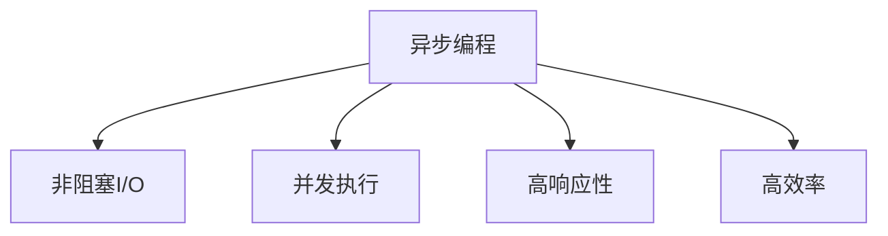
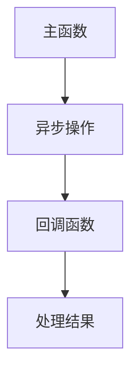
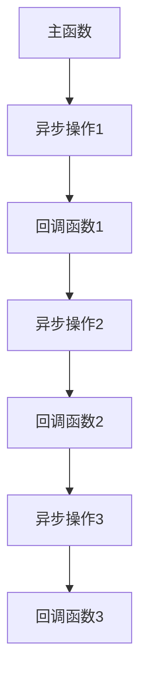
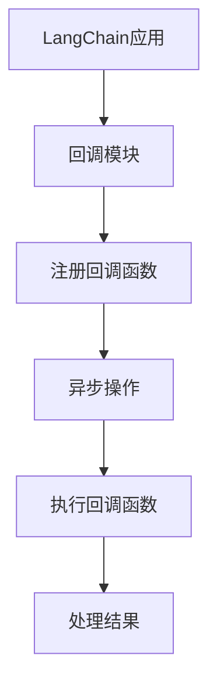
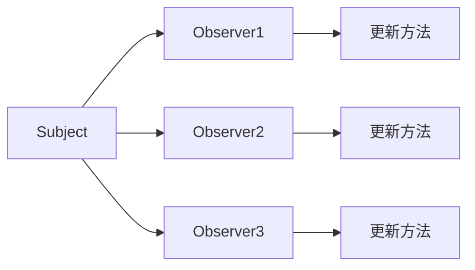

以下是文章正文部分的内容:

# 【LangChain编程：从入门到实践】回调模块

## 1. 背景介绍

### 1.1 问题的由来

在现代软件开发中,异步编程和并发处理是不可或缺的一部分。随着系统复杂度的增加,单线程同步执行已经无法满足高效率和高响应性的需求。因此,开发人员需要一种机制来处理长时间运行的任务,同时保持应用程序的响应能力。这就是回调模块(Callback Module)发挥作用的地方。

### 1.2 研究现状

回调模块是一种广泛使用的异步编程模式,它允许开发人员定义一个函数,该函数将在某个操作完成时被调用。这种模式在各种编程语言和框架中都有应用,例如JavaScript、Python、Java等。然而,传统的回调模块存在一些缺陷,例如回调地狱(Callback Hell)和可读性差等问题。为了解决这些问题,出现了许多新的异步编程模型,例如Promise、async/await等。

### 1.3 研究意义

LangChain是一个强大的Python库,用于构建可扩展的应用程序,其中包含了回调模块的实现。通过研究LangChain中的回调模块,我们可以更好地理解异步编程的概念和实践,并学习如何在实际项目中有效地使用它。此外,了解回调模块的内部工作原理也有助于我们更好地设计和优化异步系统。

### 1.4 本文结构

本文将从以下几个方面深入探讨LangChain中的回调模块:

1. 核心概念与联系
2. 核心算法原理与具体操作步骤
3. 数学模型和公式详细讲解与举例说明
4. 项目实践:代码实例和详细解释说明
5. 实际应用场景
6. 工具和资源推荐
7. 总结:未来发展趋势与挑战
8. 附录:常见问题与解答

## 2. 核心概念与联系

在深入探讨LangChain回调模块之前,我们需要先了解一些核心概念和它们之间的联系。

### 2.1 异步编程

异步编程是一种编程范式,它允许程序在等待某些操作完成时继续执行其他操作,而不是阻塞等待。这种方式可以提高程序的响应能力和效率,特别是在处理I/O密集型任务时。



### 2.2 回调函数

回调函数(Callback Function)是一种将函数作为参数传递给另一个函数的技术。当某个事件发生或操作完成时,回调函数就会被调用。这种模式在异步编程中非常常见,因为它允许程序在等待操作完成时继续执行其他任务。



### 2.3 回调地狱

虽然回调函数是一种有用的异步编程模式,但如果嵌套过多,代码就会变得难以阅读和维护,这种情况被称为"回调地狱"(Callback Hell)。为了解决这个问题,出现了许多新的异步编程模型,例如Promise和async/await。



### 2.4 LangChain回调模块

LangChain是一个用于构建可扩展的应用程序的Python库,其中包含了回调模块的实现。回调模块提供了一种机制,允许开发人员定义回调函数,并在特定事件或操作完成时执行这些函数。这样可以实现异步编程,提高应用程序的响应能力和效率。



## 3. 核心算法原理与具体操作步骤

### 3.1 算法原理概述

LangChain回调模块的核心算法原理是基于观察者模式(Observer Pattern)。观察者模式是一种行为设计模式,它定义了对象之间的一对多依赖关系,当一个对象的状态发生变化时,所有依赖于它的对象都会得到通知并自动更新。

在LangChain回调模块中,主要有两个角色:

1. **Subject(主题)**: 这是被观察的对象,它维护一个观察者列表,并在状态发生变化时通知所有观察者。在回调模块中,Subject通常是一个异步操作或事件。

2. **Observer(观察者)**: 这是观察Subject的对象,它实现了一个更新方法,用于接收Subject的状态变化通知。在回调模块中,Observer就是注册的回调函数。

当Subject的状态发生变化时,它会遍历观察者列表,并调用每个观察者的更新方法,将新的状态传递给它们。这样,观察者就可以根据Subject的状态变化做出相应的响应。



### 3.2 算法步骤详解

LangChain回调模块的核心算法步骤如下:

1. **创建Subject**: 首先,需要创建一个Subject对象,它代表了一个异步操作或事件。

2. **注册Observer**: 开发人员可以定义一个或多个回调函数作为Observer,并将它们注册到Subject中。

3. **执行异步操作**: 当异步操作开始时,Subject会进入一个等待状态。

4. **状态变化通知**: 一旦异步操作完成或发生特定事件,Subject的状态就会发生变化。

5. **调用Observer**: Subject会遍历观察者列表,并调用每个观察者的更新方法,将新的状态传递给它们。

6. **处理结果**: 观察者接收到状态变化通知后,可以根据需要执行相应的操作,例如处理异步操作的结果或执行后续任务。

以下是LangChain回调模块的伪代码:

```python
# Subject类
class Subject:
    def __init__(self):
        self.observers = []
        self.state = None

    def attach(self, observer):
        self.observers.append(observer)

    def detach(self, observer):
        self.observers.remove(observer)

    def notify(self, state):
        for observer in self.observers:
            observer.update(state)

    def run_async_operation(self):
        # 执行异步操作
        # ...
        # 操作完成后更新状态并通知观察者
        self.notify(new_state)

# Observer类
class Observer:
    def update(self, state):
        # 处理状态变化
        # ...
        pass

# 使用示例
subject = Subject()

# 注册观察者
observer1 = Observer()
observer2 = Observer()
subject.attach(observer1)
subject.attach(observer2)

# 执行异步操作
subject.run_async_operation()
```

### 3.3 算法优缺点

LangChain回调模块基于观察者模式的算法具有以下优点:

- **解耦**: Subject和Observer之间是松耦合的,它们可以独立地改变和扩展,而不会相互影响。

- **可扩展性**: 可以在运行时动态地添加或删除观察者,而无需修改Subject的代码。

- **复用性**: 同一个Subject可以有多个观察者,每个观察者可以根据自己的需求独立地处理状态变化。

- **异步编程**: 通过回调机制,可以实现异步编程,提高应用程序的响应能力和效率。

然而,这种算法也存在一些缺点:

- **潜在的内存泄漏**: 如果观察者没有被正确地从Subject中移除,就可能导致内存泄漏。

- **通知顺序问题**: 如果多个观察者需要按特定顺序执行,则需要额外的逻辑来控制通知顺序。

- **复杂性**: 当观察者和Subject之间存在复杂的依赖关系时,代码可能会变得难以维护和理解。

### 3.4 算法应用领域

LangChain回调模块基于观察者模式的算法可以应用于以下领域:

- **事件驱动编程**: 在事件驱动的系统中,回调模块可以用于处理各种事件,例如用户交互事件、网络事件等。

- **异步I/O操作**: 在处理I/O密集型任务时,回调模块可以用于异步执行操作,提高系统的响应能力和效率。

- **消息队列和发布/订阅系统**: 回调模块可以用于实现发布/订阅模式,其中Subject充当发布者,Observer充当订阅者。

- **观察者模式的实现**: 回调模块本身就是观察者模式的一种实现,可以应用于任何需要使用观察者模式的场景。

- **GUI编程**: 在图形用户界面(GUI)编程中,回调模块可以用于处理用户交互事件,例如按钮点击、窗口调整大小等。

## 4. 数学模型和公式详细讲解与举例说明

虽然LangChain回调模块主要是一种编程模式,但它也涉及到一些数学模型和公式,特别是在处理异步操作的结果时。在这一部分,我们将详细讲解一些相关的数学模型和公式,并给出具体的例子说明。

### 4.1 数学模型构建

在异步编程中,我们经常需要处理多个异步操作的结果,并对它们进行组合或计算。为了建立一个数学模型来描述这种情况,我们可以引入以下符号:

- $n$: 异步操作的数量
- $r_i$: 第 $i$ 个异步操作的结果,其中 $i \in \{1, 2, \ldots, n\}$
- $f$: 一个函数,用于组合或计算多个异步操作的结果

则我们可以将最终结果表示为:

$$
R = f(r_1, r_2, \ldots, r_n)
$$

其中 $R$ 是最终结果。

根据具体的应用场景,函数 $f$ 可以采取不同的形式,例如求和、求积、求平均值等。

### 4.2 公式推导过程

现在,我们来推导一个具体的公式,用于计算多个异步操作结果的平均值。

假设我们有 $n$ 个异步操作,每个操作的结果记为 $r_i$,其中 $i \in \{1, 2, \ldots, n\}$。我们希望计算这些结果的平均值。

首先,我们需要求出所有结果的总和:

$$
S = \sum_{i=1}^{n} r_i
$$

然后,将总和除以异步操作的数量 $n$,就可以得到平均值:

$$
\bar{R} = \frac{S}{n} = \frac{1}{n} \sum_{i=1}^{n} r_i
$$

其中 $\bar{R}$ 表示平均值。

这个公式可以用于计算多个异步操作结果的平均值,例如计算多个网络请求的平均响应时间、多个任务的平均执行时间等。

### 4.3 案例分析与讲解

为了更好地理解上述数学模型和公式,我们将通过一个具体的案例进行分析和讲解。

假设我们有一个Web应用程序,它需要从多个远程服务器获取数据。每个远程服务器的响应时间都不同,我们希望计算所有响应时间的平均值,以评估整体性能。

我们可以将每个远程服务器的响应时间视为一个异步操作的结果 $r_i$。假设我们有 $n$ 个远程服务器,那么我们可以使用之前推导的公式计算平均响应时间:

$$
\bar{R} = \frac{1}{n} \sum_{i=1}^{n} r_i
$$

其中 $r_i$ 表示第 $i$ 个远程服务器的响应时间。

例如,如果我们有 5 个远程服务器,它们的响应时间分别为 200ms、300ms、150ms、250ms 和 180ms,那么平均响应时间可以计算如下:

$$
\bar{R} = \frac{1}{5} (200 +