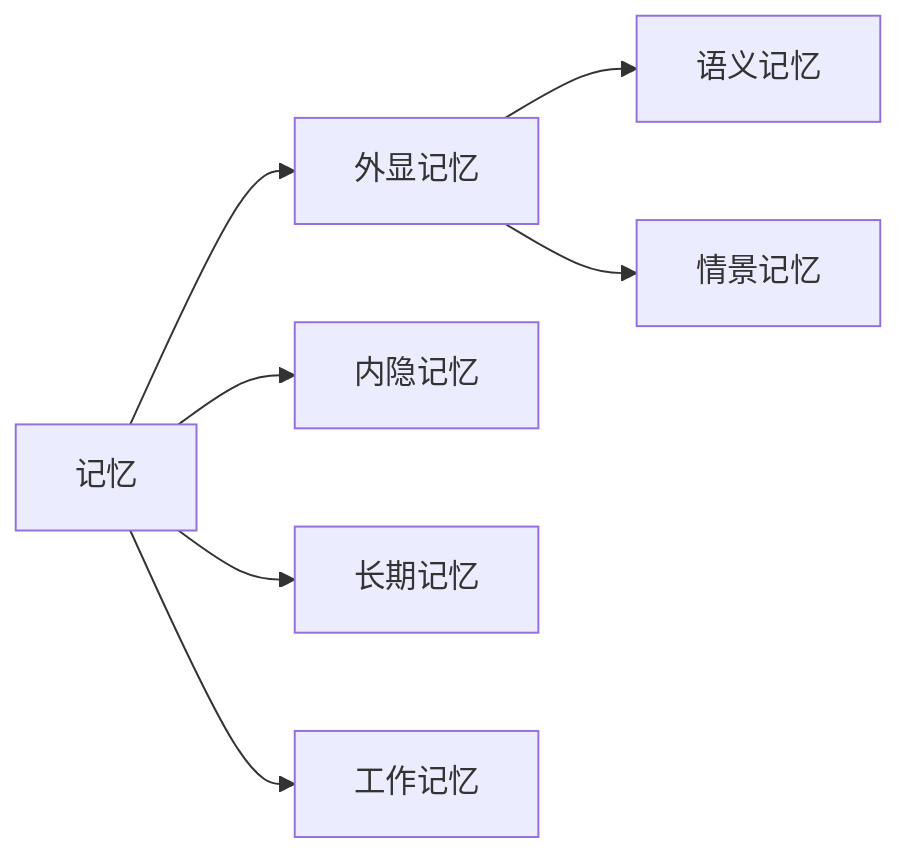

# 【大模型应用开发 动手做AI Agent】Agent的各种记忆机制

关键词：大模型、AI Agent、记忆机制、长期记忆、工作记忆、注意力机制、端到端记忆网络、LSTM

## 1. 背景介绍
### 1.1  问题的由来
随着人工智能技术的飞速发展,特别是大模型的出现,AI Agent已经在很多领域展现出了令人惊叹的能力。然而,要让AI Agent真正具备类似人类的智能,仅仅依靠强大的语言模型是远远不够的。人类之所以智能,很大程度上得益于我们拥有记忆能力。因此,赋予AI Agent记忆机制,让其能够像人一样学习、存储和利用知识,是实现通用人工智能的关键一环。

### 1.2  研究现状
目前,学术界和工业界已经提出了多种AI Agent的记忆机制。比较经典的有长短期记忆网络(LSTM)、注意力机制(Attention)、记忆增强神经网络(MANN)、可微分神经计算机(DNC)等。这些方法在问答、对话、推理等任务上取得了不错的效果。但现有的记忆机制还存在一些局限性,如记忆容量有限、缺乏知识的结构化表示、难以进行长期规划等。

### 1.3  研究意义
研究AI Agent的记忆机制,对于推动认知智能的发展具有重要意义:

1. 增强AI系统的学习和推理能力。拥有记忆,Agent可以积累知识,举一反三,表现出更加智能的行为。

2. 实现知识的持久存储和迁移。记忆机制让Agent能够将学到的知识永久保存,并运用到新的任务中。

3. 提高人机交互的体验。记忆让Agent能够理解上下文,记住人类的偏好,从而提供更加个性化的服务。

4. 探索类脑智能的奥秘。研究记忆机制有助于我们理解人脑认知的机理,为类脑智能系统的构建提供启发。

### 1.4  本文结构
本文将重点介绍几种主流的AI Agent记忆机制,分析其原理、特点和局限性。内容安排如下:

- 第2部分:核心概念与联系
- 第3部分:核心算法原理与具体操作步骤
- 第4部分:数学模型和公式详细讲解与举例说明
- 第5部分:项目实践:代码实例和详细解释说明
- 第6部分:实际应用场景
- 第7部分:工具和资源推荐
- 第8部分:总结:未来发展趋势与挑战
- 第9部分:附录:常见问题与解答

## 2. 核心概念与联系

在探讨AI Agent的记忆机制之前,我们先来了解几个核心概念:

- 记忆(Memory):将经验或知识进行编码、存储,并在需要时提取利用的认知功能。
- 长期记忆(Long-term Memory):能够长久保存的记忆,容量大,提取较慢。
- 工作记忆(Working Memory):暂时存储当前任务相关信息的记忆,容量小,提取速度快。
- 外显记忆(Explicit Memory):能够主动回忆起的事实性知识记忆。
- 内隐记忆(Implicit Memory):难以用语言描述但能潜移默化地影响行为的记忆,如操作技能。
- 语义记忆(Semantic Memory):关于概念、事实、规则等一般性知识的记忆。
- 情景记忆(Episodic Memory):关于特定事件、场景的记忆,带有时空标签。

这些概念相互关联,构成了人类复杂的记忆系统。在设计AI Agent的记忆机制时,我们往往借鉴其中的一些思想。比如LSTM对应工作记忆,Attention对应选择性注意,外部存储对应长期记忆,等等。

## 3. 核心算法原理 & 具体操作步骤
### 3.1  算法原理概述

目前主流的AI Agent记忆机制可以分为以下几类:

1. 基于RNN的记忆网络:通过循环神经网络(如LSTM)来隐式地维护一个记忆状态,实现对历史信息的记忆。

2. 基于Attention的记忆机制:通过Attention机制在历史信息中有选择地提取与当前任务相关的知识。

3. 基于外部存储的记忆:为Agent配备一个外部存储(如键值对存储),显式地存储结构化知识,供Agent查询。

4. 基于神经图灵机的可微分记忆:用可微分的数据结构(如磁带、图)来实现类似图灵机的记忆功能。

这些方法各有特点,可以根据任务的需求进行选择和改进。下面我们以LSTM和注意力机制为例,详细讲解其算法原理和操作步骤。

### 3.2  算法步骤详解

#### 3.2.1 基于LSTM的记忆网络

长短期记忆网络(LSTM)是一种特殊的RNN,通过引入门控机制,克服了普通RNN难以捕捉长距离依赖的问题。LSTM的核心是细胞状态(Cell State),它类似一条传送带,允许信息在序列的各个时间步之间流动。LSTM可以选择性地向细胞状态写入、删除信息,从而实现对历史信息的记忆。

LSTM的前向传播过程如下:

1. 遗忘门(Forget Gate)决定了上一时刻的细胞状态有多少保留到当前时刻:

$$
f_t = \sigma(W_f \cdot [h_{t-1}, x_t] + b_f)
$$

2. 输入门(Input Gate)决定了当前时刻的输入有多少写入细胞状态:

$$
i_t = \sigma(W_i \cdot [h_{t-1}, x_t] + b_i) \
\tilde{C}_t = \tanh(W_C \cdot [h_{t-1}, x_t] + b_C)
$$

3. 更新细胞状态:

$$
C_t = f_t * C_{t-1} + i_t * \tilde{C}_t
$$

4. 输出门(Output Gate)决定了细胞状态有多少输出:

$$
o_t = \sigma(W_o \cdot [h_{t-1}, x_t] + b_o) \
h_t = o_t * \tanh(C_t)
$$

其中,$\sigma$是sigmoid激活函数,$*$表示按元素相乘。

通过这种门控机制,LSTM能够自适应地决定记忆哪些信息、遗忘哪些信息,从而在序列建模任务中取得了巨大成功。将LSTM用于AI Agent,可以让其根据历史对话上下文动态调整记忆,生成更加连贯、个性化的回复。

#### 3.2.2 基于Attention的记忆机制

Attention机制的核心思想是,从一组向量中有选择地提取与当前任务最相关的信息。常见的Attention函数有:

- Dot-Product Attention:

$$
Attention(Q,K,V) = \text{softmax}(\frac{QK^T}{\sqrt{d_k}})V
$$

- Additive Attention:

$$
Attention(Q,K,V) = \text{softmax}(W_2\tanh(W_1[Q;K]))V
$$

其中,$Q$是查询向量(如当前解码器隐状态),$K$是键向量(如编码器隐状态),$V$是值向量(如编码器隐状态),$d_k$是向量维度。Attention的输出是值向量的加权和,权重由查询向量和键向量的相似度决定。

将Attention用于AI Agent的记忆,主要有两种方式:

1. 将Attention用于Agent的历史观察或动作,根据当前状态从历史经验中提取相关知识。

2. 将Attention用于外部知识库,根据当前对话从结构化知识中检索所需信息。

第一种方式让Agent能够回忆起与当前情景相似的历史经历,第二种方式让Agent能够利用先验知识回答问题。两者结合,可以大大增强Agent的知识获取和语境理解能力。

### 3.3  算法优缺点

- LSTM的优点是结构简单,训练稳定,容易集成到各种神经网络架构中。缺点是记忆容量有限,难以存储大规模结构化知识。

- 基于Attention的记忆机制优点是提取信息的高效性和解释性,缺点是需要预先定义好键值对的表示方式,而且每次都要重新计算Attention,计算开销大。

- 外部存储记忆的优点是知识容量大,使用灵活,缺点是难以端到端训练,需要专门设计存储的数据结构。

- 可微分神经记忆的优点是可以端到端训练,缺点是模型复杂度高,目前处于研究阶段。

### 3.4  算法应用领域

记忆机制几乎可以用于所有需要上下文信息的AI任务,如:

- 对话系统:根据历史对话生成回复,记住用户提及的事实
- 问答系统:从大规模知识库中检索答案,具备多轮推理能力
- 推荐系统:根据用户的历史行为和偏好给出个性化推荐
- 自然语言推理:根据背景知识进行常识推理和语义理解
- 强化学习:将状态与历史轨迹关联,进行长期规划和策略优化

## 4. 数学模型和公式 & 详细讲解 & 举例说明
### 4.1  数学模型构建

为了更好地理解记忆机制背后的数学原理,我们以一个简化版的端到端记忆网络(End-to-End Memory Network)为例,详细推导其前向计算过程。该网络由一个记忆矩阵$M$和三个映射矩阵$A$,$C$,$W$组成。给定一个输入序列$x_1,...,x_n$和一个查询$q$,网络的目标是生成一个输出向量$o$。

1. 将输入序列转化为记忆向量,存入记忆矩阵$M$:

$$
m_i = Ax_i, \forall i \in [1,n] \
M = [m_1, ..., m_n]^T
$$

2. 将查询$q$映射为内部状态向量$u$:

$$
u = Aq
$$

3. 用内部状态$u$去查询记忆$M$,得到注意力权重:

$$
p = \text{softmax}(Mu)
$$

4. 根据注意力权重$p$,计算记忆的加权和:

$$
o = \sum_{i=1}^n p_i C_i
$$

5. 将$o$通过一个线性变换得到最终输出:

$$
\hat{a} = \text{softmax}(Wo)
$$

可以看到,端到端记忆网络本质上是一个将输入序列$x$映射为输出向量$\hat{a}$的函数:

$$
\hat{a} = f(x_1, ..., x_n, q) = \text{softmax}(W(\sum_{i=1}^n p_i C_i))
$$

其中权重$p_i$是通过Attention机制计算的:

$$
p_i = \frac{\exp(u^Tm_i)}{\sum_{j=1}^n \exp(u^Tm_j)}
$$

### 4.2  公式推导过程

端到端记忆网络的训练目标是最小化真实答案$a$与预测答案$\hat{a}$之间的交叉熵损失:

$$
\mathcal{L} = -\sum_{i=1}^{|V|} a_i \log \hat{a}_i
$$

其中$|V|$是词表大小。根据链式法则,损失对网络参数的梯度为:

$$
\frac{\partial \mathcal{L}}{\partial W} = (\hat{a} - a)o^T \
\frac{\partial \mathcal{L}}{\partial C} = (\hat{a} - a)W^Tp \
\frac{\partial \mathcal{L}}{\partial A} = (\hat{a} - a)W^T(\sum_{i=1}^n p_i \frac{\partial C_i}{\partial A}) + (\hat{a} - a)W^T(\sum_{i=1}^n C_i \frac{\partial p_i}{\partial A})
$$

其中:

$$
\frac{\partial C_i}{\partial A} = \frac{\partial C_i}{\partial m_i} \frac{\partial m_i}{\partial A} = (x_i)^T \
\frac{\partial p_i}{\partial A} = p_i(1-p_i