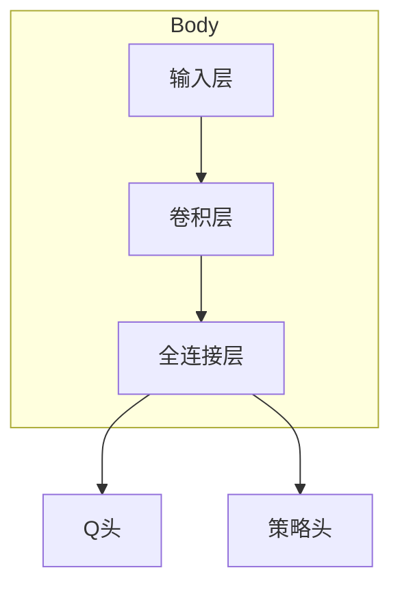

# 一切皆是映射：AI Q-learning策略网络的搭建

## 1. 背景介绍

### 1.1 问题的由来

在人工智能领域中,强化学习(Reinforcement Learning)是一种重要的机器学习范式,它关注智能体如何通过与环境的交互来学习获取最优策略。传统的强化学习算法,如Q-learning、Sarsa等,通常将状态-行为值函数(Q函数)表示为查找表或者神经网络。然而,这种方法在处理高维观测数据时会遇到维数灾难的问题,导致查找表过大或者神经网络结构复杂。

### 1.2 研究现状

为了解决高维观测数据的挑战,研究人员提出了深度强化学习(Deep Reinforcement Learning)的概念,将深度神经网络引入强化学习领域。其中,Deep Q-Network(DQN)是一种里程碑式的算法,它使用深度卷积神经网络来近似Q函数,从而可以直接从高维原始输入(如图像)中学习策略,取得了令人瞩目的成就。

然而,DQN仍然存在一些缺陷,如算法不够稳定、收敛慢等。为了克服这些缺陷,研究人员提出了各种改进的算法,例如Double DQN、Dueling DQN、Prioritized Experience Replay等。这些算法在保留DQN框架的同时,对网络结构、训练过程等进行了优化,提高了算法的性能和稳定性。

### 1.3 研究意义

虽然已有多种改进的DQN算法,但是如何设计一个高效、稳定的深度强化学习网络仍然是一个值得探索的课题。本文将介绍一种新颖的深度强化学习网络架构——Q-learning策略网络(Q-Policy Network),它将Q函数和策略函数统一到同一个神经网络中,简化了网络结构,提高了计算效率。

Q-learning策略网络的核心思想是将状态-行为映射到Q值和策略概率,从而实现值函数估计和策略学习的统一。该网络架构不仅保留了DQN的优点,而且具有更好的计算效率和收敛性能,在复杂的强化学习任务中表现出色。

### 1.4 本文结构

本文将从以下几个方面详细介绍Q-learning策略网络:

1. 核心概念与联系
2. 核心算法原理与具体操作步骤
3. 数学模型和公式详细推导
4. 项目实践:代码实例和详细解释
5. 实际应用场景
6. 工具和资源推荐
7. 总结:未来发展趋势与挑战
8. 附录:常见问题与解答

## 2. 核心概念与联系

在介绍Q-learning策略网络之前,我们先回顾一下强化学习和深度学习的一些核心概念。

**强化学习(Reinforcement Learning)**是一种机器学习范式,它关注智能体如何通过与环境的交互来学习获取最优策略。强化学习包含四个基本元素:

1. **环境(Environment)**: 智能体所处的外部世界,它可以是一个游戏、机器人控制系统或者其他任何可交互的系统。
2. **状态(State)**: 环境的当前状态,通常由一组观测值表示。
3. **行为(Action)**: 智能体在当前状态下可以采取的行动。
4. **奖励(Reward)**: 环境对智能体当前行为的反馈,通常是一个标量值,表示行为的好坏程度。

强化学习的目标是找到一个最优策略(Optimal Policy),使得在该策略指导下,智能体可以从初始状态出发,最大化未来累计奖励。

**深度学习(Deep Learning)**是机器学习的一个子领域,它使用深度神经网络来模拟人类大脑的工作原理,从数据中学习特征表示和模式。深度神经网络通常由多个隐藏层组成,每一层对输入数据进行非线性变换,从而可以学习到越来越抽象的特征表示。

**Q-learning**是强化学习中的一种经典算法,它通过估计状态-行为值函数(Q函数)来学习最优策略。Q函数定义为在给定状态下采取某个行为,然后遵循最优策略时可以获得的期望累计奖励。通过不断更新Q函数,Q-learning算法可以逐步找到最优策略。

**深度Q网络(Deep Q-Network, DQN)**是将深度学习引入Q-learning的一种方法。它使用深度神经网络来近似Q函数,从而可以直接从高维原始输入(如图像)中学习策略,而不需要手工设计特征。DQN取得了在Atari游戏中超越人类水平的成就,被视为深度强化学习的里程碑式算法。

**策略梯度(Policy Gradient)**是另一种常用的深度强化学习算法,它直接学习策略函数(Policy Function),而不是通过估计值函数来间接获得策略。策略梯度算法通过梯度上升的方式,调整策略函数的参数,使得在该策略下的期望累计奖励最大化。

Q-learning策略网络将Q-learning和策略梯度的思想结合起来,使用一个统一的神经网络同时学习Q函数和策略函数,从而获得更好的计算效率和收敛性能。

## 3. 核心算法原理与具体操作步骤

### 3.1 算法原理概述

Q-learning策略网络的核心思想是将状态-行为映射到Q值和策略概率,从而实现值函数估计和策略学习的统一。具体来说,该网络由两个头(Head)组成:

1. **Q头(Q-Head)**: 输出每个可能行为的Q值估计。
2. **策略头(Policy Head)**: 输出每个可能行为的概率分布(策略)。

在训练过程中,Q头和策略头共享网络的主体部分(Body),但具有不同的输出层。通过交替优化两个头的损失函数,网络可以同时学习Q函数和策略函数。

算法的工作流程如下:

1. 从经验回放池(Experience Replay Buffer)中采样一批数据。
2. 前向传播:将状态输入到网络,获得Q值估计和策略概率分布。
3. 计算Q头的损失函数,例如平方损失(Mean Squared Error)或者Huber损失。
4. 计算策略头的损失函数,例如交叉熵损失(Cross Entropy Loss)。
5. 计算总损失函数,通常是Q头损失和策略头损失的加权和。
6. 反向传播:根据总损失函数计算梯度,并更新网络参数。
7. 重复上述步骤,直到网络收敛。

在测试(推理)阶段,只需要使用策略头的输出作为行为选择的概率分布即可。

### 3.2 算法步骤详解

下面我们详细介绍Q-learning策略网络算法的具体步骤。

#### 3.2.1 网络架构

Q-learning策略网络的架构如下图所示:

- **Body**: 网络的主体部分,通常由卷积层和全连接层组成。它对输入的状态进行特征提取和非线性变换。
- **Q头(Q-Head)**: 一个全连接层,输出每个可能行为的Q值估计。
- **策略头(Policy Head)**: 一个全连接层,输出每个可能行为的概率分布(策略)。

#### 3.2.2 前向传播

给定当前状态 $s_t$,我们将其输入到网络中,得到Q值估计 $Q(s_t, a)$ 和策略概率分布 $\pi(a|s_t)$:

$$
Q(s_t, a), \pi(a|s_t) = \text{Network}(s_t)
$$

其中, $a$ 表示可能的行为。

#### 3.2.3 计算Q头损失函数

Q头的目标是估计真实的Q函数,因此我们可以使用平方损失(Mean Squared Error)或者Huber损失作为损失函数:

$$
\mathcal{L}_Q = \mathbb{E}_{(s_t, a_t, r_t, s_{t+1}) \sim \mathcal{D}} \left[ \left( Q(s_t, a_t) - y_t \right)^2 \right]
$$

$$
y_t = r_t + \gamma \max_{a'} Q(s_{t+1}, a')
$$

其中, $\mathcal{D}$ 表示经验回放池, $(s_t, a_t, r_t, s_{t+1})$ 是从中采样的一个转移样本, $y_t$ 是基于贝尔曼方程计算的目标Q值, $\gamma$ 是折扣因子。

#### 3.2.4 计算策略头损失函数

策略头的目标是学习一个好的策略,我们可以使用策略梯度的思想,将累计奖励的期望作为目标函数:

$$
J(\theta) = \mathbb{E}_{\pi_\theta} \left[ \sum_{t=0}^{\infty} \gamma^t r_t \right]
$$

其中, $\pi_\theta$ 表示由参数 $\theta$ 确定的策略, $r_t$ 是第 $t$ 个时刻的奖励。

为了最大化 $J(\theta)$,我们可以计算其梯度:

$$
\nabla_\theta J(\theta) = \mathbb{E}_{\pi_\theta} \left[ \sum_{t=0}^{\infty} \nabla_\theta \log \pi_\theta(a_t|s_t) Q^{\pi_\theta}(s_t, a_t) \right]
$$

在实践中,我们通常使用策略梯度定理的另一种形式:

$$
\nabla_\theta J(\theta) \approx \mathbb{E}_{(s_t, a_t, r_t) \sim \mathcal{D}} \left[ \nabla_\theta \log \pi_\theta(a_t|s_t) \left( Q(s_t, a_t) - b(s_t) \right) \right]
$$

其中, $b(s_t)$ 是一个基线函数,用于减小方差。通常我们可以选择 $b(s_t) = V(s_t)$,即状态值函数。

因此,策略头的损失函数可以定义为:

$$
\mathcal{L}_\pi = -\mathbb{E}_{(s_t, a_t, r_t) \sim \mathcal{D}} \left[ \log \pi_\theta(a_t|s_t) \left( Q(s_t, a_t) - V(s_t) \right) \right]
$$

在实践中,我们可以使用Q头的输出作为 $Q(s_t, a_t)$,而 $V(s_t)$ 可以近似为 $\max_a Q(s_t, a)$。

#### 3.2.5 总损失函数和优化

最终,我们将Q头损失和策略头损失加权求和,得到总损失函数:

$$
\mathcal{L} = \alpha \mathcal{L}_Q + (1 - \alpha) \mathcal{L}_\pi
$$

其中, $\alpha$ 是一个超参数,用于平衡两个损失函数的重要性。

在每一个训练步骤中,我们可以采用以下操作:

1. 从经验回放池中采样一批数据。
2. 前向传播,获得Q值估计和策略概率分布。
3. 计算Q头损失 $\mathcal{L}_Q$ 和策略头损失 $\mathcal{L}_\pi$。
4. 计算总损失函数 $\mathcal{L}$。
5. 反向传播,根据总损失函数计算梯度。
6. 使用优化器(如Adam)更新网络参数。

重复上述步骤,直到网络收敛。

### 3.3 算法优缺点

Q-learning策略网络算法具有以下优点:

1. **统一架构**: 将Q函数和策略函数统一到同一个神经网络中,简化了网络结构,提高了计算效率。
2. **收敛性能好**: 通过同时优化Q函数和策略函数,可以获得更好的收敛性能和策略质量。
3. **灵活性强**: 可以根据具体任务,调整Q头和策略头的损失函数权重,实现更好的性能。

但是,该算法也存在一些缺点:

1. **训练复杂度高**: 需要同时优化两个头的损失函数,训练过程相对复杂。
2. **超参数敏感**: 损失函数权重等超参数的选择对算法性能影响较大,需要进行调参。
3. **探索-利用权衡**: 仍然需要解决强化学习中的探索-利用权衡问题,例如引入 $\epsilon