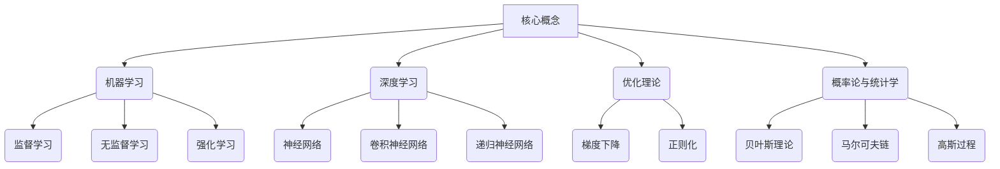
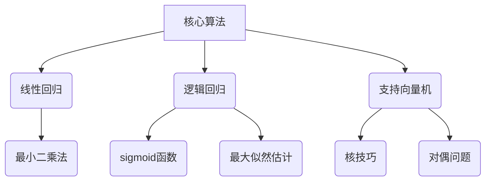

好的,我明白了您的要求。以下是题为《人工智能数学基础原理与代码实战案例讲解》的技术博客文章正文内容:

# 人工智能数学基础原理与代码实战案例讲解

## 1. 背景介绍

### 1.1 问题的由来

在当今的数字时代,人工智能(AI)已经渗透到我们生活的方方面面,从语音助手到无人驾驶汽车,从医疗诊断到金融投资决策,AI无处不在。然而,AI的发展并非一蹴而就,它植根于数学、统计学、计算机科学等多个学科领域,需要对底层原理有深刻的理解。

### 1.2 研究现状

近年来,AI领域取得了长足的进步,尤其是深度学习(Deep Learning)技术的兴起,使得AI在计算机视觉、自然语言处理、推荐系统等领域取得了突破性的进展。但同时,我们也意识到AI系统存在着诸多挑战,如缺乏可解释性、数据偏差、隐私与安全等问题。因此,深入研究AI的数学基础原理,对于提高AI系统的性能、可靠性和透明度至关重要。

### 1.3 研究意义

本文旨在为读者提供AI数学基础原理的全面解读,并结合实战案例,帮助读者掌握AI算法的设计与实现。通过对核心概念、算法原理、数学模型、代码实现的深入剖析,读者可以全面了解AI技术的本质,提高对AI系统的理解和掌控能力。

### 1.4 本文结构

本文共分为8个部分:
1. 背景介绍
2. 核心概念与联系
3. 核心算法原理与具体操作步骤
4. 数学模型和公式详细讲解与举例说明
5. 项目实践:代码实例和详细解释说明
6. 实际应用场景
7. 工具和资源推荐
8. 总结:未来发展趋势与挑战

## 2. 核心概念与联系

在深入探讨AI算法之前,我们需要了解一些核心概念,这些概念贯穿于整个AI领域,是构建AI系统的基石。

这些核心概念相互关联、相辅相成,共同构成了AI技术的理论基础。例如,机器学习是AI的一个重要分支,包括监督学习、无监督学习和强化学习等范式;深度学习则是机器学习的一种特殊形式,利用神经网络模型来解决复杂的任务;优化理论为训练模型提供了高效的算法,如梯度下降和正则化技术;概率论和统计学则为AI系统提供了处理不确定性和噪声数据的理论支撑。

掌握这些核心概念有助于我们全面理解AI技术的本质,为后续的算法原理和实战案例奠定坚实的基础。

## 3. 核心算法原理与具体操作步骤

### 3.1 算法原理概述

在AI领域,有许多经典的算法,每一种算法都针对特定的问题场景,采用不同的数学原理和计算模型。本节将重点介绍三种核心算法:线性回归、逻辑回归和支持向量机(SVM)。

1. **线性回归**是一种常用的监督学习算法,旨在找到自变量和因变量之间的线性关系。它基于最小二乘法,通过最小化预测值与实际值之间的均方误差,来估计回归系数。

2. **逻辑回归**则是一种用于分类任务的算法,它通过sigmoid函数将线性回归的输出映射到(0,1)区间,从而实现二分类。逻辑回归的参数估计通常采用最大似然估计方法。

3. **支持向量机(SVM)**是一种有监督的非线性分类模型,其核心思想是在高维空间中寻找一个超平面,使得不同类别的数据点能够被很好地分开。SVM利用了核技巧和对偶问题的理论,能够高效地解决非线性可分问题。

### 3.2 算法步骤详解

接下来,我们将详细解释每种算法的具体操作步骤。

#### 3.2.1 线性回归算法步骤

1. 数据预处理:对输入数据进行归一化或标准化处理,以消除不同特征之间量级的差异。
2. 定义损失函数:通常采用均方误差作为损失函数,目标是最小化预测值与真实值之间的差异。
3. 求解回归系数:利用最小二乘法,通过解析方法或梯度下降法求解回归系数。
4. 模型评估:在测试集上评估模型的性能,常用指标包括均方根误差(RMSE)和决定系数(R^2)。

#### 3.2.2 逻辑回归算法步骤

1. 数据预处理:对输入数据进行归一化或标准化处理,并进行特征编码(如one-hot编码)。
2. 定义损失函数:通常采用交叉熵作为损失函数,目标是最小化预测概率与真实标签之间的差异。
3. 求解模型参数:利用最大似然估计或梯度下降法求解模型参数。
4. 模型评估:在测试集上评估模型的性能,常用指标包括准确率、精确率、召回率和F1分数。

#### 3.2.3 支持向量机算法步骤

1. 数据预处理:对输入数据进行归一化或标准化处理。
2. 选择核函数:根据数据的特征,选择合适的核函数,如线性核、多项式核或高斯核。
3. 求解对偶问题:通过求解对偶问题,找到最优超平面和支持向量。
4. 模型评估:在测试集上评估模型的性能,常用指标包括准确率、精确率、召回率和F1分数。

### 3.3 算法优缺点

每种算法都有其优缺点,了解这些优缺点有助于我们在实际应用中选择合适的算法。

- **线性回归**:
  - 优点:模型简单,可解释性强,计算效率高。
  - 缺点:只能捕捉线性关系,对非线性数据效果不佳。

- **逻辑回归**:
  - 优点:模型简单,可解释性强,可以处理二分类问题。
  - 缺点:对于非线性可分数据效果不佳,存在过拟合风险。

- **支持向量机**:
  - 优点:可以有效处理高维非线性数据,泛化能力强。
  - 缺点:对缺失数据和噪声数据敏感,计算复杂度较高。

### 3.4 算法应用领域

这三种算法在不同的应用领域发挥着重要作用:

- **线性回归**常用于回归分析、趋势预测、金融建模等场景。
- **逻辑回归**广泛应用于文本分类、垃圾邮件过滤、疾病诊断等二分类任务。
- **支持向量机**在图像识别、手写体识别、基因表达分析等领域表现出色。

## 4. 数学模型和公式详细讲解与举例说明

### 4.1 数学模型构建

在介绍具体的公式之前,我们需要先构建数学模型,将现实世界的问题抽象为数学符号和方程。以线性回归为例,我们可以将自变量和因变量之间的关系表示为:

$$y = \theta_0 + \theta_1x_1 + \theta_2x_2 + ... + \theta_nx_n$$

其中,y是因变量,x_i是第i个自变量,$\theta_i$是对应的回归系数。我们的目标是找到一组最优的回归系数$\theta$,使得预测值$\hat{y}$与真实值y之间的差异最小。

对于逻辑回归和SVM,我们也可以构建类似的数学模型,只是具体的函数形式和优化目标会有所不同。

### 4.2 公式推导过程

一旦建立了数学模型,我们就可以推导出相应的公式,用于求解模型参数或进行预测。以线性回归为例,我们可以通过最小二乘法推导出闭式解:

$$\theta = (X^TX)^{-1}X^Ty$$

其中,X是输入数据矩阵,y是标签向量。这个公式告诉我们如何通过一步计算就能获得最优的回归系数$\theta$。

对于逻辑回归,我们可以通过最大似然估计推导出对数似然函数:

$$l(\theta) = \sum_{i=1}^{m}y^{(i)}\log(h_\theta(x^{(i)})) + (1-y^{(i)})\log(1-h_\theta(x^{(i)}))$$

其中,$h_\theta(x)$是sigmoid函数,用于将线性回归的输出映射到(0,1)区间。我们的目标是最大化对数似然函数,从而获得最优的模型参数$\theta$。

对于SVM,我们需要引入拉格朗日乘数法,将原始优化问题转化为对偶问题,从而简化计算复杂度。

通过这些公式推导,我们可以深入理解算法的数学原理,为后续的代码实现奠定基础。

### 4.3 案例分析与讲解

为了帮助读者更好地理解这些公式和数学模型,我们将通过一个实际案例进行分析和讲解。假设我们有一个房价预测的数据集,包含房屋面积、卧室数量、地理位置等特征,以及对应的房价标签。我们的目标是构建一个模型,预测给定特征下的房价。

#### 4.3.1 线性回归案例

首先,我们可以使用线性回归模型来拟合这个数据集。我们将房屋面积、卧室数量等特征作为自变量,房价作为因变量,构建线性回归方程:

$$price = \theta_0 + \theta_1area + \theta_2bedrooms + \theta_3location + ...$$

通过最小二乘法求解回归系数$\theta$,我们就可以获得一个线性模型,用于预测新样本的房价。

#### 4.3.2 逻辑回归案例

如果我们将问题转化为二分类任务,即判断房价是否超过某个阈值,我们就可以使用逻辑回归模型。我们将房价标签进行二值化处理(0或1),然后使用sigmoid函数将线性回归的输出映射到(0,1)区间,表示样本属于高房价或低房价的概率。

通过最大似然估计,我们可以获得最优的模型参数$\theta$,从而对新样本进行分类预测。

#### 4.3.3 支持向量机案例

对于这个房价预测问题,我们还可以尝试使用支持向量机模型。由于房价与特征之间可能存在非线性关系,我们可以选择一个合适的核函数(如高斯核)来映射数据到高维空间,使其在高维空间中线性可分。

通过求解对偶问题,我们可以找到最优超平面和支持向量,从而对新样本进行预测和分类。

通过这些案例,我们可以更好地理解不同算法的适用场景和优缺点。线性回归适用于简单的线性问题,但对非线性数据效果不佳;逻辑回归可以解决二分类问题,但也存在一定的局限性;而支持向量机则更加通用,能够处理高维非线性数据,但计算复杂度较高。

### 4.4 常见问题解答

在实际应用中,我们可能会遇到一些常见问题,如:

1. **如何处理缺