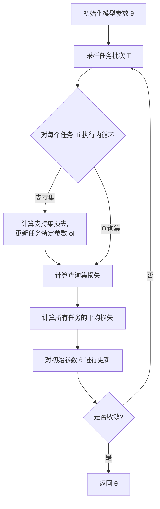

# 元学习 (Meta Learning) 原理与代码实例讲解

## 1. 背景介绍

### 1.1 问题的由来

在传统的机器学习范式中，我们通常会为每个新任务从头开始训练一个全新的模型。这种方法存在一些固有的缺陷和局限性。首先,对于每个新任务都需要大量的训练数据和计算资源,这在实际应用中可能是不现实的。其次,这种方法无法利用以前学习到的知识和经验,从而导致了知识的孤岛化,无法实现知识的迁移和共享。

为了解决这些问题,元学习(Meta Learning)应运而生。元学习旨在从过去的任务和经验中学习,以便更快、更有效地适应新的任务。它试图构建一种能够快速学习新知识和技能的通用学习机制,从而实现知识的高效迁移和共享。

### 1.2 研究现状

近年来,元学习在机器学习领域引起了广泛关注,成为一个热门的研究方向。研究人员提出了多种元学习算法和框架,如基于优化的元学习(Optimization-Based Meta-Learning)、基于模型的元学习(Model-Based Meta-Learning)和基于指标的元学习(Metric-Based Meta-Learning)等。这些方法在不同的应用场景下展现出了不同的优势和潜力。

然而,元学习仍然面临着一些挑战,如如何有效地从少量数据中学习、如何处理任务之间的差异性、如何设计通用的元学习框架等。这些问题都需要进一步的研究和探索。

### 1.3 研究意义

元学习的研究对于推动人工智能的发展具有重要意义。它有望解决传统机器学习方法中的一些固有缺陷,提高学习效率和知识迁移能力。同时,元学习也为构建通用人工智能(Artificial General Intelligence, AGI)奠定了理论基础和技术支撑。

此外,元学习在实际应用中也具有广阔的前景。它可以应用于少样本学习(Few-Shot Learning)、持续学习(Continual Learning)、多任务学习(Multi-Task Learning)等领域,为解决实际问题提供了新的思路和方法。

### 1.4 本文结构

本文将全面介绍元学习的核心概念、原理和算法,并通过代码实例和案例分析,帮助读者深入理解元学习的实现细节和应用场景。文章的主要结构如下:

1. 背景介绍
2. 核心概念与联系
3. 核心算法原理与具体操作步骤
4. 数学模型和公式详细讲解与举例说明
5. 项目实践:代码实例和详细解释说明
6. 实际应用场景
7. 工具和资源推荐
8. 总结:未来发展趋势与挑战
9. 附录:常见问题与解答

## 2. 核心概念与联系

在深入探讨元学习的原理和算法之前,我们需要先了解一些核心概念和它们之间的联系。

### 2.1 任务 (Task)

在元学习中,我们将需要学习的具体问题称为任务(Task)。每个任务都有自己的数据集、目标函数和评估指标。例如,在图像分类领域,将不同类别的图像数据集视为不同的任务;在机器人控制领域,控制机器人完成不同动作也可以看作是不同的任务。

### 2.2 元训练集 (Meta-Training Set)

元训练集是一组用于训练元学习模型的任务集合。在训练过程中,元学习算法会在这些任务上进行学习,以获取一种快速适应新任务的能力。元训练集中的每个任务都被称为元训练任务(Meta-Training Task)。

### 2.3 元测试集 (Meta-Testing Set)

元测试集是一组用于评估元学习模型性能的任务集合。这些任务与元训练集中的任务是不同的,用于测试元学习模型在新任务上的适应和泛化能力。元测试集中的每个任务都被称为元测试任务(Meta-Testing Task)。

### 2.4 内循环 (Inner Loop)

内循环是指在每个元训练任务上进行的快速适应过程。在这个过程中,元学习算法会根据当前任务的数据,对模型的参数进行微调或更新,以便更好地适应该任务。

### 2.5 外循环 (Outer Loop)

外循环是指在整个元训练集上进行的优化过程。在这个过程中,元学习算法会根据内循环中快速适应的结果,调整模型的初始参数或元学习器的参数,以提高在所有元训练任务上的整体性能。

### 2.6 元学习器 (Meta-Learner)

元学习器是指用于执行元学习过程的模型或算法。它的目标是学习一种快速适应新任务的能力,而不是直接学习任何特定任务的知识。常见的元学习器包括基于优化的元学习器、基于模型的元学习器和基于指标的元学习器等。

这些核心概念相互关联,共同构成了元学习的基本框架。下面,我们将详细介绍元学习的核心算法原理和具体实现步骤。

## 3. 核心算法原理与具体操作步骤

元学习算法的核心思想是通过在一系列相关任务上进行训练,学习一种快速适应新任务的能力。这种能力可以体现在模型的初始参数、优化策略或度量函数等方面。根据不同的实现方式,元学习算法可以分为几大类:基于优化的元学习、基于模型的元学习和基于指标的元学习。

### 3.1 算法原理概述

#### 3.1.1 基于优化的元学习 (Optimization-Based Meta-Learning)

基于优化的元学习算法旨在学习一种良好的初始参数,使得在新任务上只需要少量的梯度更新步骤,就可以快速适应该任务。这种方法的核心思想是,在元训练过程中,通过在多个任务上进行优化,找到一组通用的初始参数,使得在新任务上只需要少量的梯度步骤,就可以获得良好的性能。

代表性算法包括 MAML (Model-Agnostic Meta-Learning)、Reptile 等。

#### 3.1.2 基于模型的元学习 (Model-Based Meta-Learning)

基于模型的元学习算法旨在学习一个可以快速生成新模型的生成模型(Generator Model)。在新任务到来时,生成模型可以根据新任务的少量数据,快速生成一个适合该任务的新模型。

代表性算法包括 Meta-SGD、Meta-LSTM 等。

#### 3.1.3 基于指标的元学习 (Metric-Based Meta-Learning)

基于指标的元学习算法旨在学习一种良好的相似性度量函数,使得在新任务上,可以通过与已知任务的相似性来快速获取新任务的解决方案。这种方法的核心思想是,如果两个任务足够相似,那么它们的解决方案也应该相似。

代表性算法包括 Siamese Networks、Matching Networks 等。

### 3.2 算法步骤详解

下面,我们将以 MAML 算法为例,详细介绍基于优化的元学习算法的具体实现步骤。

#### 3.2.1 MAML 算法步骤

MAML 算法的主要步骤如下:

1. **初始化** : 初始化模型参数 $\theta$。

2. **采样任务批次** : 从元训练集中随机采样一个任务批次 $\mathcal{T}$,每个任务 $\mathcal{T}_i$ 包含支持集 $\mathcal{D}_i^{tr}$ 和查询集 $\mathcal{D}_i^{val}$。

3. **内循环** : 对于每个任务 $\mathcal{T}_i$,执行以下步骤:
   a. 计算支持集 $\mathcal{D}_i^{tr}$ 上的损失,并通过梯度下降对模型参数 $\theta$ 进行更新,获得任务特定参数 $\phi_i$:

      $$\phi_i = \theta - \alpha \nabla_\theta \mathcal{L}_{\mathcal{T}_i}(\theta, \mathcal{D}_i^{tr})$$

      其中 $\alpha$ 是内循环的学习率。

   b. 计算查询集 $\mathcal{D}_i^{val}$ 上的损失,作为任务 $\mathcal{T}_i$ 的性能评估指标:

      $$\mathcal{L}_i(\phi_i) = \mathcal{L}_{\mathcal{T}_i}(\phi_i, \mathcal{D}_i^{val})$$

4. **外循环** : 计算所有任务的平均损失,并对初始参数 $\theta$ 进行更新:

   $$\theta \leftarrow \theta - \beta \nabla_\theta \sum_{\mathcal{T}_i \sim \mathcal{T}} \mathcal{L}_i(\phi_i)$$

   其中 $\beta$ 是外循环的学习率。

5. **重复** : 重复步骤 2-4,直到模型收敛。

通过上述步骤,MAML 算法可以学习到一组良好的初始参数 $\theta$,使得在新任务上,只需要少量的梯度更新步骤,就可以快速适应该任务。

#### 3.2.2 算法流程图

为了更好地理解 MAML 算法的执行流程,我们使用 Mermaid 绘制了一个流程图:

在这个流程图中,我们可以清晰地看到 MAML 算法的内循环和外循环过程。内循环用于在每个任务上快速适应,获得任务特定参数;外循环则根据所有任务的性能,优化初始参数。通过不断迭代这个过程,MAML 算法可以学习到一组通用的初始参数,使得在新任务上只需要少量的梯度更新步骤,就可以获得良好的性能。

### 3.3 算法优缺点

#### 3.3.1 优点

- **快速适应能力** : 元学习算法可以通过在多个相关任务上进行训练,学习一种快速适应新任务的能力,从而提高了学习效率和知识迁移能力。

- **少量数据学习** : 由于元学习算法可以利用已有的任务知识,因此在新任务上只需要少量的数据,就可以获得良好的性能。这对于解决实际问题具有重要意义。

- **通用性** : 元学习算法可以应用于各种不同的任务和领域,展现出了良好的通用性和可扩展性。

#### 3.3.2 缺点

- **计算复杂度高** : 元学习算法通常需要在多个任务上进行训练,计算复杂度相对较高,对计算资源的需求也较大。

- **任务相关性** :元学习算法的性能在一定程度上依赖于元训练集和元测试集之间的相关性。如果任务之间的差异过大,可能会导致性能下降。

- **过拟合风险** :在元训练过程中,如果不加以控制,元学习器可能会过度拟合元训练集,导致在新任务上的泛化能力下降。

### 3.4 算法应用领域

元学习算法由于其快速适应能力和少量数据学习的优势,在许多领域展现出了广阔的应用前景:

- **少样本学习 (Few-Shot Learning)** : 在图像分类、目标检测等领域,元学习算法可以通过少量的示例数据,快速学习新类别的识别模型。

- **持续学习 (Continual Learning)** : 元学习算法可以帮助模型在不断接收新数据的过程中,保持对已学知识的记忆,实现持续学习。

- **多任务学习 (Multi-Task Learning)** : 元学习算法可以在多个相关任务上进行联合训练,提高模型的泛化能力和知识共享能力。

- **强化学习 (Reinforcement Learning)** : 元学习算法可以应用于强化学习领域,帮助智能体快