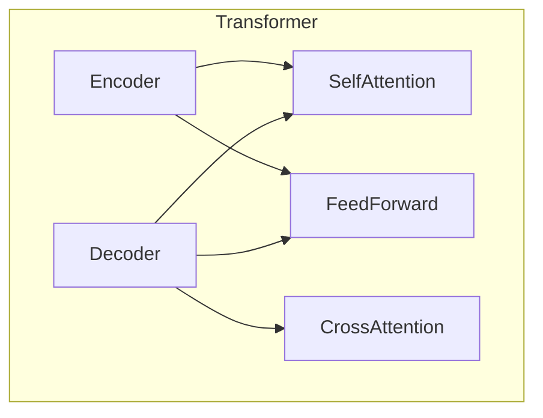
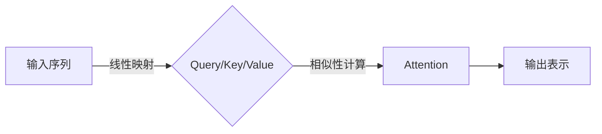
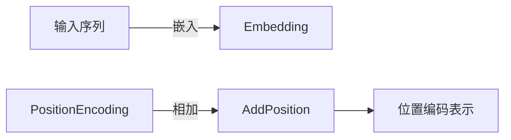
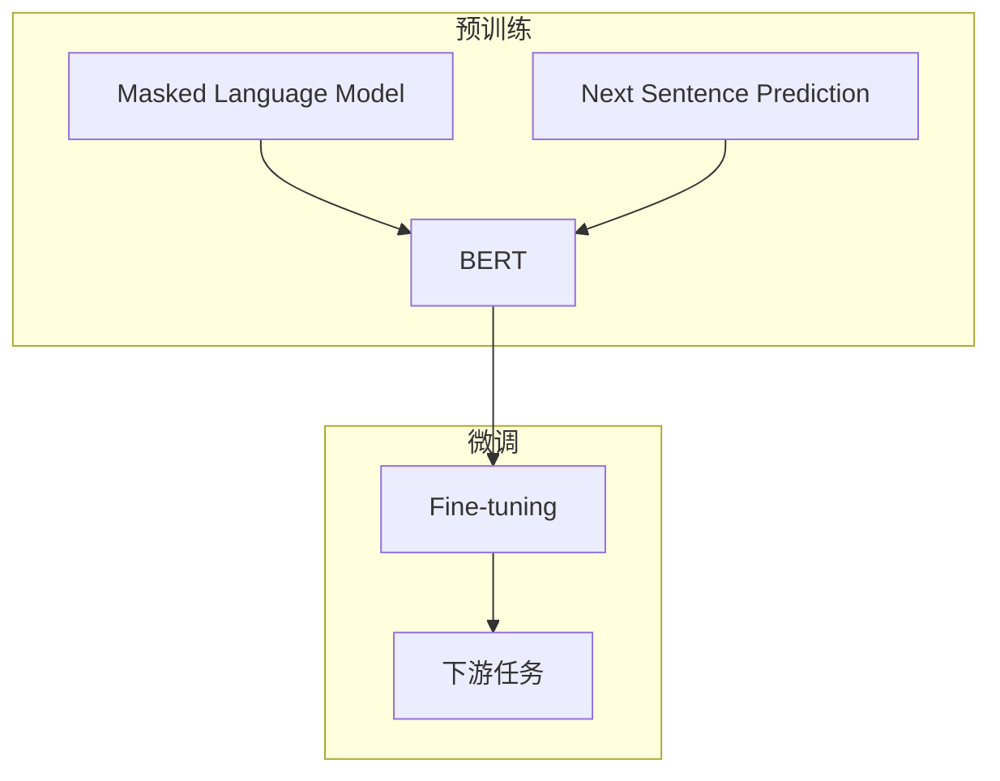
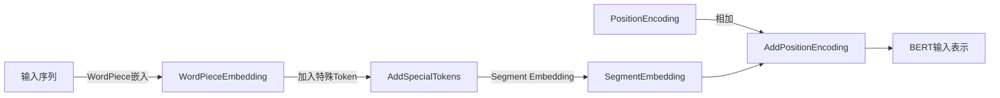
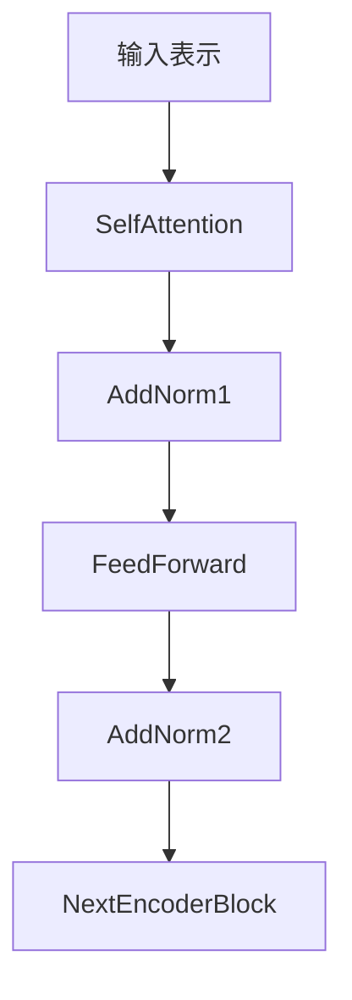

# 大语言模型原理与工程实践：Encoder 的代表：BERT

## 1. 背景介绍

### 1.1 问题的由来

在自然语言处理(NLP)领域中,传统的机器学习模型往往依赖于手工设计的特征工程,这种方法存在一些固有的局限性。首先,特征工程需要大量的人工劳动,效率低下;其次,手工设计的特征可能无法充分捕捉语言数据的复杂语义和上下文信息。为了解决这些问题,研究人员开始探索基于深度学习的方法,试图让模型自动学习特征表示。

### 1.2 研究现状

近年来,基于Transformer的预训练语言模型(Pre-trained Language Model, PLM)取得了巨大的成功,成为NLP领域的主流技术之一。这些模型通过在大规模无标注语料库上进行预训练,学习通用的语言表示,然后在下游任务上进行微调(fine-tuning),展现出了强大的性能。

代表性的PLM模型包括:

- **BERT**(Bidirectional Encoder Representations from Transformers)
- **GPT**(Generative Pre-trained Transformer)
- **XLNet**(Generalized Autoregressive Pretraining for Language Understanding)
- **RoBERTa**(Robustly Optimized BERT Pretraining Approach)
- **ALBERT**(A Lite BERT for Self-supervised Learning of Language Representations)

其中,BERT模型因其出色的性能和广泛的应用而备受关注。

### 1.3 研究意义

BERT模型的出现标志着NLP领域迈入了一个新的里程碑。它展示了预训练语言模型在捕捉语言表示方面的强大能力,并在多个下游任务中取得了state-of-the-art的性能。深入理解BERT模型的原理和实现细节,对于进一步推动NLP技术的发展具有重要意义。

### 1.4 本文结构

本文将全面介绍BERT模型的理论基础、核心算法、数学模型、工程实践等内容。文章结构安排如下:

1. 背景介绍
2. 核心概念与联系
3. 核心算法原理与具体操作步骤
4. 数学模型和公式详细讲解与举例说明
5. 项目实践:代码实例和详细解释说明
6. 实际应用场景
7. 工具和资源推荐
8. 总结:未来发展趋势与挑战
9. 附录:常见问题与解答

## 2. 核心概念与联系

在深入探讨BERT模型之前,我们需要先了解一些核心概念和相关技术,为后续内容的理解打下基础。

### 2.1 Transformer

Transformer是一种全新的基于注意力机制(Attention Mechanism)的序列到序列(Seq2Seq)模型,它完全摒弃了传统序列模型中的循环神经网络(RNN)和卷积神经网络(CNN)结构,使用多头自注意力(Multi-Head Attention)和位置编码(Positional Encoding)来捕捉输入序列中的长程依赖关系。

Transformer架构主要由编码器(Encoder)和解码器(Decoder)两个子模块组成。BERT是一种特殊的Transformer,它只保留了Encoder部分,用于生成序列的contextualized表示。

### 2.2 Masked Language Model

Masked Language Model(MLM)是BERT预训练的一种重要任务,它通过随机掩蔽部分输入Token,并让模型基于剩余Token预测被掩蔽的Token,从而学习到双向的contextualized表示。

与传统语言模型(Language Model)不同,MLM任务需要模型融合上下文的双向信息,而不是仅依赖于单向(左到右或右到左)的上下文。

### 2.3 下游任务微调

BERT在大规模语料库上进行了通用的预训练,学习到了富含语义信息的contextualized表示。在实际应用中,我们可以将预训练好的BERT模型作为初始化参数,在特定的下游任务数据上进行进一步的微调(fine-tuning),从而将通用的语言表示迁移到具体的任务上。

常见的下游任务包括:文本分类、序列标注、问答系统、机器翻译等。通过微调,BERT模型可以快速适应新的任务,大幅提高训练效率和性能表现。

### 2.4 注意力机制

注意力机制(Attention Mechanism)是Transformer架构的核心组件之一,它能够捕捉序列中任意两个位置之间的依赖关系,解决了RNN难以学习长期依赖的问题。

BERT中使用的是多头自注意力(Multi-Head Self-Attention),它将输入序列映射到查询(Query)、键(Key)和值(Value)的表示,然后计算查询与所有键的相似性得分,作为值的加权和,从而生成输出表示。

### 2.5 位置编码

由于Transformer没有引入循环或卷积结构,无法直接获取序列的位置信息。因此,BERT采用了位置编码(Positional Encoding)的方式,将位置信息编码到序列的表示中,使模型能够捕捉Token在序列中的相对位置和顺序关系。

### 2.6 子词嵌入

为了处理未登录词(Out-of-Vocabulary, OOV)问题,BERT使用了WordPiece嵌入的方式,将单词拆分为多个子词(Subword)片段。这种方法可以有效减小词表的大小,提高了模型的泛化能力。

## 3. 核心算法原理与具体操作步骤

### 3.1 算法原理概述

BERT是一种基于Transformer的双向编码器模型,它的核心思想是通过Masked Language Model(MLM)和下一句预测(Next Sentence Prediction, NSP)两个预训练任务,学习通用的语言表示。

在预训练阶段,BERT模型会随机掩蔽部分输入Token,并让模型基于剩余Token预测被掩蔽的Token(MLM任务)。同时,BERT还需要判断两个句子是否相邻(NSP任务)。通过这两个任务的联合训练,BERT能够捕捉到双向的上下文信息,生成富含语义的contextualized表示。

在下游任务中,我们可以将预训练好的BERT模型作为初始化参数,在特定任务数据上进行微调,从而将通用的语言表示迁移到具体任务上。

BERT的预训练和微调过程可以概括为以下步骤:

### 3.2 算法步骤详解

#### 3.2.1 输入表示

BERT的输入是一个Token序列,由WordPiece嵌入表示。为了区分不同的序列,BERT在每个序列的开头添加一个特殊的`[CLS]`Token,用于表示整个序列的表示;在两个序列之间插入一个`[SEP]`Token,用于分隔序列。

此外,BERT还引入了Segment Embedding,用于区分属于不同序列的Token。对于单个序列输入,所有Token的Segment Embedding都相同。

#### 3.2.2 Transformer Encoder

BERT的核心是一个基于Transformer的编码器模块,它由多层相同的Transformer Encoder Block组成。每个Encoder Block包含以下几个子层:

1. **Multi-Head Self-Attention Layer**: 计算输入序列中每个Token与其他Token的注意力权重,生成注意力表示。
2. **Feed Forward Layer**: 对注意力表示进行非线性变换,捕捉更高阶的特征。
3. **Add & Norm Layer**: 对上一层的输出和输入进行残差连接,并进行层归一化(Layer Normalization)操作。

通过堆叠多个Encoder Block,BERT能够逐层提取更高层次的语义表示。

#### 3.2.3 Masked Language Model

在MLM任务中,BERT会随机选择一部分Token,并用`[MASK]`Token替换它们。模型的目标是基于剩余的Token,预测被掩蔽的Token的原始值。

具体来说,对于每个被掩蔽的Token,BERT会从以下三种策略中随机选择一种:

1. 用`[MASK]`Token替换原Token(80%概率)
2. 用随机Token替换原Token(10%概率)
3. 保留原Token(10%概率)

通过这种方式,BERT能够学习到双向的上下文信息,生成更加丰富的语义表示。

#### 3.2.4 Next Sentence Prediction

NSP任务是BERT预训练的另一个重要组成部分。在这个任务中,BERT需要判断两个句子是否相邻(即是否来自同一个文档)。

具体操作是,BERT会从语料库中随机选择一对句子,有50%的概率将它们连接成一个序列,另外50%的概率则是随机选择两个不相关的句子拼接在一起。

BERT利用`[CLS]`Token的输出表示,通过一个二分类器预测该序列是否为连续的句子对。通过NSP任务的训练,BERT能够捕捉到句子之间的关系和语境信息。

#### 3.2.5 预训练目标函数

BERT的预训练目标是最小化MLM和NSP两个任务的损失函数之和:

$$\mathcal{L} = \mathcal{L}_{\text{MLM}} + \mathcal{L}_{\text{NSP}}$$

其中:

- $\mathcal{L}_{\text{MLM}}$是Masked Language Model的交叉熵损失函数
- $\mathcal{L}_{\text{NSP}}$是Next Sentence Prediction的交叉熵损失函数

通过联合训练这两个任务,BERT能够同时学习到Token级别和句子级别的语义表示。

#### 3.2.6 微调

在下游任务中,我们可以将预训练好的BERT模型作为初始化参数,在特定任务数据上进行进一步的微调。

微调过程通常包括以下步骤:

1. 根据下游任务的需求,设计适当的输入表示和输出头(Head)。
2. 在下游任务数据上对BERT模型进行端到端的微调训练。
3. 根据下游任务的评估指标,选择最优模型并进行部署。

通过微调,BERT能够快速适应新的任务,并展现出优异的性能表现。

### 3.3 算法优缺点

#### 优点

1. **双向编码**:BERT能够同时捕捉左右上下文信息,生成更加丰富的语义表示。