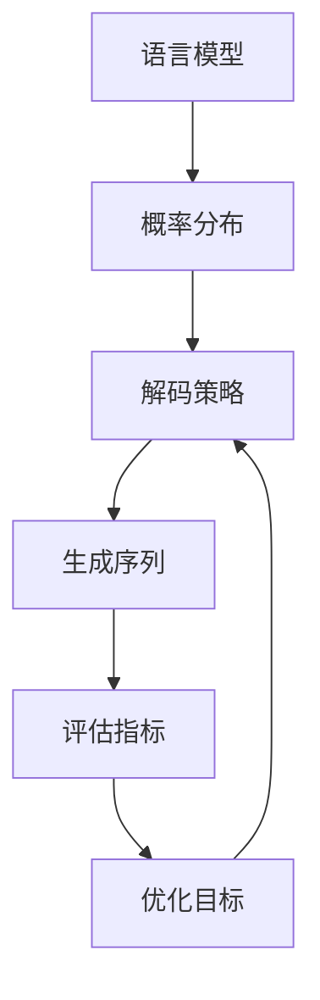

以下是《大语言模型原理基础与前沿 基于解码的策略》的正文部分:

# 大语言模型原理基础与前沿 基于解码的策略

## 1. 背景介绍

### 1.1 问题的由来

随着深度学习和自然语言处理技术的不断发展,大型语言模型(Large Language Model,LLM)已经成为当前最先进的人工智能技术之一。这些模型通过在海量文本数据上进行预训练,学习到了丰富的语言知识和上下文信息,展现出了令人惊叹的语言生成能力。

然而,尽管取得了巨大的进步,现有的语言模型在生成高质量、连贯且符合特定目标的文本输出方面仍然面临着诸多挑战。例如,生成的文本可能存在语义不连贯、逻辑错误、事实错误等问题,难以满足实际应用场景的需求。

### 1.2 研究现状

为了解决上述问题,研究人员提出了多种解码策略,旨在引导语言模型生成更加符合预期的输出。常见的解码策略包括:

1. **Beam Search**: 保留概率最高的若干个候选序列,并对它们进行扩展和剪枝,最终输出概率最高的序列。
2. **Top-k/Top-p Sampling**: 通过控制生成概率分布的熵,避免生成低概率的令牌,从而提高输出质量。
3. **Penalty/Constrained Decoding**: 对特定令牌或短语的概率进行调整,鼓励或惩罚它们的生成。

此外,还有一些基于强化学习、对抗训练等思路的解码策略,试图直接优化生成质量。

### 1.3 研究意义

优化解码策略对于充分发挥大型语言模型的潜力至关重要。通过合理的解码策略,我们可以:

1. 提高生成文本的质量、连贯性和符合预期程度。
2. 控制生成内容的属性,如风格、情感倾向等。
3. 避免生成不当、有害或不安全的内容。
4. 将语言模型应用于更多实际场景,如对话系统、文本摘要、创作辅助等。

因此,研究和设计高效的解码策略,对于充分发挥大型语言模型的能力、推动自然语言处理技术的发展具有重要意义。

### 1.4 本文结构

本文将从以下几个方面全面介绍基于解码的语言模型生成策略:

1. 核心概念与联系
2. 核心算法原理及具体操作步骤
3. 数学模型和公式详细讲解与案例分析
4. 项目实践:代码实例和详细解释
5. 实际应用场景
6. 工具和资源推荐
7. 总结:未来发展趋势与挑战
8. 附录:常见问题与解答

## 2. 核心概念与联系

在介绍具体的解码策略之前,我们先来了解一些核心概念及它们之间的联系。

1. **语言模型(Language Model)**: 旨在学习语言的概率分布,能够给定前缀序列计算下一个令牌的概率。常见的语言模型包括 N-gram 模型、神经网络模型等。

2. **概率分布(Probability Distribution)**: 语言模型学习到的令牌概率分布,通常是一个条件概率 $P(x_t|x_{<t})$,表示在给定前缀 $x_{<t}$ 的情况下,生成令牌 $x_t$ 的概率。

3. **解码策略(Decoding Strategy)**: 根据语言模型给出的概率分布,决策如何生成下一个令牌,直至生成完整序列。不同的策略会产生不同的输出。

4. **生成序列(Generated Sequence)**: 解码策略的最终输出,是一个符号序列,可以是文本、代码等。

5. **评估指标(Evaluation Metric)**: 用于评估生成序列的质量,如 BLEU、ROUGE、Perplexity 等。

6. **优化目标(Optimization Objective)**: 根据评估指标,确定需要优化的目标,如最大化 BLEU 分数等。优化目标将反馈到解码策略,促使其改进。

上述概念相互关联、环环相扣。语言模型学习概率分布,解码策略根据该分布生成序列,评估指标和优化目标则指导解码策略的改进。接下来,我们将重点介绍各种解码策略的原理和实现。

## 3. 核心算法原理 & 具体操作步骤

### 3.1 算法原理概述

解码策略的核心任务是根据语言模型给出的概率分布,决策如何生成下一个令牌,直至生成完整序列。不同的解码策略采用了不同的搜索和采样方法,具有不同的优缺点和适用场景。本节将介绍几种常见的解码策略的原理。

### 3.2 算法步骤详解

#### 3.2.1 Greedy Search

**原理**: Greedy Search 是最简单的解码策略,它每一步都选择当前概率分布中概率最大的令牌作为输出。

**步骤**:
1) 初始化输入序列 $X=\{x_1, x_2, ..., x_T\}$
2) 对于时间步 $t=T+1, T+2, ...$
    a) 计算条件概率分布 $P(x_t|x_{<t})$
    b) 选择概率最大的令牌 $x_t^* = \arg\max_{x} P(x_t=x|x_{<t})$
    c) 将 $x_t^*$ 添加到输出序列
3) 重复步骤2,直到达到终止条件(如最大长度)

**优点**:
- 简单高效,不需要复杂的搜索或采样
- 解码速度快

**缺点**:
- 容易陷入局部最优,生成质量较差
- 无法处理模型不确定性,输出缺乏多样性

#### 3.2.2 Beam Search

**原理**: Beam Search 是一种启发式搜索算法。它维护一个概率最高的候选序列集合(beam),在每个时间步对这些候选序列进行扩展和剪枝,最终输出概率最高的序列。

**步骤**:
1) 初始化beam为只包含起始符的候选序列
2) 对于时间步 $t=1,2,...$
    a) 对于beam中的每个候选序列,计算所有可能的扩展序列的概率
    b) 将所有扩展序列按概率排序,保留前 $k$ 个最高概率序列作为新的beam
3) 重复步骤2,直到所有候选序列均达到终止条件
4) 输出beam中概率最高的候选序列

**优点**:
- 通过并行搜索,可以避免陷入局部最优
- 可控制的近似搜索,在质量和效率之间权衡

**缺点**:
- 搜索空间仍有限,难以彻底避免局部最优
- 需要设置合理的beam宽度,否则质量和效率都会受影响

#### 3.2.3 Top-k Sampling

**原理**: Top-k Sampling 是一种基于采样的解码策略。它通过控制概率分布的熵,避免采样低概率的令牌,从而提高输出质量。

**步骤**:
1) 初始化输入序列 $X=\{x_1, x_2, ..., x_T\}$
2) 对于时间步 $t=T+1, T+2, ...$
    a) 计算条件概率分布 $P(x_t|x_{<t})$
    b) 对概率分布进行归一化,得到 $Q(x_t|x_{<t})$
    c) 将概率分布 $Q$ 限制在前 $k$ 个最高概率的令牌上
    d) 从限制后的分布 $Q'$ 中采样一个令牌 $x_t$
    e) 将 $x_t$ 添加到输出序列
3) 重复步骤2,直到达到终止条件

**优点**:
- 通过控制熵,避免生成低概率的令牌
- 可控制输出的多样性

**缺点**:
- 需要调整合适的 $k$ 值,较小的 $k$ 会降低输出质量
- 无法保证语义连贯性,可能产生无意义的输出

#### 3.2.4 Top-p (Nucleus) Sampling

**原理**: Top-p Sampling 是一种改进的采样方法。它通过动态设置概率阈值,将概率分布限制在最高概率的一部分令牌上,从而避免生成低概率的令牌。

**步骤**:
1) 初始化输入序列 $X=\{x_1, x_2, ..., x_T\}$
2) 对于时间步 $t=T+1, T+2, ...$
    a) 计算条件概率分布 $P(x_t|x_{<t})$
    b) 对概率分布进行归一化,得到 $Q(x_t|x_{<t})$
    c) 找到最小的概率质量 $p$,使得 $\sum_{x:Q(x)\geq p} Q(x) \geq P_{thresh}$
    d) 将概率分布 $Q$ 限制在概率不小于 $p$ 的令牌上,得到 $Q'$
    e) 从限制后的分布 $Q'$ 中采样一个令牌 $x_t$
    f) 将 $x_t$ 添加到输出序列
3) 重复步骤2,直到达到终止条件

**优点**:
- 动态调整概率阈值,更灵活地控制输出质量
- 通常比 Top-k 采样产生更高质量的输出

**缺点**:
- 需要调整合适的 $P_{thresh}$ 值
- 无法保证语义连贯性,可能产生无意义的输出

#### 3.2.5 Typical Decoding

**原理**: Typical Decoding 是一种基于信息理论的解码策略。它通过控制生成序列的交叉熵(cross-entropy)或置信度质量(confidence quality),避免生成低概率或高熵的令牌,从而提高输出质量。

**步骤**:
1) 初始化输入序列 $X=\{x_1, x_2, ..., x_T\}$
2) 对于时间步 $t=T+1, T+2, ...$
    a) 计算条件概率分布 $P(x_t|x_{<t})$
    b) 计算已生成序列 $x_{<t}$ 的交叉熵或置信度质量
    c) 对概率分布 $P(x_t|x_{<t})$ 进行修改,惩罚那些会导致交叉熵或置信度质量超过阈值的令牌
    d) 从修改后的分布中采样一个令牌 $x_t$
    e) 将 $x_t$ 添加到输出序列
3) 重复步骤2,直到达到终止条件

**优点**:
- 通过控制序列的熵或置信度,避免生成低质量的令牌
- 理论依据较为充分

**缺点**:
- 需要调整合适的熵或置信度阈值
- 计算开销较大,解码速度较慢

#### 3.2.6 Minimum Bayes Risk Decoding

**原理**: Minimum Bayes Risk (MBR) Decoding 是一种基于贝叶斯决策理论的解码策略。它通过最小化一个期望风险函数,选择在给定约束下最优的输出序列。

**步骤**:
1) 定义一个损失函数 $\Delta(y, \hat{y})$,用于衡量输出序列 $\hat{y}$ 与目标序列 $y$ 之间的差异
2) 对于每个可能的输出序列 $\hat{y}$,计算其期望风险:
   $$R(\hat{y}) = \sum_y P(y|X) \Delta(y, \hat{y})$$
   其中 $P(y|X)$ 是语言模型给出的条件概率分布
3) 选择期望风险最小的输出序列 $\hat{y}^*$:
   $$\hat{y}^* = \arg\min_{\hat{y}} R(\hat{y})$$

**优点**:
- 直接优化输出质量的评估指标
- 理论基础坚实,具有贝叶斯最优性质

**缺点**:
- 需要定义合适的损失函数,不同任务需要不同的损失函数
- 计算开销较大,需要枚举所有可能的输出序列