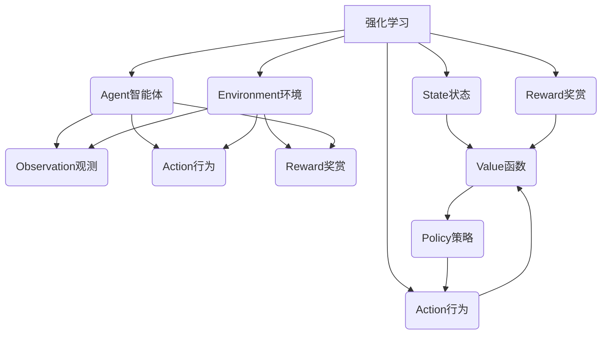
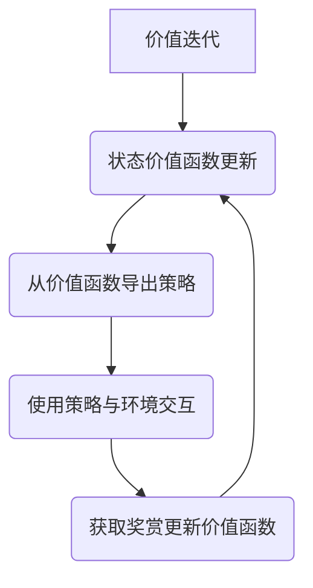
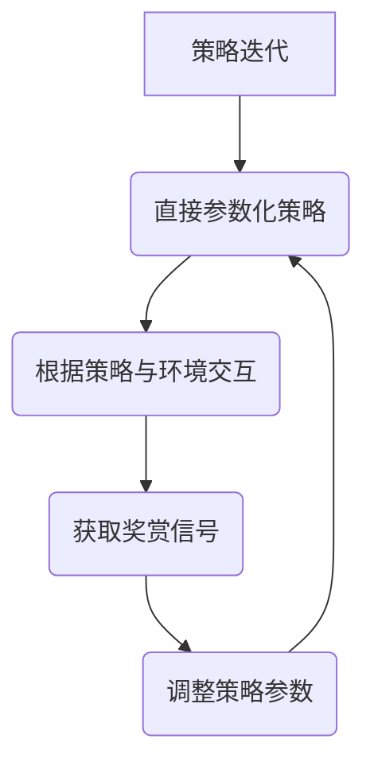
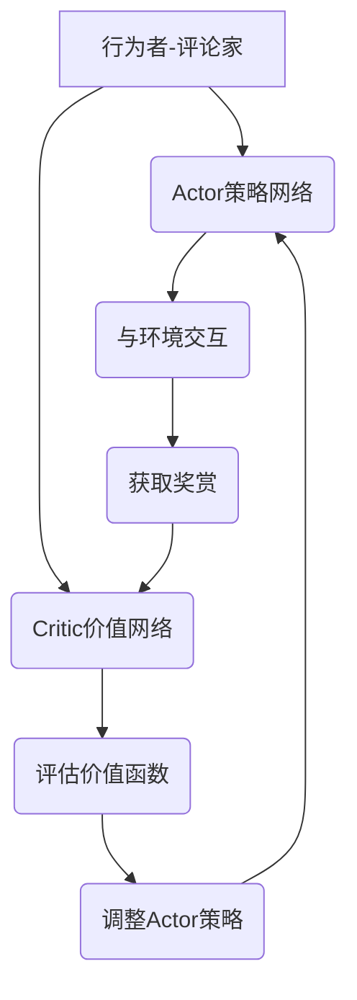

以下是关于"强化学习Reinforcement Learning原理与核心算法概述"的技术博客文章正文内容：

# 强化学习Reinforcement Learning原理与核心算法概述

## 1. 背景介绍

### 1.1 问题的由来

在传统的机器学习领域中,监督学习和无监督学习是两大主流范式。监督学习需要大量标注好的训练数据,而无监督学习则不需要标注数据。但是,这两种方法都存在一定的局限性。监督学习需要人工标注大量数据,成本高且难以覆盖所有场景;无监督学习虽然不需要标注数据,但缺乏明确的学习目标,难以解决特定任务。

强化学习(Reinforcement Learning)作为机器学习的第三大类,它的出现恰好弥补了监督学习和无监督学习的不足。强化学习不需要人工标注的训练数据,也不是简单地从数据中发现模式,而是通过与环境的交互来学习,以获取最大化的长期回报。

### 1.2 研究现状  

强化学习的理论基础可以追溯到20世纪50年代,但是由于当时计算能力有限,很难在实际问题中取得突破。直到近年来,计算能力的飞速提升、大数据的积累以及深度学习的兴起,为强化学习的发展带来了新的契机。

2013年,deepmind公司的研究人员使用深度强化学习算法成功训练出能够玩大型视频游戏的智能体,从而将强化学习推向了视野。2016年,AlphaGo战胜了世界顶尖的人类棋手,成为强化学习在游戏领域的里程碑式成就。

### 1.3 研究意义

强化学习的核心思想是通过与环境的交互来学习,这种学习方式更加贴近真实世界,具有广阔的应用前景。强化学习可以应用于机器人控制、自动驾驶、智能调度、游戏AI、自动交易等诸多领域,为解决复杂的序列决策问题提供了有力工具。

此外,强化学习的学习过程类似于人类和动物通过反复试错来获取经验的方式,对于研究人工智能、认知科学等领域也有重要意义。

### 1.4 本文结构

本文将全面介绍强化学习的核心概念、数学模型、主要算法原理以及实际应用。内容安排如下:

1. 背景介绍
2. 核心概念与联系
3. 核心算法原理与具体操作步骤  
4. 数学模型和公式详细讲解与案例分析
5. 项目实践:代码实例和详细解释
6. 实际应用场景
7. 工具和资源推荐
8. 总结:未来发展趋势与挑战
9. 附录:常见问题与解答

## 2. 核心概念与联系

强化学习是一种基于奖赏或惩罚的学习方式,其核心概念包括:



- **Agent智能体**: 也称为智能代理,是强化学习系统中的决策主体,根据当前状态选择行为,与环境进行交互。
- **Environment环境**: 智能体所处的外部世界,包含智能体可以感知和影响的一切。
- **State状态**: 描述环境的instantaneous情况。
- **Action行为**: 智能体对环境采取的操作。
- **Reward奖赏**: 环境给予智能体的反馈,指导智能体朝着正确方向学习。
- **Observation观测**: 智能体对环境的感知。
- **Value函数**: 评估状态或状态-行为对的长期回报期望。
- **Policy策略**: 智能体在每个状态下选择行为的策略。

智能体与环境进行交互的流程是:智能体根据当前状态选择一个行为,环境接收该行为并转移到下一个状态,同时给出对应的奖赏反馈。智能体的目标是学习一个最优策略,在长期来看获得最大化的累积奖赏。

## 3. 核心算法原理与具体操作步骤

强化学习算法可分为三大类:基于价值的算法(Value-based)、基于策略的算法(Policy-based)以及行为者-评论家算法(Actor-Critic)。

### 3.1 算法原理概述  

1. **基于价值的算法**



基于价值的算法首先估计每个状态的价值函数,然后根据价值函数推导出一个相对优的策略。代表算法有Q-Learning、Sarsa等。

2. **基于策略的算法**



基于策略的算法直接对可能的策略进行参数化,通过最大化期望奖赏来优化策略参数。代表算法有REINFORCE、PPO等。

3. **行为者-评论家算法**



行为者-评论家算法将策略和价值函数分开,策略网络(Actor)根据评论家网络(Critic)提供的价值函数指导来更新策略参数,常用于解决连续控制问题。代表算法有A3C、DDPG等。

### 3.2 算法步骤详解

以Q-Learning为例,具体算法步骤如下:

1. 初始化Q表格,所有Q值设为0或小的正数
2. 对于每一个episode:
    - 初始化状态S
    - 对于每个时间步:
        - 从S出发,选择使Q(S,a)最大的行为a  
        - 执行a,观测奖赏r和下一状态S'
        - 更新Q(S,a) = Q(S,a) + lr * (r + $\gamma*max_{a'}Q(S',a')$ - Q(S,a))
        - S=S'
    - 直到终止状态
3. 重复执行步骤2,直到收敛

其中:
- Q(S,a)是状态S下执行行为a的行为价值函数
- lr是学习率
- $\gamma$是折扣因子,表示对未来奖赏的衰减程度

通过不断与环境交互和更新Q表格,最终能得到最优的Q函数和相应的最优策略。

### 3.3 算法优缺点

1. **优点**:
    - 不需要人工标注的训练数据
    - 可以解决复杂的序列决策问题 
    - 具有持续学习的能力
    - 学习过程类似人类试错,有助于研究智能

2. **缺点**:
    - 训练过程计算代价高,收敛慢
    - 存在样本利用效率低下的问题
    - 在高维状态空间和连续空间下性能下降
    - 探索与利用两者之间需要平衡

### 3.4 算法应用领域

强化学习算法可广泛应用于以下领域:

- 机器人控制
- 自动驾驶
- 智能调度系统  
- 游戏AI
- 自动交易系统
- 自然语言处理
- 计算机系统优化
- ...

## 4. 数学模型和公式详细讲解与举例说明

### 4.1 数学模型构建

强化学习问题通常建模为马尔可夫决策过程(MDP):

$$
MDP=\langle\mathcal{S},\mathcal{A},\mathcal{P},\mathcal{R},\gamma\rangle
$$

其中:
- $\mathcal{S}$是状态集合
- $\mathcal{A}$是行为集合  
- $\mathcal{P}$是状态转移概率,表示$\mathcal{P}_{ss'}^a=\Pr(S_{t+1}=s'\mid S_t=s,A_t=a)$
- $\mathcal{R}$是奖赏函数,表示$\mathcal{R}_s^a=\mathbb{E}[R_{t+1}\mid S_t=s,A_t=a]$  
- $\gamma\in[0,1]$是折扣因子,控制对未来奖赏的衰减程度

在MDP中,智能体的目标是学习一个最优策略$\pi^*$,使得期望的累积折扣奖赏最大:

$$
\pi^*=\arg\max_\pi \mathbb{E}_\pi\left[\sum_{t=0}^\infty \gamma^t R_{t+1}\right]
$$

### 4.2 公式推导过程

1. **状态价值函数**

$$
\begin{aligned}
V^\pi(s)&=\mathbb{E}_\pi\left[\sum_{k=0}^\infty \gamma^k R_{t+k+1}\mid S_t=s\right]\
        &=\mathbb{E}_\pi\left[R_{t+1}+\gamma V^\pi(S_{t+1})\mid S_t=s\right]\
        &=\sum_a\pi(a\mid s)\sum_{s'}\mathcal{P}_{ss'}^a\left(\mathcal{R}_s^a+\gamma V^\pi(s')\right)
\end{aligned}
$$

2. **行为价值函数**

$$
\begin{aligned}
Q^\pi(s,a)&=\mathbb{E}_\pi\left[\sum_{k=0}^\infty \gamma^k R_{t+k+1}\mid S_t=s,A_t=a\right]\
           &=\mathcal{R}_s^a+\gamma\sum_{s'}\mathcal{P}_{ss'}^aV^\pi(s')
\end{aligned}
$$

3. **最优价值函数**

$$
\begin{aligned}
V^*(s)&=\max_\pi V^\pi(s)\
       &=\max_a\sum_{s'}\mathcal{P}_{ss'}^a\left(\mathcal{R}_s^a+\gamma V^*(s')\right)
\end{aligned}
$$

$$
Q^*(s,a)=\mathcal{R}_s^a+\gamma\sum_{s'}\mathcal{P}_{ss'}^a\max_{a'}Q^*(s',a')
$$

4. **最优策略**

$$
\pi^*(s)=\arg\max_a Q^*(s,a)
$$

### 4.3 案例分析与讲解

以经典的网格世界(Gridworld)为例,详细分析强化学习的数学模型:

```python
import numpy as np
import matplotlib.pyplot as plt

# 定义网格世界
world = np.array([
    [0, 0, 0, 1],
    [0, None, 0, -1],
    [0, 0, 0, 0]
])

# 定义奖赏
rewards = {
    0: -0.04,
    1: 1,
    -1: -1,
    None: -1
}

# 定义可能的行为
actions = ['U', 'D', 'L', 'R']

# 定义状态转移概率
def transition_prob(state, action):
    ...
    return new_state, reward

# 初始化价值函数
value_func = np.zeros(world.shape)

# 价值迭代
for i in range(1000):
    ...
    # 更新价值函数
    
# 从价值函数导出策略
policy = np.zeros(world.shape, dtype=object)
for i in range(world.shape[0]):
    for j in range(world.shape[1]):
        ...
        policy[i, j] = best_action
        
# 可视化
...
```

上述代码模拟了一个简单的网格世界环境,通过价值迭代算法求解了最优价值函数和最优策略。其中:

- 环境用一个二维数组表示,0表示普通状态,-1和1分别是终止状态
- 每个状态对应一个即时奖赏
- 智能体可执行上下左右四种行为,行为会导致状态转移并获得相应奖赏
- 通过迭代更新价值函数,直到收敛
- 根据价值函数推导出最优策略

通过可视化,我们可以清晰地看到不同状态的价值函数和最优行