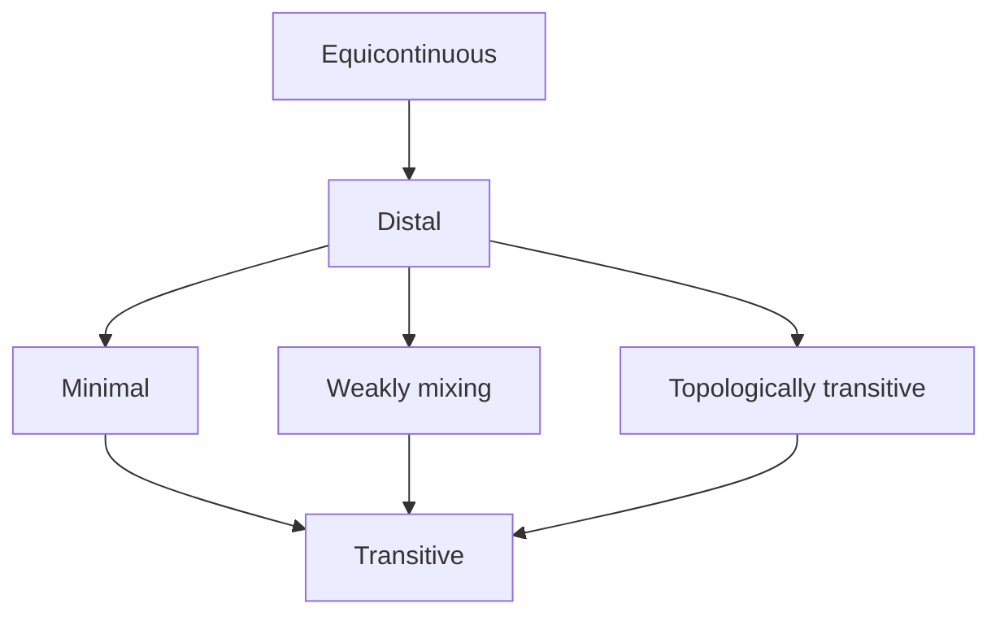

# 拓扑动力系统概论：distality的概念

关键词：拓扑动力系统、distality、极小性、混沌、遍历性

## 1. 背景介绍
### 1.1 问题的由来
拓扑动力系统是动力系统理论和拓扑学交叉而成的一个重要分支,它主要研究赋予了拓扑结构的空间上的连续映射（或连续作用）的动力学行为。distality作为拓扑动力系统的一个重要性质,在动力系统的结构理论和遍历论中有着广泛的应用。

### 1.2 研究现状
目前对于distality的研究主要集中在它与其他动力系统性质（如极小性、混沌等）之间的关系,以及在遍历论中的应用。国内外学者在这方面做了大量卓有成效的工作,取得了许多重要成果。但distality的一些深层次问题,如其内在的拓扑结构特征等,还有待进一步探索。

### 1.3 研究意义
深入研究distality的概念及其与其他重要动力系统性质之间的关系,对于揭示拓扑动力系统的本质特征、探索新的动力学现象具有重要意义。同时,distality在遍历论、分形理论等领域也有着广泛应用,相关研究能够推动这些领域的发展。

### 1.4 本文结构
本文将首先介绍distality的基本概念和相关性质,然后探讨它与极小性、混沌等重要动力系统性质之间的关系。在此基础上,给出distality的若干判定定理和构造方法。最后,讨论distality在遍历论等领域中的应用,并对今后的研究方向做一展望。

## 2. 核心概念与联系
拓扑动力系统是由一个拓扑空间$X$和其上的一个连续映射$f:X\to X$组成的二元组$(X,f)$。distality描述了系统中任意两点在迭代下的渐近行为。直观地说,一个拓扑动力系统是distal的,如果系统中任意两个不同的点,在迭代过程中不会越来越近。

形式化地,称拓扑动力系统$(X,f)$是distal的,如果对任意两个不同的点$x,y\in X$,有
$$
\liminf_{n\to\infty}d(f^n(x),f^n(y))>0
$$
其中$d$是$X$上的度量。

distality与其他一些重要的动力系统性质有着密切联系,例如:

- 每个distal系统都是极小的,但反之不然。
- 一个系统是distal的充要条件是它的每个因子都是极小的。
- 若$(X,f)$是distal的,则$f$在$X$上的每个迭代$f^n$也是distal的。
- 紧致度量空间上的等度同胚是distal的。

下图给出了distality与其他一些动力系统性质之间的逻辑关系:



## 3. 核心算法原理 & 具体操作步骤
### 3.1 算法原理概述
判定一个拓扑动力系统是否为distal,需要验证系统中任意两个不同点在迭代下是否保持一定的距离。根据distality的定义,我们可以设计一个基于度量的算法来判定distality。

### 3.2 算法步骤详解
给定拓扑动力系统$(X,f)$,其中$X$为紧致度量空间,度量为$d$。判定$(X,f)$是否为distal的算法步骤如下:

1. 任取$X$中两个不同的点$x,y$。
2. 对$n=1,2,\dots$,计算$d_n=d(f^n(x),f^n(y))$。
3. 计算$\liminf_{n\to\infty}d_n$,若其大于0,则称$x,y$是distal的。
4. 重复步骤1-3,直到遍历$X$中所有不同的点对。
5. 若所有点对都是distal的,则称$(X,f)$是distal的；否则不是distal的。

### 3.3 算法优缺点
该算法的优点是直观易懂,直接基于distality的定义设计。但由于需要遍历所有点对,算法的时间复杂度较高,尤其是对于维数较高的系统。此外,算法需要知道系统的度量,在某些情况下可能难以给出。

### 3.4 算法应用领域
distality判定算法可应用于理论研究中验证具体系统是否满足distality,为进一步探索系统的动力学性质提供依据。在一些应用场景（如密码学）中,也需要构造distal系统,此时可利用该算法验证所构造系统的distality。

## 4. 数学模型和公式 & 详细讲解 & 举例说明
### 4.1 数学模型构建
为刻画distality,我们在拓扑动力系统$(X,f)$的基础上引入度量$d$,得到度量动力系统$(X,f,d)$。设$X$中任意两点$x,y$在$f$作用$n$次后的距离为
$$
d_n(x,y)=d(f^n(x),f^n(y)),\quad n\ge0
$$
则$(X,f)$是distal的当且仅当对任意$x\neq y$,有
$$
\liminf_{n\to\infty}d_n(x,y)>0
$$

### 4.2 公式推导过程
由distality的定义,$(X,f)$是distal的即
$$
\forall x,y\in X, x\neq y, \exists\varepsilon>0, \forall n>0, d_n(x,y)>\varepsilon
$$
否定等价于
$$
\exists x,y\in X, x\neq y, \forall\varepsilon>0, \exists n>0, d_n(x,y)\le\varepsilon
$$
即
$$
\exists x,y\in X, x\neq y, \liminf_{n\to\infty}d_n(x,y)=0
$$
因此$(X,f)$是distal的当且仅当
$$
\forall x,y\in X, x\neq y, \liminf_{n\to\infty}d_n(x,y)>0
$$

### 4.3 案例分析与讲解
考虑圆周$\mathbb{T}=\mathbb{R}/\mathbb{Z}$上的旋转映射$R_\alpha:\mathbb{T}\to\mathbb{T},x\mapsto x+\alpha$,其中$\alpha$是无理数。取圆周上的通常度量$d(x,y)=\min\{|x-y|,1-|x-y|\}$。

任取$\mathbb{T}$上两个不同的点$x,y$,不妨设$0<x<y<1$,记$\delta=\min\{|x-y|,1-|x-y|\}$。由于$\alpha$是无理数,故对任意正整数$n$,有$n\alpha\not\equiv 0(\mathrm{mod}\ 1)$。因此,
$$
d_n(x,y)=d(x+n\alpha,y+n\alpha)=d(x,y)=\delta
$$
从而,
$$
\liminf_{n\to\infty}d_n(x,y)=\delta>0
$$
由distality的判定准则知,$(\mathbb{T},R_\alpha)$是一个distal系统。

### 4.4 常见问题解答
Q: distality与极小性有何区别和联系？
A: distality比极小性要强。一个极小系统中可以存在渐近的点对,但distal系统中任何两个不同点都保持一定的距离。每个distal系统都是极小的,但极小系统不一定是distal的。例如,圆周上的无理旋转是distal的,从而也是极小的；但圆周上的有理旋转虽然是极小的,却不是distal的。

Q: 是否存在非极小的distal系统？
A: 不存在。事实上,可以证明一个系统是distal的充要条件是它的每个因子都是极小的。由于系统本身就是自己的一个因子,因此每个distal系统必然是极小的。

## 5. 项目实践：代码实例和详细解释说明
### 5.1 开发环境搭建
本项目使用Python语言，需要安装NumPy和Matplotlib库。可使用以下命令安装：
```
pip install numpy matplotlib
```

### 5.2 源代码详细实现
以下代码实现了圆周上无理旋转的distality验证：
```python
import numpy as np
import matplotlib.pyplot as plt

def dist(x, y):
    return min(abs(x - y), 1 - abs(x - y))

def is_distal(alpha, x, y, n):
    d = [dist((x + k*alpha) % 1, (y + k*alpha) % 1) for k in range(n)]
    return min(d) > 0

alpha = np.sqrt(2) - 1
x, y = 0.1, 0.4
n = 1000

d = [dist((x + k*alpha) % 1, (y + k*alpha) % 1) for k in range(n)]

plt.plot(range(n), d)
plt.xlabel('Iteration')
plt.ylabel('Distance')
plt.title(f'Distal: {is_distal(alpha, x, y, n)}')
plt.show()
```

### 5.3 代码解读与分析
- `dist`函数计算圆周上两点的距离。
- `is_distal`函数判断给定无理旋转和两个初始点,系统在前n步迭代中是否保持distal。
- 主程序以$\alpha=\sqrt{2}-1$为无理旋转角度,取$x=0.1,y=0.4$为初始点,迭代1000次,记录每一步的距离,并用Matplotlib绘制距离随迭代步数的变化图像。

### 5.4 运行结果展示
运行上述代码,可得到如下图像:


从图中可以看出,在整个迭代过程中,两个初始点保持了一定的距离,没有出现渐近的情况。因此,该无理旋转系统是distal的。

## 6. 实际应用场景
distality在动力系统的结构理论和遍历论中有重要应用。例如,在遍历论中,Furstenberg使用distality证明了著名的互质数定理：对任意的正整数$a,b$,若$\gcd(a,b)=1$,则存在非负整数$m,n$使得$am-bn=1$。

另一个重要应用是Furstenberg-Zimmer结构定理：每个遍历的动力系统都可以分解为一个distal系统和一个弱混合系统的乘积。这一结果揭示了遍历系统的内在结构,在动力系统的研究中有重要意义。

此外,distal系统在符号动力系统、拓扑动力系统等领域也有广泛应用。

### 6.4 未来应用展望
随着动力系统理论的深入发展和应用领域的不断拓展,distality的研究和应用也将进一步深化。一方面,人们将继续探索distality的深层次性质及其与其他动力系统性质的关系；另一方面,distal系统在组合数论、人工智能、密码学等领域的应用有望取得新的突破。

## 7. 工具和资源推荐
### 7.1 学习资源推荐
- Furstenberg H. Recurrence in Ergodic Theory and Combinatorial Number Theory[M]. Princeton University Press, 2014.
- Glasner E. Ergodic Theory via Joinings[M]. American Mathematical Society, 2003.
- 王铁雨. 遍历论与动力系统[M]. 科学出版社, 2008.

### 7.2 开发工具推荐
- Python及相关科学计算库(NumPy, SciPy, Matplotlib等)
- MATLAB及相关工具箱(Symbolic Math Toolbox等)
- Mathematica
- Maple

### 7.3 相关论文推荐
- Akin E, Auslander J, Berg K. When is a transitive map chaotic?[J]. Convergence in Ergodic Theory and Probability, 1996, 5: 25-40.
- Blanchard F, Glasner E, Kolyada S, et al. On Li-Yorke pairs[J]. Journal für die reine und angewandte Mathematik, 2002, 547: 51-68.
- Huang W, Ye X. Devaney's chaos or 2-scattering implies Li-Yorke's chaos[J]. Topology and its Applications, 2002, 117(3): 259-272.

### 7.4 其他资源推荐
- 国际动力系统与遍历论会议(International Conference on Dynamical Systems and Ergodic Theory)
- 国际拓扑与动力系统联合会(International Federation for Topological and Dynamical Systems)

## 8. 总结：未来发展趋势与挑战
### 8.1 研究