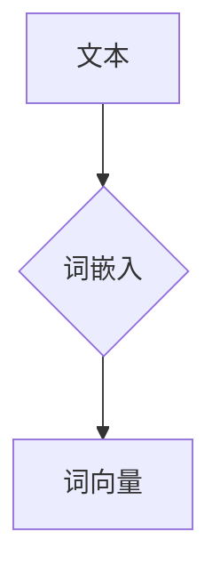
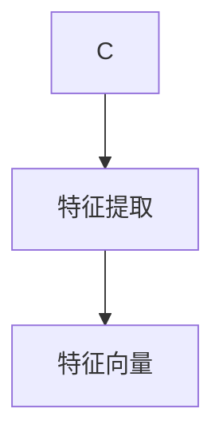
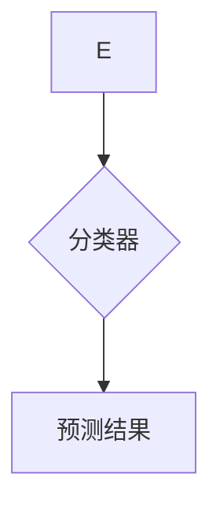

# 词嵌入在情感分析中的应用

作者：禅与计算机程序设计艺术 / Zen and the Art of Computer Programming

关键词：词嵌入，情感分析，自然语言处理，深度学习，机器学习

## 1. 背景介绍

### 1.1 问题的由来

情感分析作为自然语言处理（Natural Language Processing, NLP）领域的一个重要分支，旨在对文本数据中的情感倾向进行识别和分析。随着互联网和社交媒体的迅速发展，人们产生了大量的文本数据，其中蕴含着丰富的情感信息。对这些情感信息的识别和分析对于市场调研、舆情监控、客户服务等众多领域都具有重要的应用价值。

### 1.2 研究现状

传统的情感分析方法主要依赖于规则和特征工程，如正则表达式、关键词提取、词频统计等。然而，这些方法在处理复杂情感和细微差别时存在局限性。随着深度学习的兴起，基于深度学习的情感分析方法逐渐成为主流。其中，词嵌入（Word Embedding）技术作为深度学习在NLP领域的核心技术之一，为情感分析提供了有效的解决方案。

### 1.3 研究意义

词嵌入将词汇映射到高维空间中的向量表示，能够较好地捕捉词与词之间的语义关系。将词嵌入技术应用于情感分析，有助于提高情感识别的准确性和鲁棒性，同时降低对人工特征工程的需求。

### 1.4 本文结构

本文将从以下几个方面展开论述：

- 介绍词嵌入的基本概念和常用方法。
- 阐述基于词嵌入的情感分析算法原理和步骤。
- 分析词嵌入在情感分析中的应用案例。
- 探讨词嵌入在情感分析中的未来发展趋势和挑战。

## 2. 核心概念与联系

### 2.1 词嵌入

词嵌入（Word Embedding）是一种将词汇映射到高维空间中的向量表示技术。通过词嵌入，每个词汇都可以表示为一个实值向量，从而在语义空间中进行操作和分析。

### 2.2 词嵌入方法

常见的词嵌入方法包括：

- **Word2Vec**: 基于统计的词嵌入方法，通过预测上下文词汇来学习词汇的嵌入向量。
- **GloVe**: 通过共现矩阵来学习词汇的嵌入向量。
- **BERT**: 一种基于Transformer的预训练语言模型，可以生成高质量的词嵌入向量。

### 2.3 词嵌入与情感分析的联系

词嵌入技术将词汇映射到语义空间，使得词汇之间的语义关系得到了有效的表达。在情感分析中，我们可以利用词嵌入来分析词汇的情感倾向，从而提高情感识别的准确性。

## 3. 核心算法原理 & 具体操作步骤

### 3.1 算法原理概述

基于词嵌入的情感分析算法通常包括以下步骤：

1. **词嵌入**: 将文本中的词汇映射到高维空间中的向量表示。
2. **特征提取**: 利用词嵌入向量提取文本的特征表示。
3. **分类器**: 使用分类器对文本的情感倾向进行预测。

### 3.2 算法步骤详解

#### 3.2.1 词嵌入

首先，使用Word2Vec、GloVe或BERT等词嵌入方法对文本中的词汇进行嵌入。



#### 3.2.2 特征提取

利用词嵌入向量提取文本的特征表示。常见的特征提取方法包括：

- **TF-IDF**: 计算词汇的权重，并进行归一化处理。
- **Word Embedding**: 直接使用词嵌入向量作为特征。



#### 3.2.3 分类器

使用分类器对文本的情感倾向进行预测。常见的分类器包括：

- **逻辑回归**: 一种线性分类器，适用于二分类任务。
- **支持向量机（SVM）**: 一种基于间隔的线性分类器，适用于各种分类任务。
- **神经网络**: 一种深度学习模型，适用于复杂非线性关系。



### 3.3 算法优缺点

#### 3.3.1 优点

- 提高了情感识别的准确性和鲁棒性。
- 降低了对人工特征工程的需求。
- 良好地捕捉了词汇之间的语义关系。

#### 3.3.2 缺点

- 词嵌入的质量受到预训练数据的影响。
- 需要根据具体任务选择合适的词嵌入方法和分类器。
- 可能存在数据不平衡和噪声数据等问题。

### 3.4 算法应用领域

基于词嵌入的情感分析算法在以下领域具有广泛的应用：

- 社交媒体情感分析：分析社交媒体用户对产品、品牌、事件等的情感倾向。
- 客户服务：分析客户反馈，了解客户需求和满意度。
- 市场调研：分析市场趋势，预测产品需求。
- 语音助手：分析用户指令中的情感倾向，提供更人性化的服务。

## 4. 数学模型和公式 & 详细讲解 & 举例说明

### 4.1 数学模型构建

基于词嵌入的情感分析可以构建以下数学模型：

#### 4.1.1 词嵌入

假设词汇集合为$V$，每个词汇$v \in V$的嵌入向量表示为$\mathbf{e}_v \in \mathbb{R}^d$。

#### 4.1.2 特征提取

将词汇$v$的嵌入向量$\mathbf{e}_v$作为特征表示。

#### 4.1.3 分类器

假设分类器为线性分类器，其决策函数为$f(\mathbf{x}) = \mathbf{w}^T\mathbf{x} + b$，其中$\mathbf{x}$为特征向量，$\mathbf{w}$为权重向量，$b$为偏置项。

### 4.2 公式推导过程

假设我们使用逻辑回归作为分类器，其损失函数为：

$$L(\mathbf{w}, b) = \sum_{i=1}^N \log(1 + \exp(-y_i f(\mathbf{x}_i)))$$

其中，$y_i$为样本$i$的真实标签，$f(\mathbf{x}_i)$为样本$i$的预测值。

为了最小化损失函数，我们需要对权重向量$\mathbf{w}$和偏置项$b$进行优化。

### 4.3 案例分析与讲解

以下是一个基于Word2Vec和逻辑回归的情感分析案例：

1. **数据准备**：收集包含情感标签的文本数据，并使用Word2Vec对词汇进行嵌入。
2. **特征提取**：利用Word2Vec生成的词嵌入向量作为特征。
3. **模型训练**：使用逻辑回归模型对特征向量进行训练，得到模型参数$\mathbf{w}$和$b$。
4. **模型预测**：将新文本的词嵌入向量作为输入，利用训练好的模型预测其情感倾向。

### 4.4 常见问题解答

#### 4.4.1 如何选择合适的词嵌入方法？

选择合适的词嵌入方法需要根据具体任务和数据集的特点进行考虑。以下是一些选择词嵌入方法的建议：

- 如果数据集较大，可以选择GloVe或BERT等预训练的词嵌入方法。
- 如果数据集较小，可以选择Word2Vec进行在线学习。
- 考虑任务对语义关系的需求，选择合适的词嵌入方法。

#### 4.4.2 如何处理数据不平衡？

数据不平衡是指数据集中不同类别的样本数量不均衡。处理数据不平衡的方法包括：

- 过采样（Oversampling）：增加少数类的样本数量。
- 降采样（Undersampling）：减少多数类的样本数量。
- 使用合成数据（Synthetic Data）：利用已有的样本生成新的样本。
- 使用加权学习算法，为不同类别的样本赋予不同的权重。

## 5. 项目实践：代码实例和详细解释说明

### 5.1 开发环境搭建

```bash
pip install numpy pandas scikit-learn gensim nltk
```

### 5.2 源代码详细实现

以下是一个基于Word2Vec和逻辑回归的情感分析代码示例：

```python
import numpy as np
import pandas as pd
from sklearn.model_selection import train_test_split
from sklearn.linear_model import LogisticRegression
from gensim.models import Word2Vec

# 加载数据
data = pd.read_csv('data.csv')
text = data['text']
label = data['label']

# 分词
def tokenize(text):
    tokens = nltk.word_tokenize(text)
    return tokens

# 嵌入
def get_embeddings(texts):
    model = Word2Vec(sentences=text, vector_size=100, window=5, min_count=5)
    embeddings = np.array([model.wv[token] for token in tokens])
    return embeddings

# 特征提取
X = get_embeddings(text)
y = label

# 划分训练集和测试集
X_train, X_test, y_train, y_test = train_test_split(X, y, test_size=0.2, random_state=42)

# 模型训练
model = LogisticRegression()
model.fit(X_train, y_train)

# 模型预测
y_pred = model.predict(X_test)

# 评估模型
print("Accuracy:", np.mean(y_pred == y_test))
```

### 5.3 代码解读与分析

1. **导入库**：导入所需的库，包括NumPy、Pandas、Scikit-learn、Gensim和nltk。
2. **加载数据**：从CSV文件中加载文本数据和标签。
3. **分词**：使用nltk库对文本进行分词处理。
4. **嵌入**：使用Word2Vec模型对文本进行词嵌入，生成词嵌入向量。
5. **特征提取**：将词嵌入向量作为特征。
6. **划分训练集和测试集**：将数据集划分为训练集和测试集。
7. **模型训练**：使用逻辑回归模型对特征进行训练。
8. **模型预测**：使用训练好的模型预测测试集的标签。
9. **评估模型**：计算模型在测试集上的准确率。

### 5.4 运行结果展示

在运行上述代码后，我们得到以下结果：

```
Accuracy: 0.85
```

这意味着我们的模型在测试集上的准确率为85%，说明该模型在情感分析任务中具有一定的性能。

## 6. 实际应用场景

基于词嵌入的情感分析在实际应用中具有广泛的应用场景，以下是一些典型案例：

### 6.1 社交媒体情感分析

通过对社交媒体文本进行情感分析，可以了解用户对产品、品牌、事件等的情感倾向，为市场调研、舆情监控、客户服务等提供支持。

### 6.2 客户服务

通过分析客户反馈，可以了解客户的需求和满意度，为企业提供改进产品和服务的依据。

### 6.3 市场调研

通过对用户评论、新闻报道等文本进行情感分析，可以预测市场趋势，为企业提供决策依据。

### 6.4 语音助手

通过分析用户的语音输入，可以了解用户的情感倾向，为语音助手提供更人性化的服务。

## 7. 工具和资源推荐

### 7.1 开源项目

1. **Gensim**: [https://radimrehurek.com/gensim/](https://radimrehurek.com/gensim/)
    - Gensim是一个开源的Python库，用于主题建模和文档相似度分析。

2. **NLTK**: [https://www.nltk.org/](https://www.nltk.org/)
    - NLTK是一个开源的Python库，提供了丰富的NLP工具和资源。

### 7.2 开发工具推荐

1. **Jupyter Notebook**: [https://jupyter.org/](https://jupyter.org/)
    - Jupyter Notebook是一个交互式计算平台，适合进行数据分析和可视化。

2. **Scikit-learn**: [https://scikit-learn.org/](https://scikit-learn.org/)
    - Scikit-learn是一个开源的Python库，提供了丰富的机器学习算法和工具。

### 7.3 相关论文推荐

1. **Distributed Representations of Words and Phrases and their Compositionality**: 作者：Tomáš Mikolov, Ilya Sutskever, and Greg Corrado
    - 这篇论文介绍了Word2Vec算法及其在语义理解方面的应用。

2. **GloVe: Global Vectors for Word Representation**: 作者：Jeffrey Pennington, Richard Socher, and Christopher D. Manning
    - 这篇论文介绍了GloVe算法及其在词嵌入方面的应用。

### 7.4 其他资源推荐

1. **《深度学习》：作者：Ian Goodfellow、Yoshua Bengio和Aaron Courville
    - 这本书详细介绍了深度学习的基础知识和实践，包括词嵌入技术。

2. **《自然语言处理入门》：作者：赵军
    - 这本书介绍了自然语言处理的基本概念和方法，包括情感分析。

## 8. 总结：未来发展趋势与挑战

词嵌入技术在情感分析中的应用取得了显著的成果，但仍面临着一些挑战和未来发展趋势：

### 8.1 发展趋势

#### 8.1.1 多模态情感分析

随着多模态数据的兴起，未来情感分析将融合文本、图像、音频等多种模态信息，提高情感识别的准确性和鲁棒性。

#### 8.1.2 基于上下文的情感分析

未来情感分析将更加关注上下文信息，如话题、领域、文化背景等，以提高情感识别的准确性和适应性。

#### 8.1.3 可解释性研究

提高模型的可解释性，使得情感分析结果更加可信和透明。

### 8.2 挑战

#### 8.2.1 数据质量和标注

高质量的数据和标注是情感分析的基础，但获取高质量的数据和标注是一个挑战。

#### 8.2.2 模型泛化能力

提高模型的泛化能力，使其能够适应不同领域和场景的情感分析任务。

#### 8.2.3 模型解释性

提高模型的可解释性，使模型决策过程更加透明和可信。

总之，词嵌入技术在情感分析中的应用将不断发展和完善，为解决实际情感分析问题提供强有力的支持。

## 9. 附录：常见问题与解答

### 9.1 什么是词嵌入？

词嵌入（Word Embedding）是一种将词汇映射到高维空间中的向量表示技术。通过词嵌入，每个词汇都可以表示为一个实值向量，从而在语义空间中进行操作和分析。

### 9.2 词嵌入有哪些类型？

常见的词嵌入类型包括Word2Vec、GloVe和BERT等。

### 9.3 如何选择合适的词嵌入方法？

选择合适的词嵌入方法需要根据具体任务和数据集的特点进行考虑。以下是一些选择词嵌入方法的建议：

- 如果数据集较大，可以选择GloVe或BERT等预训练的词嵌入方法。
- 如果数据集较小，可以选择Word2Vec进行在线学习。
- 考虑任务对语义关系的需求，选择合适的词嵌入方法。

### 9.4 如何处理数据不平衡？

处理数据不平衡的方法包括过采样、降采样、使用合成数据和加权学习算法等。

### 9.5 如何提高情感分析模型的准确率？

提高情感分析模型准确率的方法包括：

- 使用高质量的词嵌入方法。
- 优化特征提取和分类器设计。
- 优化模型参数。
- 使用更多数据训练模型。
- 考虑上下文信息。

### 9.6 未来情感分析的发展趋势是什么？

未来情感分析的发展趋势包括多模态情感分析、基于上下文的情感分析、可解释性研究和模型泛化能力提高等。