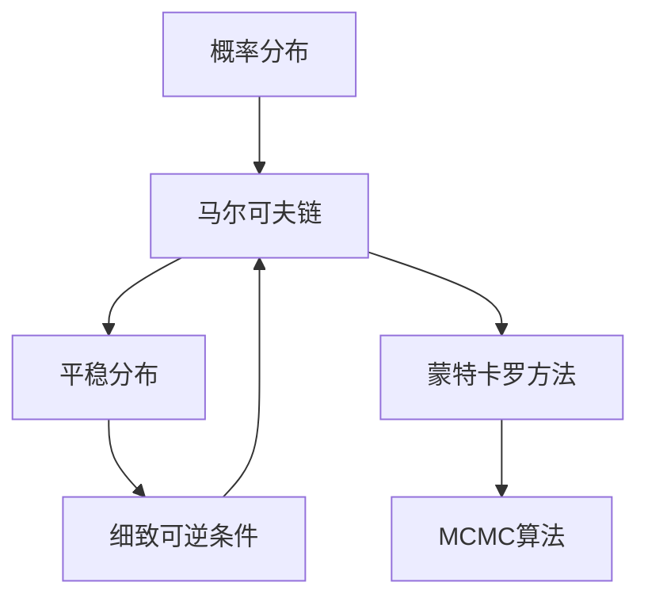

# 马尔可夫链蒙特卡罗(MCMC)原理与代码实战案例讲解

## 1. 背景介绍

### 1.1 问题的由来

在现实世界中,我们经常会遇到复杂的概率分布问题,这些问题往往无法直接获得解析解或者进行精确计算。比如在机器学习、计算生物学、计算物理等领域中,我们需要对高维空间上的复杂概率分布进行采样和计算。传统的数值计算方法在这些问题上往往效率低下或者失效。

马尔可夫链蒙特卡罗(Markov Chain Monte Carlo, MCMC)方法应运而生,它是一种基于构造马尔可夫链的随机模拟方法,可以用来有效地从复杂的多维概率分布中生成样本,并计算相关的数值特征。MCMC方法已经成为当今科学计算中不可或缺的重要工具。

### 1.2 研究现状

MCMC方法源于20世纪40年代的统计物理学研究,最早由物理学家梅特罗波利斯(N.Metropolis)等人提出。20世纪80年代,MCMC算法在贝叶斯统计学和计算机科学领域得到了广泛应用,成为解决高维概率分布问题的有力工具。

目前,MCMC算法在机器学习、计算生物学、计算物理、计算金融等诸多领域都有着广泛的应用。随着算法的不断改进和硬件计算能力的提高,MCMC算法也在不断扩展其应用范围。

### 1.3 研究意义

MCMC算法能够有效解决高维空间上的复杂概率分布问题,这对于科学计算和数据分析领域具有重要意义。具体来说:

1. **贝叶斯推断**: MCMC是贝叶斯统计推断中生成后验分布样本的重要方法,广泛应用于机器学习、计算生物学等领域。
2. **模型参数估计**: MCMC可用于估计复杂模型中的参数,如隐马尔可夫模型等。
3. **积分计算**: MCMC可用于计算高维空间上的积分,在计算物理、量子化学等领域有重要应用。
4. **采样和模拟**: MCMC可用于从复杂分布中生成样本,在蒙特卡罗模拟等领域有广泛应用。

总之,MCMC算法为解决高维复杂问题提供了一种通用而有效的方法,是当今科学计算不可或缺的重要工具。

### 1.4 本文结构

本文将全面介绍MCMC算法的原理、实现方法和应用案例,内容安排如下:

1. 背景介绍
2. 核心概念与联系
3. 核心算法原理与具体操作步骤
4. 数学模型和公式详细讲解与案例分析
5. 项目实践:代码实例和详细解释说明
6. 实际应用场景
7. 工具和资源推荐
8. 总结:未来发展趋势与挑战
9. 附录:常见问题与解答

## 2. 核心概念与联系

MCMC算法涉及了概率论、马尔可夫链理论、蒙特卡罗方法等多个核心概念,这些概念之间存在密切联系。我们先来理解这些核心概念:

1. **概率分布**: 描述随机事件发生的可能性。MCMC主要用于处理复杂的高维概率分布。

2. **马尔可夫链**: 一种具有马尔可夫性质的随机过程,即下一状态只依赖于当前状态。MCMC通过构造马尔可夫链来模拟目标概率分布。

3. **平稳分布**: 马尔可夫链在满足一定条件下会收敛到一个平稳分布,这个分布就是我们想要模拟的目标概率分布。

4. **细致可逆条件**: 是马尔可夫链收敛到平稳分布的充分必要条件。

5. **蒙特卡罗方法**: 一种通过随机模拟来求解确定性问题的方法。MCMC就是将蒙特卡罗方法应用于马尔可夫链。

这些概念之间的关系如下:

简而言之,MCMC算法的核心思想是:构造一个满足细致可逆条件的马尔可夫链,使其收敛到目标概率分布的平稳态,然后通过蒙特卡罗方法从该平稳态中生成样本,以模拟和计算目标概率分布。

## 3. 核心算法原理与具体操作步骤

### 3.1 算法原理概述

MCMC算法的核心思想是通过构造一个满足细致平稳条件的马尔可夫链,使其收敛到目标概率分布的平稳态,然后从该平稳态中生成样本,以模拟和计算目标概率分布。

具体来说,MCMC算法包含以下几个关键步骤:

1. **构造马尔可夫链**: 设计一个能够遍历目标分布支撑集的马尔可夫链转移核。
2. **验证细致可逆条件**: 证明该马尔可夫链满足细致可逆条件,从而能够收敛到目标分布的平稳态。
3. **模拟马尔可夫链**: 从一个适当的初始状态出发,模拟马尔可夫链的状态序列,等待其收敛到平稳态。
4. **生成样本**: 在马尔可夫链收敛到平稳态后,从平稳态中生成样本序列,这些样本即为目标分布的模拟样本。
5. **估计和计算**: 利用生成的样本序列,估计目标分布的数值特征,如均值、方差、积分等。

算法的关键在于设计一个合适的马尔可夫链转移核,使其满足细致可逆条件,并能够有效遍历目标分布的支撑集。常用的MCMC算法包括Metropolis-Hastings算法、Gibbs采样算法等。

### 3.2 算法步骤详解

下面我们以Metropolis-Hastings算法为例,详细介绍MCMC算法的具体实现步骤:

1. **初始化**: 选择一个合适的初始状态 $x_0$,并指定目标分布 $\pi(x)$。

2. **构造马尔可夫链转移核**:
   - 设计一个提议分布(proposal distribution) $q(x^\prime|x)$,用于从当前状态 $x$ 提议下一个可能的状态 $x^\prime$。
   - 根据接受率(acceptance ratio)计算公式:
     $$
     \alpha(x^\prime|x) = \min\left\{1, \frac{\pi(x^\prime)q(x|x^\prime)}{\pi(x)q(x^\prime|x)}\right\}
     $$
     来确定是否接受新状态 $x^\prime$。

3. **迭代采样**:
   - 对于每一步迭代 $t=1,2,\dots,T$:
     - 从提议分布 $q(x^\prime|x_t)$ 中采样一个新状态 $x^\prime$。
     - 计算接受率 $\alpha(x^\prime|x_t)$。
     - 生成一个均匀随机数 $u \sim U(0,1)$。
     - 如果 $u \leq \alpha(x^\prime|x_t)$,则接受新状态,令 $x_{t+1} = x^\prime$;否则保持当前状态,令 $x_{t+1} = x_t$。

4. **收敛检查**:
   - 检查马尔可夫链是否已经收敛到平稳态,可以通过检查样本的自相关性、计算潜在尺度缩减因子(PSRF)等方法。
   - 如果还未收敛,则继续迭代采样,直到收敛。

5. **生成样本**:
   - 在马尔可夫链收敛到平稳态后,继续采样生成样本序列 $\{x_1, x_2, \dots, x_N\}$,这些样本即为目标分布 $\pi(x)$ 的模拟样本。

6. **估计和计算**:
   - 利用生成的样本序列,可以估计目标分布的数值特征,如均值、方差、积分等:
     $$
     \mathbb{E}_{\pi}[h(X)] \approx \frac{1}{N}\sum_{i=1}^N h(x_i)
     $$
     其中 $h(x)$ 是感兴趣的函数。

通过以上步骤,我们就可以使用MCMC算法从复杂的目标分布中生成样本,并计算相关的数值特征。算法的关键在于设计一个合适的马尔可夫链转移核,使其满足细致可逆条件,并能够有效遍历目标分布的支撑集。

### 3.3 算法优缺点

MCMC算法作为一种通用的采样和计算方法,具有以下优缺点:

**优点**:

1. **通用性强**: MCMC算法可以应用于任意复杂的概率分布,只要能够计算分布的密度函数值。
2. **无需积分**: MCMC算法不需要对概率分布进行analytically难以计算的积分运算。
3. **收敛性好**: 在满足一定条件下,MCMC算法可以保证收敛到目标分布的平稳态。
4. **高维适用**: MCMC算法对于高维问题同样有效,不受维数的诅咒影响。
5. **并行化**: MCMC算法的采样过程可以很自然地并行化,提高计算效率。

**缺点**:

1. **收敛慢**: MCMC算法需要大量的迭代才能收敛到平稳态,对于复杂的分布收敛可能很慢。
2. **参数选择**: 算法的效率和收敛性能依赖于提议分布的选择,参数选择需要一定经验。
3. **诊断困难**: 判断MCMC算法是否收敛到平稳态并不容易,需要使用一些诊断技术。
4. **相关样本**: 生成的样本序列存在自相关性,需要一些技术(如子采样)来减少相关性。
5. **常数时间**: 对于某些问题,MCMC算法的计算时间会随着精度要求的增加而增长。

总的来说,MCMC算法是一种非常有用和通用的采样方法,但在实际应用中也需要注意其局限性,并采取一些技术来提高算法的效率和收敛性能。

### 3.4 算法应用领域

由于MCMC算法能够有效处理复杂的高维概率分布问题,因此它在许多领域都有广泛的应用,包括但不限于:

1. **贝叶斯统计和机器学习**:
   - 在贝叶斯推断中,MCMC是生成后验分布样本的重要方法。
   - 在机器学习中,MCMC用于训练复杂模型(如深度学习模型)的参数估计。

2. **计算物理和量子化学**:
   - MCMC广泛用于模拟各种物理和化学系统,如量子态、相变、分子动力学等。
   - 在量子蒙特卡罗方法中,MCMC是核心算法。

3. **计算生物学和系统生物学**:
   - MCMC用于基因调控网络、蛋白质结构预测、进化树构建等问题。
   - 在基因组学和蛋白质组学中,MCMC用于序列比对和结构预测。

4. **计算金融和风险管理**:
   - MCMC用于定价复杂的金融衍生品和结构化产品。
   - 在风险管理中,MCMC用于估计投资组合的风险暴露和损失分布。

5. **计算社会科学**:
   - MCMC在社会网络分析、人口统计学、政治学等领域有应用。
   - 用于分析复杂的社会系统和行为模型。

6. **其他领域**:
   - 天文学和天体物理学中的星系模拟和黑洞模拟。
   - 信号处理中的滤波和跟踪问题。
   - 图像处理中的图像分割和恢复问题。
   - ......

可以看出,MCMC算法是解决高维复杂问题的利器,在科学计算的各个领域都有重要应用。随着算法的不断改进和硬件计算能力的提高,MCMC的应用范围还将进一步扩大。

## 4