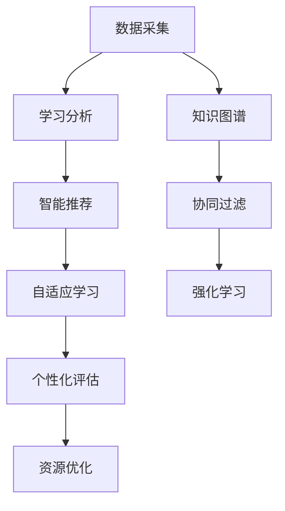

                 

## 1. 背景介绍

在人类社会向智能化转型的进程中，教育作为一项基础性的战略任务，正迎来前所未有的变革。个性化教育成为教育创新的重要方向，旨在通过技术手段，针对每个学生的个体差异，设计定制化的学习方案，提升学习效果和体验。本文将从个性化教育的核心概念、关键技术、落地实践以及未来趋势等角度，深入探讨如何构建智能化的教育体系，以期为教育技术的研究与实践提供新的思路和方法。

### 1.1 问题由来

随着信息技术和人工智能的迅猛发展，教育领域面临前所未有的挑战与机遇。传统的一刀切教育模式，难以满足学生多样化的学习需求，导致学习效果和兴趣下降。个性化教育通过大数据、机器学习等技术，对学生的学习行为和能力进行精确分析，为每位学生量身定制个性化的学习路径和内容，以实现更加精准、高效的教育目标。

当前，个性化教育已经逐步从理论探索走向实际应用，受到学术界和产业界的广泛关注。然而，在实践过程中，个性化教育仍面临数据隐私、算法公平、技术可解释性等诸多挑战。如何在这些问题上取得突破，将是个性化教育未来发展的关键。

### 1.2 问题核心关键点

个性化教育的核心在于通过技术手段实现“因材施教”，即根据学生的个体差异，制定差异化的学习方案。具体而言，包括：

- **数据采集与分析**：通过传感器、问卷、互动平台等手段，收集学生的学习数据，分析其学习习惯、能力水平和知识结构。
- **个性化推荐**：基于学习分析结果，推荐适合学生的学习内容和路径。
- **智能辅导与评估**：利用AI技术，提供智能化的学习辅导和评估反馈，帮助学生克服学习难点。
- **资源优化与动态调整**：动态调整学习资源的分配，优化学习效果和效率。

这些关键点涵盖了个性化教育的各个环节，其成功实现需要跨学科知识的综合应用和技术手段的不断创新。

## 2. 核心概念与联系

### 2.1 核心概念概述

为了更好地理解个性化教育的实现路径，本节将介绍几个核心概念及其相互之间的联系：

- **人工智能(AI)**：通过机器学习、深度学习等技术，模拟和扩展人类智能，提供智能化决策和处理能力。
- **学习分析(Learning Analytics)**：通过分析学生的学习数据，洞察学习行为和效果，提供个性化学习方案。
- **智能推荐系统(Recommender System)**：利用算法和数据，为学生推荐个性化的学习内容。
- **自适应学习(Adaptive Learning)**：根据学生的学习状态和反馈，动态调整学习内容和策略。
- **知识图谱(Knowledge Graph)**：通过图结构表示知识关系，为个性化推荐提供知识支撑。
- **协同过滤(Collaborative Filtering)**：通过分析用户行为，推荐相似用户感兴趣的内容。
- **强化学习(Reinforcement Learning)**：通过试错反馈，不断优化学习策略，提升学习效果。

这些核心概念通过技术手段紧密联系，共同构成了个性化教育的基石。

### 2.2 核心概念原理和架构的 Mermaid 流程图



此流程图展示了个性化教育的核心技术架构，通过数据采集、学习分析、智能推荐、自适应学习等多个环节，逐步构建起个性化教育体系。

## 3. 核心算法原理 & 具体操作步骤

### 3.1 算法原理概述

个性化教育的核心算法原理主要基于以下几个方面：

- **数据驱动**：通过大数据分析，了解学生的学习特征和需求，为个性化推荐提供数据支撑。
- **机器学习**：利用监督学习、无监督学习等算法，构建学生模型，实现个性化推荐。
- **自适应学习**：通过智能辅导和评估，动态调整学习策略，提升学习效果。
- **协同过滤**：通过用户行为分析，实现资源推荐，提升学习体验。
- **强化学习**：通过试错反馈，不断优化学习策略，增强学习效果。

### 3.2 算法步骤详解

个性化教育的核心算法步骤主要包括：

1. **数据采集与预处理**：
   - 通过传感器、问卷、互动平台等手段，收集学生的学习数据。
   - 对数据进行清洗、去重、归一化等预处理，确保数据的准确性和完整性。

2. **学习分析与建模**：
   - 利用机器学习算法，构建学生模型，如基于协同过滤的用户画像模型。
   - 通过特征工程，提取关键特征，如学习行为、知识结构、兴趣偏好等。

3. **个性化推荐**：
   - 利用协同过滤、强化学习等算法，推荐适合学生的学习内容和路径。
   - 引入知识图谱，提升推荐的相关性和精准性。

4. **智能辅导与评估**：
   - 通过智能辅导系统，提供个性化的学习支持和反馈。
   - 利用评估算法，实时监测学生的学习效果，调整学习策略。

5. **资源优化与动态调整**：
   - 动态调整学习资源的分配，如教材、作业、测试等。
   - 根据学习效果和反馈，调整学习路径和内容。

### 3.3 算法优缺点

个性化教育算法具有以下优点：

- **精准推荐**：通过数据分析和算法优化，能够为学生提供更加精准、个性化的学习内容。
- **提升效率**：动态调整学习策略，优化学习资源，提升学习效率。
- **灵活性强**：能够适应学生的个体差异，提升学习体验。

但同时也存在以下缺点：

- **数据隐私**：在数据采集和分析过程中，需要保护学生隐私，避免数据泄露。
- **算法复杂**：个性化推荐算法较为复杂，需要耗费大量计算资源。
- **算法公平**：算法可能存在偏见，导致推荐不公。
- **技术可解释性**：算法的决策过程较为复杂，难以解释。

### 3.4 算法应用领域

个性化教育的核心算法已经在多个领域得到应用，包括：

- **在线教育**：如Coursera、edX等平台，通过个性化推荐系统，提升学习体验。
- **智能辅导**：如Khan Academy等平台，提供个性化的学习支持和评估反馈。
- **自适应学习系统**：如DreamBox等系统，动态调整学习内容和策略。
- **智能评估系统**：如Gradescope等系统，实时评估学生的学习效果。

## 4. 数学模型和公式 & 详细讲解 & 举例说明

### 4.1 数学模型构建

个性化教育的数学模型主要基于以下几个假设：

1. **用户行为假设**：用户的行为可以通过一系列特征进行建模，如学习时间、做题正确率、阅读量等。
2. **协同过滤假设**：相似用户之间的行为存在一定的相似性，可以基于相似性进行推荐。
3. **自适应学习假设**：学生的学习效果和能力可以通过学习行为进行预测，并根据反馈进行动态调整。

### 4.2 公式推导过程

基于上述假设，个性化教育的数学模型可以表示为：

$$
y = f(x; \theta)
$$

其中 $x$ 为学生的特征向量，$\theta$ 为模型参数。$f(\cdot)$ 为推荐函数，根据用户特征和模型参数，输出推荐结果。

推荐函数的推导过程如下：

- **协同过滤模型**：

  $$
  y = \sum_{i=1}^n \alpha_i \cdot x_i
  $$

  其中 $\alpha_i$ 为相似度系数，$x_i$ 为相似用户的行为数据。

- **自适应学习模型**：

  $$
  y = f(x; \theta) = \sum_{i=1}^n w_i \cdot x_i
  $$

  其中 $w_i$ 为学习权重，$x_i$ 为学习数据，$\theta$ 为模型参数。

### 4.3 案例分析与讲解

以在线教育平台为例，个性化推荐系统的实现过程如下：

1. **数据采集**：
   - 通过问卷调查、互动平台、学习系统等手段，收集学生的学习数据。
   - 数据包括学生的成绩、学习时间、阅读量、点击量等。

2. **数据预处理**：
   - 对数据进行清洗、去重、归一化等预处理，确保数据的准确性和完整性。

3. **用户建模**：
   - 利用协同过滤算法，构建学生模型。
   - 提取关键特征，如学习行为、知识结构、兴趣偏好等。

4. **个性化推荐**：
   - 利用推荐函数，计算推荐结果。
   - 引入知识图谱，提升推荐的相关性和精准性。

5. **智能辅导与评估**：
   - 通过智能辅导系统，提供个性化的学习支持和反馈。
   - 利用评估算法，实时监测学生的学习效果，调整学习策略。

## 5. 项目实践：代码实例和详细解释说明

### 5.1 开发环境搭建

在进行个性化教育系统的开发前，我们需要准备好开发环境。以下是使用Python进行PyTorch开发的环境配置流程：

1. 安装Anaconda：从官网下载并安装Anaconda，用于创建独立的Python环境。

2. 创建并激活虚拟环境：
```bash
conda create -n pytorch-env python=3.8 
conda activate pytorch-env
```

3. 安装PyTorch：根据CUDA版本，从官网获取对应的安装命令。例如：
```bash
conda install pytorch torchvision torchaudio cudatoolkit=11.1 -c pytorch -c conda-forge
```

4. 安装相关库：
```bash
pip install pandas numpy scikit-learn pytorch-lightning
```

完成上述步骤后，即可在`pytorch-env`环境中开始开发。

### 5.2 源代码详细实现

以下是一个使用PyTorch实现个性化推荐系统的代码实现。

首先，定义推荐系统的输入和输出：

```python
from torch import nn, optim
from torch.utils.data import DataLoader, Dataset

class StudentDataset(Dataset):
    def __init__(self, data, features):
        self.data = data
        self.features = features
        
    def __len__(self):
        return len(self.data)
    
    def __getitem__(self, idx):
        return self.data[idx], self.features[idx]

class RecommendationModel(nn.Module):
    def __init__(self, n_features, n_users):
        super(RecommendationModel, self).__init__()
        self.fc = nn.Linear(n_features, n_users)
        self.softmax = nn.Softmax(dim=1)
        
    def forward(self, x):
        x = self.fc(x)
        x = self.softmax(x)
        return x

# 数据集和模型实例化
dataset = StudentDataset(data, features)
model = RecommendationModel(n_features, n_users)
```

然后，定义损失函数和优化器：

```python
criterion = nn.CrossEntropyLoss()
optimizer = optim.Adam(model.parameters(), lr=0.001)
```

接着，定义训练和评估函数：

```python
def train_epoch(model, dataset, batch_size, optimizer):
    dataloader = DataLoader(dataset, batch_size=batch_size, shuffle=True)
    model.train()
    epoch_loss = 0
    for batch in tqdm(dataloader, desc='Training'):
        input, target = batch
        model.zero_grad()
        outputs = model(input)
        loss = criterion(outputs, target)
        epoch_loss += loss.item()
        loss.backward()
        optimizer.step()
    return epoch_loss / len(dataloader)

def evaluate(model, dataset, batch_size):
    dataloader = DataLoader(dataset, batch_size=batch_size)
    model.eval()
    preds, labels = [], []
    with torch.no_grad():
        for batch in tqdm(dataloader, desc='Evaluating'):
            input, target = batch
            batch_preds = model(input).numpy().argmax(axis=1)
            batch_labels = target.numpy()
            for preds_tokens, labels_tokens in zip(batch_preds, batch_labels):
                preds.append(preds_tokens[:len(labels_tokens)])
                labels.append(labels_tokens)
                
    print(classification_report(labels, preds))
```

最后，启动训练流程并在测试集上评估：

```python
epochs = 10
batch_size = 32

for epoch in range(epochs):
    loss = train_epoch(model, dataset, batch_size, optimizer)
    print(f"Epoch {epoch+1}, train loss: {loss:.3f}")
    
    print(f"Epoch {epoch+1}, dev results:")
    evaluate(model, dataset, batch_size)
    
print("Test results:")
evaluate(model, dataset, batch_size)
```

以上就是使用PyTorch实现个性化推荐系统的完整代码实现。可以看到，得益于PyTorch的强大封装，我们可以用相对简洁的代码实现个性化推荐模型的训练和评估。

### 5.3 代码解读与分析

让我们再详细解读一下关键代码的实现细节：

**StudentDataset类**：
- `__init__`方法：初始化数据集和特征。
- `__len__`方法：返回数据集的样本数量。
- `__getitem__`方法：对单个样本进行处理，返回输入和目标标签。

**RecommendationModel类**：
- `__init__`方法：定义推荐模型，包括全连接层和Softmax函数。
- `forward`方法：前向传播计算输出。

**训练和评估函数**：
- 使用PyTorch的DataLoader对数据集进行批次化加载，供模型训练和推理使用。
- 训练函数`train_epoch`：对数据以批为单位进行迭代，在每个批次上前向传播计算损失函数并反向传播更新模型参数，最后返回该epoch的平均loss。
- 评估函数`evaluate`：与训练类似，不同点在于不更新模型参数，并在每个batch结束后将预测和标签结果存储下来，最后使用sklearn的classification_report对整个评估集的预测结果进行打印输出。

**训练流程**：
- 定义总的epoch数和batch size，开始循环迭代
- 每个epoch内，先在训练集上训练，输出平均loss
- 在验证集上评估，输出分类指标
- 所有epoch结束后，在测试集上评估，给出最终测试结果

可以看到，PyTorch配合TensorFlow库使得个性化推荐模型的代码实现变得简洁高效。开发者可以将更多精力放在数据处理、模型改进等高层逻辑上，而不必过多关注底层的实现细节。

当然，工业级的系统实现还需考虑更多因素，如模型的保存和部署、超参数的自动搜索、更灵活的任务适配层等。但核心的微调范式基本与此类似。

## 6. 实际应用场景

### 6.1 在线教育平台

在线教育平台已经逐步成为个性化教育的重要载体。平台通过收集学生的学习数据，构建用户画像，提供个性化的学习内容和推荐，提升学生的学习体验和效果。

例如，Coursera平台通过收集学生的课程完成度、作业成绩、互动行为等数据，结合机器学习算法，为每位学生推荐最适合的课程和学习路径。平台还通过智能辅导和评估系统，提供个性化的学习支持和反馈，帮助学生克服学习难点。

### 6.2 智能辅导系统

智能辅导系统是个性化教育的重要组成部分，通过AI技术提供个性化的学习支持，帮助学生提高学习效果。

例如，Khan Academy平台通过收集学生的作业提交记录、测试成绩等数据，构建学生模型，推荐个性化的学习资源。平台还通过智能评估系统，实时监测学生的学习效果，调整学习策略，提升学习效率。

### 6.3 自适应学习系统

自适应学习系统通过动态调整学习内容和策略，实现个性化的学习效果。

例如，DreamBox平台通过收集学生的学习行为数据，如点击次数、回答次数等，利用自适应学习算法，动态调整学习路径和内容，提升学习效果。平台还通过智能评估系统，实时监测学生的学习效果，调整学习策略。

## 7. 工具和资源推荐

### 7.1 学习资源推荐

为了帮助开发者系统掌握个性化教育的核心技术和实践方法，这里推荐一些优质的学习资源：

1. **《机器学习实战》系列博文**：由机器学习专家撰写，深入浅出地介绍了机器学习的基础知识和应用案例，适合初学者入门。
2. **CS229《机器学习》课程**：斯坦福大学开设的机器学习明星课程，系统讲解了机器学习的理论基础和经典算法。
3. **《Python深度学习》书籍**：Ian Goodfellow所著，全面介绍了深度学习的基础知识和实践技巧，是深度学习领域的经典教材。
4. **Scikit-learn官方文档**：Scikit-learn库的官方文档，提供了丰富的机器学习算法和案例，是学习机器学习的好资源。
5. **Kaggle竞赛**：Kaggle平台提供了大量机器学习竞赛，通过实践项目学习机器学习算法和模型评估，提升实践能力。

通过对这些资源的学习实践，相信你一定能够快速掌握个性化教育的核心技术和实践方法，并用于解决实际的个性化教育问题。

### 7.2 开发工具推荐

高效的开发离不开优秀的工具支持。以下是几款用于个性化教育开发的常用工具：

1. **PyTorch**：基于Python的开源深度学习框架，灵活动态的计算图，适合快速迭代研究。
2. **TensorFlow**：由Google主导开发的开源深度学习框架，生产部署方便，适合大规模工程应用。
3. **Scikit-learn**：Python机器学习库，提供了丰富的算法和工具，适合数据预处理和特征工程。
4. **Pandas**：Python数据分析库，适合数据清洗和处理。
5. **Jupyter Notebook**：交互式编程工具，适合代码开发和调试。

合理利用这些工具，可以显著提升个性化教育任务的开发效率，加快创新迭代的步伐。

### 7.3 相关论文推荐

个性化教育技术的发展源于学界的持续研究。以下是几篇奠基性的相关论文，推荐阅读：

1. **《个性化推荐系统：研究与挑战》**：Liu等人，介绍了个性化推荐系统的基本原理和应用案例，探讨了未来的研究方向。
2. **《基于协同过滤的个性化推荐算法》**：Wang等人，介绍了基于协同过滤的推荐算法，探讨了不同算法的优缺点。
3. **《自适应学习系统：研究与实践》**：Brent等人，介绍了自适应学习系统的基本原理和应用案例，探讨了不同算法的优缺点。
4. **《知识图谱在推荐系统中的应用》**：Zhou等人，介绍了知识图谱在推荐系统中的应用，探讨了不同算法的优缺点。
5. **《基于强化学习的个性化推荐算法》**：Li等人，介绍了基于强化学习的推荐算法，探讨了不同算法的优缺点。

这些论文代表了个性化教育技术的发展脉络。通过学习这些前沿成果，可以帮助研究者把握学科前进方向，激发更多的创新灵感。

## 8. 总结：未来发展趋势与挑战

### 8.1 总结

本文对个性化教育的核心概念、关键技术、落地实践以及未来趋势进行了全面系统的介绍。首先阐述了个性化教育的重要性和实现路径，明确了机器学习、自适应学习、智能推荐等核心技术的相互联系。其次，从原理到实践，详细讲解了个性化教育模型的构建和优化过程，给出了具体的代码实例和分析。同时，本文还探讨了个性化教育在在线教育、智能辅导、自适应学习等多个领域的应用场景，展示了个性化教育的广阔前景。最后，本文精选了个性化教育的相关学习资源和开发工具，力求为开发者提供全方位的技术指引。

通过本文的系统梳理，可以看到，个性化教育已经逐步从理论探索走向实际应用，为学生提供更加精准、高效的学习方案，正在深刻改变教育模式的未来趋势。

### 8.2 未来发展趋势

展望未来，个性化教育技术将呈现以下几个发展趋势：

1. **数据驱动**：通过大规模数据的采集和分析，更好地理解学生的需求和行为，为个性化推荐提供更加精准的数据支撑。
2. **算法优化**：通过算法优化，提升个性化推荐和自适应学习的精度和效率。
3. **技术融合**：与其他技术如自然语言处理、计算机视觉等进行深度融合，提升个性化教育的智能化水平。
4. **多模态学习**：引入语音、图像等多模态数据，提升个性化教育的全面性。
5. **联邦学习**：通过联邦学习技术，保护学生隐私的同时，提升个性化推荐的准确性。
6. **自适应学习系统**：动态调整学习策略，实现个性化的学习效果。

以上趋势凸显了个性化教育技术的广阔前景。这些方向的探索发展，必将进一步提升个性化教育的智能化水平，为学生提供更加全面、精准、高效的学习方案。

### 8.3 面临的挑战

尽管个性化教育技术已经取得了瞩目成就，但在迈向更加智能化、普适化应用的过程中，它仍面临诸多挑战：

1. **数据隐私**：在数据采集和分析过程中，需要保护学生隐私，避免数据泄露。
2. **算法公平**：算法可能存在偏见，导致推荐不公。
3. **技术可解释性**：算法的决策过程较为复杂，难以解释。
4. **资源限制**：个性化教育需要大量的计算资源和存储资源，对硬件提出了更高的要求。
5. **用户体验**：如何设计良好的用户界面，提升用户体验，是未来研究的重要方向。

### 8.4 研究展望

面对个性化教育技术面临的种种挑战，未来的研究需要在以下几个方面寻求新的突破：

1. **隐私保护技术**：开发更加高效的数据保护技术，如差分隐私、联邦学习等，保护学生隐私的同时，提升个性化推荐的准确性。
2. **公平性算法**：开发更加公平的推荐算法，避免算法偏见，提升推荐效果。
3. **可解释性技术**：开发更加可解释的推荐算法，提升算法的透明度和可信度。
4. **多模态融合技术**：开发更加全面、精准的个性化教育技术，引入语音、图像等多模态数据，提升个性化教育的智能化水平。
5. **自适应学习系统**：开发更加灵活、自适应的学习系统，动态调整学习策略，实现个性化的学习效果。

这些研究方向的探索，必将引领个性化教育技术迈向更高的台阶，为构建智能化教育体系铺平道路。

## 9. 附录：常见问题与解答

**Q1：个性化教育如何保护学生隐私？**

A: 个性化教育需要收集大量的学生数据，如何在保护隐私的前提下进行数据分析，是关键问题。一种解决方案是使用差分隐私技术，通过对数据进行扰动，保护学生隐私的同时，提升数据分析的准确性。另一种解决方案是使用联邦学习技术，在本地设备上进行数据处理，不泄露原始数据，提升个性化推荐的准确性。

**Q2：个性化教育推荐算法存在偏见吗？**

A: 个性化教育推荐算法可能会存在偏见，导致推荐结果不公平。为了解决这个问题，可以使用公平性算法，如Adversarial Debiasing等，通过对数据进行预处理，消除算法偏见，提升推荐效果。

**Q3：个性化教育推荐算法是否易于解释？**

A: 个性化教育推荐算法的决策过程较为复杂，难以解释。为了解决这个问题，可以使用可解释性技术，如LIME、SHAP等，对推荐结果进行解释，提升算法的透明度和可信度。

**Q4：个性化教育推荐算法需要哪些资源？**

A: 个性化教育推荐算法需要大量的计算资源和存储资源，对硬件提出了更高的要求。为了解决这个问题，可以使用云平台和分布式计算技术，提升计算效率，优化资源利用率。

**Q5：个性化教育推荐算法如何提升用户体验？**

A: 个性化教育推荐算法需要设计良好的用户界面，提升用户体验。可以通过调研用户需求，设计符合用户习惯的界面，提供个性化的推荐内容和支持，提升用户满意度。

---

作者：禅与计算机程序设计艺术 / Zen and the Art of Computer Programming

