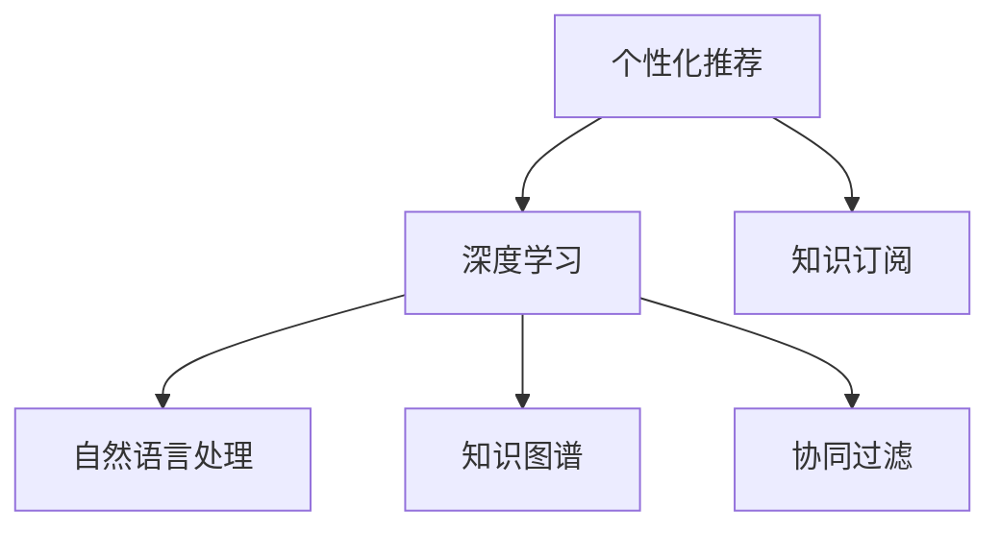

                 

# 个性化知识订阅提高知识获取的针对性

> 关键词：个性化推荐, 知识订阅, 知识图谱, 深度学习, 自然语言处理, 协同过滤

## 1. 背景介绍

在数字化信息爆炸的时代，人们面临的信息过载问题日益严峻。如何从海量的信息中高效地获取对自己有用的知识，成为了一项亟待解决的重要任务。个性化知识订阅系统，通过深度学习、自然语言处理等技术，能够对用户的兴趣和行为进行建模，从而提供个性化推荐的知识订阅服务。本文将从理论到实践，详细介绍个性化知识订阅系统的核心算法原理和具体操作步骤，探讨其应用领域及发展趋势。

## 2. 核心概念与联系

### 2.1 核心概念概述

- **个性化推荐**：通过分析用户的行为和兴趣，推荐用户可能感兴趣的商品、信息等内容。
- **知识订阅**：用户通过订阅的方式，获取特定的知识内容，如新闻、论文、书籍等。
- **知识图谱**：一种结构化的知识表示方式，用于表示实体、关系和属性。
- **深度学习**：一类机器学习算法，通过对数据进行多层次特征提取，实现复杂模式识别和智能决策。
- **自然语言处理(NLP)**：处理、理解、生成自然语言的技术。
- **协同过滤**：通过分析用户行为数据，寻找与目标用户兴趣相似的其他用户，从而推荐他们可能感兴趣的内容。

这些核心概念之间的逻辑关系可以通过以下Mermaid流程图来展示：



这个流程图展示了几组核心概念之间的关系：

1. **个性化推荐**和**深度学习**：通过深度学习算法，可以从用户的点击、浏览、评分等行为数据中提取特征，实现对用户兴趣的精准预测。
2. **个性化推荐**和**知识订阅**：根据用户的兴趣推荐相应的知识内容，实现个性化订阅服务。
3. **知识图谱**和**自然语言处理**：利用自然语言处理技术，对知识内容进行实体识别、关系抽取等操作，构建结构化的知识图谱。
4. **协同过滤**和**知识图谱**：协同过滤可以通过分析用户之间的相似性，推荐相关的知识内容。知识图谱可以提供更加精确的实体关系信息，从而提高协同过滤的效果。

## 3. 核心算法原理 & 具体操作步骤
### 3.1 算法原理概述

个性化知识订阅系统通过分析用户的行为数据，学习用户的兴趣模型，从而推荐个性化的知识订阅内容。具体的算法流程包括以下几个关键步骤：

1. **数据收集与预处理**：收集用户的行为数据（如点击、浏览、评分等），并对其进行预处理，如缺失值填补、特征工程等。
2. **用户兴趣建模**：使用深度学习算法（如神经网络）从行为数据中提取用户兴趣特征。
3. **知识图谱构建**：利用自然语言处理技术，从知识内容中提取实体和关系，构建知识图谱。
4. **协同过滤**：通过分析用户之间的相似性，推荐相关的知识内容。
5. **知识订阅推荐**：将用户兴趣模型与知识图谱结合，推荐符合用户兴趣的知识订阅内容。

### 3.2 算法步骤详解

#### 3.2.1 数据收集与预处理

数据收集是个性化知识订阅系统的基础。具体步骤包括：

1. **数据源选择**：根据业务需求选择合适的数据源，如网站访问日志、应用程序使用数据、社交媒体互动数据等。
2. **数据采集**：通过API、爬虫等方式采集数据源中的行为数据。
3. **数据清洗**：去除无效数据、处理缺失值，确保数据的完整性和准确性。
4. **特征工程**：根据业务需求设计特征，如时间特征、用户特征、内容特征等。

#### 3.2.2 用户兴趣建模

用户兴趣建模是个性化推荐的核心。具体步骤包括：

1. **特征提取**：使用深度学习算法（如神经网络）对行为数据进行特征提取，得到用户兴趣特征。
2. **用户画像**：将用户兴趣特征映射到高维空间中，构建用户画像。
3. **兴趣预测**：使用训练好的模型预测用户对新内容的兴趣，从而推荐相应的知识内容。

#### 3.2.3 知识图谱构建

知识图谱的构建是个性化推荐的重要支撑。具体步骤包括：

1. **实体识别**：使用自然语言处理技术从知识内容中识别实体。
2. **关系抽取**：从知识内容中提取实体之间的关系，如实体之间的属性、关系等。
3. **图谱构建**：将实体和关系构建为图谱结构，存储到数据库中。

#### 3.2.4 协同过滤

协同过滤是推荐系统的重要算法之一。具体步骤包括：

1. **用户相似性计算**：计算用户之间的相似性，可以使用余弦相似度、皮尔逊相关系数等方法。
2. **内容推荐**：根据用户之间的相似性，推荐其他用户可能感兴趣的内容。

#### 3.2.5 知识订阅推荐

知识订阅推荐是个性化推荐的具体应用。具体步骤包括：

1. **订阅内容选择**：根据用户兴趣模型和知识图谱，选择相应的知识内容进行推荐。
2. **推荐策略设计**：设计推荐策略，如顺序推荐、随机推荐等。
3. **推荐展示**：将推荐内容展示给用户，可以使用网页、应用等方式。

### 3.3 算法优缺点

个性化知识订阅系统的优点包括：

1. **精准推荐**：通过深度学习算法分析用户行为数据，能够精准预测用户兴趣，提高推荐精度。
2. **多模态融合**：融合知识图谱、自然语言处理等多模态信息，提供更全面、准确的推荐服务。
3. **个性化订阅**：根据用户兴趣推荐订阅内容，提高用户满意度。

缺点包括：

1. **数据依赖**：个性化推荐依赖大量行为数据，数据质量对推荐效果有重要影响。
2. **模型复杂**：深度学习模型较为复杂，训练和推理成本较高。
3. **冷启动问题**：新用户的兴趣模型需要较长时间的学习，推荐效果较差。

### 3.4 算法应用领域

个性化知识订阅系统在多个领域有广泛应用，包括但不限于：

1. **在线教育**：根据学生的学习行为，推荐相应的课程和资料。
2. **数字阅读**：根据用户的阅读偏好，推荐相应的书籍和文章。
3. **信息搜索**：根据用户的搜索历史，推荐相关的搜索结果和内容。
4. **广告投放**：根据用户的浏览行为，推荐相应的广告内容。

## 4. 数学模型和公式 & 详细讲解 & 举例说明
### 4.1 数学模型构建

本文以推荐系统的协同过滤算法为例，构建推荐模型。设用户集合为 $U$，物品集合为 $I$，用户对物品的评分矩阵为 $R_{ui}$，物品的特征向量为 $f_i$，用户的特征向量为 $p_u$，用户之间的相似度为 $s_{uv}$。

推荐模型的目标是最小化预测评分与实际评分之间的误差，具体公式如下：

$$
\min_{p_u,f_i} \sum_{(u,i) \in R} (R_{ui} - \langle p_u, f_i \rangle)^2
$$

其中，$\langle p_u, f_i \rangle$ 表示用户和物品的内积，即：

$$
\langle p_u, f_i \rangle = \sum_{j=1}^D p_{uj}f_{ij}
$$

### 4.2 公式推导过程

推导推荐模型目标函数的过程如下：

1. **用户特征映射**：将用户行为数据 $x_u$ 映射到高维空间中，得到用户特征向量 $p_u$。
2. **物品特征映射**：将物品特征 $x_i$ 映射到高维空间中，得到物品特征向量 $f_i$。
3. **相似度计算**：根据用户特征向量 $p_u$ 和物品特征向量 $f_i$，计算用户之间的相似度 $s_{uv}$。
4. **评分预测**：根据用户和物品的特征向量，预测用户对物品的评分 $r_{ui}$。

### 4.3 案例分析与讲解

以一个具体的案例来说明推荐模型的实际应用：

假设某在线教育平台有一个推荐系统，根据用户的历史学习行为推荐课程。平台收集了用户的学习数据，如学习时间、点击次数、课程评分等。通过对这些数据进行预处理和特征工程，得到用户特征向量 $p_u$ 和课程特征向量 $f_i$。利用协同过滤算法计算用户之间的相似度 $s_{uv}$，根据相似度推荐其他用户可能感兴趣的课程。

## 5. 项目实践：代码实例和详细解释说明
### 5.1 开发环境搭建

1. **Python环境**：安装Anaconda，创建虚拟环境。
2. **深度学习框架**：安装TensorFlow或PyTorch等深度学习框架。
3. **自然语言处理工具**：安装NLTK、SpaCy等自然语言处理工具。
4. **数据库**：安装MySQL、MongoDB等数据库，用于存储用户数据和知识图谱。

### 5.2 源代码详细实现

以下是一个使用TensorFlow和Keras实现的个性化推荐系统示例代码：

```python
import tensorflow as tf
from tensorflow.keras.layers import Input, Dense, Embedding, Dot, DenseFeature
from tensorflow.keras.models import Model

# 用户特征向量
user_input = Input(shape=(d_user_features,), name='user_input')
user_embedding = Embedding(d_user_features, d_user_embedding)(user_input)
user_features = DenseFeature(user_embedding, normalize=True)(user_input)

# 物品特征向量
item_input = Input(shape=(d_item_features,), name='item_input')
item_embedding = Embedding(d_item_features, d_item_embedding)(item_input)
item_features = DenseFeature(item_embedding, normalize=True)(item_input)

# 用户物品交互矩阵
user_item = Dot(axes=(2, 1), name='user_item')([user_features, item_features])

# 评分预测
rating_output = Dense(1, activation='sigmoid', name='rating_output')(user_item)

# 定义模型
model = Model(inputs=[user_input, item_input], outputs=[rating_output])
model.compile(optimizer='adam', loss='binary_crossentropy')

# 训练模型
model.fit([train_user, train_item], train_rating, epochs=10, batch_size=32)
```

### 5.3 代码解读与分析

代码中，`user_input`和`item_input`表示用户特征向量和物品特征向量，`user_embedding`和`item_embedding`表示用户和物品的嵌入层，`user_features`和`item_features`表示用户和物品的特征表示，`user_item`表示用户物品交互矩阵，`rating_output`表示评分预测输出。

训练模型时，`train_user`、`train_item`和`train_rating`表示训练数据，`epochs`和`batch_size`表示训练的轮数和批次大小。

### 5.4 运行结果展示

运行上述代码，可以得到训练好的模型，用于预测用户对新物品的评分。

## 6. 实际应用场景
### 6.1 在线教育

在线教育平台通过个性化知识订阅系统，可以根据学生的学习行为和兴趣，推荐相应的课程和资料。例如，某学生在某门课程上花费了大量时间，系统可以推荐该课程的进阶内容，或类似主题的其他课程。

### 6.2 数字阅读

数字阅读平台通过个性化知识订阅系统，可以根据用户的阅读偏好，推荐相应的书籍和文章。例如，某用户经常阅读科技类文章，系统可以推荐相关领域的最新论文和书籍。

### 6.3 信息搜索

搜索引擎通过个性化知识订阅系统，可以根据用户的搜索历史，推荐相关的搜索结果和内容。例如，某用户经常搜索关于Python编程的文章，系统可以推荐相关的编程教程和示例代码。

### 6.4 广告投放

广告平台通过个性化知识订阅系统，可以根据用户的浏览行为，推荐相应的广告内容。例如，某用户经常浏览科技类网站，系统可以推荐相关的科技产品广告。

## 7. 工具和资源推荐
### 7.1 学习资源推荐

1. **《推荐系统》书籍**：李航所著，系统介绍了推荐系统的基本概念、算法和应用。
2. **《深度学习》书籍**：Ian Goodfellow等所著，详细介绍了深度学习的基本原理和应用。
3. **《自然语言处理综论》书籍**：Daniel Jurafsky等所著，介绍了自然语言处理的基本技术和应用。
4. **Kaggle竞赛**：参与推荐系统相关的Kaggle竞赛，学习和实践推荐系统算法。
5. **GitHub项目**：搜索和参考开源推荐系统项目，学习优秀的代码实现和架构设计。

### 7.2 开发工具推荐

1. **TensorFlow**：由Google开发的深度学习框架，支持分布式训练和多种模型构建方式。
2. **PyTorch**：由Facebook开发的深度学习框架，支持动态图和静态图模式，易于开发和调试。
3. **Keras**：高层API，支持快速构建和训练深度学习模型。
4. **NLTK**：Python自然语言处理库，提供了丰富的自然语言处理工具和数据集。
5. **SpaCy**：Python自然语言处理库，支持高效的实体识别和关系抽取。

### 7.3 相关论文推荐

1. **推荐系统综述**：由Konstan等撰写，综述了推荐系统的基本概念、算法和应用。
2. **协同过滤算法**：由Koren撰写，介绍了协同过滤算法的基本原理和应用。
3. **深度学习在推荐系统中的应用**：由Hu等撰写，介绍了深度学习在推荐系统中的应用和效果。
4. **知识图谱在推荐系统中的应用**：由Bordes等撰写，介绍了知识图谱在推荐系统中的应用和效果。
5. **个性化推荐系统**：由Liu等撰写，综述了个性化推荐系统的基本概念、算法和应用。

## 8. 总结：未来发展趋势与挑战
### 8.1 总结

本文系统介绍了个性化知识订阅系统的核心算法原理和操作步骤，详细讲解了推荐模型构建、特征提取、协同过滤等技术。通过理论与实践相结合的方式，展示了个性化知识订阅系统的实际应用和未来发展趋势。

### 8.2 未来发展趋势

1. **多模态融合**：未来的推荐系统将更多地融合图像、视频等多模态信息，提供更加全面和丰富的推荐服务。
2. **实时推荐**：未来的推荐系统将实现实时推荐，能够及时响应用户的动态需求。
3. **交互式推荐**：未来的推荐系统将更多地采用交互式推荐，通过与用户交互，获取更精准的推荐结果。
4. **隐私保护**：未来的推荐系统将更加注重用户隐私保护，采用差分隐私等技术，保护用户数据安全。

### 8.3 面临的挑战

1. **数据隐私**：推荐系统需要大量用户数据进行训练，如何保护用户隐私是一个重要问题。
2. **模型复杂性**：深度学习模型较为复杂，训练和推理成本较高。
3. **冷启动问题**：新用户的兴趣模型需要较长时间的学习，推荐效果较差。
4. **数据偏差**：推荐系统中的数据可能存在偏差，导致推荐结果不公平或不准确。

### 8.4 研究展望

未来的研究需要在以下几个方面进行探索：

1. **多模态推荐**：融合多模态数据，提高推荐系统的准确性和多样性。
2. **实时推荐**：实现实时推荐，提供更加个性化的服务。
3. **交互式推荐**：采用交互式推荐，通过与用户交互，获取更精准的推荐结果。
4. **隐私保护**：采用差分隐私等技术，保护用户隐私。

## 9. 附录：常见问题与解答

**Q1：推荐系统如何处理新用户？**

A: 推荐系统通常采用基于内容的推荐方式，为新用户推荐与其已有行为相似的物品。同时，系统会根据用户的反馈数据不断更新推荐模型，提高新用户的推荐精度。

**Q2：推荐系统如何处理数据偏差？**

A: 推荐系统可以通过数据清洗和特征工程等方式，去除数据中的噪声和偏差。同时，可以采用多样化的推荐算法，降低单一算法带来的偏差风险。

**Q3：推荐系统如何处理数据稀疏性？**

A: 推荐系统可以通过矩阵分解等技术，将稀疏矩阵转化为稠密矩阵，提高推荐精度。同时，可以采用多模态融合等方法，引入更多的数据信息。

**Q4：推荐系统如何提高实时性？**

A: 推荐系统可以通过优化模型结构和算法，提高训练和推理速度。同时，可以采用缓存技术，预先生成推荐结果，减少实时计算量。

---

作者：禅与计算机程序设计艺术 / Zen and the Art of Computer Programming

