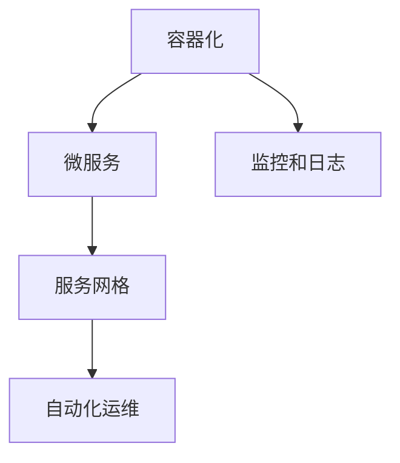

                 

# 云原生开发：从单体应用到微服务架构

## 1. 背景介绍

随着云计算和大数据技术的发展，企业IT架构正在经历深刻变革。从单体应用到微服务架构，从本地部署到云原生化，软件开发范式正在经历一场革命。如何在这一浪潮中保持技术领先，成为众多企业关注的焦点。

### 1.1 问题由来

传统的单体应用架构，尽管开发简单、维护成本低，但随着项目规模的扩大，系统复杂度急剧上升，难以进行敏捷迭代。而微服务架构通过将大系统拆分为多个小型、独立的服务，降低了系统复杂度，提高了系统的可扩展性和可维护性。但微服务架构的实现和维护同样面临挑战，如服务之间的通信、数据一致性、服务治理等。云原生技术通过容器化、服务网格、自动化运维等手段，进一步简化了微服务的部署和管理，推动了微服务架构的广泛应用。

### 1.2 问题核心关键点

微服务架构的核心在于将大系统拆分为多个小型、独立的服务，通过轻量级的通信机制（如RESTful API、消息队列等）实现服务之间的协作。微服务架构带来了系统复杂性的降低、系统性能的提升、系统的可扩展性和可维护性，但也带来了新的挑战，如服务之间的通信、数据一致性、服务治理等。

云原生技术通过容器化、服务网格、自动化运维等手段，进一步简化了微服务的部署和管理，推动了微服务架构的广泛应用。云原生架构的核心概念包括：

- 容器化：通过Docker、Kubernetes等容器技术，将应用打包成容器，实现应用的自动化部署、扩展和监控。
- 服务网格：通过Istio等服务网格技术，实现微服务之间的通信、流量控制、安全管理等。
- 自动化运维：通过Jenkins、Helm等工具，实现CI/CD自动化流水线，提升开发和运维效率。
- 监控和日志：通过Prometheus、Grafana等监控工具，实现应用的全面监控和告警。

这些核心概念的有机结合，使得微服务架构得以在企业IT架构中广泛应用，从而带来系统性能、可扩展性、可维护性的显著提升。

## 2. 核心概念与联系

### 2.1 核心概念概述

为更好地理解云原生开发和微服务架构，本节将介绍几个密切相关的核心概念：

- 容器化（Containerization）：将应用打包成容器，实现了应用的自动化部署、扩展和监控，提高了系统可移植性和可维护性。
- 服务网格（Service Mesh）：一种用于服务之间通信和协作的网络架构，通过统一管理服务间的流量、安全、监控等，提升了微服务系统的稳定性。
- 自动化运维（DevOps）：通过持续集成、持续部署（CI/CD）等自动化工具链，实现软件的自动化部署、测试、监控等，提高了开发和运维的效率。
- 微服务（Microservices）：将大系统拆分为多个小型、独立的服务，通过轻量级的通信机制实现服务之间的协作，提升了系统的可扩展性和可维护性。
- 分布式系统：由多个独立的服务组成的系统，通过网络通信实现协作，带来了系统的复杂性和挑战。

这些核心概念之间的逻辑关系可以通过以下Mermaid流程图来展示：



这个流程图展示了几大核心概念之间的关系：

1. 容器化是微服务的基础，通过容器技术，实现了微服务的自动化部署和扩展。
2. 服务网格实现了微服务之间的通信和管理，通过统一管理服务间的流量、安全、监控等，提升了系统的稳定性。
3. 自动化运维通过CI/CD等工具，实现了微服务的自动化部署和监控，提高了开发和运维的效率。
4. 监控和日志是微服务系统的保障，通过全面监控和告警，及时发现和解决系统问题。

这些概念共同构成了云原生开发的核心架构，使得微服务架构得以在企业IT架构中广泛应用，从而带来系统性能、可扩展性、可维护性的显著提升。

## 3. 核心算法原理 & 具体操作步骤
### 3.1 算法原理概述

云原生开发和微服务架构的核心在于通过容器化、服务网格、自动化运维等手段，实现微服务的自动化部署、扩展和监控，提高系统的性能和可维护性。其核心思想是：

- 将大系统拆分为多个小型、独立的服务，通过轻量级的通信机制实现服务之间的协作。
- 通过容器化技术实现服务的自动化部署和扩展，提高系统的可移植性和可维护性。
- 通过服务网格技术统一管理服务间的流量、安全、监控等，提升系统的稳定性和效率。
- 通过自动化运维技术实现软件的自动化部署、测试、监控等，提高开发和运维的效率。
- 通过监控和日志技术全面监控和告警，及时发现和解决系统问题。

### 3.2 算法步骤详解

云原生开发和微服务架构的实现步骤主要包括：

**Step 1: 设计微服务架构**

- 根据业务需求，将大系统拆分为多个小型、独立的服务。
- 确定服务之间的通信机制，如RESTful API、消息队列等。
- 设计服务间的交互流程和数据一致性策略。

**Step 2: 容器化**

- 使用Docker等工具将应用打包成容器，实现应用的自动化部署和扩展。
- 将容器部署到Kubernetes等容器编排平台上，实现容器的自动化管理和调度。

**Step 3: 服务网格**

- 使用Istio等服务网格技术，实现微服务之间的通信、流量控制、安全管理等。
- 通过服务网格，统一管理服务间的流量和负载均衡，实现服务的平滑扩展。
- 通过服务网格，实现服务的自愈和故障恢复，提升系统的可靠性。

**Step 4: 自动化运维**

- 使用Jenkins、Helm等工具，实现CI/CD自动化流水线，实现软件的自动化部署和测试。
- 通过持续集成和持续部署，快速响应业务需求变化，提升开发效率。
- 通过自动化运维工具，实现软件的自动化监控、告警和故障恢复。

**Step 5: 监控和日志**

- 使用Prometheus、Grafana等监控工具，实现应用的全面监控和告警。
- 通过监控工具，及时发现和解决系统问题，保障系统稳定运行。
- 使用ELK等日志工具，记录和分析应用日志，提升系统的可追溯性。

### 3.3 算法优缺点

云原生开发和微服务架构具有以下优点：

- 提高系统的可扩展性和可维护性：通过将大系统拆分为多个小型、独立的服务，降低了系统复杂度，提高了系统的可扩展性和可维护性。
- 提升系统的性能：通过服务网格和容器化技术，实现了服务的自动化部署和扩展，提升了系统的性能和可靠性。
- 提高开发和运维效率：通过自动化运维和持续集成持续部署（CI/CD）技术，实现了软件的自动化部署和测试，提高了开发和运维效率。
- 提升系统的可移植性和可维护性：通过容器化技术，实现了应用的自动化部署和扩展，提高了系统的可移植性和可维护性。

同时，云原生开发和微服务架构也存在一定的局限性：

- 技术复杂度较高：容器化、服务网格、自动化运维等技术需要一定的技术积累，实施成本较高。
- 系统复杂度增加：微服务架构带来了系统复杂性的提升，需要在服务拆分和交互设计上进行权衡。
- 管理成本上升：微服务架构带来了服务治理、数据一致性管理等复杂的管理问题，增加了管理成本。

尽管存在这些局限性，但就目前而言，云原生开发和微服务架构仍然是企业IT架构发展的方向。未来相关研究的重点在于如何进一步降低云原生架构的技术门槛，提高系统的可扩展性和可维护性，同时兼顾系统的性能和效率。

### 3.4 算法应用领域

云原生开发和微服务架构已经在金融、电商、社交、医疗等多个领域得到了广泛应用，取得了显著的效果：

- 金融行业：通过云原生架构实现高频交易系统、金融服务微服务等，提升了系统的性能和可靠性。
- 电商行业：通过微服务架构实现商品推荐系统、订单管理系统等，提升了用户体验和系统效率。
- 社交行业：通过微服务架构实现实时通讯、内容推荐等，提升了系统的实时性和可扩展性。
- 医疗行业：通过云原生架构实现电子病历系统、医疗影像分析等，提升了系统的可靠性和安全性。

除了上述这些经典应用外，云原生架构也被创新性地应用于更多场景中，如物联网、区块链、人工智能等，为企业的数字化转型提供了新的技术路径。未来，伴随云原生技术的不断演进，相信其将在更广阔的应用领域发挥重要作用，推动企业IT架构的进一步升级。

## 4. 数学模型和公式 & 详细讲解  
### 4.1 数学模型构建

云原生开发和微服务架构的数学模型构建，主要涉及以下几个方面：

- 系统的可扩展性：通过微服务架构，将大系统拆分为多个小型、独立的服务，实现系统的水平扩展。
- 服务的可靠性：通过服务网格和容器化技术，实现服务的自动化部署和扩展，提升系统的可靠性。
- 系统的可维护性：通过自动化运维和持续集成持续部署（CI/CD）技术，实现软件的自动化部署和测试，提升系统的可维护性。
- 系统的性能：通过服务网格和容器化技术，实现服务的自动化部署和扩展，提升系统的性能和可靠性。

### 4.2 公式推导过程

这里以系统的可扩展性为例，推导其数学模型：

假设系统由$n$个独立的服务组成，每个服务的请求处理时间服从指数分布，其期望处理时间为$\lambda$，服务间的请求处理时间满足和服从指数分布，其期望处理时间为$\mu$。假设系统总请求数为$N$，系统总处理时间为$T$。则系统的可扩展性模型为：

$$
T = \sum_{i=1}^n (T_i + \mu T)
$$

其中$T_i$表示第$i$个服务处理请求所需的平均时间。根据指数分布的性质，可以得到：

$$
T = n\lambda + \frac{\mu N}{1 - \frac{\lambda}{\mu}}
$$

上式表明，系统的总处理时间随着系统的可扩展性$n$的增加而线性增加，同时也与系统请求处理时间$\lambda$和系统请求数$N$有关。在实际应用中，可以通过调整服务的可扩展性，优化系统的性能和可靠性。

### 4.3 案例分析与讲解

以下是一个具体的案例，展示如何通过云原生开发和微服务架构实现系统的可扩展性：

**案例背景**：一家电商公司需要实现商品推荐系统，系统架构原先采用单体应用架构，当用户量增加时，系统性能急剧下降，难以支持大规模用户访问。

**解决方案**：通过微服务架构将系统拆分为多个小型、独立的服务，每个服务负责处理不同的推荐逻辑和数据处理。通过容器化技术将服务打包成容器，实现服务的自动化部署和扩展。通过服务网格技术统一管理服务间的流量和负载均衡，实现服务的平滑扩展。通过持续集成持续部署（CI/CD）技术实现软件的自动化部署和测试，提高开发和运维效率。

**实现效果**：通过上述方案，系统实现了服务的平滑扩展和自动部署，用户量增加时，系统能够自动扩容，保障系统的稳定运行。同时，通过服务网格和容器化技术，系统实现了高可用性和高可靠性。通过持续集成持续部署（CI/CD）技术，系统实现了快速响应业务需求变化，提高了开发效率。

## 5. 项目实践：代码实例和详细解释说明
### 5.1 开发环境搭建

在进行云原生开发和微服务架构的实践前，我们需要准备好开发环境。以下是使用Docker和Kubernetes进行微服务开发的流程：

1. 安装Docker：从官网下载并安装Docker，用于创建和管理容器。
2. 安装Kubernetes：从官网下载并安装Kubernetes，用于容器编排和管理。
3. 安装Jenkins：用于持续集成和持续部署（CI/CD）自动化流水线。
4. 安装Helm：用于微服务的自动化部署和扩展。

完成上述步骤后，即可在本地或云上搭建微服务开发环境。

### 5.2 源代码详细实现

下面我们以电商商品推荐系统的微服务为例，展示使用Docker、Kubernetes和Helm实现微服务开发的代码实现。

首先，定义微服务架构：

```python
from flask import Flask
from pymongo import MongoClient

class RecommendationService:
    def __init__(self, collection):
        self.collection = collection

    def recommend(self, user_id, item_id):
        results = self.collection.find({"user_id": user_id, "item_id": item_id})
        return list(results)

app = Flask(__name__)
app.config['MONGODB_URI'] = 'mongodb://localhost:27017'
app.config['MONGODB_DATABASE'] = 'recommendation'

if __name__ == '__main__':
    app.run(debug=True)
```

然后，定义Kubernetes配置文件：

```yaml
apiVersion: v1
kind: Deployment
metadata:
  name: recommendation
spec:
  replicas: 3
  selector:
    matchLabels:
      app: recommendation
  template:
    metadata:
      labels:
        app: recommendation
    spec:
      containers:
        - name: recommendation
          image: recommendation:latest
          ports:
            - containerPort: 5000
          readinessProbe:
            httpGet:
              path: /
              port: 5000
          livenessProbe:
            httpGet:
              path: /
              port: 5000
```

接着，使用Helm部署微服务：

```bash
helm install recommendation --set image.recommendation=your_image --set image.repository=your_repository
```

最后，使用Jenkins进行CI/CD自动化流水线：

```bash
pip install jenkins
jenkinsapi = Jenkins('http://your_jenkins_url', 'your_username', 'your_password')
jenkinsapi.build_project('your_project_name')
```

以上就是使用Docker、Kubernetes和Helm实现微服务开发的完整代码实现。可以看到，通过这些工具，我们能够高效地实现微服务的自动化部署和扩展。

### 5.3 代码解读与分析

让我们再详细解读一下关键代码的实现细节：

**RecommendationService类**：
- `__init__`方法：初始化微服务，将MongoDB连接信息存储到配置中。
- `recommend`方法：根据用户ID和物品ID查询推荐结果，返回查询结果列表。

**Kubernetes配置文件**：
- 定义了微服务的Deployment配置，指定了服务的副本数、标签、容器镜像等。
- 定义了微服务的Probe配置，通过HTTP探测确保服务可用性。

**Helm部署命令**：
- 使用Helm部署微服务，指定了微服务的名称、镜像、仓库等信息。

**Jenkins构建命令**：
- 使用Jenkins构建微服务，通过API调用执行构建任务。

## 6. 实际应用场景
### 6.1 智能客服系统

基于云原生开发和微服务架构的智能客服系统，可以提升客户服务体验，降低企业运营成本。传统的客服系统依赖人工客服，高峰期响应缓慢，难以支持大规模客户需求。而基于云原生和微服务架构的客服系统，可以实现7x24小时不间断服务，快速响应客户咨询，用自然流畅的语言解答各类常见问题。

在技术实现上，可以收集企业内部的历史客服对话记录，将问题和最佳答复构建成监督数据，在此基础上对微服务架构的智能客服系统进行微调。微调后的客服系统能够自动理解用户意图，匹配最合适的答案模板进行回复。对于客户提出的新问题，还可以接入检索系统实时搜索相关内容，动态组织生成回答。如此构建的智能客服系统，能大幅提升客户咨询体验和问题解决效率。

### 6.2 金融舆情监测

金融机构需要实时监测市场舆论动向，以便及时应对负面信息传播，规避金融风险。传统的人工监测方式成本高、效率低，难以应对网络时代海量信息爆发的挑战。基于云原生开发和微服务架构的文本分类和情感分析技术，为金融舆情监测提供了新的解决方案。

具体而言，可以收集金融领域相关的新闻、报道、评论等文本数据，并对其进行主题标注和情感标注。在此基础上对微服务架构的金融舆情监测系统进行微调，使其能够自动判断文本属于何种主题，情感倾向是正面、中性还是负面。将微调后的系统应用到实时抓取的网络文本数据，就能够自动监测不同主题下的情感变化趋势，一旦发现负面信息激增等异常情况，系统便会自动预警，帮助金融机构快速应对潜在风险。

### 6.3 个性化推荐系统

当前的推荐系统往往只依赖用户的历史行为数据进行物品推荐，无法深入理解用户的真实兴趣偏好。基于云原生开发和微服务架构的个性化推荐系统，可以更好地挖掘用户行为背后的语义信息，从而提供更精准、多样的推荐内容。

在实践中，可以收集用户浏览、点击、评论、分享等行为数据，提取和用户交互的物品标题、描述、标签等文本内容。将文本内容作为模型输入，用户的后续行为（如是否点击、购买等）作为监督信号，在此基础上对微服务架构的个性化推荐系统进行微调。微调后的系统能够从文本内容中准确把握用户的兴趣点。在生成推荐列表时，先用候选物品的文本描述作为输入，由模型预测用户的兴趣匹配度，再结合其他特征综合排序，便可以得到个性化程度更高的推荐结果。

### 6.4 未来应用展望

随着云原生技术和微服务架构的不断发展，基于云原生开发和微服务架构的应用场景将更加广泛，为各行各业带来变革性影响。

在智慧医疗领域，基于云原生开发和微服务架构的医疗问答、病历分析、药物研发等应用将提升医疗服务的智能化水平，辅助医生诊疗，加速新药开发进程。

在智能教育领域，基于云原生开发和微服务架构的作业批改、学情分析、知识推荐等方面，因材施教，促进教育公平，提高教学质量。

在智慧城市治理中，基于云原生开发和微服务架构的城市事件监测、舆情分析、应急指挥等环节，提高城市管理的自动化和智能化水平，构建更安全、高效的未来城市。

此外，在企业生产、社会治理、文娱传媒等众多领域，基于云原生开发和微服务架构的人工智能应用也将不断涌现，为经济社会发展注入新的动力。相信随着技术的日益成熟，云原生开发和微服务架构必将在更广阔的应用领域大放异彩，深刻影响人类的生产生活方式。

## 7. 工具和资源推荐
### 7.1 学习资源推荐

为了帮助开发者系统掌握云原生开发和微服务架构的理论基础和实践技巧，这里推荐一些优质的学习资源：

1. 《Kubernetes: Up and Running》系列博文：由Kubernetes核心团队成员撰写，深入浅出地介绍了Kubernetes的安装、配置和使用。
2. 《Flask Web Development》书籍：由Flask核心开发者撰写，全面介绍了Flask框架的使用方法和最佳实践。
3. 《Docker Cookbook》书籍：由Docker官方团队成员撰写，提供了大量Docker容器的实践案例和操作技巧。
4. 《Istio: Communications in the Modern Web》书籍：由Istio核心团队成员撰写，全面介绍了Istio的架构、功能和用例。
5. 《Cloud Native Development with Kubernetes》书籍：由Cloud Native Computing Foundation专家撰写，全面介绍了Cloud Native架构的开发和实践。

通过对这些资源的学习实践，相信你一定能够快速掌握云原生开发和微服务架构的精髓，并用于解决实际的IT问题。

### 7.2 开发工具推荐

高效的开发离不开优秀的工具支持。以下是几款用于云原生开发和微服务架构开发的常用工具：

1. Docker：开源的容器化平台，支持应用的自动化部署、扩展和监控，提高系统的可移植性和可维护性。
2. Kubernetes：开源的容器编排平台，支持容器的自动化管理和调度，实现微服务的平滑扩展和高可用性。
3. Jenkins：开源的持续集成和持续部署（CI/CD）工具，支持软件的自动化部署和测试，提升开发和运维效率。
4. Helm：开源的微服务自动化部署工具，支持微服务的快速部署和扩展，提高开发和运维效率。
5. Prometheus：开源的监控系统，支持全面监控和告警，提升系统的稳定性和可靠性。
6. Grafana：开源的仪表盘工具，支持数据的可视化展示，提升系统的可观察性和可维护性。

合理利用这些工具，可以显著提升云原生开发和微服务架构的开发效率，加快创新迭代的步伐。

### 7.3 相关论文推荐

云原生开发和微服务架构的发展源于学界的持续研究。以下是几篇奠基性的相关论文，推荐阅读：

1. Containerization: Concepts and Implementation（Docker论文）：介绍了Docker容器化的实现原理和使用方法，奠定了容器化技术的基础。
2. Kubernetes: A Control Plane for Container Orchestration（Kubernetes论文）：介绍了Kubernetes的架构和功能，奠定了云原生架构的基础。
3. Consensus in the Message-Passing Model（Istio论文）：介绍了Istio的架构和功能，奠定了服务网格技术的基础。
4. Cloud Native Development（Cloud Native论文）：介绍了Cloud Native架构的开发和实践，奠定了云原生开发技术的基础。
5. Microservices Architecture: A Microservices-First Approach to Application Design（Microservices论文）：介绍了微服务架构的设计和实现，奠定了微服务架构的基础。

这些论文代表了大规模云原生开发和微服务架构的发展脉络。通过学习这些前沿成果，可以帮助研究者把握学科前进方向，激发更多的创新灵感。

## 8. 总结：未来发展趋势与挑战

### 8.1 总结

本文对云原生开发和微服务架构进行了全面系统的介绍。首先阐述了云原生开发和微服务架构的研究背景和意义，明确了微服务架构在提升系统性能和可维护性方面的独特价值。其次，从原理到实践，详细讲解了云原生开发和微服务架构的数学原理和关键步骤，给出了微服务架构开发的完整代码实例。同时，本文还广泛探讨了微服务架构在智能客服、金融舆情、个性化推荐等多个行业领域的应用前景，展示了微服务架构的巨大潜力。此外，本文精选了微服务架构的各类学习资源，力求为读者提供全方位的技术指引。

通过本文的系统梳理，可以看到，云原生开发和微服务架构正在成为企业IT架构发展的方向，极大地提升了系统性能、可扩展性、可维护性。未来，伴随云原生技术的不断演进，相信其在更多领域得到广泛应用，为企业的数字化转型提供新的技术路径。

### 8.2 未来发展趋势

展望未来，云原生开发和微服务架构将呈现以下几个发展趋势：

1. 容器化和云原生技术的普及：容器化技术已经广泛应用于企业IT架构中，未来其应用将更加普及。云原生技术的发展也将进一步推动微服务架构的广泛应用。
2. 微服务架构的进一步优化：微服务架构带来了系统的复杂性和挑战，未来需要在服务拆分和交互设计上进行更多的优化，实现系统的稳定性和可扩展性。
3. 自动化运维和持续集成持续部署（CI/CD）的普及：自动化运维和持续集成持续部署（CI/CD）技术将进一步普及，实现软件的自动化部署和测试，提高开发和运维效率。
4. 服务网格技术的广泛应用：服务网格技术将进一步普及，实现微服务之间的统一管理和协作，提升系统的稳定性和可靠性。
5. 监控和日志技术的全面推广：监控和日志技术将进一步普及，实现系统的全面监控和告警，提升系统的稳定性和可维护性。

以上趋势凸显了云原生开发和微服务架构的广阔前景。这些方向的探索发展，必将进一步提升云原生架构的性能和可维护性，为企业的数字化转型提供新的技术路径。

### 8.3 面临的挑战

尽管云原生开发和微服务架构已经取得了显著成效，但在迈向更加智能化、普适化应用的过程中，它仍面临着诸多挑战：

1. 技术复杂度较高：云原生开发和微服务架构需要一定的技术积累，实施成本较高。
2. 系统复杂度增加：微服务架构带来了系统复杂性的提升，需要在服务拆分和交互设计上进行权衡。
3. 管理成本上升：微服务架构带来了服务治理、数据一致性管理等复杂的管理问题，增加了管理成本。
4. 性能瓶颈：微服务架构带来了服务之间的通信延迟，可能成为系统的性能瓶颈。
5. 安全问题：微服务架构带来了新的安全问题，如服务间的跨站请求伪造（CSRF）、服务间的DDoS攻击等。

尽管存在这些挑战，但就目前而言，云原生开发和微服务架构仍然是企业IT架构发展的方向。未来相关研究的重点在于如何进一步降低云原生架构的技术门槛，提高系统的可扩展性和可维护性，同时兼顾系统的性能和效率。

### 8.4 研究展望

面对云原生开发和微服务架构所面临的种种挑战，未来的研究需要在以下几个方面寻求新的突破：

1. 探索无服务架构（Serverless）：进一步简化微服务的部署和管理，降低开发和运维成本。
2. 研究异构容器和云原生技术：实现异构容器和云原生技术的统一管理和协作，提升系统的可扩展性和可维护性。
3. 引入因果分析和博弈论工具：将因果分析方法引入微服务架构，识别出模型决策的关键特征，增强输出解释的因果性和逻辑性。
4. 融合知识表示和推理技术：将知识表示和推理技术引入微服务架构，增强模型的推理能力，提升系统的智能化水平。
5. 结合多模态数据和机器学习技术：将多模态数据和机器学习技术引入微服务架构，增强系统的泛化能力和鲁棒性。

这些研究方向的探索，必将引领云原生开发和微服务架构技术迈向更高的台阶，为构建安全、可靠、可解释、可控的智能系统铺平道路。面向未来，云原生开发和微服务架构技术还需要与其他人工智能技术进行更深入的融合，如知识表示、因果推理、强化学习等，多路径协同发力，共同推动自然语言理解和智能交互系统的进步。只有勇于创新、敢于突破，才能不断拓展云原生架构的边界，让智能技术更好地造福人类社会。

## 9. 附录：常见问题与解答

**Q1：云原生开发和微服务架构是否适用于所有NLP任务？**

A: 云原生开发和微服务架构在大多数NLP任务上都能取得不错的效果，特别是对于数据量较小的任务。但对于一些特定领域的任务，如医学、法律等，仅仅依靠通用语料预训练的模型可能难以很好地适应。此时需要在特定领域语料上进一步预训练，再进行微调，才能获得理想效果。此外，对于一些需要时效性、个性化很强的任务，如对话、推荐等，微调方法也需要针对性的改进优化。

**Q2：云原生开发和微服务架构如何降低微服务架构的技术门槛？**

A: 云原生开发和微服务架构的实施成本较高，技术门槛较高。为了降低技术门槛，可以引入更多的工具和框架，如Kubernetes、Docker、Istio等，提供更多的自动化功能，降低开发和运维成本。同时，也可以引入云服务提供商的平台，如AWS、Google Cloud、Microsoft Azure等，提供更完善的云服务和运维支持，降低实施难度。

**Q3：云原生开发和微服务架构如何解决微服务架构的性能瓶颈？**

A: 微服务架构带来了服务之间的通信延迟，可能成为系统的性能瓶颈。为了解决性能瓶颈，可以引入服务网格技术，如Istio，通过统一管理服务间的流量和负载均衡，实现服务的平滑扩展。同时，也可以引入异步通信和事件驱动架构，减少服务之间的同步调用，提升系统的响应速度。

**Q4：云原生开发和微服务架构如何解决微服务架构的安全问题？**

A: 微服务架构带来了新的安全问题，如服务间的跨站请求伪造（CSRF）、服务间的DDoS攻击等。为了解决安全问题，可以引入安全中间件，如服务网格、API网关等，统一管理服务间的安全策略。同时，也可以引入身份认证和授权机制，保障服务的访问安全。

**Q5：云原生开发和微服务架构如何解决微服务架构的监控和日志问题？**

A: 微服务架构带来了服务的复杂性，需要进行全面的监控和日志记录。为了解决监控和日志问题，可以引入监控工具，如Prometheus、Grafana等，实现全面的监控和告警。同时，也可以引入日志收集和分析工具，如ELK、Splunk等，实现日志的集中管理和分析。

通过以上措施，可以最大限度地降低微服务架构的实施成本，提升系统的性能和可靠性，实现更高效、更安全的微服务架构。总之，微服务架构需要开发者根据具体任务，不断迭代和优化模型、数据和算法，方能得到理想的效果。

---

作者：禅与计算机程序设计艺术 / Zen and the Art of Computer Programming

