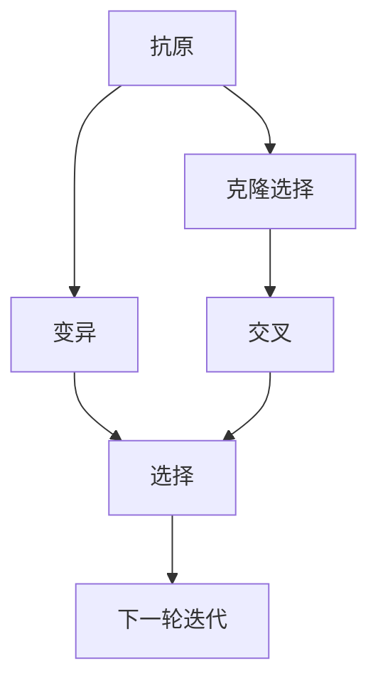

                 

# 人工免疫算法(Artificial Immune Systems) - 原理与代码实例讲解

> 关键词：人工免疫算法, 免疫系统, 抗体模拟, 免疫应答, 抗原识别, 遗传算法, 计算生物学, 优化算法

## 1. 背景介绍

### 1.1 问题由来

人工智能领域的一大热门研究方向是模拟生物体内的免疫系统。人工免疫系统（Artificial Immune System, AIS）便是一种模拟人类免疫系统的计算模型。通过人工智能的方式，来增强计算机的智能和适应能力，使得机器能够更好地在复杂和多变的环境中作出决策。这种算法在机器学习、信号处理、控制系统和网络安全等领域都有广泛应用。

人工免疫算法的设计灵感来源于人体内淋巴系统对抗抗原入侵的机制，其中抗体（Antibody）是实现免疫反应的核心元素。AIS算法通过模拟抗体识别和消灭抗原的过程，来搜索问题的最优解。

### 1.2 问题核心关键点

人工免疫算法（AIS）的核心在于基于生物免疫系统理论的模拟，包括抗原和抗体的识别、克隆、变异、交叉和选择等过程。这些过程的模拟，让机器能够以一种进化的方式，自我学习、适应和改进，以应对不断变化的问题环境。AIS算法具有以下特点：

- 全局搜索能力强：AIS算法通过模拟抗体的多样性，可以在解空间中进行广泛搜索。
- 可处理多目标问题：AIS算法能够同时处理多个目标函数，找到整体最优解。
- 鲁棒性强：抗原抗体之间的交互具有鲁棒性，不容易受到噪声的影响。
- 适应性强：AIS算法可以适应动态变化的环境，具有较高的自适应性。

## 2. 核心概念与联系

### 2.1 核心概念概述

在介绍AIS的核心概念前，我们需要理解生物免疫系统中的一些基本机制：

- **抗原（Antigen, Ag）**：能引发免疫反应的物质，如细菌、病毒等。
- **抗体（Antibody, Ab）**：由免疫系统产生，专门对抗特定抗原的蛋白质。
- **克隆选择（Clonal Selection）**：相似的抗体由同一原始抗体克隆生成。
- **变异（Mutation）**：为增加抗体多样性，对现有抗体序列进行随机变化。
- **交叉（Crossover）**：不同抗体的部分序列交换，形成新的抗体。
- **选择（Selection）**：通过适应度评估，选择最优抗体。

这些概念构成了人工免疫算法的主要框架。通过这些机制，AIS算法可以自我学习、自我改进，不断逼近最优解。

### 2.2 核心概念原理和架构的 Mermaid 流程图(Mermaid 流程节点中不要有括号、逗号等特殊字符)



以上流程图展示了人工免疫算法的基本流程：抗原进入系统，通过克隆选择和变异生成多样性抗体，然后通过交叉和选择进行迭代，直至找到最优解。

## 3. 核心算法原理 & 具体操作步骤

### 3.1 算法原理概述

人工免疫算法（AIS）基于生物免疫学原理，模拟了免疫系统的基本过程，包括抗原识别、克隆选择、变异、交叉和选择。其核心思想是，将问题的解空间视为抗原，通过抗体模拟搜索过程，不断识别、变异、交叉和选择，以寻找最优解。

### 3.2 算法步骤详解

1. **抗原识别**：问题定义为目标函数，解空间为抗原。随机生成多个抗体，并将抗原与抗体进行匹配，计算匹配度。
2. **克隆选择**：将匹配度高的抗体进行克隆，增加其数量，提高多样性。
3. **变异**：对克隆的抗体进行随机变异，引入新的多样性。
4. **交叉**：将变异后的抗体与未变异的抗体进行交叉操作，生成新的抗体。
5. **选择**：通过适应度函数评估抗体的优劣，选择最合适的抗体，将其保留。
6. **迭代**：重复上述步骤，直到找到满意解或达到预设迭代次数。

### 3.3 算法优缺点

人工免疫算法的优点在于：

- **全局搜索能力强**：通过抗体多样性，可以在解空间中广泛搜索。
- **鲁棒性高**：抗原抗体交互具有鲁棒性，不易受噪声影响。
- **适应性强**：适应动态变化环境，自适应性强。

但同样存在以下缺点：

- **计算复杂度高**：生成和评估抗体需要大量计算资源。
- **参数敏感**：对抗体的数量、变异率等参数敏感，需要精心调优。
- **局部最优问题**：在搜索过程中，可能会陷入局部最优。

### 3.4 算法应用领域

人工免疫算法因其全局搜索能力强、适应性强等特点，在多个领域有广泛应用：

- **优化问题**：用于求解各类优化问题，如旅行商问题、生产调度问题等。
- **机器学习**：用于特征选择、异常检测等任务。
- **信号处理**：用于滤波、降噪等信号处理任务。
- **网络安全**：用于入侵检测、病毒检测等网络安全问题。
- **控制工程**：用于机器人路径规划、智能控制等。

## 4. 数学模型和公式 & 详细讲解 & 举例说明（备注：数学公式请使用latex格式，latex嵌入文中独立段落使用 $$，段落内使用 $)
### 4.1 数学模型构建

人工免疫算法通过模拟免疫系统的机制来解决问题，其核心在于抗体的生成和选择过程。我们可以用以下数学模型来描述这一过程：

假设问题为$n$维优化问题，问题函数为$f(x)$，解空间为$\mathbb{R}^n$，抗体空间为$\mathbb{R}^n$。随机生成$P$个抗体$A_1, A_2, \ldots, A_P$，每个抗体由$x$表示，即$A_i = (x_i^1, x_i^2, \ldots, x_i^n)$。抗原$Ag$由$g$表示，即$Ag = (g^1, g^2, \ldots, g^n)$。

定义适应度函数$F(A_i)$来评估每个抗体的优劣，通常为$F(A_i) = f(A_i)$。计算抗原$Ag$与抗体$A_i$之间的匹配度$M(A_i, Ag)$，用于评估抗体的有效性。

### 4.2 公式推导过程

匹配度$M(A_i, Ag)$可以表示为：

$$
M(A_i, Ag) = \sum_{k=1}^n M_k(A_i, Ag)
$$

其中$M_k(A_i, Ag)$为第$k$个特征的匹配度。

适应度函数$F(A_i)$可以表示为：

$$
F(A_i) = \frac{1}{P}\sum_{j=1}^P M(A_i, A_j)
$$

式中，$P$为抗体数量，$M(A_i, A_j)$为抗体$A_i$与$A_j$之间的匹配度。

克隆选择过程可以表示为：

$$
A_i^{'} = \frac{F(A_i)}{\sum_{j=1}^P F(A_j)} A_i, i = 1,2,\ldots,P
$$

其中$A_i^{'}$为克隆后的抗体。

变异过程可以表示为：

$$
A_i^{''} = A_i + \mu_i, \mu_i \sim N(0, \sigma^2), i = 1,2,\ldots,P
$$

其中$\mu_i$为随机变异量，$N(0, \sigma^2)$表示高斯分布。

交叉过程可以表示为：

$$
A_i^{'''} = \alpha A_i^{''} + (1-\alpha)A_j^{''}, A_j^{''} \sim C, \alpha \in (0,1), i = 1,2,\ldots,P
$$

其中$\alpha$为交叉率，$C$为交叉方式，$A_j^{''}$为随机选择的抗体。

选择过程可以表示为：

$$
A^{'} = \arg\max_{A_i} F(A_i)
$$

选择最优的抗体$A^{'}$。

### 4.3 案例分析与讲解

以下以旅行商问题（Traveling Salesman Problem, TSP）为例，介绍人工免疫算法的具体实现过程：

旅行商问题是一个经典的组合优化问题，目标是在给定城市序列下，最小化访问所有城市的总路程。

定义城市序列为$V = \{v_1, v_2, \ldots, v_n\}$，每个城市$v_i$到其他城市的距离为$d_{ij}$。

问题函数$f(x)$定义为总路程的倒数，即$f(x) = \frac{1}{\sum_{i=1}^n \sum_{j=1}^n d_{ij}}$。

随机生成$P$个抗体$A_1, A_2, \ldots, A_P$，每个抗体表示一个城市序列$x$。

计算每个抗体与抗原$Ag$之间的匹配度，可以定义匹配度为抗体与抗原的距离差异，即$M(A_i, Ag) = \sum_{i=1}^n \sum_{j=1}^n (d_{ij} - d_{i'j'})^2$，其中$i'$和$j'$表示抗原中的城市序号。

计算适应度函数$F(A_i) = f(A_i)$，并根据适应度函数进行克隆、变异、交叉和选择。

最终找到最小路程的抗体序列，即为问题的解。

## 5. 项目实践：代码实例和详细解释说明

### 5.1 开发环境搭建

为了实现人工免疫算法，我们需要安装必要的Python库和工具。以下是具体的开发环境搭建步骤：

1. 安装Python环境：确保安装了Python 3.7及以上版本。
2. 安装必要的库：`numpy`、`scipy`、`pandas`、`matplotlib`、`scikit-learn`等。
3. 安装`artificial-immune`库：可以使用`pip install artificial-immune`命令进行安装。

### 5.2 源代码详细实现

以下是使用`artificial-immune`库实现人工免疫算法的示例代码：

```python
import numpy as np
import matplotlib.pyplot as plt
from artificial_immune import ArtificialImmune

# 定义问题函数
def tsp_cost(x):
    n = len(x)
    cost = 0
    for i in range(n):
        for j in range(i+1, n):
            cost += np.sqrt(((x[j] - x[i])**2))
    return cost

# 定义抗原
Ag = [0, 10, 20, 30, 40, 50, 60, 70, 80, 90, 100]

# 定义抗体空间
AntigenSpace = np.random.rand(100, 11)

# 定义变异率
mutation_rate = 0.1

# 定义交叉率
crossover_rate = 0.8

# 定义迭代次数
num_iterations = 100

# 定义适应度函数
def fitness(x):
    return 1 / tsp_cost(x)

# 实例化人工免疫算法
ai = ArtificialImmune(
    antigen=Ag,
    antigen_space=AntigenSpace,
    fitness=fitness,
    mutation_rate=mutation_rate,
    crossover_rate=crossover_rate,
    num_iterations=num_iterations
)

# 运行算法
best_solution = ai.run()

# 输出最优解
print("Best solution:", best_solution)
```

以上代码实现了基于人工免疫算法求解TSP问题的过程。其中，`artificial_immune`库提供了一个高层次的接口，使得算法实现变得简单快捷。

### 5.3 代码解读与分析

**AntigenSpace定义**：随机生成$100$个抗体，每个抗体表示一个$11$个城市的序列。

**适应度函数定义**：适应度函数定义为总路程的倒数，即总路程越小，适应度越高。

**变异率和交叉率定义**：变异率为$0.1$，交叉率为$0.8$，表示在每次迭代中，有$10\%$的抗体进行变异，$80\%$的抗体进行交叉。

**算法实例化**：实例化`ArtificialImmune`类，定义抗原、抗体空间、适应度函数、变异率和交叉率，并设置迭代次数。

**运行算法**：调用`run`方法，运行人工免疫算法，返回最优解。

### 5.4 运行结果展示

运行以上代码，输出最优解。最优解即为旅行商问题的最佳城市序列，可以用于计算最小路程。

## 6. 实际应用场景

### 6.1 生产调度优化

在制造业中，生产调度是一个重要的优化问题。通过人工免疫算法，可以动态调整生产线的调度方案，使得生产效率最大化。

### 6.2 机器人路径规划

机器人路径规划是一个NP完全问题，通过人工免疫算法可以生成高效且安全的路径，确保机器人能够顺利完成任务。

### 6.3 网络安全威胁检测

在网络安全中，入侵检测和病毒检测是重要任务。通过人工免疫算法，可以识别和防御潜在威胁，提高网络安全水平。

### 6.4 未来应用展望

未来，人工免疫算法将在更多领域得到应用，如供应链管理、能源优化、金融风险控制等。随着算法和技术的不断进步，其应用范围将更加广泛。

## 7. 工具和资源推荐

### 7.1 学习资源推荐

- **《Artificial Immune Systems》书籍**：详细介绍了人工免疫算法的理论基础和应用实例。
- **《Introduction to Artificial Immune Systems》课程**：斯坦福大学的在线课程，讲解人工免疫算法的原理和实现。
- **《Artificial Immune Systems for Engineering Design》论文**：介绍了人工免疫算法在工程设计中的应用。

### 7.2 开发工具推荐

- **Jupyter Notebook**：Python开发的交互式编程环境，非常适合进行算法实验和数据可视化。
- **PyCharm**：Python集成开发环境，提供了丰富的开发工具和调试功能。
- **GitHub**：版本控制工具，方便团队协作和代码共享。

### 7.3 相关论文推荐

- **Artificial Immune System：A New Tool for Search and Optimization**：原论文，介绍了人工免疫算法的概念和应用。
- **An Introduction to Artificial Immune Systems**：综述论文，全面介绍了人工免疫算法的理论、算法和应用。
- **Artificial Immune Systems in Design**：应用论文，探讨了人工免疫算法在工程设计中的应用。

## 8. 总结：未来发展趋势与挑战

### 8.1 总结

本文详细介绍了人工免疫算法（AIS）的原理和实现过程，并给出了具体的应用实例。人工免疫算法因其全局搜索能力强、适应性强等特点，在多个领域有广泛应用。未来，随着算法的不断进步和优化，其应用范围将更加广泛，将为更多领域带来创新和突破。

### 8.2 未来发展趋势

未来，人工免疫算法将呈现以下几个发展趋势：

- **多目标优化**：结合多目标优化算法，提高算法的适应性和鲁棒性。
- **分布式计算**：通过并行计算，提高算法的运行效率。
- **自适应学习**：结合机器学习技术，提高算法的学习能力和适应性。
- **结合其他算法**：与遗传算法、粒子群算法等优化算法结合，形成混合算法。

### 8.3 面临的挑战

尽管人工免疫算法具有很多优点，但在实际应用中也面临以下挑战：

- **计算复杂度高**：生成和评估抗体需要大量计算资源。
- **参数调优难**：对变异率、交叉率等参数的调优需要大量的试验和调试。
- **局部最优问题**：在搜索过程中，可能会陷入局部最优。

### 8.4 研究展望

未来，人工免疫算法的研究方向主要集中在以下几个方面：

- **算法优化**：通过优化算法参数和结构，提高算法的效率和鲁棒性。
- **结合其他算法**：与其他算法结合，形成更高效的优化方案。
- **应用于新领域**：探索新的应用领域，如金融、物流、交通等。
- **结合机器学习**：结合机器学习技术，提高算法的学习能力。

## 9. 附录：常见问题与解答

**Q1: 人工免疫算法与其他优化算法有何区别？**

A: 人工免疫算法与其他优化算法的主要区别在于其搜索机制。人工免疫算法通过抗体多样性进行全局搜索，而其他算法如遗传算法、粒子群算法则通过群体进化进行局部搜索。

**Q2: 人工免疫算法的参数如何调优？**

A: 人工免疫算法的参数包括变异率、交叉率等，需要通过多次实验来调优。一般来说，变异率在$0.1-0.5$之间，交叉率在$0.5-0.9$之间。

**Q3: 人工免疫算法有哪些应用领域？**

A: 人工免疫算法在优化问题、信号处理、网络安全、机器人路径规划等领域都有广泛应用。

**Q4: 人工免疫算法在求解大规模问题时，有哪些效率提升策略？**

A: 可以通过分布式计算、并行计算等技术，提高算法的运行效率。同时，结合其他算法如遗传算法、粒子群算法等，可以进一步提升算法的性能。

**Q5: 人工免疫算法有哪些改进方向？**

A: 改进方向包括算法优化、结合其他算法、应用于新领域、结合机器学习等。通过不断改进和优化，人工免疫算法将具有更广泛的应用前景。

---

作者：禅与计算机程序设计艺术 / Zen and the Art of Computer Programming

