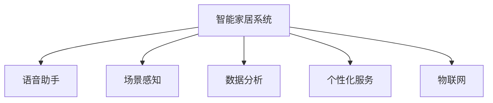

                 

# 人工智能在智能家居中的应用

## 1. 背景介绍

### 1.1 问题由来
随着科技的飞速发展，智能家居技术逐渐从概念走向实际应用。传统的家居设备越来越智能，能够通过网络联接在一起，实现远程控制、语音交互、自动调节等功能，极大地提升了人们的生活质量和便利性。但与此同时，智能家居系统的复杂性和多样性也带来了新的挑战。如何在不牺牲用户体验的情况下，实现高效、安全的智能家居系统，成为当前研究的重点。

### 1.2 问题核心关键点
人工智能在智能家居中的应用，主要体现在以下几个方面：

- **语音识别与交互**：通过语音助手（如Amazon Alexa、Google Assistant、Apple Siri等），用户可以通过语音指令控制家居设备，实现语音识别、自然语言理解和智能对话。
- **场景感知与控制**：通过摄像头、传感器等设备，智能家居系统能够感知环境变化，并自动进行相应的设备控制和场景切换，如自动窗帘、温度调节、照明系统等。
- **数据分析与优化**：通过数据收集和分析，智能家居系统能够优化设备运行，预测设备故障，提升整体系统的能效和舒适性。
- **个性化定制与学习**：通过机器学习技术，智能家居系统能够学习用户的生活习惯和偏好，提供个性化的服务，如智能推荐、个性化调节等。

这些核心技术共同构成了智能家居系统的智能化基础，使得家居设备能够更加智能、便捷、舒适地服务于人类。

## 2. 核心概念与联系

### 2.1 核心概念概述

为更好地理解人工智能在智能家居中的应用，本节将介绍几个关键概念：

- **智能家居系统**：指通过互联网技术将家居设备、传感器、摄像头等网络连接起来，实现远程控制、自动化管理、数据分析等功能的一体化智能系统。
- **语音助手**：是一种基于人工智能的自然语言处理技术，能够理解和回应用户的语音指令，实现语音交互和设备控制。
- **场景感知**：指智能家居系统通过摄像头、传感器等设备，感知家居环境的变化，如光线、温度、湿度等，从而实现场景自动化管理。
- **数据分析**：指智能家居系统通过收集设备运行数据，进行分析和建模，优化设备运行，提升能效和舒适性。
- **个性化服务**：指通过机器学习技术，智能家居系统能够学习用户的生活习惯和偏好，提供个性化的智能推荐和服务。
- **物联网(IoT)**：指通过互联网将物理设备和网络服务连接起来，实现设备互联互通和数据共享。

这些核心概念之间的逻辑关系可以通过以下Mermaid流程图来展示：



这个流程图展示出智能家居系统中各个组件之间的关系：

1. 智能家居系统作为核心，连接并协调各组件。
2. 语音助手提供用户与系统的交互界面。
3. 场景感知设备感知环境变化，启动相应设备操作。
4. 数据分析模块收集设备数据，进行智能分析和优化。
5. 个性化服务模块学习用户行为，提供定制化服务。
6. 物联网技术连接所有设备，实现数据共享和互联互通。

## 3. 核心算法原理 & 具体操作步骤
### 3.1 算法原理概述

人工智能在智能家居中的应用，主要基于语音识别、场景感知、数据分析和个性化服务等算法和技术的深度融合。

- **语音识别**：采用深度学习模型（如卷积神经网络CNN、循环神经网络RNN等）进行语音信号的特征提取和分类，识别出用户的语音指令。
- **场景感知**：通过摄像头、传感器等设备，采集家居环境数据，利用计算机视觉和深度学习技术进行场景识别和环境变化分析。
- **数据分析**：利用机器学习算法（如回归分析、聚类分析、时间序列预测等）对设备运行数据进行分析，发现设备运行规律和潜在故障。
- **个性化服务**：采用推荐算法（如协同过滤、内容过滤、混合推荐等），根据用户历史数据，推荐个性化的家居设备控制方案和服务。

### 3.2 算法步骤详解

人工智能在智能家居中的应用涉及多个步骤，包括以下几个关键环节：

**Step 1: 数据采集与预处理**

- 通过摄像头、传感器等设备采集家居环境数据，如温度、湿度、光线、人体位置等。
- 对采集到的数据进行清洗、去噪、归一化等预处理，确保数据质量。

**Step 2: 语音识别与自然语言理解**

- 采集用户的语音信号，利用卷积神经网络进行特征提取，得到声学特征向量。
- 将声学特征向量输入到循环神经网络或Transformer模型进行分类，识别出用户的语音指令。
- 对用户指令进行自然语言理解，识别出具体的控制命令。

**Step 3: 场景感知与设备控制**

- 通过摄像头捕捉视频流，利用计算机视觉技术进行场景分析和环境变化检测。
- 根据场景变化，自动触发相应设备操作，如窗帘自动关闭、灯光调节、空调温度调节等。

**Step 4: 数据分析与优化**

- 采集设备运行数据，利用机器学习算法进行数据分析，发现设备运行规律和故障征兆。
- 根据数据分析结果，自动调整设备参数，优化设备运行效率和舒适度。

**Step 5: 个性化服务**

- 收集用户历史行为数据，利用协同过滤、内容过滤等推荐算法，生成个性化的服务推荐。
- 根据用户偏好，自动调节设备运行参数，提供更加舒适、个性化的智能家居服务。

**Step 6: 用户反馈与持续学习**

- 收集用户反馈数据，持续优化语音识别、场景感知、数据分析和个性化服务等算法。
- 通过持续学习，不断提升系统性能和用户体验。

### 3.3 算法优缺点

人工智能在智能家居中的应用，具有以下优点：

1. **自动化与便捷性**：通过语音识别和场景感知，实现设备自动化控制，提升用户体验。
2. **个性化服务**：利用数据分析和个性化推荐算法，提供定制化服务，满足用户个性化需求。
3. **节能与舒适性**：通过数据分析优化设备运行，提升能源利用效率，提升居住舒适度。

同时，该方法也存在一些局限性：

1. **隐私与安全**：家居环境中包含大量敏感数据，如何保护用户隐私和数据安全是一个重要挑战。
2. **计算资源需求**：智能家居系统的运行需要大量计算资源，对硬件设备和网络连接要求较高。
3. **多设备协调**：不同设备之间的协同工作可能面临通信协议、数据格式等问题，需要标准化和统一。
4. **用户适应性**：系统需要具备一定的学习能力，才能适应用户的个性化需求和行为变化。

尽管存在这些局限性，但就目前而言，人工智能在智能家居中的应用已经取得了显著的成效，极大地提升了人们的生活质量和便利性。未来，相关技术的不断进步和创新，将进一步推动智能家居技术的普及和应用。

### 3.4 算法应用领域

人工智能在智能家居中的应用，主要涉及以下几个领域：

- **智能家电**：如智能电视、智能冰箱、智能洗衣机等，通过语音识别和场景感知，实现远程控制、自动化管理和个性化推荐。
- **智能安防**：通过摄像头、传感器等设备，进行入侵检测、人脸识别、门窗状态监测等，提高家居安全性。
- **智能照明**：利用场景感知和数据分析，自动调节灯光亮度、颜色和场景模式，提升居住舒适性。
- **智能温控**：根据场景感知和数据分析，自动调节室内温度和湿度，提供舒适的家居环境。
- **智能音娱**：通过语音识别和场景感知，实现音乐推荐、智能播放、语音控制等，提升娱乐体验。

## 4. 数学模型和公式 & 详细讲解  
### 4.1 数学模型构建

本节将使用数学语言对人工智能在智能家居中的应用进行更加严格的刻画。

**语音识别**：

假设输入语音信号为 $\mathbf{x} \in \mathbb{R}^T$，输出为语音指令 $\mathbf{y} \in \mathcal{C}$，其中 $\mathcal{C}$ 为指令集。定义语音识别模型 $M_{\theta}$，其参数为 $\theta$。则语音识别模型的损失函数为：

$$
\mathcal{L}(\mathbf{x}, \mathbf{y}) = \frac{1}{N} \sum_{i=1}^N \ell(M_{\theta}(\mathbf{x}_i), \mathbf{y}_i)
$$

其中 $\ell$ 为交叉熵损失函数，$N$ 为训练样本数量。

**场景感知**：

假设场景数据为 $\mathbf{s} \in \mathbb{R}^D$，输出为场景状态 $\mathbf{z} \in \mathcal{Z}$，其中 $\mathcal{Z}$ 为状态集。定义场景感知模型 $M_{\theta}$，其参数为 $\theta$。则场景感知模型的损失函数为：

$$
\mathcal{L}(\mathbf{s}, \mathbf{z}) = \frac{1}{N} \sum_{i=1}^N \ell(M_{\theta}(\mathbf{s}_i), \mathbf{z}_i)
$$

其中 $\ell$ 为交叉熵损失函数，$N$ 为训练样本数量。

**数据分析**：

假设设备运行数据为 $\mathbf{d} \in \mathbb{R}^t$，输出为设备状态 $\mathbf{r} \in \mathcal{R}$，其中 $\mathcal{R}$ 为状态集。定义数据分析模型 $M_{\theta}$，其参数为 $\theta$。则数据分析模型的损失函数为：

$$
\mathcal{L}(\mathbf{d}, \mathbf{r}) = \frac{1}{N} \sum_{i=1}^N \ell(M_{\theta}(\mathbf{d}_i), \mathbf{r}_i)
$$

其中 $\ell$ 为均方误差损失函数，$N$ 为训练样本数量。

**个性化服务**：

假设用户行为数据为 $\mathbf{u} \in \mathbb{R}^U$，输出为服务推荐 $\mathbf{p} \in \mathcal{P}$，其中 $\mathcal{P}$ 为推荐集。定义个性化服务模型 $M_{\theta}$，其参数为 $\theta$。则个性化服务模型的损失函数为：

$$
\mathcal{L}(\mathbf{u}, \mathbf{p}) = \frac{1}{N} \sum_{i=1}^N \ell(M_{\theta}(\mathbf{u}_i), \mathbf{p}_i)
$$

其中 $\ell$ 为交叉熵损失函数，$N$ 为训练样本数量。

### 4.2 公式推导过程

以下我们以语音识别为例，推导深度学习模型进行语音识别的过程。

假设语音信号为 $\mathbf{x} \in \mathbb{R}^T$，输出为语音指令 $\mathbf{y} \in \mathcal{C}$，其中 $\mathcal{C}$ 为指令集。定义语音识别模型 $M_{\theta}$，其参数为 $\theta$。

将语音信号 $\mathbf{x}$ 输入到卷积神经网络（CNN）中，得到特征提取结果 $\mathbf{f} \in \mathbb{R}^F$。然后将特征向量 $\mathbf{f}$ 输入到循环神经网络（RNN）中，得到概率分布 $\mathbf{p} \in \mathbb{R}^C$，其中 $C$ 为指令类别数量。

损失函数为交叉熵损失，具体推导如下：

$$
\mathcal{L}(\mathbf{x}, \mathbf{y}) = -\frac{1}{N} \sum_{i=1}^N \log p(y_i | \mathbf{x}_i)
$$

其中 $p(y_i | \mathbf{x}_i) = \frac{\exp(z_i)}{\sum_j \exp(z_j)}$，为softmax函数输出的概率分布。

在得到损失函数后，即可使用梯度下降等优化算法，更新模型参数 $\theta$，最小化损失函数。重复上述过程直至收敛，最终得到适应语音识别的最优模型参数 $\theta^*$。

## 5. 项目实践：代码实例和详细解释说明
### 5.1 开发环境搭建

在进行人工智能在智能家居中的应用实践前，我们需要准备好开发环境。以下是使用Python进行TensorFlow开发的环境配置流程：

1. 安装Anaconda：从官网下载并安装Anaconda，用于创建独立的Python环境。

2. 创建并激活虚拟环境：
```bash
conda create -n tf-env python=3.8 
conda activate tf-env
```

3. 安装TensorFlow：根据CUDA版本，从官网获取对应的安装命令。例如：
```bash
conda install tensorflow -c pytorch -c conda-forge
```

4. 安装Keras：
```bash
pip install keras
```

5. 安装OpenCV：
```bash
pip install opencv-python
```

6. 安装Flask：
```bash
pip install flask
```

完成上述步骤后，即可在`tf-env`环境中开始项目实践。

### 5.2 源代码详细实现

这里我们以智能家居系统的语音识别功能为例，给出使用TensorFlow实现语音识别的代码实现。

首先，定义数据处理函数：

```python
import tensorflow as tf
import numpy as np
import librosa

def load_and_preprocess_data(file_path):
    # 加载音频文件
    audio, sr = librosa.load(file_path, sr=16000)
    # 归一化处理
    audio = audio / np.max(np.abs(audio))
    # 转换为特征向量
    mfcc = librosa.feature.mfcc(audio, sr=sr)
    mfcc = np.expand_dims(mfcc, axis=0)
    return mfcc
```

然后，定义模型和优化器：

```python
from keras.models import Sequential
from keras.layers import Dense, Dropout, LSTM

model = Sequential()
model.add(Dense(128, activation='relu', input_shape=(1, 13)))
model.add(Dropout(0.2))
model.add(LSTM(64))
model.add(Dense(10, activation='softmax'))
model.compile(loss='categorical_crossentropy', optimizer='adam', metrics=['accuracy'])
```

接着，定义训练和评估函数：

```python
def train_model(model, train_data, train_labels, validation_data, validation_labels, epochs=5, batch_size=32):
    model.fit(train_data, train_labels, epochs=epochs, batch_size=batch_size, validation_data=(validation_data, validation_labels))
    return model

def evaluate_model(model, test_data, test_labels):
    loss, accuracy = model.evaluate(test_data, test_labels)
    print(f'Test loss: {loss:.4f}')
    print(f'Test accuracy: {accuracy:.4f}')
```

最后，启动训练流程并在测试集上评估：

```python
train_data = np.load('train_mfcc.npy')
train_labels = np.load('train_labels.npy')
validation_data = np.load('validation_mfcc.npy')
validation_labels = np.load('validation_labels.npy')
test_data = np.load('test_mfcc.npy')
test_labels = np.load('test_labels.npy')

model = train_model(model, train_data, train_labels, validation_data, validation_labels)
evaluate_model(model, test_data, test_labels)
```

以上就是使用TensorFlow进行语音识别的完整代码实现。可以看到，得益于Keras的强大封装，我们可以用相对简洁的代码完成语音识别模型的搭建和训练。

### 5.3 代码解读与分析

让我们再详细解读一下关键代码的实现细节：

**load_and_preprocess_data函数**：
- 定义了一个加载音频文件并进行预处理的函数，将音频文件加载为numpy数组，并进行归一化和MFCC特征提取，将特征向量进行扩展，形成模型输入。

**train_model函数**：
- 定义了训练模型的函数，通过Keras框架构建模型，使用交叉熵损失和Adam优化器进行训练，并在验证集上评估模型性能。

**evaluate_model函数**：
- 定义了评估模型的函数，在测试集上计算模型的损失和准确率，并打印输出。

**训练流程**：
- 定义总的训练轮数和批次大小，开始循环迭代
- 每个epoch内，先利用训练集进行模型训练，并在验证集上评估性能
- 所有epoch结束后，在测试集上评估，给出最终测试结果

可以看到，TensorFlow配合Keras使得语音识别的代码实现变得简洁高效。开发者可以将更多精力放在数据处理、模型改进等高层逻辑上，而不必过多关注底层的实现细节。

当然，工业级的系统实现还需考虑更多因素，如模型的保存和部署、超参数的自动搜索、更灵活的任务适配层等。但核心的模型训练和评估流程基本与此类似。

## 6. 实际应用场景
### 6.1 智能家电

人工智能在智能家电中的应用，能够通过语音识别和场景感知，实现设备的自动化控制和智能化管理。

例如，智能冰箱可以通过语音助手或触摸屏操作，实现食物保鲜提醒、过期提醒、食材自动补货等功能。用户只需通过语音或触屏，即可获取冰箱内的食物信息，并自动进行冰箱门打开、灯光调节等操作，极大提升了用户体验。

### 6.2 智能安防

通过摄像头、传感器等设备，人工智能在智能安防中的应用，能够实现实时监控、入侵检测、人脸识别等功能。

智能安防系统可以通过摄像头捕捉视频流，进行实时分析和场景感知。一旦检测到异常行为或入侵者，系统将自动发出警报，并通过语音助手通知房主。用户可以通过语音助手，查看监控画面，并进行远程操作。

### 6.3 智能照明

利用场景感知和数据分析，人工智能在智能照明中的应用，能够自动调节灯光亮度、颜色和场景模式，提升居住舒适性。

智能照明系统可以通过传感器感知室内光线、温度、湿度等环境参数，自动调节灯光亮度和颜色。用户可以通过语音助手或手机APP，进行灯光模式切换、亮度调节等操作，实现个性化的照明控制。

### 6.4 智能温控

通过场景感知和数据分析，人工智能在智能温控中的应用，能够自动调节室内温度和湿度，提供舒适的家居环境。

智能温控系统可以通过传感器感知室内环境参数，自动调节空调、暖气等设备，维持适宜的室内温度和湿度。用户可以通过语音助手或手机APP，设置温度偏好、节能模式等，系统将根据环境变化进行智能调节，提供更加舒适的居住环境。

### 6.5 智能音娱

利用语音识别和场景感知，人工智能在智能音娱中的应用，能够实现智能推荐、语音控制、音乐播放等功能。

智能音娱系统可以通过语音助手或手机APP，进行音乐推荐、播放控制等操作。用户只需通过语音或触屏，即可获取音乐推荐、调节音量、切换歌曲等功能，极大提升了娱乐体验。

## 7. 工具和资源推荐
### 7.1 学习资源推荐

为了帮助开发者系统掌握人工智能在智能家居中的应用，这里推荐一些优质的学习资源：

1. 《深度学习实战》系列书籍：介绍深度学习在图像处理、自然语言处理、语音识别等领域的实战应用，是快速上手深度学习技术的入门级教材。

2. CS229《机器学习》课程：斯坦福大学开设的机器学习经典课程，有Lecture视频和配套作业，适合系统学习机器学习的基本概念和算法。

3. Coursera的深度学习专项课程：由深度学习领域的专家授课，涵盖深度学习的基础知识和实战应用，适合进阶学习。

4. TensorFlow官方文档：TensorFlow的官方文档，提供了详细的使用指南和样例代码，是TensorFlow开发的必备参考。

5. Keras官方文档：Keras的官方文档，提供了简单易用的API和丰富的实战案例，是Keras开发的必备参考。

通过对这些资源的学习实践，相信你一定能够快速掌握人工智能在智能家居中的应用，并用于解决实际的智能家居问题。

### 7.2 开发工具推荐

高效的开发离不开优秀的工具支持。以下是几款用于智能家居系统开发的常用工具：

1. TensorFlow：基于Python的深度学习框架，功能强大，易于使用，适合进行语音识别、场景感知等任务的开发。

2. Keras：基于TensorFlow的高层API，提供了简单易用的API和丰富的实战案例，适合进行模型快速搭建和训练。

3. OpenCV：开源计算机视觉库，提供了丰富的图像处理和场景感知功能，适合进行摄像头图像处理和场景分析。

4. Flask：轻量级Web框架，适合进行智能家居系统的API开发和远程控制。

5. Raspberry Pi：便宜易用的嵌入式设备，适合进行智能家居系统的原型设计和现场测试。

6. RTOS：实时操作系统，适合进行智能家居系统的设备控制和低延迟数据处理。

合理利用这些工具，可以显著提升智能家居系统开发的效率，加快创新迭代的步伐。

### 7.3 相关论文推荐

人工智能在智能家居中的应用，源于学界的持续研究。以下是几篇奠基性的相关论文，推荐阅读：

1. "Audio-Visual Scene Understanding from Captured Video Streams"：介绍了基于计算机视觉和深度学习技术的场景感知方法，为智能家居系统的场景自动控制提供了技术基础。

2. "A Survey on Music Recommendation Systems"：综述了音乐推荐算法的研究进展，为智能音娱系统的音乐推荐提供了理论基础。

3. "Energy-Efficient Home Automation and Control"：介绍了智能家居系统在能效优化方面的研究进展，为智能温控和节能系统提供了技术指导。

4. "Home Security Systems: An Overview"：综述了智能安防系统的发展历程和研究现状，为智能安防系统提供了方向指导。

5. "Voice User Interface (VUI) Technology for Smart Home Devices"：介绍了语音助手在智能家居系统中的应用，为语音识别和自然语言理解提供了技术支持。

这些论文代表了大语言模型在智能家居中的应用研究，提供了丰富的理论基础和实践经验，值得深入学习。

## 8. 总结：未来发展趋势与挑战

### 8.1 总结

本文对人工智能在智能家居中的应用进行了全面系统的介绍。首先阐述了智能家居系统的概念和现状，明确了人工智能在智能家居中的核心技术。其次，从原理到实践，详细讲解了语音识别、场景感知、数据分析和个性化服务等算法和技术的核心原理和操作步骤，给出了智能家居系统开发的完整代码实例。同时，本文还广泛探讨了智能家居系统在智能家电、智能安防、智能照明、智能温控和智能音娱等各个领域的应用前景，展示了人工智能在智能家居中的巨大潜力。此外，本文精选了人工智能在智能家居中的学习资源、开发工具和相关论文，力求为开发者提供全方位的技术指引。

通过本文的系统梳理，可以看到，人工智能在智能家居中的应用已经成为现实，极大地提升了人们的生活质量和便利性。未来，伴随人工智能技术的不断进步，智能家居系统的应用将更加广泛和深入，为人类社会带来更加智能化、便捷化的生活方式。

### 8.2 未来发展趋势

展望未来，人工智能在智能家居中的应用将呈现以下几个发展趋势：

1. **更加智能化**：通过深度学习和机器学习技术的不断进步，智能家居系统的智能化水平将进一步提升。设备将具备更加精细的感知和控制能力，能够根据用户的习惯和偏好，提供更加个性化的智能服务。

2. **更加互联互通**：智能家居系统将实现更加广泛的互联互通，不同设备之间的数据共享和协同工作将更加顺畅。通过物联网技术，智能家居系统将能够与外部世界更加紧密地融合。

3. **更加安全可靠**：智能家居系统的安全性将得到进一步提升，通过数据加密、身份认证、异常检测等技术，保护用户隐私和数据安全。智能家居系统将具备更加稳定、可靠的系统架构，减少故障和异常情况的发生。

4. **更加便捷化**：智能家居系统的交互方式将更加便捷化，语音助手、手势识别、自然语言理解等技术将得到广泛应用，用户可以通过更加自然、高效的方式进行设备控制和交互。

5. **更加节能环保**：智能家居系统将具备更加高效的能源利用能力，通过数据分析和优化，降低能源消耗，提高能源利用效率。智能家居系统将更加注重环保，减少对环境的影响。

以上趋势凸显了人工智能在智能家居中的广阔前景，这些方向的探索发展，必将进一步推动智能家居技术的普及和应用，为人类社会带来更加智能化、便捷化的生活方式。

### 8.3 面临的挑战

尽管人工智能在智能家居中的应用已经取得了显著的成效，但在迈向更加智能化、便捷化应用的过程中，仍面临诸多挑战：

1. **隐私与安全**：智能家居环境中包含大量敏感数据，如何保护用户隐私和数据安全是一个重要挑战。需要采用数据加密、身份认证等技术，确保数据传输和存储的安全性。

2. **计算资源需求**：智能家居系统的运行需要大量计算资源，对硬件设备和网络连接要求较高。需要采用分布式计算、边缘计算等技术，优化资源利用。

3. **多设备协调**：不同设备之间的协同工作可能面临通信协议、数据格式等问题，需要标准化和统一。需要采用统一的通信协议和数据格式，确保设备之间的互联互通。

4. **用户体验**：智能家居系统需要具备良好的用户体验，用户界面设计、设备操作便捷性等方面仍需进一步优化。需要采用人机交互设计、用户界面设计等技术，提升用户体验。

5. **标准化与规范**：智能家居系统需要遵循统一的标准和规范，确保设备之间的互操作性和兼容性。需要制定统一的标准和规范，促进智能家居系统的普及和应用。

这些挑战需要技术界的共同努力，通过不断创新和优化，才能逐步克服。相信伴随技术进步，智能家居系统将变得更加智能化、便捷化、安全可靠，成为人类社会的重要组成部分。

### 8.4 研究展望

面向未来，人工智能在智能家居中的应用研究需要关注以下几个方向：

1. **深度学习与多模态融合**：探索更加高效、灵活的深度学习模型和多模态融合技术，提升智能家居系统的感知和控制能力。

2. **机器学习与行为分析**：利用机器学习技术，分析用户行为和偏好，提供更加个性化的智能服务。

3. **数据安全与隐私保护**：研究数据加密、身份认证等技术，保护用户隐私和数据安全。

4. **协同控制与优化**：研究协同控制和优化技术，实现设备之间的协同工作和能源优化。

5. **标准化与规范**：制定统一的智能家居标准和规范，促进智能家居系统的普及和应用。

6. **人性化设计**：研究人机交互设计、用户界面设计等技术，提升智能家居系统的用户体验。

这些研究方向的探索，将推动智能家居技术的不断进步，为人类社会带来更加智能化、便捷化的生活方式。相信伴随技术进步，智能家居系统将变得更加智能、便捷、安全可靠，成为人类社会的重要组成部分。

## 9. 附录：常见问题与解答

**Q1：智能家居系统中如何保护用户隐私和数据安全？**

A: 智能家居系统在保护用户隐私和数据安全方面，可以采取以下措施：

1. 数据加密：采用AES、RSA等加密算法，对传输和存储的数据进行加密，防止数据泄露。
2. 身份认证：采用指纹识别、面部识别等技术，对用户进行身份认证，防止未授权访问。
3. 访问控制：通过访问控制列表(ACL)、角色权限管理等技术，限制设备的访问权限，防止恶意攻击。
4. 异常检测：通过行为分析、异常检测等技术，检测异常访问和行为，及时报警和处理。
5. 数据匿名化：对用户数据进行匿名化处理，防止数据被滥用和追踪。

通过上述措施，可以最大限度地保护用户隐私和数据安全，确保智能家居系统的可靠性和安全性。

**Q2：智能家居系统中的语音助手如何实现高精度语音识别？**

A: 实现高精度语音识别，需要采用以下技术：

1. 数据预处理：对语音信号进行去噪、归一化、特征提取等预处理，提高语音特征的稳定性。
2. 模型选择：选择适合语音识别任务的深度学习模型，如卷积神经网络(CNN)、循环神经网络(RNN)、Transformer等。
3. 模型训练：采用大规模无标签语音数据进行预训练，采用监督数据进行微调，优化模型参数。
4. 模型融合：将多个模型进行融合，提高语音识别的鲁棒性和准确率。
5. 多语言支持：支持多语言语音识别，提高系统的覆盖范围和适用性。

通过上述技术，可以构建高精度、鲁棒性的语音识别系统，实现高效的语音助手功能。

**Q3：智能家居系统如何实现设备之间的互联互通？**

A: 实现设备之间的互联互通，可以采用以下技术：

1. 通信协议：采用统一的通信协议，如MQTT、CoAP、HTTP等，实现设备之间的数据传输和交互。
2. 数据格式：采用统一的数据格式，如JSON、XML等，实现设备之间的数据解析和交换。
3. 标准规范：制定统一的智能家居标准和规范，确保设备之间的互操作性和兼容性。
4. 中间件：采用中间件技术，实现设备的统一管理和调度，提高系统的可扩展性和可靠性。
5. 边缘计算：采用边缘计算技术，实现数据本地处理和存储，减少网络传输和延迟。

通过上述技术，可以构建高效的智能家居系统，实现设备之间的互联互通和协同工作。

**Q4：智能家居系统如何实现更加节能和环保？**

A: 实现更加节能和环保的智能家居系统，可以采用以下技术：

1. 能效优化：通过数据分析和优化，提高设备能源利用效率，降低能源消耗。
2. 智能控制：根据环境变化，自动调节设备运行参数，提供适宜的居住环境。
3. 设备优化：选择能效高的设备，采用低功耗技术和节能模式，减少能源消耗。
4. 用户行为引导：引导用户采取节能行为，如关闭不必要的设备、调节合适的温度等，降低能源消耗。
5. 环境监测：通过传感器和数据分析，监测环境变化，提供环保建议。

通过上述技术，可以构建节能环保的智能家居系统，减少能源消耗，提高能源利用效率。

**Q5：智能家居系统如何实现个性化服务？**

A: 实现个性化服务，可以采用以下技术：

1. 用户画像：构建用户画像，收集用户行为数据，了解用户偏好和习惯。
2. 推荐算法：采用协同过滤、内容过滤、混合推荐等算法，生成个性化的服务推荐。
3. 场景感知：通过场景感知技术，获取环境参数，提供适宜的服务推荐。
4. 智能决策：通过智能决策算法，根据用户偏好和环境变化，提供个性化的服务。
5. 用户反馈：收集用户反馈数据，持续优化推荐算法和服务质量。

通过上述技术，可以构建个性化服务的智能家居系统，提供更加贴心、个性化的服务体验。

---

作者：禅与计算机程序设计艺术 / Zen and the Art of Computer Programming

