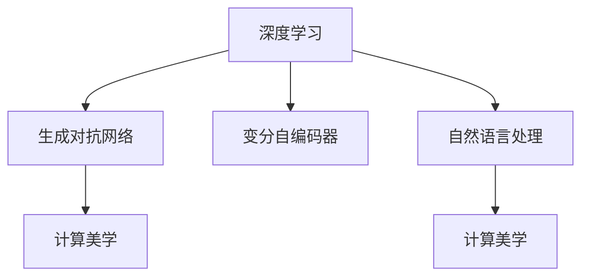

                 

# 人工智能艺术：创造力和表达

> 关键词：人工智能,艺术,创造力,表达,深度学习,生成对抗网络,自然语言处理,计算美学

## 1. 背景介绍

### 1.1 问题由来
自深度学习技术诞生以来，人类对人工智能(AI)的理解和应用已经从传统的计算和算法优化，逐渐拓展到了创造性领域。艺术、音乐、文学、绘画等传统领域，开始借助AI的力量，创造出了前所未有的作品和表现形式。随着生成对抗网络(GAN)、变分自编码器(VAE)、自然语言处理(NLP)等AI技术的飞速发展，AI在艺术领域的创造力和表达力得到了显著提升。

人工智能艺术是一种新型的创作形式，其本质是将AI算法应用于艺术创作和表达，通过算法自动化生成作品。AI艺术的兴起，代表了一种新的艺术表现方式，既体现了人类对技术的掌控，也揭示了技术的艺术潜能。

### 1.2 问题核心关键点
人工智能艺术的核心在于将创造力和表达力注入算法中，使其能够自主创作和生成艺术作品。其关键点包括：

- **算法生成**：使用深度学习等算法，从大量数据中学习生成规律，自动创作艺术作品。
- **参数优化**：通过调整模型参数，控制生成作品的样式和风格。
- **多模态融合**：结合文本、声音、图像等多种模态信息，生成跨领域的艺术作品。
- **交互式创作**：通过用户输入和互动，引导AI艺术创作，实现“人机协同”。
- **版权问题**：涉及AI创作的作品归属，是知识产权领域的新课题。

这些关键点共同构成了人工智能艺术的设计理念和技术架构，使得AI能够以全新的方式参与到艺术创作中。

### 1.3 问题研究意义
人工智能艺术不仅为传统艺术创作带来了新的方法和工具，也拓展了人类对艺术的理解和认知。研究人工智能艺术，对于推动技术与艺术的融合、探索人类创造力的极限，具有重要的意义：

1. **创新艺术形式**：AI艺术带来了新的艺术表达方式，丰富了艺术的多样性和包容性。
2. **提升创作效率**：AI能够自动生成艺术作品，极大提高了创作效率，缩短了艺术生产周期。
3. **促进跨领域融合**：AI艺术的跨模态融合特性，为不同艺术形式之间的创新提供了新的可能性。
4. **激发创意灵感**：AI艺术的多样性和随机性，能够激发人类创作者的灵感，促成更多跨界作品。
5. **推动艺术普及**：AI艺术的低成本和易访问性，有助于普及艺术，让更多人参与到艺术创作中来。

## 2. 核心概念与联系

### 2.1 核心概念概述

为更好地理解人工智能艺术的原理和应用，本节将介绍几个密切相关的核心概念：

- **深度学习**：一种基于神经网络的机器学习范式，通过多层非线性映射，能够自动提取数据中的高级特征。深度学习在图像、语音、文本等领域取得了广泛应用。

- **生成对抗网络(GANs)**：一种用于生成新数据的深度学习模型，由生成器和判别器两个网络构成，通过对抗性训练过程，生成与真实数据分布相近的新数据。

- **变分自编码器(VAEs)**：一种用于生成数据的变分模型，通过重构损失和潜在空间分布损失，学习数据的概率分布，生成高质量的新数据。

- **自然语言处理(NLP)**：一种处理和分析人类语言的技术，包括文本分类、文本生成、语言模型等。NLP技术在艺术创作中的应用，如自动诗歌生成、文本到图像转换等，展示了语言和艺术的深度融合。

- **计算美学**：一种研究计算机生成艺术的美学价值和理论基础的学科，探讨计算机在创造美学对象中的作用和原则。

这些核心概念之间的逻辑关系可以通过以下Mermaid流程图来展示：



这个流程图展示了大语言模型的核心概念及其之间的关系：

1. 深度学习是大模型生成的基础。
2. GANs和VAEs是生成新数据的重要方法。
3. NLP技术能够处理和生成文本数据，与生成对抗网络结合，可以生成新的艺术作品。
4. 计算美学为人工智能艺术提供了理论支撑，探讨了生成艺术的审美价值。

## 3. 核心算法原理 & 具体操作步骤
### 3.1 算法原理概述

人工智能艺术的生成过程，本质上是一种基于深度学习的生成过程。其核心思想是：通过训练生成模型，使其能够从大量数据中学习到生成规律，自动生成新的艺术作品。

形式化地，假设生成模型为 $G_{\theta}$，其中 $\theta$ 为模型的参数。给定训练数据集 $D=\{(x,y)\}_{i=1}^N, x \in \mathcal{X}, y \in \mathcal{Y}$，其中 $\mathcal{X}$ 为输入空间，$\mathcal{Y}$ 为输出空间。生成模型 $G_{\theta}$ 的目标是最小化生成样本与真实数据之间的差异，即：

$$
\hat{\theta}=\mathop{\arg\min}_{\theta} \mathcal{L}(G_{\theta},D)
$$

其中 $\mathcal{L}$ 为生成样本与真实数据之间的差异度量，如重构损失、生成对抗损失等。常见的生成模型包括生成对抗网络(GANs)、变分自编码器(VAEs)、自回归模型等。

### 3.2 算法步骤详解

基于深度学习的生成模型生成艺术作品，一般包括以下几个关键步骤：

**Step 1: 准备训练数据集**
- 收集和整理大量高质量的艺术数据，如画作、音乐、文本等，作为训练数据集 $D$。
- 数据集需要经过标注和预处理，保证数据的一致性和多样性。

**Step 2: 选择生成模型**
- 根据任务特点和数据类型，选择合适的生成模型，如GANs、VAEs、自回归模型等。
- 定义模型的结构，包括输入层、隐藏层、输出层等，确定参数初始化策略。

**Step 3: 设置生成模型超参数**
- 选择合适的优化算法及其参数，如Adam、SGD等，设置学习率、批大小、迭代轮数等。
- 设置正则化技术及强度，包括权重衰减、Dropout、Early Stopping等。
- 确定冻结模型参数的策略，如仅生成器参与训练，或生成器和判别器同时训练。

**Step 4: 执行训练过程**
- 将训练数据分批次输入模型，前向传播计算损失函数。
- 反向传播计算参数梯度，根据设定的优化算法和学习率更新模型参数。
- 周期性在验证集上评估模型性能，根据性能指标决定是否触发 Early Stopping。
- 重复上述步骤直到满足预设的迭代轮数或 Early Stopping 条件。

**Step 5: 生成艺术作品**
- 在训练好的生成模型上，随机生成样本输入，通过前向传播生成新作品。
- 输出作品后，可以对其进行修改和优化，以符合特定的审美要求。
- 利用生成模型生成大量的艺术作品，进行集中选择和展示。

以上是基于深度学习的生成模型生成艺术作品的一般流程。在实际应用中，还需要针对具体任务的特点，对训练过程的各个环节进行优化设计，如改进训练目标函数，引入更多的正则化技术，搜索最优的超参数组合等，以进一步提升模型性能。

### 3.3 算法优缺点

基于深度学习的生成模型生成艺术作品，具有以下优点：

1. **自动化生成**：模型能够自动生成艺术作品，减少了人工干预，提高了创作效率。
2. **多样性丰富**：模型能够生成多样化的艺术作品，涵盖不同的风格和主题。
3. **风格可控**：通过调整模型参数，可以控制生成作品的风格和特征。
4. **创作灵活**：生成模型能够适应不同的创作需求，实现多种形式的艺术创作。

同时，该方法也存在一定的局限性：

1. **需要大量数据**：生成高质量的艺术作品，需要大量的标注数据和高质量的样本。
2. **模型复杂度高**：生成模型通常包含大量参数，训练和推理的计算量较大。
3. **风格多样性有限**：生成模型的多样性受到数据分布的限制，难以完全覆盖所有的风格和主题。
4. **生成质量不稳定**：生成的作品质量不稳定，可能存在模糊、扭曲等问题。
5. **版权问题**：生成作品可能存在版权争议，如何界定创作和复制的区别，是法律上的新问题。

尽管存在这些局限性，但就目前而言，基于深度学习的生成模型生成艺术作品的方法仍是大规模应用的主流范式。未来相关研究的重点在于如何进一步降低生成模型对标注数据的依赖，提高生成作品的质量和多样性，同时兼顾可解释性和版权保护等因素。

### 3.4 算法应用领域

基于深度学习的生成模型生成艺术作品，在多个领域得到了广泛应用，例如：

- **视觉艺术**：生成画作、摄影作品、3D模型等视觉艺术作品。使用GANs、VAEs等模型，可以生成具有高度细节和逼真度的艺术作品。

- **音乐艺术**：生成音乐作品，包括歌曲、旋律、乐曲等。使用变分自编码器等模型，可以生成具有复杂结构和美妙旋律的音乐作品。

- **文学艺术**：生成诗歌、小说、散文等文本作品。使用自回归模型等模型，可以生成具有深刻思想和丰富情感的文学作品。

- **交互式艺术**：利用用户输入和互动，生成个性化的艺术作品。使用生成对抗网络等模型，可以与用户进行实时交互，生成符合用户期望的艺术作品。

除了上述这些经典应用外，AI艺术还被创新性地应用到更多场景中，如跨模态艺术创作、虚拟现实艺术、人工智能驱动的艺术展览等，为艺术创作和展示带来了全新的突破。

## 4. 数学模型和公式 & 详细讲解  
### 4.1 数学模型构建

本节将使用数学语言对基于深度学习的生成模型生成艺术作品的过程进行更加严格的刻画。

记生成模型为 $G_{\theta}$，其中 $\theta$ 为模型参数。假设生成模型训练数据集为 $D=\{(x,y)\}_{i=1}^N, x \in \mathcal{X}, y \in \mathcal{Y}$。

定义生成模型在数据样本 $(x,y)$ 上的损失函数为 $\ell(G_{\theta}(x),y)$，则在数据集 $D$ 上的经验风险为：

$$
\mathcal{L}(\theta) = \frac{1}{N} \sum_{i=1}^N \ell(G_{\theta}(x_i),y_i)
$$

在实践中，我们通常使用基于梯度的优化算法（如Adam、SGD等）来近似求解上述最优化问题。设 $\eta$ 为学习率，$\lambda$ 为正则化系数，则参数的更新公式为：

$$
\theta \leftarrow \theta - \eta \nabla_{\theta}\mathcal{L}(\theta) - \eta\lambda\theta
$$

其中 $\nabla_{\theta}\mathcal{L}(\theta)$ 为损失函数对参数 $\theta$ 的梯度，可通过反向传播算法高效计算。

### 4.2 公式推导过程

以下我们以GANs生成画作为例，推导生成模型的损失函数及其梯度的计算公式。

假设生成模型 $G_{\theta}$ 的输入为噪声向量 $z$，输出为图像 $G(z)$。假设判别器 $D_{\phi}$ 能够区分真实图像和生成图像，定义为 $D_{\phi}(G(z))$。定义交叉熵损失为：

$$
\ell(G(z), y) = -y \log D_{\phi}(G(z)) - (1-y) \log (1 - D_{\phi}(G(z)))
$$

生成模型的训练目标函数为：

$$
\mathcal{L}(\theta) = \mathbb{E}_{z \sim p_z}[ \ell(G(z), y)] + \mathbb{E}_{x \sim p_x}[ \log (1 - D_{\phi}(G(z)))]
$$

其中 $p_z$ 为噪声向量的概率分布，$p_x$ 为真实图像的概率分布。

根据链式法则，损失函数对参数 $\theta$ 的梯度为：

$$
\frac{\partial \mathcal{L}(\theta)}{\partial \theta} = \mathbb{E}_{z \sim p_z}[ \nabla_{\theta} \ell(G(z), y)] + \mathbb{E}_{x \sim p_x}[ \nabla_{\theta} \log (1 - D_{\phi}(G(z)))]
$$

在得到损失函数的梯度后，即可带入参数更新公式，完成模型的迭代优化。重复上述过程直至收敛，最终得到生成模型 $G_{\theta}$。

## 5. 项目实践：代码实例和详细解释说明
### 5.1 开发环境搭建

在进行AI艺术创作实践前，我们需要准备好开发环境。以下是使用Python进行PyTorch开发的环境配置流程：

1. 安装Anaconda：从官网下载并安装Anaconda，用于创建独立的Python环境。

2. 创建并激活虚拟环境：
```bash
conda create -n pytorch-env python=3.8 
conda activate pytorch-env
```

3. 安装PyTorch：根据CUDA版本，从官网获取对应的安装命令。例如：
```bash
conda install pytorch torchvision torchaudio cudatoolkit=11.1 -c pytorch -c conda-forge
```

4. 安装TensorFlow：
```bash
conda install tensorflow
```

5. 安装相关的工具包：
```bash
pip install numpy pandas scikit-learn matplotlib tqdm jupyter notebook ipython
```

完成上述步骤后，即可在`pytorch-env`环境中开始AI艺术创作实践。

### 5.2 源代码详细实现

下面我们以GANs生成艺术画作为例，给出使用PyTorch进行生成模型训练的代码实现。

首先，定义GANs模型和训练函数：

```python
from torch import nn
import torch
from torch.utils.data import DataLoader
import matplotlib.pyplot as plt
import numpy as np
import torchvision.transforms as transforms
from torchvision.datasets import CIFAR10

# 定义生成器和判别器
class Generator(nn.Module):
    def __init__(self):
        super(Generator, self).__init__()
        self.fc = nn.Linear(100, 128)
        self.fc1 = nn.Linear(128, 256)
        self.fc2 = nn.Linear(256, 512)
        self.fc3 = nn.Linear(512, 3*3*256)
        self.deconv1 = nn.ConvTranspose2d(256, 128, kernel_size=4, stride=1, padding=0)
        self.deconv2 = nn.ConvTranspose2d(128, 64, kernel_size=4, stride=2, padding=1)
        self.deconv3 = nn.ConvTranspose2d(64, 3, kernel_size=4, stride=2, padding=1)

    def forward(self, z):
        z = self.fc(z)
        z = torch.relu(z)
        z = self.fc1(z)
        z = torch.relu(z)
        z = self.fc2(z)
        z = torch.relu(z)
        z = self.fc3(z)
        z = torch.sigmoid(z)
        z = z.view(z.size(0), 3, 3, 256)
        z = self.deconv1(z)
        z = torch.relu(z)
        z = self.deconv2(z)
        z = torch.relu(z)
        z = self.deconv3(z)
        z = torch.tanh(z)
        return z

class Discriminator(nn.Module):
    def __init__(self):
        super(Discriminator, self).__init__()
        self.conv1 = nn.Conv2d(3, 64, kernel_size=4, stride=2, padding=1)
        self.conv2 = nn.Conv2d(64, 128, kernel_size=4, stride=2, padding=1)
        self.conv3 = nn.Conv2d(128, 256, kernel_size=4, stride=2, padding=1)
        self.fc1 = nn.Linear(256*4*4, 512)
        self.fc2 = nn.Linear(512, 256)
        self.fc3 = nn.Linear(256, 1)

    def forward(self, x):
        x = self.conv1(x)
        x = torch.relu(x)
        x = self.conv2(x)
        x = torch.relu(x)
        x = self.conv3(x)
        x = torch.relu(x)
        x = x.view(x.size(0), -1)
        x = self.fc1(x)
        x = torch.relu(x)
        x = self.fc2(x)
        x = torch.relu(x)
        x = self.fc3(x)
        x = torch.sigmoid(x)
        return x

# 定义训练函数
def train(model_G, model_D, loader, device):
    for epoch in range(epochs):
        for i, (real_images, _) in enumerate(loader):
            batch_size = real_images.size(0)
            real_images = real_images.to(device)
            
            # 生成器训练
            with torch.no_grad():
                z = torch.randn(batch_size, 100).to(device)
                fake_images = model_G(z)
            fake_loss = model_D(fake_images).mean()
            g_loss = fake_loss + nn.BCELoss()(model_D(fake_images), torch.ones(batch_size, device=device))
            model_G.zero_grad()
            g_loss.backward()
            optimizer_G.step()
            
            # 判别器训练
            real_loss = model_D(real_images).mean()
            d_loss = real_loss + nn.BCELoss()(model_D(real_images), torch.ones(batch_size, device=device))
            model_D.zero_grad()
            d_loss.backward()
            optimizer_D.step()

            if (i+1) % 100 == 0:
                print('Epoch [{}/{}], Step [{}/{}], D loss: {:.4f}, G loss: {:.4f}, G output:'.format(epoch+1, epochs, i+1, len(loader), d_loss.item(), g_loss.item()), end='')
                print(torch.tensor(model_G(z).data[:10].cpu()).numpy())

        print()
```

然后，定义数据加载器和训练超参数：

```python
device = torch.device('cuda' if torch.cuda.is_available() else 'cpu')

# 定义数据加载器
transform = transforms.Compose([transforms.ToTensor()])
train_data = CIFAR10(root='./data', train=True, download=True, transform=transform)
train_loader = DataLoader(train_data, batch_size=64, shuffle=True, num_workers=4)

# 定义模型和优化器
model_G = Generator().to(device)
model_D = Discriminator().to(device)
optimizer_G = torch.optim.Adam(model_G.parameters(), lr=0.0002)
optimizer_D = torch.optim.Adam(model_D.parameters(), lr=0.0002)

epochs = 100

# 训练模型
train(model_G, model_D, train_loader, device)
```

### 5.3 代码解读与分析

让我们再详细解读一下关键代码的实现细节：

**GANs模型定义**：
- `Generator`类：定义了生成器的结构，包括多层全连接和卷积操作，最终生成输出图像。
- `Discriminator`类：定义了判别器的结构，包括多层卷积和全连接操作，用于区分真实图像和生成图像。

**训练函数**：
- `train`函数：包含生成器和判别器的训练步骤。
- 生成器训练：生成噪声向量，通过生成器和判别器进行交互，计算生成器损失并反向传播更新参数。
- 判别器训练：分别对真实图像和生成图像进行判别，计算判别器损失并反向传播更新参数。

**数据加载器**：
- 使用`CIFAR10`数据集，定义了数据转换和批处理。
- 数据加载器`DataLoader`用于批量加载数据，并进行随机打乱。

**训练超参数**：
- 定义了模型、优化器和学习率。
- 设置训练轮数和批次大小。

在得到训练代码后，即可运行模型进行艺术作品的生成。

## 6. 实际应用场景
### 6.1 智能艺术创作

基于深度学习生成模型的AI艺术创作，已经在多个领域取得了显著成果。

**视觉艺术创作**：使用GANs、VAEs等模型，生成逼真度极高的画作、摄影作品、3D模型等。例如，可以将自然风景照片作为输入，生成与之风格相似的抽象画作，或将名画风格应用到现实场景中，产生独特的美学效果。

**音乐艺术创作**：使用变分自编码器等模型，生成具有丰富情感和复杂结构的音乐作品。例如，可以根据文本描述，自动生成匹配的旋律和节奏，产生新的音乐作品。

**文学艺术创作**：使用自回归模型等模型，生成具有深刻思想和情感的文学作品。例如，可以从经典文学作品中进行风格迁移，生成新的散文、诗歌等。

**交互式艺术创作**：利用用户输入和互动，生成个性化的艺术作品。例如，可以使用生成对抗网络等模型，与用户进行实时交互，生成符合用户期望的艺术作品。

此外，AI艺术还被用于虚拟现实(VR)艺术创作，通过生成高质量的艺术作品，提供沉浸式体验。例如，在虚拟现实展览中，生成逼真的3D模型和场景，增强观展体验。

### 6.2 未来应用展望

随着深度学习技术的不断进步，AI艺术的生成质量将进一步提升，应用场景也将更加广泛。未来，AI艺术可能在以下几个方面取得更大的突破：

1. **跨模态生成**：结合视觉、听觉、语言等多种模态信息，生成跨领域的艺术作品，丰富艺术创作的表现形式。

2. **情感驱动创作**：通过情感分析等技术，生成具有强烈情感倾向的艺术作品，实现“情感共情”的艺术创作。

3. **个性化创作**：利用用户偏好和行为数据，生成个性化的艺术作品，满足用户的独特需求和审美偏好。

4. **实时互动创作**：结合实时用户输入和互动，动态生成艺术作品，实现“人机协同”的创作模式。

5. **自动化创作平台**：构建自动化艺术创作平台，整合多种生成模型和创作工具，提供一站式创作服务，降低创作门槛。

6. **元艺术创作**：结合AI技术和创意劳动，实现艺术创作的自动化与人工创作的结合，推动元艺术的生成和发展。

7. **跨学科融合**：AI艺术与科学、技术、工程、艺术等多学科的融合，拓展艺术创作的边界，催生新的艺术形式。

这些未来应用场景的实现，将进一步推动AI艺术的发展，使其成为艺术创作的重要工具和手段，为艺术创作带来新的活力和可能性。

## 7. 工具和资源推荐
### 7.1 学习资源推荐

为了帮助开发者系统掌握深度学习在艺术创作中的应用，这里推荐一些优质的学习资源：

1. **《深度学习艺术》系列博文**：由AI艺术家撰写，深入浅出地介绍了深度学习在艺术创作中的多种应用，包括GANs、VAEs、自回归模型等。

2. **CS231n《深度学习视觉与图像识别》课程**：斯坦福大学开设的计算机视觉明星课程，涵盖深度学习在图像、视频处理中的应用。

3. **《生成式对抗网络》书籍**：深入探讨生成对抗网络的理论和实践，包括GANs的生成质量、稳定性等技术细节。

4. **Kaggle艺术创作竞赛**：各大数据科学竞赛平台上的艺术创作竞赛，提供了丰富的数据集和模型资源，是实践深度学习艺术创作的好机会。

5. **PyTorch官方文档**：PyTorch的官方文档，提供了详细的API和样例代码，是上手深度学习艺术创作的重要参考资料。

通过对这些资源的学习实践，相信你一定能够快速掌握深度学习艺术创作的技术精髓，并用于解决实际的艺术创作问题。

### 7.2 开发工具推荐

高效的开发离不开优秀的工具支持。以下是几款用于深度学习艺术创作开发的常用工具：

1. **PyTorch**：基于Python的开源深度学习框架，灵活动态的计算图，适合快速迭代研究。大部分深度学习模型都有PyTorch版本的实现。

2. **TensorFlow**：由Google主导开发的开源深度学习框架，生产部署方便，适合大规模工程应用。同样有丰富的深度学习模型资源。

3. **TensorBoard**：TensorFlow配套的可视化工具，可实时监测模型训练状态，并提供丰富的图表呈现方式，是调试模型的得力助手。

4. **Weights & Biases**：模型训练的实验跟踪工具，可以记录和可视化模型训练过程中的各项指标，方便对比和调优。

5. **Jupyter Notebook**：轻量级的交互式开发环境，适合快速原型设计和实验验证。

合理利用这些工具，可以显著提升深度学习艺术创作的开发效率，加快创新迭代的步伐。

### 7.3 相关论文推荐

深度学习在艺术创作中的应用源于学界的持续研究。以下是几篇奠基性的相关论文，推荐阅读：

1. **《ImageNet classification with deep convolutional neural networks》**：提出了卷积神经网络在图像分类任务中的应用，奠定了深度学习在图像处理领域的地位。

2. **《Generative Adversarial Nets》**：提出了生成对抗网络的概念，揭示了生成模型的对抗训练机制，开启了生成模型的研究热潮。

3. **《Generating Facial Expressions with a GAN》**：展示了生成对抗网络在人脸生成任务中的应用，生成高质量、逼真的面部表情图像。

4. **《Deep learning for Music Generation and Recommendation》**：探讨了深度学习在音乐生成和推荐中的应用，展示了生成模型在音乐创作中的强大能力。

5. **《Deep Text to Image Generation》**：介绍了深度学习在文本到图像生成任务中的应用，展示了生成模型能够将文本转换为高质量的图像。

这些论文代表了大语言模型在艺术创作中的研究方向。通过学习这些前沿成果，可以帮助研究者把握学科前进方向，激发更多的创新灵感。

## 8. 总结：未来发展趋势与挑战

### 8.1 总结

本文对深度学习在艺术创作中的应用进行了全面系统的介绍。首先阐述了深度学习在艺术创作中的基本原理和应用场景，明确了深度学习艺术创作的独特价值。其次，从原理到实践，详细讲解了深度学习艺术创作的技术框架和实现流程，给出了具体的代码实例。同时，本文还广泛探讨了深度学习艺术创作在视觉艺术、音乐艺术、文学艺术等多个领域的应用前景，展示了深度学习在艺术创作中的强大潜能。此外，本文精选了深度学习艺术创作的学习资源，力求为读者提供全方位的技术指引。

通过本文的系统梳理，可以看到，深度学习在艺术创作中的应用已经从学术研究逐渐走向工程实践，为艺术创作带来了新的可能性。未来，伴随深度学习技术的不断进步，深度学习艺术创作将进一步拓展其表现形式和应用场景，催生更多创新的艺术作品。

### 8.2 未来发展趋势

展望未来，深度学习艺术创作将呈现以下几个发展趋势：

1. **技术进步**：深度学习技术的不断进步，将提升生成模型的质量和稳定性，生成更多高质量的艺术作品。

2. **跨领域融合**：深度学习艺术创作将与其他艺术形式和技术进行深度融合，实现更多跨界创意作品。

3. **情感驱动创作**：深度学习艺术创作将更加注重情感表达和情感共鸣，实现“情感共情”的艺术创作。

4. **个性化创作**：深度学习艺术创作将结合用户偏好和行为数据，生成个性化的艺术作品，满足用户的独特需求和审美偏好。

5. **实时互动创作**：深度学习艺术创作将与用户进行实时互动，动态生成艺术作品，实现“人机协同”的创作模式。

6. **自动化创作平台**：构建自动化艺术创作平台，整合多种生成模型和创作工具，提供一站式创作服务，降低创作门槛。

7. **元艺术创作**：深度学习艺术创作将结合AI技术和创意劳动，实现艺术创作的自动化与人工创作的结合，推动元艺术的生成和发展。

这些趋势凸显了深度学习艺术创作的广阔前景。这些方向的探索发展，必将进一步提升深度学习艺术创作的技术水平，为艺术创作带来新的活力和可能性。

### 8.3 面临的挑战

尽管深度学习艺术创作已经取得了显著成果，但在迈向更加智能化、普适化应用的过程中，它仍面临着诸多挑战：

1. **生成质量不稳定**：深度学习艺术创作仍存在生成质量不稳定的问题，可能生成模糊、扭曲等不符合预期的作品。

2. **版权问题**：生成作品可能存在版权争议，如何界定创作和复制的区别，是法律上的新问题。

3. **艺术作品的多样性**：深度学习艺术创作对数据的依赖性较强，生成作品的多样性受限于数据分布。

4. **创作效率低下**：深度学习艺术创作的训练和推理计算量较大，创作效率仍有待提升。

5. **算力需求高**：深度学习艺术创作需要高性能的计算设备和大量的训练数据，对算力和资源的要求较高。

6. **技术门槛高**：深度学习艺术创作需要掌握复杂的深度学习模型和算法，技术门槛较高，推广难度大。

尽管存在这些挑战，但通过技术进步和创新应用，深度学习艺术创作仍将迎来广阔的发展前景。未来相关研究需要在以下几个方面寻求新的突破：

1. **数据多样化**：探索更多元化的数据源，扩大深度学习艺术创作的数据基础，提升作品的多样性和泛化能力。

2. **模型优化**：优化深度学习模型的结构和参数，提升生成质量和效率。

3. **生成质量控制**：引入质量控制机制，对生成作品进行过滤和筛选，提升生成作品的稳定性和质量。

4. **版权保护**：建立完善的版权保护机制，界定创作和复制的区别，保护艺术创作者的合法权益。

5. **技术普及**：降低技术门槛，提供更易用的创作工具和平台，使更多创作者能够参与到深度学习艺术创作中来。

这些研究方向的探索，将推动深度学习艺术创作向更加智能化、普适化的方向发展，为艺术创作带来更多的创新和可能性。

### 8.4 研究展望

深度学习艺术创作的研究展望，将涵盖以下几个方面：

1. **多模态融合**：深度学习艺术创作将结合视觉、听觉、语言等多种模态信息，生成跨领域的艺术作品，丰富艺术创作的表现形式。

2. **情感驱动创作**：深度学习艺术创作将更加注重情感表达和情感共鸣，实现“情感共情”的艺术创作。

3. **个性化创作**：深度学习艺术创作将结合用户偏好和行为数据，生成个性化的艺术作品，满足用户的独特需求和审美偏好。

4. **实时互动创作**：深度学习艺术创作将与用户进行实时互动，动态生成艺术作品，实现“人机协同”的创作模式。

5. **自动化创作平台**：构建自动化艺术创作平台，整合多种生成模型和创作工具，提供一站式创作服务，降低创作门槛。

6. **元艺术创作**：深度学习艺术创作将结合AI技术和创意劳动，实现艺术创作的自动化与人工创作的结合，推动元艺术的生成和发展。

7. **跨学科融合**：深度学习艺术创作将与其他艺术形式和技术进行深度融合，实现更多跨界创意作品。

这些方向的研究将进一步推动深度学习艺术创作的发展，使其成为艺术创作的重要工具和手段，为艺术创作带来新的活力和可能性。

## 9. 附录：常见问题与解答

**Q1：深度学习艺术创作是否适用于所有艺术形式？**

A: 深度学习艺术创作在视觉艺术、音乐艺术、文学艺术等多个领域都取得了显著成果。但对于一些需要极高技艺和手工制作的艺术形式，如雕塑、绘画等，仍需结合人工创作，才能实现最佳效果。

**Q2：深度学习艺术创作的训练数据如何获取？**

A: 获取深度学习艺术创作的训练数据可以从多个渠道：

1. **公共数据集**：如CIFAR-10、ImageNet等公开数据集，可以用于训练生成模型。
2. **网络爬虫**：从网络上抓取公开的艺术作品数据，进行标注和处理。
3. **用户数据**：收集用户的创作数据，进行标注和处理，生成个性化的艺术作品。

**Q3：深度学习艺术创作的生成模型如何选择？**

A: 根据任务特点和数据类型，选择合适的生成模型：

1. **GANs**：适用于生成高分辨率、细节丰富的图像作品，如绘画、摄影等。
2. **VAEs**：适用于生成低分辨率、抽象风格的图像作品，如抽象画作、艺术图案等。
3. **自回归模型**：适用于生成文本作品，如诗歌、小说等。

**Q4：深度学习艺术创作在创作过程中的交互性如何设计？**

A: 深度学习艺术创作可以通过多种方式与用户进行交互：

1. **交互式生成**：利用用户输入的参数，如样式、风格等，动态生成艺术作品。
2. **用户反馈**：收集用户对生成作品的反馈，进行微调优化，提高作品质量。
3. **实时反馈**：在生成过程中，实时显示生成进度和效果，增强用户体验。

**Q5：深度学习艺术创作的版权问题如何处理？**

A: 深度学习艺术创作的版权问题主要涉及生成作品的原创性和独创性：

1. **独创性**：深度学习艺术创作的生成过程具有独特性，生成作品应被视为原创。
2. **复制问题**：生成作品应避免与已有艺术作品的抄袭，保护艺术创作者的合法权益。
3. **版权声明**：创作平台应明确版权归属，进行合法合规的艺术创作。

通过这些常见问题的解答，相信你能够更好地理解和应用深度学习艺术创作，实现创意与技术的完美结合。

---

作者：禅与计算机程序设计艺术 / Zen and the Art of Computer Programming

