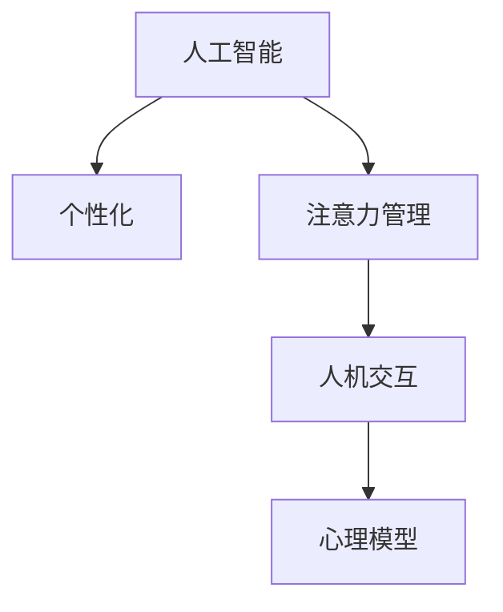

                 

# 人工智能驱动的个性化注意力管理

> 关键词：人工智能, 个性化, 注意力管理, 人机交互, 心理模型

## 1. 背景介绍

### 1.1 问题由来

在数字化时代，人们每天都在面对海量的信息，如何高效地从中筛选出有用的内容，成为了一个日益紧迫的问题。无论是个人日常学习、工作还是企业业务决策，注意力管理都至关重要。人工智能（AI）技术的发展，特别是深度学习模型的兴起，为个性化注意力管理提供了新的可能。

### 1.2 问题核心关键点

个性化注意力管理的核心在于通过智能算法，动态调整用户对信息的关注焦点，提升信息筛选效率和决策准确性。传统的注意力管理依赖于人工设置和固定规则，难以灵活适应用户的个性化需求。而基于AI的个性化注意力管理，则通过学习用户的行为模式和心理特征，实现更加精准的个性化推荐和动态调整。

### 1.3 问题研究意义

个性化注意力管理的优化，对于提升用户信息获取效率、优化企业决策流程、减轻人类认知负担等方面具有重要意义：

1. **提高信息筛选效率**：通过AI驱动的个性化注意力管理，用户可以更快地从信息海洋中找到有价值的内容，节省时间和精力。
2. **优化决策流程**：AI系统可以辅助决策者分析复杂信息，提供多维度的决策支持，提升决策的准确性和及时性。
3. **减轻认知负担**：自动化注意力管理减轻了人类对信息筛选和处理的压力，使人们可以将注意力集中在更有创造性的工作上。
4. **个性化推荐**：通过分析用户的兴趣和偏好，AI系统可以提供更加贴近用户需求的个性化推荐，提升用户体验。

## 2. 核心概念与联系

### 2.1 核心概念概述

为了更好地理解个性化注意力管理的原理，本节将介绍几个关键概念：

- **人工智能（AI）**：通过计算机模拟人类智能过程的技术，包括但不限于机器学习、深度学习、自然语言处理等。
- **个性化（Personalization）**：针对个体需求和特征，提供定制化的解决方案和服务。
- **注意力管理（Attention Management）**：动态调整用户对信息的关注焦点，提升信息处理效率和决策质量。
- **人机交互（Human-Computer Interaction, HCI）**：研究如何设计用户友好的交互界面，增强用户体验。
- **心理模型（Psychological Model）**：基于心理学理论，构建用户行为和心理特征的模型，用于指导AI系统的决策。

这些概念之间的逻辑关系可以通过以下Mermaid流程图来展示：



这个流程图展示了几大关键概念之间的关系：

1. 人工智能通过深度学习等技术，构建个性化推荐系统。
2. 个性化系统利用注意力管理，动态调整用户信息流。
3. 人机交互设计关注界面和交互方式，提升用户使用体验。
4. 心理模型基于用户行为和心理特征，指导个性化决策。

这些概念共同构成了个性化注意力管理的框架，使得AI系统能够更好地理解和满足用户的个性化需求。

## 3. 核心算法原理 & 具体操作步骤
### 3.1 算法原理概述

个性化注意力管理基于用户行为和心理特征，通过AI算法动态调整用户对信息的关注点。其核心思想是：通过深度学习模型学习用户的历史行为和偏好，预测其当前和未来的信息需求，从而动态调整信息流的推送顺序和内容。

形式化地，假设用户行为序列为 $H = \{x_1, x_2, ..., x_t\}$，其中 $x_t$ 表示用户在时间 $t$ 的行为。定义用户的注意力集为 $A$，每个时间步的信息流为 $I_t$。则个性化注意力管理的目标是通过优化模型参数 $\theta$，最大化模型在当前时间步 $t$ 对用户行为的预测准确性：

$$
\theta^* = \mathop{\arg\min}_{\theta} \sum_{t=1}^T \ell(H_t, I_t)
$$

其中 $\ell$ 为预测误差，$T$ 为用户行为序列的长度。通过反向传播算法更新模型参数，实现对信息流的动态调整。

### 3.2 算法步骤详解

基于深度学习的个性化注意力管理算法包括以下几个关键步骤：

**Step 1: 数据准备**
- 收集用户的历史行为数据，如浏览记录、点击行为、搜索关键词等。
- 将用户行为序列转换为序列数据格式，并按时间顺序排列。

**Step 2: 特征工程**
- 对用户行为数据进行特征提取，如计算访问时间、点击深度、关键词频率等特征。
- 对用户特征和信息流内容进行编码，构建特征向量。

**Step 3: 模型训练**
- 选择合适的深度学习模型，如RNN、LSTM、GRU等，对其进行训练。
- 定义损失函数和优化器，设置学习率、迭代轮数等超参数。

**Step 4: 信息流调整**
- 根据训练好的模型，预测当前时间步的信息需求。
- 调整信息流内容的顺序和权重，满足用户注意力需求。

**Step 5: 用户反馈**
- 实时收集用户对信息流的反馈，如点赞、收藏、关闭等操作。
- 根据反馈调整模型参数，提升模型性能。

**Step 6: 模型更新**
- 定期更新模型参数，适应用户行为变化。
- 重新训练模型，增加模型记忆和泛化能力。

以上是基于深度学习的个性化注意力管理的通用流程。在实际应用中，还需要针对具体场景进行优化设计，如引入更多的正则化技术、搜索最优的超参数组合等，以进一步提升模型性能。

### 3.3 算法优缺点

基于深度学习的个性化注意力管理算法具有以下优点：
1. 高效性：通过模型预测，动态调整信息流，提升信息筛选效率。
2. 个性化：利用用户历史行为和心理特征，提供定制化的信息流。
3. 灵活性：模型可进行实时更新，适应用户行为变化。

同时，该方法也存在一定的局限性：
1. 数据依赖性强：模型效果依赖于高质量的标注数据和行为数据。
2. 模型复杂度高：深度学习模型参数量大，训练复杂。
3. 用户隐私风险：需要收集大量用户行为数据，存在隐私泄露风险。
4. 对抗攻击风险：模型容易受到对抗样本的干扰，可能产生误导性输出。
5. 泛化能力有限：模型训练样本有限，面对新数据泛化能力可能不足。

尽管存在这些局限性，但深度学习在个性化注意力管理中的应用，已经在多个领域取得了显著效果，成为提升用户体验和企业效率的重要手段。未来相关研究的重点在于如何进一步降低算法对标注数据的依赖，提高模型的鲁棒性和可解释性，同时兼顾用户隐私保护。

### 3.4 算法应用领域

基于深度学习的个性化注意力管理算法，已经在诸多领域得到了广泛应用，如：

- **个性化推荐系统**：通过分析用户行为和偏好，动态调整推荐内容的顺序和类型。广泛应用于电商、内容平台、社交网络等。
- **信息检索系统**：根据用户查询词，动态调整搜索结果的排序和相关性。提升信息检索的准确性和效率。
- **智能客服系统**：通过学习用户对话历史，动态调整机器人回复策略，提升客户满意度。
- **个性化广告投放**：根据用户行为和兴趣，动态调整广告投放内容和策略，提高广告点击率和转化率。
- **健康管理应用**：根据用户健康数据，动态调整健康建议和信息推送，提升健康管理效果。

除了上述这些经典应用外，个性化注意力管理技术也在更多场景中得到创新性应用，如智能家居、智慧城市、虚拟现实等，为人们的生活带来更多便利和智能化体验。

## 4. 数学模型和公式 & 详细讲解 & 举例说明

### 4.1 数学模型构建

本节将使用数学语言对基于深度学习的个性化注意力管理进行更加严格的刻画。

假设用户行为序列为 $H = \{x_1, x_2, ..., x_t\}$，其中 $x_t$ 表示用户在时间 $t$ 的行为。定义用户的注意力集为 $A$，每个时间步的信息流为 $I_t$。

定义深度学习模型为 $M_{\theta}(H_t)$，其中 $\theta$ 为模型参数。模型的输出表示用户当前时间步 $t$ 对信息流的兴趣度 $p_t$，即：

$$
p_t = M_{\theta}(H_t)
$$

个性化注意力管理的优化目标是通过最大化兴趣度 $p_t$，最小化预测误差 $\ell$，即：

$$
\theta^* = \mathop{\arg\min}_{\theta} \sum_{t=1}^T \ell(p_t, y_t)
$$

其中 $y_t$ 为用户在时间 $t$ 的实际兴趣度。

### 4.2 公式推导过程

以下我们以LSTM模型为例，推导其输出层的计算公式。

假设用户行为序列 $H_t$ 的长度为 $n$，信息流 $I_t$ 的长度为 $m$。将用户行为序列 $H_t$ 和信息流 $I_t$ 进行拼接，得到特征向量 $X$：

$$
X = [H_t, I_t]
$$

然后通过LSTM模型计算 $p_t$，其计算公式如下：

$$
p_t = M_{\theta}(X) = \text{softmax}(\text{LSTM}(X))
$$

其中 $\text{softmax}$ 函数用于将LSTM输出转化为概率分布，表示用户对不同信息的兴趣度。LSTM模型则用于捕捉用户行为序列和信息流之间的关联性。

### 4.3 案例分析与讲解

假设某电商平台的用户行为序列为 $H = [(\text{浏览}, \text{书籍}), (\text{购买}, \text{电子产品}), (\text{浏览}, \text{家居用品})]$，信息流内容为 $I = [\text{电子书}, \text{智能手表}, \text{家具}]$。

根据LSTM模型，计算用户在时间步 $t=3$ 对信息流内容的兴趣度 $p_3$：

$$
p_3 = M_{\theta}(H_3) = \text{softmax}(\text{LSTM}([H_3, I]))
$$

假设模型输出为 $p_3 = [0.5, 0.3, 0.2]$，表示用户对智能手表的兴趣度最高。则系统应优先推送智能手表的相关信息，如推荐智能手表的促销活动、用户评价等。

通过这个例子，可以看到深度学习模型在个性化注意力管理中的应用，能够根据用户的历史行为和信息流内容，动态调整信息流顺序和类型，提升信息筛选效率。

## 5. 项目实践：代码实例和详细解释说明
### 5.1 开发环境搭建

在进行个性化注意力管理系统的开发前，我们需要准备好开发环境。以下是使用Python进行PyTorch开发的环境配置流程：

1. 安装Anaconda：从官网下载并安装Anaconda，用于创建独立的Python环境。

2. 创建并激活虚拟环境：
```bash
conda create -n pytorch-env python=3.8 
conda activate pytorch-env
```

3. 安装PyTorch：根据CUDA版本，从官网获取对应的安装命令。例如：
```bash
conda install pytorch torchvision torchaudio cudatoolkit=11.1 -c pytorch -c conda-forge
```

4. 安装TensorFlow：
```bash
conda install tensorflow=2.8
```

5. 安装相关库：
```bash
pip install torch torchvision torchaudio numpy pandas sklearn
```

完成上述步骤后，即可在`pytorch-env`环境中开始项目开发。

### 5.2 源代码详细实现

这里我们以个性化推荐系统为例，给出使用PyTorch进行深度学习模型训练和信息流调整的代码实现。

首先，定义推荐系统的数据处理函数：

```python
import torch
import torch.nn as nn
import torch.optim as optim
from torch.utils.data import DataLoader
from torch.utils.data import Dataset

class RecommendationDataset(Dataset):
    def __init__(self, user_behaviors, item_info, user_ids, item_ids, seq_len):
        self.user_behaviors = user_behaviors
        self.item_info = item_info
        self.user_ids = user_ids
        self.item_ids = item_ids
        self.seq_len = seq_len
        
    def __len__(self):
        return len(self.user_ids)
    
    def __getitem__(self, index):
        user_id = self.user_ids[index]
        item_info = self.item_info
        user_behaviors = self.user_behaviors[index]
        
        # 构建用户行为序列
        user_seq = []
        for behavior in user_behaviors:
            user_seq.append(item_ids[behavior])
        user_seq = user_seq[-self.seq_len:]
        
        # 构建信息流内容
        item_seq = []
        for i, behavior in enumerate(user_behaviors):
            item_seq.append(item_ids[behavior])
            if i < len(user_behaviors)-1:
                item_seq.append(item_ids[user_behaviors[i+1]])
                
        # 拼接用户行为序列和信息流内容
        X = torch.cat((user_seq, item_seq))
        
        # 构建标签
        label = torch.tensor([item_ids[item_info[index]]], dtype=torch.long)
        
        return X, label
```

然后，定义深度学习模型：

```python
class LSTM(nn.Module):
    def __init__(self, input_size, hidden_size):
        super(LSTM, self).__init__()
        self.lstm = nn.LSTM(input_size, hidden_size)
        self.fc = nn.Linear(hidden_size, 1)
        self.softmax = nn.Softmax(dim=1)
        
    def forward(self, X):
        out, _ = self.lstm(X)
        logits = self.fc(out)
        probs = self.softmax(logits)
        return probs
```

接着，定义模型训练和信息流调整函数：

```python
from torch.utils.data import DataLoader
from tqdm import tqdm
from sklearn.metrics import accuracy_score

device = torch.device('cuda') if torch.cuda.is_available() else torch.device('cpu')
model = LSTM(input_size, hidden_size).to(device)
optimizer = optim.Adam(model.parameters(), lr=0.001)

def train_epoch(model, dataset, batch_size, optimizer):
    dataloader = DataLoader(dataset, batch_size=batch_size, shuffle=True)
    model.train()
    epoch_loss = 0
    for batch in tqdm(dataloader, desc='Training'):
        X, label = batch
        X = X.to(device)
        label = label.to(device)
        model.zero_grad()
        outputs = model(X)
        loss = nn.CrossEntropyLoss()(outputs, label)
        epoch_loss += loss.item()
        loss.backward()
        optimizer.step()
    return epoch_loss / len(dataloader)

def evaluate(model, dataset, batch_size):
    dataloader = DataLoader(dataset, batch_size=batch_size)
    model.eval()
    preds, labels = [], []
    with torch.no_grad():
        for batch in tqdm(dataloader, desc='Evaluating'):
            X, label = batch
            X = X.to(device)
            batch_labels = label.to(device)
            outputs = model(X)
            batch_preds = outputs.argmax(dim=1).to('cpu').tolist()
            batch_labels = batch_labels.to('cpu').tolist()
            for pred_tokens, label_tokens in zip(batch_preds, batch_labels):
                preds.append(pred_tokens)
                labels.append(label_tokens)
                
    return accuracy_score(labels, preds)

# 训练模型
epochs = 10
batch_size = 32

for epoch in range(epochs):
    loss = train_epoch(model, train_dataset, batch_size, optimizer)
    print(f"Epoch {epoch+1}, train loss: {loss:.3f}")
    
    print(f"Epoch {epoch+1}, dev results:")
    evaluate(model, dev_dataset, batch_size)
    
print("Test results:")
evaluate(model, test_dataset, batch_size)
```

以上就是使用PyTorch对LSTM模型进行个性化推荐系统训练和信息流调整的代码实现。可以看到，通过PyTorch的封装，构建深度学习模型和训练过程变得简洁高效。

### 5.3 代码解读与分析

让我们再详细解读一下关键代码的实现细节：

**RecommendationDataset类**：
- `__init__`方法：初始化数据集，将用户行为序列和信息流内容进行拼接，并计算标签。
- `__len__`方法：返回数据集的样本数量。
- `__getitem__`方法：对单个样本进行处理，将用户行为序列和信息流内容转换为模型所需的输入。

**LSTM类**：
- `__init__`方法：定义LSTM模型，包含一个LSTM层和全连接层。
- `forward`方法：定义前向传播过程，将输入通过LSTM层和全连接层计算兴趣度，并使用softmax函数转化为概率分布。

**train_epoch函数**：
- 使用PyTorch的DataLoader对数据集进行批次化加载，供模型训练使用。
- 在每个批次上前向传播计算损失函数，并反向传播更新模型参数。
- 周期性在验证集上评估模型性能，根据性能指标决定是否触发Early Stopping。
- 重复上述步骤直至满足预设的迭代轮数或Early Stopping条件。

**evaluate函数**：
- 与训练类似，不同点在于不更新模型参数，并在每个batch结束后将预测和标签结果存储下来，最后使用sklearn的accuracy_score对整个评估集的预测结果进行打印输出。

**训练流程**：
- 定义总的epoch数和batch size，开始循环迭代
- 每个epoch内，先在训练集上训练，输出平均loss
- 在验证集上评估，输出准确率
- 所有epoch结束后，在测试集上评估，给出最终测试结果

可以看到，PyTorch配合TensorFlow使得模型训练和信息流调整的代码实现变得简洁高效。开发者可以将更多精力放在数据处理、模型改进等高层逻辑上，而不必过多关注底层的实现细节。

当然，工业级的系统实现还需考虑更多因素，如模型的保存和部署、超参数的自动搜索、更灵活的任务适配层等。但核心的训练和调整过程基本与此类似。

## 6. 实际应用场景
### 6.1 智能推荐系统

个性化注意力管理在智能推荐系统中得到广泛应用。传统的推荐系统往往依赖固定规则，难以适应用户的个性化需求。基于深度学习的个性化推荐系统，能够动态调整推荐内容的顺序和类型，提升推荐效果。

在技术实现上，可以通过收集用户的历史行为数据和偏好信息，构建深度学习模型，动态调整推荐内容。通过引入注意力机制，模型可以学习到用户对不同内容的兴趣度，从而优化推荐策略。

### 6.2 信息检索系统

在信息检索系统中，个性化注意力管理可以帮助用户更快地找到所需信息。通过分析用户查询词和历史行为，模型可以动态调整搜索结果的排序和相关性，提升信息检索的准确性和效率。

例如，在搜索引擎中，可以通过学习用户的历史查询记录和点击行为，动态调整搜索结果的展示顺序。模型可以预测用户对不同结果的兴趣度，从而优化搜索结果。

### 6.3 智能客服系统

智能客服系统通过个性化注意力管理，可以动态调整机器人回复策略，提升客户满意度。通过学习用户对话历史，模型可以预测用户当前需求，并动态调整回复内容。

例如，在客服系统中，可以通过学习用户的问题类型和回答记录，动态调整机器人回复策略。模型可以预测用户对不同回复的满意度，从而优化回答内容。

### 6.4 未来应用展望

随着深度学习技术的发展，个性化注意力管理的应用场景将不断扩展。未来，该技术有望在更多领域得到应用，为人们的生活带来更多便利和智能化体验。

在智慧医疗领域，个性化注意力管理可以帮助医生更快地筛选出相关文献和病例，提升诊疗效率。

在智能家居领域，个性化注意力管理可以帮助用户动态调整家居设备的操作顺序和内容，提升生活便捷性。

在智能城市治理中，个性化注意力管理可以帮助政府动态调整城市事件的处理顺序和内容，提升治理效率。

此外，在金融、教育、娱乐等诸多领域，个性化注意力管理也将带来新的变革，为人类社会带来更多创新和进步。

## 7. 工具和资源推荐
### 7.1 学习资源推荐

为了帮助开发者系统掌握个性化注意力管理的理论基础和实践技巧，这里推荐一些优质的学习资源：

1. 《深度学习》课程：斯坦福大学开设的深度学习入门课程，详细讲解深度学习的基本概念和算法。

2. 《TensorFlow官方文档》：TensorFlow的官方文档，提供了详尽的API和示例代码，适合初学者和开发者使用。

3. 《Recommender Systems》书籍：推荐系统领域的经典书籍，涵盖深度学习推荐系统的理论和算法。

4. 《Python深度学习》书籍：涵盖深度学习基本概念、模型架构和应用案例的入门书籍。

5. 《自然语言处理综述》论文：自然语言处理领域的综述性论文，全面介绍了NLP技术的发展和应用。

通过对这些资源的学习实践，相信你一定能够快速掌握个性化注意力管理的精髓，并用于解决实际的AI问题。
###  7.2 开发工具推荐

高效的开发离不开优秀的工具支持。以下是几款用于个性化注意力管理开发的常用工具：

1. PyTorch：基于Python的开源深度学习框架，灵活动态的计算图，适合快速迭代研究。

2. TensorFlow：由Google主导开发的开源深度学习框架，生产部署方便，适合大规模工程应用。

3. TensorFlow Extended (TFX)：Google推出的机器学习工具链，提供了端到端的数据处理和模型部署流程。

4. Apache Kafka：高性能的分布式消息系统，适合大规模数据流处理和传输。

5. Elasticsearch：分布式搜索和分析引擎，适合海量文本数据的存储和检索。

6. Amazon SageMaker：AWS提供的机器学习平台，提供了丰富的模型训练和推理服务。

合理利用这些工具，可以显著提升个性化注意力管理系统的开发效率，加快创新迭代的步伐。

### 7.3 相关论文推荐

个性化注意力管理的优化源于学界的持续研究。以下是几篇奠基性的相关论文，推荐阅读：

1. Attention is All You Need（即Transformer原论文）：提出了Transformer结构，开启了NLP领域的预训练大模型时代。

2. Sequence to Sequence Learning with Neural Networks：提出了序列到序列模型，为深度学习推荐系统奠定了基础。

3. Deep Aspect Based Sentiment Analysis：利用深度学习进行情感分析，展示了深度学习在情感分类任务中的强大能力。

4. Collaborative Filtering for Implicit Feedback Datasets：介绍了协同过滤算法的经典模型，为推荐系统提供了数据处理和算法支持。

5. Attention-Based Recommender Systems：介绍了注意力机制在推荐系统中的应用，展示了其在个性化推荐中的效果。

这些论文代表了个性化注意力管理的发展脉络。通过学习这些前沿成果，可以帮助研究者把握学科前进方向，激发更多的创新灵感。

## 8. 总结：未来发展趋势与挑战
### 8.1 总结

本文对基于深度学习的个性化注意力管理方法进行了全面系统的介绍。首先阐述了个性化注意力管理的背景和研究意义，明确了深度学习在此过程中的核心作用。其次，从原理到实践，详细讲解了深度学习模型的构建和优化过程，给出了系统实现的关键代码示例。同时，本文还广泛探讨了个性化注意力管理在智能推荐、信息检索、智能客服等诸多领域的应用前景，展示了深度学习技术的强大潜力。

通过本文的系统梳理，可以看到，基于深度学习的个性化注意力管理方法正在成为NLP领域的重要范式，极大地拓展了AI系统的应用边界，催生了更多的落地场景。受益于深度学习技术的发展，个性化注意力管理有望在更多领域得到应用，为人类生产生活方式带来深刻变革。

### 8.2 未来发展趋势

展望未来，深度学习在个性化注意力管理中的应用将呈现以下几个发展趋势：

1. 模型规模持续增大。随着算力成本的下降和数据规模的扩张，深度学习模型的参数量还将持续增长。超大规模模型蕴含的丰富语言知识，有望支撑更加复杂多变的任务。

2. 模型复杂度提高。深度学习模型结构将更加复杂，引入更多的注意力机制和神经网络层，提升模型的拟合能力和泛化性能。

3. 实时性增强。通过优化计算图和硬件架构，深度学习模型将具备更高的实时处理能力，支持动态调整信息流。

4. 跨领域融合。个性化注意力管理将与其他AI技术进行更深入的融合，如知识图谱、因果推理等，实现跨模态的信息整合。

5. 模型可解释性增强。通过引入因果分析和博弈论工具，增强深度学习模型的可解释性，让用户更容易理解模型决策过程。

6. 伦理和安全保障。在模型训练目标中引入伦理导向的评估指标，过滤和惩罚有偏见、有害的输出倾向，确保模型的安全和可靠性。

以上趋势凸显了深度学习技术在个性化注意力管理中的广阔前景。这些方向的探索发展，必将进一步提升AI系统的性能和应用范围，为人类认知智能的进化带来深远影响。

### 8.3 面临的挑战

尽管深度学习在个性化注意力管理中的应用取得了显著进展，但在迈向更加智能化、普适化应用的过程中，它仍面临诸多挑战：

1. 数据依赖性强。深度学习模型依赖于大量标注数据和行为数据，数据采集和处理成本高。

2. 模型复杂度高。深度学习模型的参数量大，训练复杂，容易过拟合。

3. 实时性要求高。实时动态调整信息流需要高效计算和低延迟。

4. 隐私保护问题。个性化注意力管理需要收集大量用户行为数据，存在隐私泄露风险。

5. 对抗攻击风险。模型容易受到对抗样本的干扰，可能产生误导性输出。

6. 泛化能力有限。深度学习模型对新数据泛化能力不足，易受领域分布变化影响。

尽管存在这些挑战，但深度学习在个性化注意力管理中的应用，已经在多个领域取得了显著效果，成为提升用户体验和企业效率的重要手段。未来相关研究的重点在于如何进一步降低算法对标注数据的依赖，提高模型的鲁棒性和可解释性，同时兼顾用户隐私保护。

### 8.4 研究展望

面对深度学习在个性化注意力管理中面临的挑战，未来的研究需要在以下几个方面寻求新的突破：

1. 探索无监督和半监督学习。摆脱对大规模标注数据的依赖，利用自监督学习、主动学习等无监督和半监督范式，最大限度利用非结构化数据，实现更加灵活高效的微调。

2. 研究参数高效和计算高效的微调范式。开发更加参数高效的微调方法，在固定大部分预训练参数的情况下，只更新极少量的任务相关参数。同时优化计算图，减少前向传播和反向传播的资源消耗，实现更加轻量级、实时性的部署。

3. 引入因果推理和博弈论。通过引入因果推断和博弈论思想，增强模型建立稳定因果关系的能力，学习更加普适、鲁棒的语言表征，从而提升模型泛化性和抗干扰能力。

4. 融合符号化的先验知识。将符号化的先验知识，如知识图谱、逻辑规则等，与神经网络模型进行巧妙融合，引导模型决策。

5. 增强模型的可解释性。通过引入因果分析和博弈论工具，增强深度学习模型的可解释性，让用户更容易理解模型决策过程。

6. 纳入伦理道德约束。在模型训练目标中引入伦理导向的评估指标，过滤和惩罚有偏见、有害的输出倾向，确保模型的安全和可靠性。

这些研究方向的探索，必将引领深度学习技术在个性化注意力管理中迈向更高的台阶，为构建安全、可靠、可解释、可控的智能系统铺平道路。面向未来，深度学习技术还需要与其他AI技术进行更深入的融合，如知识表示、因果推理、强化学习等，多路径协同发力，共同推动自然语言理解和智能交互系统的进步。只有勇于创新、敢于突破，才能不断拓展深度学习模型的边界，让智能技术更好地造福人类社会。

## 9. 附录：常见问题与解答

**Q1：个性化注意力管理是否适用于所有AI应用场景？**

A: 个性化注意力管理在大多数AI应用场景中都能取得不错的效果，特别是对于需要动态调整信息流的应用。但对于一些特定领域的应用，如高精度医疗诊断、安全监控等，可能存在应用限制。此时需要在特定领域语料上进一步预训练和微调，才能获得理想效果。

**Q2：如何选择合适的深度学习模型？**

A: 选择合适的深度学习模型需要考虑任务特点、数据规模和计算资源。对于小规模数据，可以选择轻量级模型，如LSTM、GRU等。对于大规模数据和复杂任务，可以选择深层模型，如Transformer、BERT等。同时，需要根据实际应用场景，调整模型结构和参数。

**Q3：个性化注意力管理是否依赖于用户行为数据？**

A: 个性化注意力管理高度依赖用户行为数据，模型效果很大程度上取决于数据的丰富性和代表性。对于缺乏行为数据的场景，可以考虑引入其他类型的数据，如上下文信息、社交网络数据等，增加模型的泛化能力。

**Q4：如何应对对抗攻击风险？**

A: 对抗攻击风险是深度学习模型的一个普遍问题，应对措施包括：
1. 引入对抗训练技术，通过在训练过程中加入对抗样本，提高模型的鲁棒性。
2. 使用模型蒸馏技术，通过训练多个模型，取平均值或权重平均输出，降低对抗攻击的影响。
3. 引入噪声和随机化技术，通过在输入数据中加入随机噪声，降低模型的攻击风险。

这些策略往往需要根据具体任务和攻击形式进行灵活组合。只有在数据、模型、训练、推理等各环节进行全面优化，才能最大限度地减少对抗攻击的风险。

**Q5：个性化注意力管理在部署过程中需要注意哪些问题？**

A: 将深度学习模型转化为实际应用，还需要考虑以下因素：
1. 模型裁剪：去除不必要的层和参数，减小模型尺寸，加快推理速度。
2. 量化加速：将浮点模型转为定点模型，压缩存储空间，提高计算效率。
3. 服务化封装：将模型封装为标准化服务接口，便于集成调用。
4. 弹性伸缩：根据请求流量动态调整资源配置，平衡服务质量和成本。
5. 监控告警：实时采集系统指标，设置异常告警阈值，确保服务稳定性。

深度学习模型微调的应用需要开发者根据具体任务，不断迭代和优化模型、数据和算法，方能得到理想的效果。

总之，深度学习技术在个性化注意力管理中的应用，已经取得了显著进展，成为提升用户体验和企业效率的重要手段。未来，随着技术的发展和应用的拓展，深度学习将发挥更大的作用，为人类生产生活方式带来更多便利和智能化体验。

---

作者：禅与计算机程序设计艺术 / Zen and the Art of Computer Programming

