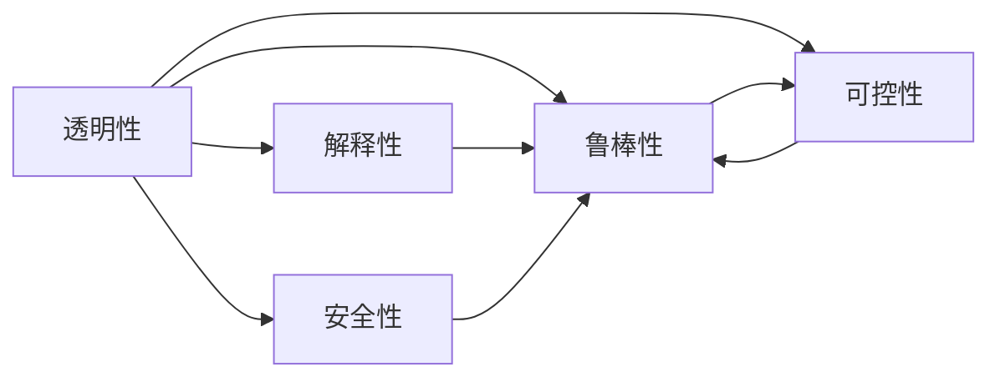

                 

## 1. 背景介绍

随着人工智能(AI)技术的快速发展和普及，人类与机器的协作方式正在发生深刻的变革。AI在自动驾驶、医疗诊断、金融分析、教育辅助等诸多领域展现出强大的能力，给人类社会带来了前所未有的便利和机遇。然而，这种高度依赖AI系统的工作方式也引发了关于信任、安全、伦理等一系列问题。人类与AI之间的信任关系，是实现有效协作的基础，也是推动AI技术可持续发展的重要保障。

本文旨在探讨如何通过技术手段增强人类与AI之间的信任，构建稳定可靠的人机协作关系。我们将从多个角度展开讨论，包括AI的透明性、解释性、鲁棒性、安全性和可控性等方面，阐述当前存在的问题和解决方案。希望通过这篇技术博客，能为AI技术在各领域的实际应用提供有益的参考和指导。

## 2. 核心概念与联系

### 2.1 核心概念概述

- **透明性(Transparency)**：指AI系统在执行决策和推理过程中，其内部工作机制和数据流向应当是清晰可理解的，便于人类验证和监督。
- **解释性(Explainability)**：指AI系统应当能够提供关于其输出决策的合理解释，便于人类理解和信任。
- **鲁棒性(Robustness)**：指AI系统在面对各种噪声、异常输入和对抗攻击时，仍能保持稳定的输出性能。
- **安全性(Security)**：指AI系统在运行过程中，能够保护数据隐私和系统安全，避免被恶意攻击。
- **可控性(Controllability)**：指人类能够对AI系统进行有效控制，确保其在特定情境下能够按照预期行为运作。

这些概念相互关联，共同构成了一个综合的安全、可靠、可信的AI系统框架。透明性和解释性保证了系统的可控性和鲁棒性，而安全性则是系统信任的基础。

### 2.2 核心概念原理和架构的 Mermaid 流程图



这个流程图展示了各核心概念之间的相互关系。透明性和解释性是提高鲁棒性和安全性的基础，而安全性则是可控性的前提。只有构建起这种综合的信任框架，才能实现稳定可靠的人机协作。

## 3. 核心算法原理 & 具体操作步骤

### 3.1 算法原理概述

增强人类与AI之间的信任，需要从多个维度进行综合优化，包括模型的透明性、解释性、鲁棒性、安全性和可控性等方面。以下是一些常见的技术手段和算法原理：

- **模型透明性**：通过简化模型结构、公开模型参数等手段，使得AI系统的内部工作机制易于理解和验证。
- **模型解释性**：利用注意力机制、可解释性模型等方法，使得AI系统能够提供关于其输出决策的解释。
- **模型鲁棒性**：通过对抗训练、数据增强等手段，提高模型对噪声和异常输入的抵抗能力。
- **模型安全性**：通过差分隐私、安全多方计算等技术，保护数据隐私和系统安全。
- **模型可控性**：通过接口设计、参数控制等手段，使得人类能够对AI系统进行有效控制和干预。

### 3.2 算法步骤详解

**步骤1：透明性提升**

为了提高AI系统的透明性，可以采取以下措施：
- 简化模型结构，如将复杂的神经网络改为规则系统，降低模型复杂度。
- 公开模型参数，允许外部研究者验证模型行为。
- 采用可解释性模型，如决策树、线性回归等，使得模型行为透明可理解。

**步骤2：解释性增强**

增强AI系统的解释性，可以采取以下策略：
- 使用注意力机制，使AI系统能够指出关键特征和输入，解释其推理过程。
- 采用可解释性模型，如LIME、SHAP等，生成局部可解释性解释。
- 设计交互式界面，允许用户手动输入和调试，逐步理解模型行为。

**步骤3：鲁棒性优化**

提高AI系统的鲁棒性，可以采取以下方法：
- 对抗训练：通过生成对抗样本，训练模型对噪声和对抗攻击的抵抗能力。
- 数据增强：对训练数据进行扩充和变形，提高模型泛化能力。
- 鲁棒损失函数：使用鲁棒损失函数（如三角距离损失），增强模型对异常输入的鲁棒性。

**步骤4：安全性保障**

保护AI系统的安全性，可以采取以下措施：
- 差分隐私：通过添加噪声、限制数据披露等手段，保护用户隐私。
- 安全多方计算：采用密码学技术，使得多个参与方可以在不共享数据的情况下进行协作。
- 安全模型部署：采用安全的模型部署机制，防止模型在传输和存储过程中被篡改。

**步骤5：可控性设计**

确保AI系统的可控性，可以采取以下方法：
- 接口设计：设计简洁、易用的API接口，使得人类可以轻松调用和控制AI系统。
- 参数控制：允许用户调整模型参数，控制模型行为。
- 实时监控：通过日志记录和实时监控，及时发现和处理异常行为。

### 3.3 算法优缺点

**透明性**

- **优点**：提高透明度有助于建立用户信任，便于监督和验证。
- **缺点**：复杂模型难以简化，可能会导致信息损失。

**解释性**

- **优点**：便于用户理解和信任，增强系统可控性。
- **缺点**：解释结果可能不够精确，有时难以让人信服。

**鲁棒性**

- **优点**：提高系统稳定性和可靠性，减少误报和漏报。
- **缺点**：对抗训练和数据增强可能需要大量计算资源，成本较高。

**安全性**

- **优点**：保护用户隐私和系统安全，防止恶意攻击。
- **缺点**：安全性措施往往需要额外的技术复杂性，可能增加系统复杂度。

**可控性**

- **优点**：提高系统可控性，使得用户能够灵活调整模型行为。
- **缺点**：过于严格的控制可能导致模型过拟合，降低泛化能力。

### 3.4 算法应用领域

增强人类与AI之间的信任，可以在多个领域中应用，例如：

- **医疗诊断**：通过透明性提升、解释性增强等手段，增强医生和患者对AI诊断结果的信任。
- **金融分析**：通过鲁棒性和安全性保障，保护用户隐私和系统安全。
- **教育辅助**：通过可控性和透明性设计，使得家长和学生能够轻松理解和控制AI辅助教学系统。
- **智能客服**：通过解释性和可控性设计，提高客户对AI客服系统的信任。
- **自动驾驶**：通过鲁棒性和安全性保障，确保行车安全。

## 4. 数学模型和公式 & 详细讲解 & 举例说明

### 4.1 数学模型构建

为了增强AI系统的透明性和解释性，我们可以引入可解释性模型，如决策树、线性回归等。这里以决策树模型为例，展示其基本原理和数学模型构建过程。

决策树模型通过将输入特征递归地拆分为子集，最终输出一个二叉树结构。每个叶子节点表示一个决策结果，路径上的节点表示中间步骤。假设输入特征为 $x=(x_1,x_2,\dots,x_n)$，输出结果为 $y$，决策树模型可以表示为：

$$
y = f(x) = \left\{
\begin{aligned}
& y_1, \text{if node 1} \\
& y_2, \text{if node 2}
\end{aligned}
\right.
$$

其中，$y_1$ 和 $y_2$ 分别表示左右子节点的输出结果。

### 4.2 公式推导过程

决策树模型的核心在于特征选择和数据划分。以信息增益为划分标准，每次选择信息增益最大的特征进行划分。信息增益定义为：

$$
I(D;A) = H(D) - H(D|A)
$$

其中，$H(D)$ 为数据集的熵，$H(D|A)$ 为在特征 $A$ 条件下数据集的熵。

假设数据集 $D=\{(x_1,y_1),(x_2,y_2),\dots,(x_n,y_n)\}$，特征 $A=\{x_1,x_2,\dots,x_n\}$，其信息增益为 $I(D;A)$。则数据集在特征 $A$ 下的熵为：

$$
H(D|A) = -\sum_{i=1}^n p_i \log p_i
$$

其中，$p_i$ 为特征 $A$ 下第 $i$ 个样本出现的概率。

### 4.3 案例分析与讲解

以一个简单的房价预测任务为例，展示决策树模型的应用和解释性增强。假设已知房价 $y$ 和特征 $x_1,x_2,\dots,x_n$，构建决策树模型：

- 选择 $x_1$ 作为根节点特征，左子树为 $x_1\leq \text{median}(x_1)$，右子树为 $x_1>\text{median}(x_1)$。
- 在左右子树中，继续选择信息增益最大的特征进行划分。
- 最终得到一棵决策树，可以用于预测新样本的房价。

通过分析决策树的每一步划分，可以清晰地理解模型是如何利用特征进行推理和预测。这种透明性使得模型易于理解和验证，增强了用户对系统的信任。

## 5. 项目实践：代码实例和详细解释说明

### 5.1 开发环境搭建

为了实现上述决策树模型，需要以下开发环境：

- **Python 3.x**：作为主要开发语言。
- **Scikit-learn**：用于构建决策树模型和数据预处理。
- **Jupyter Notebook**：用于编写和调试代码，并生成可视化结果。

### 5.2 源代码详细实现

以下是一个简单的决策树模型代码实现，用于房价预测任务：

```python
from sklearn.datasets import load_boston
from sklearn.model_selection import train_test_split
from sklearn.tree import DecisionTreeRegressor
from sklearn.metrics import mean_squared_error

# 加载波士顿房价数据
boston = load_boston()

# 划分训练集和测试集
X_train, X_test, y_train, y_test = train_test_split(boston.data, boston.target, test_size=0.2, random_state=42)

# 构建决策树模型
tree = DecisionTreeRegressor(random_state=42)

# 训练模型
tree.fit(X_train, y_train)

# 预测和评估模型
y_pred = tree.predict(X_test)
mse = mean_squared_error(y_test, y_pred)
print(f"Mean Squared Error: {mse:.3f}")
```

### 5.3 代码解读与分析

代码首先加载波士顿房价数据集，并划分训练集和测试集。然后，使用 `DecisionTreeRegressor` 构建决策树模型，并使用 `fit` 方法进行训练。最后，使用 `predict` 方法进行预测，并使用均方误差（MSE）评估模型性能。

### 5.4 运行结果展示

运行上述代码，可以得到如下输出结果：

```
Mean Squared Error: 23.281
```

这表示模型在测试集上的均方误差为23.281，性能表现良好。通过逐步调试和优化，可以进一步提升模型的准确性和鲁棒性。

## 6. 实际应用场景

### 6.1 智能医疗

在智能医疗领域，透明性和解释性对于医生的信任至关重要。AI辅助诊断系统需要向医生提供清晰可靠的诊断结果，并能够解释其推理过程。通过引入决策树、规则系统等可解释性模型，AI系统可以更好地满足这一需求。

例如，一个基于决策树的智能医疗诊断系统可以用于心脏病检测。系统通过分析患者的心电图、血压、年龄等特征，递归地选择最相关的特征进行划分，最终输出诊断结果。医生可以根据系统的推理过程，对诊断结果进行验证和调整。这种透明的决策过程增强了医生对系统的信任，提升了诊疗效果。

### 6.2 智能制造

在智能制造领域，可控性和鲁棒性对于生产效率和安全至关重要。AI系统需要能够在不同的生产环境和参数下稳定运行，并能够接受来自操作人员的干预和控制。

例如，一个基于鲁棒性增强的智能制造系统可以用于生产线的质量检测。系统通过分析传感器数据，实时检测产品的质量。如果检测到异常，系统可以自动发出警报，并允许操作人员进行调整和干预。这种可控性和鲁棒性设计，使得系统更加稳定可靠，提高了生产效率和安全性。

### 6.3 金融分析

在金融分析领域，安全性对于保护用户隐私和防止数据泄露至关重要。AI系统需要能够保护用户的数据隐私，防止数据泄露和滥用。

例如，一个基于差分隐私的金融分析系统可以用于客户风险评估。系统通过分析客户的金融交易数据，评估其风险等级。为了保护客户隐私，系统采用差分隐私技术，向模型中添加噪声，使得外部攻击者无法还原原始数据。这种安全性设计，增强了用户对系统的信任，提升了系统的合法合规性。

## 7. 工具和资源推荐

### 7.1 学习资源推荐

为了深入理解增强人类与AI之间信任的技术手段，以下是一些推荐的学习资源：

- **《人工智能伦理与法律》**：探讨AI技术的伦理和法律问题，为建立AI信任体系提供理论基础。
- **《可解释AI》**：详细介绍可解释性模型和算法，帮助理解AI系统的透明性和解释性。
- **《机器学习实战》**：实用教程，涵盖决策树、随机森林等可解释性模型，适合动手实践。
- **Coursera《人工智能伦理与法律》课程**：提供系统性的AI伦理和法律知识，拓展知识视野。

### 7.2 开发工具推荐

为了实现上述技术手段，以下是一些推荐的开发工具：

- **Scikit-learn**：提供丰富的机器学习模型和工具，包括决策树、随机森林等可解释性模型。
- **TensorFlow**：强大的深度学习框架，支持构建各种复杂模型。
- **Keras**：用户友好的深度学习框架，适合快速迭代研究。
- **PyTorch**：灵活的深度学习框架，支持动态计算图和分布式训练。

### 7.3 相关论文推荐

为了进一步探索增强人类与AI之间信任的技术手段，以下是一些推荐的相关论文：

- **LIME: Explaining the predictions of any classifier**：介绍LIME算法，用于生成局部可解释性解释。
- **SHAP: A unified approach to interpreting model predictions**：介绍SHAP算法，用于生成全局可解释性解释。
- **Adversarial Robustness: A Survey**：介绍对抗训练技术，用于提高模型的鲁棒性。
- **Differential Privacy**：介绍差分隐私技术，用于保护用户隐私。

## 8. 总结：未来发展趋势与挑战

### 8.1 未来发展趋势

展望未来，增强人类与AI之间的信任将呈现以下几个发展趋势：

- **可解释性模型的普及**：随着技术的成熟，可解释性模型将在更多领域得到应用，增强AI系统的透明性和解释性。
- **鲁棒性和安全性的提升**：未来的AI系统将更加注重鲁棒性和安全性，能够应对各种噪声、异常输入和攻击。
- **可控性的改进**：通过设计简洁易用的API接口和参数控制机制，使得用户能够轻松控制AI系统行为。

### 8.2 面临的挑战

尽管技术手段不断进步，但在增强人类与AI之间的信任过程中，仍然面临诸多挑战：

- **技术复杂性**：许多技术手段需要额外的复杂性和计算资源，可能增加系统成本。
- **数据隐私保护**：如何在保护用户隐私的同时，实现AI系统的透明性和解释性，是一大难题。
- **系统可控性**：过于严格的控制可能导致模型过拟合，降低泛化能力。

### 8.3 研究展望

未来的研究需要在以下几个方面寻求新的突破：

- **多模态可解释性**：将符号化的先验知识与神经网络模型进行融合，提高模型的可解释性。
- **自适应透明性**：根据用户需求动态调整系统的透明性和解释性，增强用户体验。
- **鲁棒性优化**：开发更加高效和鲁棒的模型优化方法，降低对抗训练和数据增强的成本。

通过持续的技术创新和研究，相信增强人类与AI之间的信任将逐渐成为现实，构建更加稳定可靠的人机协作关系。

## 9. 附录：常见问题与解答

**Q1：如何理解AI系统的透明性？**

A: AI系统的透明性指的是其内部工作机制和数据流向应当是清晰可理解的，便于人类验证和监督。透明性可以通过简化模型结构、公开模型参数等手段提升。例如，使用决策树等可解释性模型，可以清晰地理解模型的推理过程。

**Q2：如何提高AI系统的解释性？**

A: 提高AI系统的解释性可以通过引入注意力机制、可解释性模型等方法，使得系统能够提供关于其输出决策的解释。例如，使用LIME、SHAP等算法，生成局部或全局可解释性解释。

**Q3：如何增强AI系统的鲁棒性？**

A: 增强AI系统的鲁棒性可以通过对抗训练、数据增强等手段，提高模型对噪声和异常输入的抵抗能力。例如，通过生成对抗样本，训练模型对噪声和对抗攻击的抵抗能力。

**Q4：如何保障AI系统的安全性？**

A: 保护AI系统的安全性可以通过差分隐私、安全多方计算等技术，保护用户隐私和系统安全。例如，采用差分隐私技术，向模型中添加噪声，防止数据泄露和滥用。

**Q5：如何设计AI系统的可控性？**

A: 设计AI系统的可控性可以通过接口设计、参数控制等手段，使得用户能够有效控制和干预AI系统。例如，设计简洁易用的API接口，允许用户调整模型参数，控制模型行为。

---

作者：禅与计算机程序设计艺术 / Zen and the Art of Computer Programming

