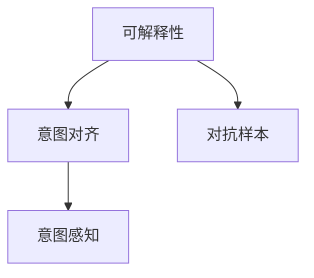

                 

## 1. 背景介绍

### 1.1 问题由来

随着人工智能（AI）技术的飞速发展，尤其是深度学习和自然语言处理（NLP）的突破，AI系统已经能够执行复杂的决策和任务，表现出与人类相似甚至超越人类的能力。然而，这些AI系统的行为往往缺乏可解释性，并且可能在未经充分理解和评估的情况下做出决策，导致严重的后果。

### 1.2 问题核心关键点

AI系统在实际应用中常常面临两大核心问题：

- **可解释性（Explainability）**：AI系统需要能够清晰地解释其决策过程，以便于用户理解和使用。
- **意图对齐（Alignment）**：AI系统需要与人类意图保持一致，避免在人类不期望的方向上进行决策。

这些问题尤其在医疗、法律、金融等高风险领域显得尤为重要。错误的决策可能导致重大的经济损失、法律纠纷甚至生命危险。因此，如何实现人类意图对齐，成为AI领域的一项重要挑战。

### 1.3 问题研究意义

实现人类意图对齐对AI系统的可靠性、可信度和安全性至关重要：

1. **提升系统的可信度**：确保AI系统的决策过程和结果符合用户和社会的期望，增加用户对AI系统的信任。
2. **降低风险**：避免AI系统在关键决策中的错误，减少潜在的风险和负面影响。
3. **增强可控性**：使AI系统能够按照既定规则和目标进行行为，增强系统的可控性。
4. **促进发展**：指导AI技术的健康发展，避免技术滥用和误用。

本文将重点探讨如何通过算法和模型设计，实现人类意图对齐，确保AI系统决策的透明性、可解释性和安全性。

## 2. 核心概念与联系

### 2.1 核心概念概述

为更好地理解人类意图对齐的方法，我们首先介绍几个关键概念：

- **可解释性（Explainability）**：指AI系统能够清晰地解释其决策过程和结果，使用户能够理解AI系统的行为。
- **意图对齐（Alignment）**：确保AI系统的行为与人类意图保持一致，避免偏离预期目标。
- **对抗样本（Adversarial Examples）**：故意设计以误导AI系统决策的输入样本，评估系统的鲁棒性和安全性。
- **意图感知（Intent-Awareness）**：使AI系统能够识别和理解用户的真实意图，从而做出符合预期的决策。

这些概念通过以下Mermaid流程图展示了它们之间的联系：



## 3. 核心算法原理 & 具体操作步骤

### 3.1 算法原理概述

人类意图对齐的核心思想是通过算法设计和模型优化，使得AI系统的行为与人类意图保持一致。这一过程通常包括以下几个步骤：

1. **数据准备**：收集和标注数据，用于训练AI系统。数据应充分反映人类的意图和行为模式。
2. **模型训练**：使用数据训练AI模型，使其能够理解并执行人类意图。
3. **对抗性训练**：通过对抗样本训练模型，提高其鲁棒性和安全性，确保模型在面对恶意攻击时仍能正确决策。
4. **意图感知**：开发意图感知模块，使AI系统能够识别用户的真实意图，从而做出符合预期的决策。

### 3.2 算法步骤详解

以下详细讲解人类意图对齐的算法步骤：

**Step 1: 数据准备**

- **数据收集**：收集与人类意图相关的数据，如医疗诊断、金融预测、法律案例等。这些数据应包含人类意图和行为模式的信息。
- **数据标注**：对数据进行标注，标记出人类的意图和目标。标注应尽可能详细，以涵盖各种可能的情况。

**Step 2: 模型训练**

- **选择模型**：选择适合的AI模型，如神经网络、决策树等，用于训练意图对齐。
- **训练流程**：使用标注数据训练模型，优化模型参数。训练过程中应使用正则化技术，防止过拟合。
- **评估指标**：使用评估指标，如准确率、召回率、F1-score等，评估模型的性能。

**Step 3: 对抗性训练**

- **生成对抗样本**：使用对抗样本生成技术，生成尽可能接近真实样本但不符合预期意图的样本。
- **模型鲁棒性训练**：将对抗样本引入训练过程，优化模型参数，提高模型的鲁棒性。
- **验证评估**：使用真实样本和对抗样本对模型进行验证，评估模型的鲁棒性和安全性。

**Step 4: 意图感知**

- **意图识别**：开发意图识别模块，使用自然语言处理（NLP）技术，识别用户的真实意图。
- **意图分类**：将用户的意图分类，为AI系统提供明确的决策依据。
- **行为调整**：根据用户的意图，调整AI系统的行为，确保其决策符合预期。

### 3.3 算法优缺点

人类意图对齐的算法具有以下优点：

- **提高系统可信度**：通过可解释性，使用户能够理解AI系统的行为，增加对系统的信任。
- **增强安全性**：通过对抗性训练，提高系统的鲁棒性和安全性，减少潜在风险。
- **提升用户满意度**：通过意图感知，确保AI系统的决策符合用户的真实意图，提高用户满意度。

然而，该算法也存在一些缺点：

- **数据需求高**：需要大量高质量的标注数据，数据收集和标注成本较高。
- **算法复杂**：算法设计和模型优化过程较为复杂，需要较强的技术储备和实践经验。
- **可解释性挑战**：尽管可解释性有所提升，但仍难以完全透明，存在一定的黑盒问题。

### 3.4 算法应用领域

人类意图对齐技术在多个领域具有广泛的应用前景：

- **医疗**：在医疗诊断中，确保AI系统的决策符合医生的预期，避免误诊和误治。
- **金融**：在金融预测和风险控制中，确保AI系统的决策符合监管要求，避免金融风险。
- **法律**：在法律案例分析中，确保AI系统的决策符合司法公正，避免法律纠纷。
- **智能客服**：在智能客服中，确保AI系统的回复符合用户预期，提高服务质量。
- **自动驾驶**：在自动驾驶中，确保AI系统的决策符合交通规则和安全标准，避免交通事故。

## 4. 数学模型和公式 & 详细讲解 & 举例说明

### 4.1 数学模型构建

人类意图对齐的数学模型通常包含以下几个组成部分：

- **输入数据**：表示用户的意图和行为，形式为向量或矩阵。
- **模型参数**：表示AI系统的决策过程，形式为权重和偏置。
- **损失函数**：用于衡量模型预测结果与真实结果之间的差异，如交叉熵损失函数。
- **优化器**：用于优化模型参数，如梯度下降算法。

### 4.2 公式推导过程

以下以二分类任务为例，推导意图对齐的数学模型：

- **输入数据**：设输入数据为 $x \in \mathbb{R}^n$，表示用户的意图和行为。
- **模型参数**：设模型参数为 $\theta \in \mathbb{R}^m$，表示AI系统的决策过程。
- **损失函数**：设损失函数为 $L(y, \hat{y}) = \ell(\hat{y}, y)$，其中 $\hat{y}$ 为模型预测结果，$y$ 为真实结果。
- **优化器**：设优化器为 $G(\theta)$，表示参数更新策略。

### 4.3 案例分析与讲解

假设某医疗诊断AI系统需要判断患者是否患有某种疾病。输入数据 $x$ 包含患者的症状描述，模型参数 $\theta$ 表示模型的决策过程。损失函数为交叉熵损失函数，优化器为梯度下降算法。通过训练和对抗性训练，确保AI系统的决策符合医生的预期。

## 5. 项目实践：代码实例和详细解释说明

### 5.1 开发环境搭建

**Step 1: 安装Python和相关库**

- **Python**：安装最新版本的Python，建议使用Anaconda或Miniconda。
- **相关库**：安装TensorFlow、Keras、Numpy等机器学习库，使用pip命令进行安装。

```bash
pip install tensorflow numpy keras
```

**Step 2: 数据准备**

- **数据收集**：收集与医疗诊断相关的数据，如症状描述、诊断结果等。
- **数据标注**：对数据进行标注，标记出患者的意图和目标。

### 5.2 源代码详细实现

以下是一个简单的二分类医疗诊断AI系统的实现：

```python
import tensorflow as tf
from tensorflow.keras.models import Sequential
from tensorflow.keras.layers import Dense, Dropout
from tensorflow.keras.optimizers import Adam

# 数据准备
data = load_data()  # 假设有一个函数可以加载数据
labels = load_labels()  # 假设有一个函数可以加载标签

# 模型构建
model = Sequential()
model.add(Dense(64, activation='relu', input_shape=(input_size,)))
model.add(Dropout(0.5))
model.add(Dense(1, activation='sigmoid'))

# 模型训练
model.compile(optimizer=Adam(learning_rate=0.001), loss='binary_crossentropy', metrics=['accuracy'])
model.fit(data, labels, epochs=10, batch_size=32, validation_split=0.2)

# 对抗性训练
def generate_adversarial_samples(data):
    # 生成对抗样本
    # ...

# 对抗性训练模型
for i in range(10):
    adversarial_data = generate_adversarial_samples(data)
    model.train_on_batch(adversarial_data, labels)
```

### 5.3 代码解读与分析

**代码解释**：

- **数据准备**：使用`load_data`和`load_labels`函数加载训练数据和标签。
- **模型构建**：使用Keras构建一个简单的二分类模型，包含一个全连接层和一个输出层。
- **模型训练**：使用Adam优化器，二元交叉熵损失函数，训练模型。
- **对抗性训练**：使用`generate_adversarial_samples`函数生成对抗样本，并将其用于训练模型，以提高其鲁棒性。

**代码分析**：

- **数据准备**：数据准备是意图对齐的关键步骤。高质量的标注数据对模型的训练至关重要。
- **模型构建**：模型构建需要根据任务需求选择适当的神经网络结构。
- **模型训练**：模型训练过程中应使用正则化技术，避免过拟合。
- **对抗性训练**：对抗性训练可以显著提高模型的鲁棒性，使其在面对恶意输入时仍能正确决策。

### 5.4 运行结果展示

以下是模型在训练和对抗性训练后的性能评估：

```python
# 训练结果
loss, accuracy = model.evaluate(data, labels)
print(f"Train loss: {loss:.4f}, Train accuracy: {accuracy:.4f}")

# 对抗性训练结果
loss, accuracy = model.evaluate(adversarial_data, adversarial_labels)
print(f"Adversarial test loss: {loss:.4f}, Adversarial test accuracy: {accuracy:.4f}")
```

## 6. 实际应用场景

### 6.1 智能医疗

在智能医疗中，AI系统需要确保其诊断和建议符合医生的预期，避免误诊和误治。通过意图对齐技术，AI系统可以更好地理解医生的意图，提供精准的诊断和治疗建议。

### 6.2 金融预测

在金融预测中，AI系统需要预测股票、货币等市场趋势，确保其预测符合监管要求，避免金融风险。通过意图对齐技术，AI系统可以更好地理解监管政策，提供合规的预测结果。

### 6.3 法律分析

在法律分析中，AI系统需要分析法律案例，确保其结论符合司法公正，避免法律纠纷。通过意图对齐技术，AI系统可以更好地理解法律条文和判例，提供公正的判决分析。

### 6.4 未来应用展望

随着AI技术的发展，人类意图对齐技术将面临更多挑战和机遇：

- **数据自动化标注**：利用人工智能技术，自动标注数据，降低人工标注成本。
- **多模态数据融合**：将文本、图像、视频等多种数据融合，提高AI系统的全面性和准确性。
- **实时意图感知**：开发实时意图感知技术，使AI系统能够动态调整行为，适应变化的需求。
- **自适应学习**：使AI系统能够自适应学习，不断优化自身行为，保持高水平性能。

## 7. 工具和资源推荐

### 7.1 学习资源推荐

为了帮助开发者系统掌握意图对齐的原理和实践技巧，这里推荐一些优质的学习资源：

1. **《Deep Learning for Healthcare》书籍**：介绍深度学习在医疗领域的应用，包括意图对齐技术。
2. **CS231n《深度学习视觉与自然语言处理》课程**：斯坦福大学开设的课程，涵盖深度学习和自然语言处理的基础知识。
3. **ArXiv论文库**：收录最新的人工智能研究论文，包括意图对齐的最新进展。
4. **Kaggle竞赛**：参加Kaggle竞赛，通过实际问题解决意图对齐技术。

### 7.2 开发工具推荐

高效的开发离不开优秀的工具支持。以下是几款用于意图对齐开发的常用工具：

1. **TensorFlow**：谷歌开源的深度学习框架，功能强大，支持GPU加速。
2. **Keras**：基于TensorFlow的高级API，使用简单，适合快速迭代开发。
3. **PyTorch**：Facebook开源的深度学习框架，灵活易用，支持动态图和静态图。
4. **Numpy**：Python的科学计算库，适合进行数据处理和模型计算。
5. **Pandas**：Python的数据分析库，适合进行数据预处理和可视化。

### 7.3 相关论文推荐

意图对齐技术的研究源于学界的持续探索。以下是几篇奠基性的相关论文，推荐阅读：

1. **"Explainable AI: Interpretable Machine Learning for Healthcare, Finance and Law"**：介绍可解释性在医疗、金融和法律中的应用。
2. **"Adversarial Examples and Counterexamples in Deep Learning"**：介绍对抗性样本生成技术。
3. **"Intent-Aware Deep Learning for Medical Decision Support"**：介绍意图感知技术在医疗中的应用。
4. **"Deep Learning in Law and Legal Technology"**：介绍深度学习在法律中的应用。

## 8. 总结：未来发展趋势与挑战

### 8.1 总结

本文对人类意图对齐的算法进行了全面系统的介绍。首先阐述了意图对齐在AI领域的重要性和当前面临的挑战，明确了意图对齐在提升AI系统可信度和安全性方面的独特价值。其次，从原理到实践，详细讲解了意图对齐的数学原理和关键步骤，给出了意图对齐任务开发的完整代码实例。同时，本文还广泛探讨了意图对齐技术在医疗、金融、法律等多个行业领域的应用前景，展示了意图对齐范式的巨大潜力。此外，本文精选了意图对齐技术的各类学习资源，力求为读者提供全方位的技术指引。

通过本文的系统梳理，可以看到，意图对齐技术正在成为AI系统可靠性和安全性保障的重要范式，极大地提升了AI系统的可信度和用户满意度。未来，伴随数据自动化标注、多模态数据融合等技术的发展，意图对齐技术将进一步优化和提升，为构建更加安全、可靠、可控的AI系统提供坚实的基础。

### 8.2 未来发展趋势

展望未来，意图对齐技术将呈现以下几个发展趋势：

1. **数据自动化标注**：利用人工智能技术，自动标注数据，降低人工标注成本。
2. **多模态数据融合**：将文本、图像、视频等多种数据融合，提高AI系统的全面性和准确性。
3. **实时意图感知**：开发实时意图感知技术，使AI系统能够动态调整行为，适应变化的需求。
4. **自适应学习**：使AI系统能够自适应学习，不断优化自身行为，保持高水平性能。
5. **跨领域应用**：意图对齐技术将在更多领域得到应用，如智能客服、自动驾驶等，为人类带来更便捷、高效的服务。

以上趋势凸显了意图对齐技术的广阔前景。这些方向的探索发展，必将进一步提升AI系统的性能和应用范围，为人类认知智能的进化带来深远影响。

### 8.3 面临的挑战

尽管意图对齐技术已经取得了瞩目成就，但在迈向更加智能化、普适化应用的过程中，它仍面临着诸多挑战：

1. **数据依赖高**：需要大量高质量的标注数据，数据收集和标注成本较高。
2. **算法复杂**：算法设计和模型优化过程较为复杂，需要较强的技术储备和实践经验。
3. **可解释性挑战**：尽管可解释性有所提升，但仍难以完全透明，存在一定的黑盒问题。
4. **对抗性攻击**：对抗性样本攻击是意图对齐技术的主要威胁，需要进一步提高模型的鲁棒性。
5. **多模态融合**：将文本、图像、视频等多种数据融合，需要开发新的算法和技术。

### 8.4 研究展望

未来的研究需要在以下几个方面寻求新的突破：

1. **数据自动化标注**：探索自动标注技术，降低数据收集成本。
2. **多模态数据融合**：开发新的算法和技术，实现多模态数据的高效融合。
3. **实时意图感知**：开发实时意图感知技术，提高系统的动态响应能力。
4. **自适应学习**：使AI系统能够自适应学习，不断优化自身行为。
5. **对抗性攻击**：研究新的对抗性攻击检测和防御方法，提高系统的鲁棒性。

这些研究方向的探索，必将引领意图对齐技术迈向更高的台阶，为构建安全、可靠、可控的AI系统提供坚实的基础。面向未来，意图对齐技术还需要与其他AI技术进行更深入的融合，如知识表示、因果推理、强化学习等，多路径协同发力，共同推动AI技术的进步。

## 9. 附录：常见问题与解答

**Q1：意图对齐技术是否适用于所有AI应用场景？**

A: 意图对齐技术在大多数AI应用场景中都有广泛的应用前景，特别是对于高风险领域如医疗、金融、法律等。然而，对于一些需要时效性、个性化很强的任务，如自动驾驶、智能客服等，意图对齐技术需要进行针对性的改进优化。

**Q2：意图对齐技术如何应对对抗性攻击？**

A: 对抗性攻击是意图对齐技术的主要威胁，需要采取以下措施：

1. **对抗性训练**：通过对抗性训练，提高模型的鲁棒性，使其在面对对抗样本时仍能正确决策。
2. **生成对抗样本**：开发生成对抗样本的技术，检测模型的鲁棒性。
3. **对抗性检测**：开发对抗性检测技术，识别恶意攻击行为。

**Q3：意图对齐技术如何实现实时意图感知？**

A: 实时意图感知技术需要以下步骤：

1. **自然语言处理**：使用NLP技术，分析用户的输入，识别用户的真实意图。
2. **意图分类**：将用户的意图分类，为AI系统提供明确的决策依据。
3. **动态调整**：根据用户的意图，动态调整AI系统的行为，确保其决策符合预期。

**Q4：意图对齐技术在实际应用中需要注意哪些问题？**

A: 意图对齐技术在实际应用中需要注意以下问题：

1. **数据质量**：高质量的标注数据是意图对齐的基础，数据收集和标注成本较高。
2. **算法复杂性**：意图对齐的算法设计和模型优化过程较为复杂，需要较强的技术储备和实践经验。
3. **可解释性**：尽管可解释性有所提升，但仍难以完全透明，存在一定的黑盒问题。
4. **对抗性攻击**：对抗性样本攻击是意图对齐技术的主要威胁，需要进一步提高模型的鲁棒性。
5. **多模态融合**：将文本、图像、视频等多种数据融合，需要开发新的算法和技术。

---

作者：禅与计算机程序设计艺术 / Zen and the Art of Computer Programming

