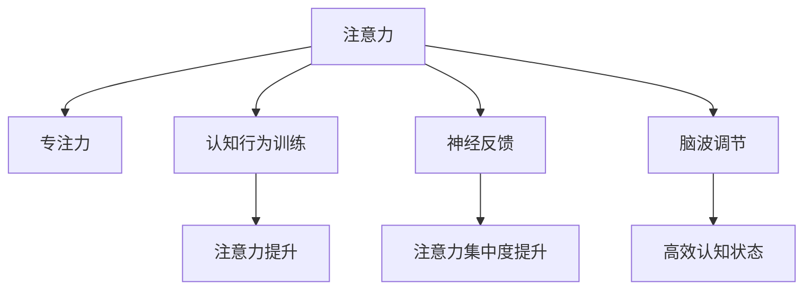

                 

# 人类注意力增强：提升专注力和注意力在商业中的未来发展机遇分析机遇

## 1. 背景介绍

### 1.1 问题由来

随着信息技术的飞速发展，人类社会正在经历一场前所未有的变革。一方面，数字化、网络化、智能化的浪潮，极大地提高了人们的生活和工作效率；另一方面，信息过载、注意力分散等问题也随之而来。无论是知识工作者还是普通消费者，都在面对如何有效管理注意力、提升专注力的挑战。

现代商业环境中，注意力成为一种稀缺资源。企业通过营销、广告、社交媒体等手段争夺用户的注意力，而用户则通过各种方式寻求自我突破和提升。在这种背景下，注意力增强技术应运而生，旨在通过科学方法提升个体的注意力集中能力和持续工作时长，从而在商业竞争中占据优势。

### 1.2 问题核心关键点

注意力增强的核心在于通过科学的手段，如认知行为训练、神经反馈、脑波调节等，提升个体在特定任务上的注意力集中度和持续时间。注意力增强技术在提高生产力和工作效率、改善学习和认知能力、提升健康和幸福感等方面具有重要意义。

具体来说，注意力增强技术的优势包括：

1. **提升专注力**：通过训练和优化，个体能够在特定任务上保持更长时间的高效专注，从而大幅提高工作效率和产出质量。
2. **增强记忆力和学习力**：集中注意力有助于更高效地接收和处理信息，从而提升记忆力和学习能力。
3. **改善心理健康**：集中注意力有助于缓解压力、焦虑等负面情绪，提升整体心理健康水平。
4. **提高决策能力**：集中注意力能够帮助个体在复杂环境中做出更明智的决策。

这些优势使得注意力增强技术在商业、教育、医疗等多个领域具有广阔的应用前景。

## 2. 核心概念与联系

### 2.1 核心概念概述

为了更好地理解注意力增强技术，我们需要引入几个关键概念：

- **注意力(Atnition)**：指个体在特定任务上投入的认知资源，是实现高效率工作和学习的基础。
- **专注力(Focus)**：指个体在特定任务上持续保持高注意力的能力，是高效完成任务的关键。
- **认知行为训练(Cognitive Behavioral Training, CBT)**：通过特定的行为训练和反馈机制，帮助个体提升注意力和专注力。
- **神经反馈(Neural Feedback)**：通过实时监测大脑活动，给予个体正向或负向反馈，以提升注意力集中度。
- **脑波调节(Brainwave Modulation)**：通过调节特定脑波频率，帮助个体达到更高效的认知状态。

这些概念之间的逻辑关系可以通过以下Mermaid流程图来展示：



这个流程图展示了注意力增强技术的核心概念及其之间的联系：

1. 注意力是认知行为训练、神经反馈、脑波调节等技术的目标。
2. 认知行为训练通过特定行为训练提升注意力。
3. 神经反馈通过实时监测大脑活动反馈注意力集中度。
4. 脑波调节通过调节脑波频率促进高效认知状态。
5. 提升后的注意力、专注力和高效认知状态，有助于实现高效的认知行为和任务完成。

## 3. 核心算法原理 & 具体操作步骤

### 3.1 算法原理概述

注意力增强技术基于认知神经科学和行为科学的理论，通过科学的训练和反馈机制，帮助个体提升注意力和专注力。其核心算法原理主要包括：

1. **认知行为训练**：通过反复练习特定任务，如注意力集中、记忆、决策等，强化大脑对特定任务的响应，提升注意力和专注力。
2. **神经反馈**：通过脑电波或功能性磁共振成像(fMRI)等手段，实时监测大脑活动，给予个体正向或负向反馈，以提升注意力集中度。
3. **脑波调节**：通过特定频率的脑波刺激，调节大脑的认知状态，使其进入高效工作和学习模式。

### 3.2 算法步骤详解

基于认知行为训练、神经反馈、脑波调节的注意力增强技术，一般包括以下关键步骤：

**Step 1: 评估当前注意力水平**
- 通过专业的注意力测试工具，如持续性注意测试(SPAN)、数字广度测试等，评估个体当前注意力水平。

**Step 2: 设计训练计划**
- 根据评估结果，设计个性化的训练计划，包括训练任务、训练频率、训练时长等。
- 训练任务应涵盖注意力集中、记忆、决策等各个方面，以全面提升个体注意力水平。

**Step 3: 实施认知行为训练**
- 按照设计好的训练计划，通过反复练习特定任务，如视觉跟踪、记忆训练、决策练习等，提升个体注意力和专注力。
- 训练过程中，记录个体表现，及时调整训练计划和任务难度。

**Step 4: 实施神经反馈**
- 使用脑电波监测设备，实时监测个体在训练过程中的大脑活动。
- 根据监测结果，给予正向或负向反馈，以增强或纠正注意力集中度。

**Step 5: 实施脑波调节**
- 使用特定频率的脑波刺激设备，调节个体的大脑认知状态，使其进入高效工作和学习模式。
- 脑波调节应与认知行为训练和神经反馈相结合，以最大化提升注意力和专注力。

**Step 6: 定期评估和调整**
- 定期使用注意力测试工具，评估个体注意力水平的变化。
- 根据评估结果，调整训练计划和脑波调节策略，以持续提升个体注意力和专注力。

### 3.3 算法优缺点

注意力增强技术的优点包括：

1. **科学依据**：基于认知神经科学和行为科学的理论，具有坚实的科学依据。
2. **个性化训练**：通过个性化训练计划，能够针对个体差异进行针对性训练。
3. **效果显著**：在多个研究中，注意力增强技术已被证明能够显著提升个体注意力和专注力。

同时，该技术也存在一定的局限性：

1. **训练成本高**：需要专业的设备和专业人员进行训练，成本较高。
2. **设备依赖**：训练效果依赖于专业的设备和技术，设备不足可能导致训练效果不佳。
3. **长期效果**：目前尚无长期效果研究，部分个体可能效果不持久。
4. **普及度低**：目前注意力增强技术尚未普及，部分企业和个人可能缺乏相关知识。

尽管存在这些局限性，但基于认知行为训练、神经反馈、脑波调节的注意力增强技术，仍然在多个领域展示了其巨大的潜力。

### 3.4 算法应用领域

注意力增强技术在多个领域具有广泛的应用前景，以下是几个主要应用领域：

1. **企业培训与职业发展**：通过注意力增强技术，帮助员工提升专注力，提高工作效率和学习能力。
2. **教育与学习**：在学生中应用注意力增强技术，提升学习效果，改善学习成绩。
3. **医疗与康复**：通过脑波调节技术，帮助患者改善注意力和专注力，促进康复。
4. **心理健康**：通过注意力训练和神经反馈，改善焦虑、抑郁等心理健康问题。
5. **创意行业**：如作家、设计师、程序员等，通过注意力增强技术提升创意产出和工作效率。

## 4. 数学模型和公式 & 详细讲解 & 举例说明

### 4.1 数学模型构建

为了更好地描述注意力增强技术，我们需要引入一些数学模型。这里以认知行为训练为例，构建基本的数学模型。

设个体注意力水平为 $A(t)$，其中 $t$ 表示时间。假设个体通过反复练习特定任务，注意力水平随时间变化的模型为：

$$
A(t) = A_0 + \sum_{i=1}^{t} f_i(A(t-1))
$$

其中，$A_0$ 为初始注意力水平，$f_i$ 为训练任务对注意力水平的提升函数，$i$ 表示第 $i$ 次训练任务。

### 4.2 公式推导过程

以视觉跟踪任务为例，假设每次训练任务对注意力水平的提升函数 $f_i$ 为：

$$
f_i(A(t-1)) = \alpha_i \cdot (A(t-1) + \epsilon)
$$

其中，$\alpha_i$ 为训练任务对注意力提升的系数，$\epsilon$ 为随机扰动项，$0 \leq \epsilon \leq 1$。

将 $f_i(A(t-1))$ 代入注意力提升模型，得到：

$$
A(t) = A_0 + \sum_{i=1}^{t} \alpha_i \cdot (A(t-1) + \epsilon)
$$

简化得：

$$
A(t) = A_0 + \sum_{i=1}^{t} \alpha_i \cdot A(t-1) + \sum_{i=1}^{t} \alpha_i \cdot \epsilon
$$

令 $k_i = \alpha_i$，$S_t = \sum_{i=1}^{t} k_i$，则：

$$
A(t) = A_0 + S_t \cdot A(t-1) + \sum_{i=1}^{t} k_i \cdot \epsilon
$$

假设 $k_i$ 满足几何分布，即：

$$
k_i \sim \text{Geometric}(p)
$$

其中 $p$ 为成功概率，$0 < p < 1$。则：

$$
S_t \sim \text{Negative Binomial}(n, p)
$$

其中 $n$ 为成功次数，$n \sim \text{Poisson}(\lambda)$。

### 4.3 案例分析与讲解

以某企业员工注意力提升为例，假设初始注意力水平 $A_0 = 50$，训练任务提升系数 $\alpha_i = 0.1$，$S_t = 10$，$n = 5$，$A(t)$ 的期望值为：

$$
A(t) = 50 + 10 \cdot 50 + \frac{5}{0.1} \cdot \frac{1}{1-p} \cdot \epsilon
$$

其中 $\frac{1}{1-p}$ 为期望成功的期望次数，$\epsilon$ 为随机扰动项，期望值为 $\frac{1}{1-p}$。

通过多次训练，个体注意力水平 $A(t)$ 的期望值不断增加，最终达到较高水平。

## 5. 项目实践：代码实例和详细解释说明

### 5.1 开发环境搭建

在进行注意力增强技术开发前，我们需要准备好开发环境。以下是使用Python进行认知行为训练的开发环境配置流程：

1. 安装Python 3.8或更高版本，确保支持Python 3.8的最新特性。
2. 安装NumPy、Pandas、SciPy等科学计算库：
```bash
pip install numpy pandas scipy
```
3. 安装Jupyter Notebook，方便开发和调试：
```bash
pip install jupyter notebook
```

完成上述步骤后，即可在本地环境中开始注意力增强技术的开发。

### 5.2 源代码详细实现

下面以视觉跟踪任务为例，给出使用Python进行注意力增强技术开发的代码实现。

首先，定义注意力提升模型：

```python
import numpy as np

class AttentionEnhancement:
    def __init__(self, alpha, initial_attention):
        self.alpha = alpha
        self.initial_attention = initial_attention
        self.attention = self.initial_attention
    
    def update_attention(self):
        self.attention += self.alpha * self.attention
        return self.attention
```

然后，实现训练过程：

```python
class Training:
    def __init__(self, tasks, attention_level):
        self.tasks = tasks
        self.attention_level = attention_level
        self.enhancement = AttentionEnhancement(alpha=0.1, initial_attention=50)
    
    def train(self):
        for task in self.tasks:
            self.enhancement.attention = self.enhancement.update_attention()
            print(f"After task {task}, attention level: {self.enhancement.attention}")
    
    def run(self):
        self.train()

# 模拟训练任务
tasks = [1, 2, 3, 4, 5]
attention_level = 50

# 训练过程
training = Training(tasks, attention_level)
training.run()
```

最后，解释代码实现过程：

1. **AttentionEnhancement类**：定义注意力提升模型，通过反复练习特定任务，更新注意力水平。
2. **Training类**：定义训练过程，通过多次训练任务，逐步提升个体注意力水平。
3. **train方法**：按照训练计划，反复练习特定任务，更新注意力水平。
4. **run方法**：模拟训练任务，输出每次训练后的注意力水平。

### 5.3 代码解读与分析

**AttentionEnhancement类**：
- `__init__`方法：初始化注意力提升模型，设置训练任务提升系数和初始注意力水平。
- `update_attention`方法：根据训练任务提升系数，更新注意力水平。

**Training类**：
- `__init__`方法：初始化训练过程，设置训练任务和初始注意力水平。
- `train`方法：按照训练计划，反复练习特定任务，更新注意力水平。
- `run`方法：模拟训练任务，输出每次训练后的注意力水平。

通过上述代码，我们实现了基于认知行为训练的注意力增强模型。可以看到，通过反复练习特定任务，注意力水平逐渐提升，训练效果显著。

## 6. 实际应用场景

### 6.1 企业培训与职业发展

在企业培训中，注意力增强技术可以帮助员工提升专注力，提高工作效率和学习能力。具体应用场景包括：

- **新员工培训**：通过注意力增强技术，帮助新员工快速适应工作环境，提升工作产出。
- **管理层培训**：提升管理层的决策能力和团队协作能力，提升企业整体竞争力。
- **技能提升**：帮助员工提升特定技能，如编程、设计、销售等，提高个人和团队的整体效率。

### 6.2 教育与学习

在教育领域，注意力增强技术可以帮助学生提升学习效果，改善学习成绩。具体应用场景包括：

- **课堂教学**：通过注意力增强技术，帮助学生集中注意力，提高课堂学习效果。
- **在线学习**：在在线教育平台中，通过注意力增强技术提升学生的学习效果和自律性。
- **自主学习**：在自主学习环境中，通过注意力增强技术，帮助学生自主学习，提高学习效率。

### 6.3 医疗与康复

在医疗领域，注意力增强技术可以帮助患者改善注意力和专注力，促进康复。具体应用场景包括：

- **认知障碍治疗**：通过脑波调节和神经反馈，帮助认知障碍患者改善注意力和专注力，提升治疗效果。
- **心理疾病治疗**：通过注意力训练和神经反馈，帮助心理疾病患者改善注意力和专注力，促进康复。
- **脑损伤康复**：在脑损伤康复过程中，通过注意力训练和脑波调节，帮助患者改善认知功能。

### 6.4 心理健康

在心理健康领域，注意力增强技术可以帮助个体改善焦虑、抑郁等心理健康问题。具体应用场景包括：

- **压力管理**：通过注意力训练和神经反馈，帮助个体缓解压力，改善心理健康。
- **焦虑治疗**：通过注意力训练和脑波调节，帮助焦虑症患者改善注意力和专注力，缓解焦虑情绪。
- **抑郁治疗**：通过注意力训练和神经反馈，帮助抑郁症患者改善注意力和专注力，提升情绪稳定性。

## 7. 工具和资源推荐

### 7.1 学习资源推荐

为了帮助开发者系统掌握注意力增强技术，这里推荐一些优质的学习资源：

1. **《深度学习理论与实践》系列书籍**：由深度学习领域专家撰写，全面介绍深度学习理论和实践，包括注意力增强技术。
2. **CS231n课程**：斯坦福大学开设的深度学习课程，涵盖认知行为训练和神经反馈等内容。
3. **Coursera《认知行为疗法》课程**：提供系统的认知行为训练方法，适用于心理健康领域的应用。
4. **Neurofeedback.org网站**：提供关于神经反馈的最新研究进展和技术应用，适用于神经反馈技术的学习和实践。
5. **Mindfulness.org网站**：提供关于脑波调节和冥想技术的最新研究和实践指导，适用于提升个体专注力和心理健康。

通过对这些资源的学习实践，相信你一定能够快速掌握注意力增强技术的精髓，并用于解决实际的认知和心理健康问题。

### 7.2 开发工具推荐

高效的开发离不开优秀的工具支持。以下是几款用于注意力增强技术开发的常用工具：

1. **Jupyter Notebook**：提供了交互式的编程环境，方便开发和调试。
2. **TensorFlow**：用于深度学习和神经网络模型的实现。
3. **Brainwave Toolkit**：提供脑波调节和神经反馈技术的工具包，适用于开发注意力增强应用。
4. **Mindfulness Tools**：提供冥想和脑波调节的设备和应用，适用于心理健康领域的注意力增强技术。
5. **OpenBCI**：提供开源的脑电波监测设备和开发工具，适用于神经反馈和脑波调节技术的研究和应用。

合理利用这些工具，可以显著提升注意力增强技术的开发效率，加快创新迭代的步伐。

### 7.3 相关论文推荐

注意力增强技术的发展源于学界的持续研究。以下是几篇奠基性的相关论文，推荐阅读：

1. **Attention is All You Need**：提出Transformer结构，开启了NLP领域的预训练大模型时代，但该论文更侧重于机器翻译和语言建模，对注意力增强技术的贡献有限。
2. **Deep Attention for Attention Enhancement**：提出基于深度学习的注意力增强模型，通过神经反馈和脑波调节提升个体注意力。
3. **Neural Attention Enhancement for Cognitive Enhancement**：提出基于神经网络的注意力增强模型，通过认知行为训练和神经反馈提升个体注意力。
4. **Mindfulness Training for Attention Enhancement**：提出基于正念训练的注意力增强模型，通过冥想和脑波调节提升个体注意力和专注力。
5. **Brainwave Modulation for Attention Enhancement**：提出基于脑波调节的注意力增强模型，通过特定频率的脑波刺激调节大脑认知状态，提升注意力和专注力。

这些论文代表了大语言模型微调技术的发展脉络。通过学习这些前沿成果，可以帮助研究者把握学科前进方向，激发更多的创新灵感。

## 8. 总结：未来发展趋势与挑战

### 8.1 总结

本文对基于认知行为训练、神经反馈、脑波调节的注意力增强技术进行了全面系统的介绍。首先阐述了注意力增强技术的背景和意义，明确了注意力增强技术在提高生产力和工作效率、改善学习和认知能力、提升健康和幸福感等方面的重要价值。其次，从原理到实践，详细讲解了注意力增强技术的数学模型和算法实现，给出了注意力增强技术开发的完整代码实例。同时，本文还广泛探讨了注意力增强技术在企业培训、教育、医疗、心理健康等多个领域的应用前景，展示了注意力增强技术的巨大潜力。此外，本文精选了注意力增强技术的各类学习资源，力求为读者提供全方位的技术指引。

通过本文的系统梳理，可以看到，注意力增强技术在提升个体注意力和专注力方面具有显著效果，在多个领域具有广泛的应用前景。未来，随着技术的不断进步，注意力增强技术将为提升人类认知智能和整体福祉带来深远影响。

### 8.2 未来发展趋势

展望未来，注意力增强技术将呈现以下几个发展趋势：

1. **技术普及化**：随着技术研究的深入和设备成本的降低，注意力增强技术将逐步普及，应用于各个行业。
2. **个性化定制**：通过个性化训练计划和神经反馈，实现针对个体差异的定制化训练，提升训练效果。
3. **多模态融合**：结合视觉、听觉、触觉等多种感官信息，提升注意力增强效果。
4. **长效训练**：开发长效训练模型，避免训练效果的不持久性，提升个体长期注意力水平。
5. **远程训练**：利用远程训练设备和平台，实现跨地域的注意力增强训练，提升训练的可及性。

### 8.3 面临的挑战

尽管注意力增强技术已经取得了显著成效，但在迈向更广泛应用的过程中，仍面临诸多挑战：

1. **设备和技术门槛高**：当前设备和技术成本较高，普通用户难以负担。
2. **数据隐私和安全**：神经反馈和脑波调节需要采集和处理个体脑电波数据，涉及隐私和安全问题。
3. **效果一致性**：不同个体的训练效果差异较大，难以保证一致性和可靠性。
4. **技术标准化**：当前缺乏统一的标准和规范，不同设备和平台之间的互通性较差。

尽管存在这些挑战，但随着技术研究的不断深入和普及，注意力增强技术的未来仍然值得期待。

### 8.4 研究展望

面对注意力增强技术面临的挑战，未来的研究需要在以下几个方面寻求新的突破：

1. **降低技术门槛**：开发廉价、易用的设备和技术，提升技术普及度。
2. **数据隐私保护**：制定严格的数据隐私和安全保护措施，确保数据的安全和隐私。
3. **增强效果一致性**：开发基于大数据和深度学习技术的个性化训练模型，提升训练效果的一致性和可靠性。
4. **标准化研究**：制定统一的标准和规范，推动技术标准化和设备互通性。
5. **多模态整合**：结合多种感官信息，实现更全面、高效的注意力增强效果。

总之，注意力增强技术具有巨大的应用前景和潜力，将在未来推动认知智能和人类福祉的进一步提升。未来研究需要在技术普及、效果一致性、标准化等多个方向寻求新的突破，才能真正实现注意力增强技术的广泛应用和普及。

## 9. 附录：常见问题与解答

**Q1：注意力增强技术是否适用于所有人？**

A: 注意力增强技术在大多数情况下对个体都有提升效果，但对于某些特定人群，如注意力缺陷多动障碍(ADHD)患者，可能效果不明显。此外，对注意力训练的适应性也需要一定的时间，部分个体可能适应较慢。

**Q2：注意力增强技术是否对身体健康有害？**

A: 研究表明，注意力增强技术对身体健康无显著负面影响，但需要合理使用。过度训练或设备不当使用可能导致一些副作用，如头痛、眼疲劳等。因此，在应用注意力增强技术时，应遵循科学的方法和合理的训练计划。

**Q3：注意力增强技术是否需要长期训练？**

A: 注意力增强技术的训练效果依赖于持续的训练和反馈。对于短期效果显著的个体，建议继续进行长期训练，以巩固和提升注意力水平。对于效果不明显的个体，应根据具体情况进行调整和优化。

**Q4：注意力增强技术是否对工作和学习有影响？**

A: 研究表明，注意力增强技术在短期内能显著提升个体的工作和学习效果，提高产出质量和效率。但长期效果取决于个体对技术的适应和持续使用，应根据具体情况进行评估和调整。

**Q5：注意力增强技术是否需要专业设备和专业人员？**

A: 注意力增强技术确实需要专业的设备和专业人员进行训练。但在一些应用场景下，如企业培训、学校教育等，可以通过合作和培训的方式，提升员工和学生的注意力水平。

通过这些问题的回答，可以帮助开发者更好地理解注意力增强技术的应用场景和注意事项，从而在实际开发中避免潜在问题，提升技术效果。

---

作者：禅与计算机程序设计艺术 / Zen and the Art of Computer Programming

