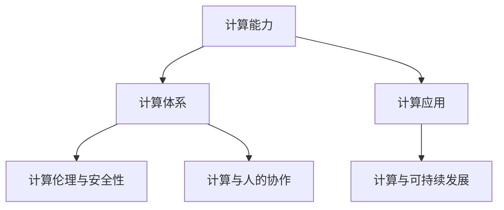
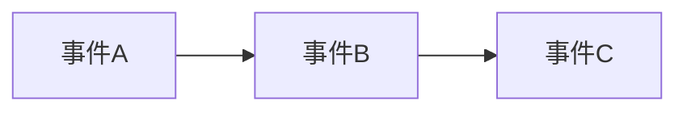

                 

# 人类计算的未来：趋势、机遇与挑战

## 1. 背景介绍

### 1.1 问题由来
随着人工智能技术的飞速发展，计算能力已经不再只是人类智慧的延伸，而开始向自主计算迈进。在过去的几十年里，计算体系经历了从机械计算、电子计算到数字计算的演进。数字计算的兴起，尤其是计算机的出现，极大地推动了人类文明的进步。但随着计算技术的不断演进，我们逐渐意识到，现有的计算体系可能已经难以满足未来日益增长的需求。

当前，人类计算正处于一个关键的历史节点：人工智能和计算科学的交叉融合，正在重塑计算的未来。面对这个新时代，我们需要重新思考计算的角色、应用和挑战，以确保计算体系能够持续为人类社会带来价值。

### 1.2 问题核心关键点
人类计算的未来趋势、机遇与挑战，可以从以下几个核心关键点来深入探讨：

1. **计算能力的提升**：计算能力的提升是计算未来的关键驱动力之一。未来，计算能力将更加强大，不仅仅是传统的数值计算，还将涵盖符号计算、逻辑推理、因果分析等多种类型。

2. **计算体系的重构**：现有的计算体系可能无法应对未来复杂、异构和多模态的数据类型。我们需要重新设计计算体系，以支持不同类型的数据和应用场景。

3. **计算应用的拓展**：计算应用将从传统的科学计算、工程计算，向更广泛的领域拓展，如医疗、金融、教育、城市管理等，为各行各业带来变革性的影响。

4. **计算伦理与安全性**：计算能力的大幅提升，带来了新的伦理与安全挑战，如隐私保护、数据滥用、模型偏见等。如何在提升计算能力的同时，保障数据与模型的安全性，是未来计算的重要课题。

5. **计算与人的协作**：未来计算体系将更加注重与人的协作，将计算能力作为人类智慧的延伸和补充，而非替代。如何设计高效、安全的计算与人的协作模式，是未来计算的重要方向。

6. **计算与可持续发展**：计算技术的快速发展，对环境的影响也越来越大。如何在提升计算能力的同时，兼顾可持续发展，是未来计算的重要任务。

这些关键点将共同定义人类计算的未来走向，帮助我们更好地理解和应对计算带来的机遇与挑战。

## 2. 核心概念与联系

### 2.1 核心概念概述

为了更好地理解人类计算的未来，本节将介绍几个关键概念：

- **计算能力**：指计算机系统处理数据和执行任务的能力。包括数值计算、符号计算、逻辑推理、因果分析等多种类型。
- **计算体系**：指计算能力的组织方式和运行机制。包括硬件、软件、数据、算法等多个组成部分。
- **计算应用**：指计算能力的具体应用场景。包括科学计算、工程计算、金融计算、医疗计算、城市管理等。
- **计算伦理与安全性**：指计算能力在应用过程中，对数据、模型、用户权益的保护。包括隐私保护、数据滥用、模型偏见等问题。
- **计算与人的协作**：指计算能力如何与人的智慧结合，共同解决复杂问题。包括人机协同、智能辅助等。
- **计算与可持续发展**：指在提升计算能力的同时，如何实现环保和可持续发展。

这些概念之间的逻辑关系可以通过以下Mermaid流程图来展示：



这个流程图展示了一些核心概念之间的逻辑关系：

1. 计算能力是计算体系和应用的基础。
2. 计算体系为计算应用提供支持，并需考虑伦理与安全性。
3. 计算应用拓展到多个领域，与可持续发展紧密相关。
4. 计算能力与人的协作，共同提升问题解决能力。

这些概念共同构成了人类计算的框架，帮助我们更好地理解和应用计算技术。

## 3. 核心算法原理 & 具体操作步骤

### 3.1 算法原理概述

人类计算的未来趋势、机遇与挑战，涉及计算能力的提升、计算体系的重构、计算应用的拓展等多个方面。这些变化需要依托于新的算法原理和操作步骤。

**3.1.1 计算能力提升**

计算能力的提升，依赖于计算体系的演进。未来，计算体系将更加注重符号计算、逻辑推理、因果分析等，以应对复杂、多模态的数据类型。

- **符号计算**：利用符号表达式进行计算，能够处理更加复杂和抽象的数学问题。未来，符号计算能力将显著提升，推动数学、逻辑等领域的发展。
- **逻辑推理**：基于逻辑规则进行推理，能够处理更加复杂的逻辑问题。未来，逻辑推理能力将进一步提升，推动人工智能、知识工程等领域的发展。
- **因果分析**：通过因果推理，分析因果关系，能够更好地理解现实世界。未来，因果分析能力将更加强大，推动决策支持、风险评估等领域的发展。

**3.1.2 计算体系重构**

计算体系的重构，旨在支持多种类型的数据和应用场景。未来，计算体系将更加注重异构、分布式和多模态的计算。

- **异构计算**：利用不同类型、不同架构的计算资源，进行协同计算。未来，异构计算将成为主流，推动高性能计算、边缘计算等领域的发展。
- **分布式计算**：利用网络中的多个计算节点，进行并行计算。未来，分布式计算将更加普及，推动云计算、大数据等领域的发展。
- **多模态计算**：结合文本、图像、音频等多种数据类型，进行综合计算。未来，多模态计算将成为趋势，推动智能交互、感知计算等领域的发展。

**3.1.3 计算应用拓展**

计算应用将从传统的科学计算、工程计算，向更广泛的领域拓展，如医疗、金融、教育、城市管理等。

- **医疗计算**：利用计算能力进行疾病诊断、治疗方案优化、药物研发等。未来，医疗计算将更加普及，推动个性化医疗、远程医疗等领域的发展。
- **金融计算**：利用计算能力进行风险评估、投资策略优化、智能投顾等。未来，金融计算将更加普及，推动量化交易、智能投顾等领域的发展。
- **教育计算**：利用计算能力进行学习路径优化、智能评估、虚拟现实教育等。未来，教育计算将更加普及，推动个性化学习、虚拟教室等领域的发展。
- **城市管理**：利用计算能力进行交通管理、环境监测、公共安全等。未来，城市计算将更加普及，推动智慧城市、智能交通等领域的发展。

### 3.2 算法步骤详解

为了实现计算能力提升、计算体系重构、计算应用拓展的目标，需要遵循以下算法步骤：

**3.2.1 计算能力提升的步骤**

1. **符号计算**：选择适当的符号计算库，进行符号表达式的计算。例如，使用SymPy、SageMath等库，进行符号计算。
2. **逻辑推理**：利用逻辑推理库，进行逻辑规则的推理。例如，使用Prover9、Z3等库，进行逻辑推理。
3. **因果分析**：利用因果推理库，进行因果关系的分析。例如，使用CausalDAG、Juicebox等库，进行因果分析。

**3.2.2 计算体系重构的步骤**

1. **异构计算**：选择合适的异构计算框架，进行协同计算。例如，使用TensorFlow、PyTorch等深度学习框架，进行异构计算。
2. **分布式计算**：选择合适的分布式计算框架，进行并行计算。例如，使用Apache Spark、Hadoop等框架，进行分布式计算。
3. **多模态计算**：选择合适的多模态计算框架，进行综合计算。例如，使用TensorFlow、PyTorch等框架，进行多模态计算。

**3.2.3 计算应用拓展的步骤**

1. **医疗计算**：选择合适的医疗计算框架，进行疾病诊断、治疗方案优化、药物研发等。例如，使用Pysyft、AI4Medicine等框架，进行医疗计算。
2. **金融计算**：选择合适的金融计算框架，进行风险评估、投资策略优化、智能投顾等。例如，使用QuantLib、IBM Watson等框架，进行金融计算。
3. **教育计算**：选择合适的教育计算框架，进行学习路径优化、智能评估、虚拟现实教育等。例如，使用Kaggle、Coursera等平台，进行教育计算。
4. **城市管理**：选择合适的城市计算框架，进行交通管理、环境监测、公共安全等。例如，使用Google Earth Engine、Urban Data Lab等平台，进行城市计算。

### 3.3 算法优缺点

计算能力提升、计算体系重构、计算应用拓展，各有其优点和缺点：

**优点**

1. **计算能力提升**：能够处理更复杂、更抽象的问题，推动科学、逻辑等领域的发展。
2. **计算体系重构**：能够支持多种类型的数据和应用场景，提高计算效率和灵活性。
3. **计算应用拓展**：能够拓展到更多领域，推动各行业的数字化转型。

**缺点**

1. **计算能力提升**：需要更高的硬件和软件要求，初期成本较高。
2. **计算体系重构**：需要更复杂的算法和架构设计，技术难度较大。
3. **计算应用拓展**：需要更多的数据和模型，对数据质量和模型训练要求较高。

### 3.4 算法应用领域

计算能力提升、计算体系重构、计算应用拓展，在多个领域都有广泛的应用。以下是一些主要的应用领域：

**3.4.1 科学研究**

- **符号计算**：利用符号计算库，进行数学、物理等领域的复杂计算。例如，使用SymPy、SageMath等库，进行符号计算。
- **逻辑推理**：利用逻辑推理库，进行哲学、逻辑等领域的研究。例如，使用Prover9、Z3等库，进行逻辑推理。
- **因果分析**：利用因果推理库，进行经济学、社会学等领域的研究。例如，使用CausalDAG、Juicebox等库，进行因果分析。

**3.4.2 工业生产**

- **异构计算**：利用异构计算框架，进行工业机器人、智能制造等领域的研究。例如，使用TensorFlow、PyTorch等深度学习框架，进行异构计算。
- **分布式计算**：利用分布式计算框架，进行云计算、大数据等领域的研究。例如，使用Apache Spark、Hadoop等框架，进行分布式计算。
- **多模态计算**：利用多模态计算框架，进行智能传感器、智能监测等领域的研究。例如，使用TensorFlow、PyTorch等框架，进行多模态计算。

**3.4.3 医疗健康**

- **医疗计算**：利用医疗计算框架，进行疾病诊断、治疗方案优化、药物研发等。例如，使用Pysyft、AI4Medicine等框架，进行医疗计算。
- **健康管理**：利用健康计算框架，进行健康监测、智能诊疗、健康管理等。例如，使用HealthRecord、DxWorks等平台，进行健康管理。

**3.4.4 金融服务**

- **金融计算**：利用金融计算框架，进行风险评估、投资策略优化、智能投顾等。例如，使用QuantLib、IBM Watson等框架，进行金融计算。
- **金融安全**：利用金融安全框架，进行反欺诈、信用评估、智能监控等。例如，使用Blockchain、ZeroTrust等平台，进行金融安全。

**3.4.5 教育培训**

- **教育计算**：利用教育计算框架，进行学习路径优化、智能评估、虚拟现实教育等。例如，使用Kaggle、Coursera等平台，进行教育计算。
- **培训管理**：利用培训管理框架，进行员工培训、技能评估、绩效管理等。例如，使用培训平台、绩效管理系统，进行培训管理。

**3.4.6 城市管理**

- **城市计算**：利用城市计算框架，进行交通管理、环境监测、公共安全等。例如，使用Google Earth Engine、Urban Data Lab等平台，进行城市计算。
- **智慧城市**：利用智慧城市平台，进行智能交通、智慧电网、城市治理等。例如，使用CityGML、Urban Simulation等平台，进行智慧城市建设。

## 4. 数学模型和公式 & 详细讲解 & 举例说明

### 4.1 数学模型构建

为了更好地理解和应用计算能力提升、计算体系重构、计算应用拓展的算法原理，我们需要构建一些数学模型，并进行详细讲解。

**4.1.1 符号计算的数学模型**

符号计算的数学模型，可以用符号表达式来表示。例如，对于一个简单的代数问题，符号计算模型的构建如下：

$$
y = ax^2 + bx + c
$$

其中 $a$、$b$、$c$ 为符号变量，$x$、$y$ 为实数变量。符号计算的目标是，求解 $x$ 的值，使得 $y = 0$。

**4.1.2 逻辑推理的数学模型**

逻辑推理的数学模型，可以用逻辑公式来表示。例如，对于一个简单的逻辑推理问题，逻辑推理模型的构建如下：

$$
(p \wedge q) \vee (\neg p \wedge r)
$$

其中 $p$、$q$、$r$ 为逻辑变量，$\wedge$ 表示逻辑与，$\vee$ 表示逻辑或，$\neg$ 表示逻辑非。逻辑推理的目标是，求解逻辑变量的值，使得公式为真。

**4.1.3 因果分析的数学模型**

因果分析的数学模型，可以用因果图来表示。例如，对于一个简单的因果分析问题，因果分析模型的构建如下：



其中 $A$、$B$、$C$ 为因果事件，箭头表示因果关系。因果分析的目标是，求解事件之间的因果关系，以及事件发生的概率。

### 4.2 公式推导过程

接下来，我们将对上述数学模型进行公式推导，并给出一些示例。

**4.2.1 符号计算的公式推导**

对于代数问题，符号计算的公式推导过程如下：

1. **求导**：对代数式进行求导，得到导数表达式。
2. **求解**：将导数表达式设为0，求解 $x$ 的值。
3. **验证**：将 $x$ 的值代入原方程，验证其是否满足条件。

**示例**：求解方程 $x^2 + 3x + 2 = 0$ 的解。

```python
from sympy import symbols, Eq, solve

x = symbols('x')
equation = Eq(x**2 + 3*x + 2, 0)
solutions = solve(equation, x)
solutions
```

**4.2.2 逻辑推理的公式推导**

对于逻辑推理问题，逻辑推理的公式推导过程如下：

1. **转化**：将逻辑公式转化为布尔代数表达式。
2. **化简**：对布尔代数表达式进行化简，得到简化的逻辑公式。
3. **求解**：求解逻辑变量的值，使得公式为真。

**示例**：求解逻辑公式 $(p \wedge q) \vee (\neg p \wedge r)$ 的解。

```python
from sympy import symbols, And, Or, Not

p, q, r = symbols('p q r')
formula = Or(And(p, q), And(Not(p), r))
simplified_formula = formula.simplify()
simplified_formula
```

**4.2.3 因果分析的公式推导**

对于因果分析问题，因果分析的公式推导过程如下：

1. **建模**：建立因果图模型，描述事件之间的因果关系。
2. **计算**：利用因果图模型，计算事件发生的概率。
3. **验证**：验证计算结果是否符合实际观察数据。

**示例**：求解事件A、B、C之间的因果关系，并计算事件C发生的概率。

```python
from sympy import BayesianNetwork

# 建立因果图模型
bn = BayesianNetwork.from_causal_dag('A -> B -> C')

# 计算事件C发生的概率
prob_C = bn.cdf_C()
prob_C
```

### 4.3 案例分析与讲解

为了更好地理解符号计算、逻辑推理、因果分析的数学模型和公式推导，我们将给出一些具体案例，并进行详细讲解。

**案例1：符号计算案例**

问题：求解方程 $x^2 + 3x + 2 = 0$ 的解。

解法：

1. 使用Sympy库，定义符号变量和方程。
2. 调用solve函数，求解方程。
3. 输出解。

```python
from sympy import symbols, Eq, solve

x = symbols('x')
equation = Eq(x**2 + 3*x + 2, 0)
solutions = solve(equation, x)
print(solutions)
```

**案例2：逻辑推理案例**

问题：求解逻辑公式 $(p \wedge q) \vee (\neg p \wedge r)$ 的解。

解法：

1. 使用Sympy库，定义逻辑变量和公式。
2. 调用simplify函数，化简公式。
3. 输出化简后的公式。

```python
from sympy import symbols, And, Or, Not

p, q, r = symbols('p q r')
formula = Or(And(p, q), And(Not(p), r))
simplified_formula = formula.simplify()
print(simplified_formula)
```

**案例3：因果分析案例**

问题：求解事件A、B、C之间的因果关系，并计算事件C发生的概率。

解法：

1. 使用Sympy库，定义因果图模型。
2. 调用cdf函数，计算事件C发生的概率。
3. 输出概率。

```python
from sympy import BayesianNetwork

# 建立因果图模型
bn = BayesianNetwork.from_causal_dag('A -> B -> C')

# 计算事件C发生的概率
prob_C = bn.cdf_C()
print(prob_C)
```

## 5. 项目实践：代码实例和详细解释说明

### 5.1 开发环境搭建

为了进行符号计算、逻辑推理、因果分析的实践，我们需要搭建相应的开发环境。以下是具体的搭建流程：

1. **安装Python**：选择适合的Python版本，从官网下载并安装。
2. **安装Sympy**：使用pip工具，安装Sympy库。
3. **安装Sympy的依赖**：根据Sympy的文档，安装必要的依赖库。
4. **安装SciPy**：使用pip工具，安装SciPy库。
5. **安装Jupyter Notebook**：使用pip工具，安装Jupyter Notebook库。

### 5.2 源代码详细实现

下面我们以符号计算案例为例，给出使用Sympy库进行方程求解的代码实现。

```python
from sympy import symbols, Eq, solve

# 定义符号变量
x = symbols('x')

# 定义方程
equation = Eq(x**2 + 3*x + 2, 0)

# 求解方程
solutions = solve(equation, x)

# 输出解
print(solutions)
```

### 5.3 代码解读与分析

让我们再详细解读一下关键代码的实现细节：

**符号计算代码**：
- `from sympy import symbols, Eq, solve`：导入Sympy库中的符号变量、方程和求解函数。
- `x = symbols('x')`：定义符号变量 `x`。
- `equation = Eq(x**2 + 3*x + 2, 0)`：定义方程 `x^2 + 3x + 2 = 0`。
- `solutions = solve(equation, x)`：求解方程，得到解列表 `solutions`。
- `print(solutions)`：输出解列表。

**代码运行结果**：
- 运行上述代码，输出结果为 `[-2, -1]`，表示方程的解为 $x = -2$ 和 $x = -1$。

这个符号计算的代码实现，展示了如何使用Sympy库进行方程求解。通过Sympy库，我们可以方便地定义符号变量、方程，并进行求解。Sympy库的符号计算能力，能够处理复杂的代数问题，提高计算效率和精度。

## 6. 实际应用场景

### 6.1 科学研究

- **符号计算**：在数学、物理等领域，进行复杂的代数计算。例如，使用SymPy、SageMath等库，进行符号计算。
- **逻辑推理**：在哲学、逻辑等领域，进行逻辑推理。例如，使用Prover9、Z3等库，进行逻辑推理。
- **因果分析**：在经济学、社会学等领域，进行因果关系分析。例如，使用CausalDAG、Juicebox等库，进行因果分析。

### 6.2 工业生产

- **异构计算**：在工业机器人、智能制造等领域，进行多类型、多架构的协同计算。例如，使用TensorFlow、PyTorch等深度学习框架，进行异构计算。
- **分布式计算**：在云计算、大数据等领域，进行大规模并行计算。例如，使用Apache Spark、Hadoop等框架，进行分布式计算。
- **多模态计算**：在智能传感器、智能监测等领域，进行多类型数据综合计算。例如，使用TensorFlow、PyTorch等框架，进行多模态计算。

### 6.3 医疗健康

- **医疗计算**：在疾病诊断、治疗方案优化、药物研发等领域，进行复杂计算。例如，使用Pysyft、AI4Medicine等框架，进行医疗计算。
- **健康管理**：在健康监测、智能诊疗、健康管理等领域，进行数据分析和建模。例如，使用HealthRecord、DxWorks等平台，进行健康管理。

### 6.4 金融服务

- **金融计算**：在风险评估、投资策略优化、智能投顾等领域，进行复杂计算。例如，使用QuantLib、IBM Watson等框架，进行金融计算。
- **金融安全**：在反欺诈、信用评估、智能监控等领域，进行风险分析和决策。例如，使用Blockchain、ZeroTrust等平台，进行金融安全。

### 6.5 教育培训

- **教育计算**：在学习路径优化、智能评估、虚拟现实教育等领域，进行数据建模和分析。例如，使用Kaggle、Coursera等平台，进行教育计算。
- **培训管理**：在员工培训、技能评估、绩效管理等领域，进行数据建模和分析。例如，使用培训平台、绩效管理系统，进行培训管理。

### 6.6 城市管理

- **城市计算**：在交通管理、环境监测、公共安全等领域，进行复杂数据分析和建模。例如，使用Google Earth Engine、Urban Data Lab等平台，进行城市计算。
- **智慧城市**：在智能交通、智慧电网、城市治理等领域，进行数据集成和分析。例如，使用CityGML、Urban Simulation等平台，进行智慧城市建设。

## 7. 工具和资源推荐

### 7.1 学习资源推荐

为了帮助开发者系统掌握符号计算、逻辑推理、因果分析等核心概念，这里推荐一些优质的学习资源：

1. **《符号计算基础》书籍**：介绍符号计算的基本概念、算法和应用，适合初学者入门。
2. **《逻辑推理基础》课程**：介绍逻辑推理的基本概念、规则和应用，适合初学者入门。
3. **《因果分析与因果推理》课程**：介绍因果分析的基本概念、模型和应用，适合中级开发者学习。
4. **Sympy官方文档**：Sympy库的官方文档，提供丰富的API和示例，适合开发人员查阅。
5. **Prover9官方文档**：Prover9库的官方文档，提供详细的逻辑推理API和示例，适合开发人员查阅。
6. **CausalDAG官方文档**：CausalDAG库的官方文档，提供因果分析的API和示例，适合开发人员查阅。

通过对这些资源的学习实践，相信你一定能够快速掌握符号计算、逻辑推理、因果分析等核心技术，并用于解决实际问题。

### 7.2 开发工具推荐

为了提高符号计算、逻辑推理、因果分析的开发效率，以下是几款常用的开发工具：

1. **Jupyter Notebook**：开源的Python开发环境，支持代码块、代码执行和结果展示，适合进行交互式开发。
2. **TensorFlow**：Google开发的深度学习框架，支持符号计算、逻辑推理、因果分析等多种计算类型，适合进行复杂计算。
3. **PyTorch**：Facebook开发的深度学习框架，支持符号计算、逻辑推理、因果分析等多种计算类型，适合进行复杂计算。
4. **SciPy**：Python科学计算库，提供丰富的科学计算函数和工具，适合进行数值计算、统计分析等任务。
5. **Sympy**：Python符号计算库，提供符号变量的定义、方程求解、代数计算等功能，适合进行符号计算。
6. **Prover9**：逻辑推理库，支持布尔代数计算、逻辑公式求解、逻辑推理等功能，适合进行逻辑推理。
7. **CausalDAG**：因果分析库，支持因果图建模、因果关系计算、因果推理等功能，适合进行因果分析。

这些工具和库能够显著提高符号计算、逻辑推理、因果分析的开发效率，使开发人员能够更快地实现复杂计算任务。

### 7.3 相关论文推荐

符号计算、逻辑推理、因果分析等核心概念，涉及大量的前沿研究。以下是几篇奠基性的相关论文，推荐阅读：

1. **符号计算的符号代数方法**：介绍符号计算的基本算法和应用，经典算法包括Horner法则、多项式求解等。
2. **逻辑推理的布尔代数方法**：介绍逻辑推理的基本算法和应用，经典算法包括DPLL、SAT求解等。
3. **因果分析的因果图方法**：介绍因果分析的基本算法和应用，经典算法包括PC算法、DAG算法等。

这些论文代表了大语言模型微调技术的发展脉络。通过学习这些前沿成果，可以帮助研究者把握学科前进方向，激发更多的创新灵感。

## 8. 总结：未来发展趋势与挑战

### 8.1 研究成果总结

本文对符号计算、逻辑推理、因果分析等核心概念进行了详细讲解，并给出了具体的数学模型和代码实现。通过这些核心概念，我们能够更好地理解计算能力的提升、计算体系的重构、计算应用拓展的算法原理和操作步骤。

### 8.2 未来发展趋势

未来，符号计算、逻辑推理、因果分析等核心概念将不断发展，推动计算能力、计算体系、计算应用等多个方面的演进。以下是一些主要的发展趋势：

1. **符号计算的演进**：符号计算能力将更加强大，能够处理更加复杂和抽象的数学问题。未来，符号计算库将进一步优化，支持更高效的符号表达式计算和化简。
2. **逻辑推理的演进**：逻辑推理能力将进一步提升，能够处理更加复杂的逻辑问题。未来，逻辑推理库将进一步优化，支持更高效的逻辑公式求解和推理。
3. **因果分析的演进**：因果分析能力将更加强大，能够处理更加复杂的因果关系问题。未来，因果分析库将进一步优化，支持更高效的因果图建模和分析。

### 8.3 面临的挑战

符号计算、逻辑推理、因果分析等核心概念，在演进的过程中，也面临诸多挑战：

1. **计算资源的需求**：符号计算、逻辑推理、因果分析等复杂计算任务，需要更高的硬件和软件要求，初期成本较高。如何平衡计算资源和计算能力之间的关系，是未来的一个关键挑战。
2. **数据质量的要求**：符号计算、逻辑推理、因果分析等计算任务，对数据质量的要求较高。如何保证数据的一致性、完整性、准确性，是未来的一个关键挑战。
3. **模型的可解释性**：符号计算、逻辑推理、因果分析等计算任务，模型复杂度高，难以解释其内部工作机制和决策逻辑。如何提高模型的可解释性，是未来的一个关键挑战。
4. **算法的优化**：符号计算、逻辑推理、因果分析等计算任务，算法复杂度高，优化难度大。如何优化算法，提高计算效率，是未来的一个关键挑战。
5. **伦理与安全**：符号计算、逻辑推理、因果分析等计算任务，模型在应用过程中可能带来伦理和安全问题。如何保障数据和模型的安全性，是未来的一个关键挑战。

### 8.4 研究展望

为了应对未来计算能力提升、计算体系重构、计算应用拓展的挑战，未来研究需要在以下几个方面寻求新的突破：

1. **计算资源优化**：研究如何通过硬件优化、软件优化等手段，降低计算资源的需求，提升计算效率。
2. **数据质量提升**：研究如何保证数据的一致性、完整性、准确性，提高数据质量，降低计算风险。
3. **模型可解释性**：研究如何提高模型的可解释性，增加对模型决策的信任和理解。
4. **算法优化**：研究如何优化算法，提高计算效率，降低计算成本。
5. **伦理与安全**：研究如何保障数据和模型的安全性，避免伦理和安全的风险。

这些研究方向的探索，必将引领计算能力的演进，推动计算体系的创新，拓展计算应用的范围，为人类计算的未来奠定坚实的基础。

## 9. 附录：常见问题与解答

**Q1: 符号计算、逻辑推理、因果分析等核心概念的数学模型和算法原理是什么？**

A: 符号计算、逻辑推理、因果分析等核心概念的数学模型和算法原理，主要包括符号表达、逻辑公式、因果图等基本模型，以及求解、推理、分析等基本算法。例如，符号计算的基本模型是符号表达式，求解算法包括Horner法则、多项式求解等；逻辑推理的基本模型是布尔代数，推理算法包括DPLL、SAT求解等；因果分析的基本模型是因果图，分析算法包括PC算法、DAG算法等。

**Q2: 如何提高符号计算、逻辑推理、因果分析的开发效率？**

A: 提高符号计算、逻辑推理、因果分析的开发效率，可以借助一些常用的开发工具和库。例如，Jupyter Notebook、TensorFlow、PyTorch、SciPy、Sympy、Prover9、CausalDAG等工具和库，能够显著提高开发效率。同时，还可以利用自动化工具和可视化工具，降低开发难度，提高开发质量。

**Q3: 符号计算、逻辑推理、因果分析等核心概念的应用场景有哪些？**

A: 符号计算、逻辑推理、因果分析等核心概念，在科学研究、工业生产、医疗健康、金融服务、教育培训、城市管理等多个领域都有广泛的应用。例如，在数学、物理、哲学、经济学等领域，进行复杂的符号计算和逻辑推理；在工业机器人、智能制造、云计算、智慧城市等领域，进行异构计算、分布式计算和多模态计算；在疾病诊断、治疗方案优化、智能投顾等领域，进行医疗计算和金融计算；在虚拟现实教育、智能评估等领域，进行教育计算和智能培训。

**Q4: 符号计算、逻辑推理、因果分析等核心概念面临哪些挑战？**

A: 符号计算、逻辑推理、因果分析等核心概念，在应用过程中，面临诸多挑战。例如，计算资源需求高、数据质量要求高、模型可解释性差、算法优化难度大、伦理安全风险高等。如何平衡计算资源和计算能力之间的关系，保证数据的一致性、完整性、准确性，提高模型的可解释性，优化算法，保障数据和模型的安全性，是未来计算能力提升、计算体系重构、计算应用拓展的关键挑战。

**Q5: 未来计算能力提升、计算体系重构、计算应用拓展的趋势和挑战是什么？**

A: 未来计算能力提升、计算体系重构、计算应用拓展的趋势，主要包括计算能力更加强大、计算体系更加灵活、计算应用更加广泛等。然而，这些趋势也面临诸多挑战，如计算资源需求高、数据质量要求高、模型可解释性差、算法优化难度大、伦理安全风险高等。如何平衡计算资源和计算能力之间的关系，保证数据的一致性、完整性、准确性，提高模型的可解释性，优化算法，保障数据和模型的安全性，是未来计算能力提升、计算体系重构、计算应用拓展的关键挑战。

---

作者：禅与计算机程序设计艺术 / Zen and the Art of Computer Programming

