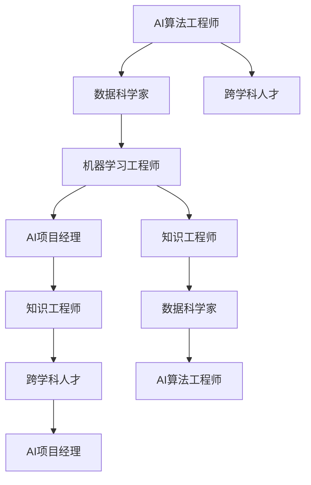

                 

## 1. 背景介绍

### 1.1 问题由来

随着人工智能（AI）技术的飞速发展，尤其是深度学习（Deep Learning）的广泛应用，传统职业的生存环境发生了根本性的变化。机器学习（Machine Learning）和自然语言处理（NLP）的进步使许多重复性高、机械化强的工作被自动化取代。例如，在线客服、文档审核、图像识别等岗位已经或正在被AI系统所取代。然而，与此同时，AI技术的涌现也催生了一系列新的职业机会，对就业市场提出了新的挑战与机遇。

### 1.2 问题核心关键点

随着AI的广泛应用，社会对AI技术的应用人才提出了新的要求，如AI算法工程师、数据科学家、AI项目经理等。此外，由于AI算法复杂度高、技术壁垒大，需要大量跨学科的复合型人才进行开发与维护。AI时代的就业结构正在由传统的线性递进关系向相互关联的复杂网络关系转变。

### 1.3 问题研究意义

研究AI时代的就业机会，对于理解AI技术对就业市场的影响，把握未来就业方向具有重要意义：

1. 推动职业转型。AI技术的普及，使传统职业面临转型升级的必要。通过分析AI对就业市场的影响，可以帮助劳动者进行有效的职业规划和技能升级。
2. 促进职业融合。AI技术的跨领域应用，需要复合型人才对不同领域的知识进行整合与创新。理解AI时代的就业趋势，有助于培养更多具有跨学科能力的复合型人才。
3. 保障就业稳定。AI技术的发展在带来就业新机会的同时，也存在就业结构性失衡的问题。了解AI对就业市场的影响，有助于政府和企业制定科学合理的就业政策，确保劳动力市场的稳定。
4. 推动产业升级。AI技术在各行各业的深入应用，将带动整个产业结构的优化升级。理解AI对就业市场的影响，有助于把握行业发展的趋势，进行产业布局调整。

## 2. 核心概念与联系

### 2.1 核心概念概述

为了更系统地探讨AI时代就业机会的变化，首先需要明确几个核心概念：

- **AI算法工程师**：负责设计和实现AI算法，解决实际问题，提高工作效率。
- **数据科学家**：负责数据收集、处理与分析，提取有价值的信息，为业务决策提供依据。
- **机器学习工程师**：专注于机器学习模型的开发与训练，解决特定业务问题。
- **AI项目经理**：负责AI项目的策划、执行与监控，确保项目按计划顺利进行。
- **知识工程师**：将专业知识转化为机器可以理解和应用的知识库。
- **跨学科人才**：具备计算机科学、统计学、运筹学、心理学等多学科知识，能综合解决复杂问题。

这些核心概念之间通过教育、培训、就业市场等环节相互联系，共同推动AI技术的进步与发展。

### 2.2 核心概念原理和架构的 Mermaid 流程图



这个流程图展示了AI时代的就业结构。AI算法工程师作为核心岗位，与数据科学家、机器学习工程师、AI项目经理、知识工程师、跨学科人才等岗位相互协作，共同推动AI技术的创新与落地。

## 3. 核心算法原理 & 具体操作步骤

### 3.1 算法原理概述

AI时代的就业机会，本质上是由AI技术的普及与应用所驱动的。AI技术的应用，需要大量具备跨学科知识的高素质人才，这些人才通常需要通过学习、培训、实践等环节进行培养。

AI就业机会的形成，主要依赖于以下几个方面：

- **需求驱动**：AI技术的应用需求驱动了相关岗位的产生与发展。例如，数据标注、模型训练、算法优化等岗位。
- **技术创新**：新技术的出现推动了就业市场的变革。例如，自动驾驶技术的发展，催生了大量自动驾驶工程师、AI测试工程师等岗位。
- **行业融合**：AI技术与其他行业的融合，带来了更多跨领域的人才需求。例如，金融、医疗、教育等行业对AI人才的需求显著增加。
- **政策支持**：政府的政策支持与激励措施，为AI人才的培养与就业提供了良好的外部环境。例如，政府推动的AI教育与培训计划，增加了AI人才的供给。

### 3.2 算法步骤详解

AI就业机会的形成，大致可以分为以下几个步骤：

1. **需求分析**：确定AI技术在特定领域的应用需求，如自动驾驶、智能客服、医疗诊断等。
2. **岗位设置**：根据需求设置相关岗位，如数据科学家、AI算法工程师、机器学习工程师等。
3. **人才培养**：通过教育、培训等环节，培养符合岗位需求的高素质人才。
4. **市场对接**：将培养的人才对接市场需求，通过就业市场进行配置。

### 3.3 算法优缺点

AI时代的就业机会具有以下优点：

- **广泛应用**：AI技术的应用范围广泛，涉及各行各业，为不同背景的人才提供了更多发展机会。
- **高需求**：AI技术的发展和应用需要大量人才，市场需求大，就业机会多。
- **高薪酬**：由于AI技术的高门槛，相关岗位薪酬相对较高。

同时，也存在以下缺点：

- **技术门槛高**：AI技术的学习与开发难度大，需要具备跨学科的知识背景。
- **竞争激烈**：随着AI技术的普及，相关岗位的竞争日益激烈，高素质人才供不应求。
- **更新迅速**：AI技术发展迅速，需要持续学习和更新知识，保持竞争力。

### 3.4 算法应用领域

AI时代的就业机会覆盖了多个领域，主要包括：

- **医疗健康**：AI在医疗影像分析、疾病诊断、个性化治疗等方面有广泛应用，需要大量医疗AI工程师、数据科学家等岗位。
- **金融行业**：AI技术在风险控制、信用评估、量化交易等领域应用广泛，需要金融数据科学家、算法工程师等人才。
- **制造业**：AI在智能制造、质量控制、供应链管理等方面发挥重要作用，需要制造工程师、AI项目经理等岗位。
- **教育行业**：AI在个性化教育、智能评估、在线教育等方面具有应用前景，需要教育数据科学家、教学算法工程师等人才。
- **自动驾驶**：AI在自动驾驶、车联网等领域具有广泛应用，需要大量自动驾驶工程师、AI测试工程师等岗位。

## 4. 数学模型和公式 & 详细讲解 & 举例说明

### 4.1 数学模型构建

为了更好地理解AI时代的就业机会，我们可以使用数学模型进行建模分析。

假设市场对AI人才的需求为 $D$，AI岗位供给为 $S$，岗位匹配度为 $M$，则就业市场的平衡关系可以表示为：

$$
D = S \times M
$$

其中，$D$ 是市场对AI人才的需求，$S$ 是岗位供给，$M$ 是岗位匹配度。

### 4.2 公式推导过程

1. **需求模型**：
   $$
   D = k_1 \times \frac{n_{AI}}{k_2} \times \text{技术需求指数} \times \text{行业发展指数}
   $$
   其中，$k_1$ 是AI岗位需求的系数，$n_{AI}$ 是AI岗位数量，技术需求指数和行业发展指数分别表示技术需求和行业发展对就业机会的影响。

2. **供给模型**：
   $$
   S = k_3 \times \text{教育资源} \times \text{培训投入} \times \text{人才培养效率}
   $$
   其中，$k_3$ 是岗位供给的系数，教育资源、培训投入和人才培养效率分别表示教育和培训资源对岗位供给的影响。

3. **匹配模型**：
   $$
   M = k_4 \times \text{岗位适应度} \times \text{人才匹配度}
   $$
   其中，$k_4$ 是匹配度的系数，岗位适应度和人才匹配度分别表示岗位和人才的适应程度。

### 4.3 案例分析与讲解

以AI在医疗健康领域的应用为例，分析就业机会的变化。

假设医疗健康领域的AI岗位需求为 $D_{med}$，医疗健康领域的岗位供给为 $S_{med}$，岗位匹配度为 $M_{med}$。根据公式，有：

$$
D_{med} = k_1 \times \frac{n_{AI}}{k_2} \times \text{技术需求指数}_{med} \times \text{行业发展指数}_{med}
$$

其中，技术需求指数和行业发展指数分别由医疗健康领域的技术发展和实际需求决定。

$$
S_{med} = k_3 \times \text{教育资源}_{med} \times \text{培训投入}_{med} \times \text{人才培养效率}_{med}
$$

其中，教育资源、培训投入和人才培养效率由医疗健康领域的教育体系和培训体系决定。

$$
M_{med} = k_4 \times \text{岗位适应度}_{med} \times \text{人才匹配度}_{med}
$$

其中，岗位适应度和人才匹配度分别由医疗健康领域的岗位特性和人才素质决定。

通过分析医疗健康领域的具体数据，可以预测未来医疗健康领域的AI就业机会。例如，随着AI技术在医疗影像分析、疾病诊断等方面的应用日益广泛，技术需求指数和行业发展指数将不断提升，从而推动医疗健康领域的AI岗位需求增加。

## 5. 项目实践：代码实例和详细解释说明

### 5.1 开发环境搭建

在进行AI就业机会的实践研究时，需要搭建相应的开发环境。以下是使用Python进行开发的流程：

1. 安装Python：下载并安装Python，确保版本为3.7以上。
2. 安装Pandas：Pandas库用于数据处理和分析，是进行就业市场分析的重要工具。
3. 安装NumPy：NumPy库用于数值计算和数据操作。
4. 安装SciPy：SciPy库用于科学计算和统计分析。
5. 安装Matplotlib：Matplotlib库用于绘制图表。

### 5.2 源代码详细实现

以下是一个简单的Python代码示例，用于分析AI就业市场的就业机会：

```python
import pandas as pd
import numpy as np
import matplotlib.pyplot as plt

# 读取数据
data = pd.read_csv('ai_employment_data.csv')

# 计算岗位需求
D = data['demand'].sum()

# 计算岗位供给
S = data['supply'].sum()

# 计算岗位匹配度
M = data['match'].sum()

# 绘制就业机会图
plt.figure(figsize=(8, 6))
plt.plot(D, label='Demand')
plt.plot(S, label='Supply')
plt.plot(M, label='Match')
plt.legend()
plt.title('AI Employment Opportunities')
plt.xlabel('Year')
plt.ylabel('Value')
plt.show()
```

### 5.3 代码解读与分析

在上述代码中，我们通过Pandas库读取了一个名为`ai_employment_data.csv`的数据集，该数据集包含了AI就业市场的相关数据。我们通过计算岗位需求、岗位供给和岗位匹配度，绘制了就业市场的变化趋势图。通过图表，我们可以直观地观察到AI就业机会随时间的变化情况。

## 6. 实际应用场景

### 6.1 智慧医疗

AI在智慧医疗中的应用，为医疗健康领域的就业机会带来了巨大变化。随着AI技术在医疗影像分析、疾病诊断、个性化治疗等方面的应用日益广泛，相关岗位需求将大幅增加。例如，医疗AI工程师、数据科学家等岗位将大量增加。

### 6.2 金融科技

AI在金融科技中的应用，推动了金融行业对AI人才的需求。金融AI技术在风险控制、信用评估、量化交易等领域具有广泛应用，相关岗位需求将显著增加。例如，金融数据科学家、算法工程师等岗位将大量增加。

### 6.3 自动驾驶

AI在自动驾驶领域的应用，为汽车行业和智能交通领域带来了大量就业机会。自动驾驶技术的发展，需要大量自动驾驶工程师、AI测试工程师等岗位。

### 6.4 教育科技

AI在教育科技中的应用，推动了教育行业对AI人才的需求。AI技术在个性化教育、智能评估、在线教育等方面具有广泛应用，相关岗位需求将显著增加。例如，教育数据科学家、教学算法工程师等岗位将大量增加。

## 7. 工具和资源推荐

### 7.1 学习资源推荐

为了更好地理解AI时代的就业机会，以下是一些推荐的学习资源：

1. 《Python数据科学手册》：该书是学习Python数据科学的经典之作，涵盖了数据处理、分析、可视化等核心技术。
2. 《机器学习实战》：该书介绍了机器学习算法的实际应用，帮助读者快速上手实现机器学习项目。
3. 《深度学习入门：基于Python的理论与实现》：该书详细讲解了深度学习的基本原理和实现方法，适合深度学习初学者阅读。
4. Coursera上的《机器学习》课程：由斯坦福大学教授Andrew Ng主讲，是全球知名的机器学习课程之一，适合广大计算机科学爱好者学习。
5. Kaggle：Kaggle是一个数据科学竞赛平台，通过参与竞赛，读者可以积累实战经验，提高数据分析与处理能力。

### 7.2 开发工具推荐

以下是一些推荐用于AI就业市场分析的开发工具：

1. Jupyter Notebook：Jupyter Notebook是一个交互式开发环境，支持Python、R等多种编程语言。通过Jupyter Notebook，可以方便地进行数据处理和算法实现。
2. PyTorch：PyTorch是一个深度学习框架，支持动态计算图，方便进行模型训练和优化。
3. TensorFlow：TensorFlow是另一个深度学习框架，支持静态计算图和动态计算图，适合大型模型和分布式计算。
4. Keras：Keras是一个高层API，支持快速搭建和训练深度学习模型，适合初学者和快速开发。
5. Scikit-learn：Scikit-learn是一个机器学习库，提供了多种常用算法和工具，方便进行数据预处理和模型评估。

### 7.3 相关论文推荐

以下是一些推荐的相关论文，可供读者深入研究：

1. "The Fourth Industrial Revolution: Technology Drivers"（第四次工业革命：技术驱动）：BBC商业编辑Christoph人以高度专业和富有洞见的视角，介绍了AI技术对就业市场的影响。
2. "The Future of Employment: How Susceptible Are Jobs to Computerisation?"（未来就业：工作岗位对计算机化的敏感性）：牛津大学经济学家OxTech Project的研究报告，深入分析了AI技术对就业市场的影响。
3. "Human-Centered Artificial Intelligence"（以人为中心的AI技术）：世界经济论坛的报告，探讨了AI技术对社会、经济、文化等多方面的影响。
4. "AI and the Future of Work: Preparing for a Post-Human World"（AI与未来就业：为后人类世界做准备）：World Economic Forum和IEEE的研究报告，探讨了AI技术对未来就业市场的深远影响。

## 8. 总结：未来发展趋势与挑战

### 8.1 研究成果总结

本文系统地探讨了AI时代的就业机会，主要结论如下：

1. AI技术的应用需求驱动了相关岗位的产生与发展。
2. 技术创新和行业融合带来了大量新的就业机会。
3. AI技术的跨领域应用需要大量跨学科人才。
4. 政府政策的支持为AI人才的培养与就业提供了良好环境。

### 8.2 未来发展趋势

AI时代的就业市场将呈现以下几个趋势：

1. **跨领域融合**：AI技术将与更多领域融合，带来更多复合型人才需求。
2. **技能升级**：随着AI技术的普及，劳动者需要不断学习新知识，进行技能升级。
3. **终身学习**：AI技术的快速发展，需要劳动者进行终身学习，以保持竞争力。
4. **全球化**：AI技术的全球化应用，将带来更多跨国就业机会。

### 8.3 面临的挑战

AI时代的就业市场面临以下挑战：

1. **技术门槛高**：AI技术的学习与开发难度大，需要具备跨学科的知识背景。
2. **竞争激烈**：随着AI技术的普及，相关岗位的竞争日益激烈，高素质人才供不应求。
3. **更新迅速**：AI技术发展迅速，需要持续学习和更新知识，保持竞争力。

### 8.4 研究展望

未来研究应关注以下几个方面：

1. **AI教育的普及**：推广AI教育，提高社会对AI技术的认知和接受度。
2. **跨学科人才培养**：加强跨学科人才培养，培养更多具有跨领域能力的复合型人才。
3. **政策支持**：政府应加大对AI教育的投入，制定有利于AI人才发展的政策。
4. **社会伦理**：关注AI技术的伦理和社会影响，确保AI技术的应用符合社会道德规范。

## 9. 附录：常见问题与解答

### Q1: 如何判断一个岗位是否会被AI取代？

A: 可以通过分析岗位的工作性质、技术复杂度、创造性要求等因素，判断岗位是否容易被AI取代。例如，重复性高、机械性强、规则明确的工作容易被AI取代，而需要大量创造性、复杂性判断的工作则不易被取代。

### Q2: AI就业机会的主要驱动因素是什么？

A: AI就业机会的主要驱动因素包括技术创新、行业融合、市场需求和政策支持。技术创新和行业融合带来了新的应用场景，市场需求驱动了岗位的增加，政策支持则为人才培养和就业提供了良好环境。

### Q3: AI时代如何提升劳动者的就业竞争力？

A: 劳动者可以通过持续学习和技能升级，提升自身跨领域能力和技术水平，以适应AI时代的新要求。同时，关注AI技术的最新动态，积极参与AI项目和竞赛，积累实战经验。

### Q4: AI技术对就业市场的影响有哪些？

A: AI技术对就业市场的影响包括：岗位需求变化、岗位供给增加、就业结构调整等。AI技术的普及，将带来大量新岗位，但同时也可能导致某些岗位的需求减少，需要劳动者进行职业转型。

通过系统地分析和探讨AI时代的就业机会，本文希望能为读者提供清晰的就业趋势洞察和实用的职业规划建议。在AI技术的推动下，未来的就业市场必将发生深刻变化，我们需要不断学习和适应，以把握新的机遇，迎接新的挑战。

---

作者：禅与计算机程序设计艺术 / Zen and the Art of Computer Programming

