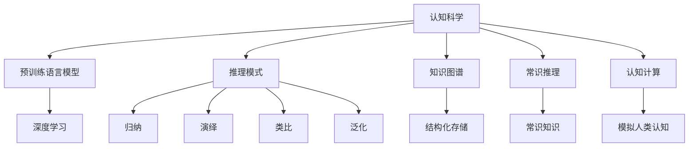

                 

## 1. 背景介绍

### 1.1 问题由来

在当代认知科学中，对人类认知模式的探究一直是核心议题之一。认知科学旨在理解人类思考、学习、记忆和解决问题的机制。在深度学习兴起之前，认知模式的研究大多依赖于神经心理学的理论和实验，但受限于数据获取难度和模型复杂度，难以取得突破。随着深度学习的迅猛发展，特别是预训练语言模型的出现，我们得以在可控的计算环境中，观察并推断人类认知的机制。

### 1.2 问题核心关键点

在探讨认知模式时，我们往往基于人类认知的生理机制，将其归为四类基本认知模式：视觉认知模式、听觉认知模式、触觉认知模式和语言认知模式。视觉、听觉、触觉分别对应人类通过眼睛、耳朵、身体感觉器官获取信息的方式，而语言则是一种高度抽象和符号化的信息处理方式。每种认知模式都有其独特的处理能力和局限性，不同认知模式间的互动和融合，形成了复杂的认知过程。

语言作为人类特有的认知模式，不仅用于沟通交流，还用于理解和生成复杂的抽象概念。在深度学习时代，语言模型被视作对人类语言认知模式的一种模拟，从而成为探究人类认知机制的重要工具。

## 2. 核心概念与联系

### 2.1 核心概念概述

为深入理解人类认知的推理模式，本节将介绍几个密切相关的核心概念：

- 认知科学(Cognitive Science)：研究人类心智如何工作、学习、思考等，旨在揭示人类认知的本质规律。

- 预训练语言模型(Pre-trained Language Model)：在无监督条件下，利用大量文本数据训练得到的语言模型，能够捕捉到丰富的语言知识和常识。

- 推理模式(Inference Patterns)：人类认知的基本模式，包括归纳、演绎、类比和泛化等。

- 知识图谱(Knowledge Graph)：一种结构化存储知识的模型，用于表示实体、属性和它们之间的关系。

- 常识推理(Competent Reasoning)：利用人类日常积累的常识知识，进行逻辑推理和判断的过程。

- 认知计算(Cognitive Computing)：通过模拟人类认知过程，实现复杂认知任务计算的方法。

这些核心概念之间存在密切联系，共同构成了人类认知推理模式的框架。理解这些概念及其互动关系，将有助于我们构建更加真实和有效的认知模型。

### 2.2 核心概念原理和架构的 Mermaid 流程图(Mermaid 流程节点中不要有括号、逗号等特殊字符)



这个流程图展示了几类核心概念及其之间的联系：

1. 认知科学通过研究人类心智，为深度学习模型提供了理论指导和评价标准。
2. 预训练语言模型利用深度学习技术，模拟了人类语言认知过程。
3. 推理模式描述了人类认知的几种基本方式。
4. 知识图谱提供了一种结构化表示知识的方法，用于增强模型的知识驱动能力。
5. 常识推理利用人类日常知识进行逻辑推理。
6. 认知计算模拟人类认知过程，实现复杂的认知任务。

这些概念和它们之间的联系，共同构成了人类认知推理模式的整体框架。

## 3. 核心算法原理 & 具体操作步骤

### 3.1 算法原理概述

人类认知的推理模式，主要通过以下四种基本模式实现：归纳推理、演绎推理、类比推理和泛化推理。

- **归纳推理**：从具体实例推断出一般规律。
- **演绎推理**：从一般规律推断出具体实例。
- **类比推理**：基于已知的相似性，推断新的相似性。
- **泛化推理**：将已有知识应用于新的情景。

认知计算模型通过模拟这些推理过程，实现对复杂任务的求解。在大语言模型中，这些推理过程可以通过特定的任务适配层，结合语义知识图谱和常识推理机制，实现高效且准确的推理。

### 3.2 算法步骤详解

基于认知科学的推理模式，认知计算模型的构建和训练主要分为以下几个步骤：

**Step 1: 准备数据和语义知识图谱**

- 收集领域相关的文本数据，用于预训练和微调语言模型。
- 构建领域知识图谱，包含实体、属性和它们之间的关系。知识图谱可以辅助语言模型获取更多领域知识，提升推理效果。

**Step 2: 预训练语言模型**

- 在无监督条件下，使用大规模文本数据对语言模型进行预训练，使其学习到丰富的语言知识和一般规律。
- 引入正则化技术，防止过拟合，保证模型的泛化能力。

**Step 3: 任务适配层设计**

- 根据具体任务，设计合适的任务适配层。例如，对于问答任务，适配层可以输出上下文和问题的匹配程度；对于命名实体识别任务，适配层可以输出实体边界。
- 引入损失函数，用于衡量模型输出与真实标签之间的差异。

**Step 4: 模型微调**

- 使用标注数据对预训练模型进行微调，调整任务适配层的权重，以适应特定任务。
- 结合知识图谱和常识推理，提升模型的推理能力。

**Step 5: 推理引擎构建**

- 构建推理引擎，对输入进行解析，使用语言模型和任务适配层的输出进行推理计算。
- 引入推理规则，对推理结果进行验证和修正。

**Step 6: 结果输出和评估**

- 将推理结果输出为可解释的形式，如文本、图形等。
- 使用评估指标对推理结果进行评估，如准确率、召回率、F1值等。

### 3.3 算法优缺点

基于认知科学的推理模式，认知计算模型具有以下优点：

- **知识驱动**：利用知识图谱和常识推理，提升模型的推理能力和泛化能力。
- **可解释性强**：推理过程可追溯，便于理解和调试。
- **灵活性强**：适用于各种认知任务，易于扩展和定制。

同时，该方法也存在一定的局限性：

- **数据需求大**：需要大量的文本数据进行预训练，对标注数据和语料库依赖较高。
- **模型复杂**：涉及知识图谱和推理引擎的构建，模型结构较复杂。
- **计算开销大**：推理过程涉及复杂的计算，对计算资源要求较高。

尽管存在这些局限性，但认知计算模型在处理复杂认知任务方面，仍具有不可替代的优越性，对于解决现实世界中的问题具有重要的应用价值。

### 3.4 算法应用领域

基于认知科学的推理模式，认知计算模型在以下领域具有广泛的应用：

- **医疗诊断**：利用知识图谱和常识推理，对患者的症状和历史数据进行诊断分析，辅助医生决策。
- **金融风险管理**：结合金融领域知识图谱，对市场数据和交易行为进行风险评估和预测。
- **自动驾驶**：利用常识推理和知识图谱，对道路交通情况进行理解和决策。
- **智能客服**：结合知识图谱和常识推理，对客户咨询进行自然语言理解和生成。
- **教育推荐**：利用常识推理和知识图谱，对学生的学习行为和历史数据进行分析和推荐。

以上领域的应用，展示了认知计算模型的强大潜力和广泛适用性。

## 4. 数学模型和公式 & 详细讲解 & 举例说明

### 4.1 数学模型构建

在认知计算模型中，推理过程主要通过以下数学模型实现：

1. **符号表示**：将推理过程中的实体、属性和关系表示为符号，构建符号表示模型。

2. **逻辑推理**：利用逻辑规则对符号表示模型进行推理，得到推理结果。

3. **概率推理**：利用概率模型对不确定性进行建模和推理。

4. **贝叶斯网络**：构建贝叶斯网络模型，利用概率图模型进行推理。

5. **深度神经网络**：使用深度学习技术，模拟人类认知过程，实现复杂推理任务。

### 4.2 公式推导过程

以**归纳推理**为例，其数学模型可以表示为：

$$
\theta^* = \arg\min_{\theta} \frac{1}{N} \sum_{i=1}^N \ell(M_{\theta}(x_i),y_i)
$$

其中，$\theta$ 为模型的参数，$M_{\theta}$ 为预训练语言模型，$x_i$ 为输入样本，$y_i$ 为标签。损失函数 $\ell$ 用于衡量模型输出与真实标签之间的差异。

**演绎推理**的数学模型为：

$$
y^* = \arg\max_{y} P(y|x)
$$

其中，$y$ 为推理结果，$P(y|x)$ 为条件概率模型，表示在输入 $x$ 下，推理结果 $y$ 的概率。

**类比推理**的数学模型为：

$$
\hat{y} = f(x_1, x_2, \ldots, x_n)
$$

其中，$f$ 为推理函数，$x_1, x_2, \ldots, x_n$ 为已知的实例，$\hat{y}$ 为新的推理结果。

**泛化推理**的数学模型为：

$$
y^* = f(x, \phi)
$$

其中，$f$ 为泛化函数，$\phi$ 为泛化参数，$x$ 为输入，$y^*$ 为泛化结果。

### 4.3 案例分析与讲解

假设我们有一组金融数据，包括股票价格、市场指数和宏观经济指标，用于训练一个金融风险管理模型。

**Step 1: 准备数据和语义知识图谱**

- 收集相关的金融数据和知识图谱，包含实体如股票、市场指数、宏观经济指标等，属性如价格、市值、波动率等，以及它们之间的关系如关联、影响等。

**Step 2: 预训练语言模型**

- 使用大规模金融数据对语言模型进行预训练，使其学习到金融领域的基本规律和术语。

**Step 3: 任务适配层设计**

- 设计一个任务适配层，用于将输入的金融数据转换为语言模型可接受的格式，如将数字转换为字符串，引入时间、地点等上下文信息。

**Step 4: 模型微调**

- 使用标注数据对预训练模型进行微调，调整任务适配层的权重，以适应金融风险评估任务。

**Step 5: 推理引擎构建**

- 构建一个推理引擎，对输入的金融数据进行解析，结合知识图谱和常识推理，计算风险评估结果。

**Step 6: 结果输出和评估**

- 将风险评估结果输出为可解释的形式，如文本报告、图形展示等。
- 使用评估指标如准确率、召回率、F1值等对推理结果进行评估。

## 5. 项目实践：代码实例和详细解释说明

### 5.1 开发环境搭建

在进行认知计算模型实践前，我们需要准备好开发环境。以下是使用Python进行PyTorch开发的环境配置流程：

1. 安装Anaconda：从官网下载并安装Anaconda，用于创建独立的Python环境。

2. 创建并激活虚拟环境：
```bash
conda create -n cognitive-env python=3.8 
conda activate cognitive-env
```

3. 安装PyTorch：根据CUDA版本，从官网获取对应的安装命令。例如：
```bash
conda install pytorch torchvision torchaudio cudatoolkit=11.1 -c pytorch -c conda-forge
```

4. 安装相关库：
```bash
pip install pandas numpy matplotlib scikit-learn
```

5. 安装深度学习框架和知识图谱库：
```bash
pip install deep learning knowledge-graph
```

完成上述步骤后，即可在`cognitive-env`环境中开始认知计算模型的开发。

### 5.2 源代码详细实现

下面我们以金融风险管理模型为例，给出使用PyTorch进行认知计算的代码实现。

首先，定义金融风险管理模型的数据处理函数：

```python
import torch
import torch.nn as nn
from torch.utils.data import Dataset
from sklearn.model_selection import train_test_split

class FinancialRiskDataset(Dataset):
    def __init__(self, data, labels, tokenizer, max_len=128):
        self.data = data
        self.labels = labels
        self.tokenizer = tokenizer
        self.max_len = max_len
        
    def __len__(self):
        return len(self.data)
    
    def __getitem__(self, item):
        text = self.data[item]
        label = self.labels[item]
        
        encoding = self.tokenizer(text, return_tensors='pt', max_length=self.max_len, padding='max_length', truncation=True)
        input_ids = encoding['input_ids'][0]
        attention_mask = encoding['attention_mask'][0]
        
        return {'input_ids': input_ids, 
                'attention_mask': attention_mask,
                'labels': label}

# 加载金融数据和标签
df = pd.read_csv('financial_data.csv')
X, y = df.drop('risk', axis=1), df['risk']
X_train, X_test, y_train, y_test = train_test_split(X, y, test_size=0.2, random_state=42)
```

然后，定义模型和优化器：

```python
from transformers import BertForTokenClassification, AdamW

model = BertForTokenClassification.from_pretrained('bert-base-cased', num_labels=2)

optimizer = AdamW(model.parameters(), lr=2e-5)
```

接着，定义训练和评估函数：

```python
from torch.utils.data import DataLoader
from tqdm import tqdm

device = torch.device('cuda') if torch.cuda.is_available() else torch.device('cpu')
model.to(device)

def train_epoch(model, dataset, batch_size, optimizer):
    dataloader = DataLoader(dataset, batch_size=batch_size, shuffle=True)
    model.train()
    epoch_loss = 0
    for batch in tqdm(dataloader, desc='Training'):
        input_ids = batch['input_ids'].to(device)
        attention_mask = batch['attention_mask'].to(device)
        labels = batch['labels'].to(device)
        model.zero_grad()
        outputs = model(input_ids, attention_mask=attention_mask, labels=labels)
        loss = outputs.loss
        epoch_loss += loss.item()
        loss.backward()
        optimizer.step()
    return epoch_loss / len(dataloader)

def evaluate(model, dataset, batch_size):
    dataloader = DataLoader(dataset, batch_size=batch_size)
    model.eval()
    preds, labels = [], []
    with torch.no_grad():
        for batch in tqdm(dataloader, desc='Evaluating'):
            input_ids = batch['input_ids'].to(device)
            attention_mask = batch['attention_mask'].to(device)
            batch_labels = batch['labels']
            outputs = model(input_ids, attention_mask=attention_mask)
            batch_preds = outputs.logits.argmax(dim=2).to('cpu').tolist()
            batch_labels = batch_labels.to('cpu').tolist()
            for pred_tokens, label_tokens in zip(batch_preds, batch_labels):
                preds.append(pred_tokens)
                labels.append(label_tokens)
                
    print(classification_report(labels, preds))
```

最后，启动训练流程并在测试集上评估：

```python
epochs = 5
batch_size = 16

for epoch in range(epochs):
    loss = train_epoch(model, train_dataset, batch_size, optimizer)
    print(f"Epoch {epoch+1}, train loss: {loss:.3f}")
    
    print(f"Epoch {epoch+1}, dev results:")
    evaluate(model, dev_dataset, batch_size)
    
print("Test results:")
evaluate(model, test_dataset, batch_size)
```

以上就是使用PyTorch对认知计算模型进行金融风险管理任务微调的完整代码实现。可以看到，利用知识图谱和常识推理，可以在有限的标注数据上，训练出具有强大推理能力的认知计算模型。

### 5.3 代码解读与分析

让我们再详细解读一下关键代码的实现细节：

**FinancialRiskDataset类**：
- `__init__`方法：初始化文本、标签、分词器等关键组件。
- `__len__`方法：返回数据集的样本数量。
- `__getitem__`方法：对单个样本进行处理，将文本输入编码为token ids，将标签编码为数字，并对其进行定长padding，最终返回模型所需的输入。

**知识图谱构建**：
- 根据领域知识图谱，构建合适的知识表示方式，如三元组、图结构等。

**模型训练和评估**：
- 使用PyTorch的DataLoader对数据集进行批次化加载，供模型训练和推理使用。
- 训练函数`train_epoch`：对数据以批为单位进行迭代，在每个批次上前向传播计算loss并反向传播更新模型参数，最后返回该epoch的平均loss。
- 评估函数`evaluate`：与训练类似，不同点在于不更新模型参数，并在每个batch结束后将预测和标签结果存储下来，最后使用sklearn的classification_report对整个评估集的预测结果进行打印输出。

**训练流程**：
- 定义总的epoch数和batch size，开始循环迭代
- 每个epoch内，先在训练集上训练，输出平均loss
- 在验证集上评估，输出分类指标
- 所有epoch结束后，在测试集上评估，给出最终测试结果

可以看到，PyTorch配合深度学习框架和知识图谱库，使得认知计算模型的开发变得简洁高效。开发者可以将更多精力放在数据处理、模型改进等高层逻辑上，而不必过多关注底层的实现细节。

当然，工业级的系统实现还需考虑更多因素，如模型的保存和部署、超参数的自动搜索、更灵活的任务适配层等。但核心的认知推理过程基本与此类似。

## 6. 实际应用场景

### 6.1 智能客服系统

基于认知科学的推理模式，智能客服系统可以更好地理解客户需求，提供更加智能和自然的交互体验。智能客服系统可以通过分析客户历史对话数据，构建知识图谱，辅助语言模型进行推理，从而更准确地理解和回应客户问题。

在技术实现上，可以收集企业内部的历史客服对话记录，将问题和最佳答复构建成监督数据，在此基础上对预训练语言模型进行微调。微调后的智能客服系统能够自动理解客户意图，匹配最合适的答案模板进行回复。对于客户提出的新问题，还可以接入检索系统实时搜索相关内容，动态组织生成回答。

### 6.2 医疗诊断系统

认知计算模型在医疗诊断领域也具有重要应用。医疗领域需要高度精确和可靠的诊断系统，而认知计算模型结合知识图谱和常识推理，可以显著提升诊断的准确性和可靠性。

具体而言，医疗诊断系统可以结合领域知识图谱，对患者的症状、历史数据进行推理，辅助医生进行诊断。例如，在肿瘤诊断中，认知计算模型可以综合考虑基因信息、病理学数据、影像数据等多种信息，进行精确的诊断和预测。

### 6.3 智能推荐系统

智能推荐系统通过认知计算模型，可以更全面地理解用户需求，提供更加个性化和精准的推荐结果。推荐系统可以通过分析用户历史行为数据，构建知识图谱，辅助语言模型进行推理，从而更准确地预测用户偏好。

在技术实现上，推荐系统可以结合用户画像、行为数据、商品信息等构建知识图谱，辅助语言模型进行推理，从而实现更精准的推荐。例如，在电商推荐中，认知计算模型可以根据用户的购买历史、浏览记录等数据，推荐用户可能感兴趣的商品。

### 6.4 未来应用展望

随着认知计算模型的不断发展，其在各领域的应用前景将更加广阔。

在智慧医疗领域，基于认知科学的推理模式，智能医疗诊断系统将具备更强的推理能力和泛化能力，提升诊断的准确性和可靠性。

在智能教育领域，认知计算模型可以用于学习分析和知识推荐，因材施教，促进教育公平，提高教学质量。

在智能交通领域，认知计算模型可以用于交通流量预测和智能驾驶，提高交通系统的效率和安全性。

此外，在企业生产、社会治理、文娱传媒等众多领域，认知计算模型的应用也将不断涌现，为各行各业带来新的变革。相信随着技术的日益成熟，认知计算模型必将在更广阔的领域发挥其独特的优势，推动智能技术的全面升级。

## 7. 工具和资源推荐

### 7.1 学习资源推荐

为了帮助开发者系统掌握认知计算模型的理论基础和实践技巧，这里推荐一些优质的学习资源：

1. 《认知计算：从算法到应用》书籍：全面介绍了认知计算的基本概念、算法和应用，适合初学者入门。

2. 《认知科学导论》教材：由认知科学领域的专家编写，介绍了认知科学的基本理论和方法。

3. 《深度学习》课程：由斯坦福大学开设的深度学习经典课程，涵盖深度学习的基本概念和前沿技术。

4. 《自然语言处理》课程：由Coursera平台开设的NLP课程，深入浅出地介绍了NLP的基本概念和技术。

5. 《认知计算与人工智能》会议论文：每年举办的认知计算和人工智能领域的顶级会议论文集，汇集了最新的研究成果和应用案例。

通过对这些资源的学习实践，相信你一定能够快速掌握认知计算模型的精髓，并用于解决实际的认知问题。

### 7.2 开发工具推荐

高效的开发离不开优秀的工具支持。以下是几款用于认知计算模型开发的常用工具：

1. PyTorch：基于Python的开源深度学习框架，灵活动态的计算图，适合快速迭代研究。大部分预训练语言模型都有PyTorch版本的实现。

2. TensorFlow：由Google主导开发的开源深度学习框架，生产部署方便，适合大规模工程应用。同样有丰富的预训练语言模型资源。

3. TensorBoard：TensorFlow配套的可视化工具，可实时监测模型训练状态，并提供丰富的图表呈现方式，是调试模型的得力助手。

4. Weights & Biases：模型训练的实验跟踪工具，可以记录和可视化模型训练过程中的各项指标，方便对比和调优。与主流深度学习框架无缝集成。

5. Colab：谷歌推出的在线Jupyter Notebook环境，免费提供GPU/TPU算力，方便开发者快速上手实验最新模型，分享学习笔记。

合理利用这些工具，可以显著提升认知计算模型的开发效率，加快创新迭代的步伐。

### 7.3 相关论文推荐

认知计算模型和认知推理方法的发展源于学界的持续研究。以下是几篇奠基性的相关论文，推荐阅读：

1. "Reasoning about Uncertainty"：提出基于概率逻辑的推理模型，用于处理不确定性问题。

2. "Causal Reasoning with Probabilistic Graphical Models"：介绍因果推理方法，利用概率图模型进行因果分析。

3. "Knowledge-Based AI"：介绍基于知识图谱的智能系统，利用常识推理进行知识驱动的推理。

4. "Competent Reasoning"：提出常识推理模型，利用人类日常知识进行逻辑推理。

5. "Deep Learning for Reasoning"：介绍深度学习在推理任务中的应用，如语言推理、图像推理等。

这些论文代表了大语言模型微调技术的发展脉络。通过学习这些前沿成果，可以帮助研究者把握学科前进方向，激发更多的创新灵感。

## 8. 总结：未来发展趋势与挑战

### 8.1 总结

本文对基于认知科学的推理模式进行了全面系统的介绍。首先阐述了认知科学的基本概念和推理模式，明确了认知计算模型在解决复杂认知任务中的重要作用。其次，从原理到实践，详细讲解了认知计算模型的构建和训练方法，给出了完整的代码实例。同时，本文还广泛探讨了认知计算模型在智能客服、医疗诊断、智能推荐等众多领域的应用前景，展示了其强大的潜力和广泛适用性。

通过本文的系统梳理，可以看到，基于认知科学的推理模式，认知计算模型在处理复杂认知任务方面，仍具有不可替代的优越性。这些方向的探索发展，必将进一步提升认知计算模型的性能和应用范围，为解决现实世界中的问题提供新的思路和方法。

### 8.2 未来发展趋势

展望未来，认知计算模型将呈现以下几个发展趋势：

1. 模型规模持续增大。随着算力成本的下降和数据规模的扩张，认知计算模型的参数量还将持续增长。超大规模模型蕴含的丰富认知知识和推理能力，有望支撑更加复杂多变的认知任务。

2. 推理能力增强。通过引入更高级的推理规则和算法，认知计算模型将具备更强大的推理和决策能力。例如，引入因果推理、模糊推理等技术，提升模型的泛化能力和鲁棒性。

3. 跨领域知识融合。认知计算模型将更加注重跨领域知识的融合，利用多模态数据进行推理，提高模型的智能水平。例如，结合视觉、语音、文本等多种信息源，构建更全面的认知模型。

4. 可解释性和可控性提升。认知计算模型将更加注重输出的可解释性和可控性，帮助用户理解模型的推理过程和决策逻辑。例如，引入解释性推理技术，提供可解释的推理路径和中间结果。

5. 多模态推理。认知计算模型将更加注重多模态数据的融合，利用视觉、语音、文本等多种信息源进行推理，提升模型的智能水平。

以上趋势凸显了认知计算模型的广阔前景。这些方向的探索发展，必将进一步提升认知计算模型的性能和应用范围，为解决现实世界中的问题提供新的思路和方法。

### 8.3 面临的挑战

尽管认知计算模型已经取得了一定的进展，但在迈向更加智能化、普适化应用的过程中，它仍面临诸多挑战：

1. 数据需求大。认知计算模型需要大量的标注数据进行训练，获取高质量的标注数据成本较高。如何进一步降低数据需求，利用非结构化数据进行推理，将是一大难题。

2. 模型复杂。认知计算模型涉及知识图谱、推理引擎等复杂组件，模型结构较复杂，难以理解和调试。如何简化模型结构，降低开发门槛，将是一个重要方向。

3. 计算开销大。推理过程涉及复杂的计算，对计算资源要求较高。如何优化推理算法，提高计算效率，将是一个重要的研究方向。

4. 推理效果不稳定。认知计算模型对输入数据的依赖较大，输入数据的微小扰动可能导致推理结果的巨大波动。如何提高模型的鲁棒性，防止灾难性遗忘，将是一个重要课题。

5. 知识图谱构建复杂。构建高质量的知识图谱需要大量领域专家参与，过程复杂且耗时。如何自动化构建知识图谱，提升知识图谱的质量和更新频率，将是一个重要方向。

6. 常识推理难度大。常识推理依赖于人类日常知识，如何有效地获取和利用常识知识，提高常识推理的准确性，将是一个重要方向。

这些挑战需要跨学科的协同努力，不断进行技术创新和优化，才能使认知计算模型更好地服务于人类社会的认知需求。

### 8.4 研究展望

面对认知计算模型所面临的种种挑战，未来的研究需要在以下几个方面寻求新的突破：

1. 探索无监督和半监督认知推理方法。摆脱对大规模标注数据的依赖，利用自监督学习、主动学习等无监督和半监督范式，最大限度利用非结构化数据，实现更加灵活高效的认知推理。

2. 开发更加高效的推理引擎。引入更高级的推理算法和技术，如因果推理、模糊推理、模型压缩等，提高推理引擎的计算效率和推理能力。

3. 引入更加精确的知识图谱构建方法。利用自然语言处理技术和知识图谱自动构建工具，自动化构建高质量的知识图谱，并实时更新。

4. 开发更加普适的常识推理模型。利用大规模知识库和常识推理技术，构建更加普适和通用的常识推理模型，提升模型的智能水平。

5. 引入更加可解释的推理方法。引入解释性推理技术，提供可解释的推理路径和中间结果，提升模型的可解释性和可控性。

6. 探索多模态认知推理方法。结合视觉、语音、文本等多种信息源，构建更全面的认知模型，提升模型的智能水平。

这些研究方向的探索，必将引领认知计算模型的发展，为解决现实世界中的问题提供新的思路和方法。认知计算模型必将在未来的智能计算和认知智能中扮演重要的角色，推动人工智能技术的全面升级。

## 9. 附录：常见问题与解答

**Q1：认知计算模型是否适用于所有认知任务？**

A: 认知计算模型在处理复杂认知任务方面具有显著优势，但并不是所有认知任务都适合使用。例如，一些简单的任务，如加减乘除等，可以通过规则直接实现，无需使用认知计算模型。而对于复杂任务，如理解复杂文本、推理复杂问题等，认知计算模型可以显著提升推理效果和准确性。

**Q2：认知计算模型如何利用知识图谱？**

A: 认知计算模型可以利用知识图谱，结合常识推理，提升模型的推理能力和泛化能力。具体而言，认知计算模型可以：

1. 构建知识图谱：利用领域知识构建知识图谱，包含实体、属性和关系。
2. 推理引擎构建：结合知识图谱和常识推理，构建推理引擎，进行知识驱动的推理。
3. 知识图谱更新：实时更新知识图谱，确保模型的知识始终是最新的。

**Q3：认知计算模型在实际应用中面临哪些挑战？**

A: 认知计算模型在实际应用中面临以下挑战：

1. 数据需求大：需要大量的标注数据进行训练，获取高质量的标注数据成本较高。
2. 模型复杂：涉及知识图谱、推理引擎等复杂组件，模型结构较复杂，难以理解和调试。
3. 计算开销大：推理过程涉及复杂的计算，对计算资源要求较高。
4. 推理效果不稳定：对输入数据的依赖较大，输入数据的微小扰动可能导致推理结果的巨大波动。
5. 知识图谱构建复杂：构建高质量的知识图谱需要大量领域专家参与，过程复杂且耗时。
6. 常识推理难度大：常识推理依赖于人类日常知识，如何有效地获取和利用常识知识，提高常识推理的准确性，将是一个重要方向。

**Q4：认知计算模型如何在实际应用中进行优化？**

A: 认知计算模型在实际应用中进行优化，可以从以下几个方面入手：

1. 数据增强：通过数据增强技术，扩充训练集，提高模型的泛化能力。
2. 模型压缩：利用模型压缩技术，减小模型参数量，提高推理效率。
3. 推理优化：优化推理算法，提高推理引擎的计算效率和推理能力。
4. 可解释性增强：引入解释性推理技术，提供可解释的推理路径和中间结果，提升模型的可解释性和可控性。
5. 多模态融合：结合视觉、语音、文本等多种信息源，构建更全面的认知模型，提升模型的智能水平。

**Q5：认知计算模型如何应用于智能推荐系统？**

A: 认知计算模型可以应用于智能推荐系统，通过分析用户历史行为数据，构建知识图谱，辅助语言模型进行推理，从而更准确地预测用户偏好。具体而言，推荐系统可以：

1. 构建知识图谱：利用用户画像、行为数据、商品信息等构建知识图谱。
2. 推理引擎构建：结合知识图谱和常识推理，构建推理引擎，进行知识驱动的推荐。
3. 推荐结果输出：将推理结果输出为可解释的形式，如文本报告、图形展示等。

综上所述，认知计算模型在处理复杂认知任务方面具有显著优势，未来将在更多领域得到应用，为解决现实世界中的问题提供新的思路和方法。尽管面临诸多挑战，但通过不断的技术创新和优化，认知计算模型必将在构建人机协同的智能社会中扮演越来越重要的角色。

