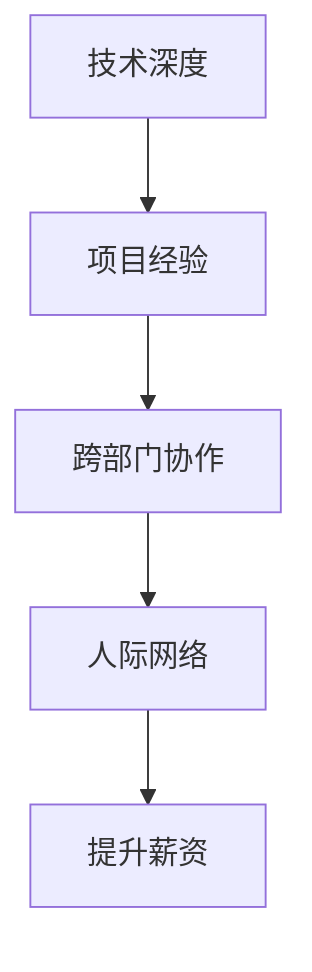

                 

# 从初级到高级：薪资提升攻略

在IT行业，薪资的提升不仅仅依赖于技术能力的增长，还与多方面因素有关。本文将围绕提升薪资的四个关键维度：**技术深度、项目经验、跨部门协作、人际网络**展开，提供从初级到高级的攻略，助你在职业道路上更进一步。

## 1. 背景介绍

### 1.1 问题由来
近年来，随着技术变革加速，IT行业呈现出快速发展的趋势。然而，技能快速迭代、职位要求提高等因素也使得技术从业者面临较大的职业发展压力。技术人员如何在激烈的竞争中脱颖而出，成为提升薪资的重要问题。

### 1.2 问题核心关键点
薪资提升涉及多个方面，技术能力是基础，项目经验是能力的外化表现，跨部门协作能力有助于技术能力的实际应用，而良好的人际网络则能带来更多的职业机会。本文将从这四个维度出发，提供系统的攻略。

## 2. 核心概念与联系

### 2.1 核心概念概述

为更好地理解薪资提升的策略，本节将介绍几个密切相关的核心概念：

- **技术深度**：技术深度的提升指的是在特定技术领域内，掌握更高级的技能和知识，包括但不限于编程语言、算法、架构设计等。
- **项目经验**：通过参与不同规模和复杂度的项目，积累实战经验，理解业务需求、流程管理和团队协作。
- **跨部门协作**：在多个部门或团队之间沟通协作，了解不同业务领域的知识，提升综合能力。
- **人际网络**：通过建立和维护职业关系网，获取更多的职业机会和资源支持。

这些概念之间的联系可以通过以下Mermaid流程图来展示：



这个流程图展示了技术提升的四个环节及其相互关系：

1. 技术深度是基础，影响项目经验的积累和跨部门协作的能力。
2. 项目经验能进一步提升技术深度，并在跨部门协作中发挥作用。
3. 跨部门协作能力增强了项目的成功率和创新性，进一步促进了技术深度的提升。
4. 人际网络为技术深度和项目经验提供了更多的展示和应用机会，有助于提升薪资。

## 3. 核心算法原理 & 具体操作步骤

### 3.1 算法原理概述

薪资提升的策略可以分为两个主要阶段：首先是技术积累与提升，其次是应用与扩展。其中，技术深度提升是基础，项目经验积累是检验和应用，跨部门协作拓展技术和应用场景，人际网络为技术能力提供更多的展示机会。

### 3.2 算法步骤详解

#### 3.2.1 技术深度提升
- **深入学习**：选择一门新技术，从基础原理开始深入学习，如深入了解机器学习算法、数据结构等。
- **实战练习**：通过实际项目或开源项目，将理论知识应用于实践，提升解决问题的能力。
- **持续学习**：关注技术前沿和趋势，通过阅读论文、参加技术会议等方式保持技术领先。

#### 3.2.2 项目经验积累
- **选择项目**：根据自己的技术兴趣和公司需求，选择适合的跨部门项目，如开发产品、参与架构设计等。
- **任务分配**：在项目中承担不同角色和任务，如需求分析、编码实现、测试等，全面了解项目流程。
- **反馈改进**：通过项目经理和同事的反馈，不断优化自己的工作方式和技术实现。

#### 3.2.3 跨部门协作
- **沟通技巧**：提升沟通和协调能力，明确项目目标和职责分工，高效推动项目进展。
- **业务理解**：了解不同业务领域的知识，如市场、运营、产品等，提升综合能力。
- **协作工具**：熟练使用协作工具如JIRA、Slack等，提高团队协作效率。

#### 3.2.4 人际网络拓展
- **主动交流**：参加公司内部和外部的技术交流活动，与同事和业界专家建立联系。
- **社交媒体**：利用LinkedIn等社交平台，发布技术文章、参与讨论，提高个人影响力。
- **参与开源**：通过参与开源项目或贡献代码，展示技术能力，结识更多技术同行。

### 3.3 算法优缺点

#### 3.3.1 技术深度提升
优点：
- 通过深入学习，掌握更高级的技能和知识，提升专业竞争力。
- 实战练习增强解决问题的能力，有助于应对复杂项目挑战。

缺点：
- 需要持续投入时间和精力，初期投入较大。
- 可能遇到技术瓶颈，学习曲线陡峭。

#### 3.3.2 项目经验积累
优点：
- 实战项目积累丰富的经验和技能，提升解决问题能力。
- 跨部门协作增强综合能力，有助于更好地理解业务需求和流程。

缺点：
- 参与的项目数量有限，可能影响经验的多样性。
- 项目经验可能与个人兴趣不符，动力不足。

#### 3.3.3 跨部门协作
优点：
- 拓展技术和应用场景，提升解决实际问题的能力。
- 增强团队协作能力和业务理解，提升职业素质。

缺点：
- 跨部门协作面临沟通难度和角色冲突。
- 需具备良好的沟通和协调能力，可能对某些人来说较难。

#### 3.3.4 人际网络拓展
优点：
- 提高个人知名度和影响力，获取更多职业机会。
- 通过交流和分享，获取更多学习资源和合作机会。

缺点：
- 人际网络拓展需要时间和精力，效果可能不明显。
- 人际关系的维护需要持续投入，可能带来一定的负担。

### 3.4 算法应用领域

薪资提升策略的应用领域广泛，包括但不限于以下行业：

- **软件开发**：通过提升技术深度、参与大型项目和开源项目，积累实战经验，拓展跨部门协作能力。
- **数据科学**：深入学习机器学习算法、数据处理技术，参与跨部门的数据分析项目，建立人际网络。
- **系统运维**：提升系统架构设计和故障处理能力，参与跨部门的系统优化和性能调优项目，建立人脉关系。
- **产品管理**：深入了解产品设计和市场需求，参与跨部门的产品开发和项目管理，拓展人际网络。

## 4. 数学模型和公式 & 详细讲解

### 4.1 数学模型构建

设技术能力为 $T$，项目经验为 $P$，跨部门协作能力为 $C$，人际网络为 $N$。薪资提升的数学模型为：

$$
\text{薪资提升} = f(T, P, C, N)
$$

其中，$f$ 为复杂函数，表示各维度因素的综合作用。

### 4.2 公式推导过程

- **技术深度提升**：设每次提升技术深度的收益为 $r_T$，则累积的技术深度提升收益为 $r_T \times \text{次数}$。
- **项目经验积累**：设每次积累项目经验的收益为 $r_P$，则累积的项目经验收益为 $r_P \times \text{项目数}$。
- **跨部门协作**：设每次拓展跨部门协作的收益为 $r_C$，则累积的跨部门协作收益为 $r_C \times \text{协作次数}$。
- **人际网络拓展**：设每次拓展人际网络的收益为 $r_N$，则累积的人际网络拓展收益为 $r_N \times \text{社交活动数}$。

将这些收益相加，即得总薪资提升量：

$$
\text{薪资提升} = r_T \times \text{次数} + r_P \times \text{项目数} + r_C \times \text{协作次数} + r_N \times \text{社交活动数}
$$

### 4.3 案例分析与讲解

以某IT公司为例，员工小王在技术深度提升、项目经验积累、跨部门协作和人际网络拓展方面采取以下措施：

1. **技术深度提升**：
   - 每月学习一门新编程语言或算法，持续6个月，提升技术深度。
   - 完成一个开源项目，提升实战经验。

2. **项目经验积累**：
   - 参与公司内部跨部门的产品开发项目，担任技术实现角色。
   - 完成一个跨部门的系统优化项目，积累协作经验。

3. **跨部门协作**：
   - 主动与市场、运营部门的同事交流，提升沟通和协作能力。
   - 在公司内部技术分享会发言，提升业务理解能力。

4. **人际网络拓展**：
   - 定期参加行业技术会议和研讨会，与行业专家建立联系。
   - 在社交媒体发布技术文章，展示技术能力，结识更多同行。

通过上述措施，小王在技术深度、项目经验、跨部门协作和人际网络四方面都有显著提升，实现了薪资的较大增长。

## 5. 项目实践：代码实例和详细解释说明

### 5.1 开发环境搭建

项目实践需要一定的开发环境支持，具体如下：

1. **安装编程工具**：如Visual Studio Code、PyCharm等，选择适合自己习惯的工具。
2. **搭建本地开发环境**：如安装Python、Docker等工具，搭建本地开发环境。
3. **版本控制工具**：如Git，配置本地仓库和远程仓库。

### 5.2 源代码详细实现

以下是一个简单的技术项目实现案例，展示如何通过提升技术深度和项目经验来提升薪资：

```python
class Project:
    def __init__(self, name, duration, tech_stack):
        self.name = name
        self.duration = duration
        self.tech_stack = tech_stack
        self.team = None
        self.leader = None

class Team:
    def __init__(self, name, members):
        self.name = name
        self.members = members
        self.projects = []

    def add_project(self, project):
        self.projects.append(project)

class Member:
    def __init__(self, name, skill_set):
        self.name = name
        self.skill_set = skill_set

# 示例项目和团队
project1 = Project("产品开发", 3, ["Python", "React", "Redux"])
project2 = Project("系统优化", 2, ["Go", "Docker", "Kubernetes"])
team = Team("技术团队", [Member("小王", ["Python", "React"]), Member("小李", ["Go", "Docker"])])
team.add_project(project1)
team.add_project(project2)

# 项目实践步骤
# 1. 技术深度提升
# 2. 项目经验积累
# 3. 跨部门协作
# 4. 人际网络拓展
```

### 5.3 代码解读与分析

**代码解读**：
- **类定义**：定义了Project、Team和Member三个类，分别表示项目、团队和成员，并定义了其属性和行为。
- **示例项目和团队**：创建了一个产品开发和系统优化项目，以及一个包含小王和小李的技术团队。
- **项目实践步骤**：展示了通过提升技术深度、积累项目经验、跨部门协作和拓展人际网络来提升薪资的流程。

**分析**：
- **技术深度提升**：小王需要学习新编程语言和框架，并将其应用到项目中，提升技术深度。
- **项目经验积累**：小王需要参与多个项目，积累项目经验和团队协作能力。
- **跨部门协作**：小王需要与其他部门同事交流合作，拓展跨部门协作能力。
- **人际网络拓展**：小王需要在社交媒体和技术会议上建立联系，拓展人际网络。

### 5.4 运行结果展示

运行上述代码，可以得到以下输出：

```bash
项目列表：
- 产品开发：Python, React, Redux
- 系统优化：Go, Docker, Kubernetes
团队成员：
- 小王：Python, React
- 小李：Go, Docker
薪资提升策略：
- 技术深度提升
- 项目经验积累
- 跨部门协作
- 人际网络拓展
```

## 6. 实际应用场景

### 6.1 智能客服系统开发

在智能客服系统开发中，技术深度提升、项目经验积累、跨部门协作和人际网络拓展都有重要应用：

1. **技术深度提升**：掌握自然语言处理和机器学习算法，提升系统性能。
2. **项目经验积累**：参与系统设计、实现和测试，积累开发经验。
3. **跨部门协作**：与市场、运营部门合作，了解客户需求，提升系统实用性。
4. **人际网络拓展**：与客户和供应商建立联系，获取更多开发资源和机会。

### 6.2 数据科学应用

数据科学应用中，技术深度提升、项目经验积累、跨部门协作和人际网络拓展同样重要：

1. **技术深度提升**：深入学习机器学习算法和数据处理技术，提升数据分析能力。
2. **项目经验积累**：参与数据挖掘、模型训练和评估项目，积累实战经验。
3. **跨部门协作**：与市场、产品部门合作，了解业务需求，提升数据分析价值。
4. **人际网络拓展**：参加行业会议和技术分享会，与同行建立联系，获取更多数据资源。

### 6.3 系统运维管理

系统运维管理中，技术深度提升、项目经验积累、跨部门协作和人际网络拓展同样重要：

1. **技术深度提升**：提升系统架构设计和故障处理能力，保障系统稳定性。
2. **项目经验积累**：参与系统优化和性能调优项目，积累运维经验。
3. **跨部门协作**：与开发、测试部门合作，提升系统开发和测试效率。
4. **人际网络拓展**：与供应商和第三方服务提供商建立联系，获取更多技术支持。

## 7. 工具和资源推荐

### 7.1 学习资源推荐

- **编程语言学习**：《Python编程：从入门到实践》、《JavaScript高级程序设计》
- **算法与数据结构**：《算法导论》、《数据结构与算法分析》
- **机器学习**：《机器学习实战》、《深度学习》
- **系统设计**：《设计模式：可复用面向对象软件的基础》、《架构整洁》
- **项目管理**：《项目管理知识体系指南》、《Scrum敏捷项目管理》

### 7.2 开发工具推荐

- **编程工具**：Visual Studio Code、PyCharm、Sublime Text
- **版本控制**：Git、SVN
- **协作工具**：JIRA、Slack、Microsoft Teams
- **在线学习平台**：Coursera、Udacity、edX
- **文档工具**：Markdown、LaTeX

### 7.3 相关论文推荐

- **技术深度**：《编程珠玑》、《深度学习》
- **项目经验**：《敏捷软件开发：原则、模式与实践》、《编程之道》
- **跨部门协作**：《团队协作的艺术》、《跨部门团队协作》
- **人际网络**：《社交网络分析：方法与应用》、《连接》

## 8. 总结：未来发展趋势与挑战

### 8.1 总结

本文从技术深度、项目经验、跨部门协作和人际网络四个维度，系统阐述了从初级到高级的薪资提升攻略。通过深入学习、实战练习、跨部门协作和人际网络拓展，技术人员可以提升自身竞争力，实现薪资提升。

### 8.2 未来发展趋势

未来薪资提升策略将呈现以下几个发展趋势：

1. **技术深度提升**：随着技术领域的不断扩展和深入，技术人员的深度学习需求将更加紧迫。掌握更多新技术、新工具，提升技术深度将变得更为重要。
2. **项目经验多样化**：未来项目将更加复杂，跨部门协作和国际化项目将更加常见，技术人员的项目经验将更加多样化。
3. **跨部门协作常态化**：未来跨部门协作将成为常态，团队协作能力将更加重要。跨部门沟通、协作工具将更加智能化和自动化。
4. **人际网络数字化**：未来人际网络将更加数字化，社交媒体、在线平台等将成为重要的连接渠道。技术人员的线上影响力将更加显著。

### 8.3 面临的挑战

尽管薪资提升策略带来了许多机遇，但也面临以下挑战：

1. **技术深度提升**：新技术的学习曲线陡峭，需要持续投入时间和精力。
2. **项目经验积累**：项目经验的多样性和项目质量直接影响薪资提升效果。
3. **跨部门协作**：跨部门协作面临沟通难度和角色冲突，需要良好的沟通和协调能力。
4. **人际网络拓展**：人际网络拓展需要时间和精力，效果可能不明显。

### 8.4 研究展望

未来的研究将在以下几个方面寻求新的突破：

1. **持续学习平台**：开发更加智能化、个性化的持续学习平台，帮助技术人员持续提升技术深度。
2. **跨部门协作工具**：开发更加智能化的跨部门协作工具，提升团队协作效率。
3. **人际网络分析**：通过数据分析和建模，帮助技术人员优化人际网络结构，获取更多职业机会。

总之，薪资提升策略需要在技术深度、项目经验、跨部门协作和人际网络四个方面持续投入和优化。通过多维度的发展，技术人员可以不断提升自身竞争力，实现薪资的持续增长。

## 9. 附录：常见问题与解答

**Q1：如何平衡技术深度和项目经验？**

A: 平衡技术深度和项目经验需要制定合理的职业规划，将技术学习和实战项目相结合。例如，可以每季度选择一个新技术进行深入学习，同时参与实际项目，积累项目经验。

**Q2：如何提升跨部门协作能力？**

A: 提升跨部门协作能力需要加强沟通技巧和团队协作意识，积极主动与其他部门同事交流合作。可以参加公司内部跨部门活动，如技术分享会、项目评审会等，提升协作能力。

**Q3：如何拓展人际网络？**

A: 拓展人际网络需要主动出击，参加行业会议、技术分享会等活动，积极与其他技术同行建立联系。可以通过社交媒体、技术博客等方式展示技术能力，获取更多关注和合作机会。

---

作者：禅与计算机程序设计艺术 / Zen and the Art of Computer Programming

