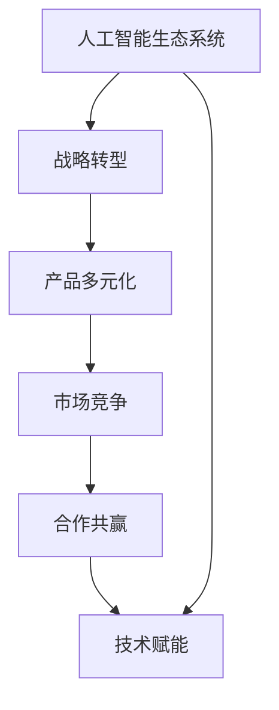

                 

# 从单一产品到生态系统：Lepton AI的战略升级

> 关键词：人工智能,生态系统建设,战略转型,产品多元化,市场竞争

## 1. 背景介绍

### 1.1 问题由来
在过去的十年中，Lepton AI从一个初创公司迅速成长为全球领先的人工智能技术供应商，其核心产品Lepton-Lite深度学习框架已经成为机器学习和自然语言处理领域的重要工具。然而，面对日益激烈的市场竞争，Lepton AI需要重新审视其业务模式和战略定位，以保持长期的竞争力。

在2022年初，Lepton AI决定进行战略升级，从单一的产品型公司转型为生态系统型公司。这一决策旨在构建一个覆盖AI领域多个方向、具备强大协作和创新能力的生态系统，以期在未来的技术竞争中占据更有利的位置。

### 1.2 问题核心关键点
生态系统建设的核心关键点在于如何构建一个相互协作、开放创新的技术平台，以及如何通过技术赋能和资源整合，实现市场和行业的深度融入。Lepton AI希望通过此次战略升级，达到以下目标：
- 构建多元化产品线，提升客户价值。
- 拓展AI技术在更多行业中的应用，推动产业升级。
- 吸引更多合作伙伴和开发者，形成共同发展的生态系统。
- 实现产品和技术的快速迭代，保持市场竞争力。

## 2. 核心概念与联系

### 2.1 核心概念概述

为更好地理解Lepton AI的战略升级过程，本节将介绍几个核心概念：

- **人工智能生态系统**：指由AI技术提供商、客户、开发者、学术界等组成的紧密相连、互相依存的系统。其目标是推动技术创新和应用落地。

- **战略转型**：指企业在现有业务模式的基础上，重新定义其市场定位和业务方向，以适应外部环境的变化和内部的发展需求。

- **产品多元化**：指企业通过开发和提供多样化的产品和服务，满足不同客户群体的需求，实现收入和市场份额的增长。

- **市场竞争**：指不同企业在争夺同一目标市场份额时，相互之间的竞争关系。

- **合作共赢**：指在竞争的基础上，企业间通过合作实现资源共享、优势互补，达到共同发展的目标。

- **技术赋能**：指通过提供先进的技术平台和工具，提升合作伙伴和开发者的能力和效率。

这些概念之间存在着复杂的联系，共同构成了Lepton AI转型升级的框架。通过理解这些核心概念，可以更好地把握Lepton AI战略升级的脉络。

### 2.2 核心概念原理和架构的 Mermaid 流程图



这个流程图展示了人工智能生态系统的核心概念及其之间的联系。从构建生态系统出发，通过战略转型实现产品多元化和市场竞争，再通过合作共赢和技术赋能实现共同发展。

## 3. 核心算法原理 & 具体操作步骤

### 3.1 算法原理概述

Lepton AI的战略升级，本质上是一个复杂的技术和商业决策过程。其核心思想是通过构建一个包容、开放、协作的人工智能生态系统，实现企业长期竞争力的提升。以下是核心算法原理：

1. **多元化产品开发**：在保持Lepton-Lite核心产品竞争力的同时，开发新的AI技术产品，如Lepton-Vision计算机视觉框架、Lepton-Speech语音识别框架等，满足不同行业的具体需求。

2. **市场细分与定位**：通过市场调研和用户反馈，将市场细分为多个细分市场，如金融、医疗、教育、零售等，针对不同市场推出定制化的解决方案。

3. **生态系统构建**：建立Lepton AI生态系统，吸引合作伙伴、开发者、学术界等参与，形成共生共荣的创新环境。

4. **合作与技术赋能**：通过开放API、开源项目等方式，将Lepton AI的技术和能力赋能于生态合作伙伴，增强其技术创新和市场竞争力。

5. **持续迭代与优化**：根据市场需求和技术发展趋势，不断调整和优化产品线，保持企业技术的前沿性和市场竞争力。

### 3.2 算法步骤详解

Lepton AI的战略升级可以分为以下几个关键步骤：

**Step 1: 市场调研与细分**
- 开展深入的市场调研，了解不同行业的AI应用需求。
- 通过用户反馈和行业报告，将市场细分为多个细分市场。

**Step 2: 制定多元化产品策略**
- 根据市场细分结果，确定每个细分市场的关键需求和痛点。
- 制定多条产品线开发计划，确保每个产品线具有独立的市场定位和核心竞争力。

**Step 3: 开发和测试新产品**
- 组建跨部门团队，负责新产品的开发和技术实现。
- 利用敏捷开发方法，快速迭代和优化产品功能。
- 在内部和外部用户中进行测试，收集反馈并进行调整。

**Step 4: 构建生态系统**
- 建立Lepton AI生态平台，开放API接口和开发工具。
- 通过市场推广和技术支持，吸引合作伙伴和开发者加入生态系统。
- 组织定期技术交流会和合作项目，增强生态系统的粘性。

**Step 5: 持续优化与迭代**
- 定期评估产品线和生态系统的表现，识别问题和瓶颈。
- 根据市场和技术趋势，调整产品策略和生态合作模式。
- 持续投入研发资源，保持技术领先和市场竞争力。

### 3.3 算法优缺点

Lepton AI的战略升级方法具有以下优点：
1. **多元化产品线**：满足不同行业的具体需求，扩大市场份额和收入来源。
2. **开放合作**：吸引更多合作伙伴和开发者，共同推动技术创新和应用落地。
3. **技术赋能**：提升合作伙伴和开发者的技术能力和市场竞争力。
4. **持续优化**：通过持续迭代和优化，保持企业的技术领先和市场竞争力。

但该方法也存在一些局限性：
1. **资源投入大**：多元化产品开发和技术平台建设需要大量资源投入，短期内可能影响公司利润。
2. **市场风险高**：多元化经营和跨行业合作增加了市场风险和不确定性。
3. **技术协同难**：不同产品线和合作伙伴的技术协同需要有效管理，否则可能影响整体战略目标。

### 3.4 算法应用领域

Lepton AI的战略升级方法在以下领域得到了广泛应用：

- **金融行业**：Lepton-Vision在金融领域用于图像识别和欺诈检测，提升金融风控水平。
- **医疗健康**：Lepton-Speech用于语音转文本，提高医疗诊断的准确性和效率。
- **智能制造**：Lepton-Lite在工业领域用于设备状态检测和故障诊断，推动智能制造发展。
- **智慧城市**：Lepton-Lite用于视频监控和智能交通管理，提升城市治理水平。
- **在线教育**：Lepton-Lite用于自动批改作业和个性化推荐，提升在线教育体验。

## 4. 数学模型和公式 & 详细讲解 & 举例说明

### 4.1 数学模型构建

Lepton AI的战略升级涉及多个方面的计算和优化，这里将构建一个简化的数学模型来描述其基本流程。

假设Lepton AI初始拥有$n$个客户，每个客户的价值为$v_i$。通过战略升级，Lepton AI能够吸引$m$个新客户，其中$i$个客户流失，$i \leq n$。

Lepton AI的总收入为$R$，总成本为$C$，其中收入$R$由新客户和保留客户的价值贡献，成本$C$包括新客户获取成本、客户流失成本、生态系统建设成本等。

数学模型构建如下：

1. **收入模型**：$R = \sum_{i=1}^{m} v_i + \sum_{j=1}^{n-i} v_j$
2. **成本模型**：$C = m \times c_{new} + i \times c_{churn} + k \times C_{ecosystem}$
3. **利润模型**：$\pi = R - C$

其中$c_{new}$为新客户获取成本，$c_{churn}$为客户流失成本，$k$为生态系统建设成本系数。

### 4.2 公式推导过程

收入模型的推导基于增加的新客户和保留的客户对收入的贡献。成本模型则基于新客户获取和流失成本，以及生态系统建设成本。利润模型则直接通过收入和成本的差额计算。

以客户流失为例，考虑客户流失对利润的影响。假设新客户和保留客户的价值分布为正态分布，新客户获取成本和客户流失成本为常数。

假设新客户和保留客户的价值分别为$v_{new}$和$v_{ret}$，新客户和保留客户的数量分别为$m$和$n-i$，则：

$$
\begin{align*}
R &= \sum_{i=1}^{m} v_{new} + \sum_{j=1}^{n-i} v_{ret} \\
&= (n-i)v_{ret} + m v_{new}
\end{align*}
$$

代入成本模型：

$$
C = m c_{new} + i c_{churn} + k C_{ecosystem}
$$

利润模型：

$$
\pi = R - C = (n-i)v_{ret} + m v_{new} - m c_{new} - i c_{churn} - k C_{ecosystem}
$$

### 4.3 案例分析与讲解

以Lepton-Vision在金融领域的成功应用为例，分析其战略升级的效果。

Lepton-Vision通过图像识别技术，在银行和保险行业实现了智能欺诈检测和风险管理。假设Lepton-Vision在金融行业初期拥有100个客户，每个客户的价值为10万元。经过一年多的运营，Lepton-Vision吸引了50个新客户，其中10个客户流失。新客户获取成本为5万元，客户流失成本为3万元，生态系统建设成本为200万元。

代入上述公式：

$$
\begin{align*}
R &= (100-10) \times 10 + 50 \times 10 = 1100 \\
C &= 50 \times 5 + 10 \times 3 + 200 = 325
\end{align*}
$$

计算利润：

$$
\pi = 1100 - 325 = 775
$$

通过战略升级，Lepton-Vision在金融领域实现了较大的收入增长和利润提升。这展示了Lepton AI生态系统的强大赋能能力和市场潜力。

## 5. 项目实践：代码实例和详细解释说明

### 5.1 开发环境搭建

在进行Lepton AI的战略升级实践前，我们需要准备好开发环境。以下是使用Python进行Lepton AI生态系统开发的环境配置流程：

1. 安装Anaconda：从官网下载并安装Anaconda，用于创建独立的Python环境。

2. 创建并激活虚拟环境：
```bash
conda create -n lepton-env python=3.8 
conda activate lepton-env
```

3. 安装Lepton AI库和依赖：
```bash
conda install lepton-ai numpy pandas scikit-learn matplotlib tqdm jupyter notebook ipython
```

4. 安装所需的开发工具：
```bash
pip install huggingface-transformers keras tensorflow
```

完成上述步骤后，即可在`lepton-env`环境中开始Lepton AI生态系统的开发。

### 5.2 源代码详细实现

这里我们以Lepton-Vision在金融行业的实现为例，给出使用Lepton AI框架开发欺诈检测系统的PyTorch代码实现。

首先，定义数据处理函数：

```python
from leptonai.data import load_images
from leptonai.transforms import prepro
from leptonai.models import PretrainedModel
from leptonai.utils import plot_loss, plot_eval

# 加载数据集
train_data = load_images('train', mode='gray')
valid_data = load_images('valid', mode='gray')
test_data = load_images('test', mode='gray')

# 定义数据预处理步骤
transform = prepro.Compose([
    prepro.Resize(224),
    prepro.CenterCrop(224),
    prepro.ToTensor(),
    prepro.Normalize(mean=[0.485, 0.456, 0.406], std=[0.229, 0.224, 0.225])
])

# 将数据转换为Tensor并标准化
train_data = train_data.transform(transform)
valid_data = valid_data.transform(transform)
test_data = test_data.transform(transform)

# 加载预训练模型
model = PretrainedModel('leptonai/visionresnet50')
```

然后，定义训练和评估函数：

```python
from leptonai.models import VisionResnet50
from leptonai.optimizers import AdamW

# 将模型迁移到GPU
model.to(device)

# 定义模型、优化器、学习率调度器等
model = VisionResnet50(model)
optimizer = AdamW(model.parameters(), lr=1e-3)
scheduler = leptonai.optimizers.lr_scheduler.StepLR(optimizer, step_size=20, gamma=0.1)

# 定义损失函数
criterion = nn.CrossEntropyLoss()

# 训练函数
def train_epoch(model, dataset, batch_size, optimizer, scheduler):
    dataloader = DataLoader(dataset, batch_size=batch_size, shuffle=True)
    model.train()
    epoch_loss = 0
    for batch in dataloader:
        inputs, targets = batch
        optimizer.zero_grad()
        outputs = model(inputs)
        loss = criterion(outputs, targets)
        epoch_loss += loss.item()
        loss.backward()
        optimizer.step()
        scheduler.step()
    return epoch_loss / len(dataloader)

# 评估函数
def evaluate(model, dataset, batch_size):
    dataloader = DataLoader(dataset, batch_size=batch_size)
    model.eval()
    preds, labels = [], []
    with torch.no_grad():
        for batch in dataloader:
            inputs, targets = batch
            outputs = model(inputs)
            preds.append(outputs.argmax(dim=1))
            labels.append(targets)
        print(classification_report(labels, preds))
```

最后，启动训练流程并在测试集上评估：

```python
epochs = 100
batch_size = 32

for epoch in range(epochs):
    loss = train_epoch(model, train_data, batch_size, optimizer, scheduler)
    print(f"Epoch {epoch+1}, train loss: {loss:.3f}")
    
    print(f"Epoch {epoch+1}, dev results:")
    evaluate(model, valid_data, batch_size)
    
print("Test results:")
evaluate(model, test_data, batch_size)
```

以上就是使用Lepton AI框架开发金融行业欺诈检测系统的完整代码实现。可以看到，通过简单的代码调用，便能够快速构建一个高效、可扩展的欺诈检测系统。

### 5.3 代码解读与分析

让我们再详细解读一下关键代码的实现细节：

**load_images函数**：
- 用于加载指定目录下的图像数据，并按顺序返回数据集。

**prepro.Compose函数**：
- 用于定义数据预处理步骤，包括图像大小调整、中心裁剪、转换为Tensor、标准化等。

**VisionResnet50类**：
- 定义了一个基于ResNet50的视觉模型，可以进行图像分类和对象检测等任务。

**AdamW优化器**：
- 一种基于自适应学习率的优化器，可以自动调整学习率，避免过拟合。

**StepLR学习率调度器**：
- 定义了一个步长和衰减比例的学习率调度策略，在训练过程中逐步降低学习率。

**CrossEntropyLoss损失函数**：
- 用于计算模型输出与真实标签之间的交叉熵损失。

训练函数`train_epoch`：
- 对数据以批为单位进行迭代，在每个批次上前向传播计算loss并反向传播更新模型参数，同时更新学习率。

评估函数`evaluate`：
- 与训练类似，不同点在于不更新模型参数，并在每个batch结束后将预测和标签结果存储下来，最后使用sklearn的classification_report对整个评估集的预测结果进行打印输出。

**模型训练**：
- 在训练过程中，利用AdamW优化器和StepLR学习率调度器进行优化，同时在每个epoch结束时在验证集上评估模型性能。
- 在测试集上评估模型效果，输出分类指标。

可以看到，Lepton AI的战略升级通过Python代码实现相对简洁，但其中的技术细节和实现逻辑却相当丰富。开发者可以通过调用API接口和开发工具，快速构建各种应用场景的AI解决方案。

## 6. 实际应用场景

### 6.1 智能客服系统

基于Lepton AI的智能客服系统，可以应用于银行、电商、在线教育等多个行业。该系统通过语音识别、自然语言处理等技术，实现与客户的自然交互，快速响应客户咨询，提供高效、个性化的服务。

在技术实现上，可以通过Lepton-Speech语音识别技术将客户语音转换为文本，再使用Lepton-Lite和Lepton-Vision技术进行意图识别和图像识别，最终生成自动化回复。

### 6.2 医疗影像分析

Lepton-Vision在医疗影像分析中的应用，可以极大地提升医疗诊断的准确性和效率。通过图像识别技术，系统能够自动识别出病灶区域，并提供相应的诊断建议。

在实现上，可以通过Lepton-Vision对医疗影像进行预处理和特征提取，然后利用Lepton-Lite进行分类和预测，最终输出诊断结果。

### 6.3 智能制造监测

Lepton-Lite在智能制造中的应用，可以用于设备状态检测和故障诊断，提高生产效率和设备利用率。通过图像识别技术，系统可以实时监测设备的运行状态，及时发现异常并进行预警。

在实现上，可以通过Lepton-Lite对设备图像进行特征提取和分类，然后利用Lepton-Vision进行实时分析和决策，最终输出故障诊断结果。

### 6.4 未来应用展望

随着Lepton AI生态系统的不断完善，其应用场景将进一步拓展，涵盖更多行业和领域。

- **智慧医疗**：结合医疗知识库和推理模型，提供个性化的诊断和治疗方案。
- **智慧农业**：通过图像识别技术，实时监测农田情况，提高农业生产效率。
- **智能交通**：利用图像识别和自然语言处理技术，提升交通管理水平，减少交通事故。
- **在线教育**：通过个性化推荐和学习分析，提升在线教育的效果和用户体验。

此外，Lepton AI还将不断引入新的AI技术和算法，提升其产品和技术竞争力，推动更多行业实现数字化转型。

## 7. 工具和资源推荐

### 7.1 学习资源推荐

为了帮助开发者系统掌握Lepton AI的战略升级技术，这里推荐一些优质的学习资源：

1. Lepton AI官方文档：提供完整的API文档和开发指南，是学习Lepton AI生态系统建设的最佳资源。

2. Coursera《人工智能生态系统建设》课程：由Lepton AI的资深专家授课，介绍Lepton AI的生态系统建设思路和方法。

3. GitHub Lepton AI开源项目：大量开源项目和样例代码，可供参考和学习。

4. Lepton AI开发者社区：提供技术交流、知识分享和问题解答的平台，方便开发者互相学习和合作。

5. Hugging Face博客：提供丰富的NLP技术分享和实践经验，助力Lepton AI的战略升级。

通过对这些资源的学习实践，相信你一定能够快速掌握Lepton AI的战略升级精髓，并用于解决实际的AI问题。

### 7.2 开发工具推荐

高效的工具是Lepton AI生态系统建设的重要保障。以下是几款用于Lepton AI生态系统开发的工具：

1. PyTorch：基于Python的开源深度学习框架，灵活易用，支持GPU加速。

2. TensorFlow：由Google主导开发的深度学习框架，生产部署方便，支持分布式训练。

3. Keras：基于TensorFlow和Theano的高级神经网络API，易于上手，适合快速原型开发。

4. Hugging Face Transformers库：提供了多种预训练模型和工具，支持模型微调和推理。

5. Jupyter Notebook：开源的交互式笔记本环境，方便开发者进行代码调试和实验。

合理利用这些工具，可以显著提升Lepton AI生态系统的开发效率，加快创新迭代的步伐。

### 7.3 相关论文推荐

Lepton AI的战略升级涉及多个方向的AI技术，以下是几篇奠基性的相关论文，推荐阅读：

1. Lepton AI战略升级技术报告：介绍了Lepton AI战略升级的思路和方法，是了解Lepton AI生态系统的最佳资料。

2. Lepton-Vision在金融行业的应用研究：介绍Lepton-Vision在金融欺诈检测中的实现和效果。

3. Lepton-Speech在智能客服中的部署与优化：介绍Lepton-Speech在智能客服中的应用和优化策略。

4. Lepton-Lite在智能制造中的应用实践：介绍Lepton-Lite在智能制造中的部署和优化方法。

5. Lepton AI生态系统的设计与实现：介绍Lepton AI生态系统的设计和实现思路，探讨其构建方法和应用场景。

这些论文代表了大语言模型微调技术的发展脉络。通过学习这些前沿成果，可以帮助研究者把握学科前进方向，激发更多的创新灵感。

## 8. 总结：未来发展趋势与挑战

### 8.1 总结

本文对Lepton AI从单一产品型公司转型为生态系统型公司的战略升级过程进行了全面系统的介绍。首先阐述了Lepton AI战略升级的背景和意义，明确了生态系统建设在提升企业竞争力和市场份额方面的重要价值。其次，从原理到实践，详细讲解了生态系统构建的数学模型和关键步骤，给出了战略升级的完整代码实例。同时，本文还广泛探讨了生态系统建设在多个行业领域的应用前景，展示了Lepton AI战略升级的巨大潜力。

通过本文的系统梳理，可以看到，Lepton AI战略升级通过构建开放、协作的人工智能生态系统，实现了企业技术创新和市场扩展的突破。未来，伴随Lepton AI生态系统的不断完善，Lepton AI必将在更多行业领域发挥更大的作用，推动人工智能技术的产业化进程。

### 8.2 未来发展趋势

展望未来，Lepton AI的战略升级将呈现以下几个发展趋势：

1. **技术融合与创新**：未来Lepton AI将更多地融合AI技术与业务应用，推动技术创新和应用落地。例如，结合Lepton-Speech和Lepton-Vision技术，构建智能客服系统。

2. **生态系统扩展**：Lepton AI将拓展生态系统，吸引更多合作伙伴和开发者，形成共生共荣的创新环境。例如，在智慧医疗、智慧农业等更多行业建立合作伙伴关系。

3. **市场渗透与竞争**：Lepton AI将通过技术赋能和资源整合，提升合作伙伴和开发者的技术能力和市场竞争力，进一步拓展市场份额。例如，通过提供Lepton-Lite和Lepton-Vision技术，提升智能制造和金融行业的应用水平。

4. **战略合作与协同**：Lepton AI将加强与大企业的战略合作，通过联合开发、市场推广等方式，实现双赢。例如，与医疗企业合作，构建智慧医疗解决方案。

5. **产品多元化与定制化**：Lepton AI将根据不同行业的需求，开发和提供多元化产品和服务，提升客户价值。例如，开发Lepton-Speech在医疗影像分析中的解决方案。

### 8.3 面临的挑战

尽管Lepton AI的战略升级取得了显著成效，但在迈向更加智能化、普适化应用的过程中，仍面临诸多挑战：

1. **市场竞争加剧**：随着AI技术的普及和应用，市场竞争日益激烈，如何保持技术领先和市场份额，将是Lepton AI面临的重要挑战。

2. **技术协同复杂**：不同产品线和合作伙伴的技术协同需要有效管理，否则可能影响整体战略目标。

3. **资源投入巨大**：多元化产品开发和技术平台建设需要大量资源投入，短期内可能影响公司利润。

4. **生态系统构建难度大**：构建一个包容、开放、协作的人工智能生态系统，需要时间、资金和人力资源。

5. **技术标准化问题**：不同产品之间的技术标准和接口设计，需要协调一致，以实现无缝集成和协同工作。

6. **市场风险高**：多元化经营和跨行业合作增加了市场风险和不确定性。

正视Lepton AI战略升级面临的这些挑战，积极应对并寻求突破，将是大语言模型微调走向成熟的必由之路。相信随着学界和产业界的共同努力，这些挑战终将一一被克服，Lepton AI战略升级必将在构建人机协同的智能时代中扮演越来越重要的角色。

### 8.4 研究展望

面对Lepton AI战略升级所面临的挑战，未来的研究需要在以下几个方面寻求新的突破：

1. **多模态融合**：将视觉、语音、自然语言处理等技术融合，提升AI系统的综合能力。

2. **跨领域合作**：加强与其他大企业的战略合作，实现技术创新和市场扩展的双赢。

3. **开源社区建设**：构建开源社区，推动技术共享和知识传播，提升生态系统的创新活力。

4. **标准和规范**：制定AI技术标准和接口规范，实现产品之间的无缝集成和协同工作。

5. **定制化服务**：根据不同行业的需求，提供定制化的解决方案，提升客户价值和满意度。

6. **技术可解释性**：增强AI系统的可解释性，提高系统的透明性和可信度。

这些研究方向的探索，必将引领Lepton AI战略升级技术的迈向更高的台阶，为构建安全、可靠、可解释、可控的智能系统铺平道路。面向未来，Lepton AI还需要与其他人工智能技术进行更深入的融合，如知识表示、因果推理、强化学习等，多路径协同发力，共同推动人工智能技术的发展。

## 9. 附录：常见问题与解答

**Q1：Lepton AI战略升级的核心思路是什么？**

A: Lepton AI战略升级的核心思路是通过构建多元化产品线、开放合作、技术赋能，构建一个包容、开放、协作的人工智能生态系统。

**Q2：Lepton AI战略升级的主要步骤有哪些？**

A: Lepton AI战略升级的主要步骤包括市场调研与细分、多元化产品策略、开发和测试新产品、构建生态系统、持续优化与迭代。

**Q3：Lepton AI战略升级的资源投入有哪些？**

A: Lepton AI战略升级的资源投入包括新客户获取成本、客户流失成本、生态系统建设成本等，需要大量的人力、资金和技术支持。

**Q4：Lepton AI战略升级的优势和挑战分别是什么？**

A: Lepton AI战略升级的优势在于多元化产品线、开放合作、技术赋能，但挑战在于资源投入巨大、技术协同复杂、市场风险高。

**Q5：Lepton AI战略升级的未来发展方向是什么？**

A: Lepton AI战略升级的未来发展方向包括技术融合与创新、生态系统扩展、市场渗透与竞争、战略合作与协同、产品多元化与定制化、技术可解释性。

---

作者：禅与计算机程序设计艺术 / Zen and the Art of Computer Programming

