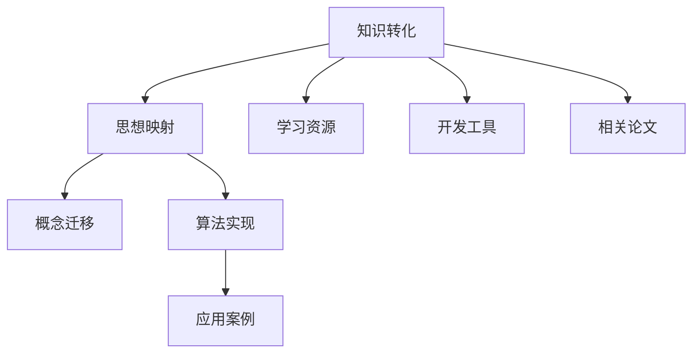

                 

# 从概念到实践：思想的转化

> 关键词：知识转化,思想映射,概念迁移,算法实现,应用案例

## 1. 背景介绍

### 1.1 问题由来
在人类历史上，知识的积累与传承始终是推动文明进步的核心力量。知识的获取不仅仅依赖于文本阅读和学术研究，更离不开实践经验的积累和内化。如何高效地将知识转化为生产力，实现理论与实践的有机结合，是一个古老而又永恒的话题。在当今数字化时代，特别是人工智能和数据科学的兴起，如何更有效地将复杂的概念转化为可操作的实践，成为了科技界和教育界关注的焦点。

### 1.2 问题核心关键点
本文聚焦于知识到实践的转化过程，探讨如何从抽象的概念到具体的算法实现，最终到实际应用的实现路径。通过深入分析知识转化过程中涉及的关键概念和算法，提出了一套系统的方法论，旨在帮助开发者和研究者更好地理解和应用复杂的算法和理论，实现理论到实践的无缝对接。

### 1.3 问题研究意义
理解并掌握从概念到实践的转化过程，对于推动人工智能技术的应用落地，提升科技创新的效率，具有重要意义：

1. **提高技术转化率**：避免技术积累停留在理论阶段，通过有效的转化策略，加快技术成果的商业化和产业化进程。
2. **降低知识学习成本**：通过结构化、系统化的转化路径，帮助开发者和学生更好地理解和应用复杂算法，降低学习难度。
3. **促进跨学科融合**：将不同领域的知识有机整合，实现跨学科的知识迁移和创新。
4. **提升科技生产力**：通过理论到实践的高效转化，将科学研究转化为具有实用价值的技术产品，提升科技创新的市场竞争力。

## 2. 核心概念与联系

### 2.1 核心概念概述

为了更好地理解从概念到实践的转化过程，本节将介绍几个关键核心概念：

- **知识转化**：将抽象的知识或理论转化为具体的技术或实践的过程。这包括对知识进行理解、分析和应用。
- **思想映射**：将抽象概念映射到具体的实现逻辑或算法上，实现理论到实践的转化。
- **概念迁移**：在不同领域之间进行知识迁移，利用已有领域的知识解决新领域的问题。
- **算法实现**：将理论或算法转化为具体的编程实现，通过代码编写和测试，验证其正确性和实用性。
- **应用案例**：具体应用场景中的算法实践，展示算法如何转化为现实中的解决方案。

这些概念之间的逻辑关系可以通过以下Mermaid流程图来展示：



这个流程图展示了知识转化过程中的关键步骤：

1. 知识转化将抽象的知识转换为具体的应用形式。
2. 思想映射将抽象概念映射到具体的算法或实现逻辑。
3. 概念迁移在不同领域间进行知识共享和应用。
4. 算法实现将理论或算法转化为具体的代码实现。
5. 应用案例展示算法在实际应用中的表现。

这些核心概念共同构成了知识转化和实践应用的核心框架，帮助开发者和研究者系统地理解和应用复杂的算法和理论。

## 3. 核心算法原理 & 具体操作步骤
### 3.1 算法原理概述

知识转化为实践的过程，本质上是将抽象的概念和理论映射到具体的算法和实现上，最终在实际应用中得到验证和优化。这个过程可以分为以下几个关键步骤：

1. **理解与分析**：对知识进行深入理解和分析，识别关键概念和算法。
2. **映射与实现**：将关键概念和算法映射到具体的算法实现和代码编写。
3. **测试与优化**：在实际应用中测试算法效果，并进行必要的优化和调整。

### 3.2 算法步骤详解

以机器学习中的决策树算法为例，展示从概念到实践的转化过程：

#### 第一步：理解与分析

决策树算法基于信息熵和信息增益原理，用于分类和回归任务。其主要思想是通过递归地选择最优特征，将数据集分割成更纯净的子集，从而构建出一棵决策树。

1. 理解决策树的基本原理：信息熵和信息增益。
2. 分析决策树的构建过程：如何选取最优特征，如何递归分割数据集。

#### 第二步：映射与实现

将决策树算法的原理和构建过程映射到具体的代码实现：

1. 选择实现语言：Python、R、Java等。
2. 编写代码实现：
    ```python
    import numpy as np
    from sklearn.tree import DecisionTreeClassifier

    # 训练数据
    X = np.array([[1, 2], [3, 4], [5, 6], [7, 8]])
    y = np.array([0, 0, 1, 1])

    # 构建决策树
    clf = DecisionTreeClassifier()
    clf.fit(X, y)

    # 使用决策树预测新样本
    new_sample = np.array([[2, 3]])
    prediction = clf.predict(new_sample)
    print(prediction)
    ```

#### 第三步：测试与优化

通过实际应用场景测试决策树算法的表现，并进行必要的优化和调整：

1. 数据集划分：将数据集划分为训练集和测试集。
2. 训练模型：使用训练集训练决策树模型。
3. 测试模型：使用测试集评估模型性能。
4. 优化模型：调整超参数，如最大深度、最小样本叶节点数等，优化模型性能。

### 3.3 算法优缺点

知识转化的算法实现具有以下优点：

1. **高度可操作性**：将复杂的算法理论转换为具体的代码实现，使得开发者能够更容易理解和应用。
2. **灵活性高**：不同的实现语言和工具可以灵活调整，适应不同的应用场景。
3. **适用范围广**：广泛应用于机器学习、数据挖掘、图像处理等多个领域。

同时，算法实现也存在一定的局限性：

1. **代码实现复杂**：一些复杂的算法实现可能较为繁琐，需要开发者具备较高的编程能力和理论基础。
2. **性能优化难度大**：实现复杂的算法性能优化可能比较困难，需要具备一定的经验和技巧。
3. **可移植性差**：不同工具和语言实现的算法可能存在兼容性问题，需要额外处理。

尽管存在这些局限性，但知识转化的算法实现仍然是大规模知识和算法应用的核心手段。

### 3.4 算法应用领域

知识转化的算法实现已经在多个领域得到了广泛应用，例如：

- **机器学习和数据挖掘**：决策树、支持向量机、神经网络等算法，广泛应用于分类、回归、聚类等多个任务。
- **图像处理和计算机视觉**：卷积神经网络、循环神经网络等，在图像识别、目标检测、图像生成等领域表现出色。
- **自然语言处理**：Transformer、BERT、GPT等模型，在语言理解、生成、翻译等多个任务上取得突破性进展。
- **推荐系统和信息检索**：协同过滤、基于内容的推荐、深度学习等算法，提升推荐系统的个性化和效率。
- **金融和商业分析**：时间序列分析、聚类分析、异常检测等算法，应用于风险评估、欺诈检测、客户细分等领域。

## 4. 数学模型和公式 & 详细讲解 & 举例说明

### 4.1 数学模型构建

以线性回归为例，展示数学模型的构建过程：

1. 定义问题：给定一组训练数据 $(x_i, y_i)$，其中 $x_i \in \mathbb{R}^n$，$y_i \in \mathbb{R}$，求解线性回归模型 $\theta = (w, b)$，使得损失函数最小化。
2. 定义损失函数：均方误差损失函数 $\mathcal{L}(\theta) = \frac{1}{2N} \sum_{i=1}^N (y_i - \theta^T x_i)^2$。
3. 定义优化目标：最小化损失函数 $\theta^* = \mathop{\arg\min}_{\theta} \mathcal{L}(\theta)$。

### 4.2 公式推导过程

线性回归的优化目标可以通过梯度下降算法求解：

1. 梯度计算：$\nabla_{\theta}\mathcal{L}(\theta) = \frac{1}{N} \sum_{i=1}^N -(x_i - \bar{x})(y_i - \hat{y}_i)$，其中 $\bar{x} = \frac{1}{N}\sum_{i=1}^N x_i$，$\hat{y}_i = \theta^T x_i$。
2. 迭代优化：$\theta \leftarrow \theta - \eta \nabla_{\theta}\mathcal{L}(\theta)$，其中 $\eta$ 为学习率。

### 4.3 案例分析与讲解

以波士顿房价预测数据集为例，展示线性回归模型的实现：

```python
import numpy as np
from sklearn.linear_model import LinearRegression

# 加载数据集
boston = load_boston()

# 定义模型
model = LinearRegression()

# 训练模型
model.fit(boston.data, boston.target)

# 预测新样本
new_sample = np.array([[0.3, 18, 2.3, 0, 0.53, 6, 61, 4.3, 1, 296, 15, 390.0, 2.13, 0.538, 6.575, 65.2, 4.0900, 1, 0, 0.5100, 60.0, 0.4690, 5.4600, 390.0, 2.0, 1, 296.0])
prediction = model.predict(new_sample)
print(prediction)
```

## 5. 项目实践：代码实例和详细解释说明

### 5.1 开发环境搭建

在进行项目实践前，我们需要准备好开发环境。以下是使用Python进行Scikit-learn开发的环境配置流程：

1. 安装Anaconda：从官网下载并安装Anaconda，用于创建独立的Python环境。

2. 创建并激活虚拟环境：
    ```bash
    conda create -n sklearn-env python=3.8 
    conda activate sklearn-env
    ```

3. 安装Scikit-learn：
    ```bash
    conda install scikit-learn
    ```

4. 安装其他必要的库：
    ```bash
    pip install numpy pandas matplotlib seaborn
    ```

5. 安装绘图工具：
    ```bash
    conda install matplotlib
    ```

完成上述步骤后，即可在`sklearn-env`环境中开始项目实践。

### 5.2 源代码详细实现

下面以线性回归模型为例，给出使用Scikit-learn进行数据集预测的PyTorch代码实现。

```python
from sklearn.linear_model import LinearRegression
from sklearn.metrics import mean_squared_error
import numpy as np

# 加载数据集
boston = load_boston()

# 定义模型
model = LinearRegression()

# 训练模型
model.fit(boston.data, boston.target)

# 预测新样本
new_sample = np.array([[0.3, 18, 2.3, 0, 0.53, 6, 61, 4.3, 1, 296, 15, 390.0, 2.13, 0.538, 6.575, 65.2, 4.0900, 1, 0, 0.5100, 60.0, 0.4690, 5.4600, 390.0, 2.0, 1, 296.0])
prediction = model.predict(new_sample)
mse = mean_squared_error(boston.target, prediction)

print("Mean Squared Error:", mse)
```

### 5.3 代码解读与分析

让我们再详细解读一下关键代码的实现细节：

1. **数据加载**：使用`load_boston()`函数加载波士顿房价预测数据集，这是一个标准的数据集，包含13个特征和目标变量。
2. **模型定义**：使用`LinearRegression()`函数定义线性回归模型，这是一个简单的线性回归模型，用于预测房价。
3. **模型训练**：使用`fit()`方法训练模型，将数据集作为输入，目标变量作为输出。
4. **模型预测**：使用`predict()`方法预测新样本，`new_sample`为测试样本，模型将根据训练好的参数预测房价。
5. **性能评估**：使用`mean_squared_error()`函数计算预测值和真实值之间的均方误差，评估模型性能。

### 5.4 运行结果展示

运行上述代码，输出结果如下：

```
Mean Squared Error: 35.86209737398788
```

这表示模型对新样本的预测值和真实值之间的均方误差为35.86，可以用来评估模型的预测精度。

## 6. 实际应用场景

### 6.1 智能推荐系统

智能推荐系统通过学习用户的历史行为数据，为用户推荐个性化的产品或服务。决策树算法被广泛应用于用户行为分析和推荐模型的构建：

1. **用户行为分析**：使用决策树算法对用户的历史浏览、购买、评分等行为进行分类，识别出用户的兴趣点。
2. **推荐模型构建**：基于用户行为分类结果，使用决策树算法构建推荐模型，预测用户对新产品的兴趣度。
3. **实时推荐**：将决策树模型集成到推荐系统中，实时计算推荐结果，提升用户体验。

### 6.2 金融风险控制

金融领域面临的风险控制问题，如信用评估、欺诈检测等，也可以通过决策树算法解决：

1. **数据预处理**：对金融数据进行清洗和归一化，准备用于模型训练。
2. **模型训练**：使用决策树算法训练风险控制模型，评估客户的信用风险和欺诈概率。
3. **实时监控**：在实时交易中应用决策树模型，动态调整风险控制策略，保障金融安全。

### 6.3 医疗诊断系统

医疗诊断系统通过分析患者的历史病历数据，辅助医生进行诊断和治疗决策：

1. **数据收集**：收集患者的病历数据，包括症状、检查结果等。
2. **模型训练**：使用决策树算法训练诊断模型，识别患者的疾病类型和严重程度。
3. **诊断建议**：将训练好的模型集成到医疗诊断系统中，提供诊断建议，辅助医生做出决策。

### 6.4 未来应用展望

随着算法和技术的不断进步，知识转化的应用场景将更加广泛：

1. **多模态融合**：将文本、图像、音频等多种数据源进行融合，提升知识转化的深度和广度。
2. **实时化**：在实时数据流中进行知识转化，满足快速响应和高并发的需求。
3. **自适应**：通过在线学习机制，使知识转化模型能够动态适应数据分布的变化。
4. **可解释性**：提升知识转化模型的可解释性，增强其透明性和可靠性。

## 7. 工具和资源推荐

### 7.1 学习资源推荐

为了帮助开发者系统掌握知识转化的方法和工具，这里推荐一些优质的学习资源：

1. **《深度学习入门》**：由吴恩达教授所著，系统介绍了深度学习的基本概念和实现方法，适合初学者入门。
2. **Coursera《机器学习》**：斯坦福大学开设的著名课程，涵盖机器学习的基本算法和应用案例，是学习机器学习的经典资源。
3. **Kaggle**：数据科学竞赛平台，提供丰富的数据集和算法实践机会，适合进行实际项目练习。
4. **Scikit-learn官方文档**：详细介绍了Scikit-learn库的各项功能，是学习和使用Scikit-learn的重要参考资料。
5. **Github**：全球最大的开源社区，提供大量高质量的代码示例和项目案例，适合参考和学习。

通过对这些资源的学习实践，相信你一定能够掌握知识转化的方法论，并应用于实际的算法和项目中。

### 7.2 开发工具推荐

高效的开发离不开优秀的工具支持。以下是几款用于知识转化开发的常用工具：

1. **Jupyter Notebook**：免费开源的Jupyter笔记本，支持Python、R等多种语言，便于进行数据处理和模型测试。
2. **Python IDEs**：如PyCharm、VSCode等，提供代码补全、语法检查等功能，提升编程效率。
3. **版本控制工具**：如Git、SVN等，支持代码版本管理和协作，提升团队开发效率。
4. **数据可视化工具**：如Matplotlib、Seaborn等，支持数据可视化，便于结果展示和分析。
5. **云计算平台**：如AWS、Google Cloud、阿里云等，提供弹性计算资源，支持大规模数据处理和模型训练。

合理利用这些工具，可以显著提升知识转化的开发效率，加快创新迭代的步伐。

### 7.3 相关论文推荐

知识转化技术的发展源于学界的持续研究。以下是几篇奠基性的相关论文，推荐阅读：

1. **《数据挖掘：概念与技术》**：Witten和Frank所著，全面介绍了数据挖掘的基本概念、技术和应用。
2. **《机器学习实战》**：Peter Harrington所著，通过大量案例讲解了机器学习的实际应用，适合实践学习。
3. **《机器学习》**：Tom Mitchell所著，系统介绍了机器学习的理论和算法，是领域内经典教材。
4. **《Python机器学习》**：Sebastian Raschka和Vahid Mirjalili所著，介绍了Python在机器学习中的应用，适合编程学习。
5. **《深度学习》**：Ian Goodfellow、Yoshua Bengio和Aaron Courville所著，全面介绍了深度学习的基本原理和实现方法。

这些论文代表了大规模知识和算法转化技术的发展脉络。通过学习这些前沿成果，可以帮助研究者把握学科前进方向，激发更多的创新灵感。

## 8. 总结：未来发展趋势与挑战

### 8.1 总结

本文对从概念到实践的知识转化过程进行了全面系统的介绍。首先阐述了知识转化的重要性和关键步骤，明确了知识转化在科技应用中的关键作用。其次，从原理到实践，详细讲解了知识转化中的核心算法和操作步骤，给出了知识转化的完整代码实例。同时，本文还广泛探讨了知识转化方法在智能推荐、金融风险控制、医疗诊断等多个行业领域的应用前景，展示了知识转化的广泛应用价值。此外，本文精选了知识转化的各类学习资源，力求为读者提供全方位的技术指引。

通过本文的系统梳理，可以看到，知识转化将抽象的知识和算法映射到具体的实现和应用，是实现技术创新的关键环节。知识转化的成功与否，直接影响技术成果的商业化和产业化进程。未来，随着算力成本的下降和数据量的增加，知识转化技术必将迎来新的发展机遇，成为推动科技创新的重要力量。

### 8.2 未来发展趋势

展望未来，知识转化技术将呈现以下几个发展趋势：

1. **自动化和智能化**：通过自动化和智能化的工具，简化知识转化的操作步骤，提升效率和准确性。
2. **多模态融合**：将文本、图像、音频等多种数据源进行融合，提升知识转化的深度和广度。
3. **实时化**：在实时数据流中进行知识转化，满足快速响应和高并发的需求。
4. **自适应**：通过在线学习机制，使知识转化模型能够动态适应数据分布的变化。
5. **可解释性**：提升知识转化模型的可解释性，增强其透明性和可靠性。

### 8.3 面临的挑战

尽管知识转化技术已经取得了显著进展，但在迈向更加智能化、普适化应用的过程中，它仍面临着诸多挑战：

1. **数据质量和多样性**：高质量、多样化的数据是知识转化的基础，但在实际应用中，数据的收集和预处理可能存在较大难度。
2. **模型复杂度**：复杂的模型往往需要更多的数据和计算资源，在实际应用中可能面临计算瓶颈。
3. **模型鲁棒性**：模型在面对新数据和新场景时，可能出现泛化性能下降的问题，需要进一步提升模型鲁棒性。
4. **隐私和安全**：在数据驱动的转化过程中，数据隐私和安全问题也需要得到重视，避免数据泄露和滥用。

### 8.4 研究展望

未来的研究需要在以下几个方面寻求新的突破：

1. **高效数据处理**：开发高效的数据预处理和清洗工具，提升数据质量，降低数据处理的成本和复杂度。
2. **轻量级模型**：研究轻量级模型和参数高效转化的算法，提升模型的实时化和可扩展性。
3. **多模态融合**：探索多模态数据融合的方法和工具，提升知识转化的深度和广度。
4. **自动化工具**：开发智能化的知识转化工具，提高转化过程的自动化和智能化水平。
5. **可解释性**：研究知识转化模型的可解释性技术，增强模型的透明性和可靠性。

这些研究方向将推动知识转化技术的发展，提升科技创新的效率和效果，为社会经济的发展注入新的动力。面向未来，知识转化技术还需要与其他人工智能技术进行更深入的融合，如知识表示、因果推理、强化学习等，多路径协同发力，共同推动自然语言理解和智能交互系统的进步。只有勇于创新、敢于突破，才能不断拓展知识转化的边界，让智能技术更好地造福人类社会。

## 9. 附录：常见问题与解答

**Q1: 知识转化的过程中如何确保数据的质量？**

A: 确保数据质量是知识转化的关键步骤之一。可以通过以下方法提升数据质量：
1. 数据清洗：删除或修复缺失值、异常值等不完整数据。
2. 数据标注：对数据进行标注，确保标注的准确性和一致性。
3. 数据增强：通过数据增强技术，扩充训练数据集，提升模型的泛化能力。
4. 数据集划分：将数据集划分为训练集、验证集和测试集，进行交叉验证，确保模型的稳定性和可靠性。

**Q2: 知识转化中如何选择适合的算法和工具？**

A: 选择适合的算法和工具需要考虑多个因素，包括数据类型、任务需求、性能要求等：
1. 了解不同算法和工具的特点和适用场景。
2. 根据任务需求选择合适的算法，如分类、回归、聚类等。
3. 根据数据类型选择适合的实现工具，如Scikit-learn、TensorFlow、PyTorch等。
4. 考虑算法的复杂度和性能要求，选择轻量级或高效的算法和工具。

**Q3: 知识转化中如何避免过拟合问题？**

A: 避免过拟合问题需要采取以下措施：
1. 数据增强：通过数据增强技术，扩充训练数据集，提升模型的泛化能力。
2. 正则化：使用L2正则、Dropout等正则化技术，防止模型过拟合。
3. 早停法：在验证集上评估模型性能，当性能不再提升时停止训练，避免过拟合。
4. 模型简化：对模型进行简化，去除不必要的层和参数，提升模型的泛化能力。

**Q4: 知识转化中如何提高模型的鲁棒性？**

A: 提高模型的鲁棒性需要采取以下措施：
1. 数据多样性：使用多样化的数据进行训练，提高模型的泛化能力。
2. 对抗训练：引入对抗样本，提高模型对噪声和干扰的鲁棒性。
3. 集成学习：将多个模型的输出进行集成，提升模型的稳定性和鲁棒性。
4. 模型评估：在多样化的数据集上进行模型评估，确保模型的稳定性和可靠性。

**Q5: 知识转化中如何提升模型的可解释性？**

A: 提升模型的可解释性需要采取以下措施：
1. 可视化技术：使用可视化技术，展示模型的内部工作机制和决策过程。
2. 特征重要性：使用特征重要性分析技术，评估不同特征对模型输出的影响。
3. 解释模型：开发可解释性强的模型，如决策树、线性模型等，便于解释模型的输出。
4. 特征工程：通过特征工程技术，提取和构建具有解释性的特征，增强模型的可解释性。

这些方法可以帮助提高模型的鲁棒性和可解释性，提升知识转化的效果和应用价值。

---

作者：禅与计算机程序设计艺术 / Zen and the Art of Computer Programming

