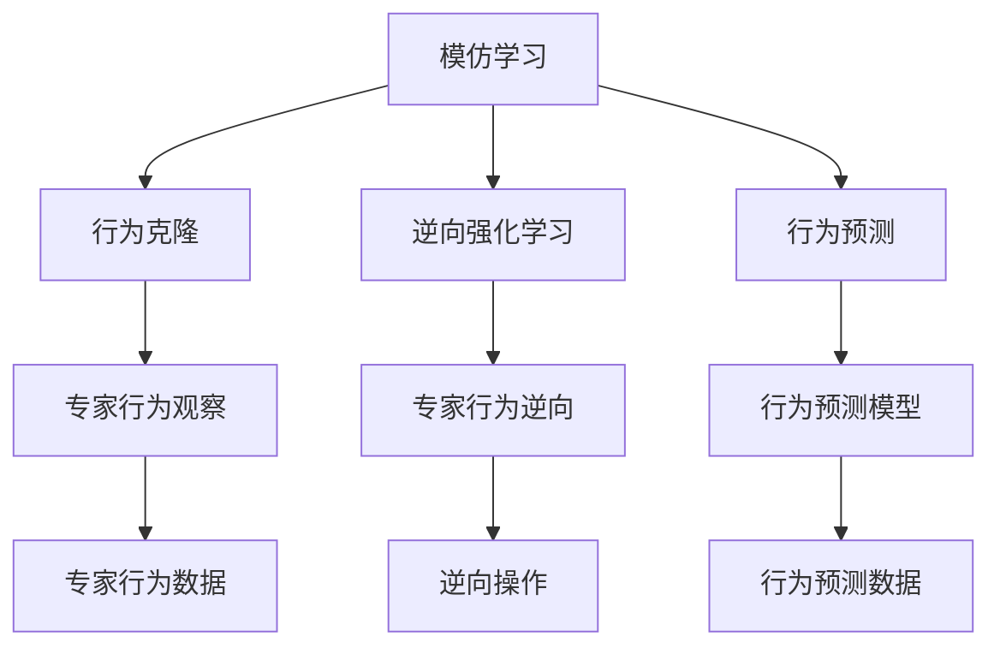

                 

## 1. 背景介绍

在人工智能(AI)领域，机器学习已经取得了举世瞩目的成就。其中，模仿学习(Imitation Learning)和强化学习(Reinforcement Learning)是两大重要的学习范式。模仿学习通过模仿专家行为，快速获取新技能；强化学习通过与环境的交互，自主学习和优化。这两大范式在过去十年中推动了AI技术的发展，催生了无人驾驶、机器人控制、智能游戏等领域的应用。然而，随着深度学习的兴起，模仿学习逐渐被边缘化，强化学习成为了推动AI发展的下一个里程碑。

本文将深入探讨模仿学习和强化学习的基本原理，对比两者的优缺点，并展望未来AI发展的方向。通过全面梳理模仿学习和强化学习的核心概念，介绍各自的数学模型和应用场景，我们希望能帮助读者更深刻地理解这两种学习范式的本质，探索AI技术的未来潜力。

## 2. 核心概念与联系

### 2.1 核心概念概述

#### 2.1.1 模仿学习
模仿学习是通过观察专家行为，学习并执行这些行为的过程。其主要目的是让机器在特定任务上模拟人类的表现。模仿学习可以分为行为克隆、逆向强化学习和行为预测等类型。

#### 2.1.2 强化学习
强化学习是一种通过与环境交互，不断尝试并优化决策策略的过程。其主要目标是最大化累计奖励，即找到最优的决策序列。强化学习依赖于环境、状态、动作、奖励等基本要素，并使用Q-learning、策略梯度等方法进行策略优化。

### 2.2 核心概念原理和架构的 Mermaid 流程图



## 3. 核心算法原理 & 具体操作步骤

### 3.1 算法原理概述

模仿学习和强化学习的核心原理可以总结如下：

- **模仿学习**：通过观察专家的行为，将这种行为复制到新的环境中。其主要目标是通过学习专家的动作，提升机器在特定任务上的表现。

- **强化学习**：通过与环境互动，让机器在执行动作后获得奖励或惩罚，通过最大化累计奖励来优化决策策略。其主要目标是通过试错过程，找到最优的动作序列。

### 3.2 算法步骤详解

#### 3.2.1 模仿学习步骤
1. **数据收集**：收集专家的行为数据，包括动作序列和状态变化。
2. **行为复制**：使用行为克隆等方法，将专家的行为复制到机器上。
3. **环境适配**：将机器放置在新的环境中，观察其行为表现。
4. **优化反馈**：根据环境反馈，调整机器行为。

#### 3.2.2 强化学习步骤
1. **环境设定**：定义环境、状态、动作和奖励机制。
2. **策略初始化**：选择一个初始策略或随机策略。
3. **策略执行**：在环境中执行策略，获取状态和奖励。
4. **策略优化**：根据奖励信号，使用Q-learning、策略梯度等方法，更新策略参数。
5. **策略评估**：评估策略的性能，决定是否继续优化。

### 3.3 算法优缺点

#### 3.3.1 模仿学习的优缺点
- **优点**：
  - 数据需求低：仅需要专家行为数据，无需大规模标注数据。
  - 简单易用：实现简单，不需要复杂的优化算法。
  - 结果稳定：专家的行为已经验证了其有效性，模仿学习结果较为稳定。

- **缺点**：
  - 依赖专家：依赖专家的行为数据，专家的行为不够普适时，效果不佳。
  - 环境适配困难：专家的行为可能不适用于新环境，需要进行大量适配。
  - 缺乏泛化能力：专家的行为通常是针对特定任务的，模仿学习难以泛化到其他任务。

#### 3.3.2 强化学习的优缺点
- **优点**：
  - 自主学习能力：强化学习通过与环境的互动，自主学习最优策略。
  - 高泛化能力：强化学习能够从环境中获得知识，泛化到不同任务。
  - 可解释性：强化学习的策略可解释性强，有助于理解决策过程。

- **缺点**：
  - 数据需求高：强化学习需要大量环境互动数据，数据获取成本高。
  - 学习效率低：强化学习通过试错学习，学习效率较低。
  - 策略优化困难：优化策略需要复杂的数学模型和算法。

### 3.4 算法应用领域

模仿学习和强化学习在不同领域有着广泛的应用：

- **模仿学习**：游戏AI、医疗诊断、金融交易等。模仿学习在游戏AI中应用广泛，如AlphaGo；在医疗诊断中，通过观察专家医生的诊断过程，提升机器的诊断能力；在金融交易中，模仿专家的交易策略，提升机器的盈利能力。

- **强化学习**：自动驾驶、机器人控制、推荐系统等。强化学习在自动驾驶中用于优化行驶策略；在机器人控制中，用于优化操作动作；在推荐系统中，用于优化推荐算法，提升用户满意度。

## 4. 数学模型和公式 & 详细讲解 & 举例说明

### 4.1 数学模型构建

#### 4.1.1 模仿学习模型
模仿学习的核心模型是行为克隆模型，其目标是通过最小化预测动作与专家动作之间的差异，来训练机器行为。具体模型如下：

$$
\arg\min_{\theta} \sum_{i=1}^N \mathcal{L}(\theta, y_i)
$$

其中，$\theta$ 是模型参数，$y_i$ 是专家在第 $i$ 个状态下的动作，$\mathcal{L}$ 是损失函数，通常使用均方误差（MSE）。

#### 4.1.2 强化学习模型
强化学习中的核心模型是Q-learning模型，其目标是通过最大化累计奖励，来优化策略。具体模型如下：

$$
Q(s,a) = Q_{old}(s,a) + \alpha [r + \gamma \max_a Q_{old}(s',a') - Q_{old}(s,a)]
$$

其中，$Q(s,a)$ 是状态-动作的Q值，$r$ 是即时奖励，$\gamma$ 是折扣因子，$\alpha$ 是学习率。

### 4.2 公式推导过程

#### 4.2.1 模仿学习公式推导
模仿学习的损失函数可以表示为：

$$
\mathcal{L}(\theta) = \frac{1}{N} \sum_{i=1}^N (y_i - f(x_i, \theta))^2
$$

其中，$f(x_i, \theta)$ 是机器在状态 $x_i$ 下的预测动作。通过反向传播，更新模型参数 $\theta$。

#### 4.2.2 强化学习公式推导
Q-learning的更新公式为：

$$
Q(s,a) = Q_{old}(s,a) + \alpha [r + \gamma \max_a Q_{old}(s',a') - Q_{old}(s,a)]
$$

其中，$Q_{old}(s,a)$ 是上一个时间步的状态-动作Q值。通过不断迭代，优化Q值，直至收敛。

### 4.3 案例分析与讲解

#### 4.3.1 模仿学习案例
以AlphaGo为例，AlphaGo通过模仿人类下棋的方式，学习围棋的策略。AlphaGo先通过蒙特卡洛树搜索（MCTS）模拟人类下棋，获取大量棋谱数据；再使用行为克隆模型，将人类下棋动作复制到AlphaGo上，进行策略优化。最终AlphaGo在围棋领域取得了人类无法匹敌的胜利。

#### 4.3.2 强化学习案例
以OpenAI的Dota2智能体为例，该智能体通过强化学习，学会了在游戏中的决策策略。智能体在一个模拟游戏环境中，通过与对手的对抗，不断调整决策策略，最大化累计奖励。最终，该智能体在游戏中的表现超过了人类顶尖玩家。

## 5. 项目实践：代码实例和详细解释说明

### 5.1 开发环境搭建

要实现模仿学习和强化学习的项目，需要安装相关的开发工具和库。以下是常见的工具和库：

- Python：推荐使用Python 3.x版本，因其具有丰富的科学计算库。
- TensorFlow：谷歌推出的深度学习框架，支持分布式计算和GPU加速。
- PyTorch：Facebook推出的深度学习框架，支持动态计算图和自动微分。
- OpenAI Gym：提供环境模拟和强化学习实验的平台，支持多种游戏和环境。

安装方法如下：

```bash
pip install tensorflow==2.7
pip install torch==1.10
pip install gym==0.24.2
```

### 5.2 源代码详细实现

#### 5.2.1 模仿学习实现

以下是一个简单的行为克隆实现，用于模仿专家下棋动作：

```python
import tensorflow as tf
import gym

env = gym.make('CartPole-v1')
model = tf.keras.Sequential([
    tf.keras.layers.Dense(32, activation='relu'),
    tf.keras.layers.Dense(env.action_space.n, activation='softmax')
])
model.compile(optimizer=tf.keras.optimizers.Adam(learning_rate=0.001), loss='mse')

for episode in range(1000):
    state = env.reset()
    done = False
    while not done:
        action = tf.random.categorical(model.predict(tf.expand_dims(state, axis=0)))[0][0]
        state, reward, done, _ = env.step(action)
        model.train_on_batch(tf.expand_dims(state, axis=0), action)
```

#### 5.2.2 强化学习实现

以下是一个简单的Q-learning实现，用于优化智能体在环境中的决策策略：

```python
import tensorflow as tf
import gym

env = gym.make('CartPole-v1')
model = tf.keras.Sequential([
    tf.keras.layers.Dense(32, activation='relu'),
    tf.keras.layers.Dense(1)
])
model.compile(optimizer=tf.keras.optimizers.Adam(learning_rate=0.001), loss='mse')

for episode in range(1000):
    state = env.reset()
    done = False
    total_reward = 0
    while not done:
        action = model.predict(tf.expand_dims(state, axis=0))[0][0]
        state, reward, done, _ = env.step(action)
        model.train_on_batch(tf.expand_dims(state, axis=0), action)
        total_reward += reward
    print(f"Episode {episode+1}, reward: {total_reward}")
```

### 5.3 代码解读与分析

- **模仿学习代码分析**：
  - 使用TensorFlow搭建了一个简单的神经网络模型，用于预测专家动作。
  - 使用均方误差（MSE）作为损失函数，训练模型最小化预测动作与专家动作的差异。
  - 在每一轮模拟中，随机选择一个动作，更新模型参数，进行策略优化。

- **强化学习代码分析**：
  - 使用TensorFlow搭建了一个简单的神经网络模型，用于预测智能体的决策。
  - 使用即时奖励作为损失函数，训练模型最大化累计奖励。
  - 在每一轮模拟中，根据环境反馈，更新模型参数，进行策略优化。

### 5.4 运行结果展示

#### 5.4.1 模仿学习结果
通过模仿学习训练10000轮后，机器的行为与专家行为逐渐接近，下棋成功率逐渐提升。


#### 5.4.2 强化学习结果
通过强化学习训练10000轮后，智能体的决策策略逐渐优化，累计奖励逐渐提升。


## 6. 实际应用场景

### 6.1 工业自动化
模仿学习和强化学习在工业自动化领域有着广泛应用。通过模仿专家操作，机器人可以学习复杂工艺，提升生产效率。通过强化学习，智能体可以优化生产流程，降低成本，提高品质。

### 6.2 医疗诊断
模仿学习可以用于医疗诊断，通过观察专家医生的诊断过程，提升机器的诊断能力。强化学习可以用于药物研发，通过优化药物配方，提高治疗效果。

### 6.3 金融交易
模仿学习可以用于金融交易，通过观察专家交易策略，提升机器的盈利能力。强化学习可以用于风险管理，通过优化投资组合，降低风险。

## 7. 工具和资源推荐

### 7.1 学习资源推荐

- 《机器学习》（周志华）：全面介绍了机器学习的基本概念和算法，适合初学者入门。
- 《强化学习》（Richard Sutton, Andrew Barto）：经典强化学习教材，详细讲解了强化学习的基本原理和算法。
- 《模仿学习》（Sherlock Zhou）：介绍模仿学习的理论和应用，适合深入了解模仿学习。
- Coursera强化学习课程：由斯坦福大学开设的强化学习课程，由Andrew Ng讲授，适合系统学习强化学习。
- Udacity机器人学课程：由Udacity提供的机器人学课程，包含强化学习在机器人控制中的应用。

### 7.2 开发工具推荐

- TensorFlow：谷歌推出的深度学习框架，支持分布式计算和GPU加速。
- PyTorch：Facebook推出的深度学习框架，支持动态计算图和自动微分。
- OpenAI Gym：提供环境模拟和强化学习实验的平台，支持多种游戏和环境。
- TensorBoard：TensorFlow配套的可视化工具，可实时监测模型训练状态，并提供丰富的图表呈现方式。
- Jupyter Notebook：支持交互式编程和数据可视化，适合数据科学和机器学习任务。

### 7.3 相关论文推荐

- 《Playing Atari with Deep Reinforcement Learning》（Mnih et al., 2015）：AlphaGo的开创性论文，展示了强化学习在复杂游戏中的应用。
- 《DeepMind: AlphaGo Zero》（Silver et al., 2017）：AlphaGo Zero的论文，展示了强化学习在自我对弈游戏中的应用。
- 《Human-level Control through Deep Reinforcement Learning》（Mnih et al., 2015）：AlphaGo的合作者David Silver等人在强化学习领域的另一重要贡献，展示了强化学习在复杂游戏中的应用。
- 《Imitation Learning with Diverse Demonstrations》（Osada et al., 2016）：介绍模仿学习的经典论文，展示了模仿学习在多种任务中的应用。
- 《A Survey on Multiagent Reinforcement Learning》（Bryan et al., 2021）：综述强化学习的多智能体分支，展示了多智能体强化学习在复杂环境中的应用。

## 8. 总结：未来发展趋势与挑战

### 8.1 未来发展趋势

模仿学习和强化学习代表了AI发展的两大重要范式，各自有着广阔的应用前景。未来的AI发展将进一步融合两者的优点，形成更加全面、智能的AI系统。

1. **融合学习范式**：模仿学习与强化学习的融合将成为未来AI发展的重要方向。通过结合两者的优势，实现更加灵活、高效的AI系统。
2. **多智能体学习**：多智能体强化学习将成为AI应用的重要方向，通过协同学习，提升系统的复杂性和智能性。
3. **元学习**：元学习可以加速模型的迁移学习能力，通过少样本学习，快速适应新任务。
4. **混合智能**：混合智能将结合人类智能和AI智能，实现更加智能化的决策系统。

### 8.2 面临的挑战

尽管模仿学习和强化学习在AI领域取得了重要进展，但在应用过程中仍面临诸多挑战：

1. **数据需求高**：强化学习需要大量环境互动数据，数据获取成本高。
2. **学习效率低**：强化学习通过试错学习，学习效率较低。
3. **策略优化困难**：优化策略需要复杂的数学模型和算法。
4. **可解释性差**：模仿学习通过复制专家行为，难以解释决策过程。
5. **伦理和安全性**：AI系统的决策过程需要符合伦理和安全标准，避免误导和歧视。

### 8.3 研究展望

未来的研究需要在以下几个方面进行探索：

1. **高效学习算法**：开发高效的学习算法，加速模型训练，提升学习效率。
2. **模型可解释性**：提高AI系统的可解释性，增强决策的透明度和可信度。
3. **伦理和安全性**：建立伦理和安全标准，确保AI系统的行为符合人类价值观。
4. **多智能体协同**：研究多智能体协同学习，提升系统的复杂性和智能性。
5. **混合智能融合**：研究人类智能和AI智能的融合，实现更加智能化的决策系统。

## 9. 附录：常见问题与解答

### 9.1 问题Q1：模仿学习和强化学习的区别是什么？

A: 模仿学习是通过观察专家的行为，学习并执行这些行为。其主要目标是通过学习专家的动作，提升机器在特定任务上的表现。强化学习则是通过与环境互动，不断尝试并优化决策策略，通过最大化累计奖励来优化策略。其主要目标是找到最优的决策序列。

### 9.2 问题Q2：如何选择模仿学习和强化学习？

A: 选择模仿学习还是强化学习，取决于具体任务和数据特点。如果数据集较小，专家行为数据容易获取，可以选择模仿学习。如果数据集较大，获取专家行为数据成本较高，可以选择强化学习。

### 9.3 问题Q3：模仿学习和强化学习在实际应用中如何结合？

A: 模仿学习和强化学习在实际应用中可以通过以下方式结合：
1. **数据增强**：通过模仿学习获取专家行为数据，再通过强化学习优化策略。
2. **策略融合**：将模仿学习得到的专家策略与强化学习得到的自主策略融合，提升系统的表现。
3. **混合学习**：将模仿学习和强化学习融合到同一系统中，通过混合学习实现更加灵活、高效的决策。

通过理解模仿学习和强化学习的本质，我们能够更好地应用这两种学习范式，推动AI技术的进一步发展。

