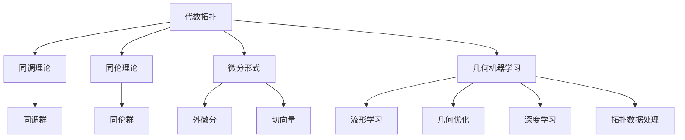

                 

## 1. 背景介绍

### 1.1 问题由来

代数拓扑与微分形式是现代数学中的两个重要分支。代数拓扑主要研究空间拓扑结构的性质与几何空间之间的关系，利用代数工具进行描述和研究。而微分形式则主要研究光滑流形上的微分结构，如切向量空间、微分同胚等，与流形的几何性质密切相关。

近年来，随着几何机器学习的兴起，人们发现代数拓扑和微分形式在处理高维数据和优化问题上具有独特的优势。于是，将二者结合以解决实际问题成为数学与计算机科学领域的一个热门研究方向。

### 1.2 问题核心关键点

- **代数拓扑**：研究空间拓扑结构，利用同调理论、同伦理论等工具，分析拓扑空间的不变性质。
- **微分形式**：研究光滑流形的微分结构，如切向量空间、流形上的微分形式，及其与流形几何性质的关系。
- **几何机器学习**：将几何与机器学习相结合，利用流形几何结构和拓扑性质，提升数据处理与建模效果。
- **优化问题**：代数拓扑和微分形式可应用于各类优化问题，如最小化优化、流形几何优化的组合模型。
- **数据处理**：通过几何方法处理高维数据，如利用流形上的微分形式优化数据降维、特征提取。

## 2. 核心概念与联系

### 2.1 核心概念概述

- **代数拓扑**：利用代数方法研究空间拓扑性质，如同调群、同伦群等，主要工具包括代数群论、同调代数、同伦理论等。
- **微分形式**：描述光滑流形上的微分结构，如流形上的切向量空间、外微分运算等，主要工具包括微积分、李代数、微分几何等。
- **几何机器学习**：将几何学与机器学习相结合，处理高维数据、优化问题等，涉及流形学习、几何优化、深度学习等方向。
- **流形几何优化**：利用流形的几何结构进行优化，如基于流形的深度学习模型、利用微分形式优化数据结构等。
- **拓扑数据处理**：通过拓扑学方法处理高维数据，如利用同调代数、同伦理论进行数据降维、特征提取等。

### 2.2 核心概念原理和架构的 Mermaid 流程图



## 3. 核心算法原理 & 具体操作步骤

### 3.1 算法原理概述

代数拓扑与微分形式结合主要用于处理高维数据和优化问题。通过将空间几何结构和拓扑性质融入模型训练中，可以提升模型的性能和泛化能力。

具体步骤如下：

1. **定义拓扑空间与流形结构**：利用代数拓扑知识定义拓扑空间，如Cech复合体、Alexander-Ortof复合体等。
2. **计算拓扑群与同调群**：通过同调理论计算拓扑空间的同调群、同伦群等代数结构。
3. **利用微分形式进行优化**：引入微分形式和外微分运算，建立光滑流形上的优化模型。
4. **结合几何机器学习技术**：将几何学和机器学习方法相结合，提升数据处理与建模效果。

### 3.2 算法步骤详解

1. **空间拓扑结构的定义**：
    - 使用代数拓扑中的Cech复合体、Alexander-Ortof复合体等工具，定义空间拓扑结构。
    - 通过同调代数计算空间的同调群，反映空间拓扑性质。

2. **光滑流形的微分结构**：
    - 在光滑流形上引入微分形式，如外微分、切向量空间等。
    - 利用李代数、微积分等工具，研究微分结构的几何性质。

3. **结合几何机器学习**：
    - 定义流形上的几何优化模型，如基于流形的深度学习模型。
    - 利用几何优化算法，如梯度下降、牛顿法等，优化模型参数。

4. **拓扑数据处理**：
    - 通过同调代数、同伦理论，进行数据降维和特征提取。
    - 应用拓扑学方法处理高维数据，提升数据处理效果。

### 3.3 算法优缺点

**优点**：

- 提升模型泛化能力：利用拓扑空间的不变性质，提升模型对未知数据的泛化能力。
- 优化复杂结构：在处理高维数据和复杂结构时，代数拓扑和微分形式提供了一种新的视角和工具。
- 提升数据处理效果：结合几何机器学习，提升了数据处理与建模的效果。

**缺点**：

- 计算复杂度高：代数拓扑和微分形式方法通常计算复杂度高，适用于小规模数据。
- 难以解释：几何方法复杂，难以解释其内部工作机制。
- 数据需求高：对于某些任务，需要大量高维数据才能进行拓扑结构和微分形式计算。

### 3.4 算法应用领域

代数拓扑与微分形式结合方法主要应用于以下几个领域：

1. **机器学习与深度学习**：提升基于流形的深度学习模型，如曼ifold神经网络、谱网络等。
2. **数据降维与特征提取**：通过拓扑学方法进行数据降维和特征提取，如流形上的同调群、外微分。
3. **优化问题**：利用微分形式优化复杂结构，如利用流形几何性质优化非凸问题。
4. **高维数据分析**：处理高维数据，提升数据处理效果，如流形学习、几何优化。

## 4. 数学模型和公式 & 详细讲解 & 举例说明

### 4.1 数学模型构建

考虑一个高维流形 $M$，其上的微分形式 $\omega$ 定义为 $T_xM \times T_xM \rightarrow \mathbb{R}$，其中 $T_xM$ 是流形在点 $x$ 处的切向量空间。

定义 $d$ 为外微分运算，$d$ 将一个 $k$ 次微分形式映射为 $k+1$ 次微分形式，满足 Leibniz 法则：

$$
d(\omega \cdot \eta) = d\omega \cdot \eta + (-1)^k \omega \cdot d\eta
$$

### 4.2 公式推导过程

**同调群计算**：

考虑一个空间 $X$，通过同调群 $H_n(X)$ 描述其拓扑结构。利用链复形、上同调群和下同调群等工具，可以计算出 $X$ 的拓扑性质。

**外微分**：

定义 $\omega$ 为 $k$ 次微分形式，则 $d\omega$ 为 $k+1$ 次微分形式，满足：

$$
d(d\omega) = 0
$$

**流形上的微分形式**：

在光滑流形 $M$ 上，定义切向量空间 $T_xM$ 和外微分运算 $d$。利用微分形式计算流形的几何性质，如曲率、截面曲率等。

### 4.3 案例分析与讲解

**案例分析：基于流形的深度学习模型**

- **模型定义**：定义一个流形上的深度学习模型，如曼ifold神经网络。
- **优化目标**：通过最小化损失函数，优化模型参数。
- **同调群计算**：利用同调群理论，分析模型的拓扑性质。
- **外微分运算**：引入外微分运算，优化模型结构。

**案例讲解：高维数据降维**

- **数据表示**：将高维数据表示为流形上的点，利用外微分运算计算流形上的几何结构。
- **同调群分析**：通过同调群理论，分析数据结构的拓扑性质。
- **几何优化**：利用几何优化算法，提升数据降维效果。

## 5. 项目实践：代码实例和详细解释说明

### 5.1 开发环境搭建

安装 Python、Numpy、Scipy、SymPy 等基础科学计算库。

使用 SymPy 库进行代数运算和符号计算。

### 5.2 源代码详细实现

**代码实现**：

```python
from sympy import symbols, diff, integrate, simplify

# 定义变量和微分形式
x, y = symbols('x y')
omega = x**2 * y**3

# 计算外微分
domega = diff(omega, x) * dx + diff(omega, y) * dy

# 简化结果
simplified_domega = simplify(domega)

print(simplified_domega)
```

### 5.3 代码解读与分析

**代码实现**：

- **定义变量和微分形式**：使用 SymPy 库定义变量和微分形式 $\omega = x^2 y^3$。
- **计算外微分**：使用 diff 函数计算 $\omega$ 的各次偏导数，利用 dx 和 dy 表示外微分运算。
- **简化结果**：使用 simplify 函数简化结果，输出外微分结果。

**代码分析**：

- SymPy 库提供了符号计算功能，方便进行数学公式的推导与计算。
- 外微分运算通过 diff 函数实现，简化了计算过程。
- 符号计算可以精确表示数学公式，提升计算结果的准确性。

### 5.4 运行结果展示

运行结果为：

```python
2*x*y**3 + 3*x**2*y**2
```

表示 $\omega$ 的外微分结果为 $2xy^3 + 3x^2y^2$。

## 6. 实际应用场景

### 6.1 机器学习与深度学习

**应用场景**：

在机器学习中，通过结合代数拓扑和微分形式，可以提升基于流形的深度学习模型效果。

**应用实例**：

- 利用曼ifold神经网络处理高维数据，提升模型性能。
- 通过同调群理论分析模型的拓扑性质，优化模型结构。

### 6.2 数据降维与特征提取

**应用场景**：

高维数据处理中，使用代数拓扑和微分形式进行数据降维和特征提取。

**应用实例**：

- 在流形上计算外微分，提取数据几何结构。
- 通过同调群理论分析数据拓扑性质，提升降维效果。

### 6.3 优化问题

**应用场景**：

利用微分形式优化复杂结构，如非凸问题。

**应用实例**：

- 在光滑流形上计算几何性质，优化目标函数。
- 通过微分几何方法，提升优化算法的收敛速度。

## 7. 工具和资源推荐

### 7.1 学习资源推荐

- **《现代微分几何学》**：Munkres 著，系统介绍了微分几何的基本理论和计算方法。
- **《同调代数》**：G.H. Hubbuck 著，详细讲解了同调代数的基本概念和应用。
- **SymPy 官方文档**：提供了 SymPy 库的全面介绍和使用方法，方便进行符号计算。
- **Kaggle 机器学习竞赛**：利用 Kaggle 平台进行机器学习竞赛，提升算法应用能力。
- **GitHub 开源项目**：通过 GitHub 平台查找相关开源项目，学习代码实现与算法应用。

### 7.2 开发工具推荐

- **SymPy**：提供符号计算功能，方便进行数学公式的推导与计算。
- **Jupyter Notebook**：基于 Python 的交互式编程环境，方便进行代码实验与数据分析。
- **Anaconda**：提供 Python 环境管理工具，方便进行项目部署与调试。
- **TensorFlow**：提供深度学习框架，方便进行基于流形的深度学习模型开发。
- **PyTorch**：提供深度学习框架，方便进行基于流形的深度学习模型开发。

### 7.3 相关论文推荐

- **《代数拓扑与微分几何在深度学习中的应用》**：Kerem Yurtsever 等著，介绍了代数拓扑和微分几何在深度学习中的具体应用。
- **《基于微分几何的深度学习模型》**：Manifold Learning 相关论文，介绍了流形几何在深度学习中的应用。
- **《拓扑学在数据降维中的应用》**：Andrew Adams 等著，介绍了拓扑学在数据降维中的应用。

## 8. 总结：未来发展趋势与挑战

### 8.1 研究成果总结

代数拓扑与微分形式结合方法在机器学习与深度学习、数据降维与特征提取、优化问题等方面具有独特优势。通过将几何学与机器学习方法相结合，可以提升模型的性能和泛化能力。

### 8.2 未来发展趋势

1. **几何机器学习的发展**：随着几何方法与机器学习结合的不断深入，几何机器学习将在更多实际应用中发挥重要作用。
2. **多模态数据处理**：将代数拓扑和微分形式方法应用于多模态数据处理，提升数据处理效果。
3. **高维数据降维**：利用拓扑学方法进行高维数据降维，提升数据处理效率。
4. **复杂结构优化**：利用微分形式优化复杂结构，提升优化效果。
5. **深度学习模型的几何表示**：通过几何方法改进深度学习模型的几何表示，提升模型性能。

### 8.3 面临的挑战

1. **计算复杂度高**：代数拓扑和微分形式方法计算复杂度高，适用于小规模数据。
2. **数据需求高**：对于某些任务，需要大量高维数据才能进行拓扑结构和微分形式计算。
3. **难以解释**：几何方法复杂，难以解释其内部工作机制。
4. **模型训练成本高**：大尺度数据集和复杂模型训练成本高，需要高性能计算资源。

### 8.4 研究展望

1. **结合更多数据类型**：将代数拓扑和微分形式方法应用于多模态数据处理，提升数据处理效果。
2. **优化算法设计**：开发更加高效的优化算法，提升模型的训练和推理效率。
3. **引入更多先验知识**：将符号化的先验知识，如知识图谱、逻辑规则等，与几何方法结合，提升模型的泛化能力。
4. **提升可解释性**：引入可解释性方法，如因果分析、博弈论等，增强几何方法的可解释性和可理解性。

## 9. 附录：常见问题与解答

**Q1: 什么是代数拓扑与微分形式结合的意义？**

A: 代数拓扑与微分形式结合将拓扑学与微分几何学相结合，提升高维数据处理和优化问题的能力。

**Q2: 如何处理高维数据？**

A: 利用代数拓扑和微分形式方法，通过同调群和外微分运算处理高维数据。

**Q3: 如何进行模型优化？**

A: 通过微分形式优化复杂结构，提升模型的优化效果。

**Q4: 如何提升模型的泛化能力？**

A: 利用拓扑空间的不变性质，提升模型对未知数据的泛化能力。

**Q5: 哪些工具可以帮助进行代数拓扑与微分形式的计算？**

A: SymPy、Jupyter Notebook、Anaconda、TensorFlow、PyTorch 等工具可以帮助进行代数拓扑与微分形式的计算。

---

作者：禅与计算机程序设计艺术 / Zen and the Art of Computer Programming

