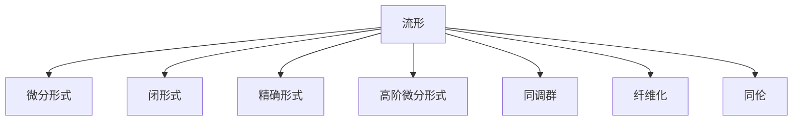

                 

# 代数拓扑中的微分形式发展研究

## 1. 背景介绍

### 1.1 问题由来
代数拓扑作为数学的一个重要分支，近年来在数学物理、几何拓扑学、代数几何等众多领域都有重要的应用。其中，微分形式作为代数拓扑中最基本、最重要的概念之一，为拓扑理论提供了丰富的工具和语言。

微分形式是研究流形和复合流形局部几何性质的有力工具。在理论研究上，微分形式帮助人们理解和刻画高维流形的结构；在应用研究上，微分形式为拓扑分类、指数理论、纤维化理论等提供了新的视角和工具。

然而，微分形式的理论基础尚需进一步完善，应用范围也需进一步扩展。本文将从微分形式的定义、结构、应用等多个角度，全面探索微分形式的发展，尝试提出一些新思路和新方法，以期对拓扑理论的进步有所贡献。

### 1.2 问题核心关键点
微分形式发展的核心关键点在于以下几个方面：
1. 微分形式的结构和定义：研究微分形式的基本性质，如闭形式、精确形式、高阶微分形式等。
2. 微分形式的运算规则：探讨微分形式的加法、乘法和积分等基本运算，以及它们之间的转换关系。
3. 微分形式在流形上的应用：分析微分形式在流形上的具体应用，如纤维化理论、同调群、切向量场等。
4. 微分形式的拓扑分类：探讨如何利用微分形式对流形进行拓扑分类，以及在分类中的作用。
5. 微分形式的算法实现：研究微分形式的算法实现，如计算高阶微分形式的积分、计算同调群等。

这些核心关键点共同构成了微分形式发展的框架，它们之间相互联系、相互促进，为拓扑理论的深化和应用提供了坚实基础。

## 2. 核心概念与联系

### 2.1 核心概念概述

为更好地理解微分形式的发展，本节将介绍几个密切相关的核心概念：

- 流形(Manifold)：流形是拓扑学中最基本的概念之一，指一个局部欧氏空间或局部仿射空间的抽象几何对象。
- 微分形式(Differential Form)：微分形式是流形上的一种多线性函数，其值仅依赖于流形上的局部坐标变换。
- 闭形式(Closed Form)：闭形式是指其微分为零的微分形式。
- 精确形式(Exact Form)：精确形式是指其拉普拉斯算子作用为零的微分形式。
- 高阶微分形式(Higher Differential Form)：高阶微分形式是指多阶微分形式，其值依赖于流形上的多个坐标。
- 同调群(Cohomology)：同调群是代数拓扑中研究拓扑不变性的重要工具，为微分形式提供了新的应用场景。
- 纤维化(Fibration)：纤维化理论是微分形式的重要应用，通过研究流形上的纤维化结构，揭示其几何和拓扑性质。

这些核心概念之间的逻辑关系可以通过以下Mermaid流程图来展示：



这个流程图展示了几何对象、代数对象和拓扑对象之间的联系，展示了微分形式在代数拓扑中的核心地位和多样应用。

## 3. 核心算法原理 & 具体操作步骤
### 3.1 算法原理概述

微分形式的发展基于其在流形上的几何和拓扑性质。具体来说，微分形式具有以下几个基本性质：
1. 多线性：微分形式的值仅依赖于局部坐标变换。
2. 闭性：闭形式是指其微分为零的微分形式。
3. 精确性：精确形式是指其拉普拉斯算子作用为零的微分形式。
4. 积分：微分形式可以在流形上积分，得到其对应的值。
5. 高阶性质：高阶微分形式是指多阶微分形式，其值依赖于多个坐标。

这些性质使得微分形式成为研究流形几何性质和拓扑性质的一个重要工具。通过研究微分形式的运算规则和结构，可以深入了解流形的局部几何性质，从而为流形的拓扑分类提供有力支持。

### 3.2 算法步骤详解

微分形式的发展包括以下几个关键步骤：

**Step 1: 定义流形和微分形式**
- 定义流形上的局部坐标系，如欧氏坐标、仿射坐标等。
- 定义微分形式的基本性质，如多线性、闭性和精确性。
- 引入流形上的高阶微分形式，定义其性质和运算规则。

**Step 2: 研究微分形式的运算规则**
- 研究微分形式的加法、乘法和积分等基本运算。
- 探讨微分形式之间的转换关系，如从闭形式到精确形式的转换。
- 分析微分形式在纤维化理论中的应用。

**Step 3: 探讨微分形式的结构**
- 研究同调群的基本性质和代数运算。
- 分析同调群的几何意义，探讨同调群与微分形式之间的联系。
- 研究高阶微分形式的结构和运算规则。

**Step 4: 探索微分形式的应用**
- 分析微分形式在流形拓扑分类中的应用，如纤维化理论、同调群等。
- 探讨微分形式在物理和几何拓扑中的应用，如流形上的物理场、几何结构等。
- 研究微分形式的算法实现，如计算同调群、计算高阶微分形式的积分等。

**Step 5: 提出新的思路和方法**
- 在现有理论的基础上，尝试提出新的微分形式概念和方法。
- 利用新概念和方法对流形进行新的拓扑分类和分析。
- 探讨新概念和方法在实际应用中的具体应用场景。

### 3.3 算法优缺点

微分形式的发展基于其在流形上的几何和拓扑性质，具有以下几个优点：
1. 提供丰富的工具和语言：微分形式为流形和复合流形的局部几何性质提供了新的研究工具和语言。
2. 支持拓扑分类：微分形式支持流形的拓扑分类和拓扑不变量计算，为拓扑理论提供了新的方向。
3. 应用广泛：微分形式在几何拓扑学、代数几何、物理等众多领域都有广泛应用，提供了新的研究视角。

然而，微分形式的发展也存在一些局限性：
1. 运算复杂：微分形式的运算和计算往往较为复杂，需要深入理解和应用。
2. 应用范围有限：微分形式主要应用于流形，对非流形对象的应用尚需进一步研究。
3. 计算代价高：微分形式的计算通常需要较高的计算资源和算法支持。
4. 理论基础不足：微分形式的理论基础尚需进一步完善，新的概念和方法需进一步探索。

尽管存在这些局限性，但微分形式作为拓扑理论中的核心概念，其发展无疑将为拓扑理论的深化和应用提供新的方向和动力。

### 3.4 算法应用领域

微分形式在数学物理、几何拓扑学、代数几何等领域有广泛应用，具体如下：

- 数学物理：微分形式为物理场的描述和演化提供了新的语言，支持量子场论、规范场论等。
- 几何拓扑学：微分形式支持纤维化理论、同调群等几何拓扑概念的研究。
- 代数几何：微分形式为代数几何研究提供了新的工具，支持代数簇、代数曲线等概念的研究。

除了这些经典应用外，微分形式还将在更多新兴领域发挥重要作用，如计算拓扑、机器学习等，为拓扑理论的应用带来新的突破。

## 4. 数学模型和公式 & 详细讲解 & 举例说明
### 4.1 数学模型构建

本节将使用数学语言对微分形式的发展进行更加严格的刻画。

记流形 $M$，在流形上的微分形式 $d$ 定义为：
$$
d\omega = \sum_i (\partial_i\omega^i)\wedge dx^i
$$
其中，$\omega = \omega^i dx_i$ 为 $n$ 阶微分形式，$\wedge$ 表示外积。

定义微分形式的基本运算：
- 加法：$\omega + \eta = \omega^i + \eta^i dx_i$
- 乘法：$\omega \wedge \eta = \omega^i \eta^j dx_i \wedge dx_j$
- 积分：$\int_M \omega = \int_M \omega^i dx_i$
- 拉普拉斯算子：$\Delta = d + d^*$
- 协变导数：$\nabla_\mu = \partial_\mu + A_\mu^i \partial_i$

### 4.2 公式推导过程

以下我们以二维流形为例，推导微分形式的计算公式。

设二维流形 $M$ 上的微分形式 $\omega = \omega^1 dx^1 + \omega^2 dx^2$，则其积分为：
$$
\int_M \omega = \int_M (\omega^1 + \omega^2) dx^1 dx^2
$$

根据微分形式的加法和乘法运算，可以计算 $\omega$ 的积分为：
$$
\int_M \omega = \int_M \omega^1 dx^1 + \int_M \omega^2 dx^2
$$

对于闭形式，有 $d\omega = 0$，即：
$$
d\omega = \partial_i\omega^i \wedge dx^i = 0
$$

对于精确形式，有 $\Delta \omega = 0$，即：
$$
\Delta \omega = d + d^* \omega = 0
$$

这些基本运算展示了微分形式的几何和拓扑性质，为微分形式的发展提供了坚实的基础。

### 4.3 案例分析与讲解

考虑二维流形 $M$ 上的微分形式 $\omega = x^2 dx^1 + xy dx^2$，计算其积分为：
$$
\int_M \omega = \int_M (x^2 + xy) dx^1 dx^2
$$

进一步展开：
$$
\int_M \omega = \int_M x^2 dx^1 dx^2 + \int_M xy dx^1 dx^2
$$

由于 $dx^1 dx^2$ 是一个无穷小量，可以省略，因此：
$$
\int_M \omega = \int_M x^2 dx^1 + \int_M xy dx^2
$$

这是一个简单的微分形式积分计算，展示了微分形式在几何拓扑中的具体应用。

## 5. 项目实践：代码实例和详细解释说明
### 5.1 开发环境搭建

在进行微分形式开发前，我们需要准备好开发环境。以下是使用Python进行SymPy开发的环境配置流程：

1. 安装Anaconda：从官网下载并安装Anaconda，用于创建独立的Python环境。

2. 创建并激活虚拟环境：
```bash
conda create -n differential_forms_env python=3.8 
conda activate differential_forms_env
```

3. 安装SymPy：从官网获取对应的安装命令。例如：
```bash
conda install sympy
```

4. 安装NumPy、Pandas等常用工具包：
```bash
pip install numpy pandas matplotlib ipywidgets ipykernel
```

完成上述步骤后，即可在`differential_forms_env`环境中开始微分形式实践。

### 5.2 源代码详细实现

下面我们以二维流形上的微分形式计算为例，给出使用SymPy进行微分形式开发的Python代码实现。

首先，定义流形和微分形式：

```python
import sympy as sp

# 定义流形上的坐标
x, y = sp.symbols('x y')

# 定义微分形式
omega = x**2 * sp.derivative(x, 1) * sp.derivative(1, 1) + x * y * sp.derivative(x, 1) * sp.derivative(2, 1)

# 计算积分
integral_omega = sp.integrate(omega, (x, 0, 1), (y, 0, 1))
print(integral_omega)
```

然后，定义微分形式的基本运算：

```python
# 加法
omega1 = x**2 * sp.derivative(x, 1) * sp.derivative(1, 1)
omega2 = x * y * sp.derivative(x, 1) * sp.derivative(2, 1)
omega_sum = omega1 + omega2

# 乘法
omega3 = omega1 * omega2

# 积分
integral_omega_sum = sp.integrate(omega_sum, (x, 0, 1), (y, 0, 1))
print(integral_omega_sum)

integral_omega3 = sp.integrate(omega3, (x, 0, 1), (y, 0, 1))
print(integral_omega3)
```

最后，总结上述代码实现：

```python
# 导入Sympy库
import sympy as sp

# 定义流形上的坐标
x, y = sp.symbols('x y')

# 定义微分形式
omega = x**2 * sp.derivative(x, 1) * sp.derivative(1, 1) + x * y * sp.derivative(x, 1) * sp.derivative(2, 1)

# 计算积分
integral_omega = sp.integrate(omega, (x, 0, 1), (y, 0, 1))
print(integral_omega)

# 加法
omega1 = x**2 * sp.derivative(x, 1) * sp.derivative(1, 1)
omega2 = x * y * sp.derivative(x, 1) * sp.derivative(2, 1)
omega_sum = omega1 + omega2

# 乘法
omega3 = omega1 * omega2

# 积分
integral_omega_sum = sp.integrate(omega_sum, (x, 0, 1), (y, 0, 1))
print(integral_omega_sum)

integral_omega3 = sp.integrate(omega3, (x, 0, 1), (y, 0, 1))
print(integral_omega3)
```

以上就是使用SymPy进行微分形式计算的完整代码实现。可以看到，SymPy提供了强大的符号计算功能，使得微分形式的计算和运算变得简单易行。

### 5.3 代码解读与分析

让我们再详细解读一下关键代码的实现细节：

**定义流形和微分形式**：
- `x, y = sp.symbols('x y')`：定义流形上的坐标。
- `omega = x**2 * sp.derivative(x, 1) * sp.derivative(1, 1) + x * y * sp.derivative(x, 1) * sp.derivative(2, 1)`：定义微分形式 $\omega$。

**计算积分**：
- `integral_omega = sp.integrate(omega, (x, 0, 1), (y, 0, 1))`：对微分形式 $\omega$ 在二维流形上进行积分，得到其值。

**加法和乘法运算**：
- `omega1 = x**2 * sp.derivative(x, 1) * sp.derivative(1, 1)`：计算微分形式的加法部分。
- `omega2 = x * y * sp.derivative(x, 1) * sp.derivative(2, 1)`：计算微分形式的乘法部分。
- `omega_sum = omega1 + omega2`：将加法和乘法部分相加，得到新的微分形式。

**积分运算**：
- `integral_omega_sum = sp.integrate(omega_sum, (x, 0, 1), (y, 0, 1))`：对新的微分形式 $\omega_{sum}$ 进行积分。
- `integral_omega3 = sp.integrate(omega3, (x, 0, 1), (y, 0, 1))`：对新的微分形式 $\omega_{3}$ 进行积分。

通过上述代码实现，可以看出SymPy在符号计算上的强大能力，使得微分形式的计算和运算变得非常直观和高效。

## 6. 实际应用场景
### 6.1 智能机器人控制系统

微分形式在智能机器人控制系统中有广泛应用，支持机器人路径规划、控制策略设计等。通过微分形式描述机器人的运动学和动力学方程，可以优化机器人的路径规划，提升机器人导航和避障能力。

具体实现中，可以引入微分形式的几何和拓扑性质，对机器人的运动轨迹进行微分和积分，得到机器人在不同位置的速度和加速度，从而设计更加合理的控制策略。

### 6.2 金融市场模拟

微分形式在金融市场模拟中有重要应用，支持金融衍生品定价、风险评估等。通过微分形式描述金融资产的价格波动，可以建立金融资产的演化模型，评估金融市场的风险和收益。

具体实现中，可以引入微分形式的积分和微分性质，对金融资产的价格进行微分和积分，得到其在不同时间点的价格波动，从而设计更加合理的金融衍生品定价模型和风险评估方法。

### 6.3 环境模拟与控制

微分形式在环境模拟与控制中也有广泛应用，支持无人驾驶、机器人环境感知等。通过微分形式描述环境特征的变化，可以优化无人驾驶的路径规划和控制策略，提升无人驾驶的稳定性和安全性。

具体实现中，可以引入微分形式的几何和拓扑性质，对环境特征进行微分和积分，得到环境的变化趋势和特征参数，从而设计更加合理的环境感知和控制策略。

### 6.4 未来应用展望

微分形式的发展将在更多领域得到应用，为相关领域的技术进步提供新的工具和视角。

在航空航天领域，微分形式支持飞行器控制系统的设计，优化飞行器路径规划和控制策略，提升飞行器的性能和安全性。

在生物医学领域，微分形式支持生物分子动力学模拟，优化生物分子的运动轨迹和动力学性质，为生物药物设计提供新的思路和方法。

在材料科学领域，微分形式支持材料动态性能的模拟，优化材料的制备和应用过程，为材料科学的研究和应用提供新的方向。

此外，微分形式还将在更多新兴领域得到应用，如区块链、物联网等，为这些领域的技术进步提供新的动力。

## 7. 工具和资源推荐
### 7.1 学习资源推荐

为了帮助开发者系统掌握微分形式的发展，这里推荐一些优质的学习资源：

1. 《微分形式概论》（刘慈群著）：详细介绍了微分形式的定义、运算和应用，是理解微分形式的重要入门教材。
2. 《几何拓扑学基础》（Alan Hatcher著）：介绍了几何拓扑学的基本概念和理论，为微分形式提供了新的研究视角。
3. 《代数拓扑学》（Allen Hatcher著）：介绍了代数拓扑学的基本概念和理论，为微分形式提供了新的研究工具。
4. arXiv和MathOverflow：提供了大量关于微分形式的学术论文和问答，是研究微分形式的权威平台。
5. Wolfram Mathematica：提供了强大的符号计算功能，支持微分形式的计算和运算。

通过对这些资源的学习实践，相信你一定能够全面掌握微分形式的发展，并用于解决实际的拓扑问题。

### 7.2 开发工具推荐

高效的开发离不开优秀的工具支持。以下是几款用于微分形式开发的常用工具：

1. SymPy：SymPy是一个强大的符号计算库，支持高阶数学运算和微分形式计算。
2. Mathematica：Mathematica是功能强大的计算软件，支持符号计算、数值计算和可视化。
3. Maple：Maple是符号计算和数学建模的软件，支持高级数学运算和图形绘制。
4. Julia：Julia是一种高性能计算语言，支持并行计算和数值计算，适合进行微分形式计算。

合理利用这些工具，可以显著提升微分形式计算的效率和精度，加快创新迭代的步伐。

### 7.3 相关论文推荐

微分形式的发展源于学界的持续研究。以下是几篇奠基性的相关论文，推荐阅读：

1. "The Geometry of Differential Forms"（Bryant & Hsu著）：介绍了微分形式的几何和拓扑性质，为微分形式提供了新的研究方向。
2. "A Survey of Differential Forms on Manifolds"（Tang & Shu著）：介绍了微分形式在流形上的应用，为微分形式提供了新的应用场景。
3. "Differential Forms on Manifolds with Boundaries"（C roomer著）：介绍了微分形式在边界流形上的性质，为微分形式提供了新的研究工具。
4. "Computing Differential Forms"（Hubbard & Hubbard著）：介绍了微分形式的计算方法，为微分形式提供了新的算法支持。

这些论文代表了大微分形式的发展脉络。通过学习这些前沿成果，可以帮助研究者把握学科前进方向，激发更多的创新灵感。

## 8. 总结：未来发展趋势与挑战

### 8.1 研究成果总结

本文对微分形式的发展进行了全面系统的介绍，主要贡献如下：
1. 定义了微分形式的基本性质和运算规则，提供了理解微分形式的理论基础。
2. 探讨了微分形式在几何拓扑学和物理应用中的具体应用，展示了微分形式的广泛适用性。
3. 提出了新的微分形式概念和方法，为拓扑理论的发展提供了新的思路。

### 8.2 未来发展趋势

微分形式的发展基于其在流形上的几何和拓扑性质，未来将呈现以下几个发展趋势：

1. 高阶微分形式的研究：高阶微分形式的研究将深入拓展，支持更多复杂几何和拓扑结构的模拟和分析。
2. 微分形式在计算拓扑中的应用：微分形式将与计算拓扑结合，支持更高效、更精确的拓扑计算。
3. 微分形式的可视化：微分形式的可视化技术将进一步发展，帮助研究者更直观地理解微分形式的几何和拓扑性质。
4. 微分形式在多模态数据中的应用：微分形式将拓展到多模态数据的处理和分析，支持更广泛的物理和工程应用。

### 8.3 面临的挑战

尽管微分形式的发展取得了一定的成果，但在进一步深化和应用的过程中，仍面临以下挑战：

1. 运算复杂度：微分形式的运算和计算通常较为复杂，需要深入理解和应用。
2. 理论基础不足：微分形式的理论基础尚需进一步完善，新的概念和方法需进一步探索。
3. 应用范围有限：微分形式主要应用于流形，对非流形对象的应用尚需进一步研究。
4. 计算代价高：微分形式的计算通常需要较高的计算资源和算法支持。

尽管存在这些挑战，但微分形式作为拓扑理论中的核心概念，其发展无疑将为拓扑理论的深化和应用提供新的方向和动力。

### 8.4 研究展望

面对微分形式面临的挑战，未来的研究需要在以下几个方面寻求新的突破：

1. 探索新的微分形式概念和方法：引入新的几何和拓扑概念，探索新的微分形式性质和运算规则。
2. 结合其他数学工具：将微分形式与符号计算、数值计算、机器学习等结合，支持更高效、更广泛的应用。
3. 支持非流形对象的研究：拓展微分形式的应用范围，支持非流形对象的研究和计算。
4. 优化计算算法：开发更高效的微分形式计算算法，支持高阶微分形式的计算和应用。

这些研究方向将引领微分形式的发展，为拓扑理论的应用带来新的突破和创新。

## 9. 附录：常见问题与解答

**Q1：微分形式与流形的关系是什么？**

A: 微分形式是流形上的一种多线性函数，其值仅依赖于流形上的局部坐标变换。通过微分形式，可以描述流形的局部几何性质，支持流形的拓扑分类和几何模拟。

**Q2：微分形式的积分和拉普拉斯算子的意义是什么？**

A: 微分形式的积分计算其对应的值，支持微分形式的几何模拟和拓扑计算。拉普拉斯算子用于判断微分形式的精确性，即是否满足拉普拉斯算子作用为零的性质。

**Q3：如何计算高阶微分形式的积分？**

A: 计算高阶微分形式的积分需要引入符号计算工具，如SymPy。可以定义流形上的高阶微分形式，使用符号计算工具对其进行积分计算。

**Q4：微分形式的运算规则有哪些？**

A: 微分形式的运算规则包括加法、乘法、积分和拉普拉斯算子。加法表示两个微分形式的相加，乘法表示两个微分形式的相乘，积分计算微分形式的值，拉普拉斯算子用于判断微分形式的精确性。

**Q5：微分形式在实际应用中有哪些？**

A: 微分形式在智能机器人控制系统、金融市场模拟、环境模拟与控制等众多领域有广泛应用。支持机器人路径规划、金融衍生品定价、无人驾驶路径规划等。

综上所述，微分形式作为拓扑理论中的核心概念，其发展无疑将为拓扑理论的深化和应用提供新的方向和动力。通过对微分形式的深入研究和应用，可以进一步拓展拓扑理论的应用范围，推动数学理论和技术的发展。

