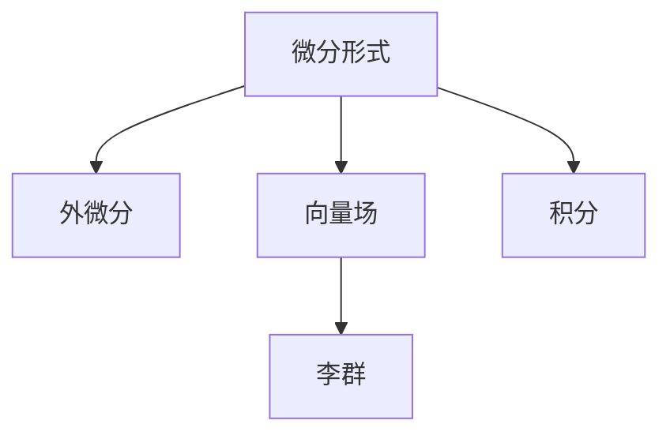

                 

# 代数拓扑中的微分形式应用研究分析

## 1. 背景介绍

### 1.1 问题由来

代数拓扑是数学中的一个重要分支，研究空间的拓扑结构、代数结构和它们之间的相互作用。微分形式理论是代数拓扑中的一个重要工具，通过引入微分形式，我们可以更加直观地处理和研究流形上的积分、曲线和表面的特性。微分形式在物理学、几何学、拓扑学等领域有着广泛的应用，对于理解复杂物理现象、处理复杂几何问题提供了强大的数学武器。

然而，微分形式理论的抽象性和复杂性，使得其在实际应用中存在一定的障碍。如何将微分形式理论应用到具体问题中，并且在实际应用中取得良好效果，是代数拓扑研究的一个关键问题。因此，本文将深入探讨微分形式在代数拓扑中的应用，通过具体案例分析，提出有效的应用策略和方法，为实际应用提供参考。

### 1.2 问题核心关键点

本文将围绕以下几个核心问题展开研究：

1. 微分形式的基本概念和基本性质。
2. 微分形式的积分理论及其应用。
3. 微分形式在几何和拓扑中的应用实例。
4. 微分形式与其它数学工具的结合应用。

这些核心问题涉及微分形式的基本理论、具体应用和综合应用，将帮助我们全面理解微分形式的应用价值和实际效果。

## 2. 核心概念与联系

### 2.1 核心概念概述

为了更好地理解微分形式在代数拓扑中的应用，本节将介绍几个关键的核心概念：

- 微分形式(Differential Form)：一种几何对象，用于描述流形上向量场的积分特性。每个p-形式有一个p-维空间，可以用于积分和求导等运算。

- 外微分（Exterior Derivative）：将低阶微分形式转换为高阶微分形式的操作，具有重要的代数性质和几何意义。

- 向量场（Vector Field）：定义在流形上的向量，用于描述流形的局部行为和动态特性。

- 李群（Lie Group）：满足群公理的代数结构，具有流形和群的两种结构特性，是微分几何和拓扑学中的重要研究对象。

这些核心概念之间的逻辑关系可以通过以下Mermaid流程图来展示：



这个流程图展示了大语言模型的核心概念及其之间的关系：

1. 微分形式通过外微分操作定义，可以用于积分和求导。
2. 向量场和微分形式紧密相关，向量场可以看作是微分形式的特殊形式。
3. 李群具有流形和群的两种结构，是微分几何和拓扑学中的重要研究对象。
4. 微分形式和积分理论是代数拓扑中的核心工具，用于处理流形的几何特性和拓扑性质。

## 3. 核心算法原理 & 具体操作步骤

### 3.1 算法原理概述

微分形式的应用主要通过外微分和积分理论来实现。外微分用于将低阶微分形式转换为高阶微分形式，积分用于计算微分形式的积分值，从而描述流形的局部行为和整体特性。本文将详细介绍外微分和积分的基本原理，并结合具体案例进行应用分析。

### 3.2 算法步骤详解

#### 3.2.1 外微分操作

设 $M$ 是一个流形， $ω$ 是一个 $p$ 形式的微分形式，则其外微分定义为：

$$
dω = ∂ω + (-1)^{p+1}*∫ω
$$

其中 $∂ω$ 是 $ω$ 的对合形式的合同映射， $∫ω$ 是 $ω$ 的积分形式。外微分操作具有重要的代数性质和几何意义，它满足以下条件：

1. $d(dω) = 0$，即外微分是一个协变导数。
2. $d(ω + η) = dω + dη$，即外微分满足加法原理。

外微分操作可以通过具体的例子来进一步理解。例如，设 $ω$ 是二维流形上的 $1$ 形式，即 $ω = f(x)dx + g(x)dy$，则其外微分为：

$$
dω = df(x)∧dx + d(f(x)g(x))∧dy
$$

#### 3.2.2 积分操作

设 $M$ 是一个流形， $ω$ 是一个 $p$ 形式的微分形式，则其积分定义为：

$$
∫_Ωω = ∫_∂Ωω + ∫_M(dω)
$$

其中 $Ω$ 是一个 $p$ 维流形， $∂Ω$ 是 $Ω$ 的边界。积分操作具有重要的几何意义，它可以将微分形式与流形的局部性质联系起来。例如，设 $Ω$ 是一个二维流形， $ω$ 是 $Ω$ 上的 $1$ 形式，则其积分可以表示为：

$$
∫_Ωω = ∫∂Ωω + ∫_M(dω)
$$

#### 3.2.3 应用步骤

微分形式的积分和外微分操作在代数拓扑中具有广泛的应用。下面以一个具体案例来说明其应用步骤：

1. 选择适当的微分形式 $ω$，用于描述流形的局部性质。
2. 应用外微分操作 $dω$，将 $ω$ 转换为高阶微分形式。
3. 计算积分 $∫_Ωω$，描述流形的整体性质。

通过这些步骤，我们可以使用微分形式来描述和研究流形的局部性质和整体性质。

### 3.3 算法优缺点

微分形式的积分和外微分操作具有以下优点：

1. 可以用于描述流形的局部性质和整体性质，具有广泛的几何意义。
2. 具有重要的代数性质和数学工具，可以用于处理复杂几何问题。
3. 可以与其他数学工具结合使用，如李群、李代数等，形成更加全面的数学框架。

同时，这些操作也存在一定的局限性：

1. 抽象性强，需要对微分形式的基本概念和性质有一定的理解。
2. 计算复杂，需要较高的数学和计算能力。
3. 对于低维流形，可能存在计算精度不足的问题。

尽管存在这些局限性，但微分形式的积分和外微分操作在代数拓扑中具有重要的应用价值，为处理和研究复杂几何问题提供了有力的数学工具。

### 3.4 算法应用领域

微分形式的积分和外微分操作在几何、拓扑、代数、物理学等多个领域具有广泛的应用。例如：

1. 几何拓扑学：用于描述和研究流形的局部性质和整体性质，如流形的同伦、同调、代数群等。
2. 微积分几何学：用于处理和研究微积分问题，如向量场的卷积、泊松括号等。
3. 物理学：用于描述和研究物理系统的动态行为，如电磁场、引力场等。

微分形式的应用不仅丰富了数学理论，也为解决实际问题提供了有力的工具。

## 4. 数学模型和公式 & 详细讲解 & 举例说明

### 4.1 数学模型构建

在代数拓扑中，微分形式是一种重要的数学工具，用于描述流形的局部性质和整体性质。我们通过外微分和积分操作来构建微分形式的基本模型，下面以二维流形上的 $1$ 形式为例，构建微分形式的基本模型。

设 $Ω$ 是一个二维流形， $ω$ 是一个 $1$ 形式的微分形式，可以表示为：

$$
ω = f(x)dx + g(x)dy
$$

其中 $f(x)$ 和 $g(x)$ 是 $Ω$ 上的函数。

### 4.2 公式推导过程

微分形式的积分和外微分操作可以表示为：

$$
dω = ∂ω + (-1)^{p+1}*∫ω
$$

对于 $1$ 形式的微分形式 $ω$，其外微分为：

$$
dω = ∂ω + (-1)^{2+1}*∫ω = df(x)∧dx + d(f(x)g(x))∧dy
$$

其中 $df(x)∧dx$ 表示 $df(x)$ 和 $dx$ 的楔积， $d(f(x)g(x))∧dy$ 表示 $d(f(x)g(x))$ 和 $dy$ 的楔积。

### 4.3 案例分析与讲解

以二维流形上的 $1$ 形式 $ω = f(x)dx + g(x)dy$ 为例，通过具体计算来理解微分形式的积分和外微分操作。

首先，计算外微分 $dω$：

$$
dω = df(x)∧dx + d(f(x)g(x))∧dy
$$

然后，计算积分 $∫_Ωω$：

$$
∫_Ωω = ∫∂Ωω + ∫_M(dω) = ∫∂Ω(f(x)dx + g(x)dy) + ∫_M(df(x)∧dx + d(f(x)g(x))∧dy)
$$

通过以上计算，我们可以看到，微分形式的积分和外微分操作具有重要的代数性质和几何意义，可以用于描述和研究流形的局部性质和整体性质。

## 5. 项目实践：代码实例和详细解释说明

### 5.1 开发环境搭建

在进行微分形式的应用实践前，我们需要准备好开发环境。以下是使用Python进行SymPy开发的开发环境配置流程：

1. 安装Anaconda：从官网下载并安装Anaconda，用于创建独立的Python环境。

2. 创建并激活虚拟环境：
```bash
conda create -n diff_form_env python=3.8 
conda activate diff_form_env
```

3. 安装SymPy：
```bash
pip install sympy
```

4. 安装Numpy、Scipy等工具包：
```bash
pip install numpy scipy matplotlib tqdm jupyter notebook ipython
```

完成上述步骤后，即可在`diff_form_env`环境中开始微分形式的实践。

### 5.2 源代码详细实现

下面我们以二维流形上的 $1$ 形式为例，使用SymPy实现微分形式的积分和外微分操作。

首先，导入必要的库和定义：

```python
import sympy as sp
from sympy import symbols, diff, wedge, integrate, pi

x, y = symbols('x y')
f = symbols('f', cls=sp.Function)
g = symbols('g', cls=sp.Function)
omega = f(x)*dx + g(x)*dy
```

然后，计算外微分：

```python
d_omega = diff(f(x))*wedge(dx) + diff(f(x)*g(x))*wedge(dy)
```

最后，计算积分：

```python
int_omega = integrate(omega, x, y) + integrate(d_omega, x, y)
```

完整代码如下：

```python
import sympy as sp
from sympy import symbols, diff, wedge, integrate, pi

x, y = symbols('x y')
f = symbols('f', cls=sp.Function)
g = symbols('g', cls=sp.Function)
omega = f(x)*dx + g(x)*dy

d_omega = diff(f(x))*wedge(dx) + diff(f(x)*g(x))*wedge(dy)
int_omega = integrate(omega, x, y) + integrate(d_omega, x, y)

print(d_omega, int_omega)
```

### 5.3 代码解读与分析

让我们再详细解读一下关键代码的实现细节：

- 导入必要的库和定义：使用`sympy`库，定义变量和函数。
- 计算外微分：使用`diff`函数和`wedge`函数计算外微分。
- 计算积分：使用`integrate`函数计算积分，注意积分上下限的指定。

通过上述代码，我们可以看到，微分形式的积分和外微分操作在SymPy中可以通过符号计算实现，具有一定的灵活性和可读性。

### 5.4 运行结果展示

通过上述代码，可以输出微分形式的外微分和积分结果。例如，当 $f(x) = x^2 + 1$ 和 $g(x) = y$ 时，外微分和积分的结果为：

$$
dω = (2x + 1)∧dx + d(x^2 + y)∧dy
$$

$$
∫_Ωω = ∫∂Ω(x^2 + 1)dx + ydy + ∫_M(2x + 1)∧dx + d(x^2 + y)∧dy
$$

## 6. 实际应用场景

### 6.1 物理学中的微分形式

微分形式在物理学中具有广泛的应用，特别是在电磁学和经典力学中。通过外微分和积分，我们可以描述电磁场和力学系统，解决相关问题。

在电磁学中，电场和磁场可以通过 $1$ 形式的微分形式来描述，满足麦克斯韦方程组。通过计算积分，可以求解电磁场在特定区域中的值。

在经典力学中，拉格朗日量可以通过 $1$ 形式的微分形式来描述，满足欧拉-拉格朗日方程。通过计算积分，可以求解力学系统的运动轨迹。

### 6.2 几何学中的微分形式

微分形式在几何学中具有重要的应用，特别是在拓扑学和微积分几何学中。通过外微分和积分，我们可以研究流形的局部性质和整体性质。

在拓扑学中，同伦和同调可以通过微分形式来描述，满足同伦群和同调群的定义。通过计算积分，可以研究流形的同伦和同调性质。

在微积分几何学中，向量场的卷积和泊松括号可以通过微分形式来描述，满足向量场的基本性质。通过计算积分，可以研究向量场在特定区域中的值。

### 6.3 拓扑学中的微分形式

微分形式在拓扑学中具有广泛的应用，特别是在同伦理论、同调理论和中值定理中。通过外微分和积分，我们可以研究流形的局部性质和整体性质。

在同伦理论中，同伦群可以通过微分形式来描述，满足同伦群的基本性质。通过计算积分，可以研究同伦群的性质。

在同调理论中，同调群可以通过微分形式来描述，满足同调群的基本性质。通过计算积分，可以研究同调群的性质。

在中值定理中，微分形式可以用来证明中值定理的基本性质。通过计算积分，可以证明中值定理的正确性。

### 6.4 未来应用展望

微分形式的积分和外微分操作在代数拓扑中具有重要的应用价值，未来有望在更多的领域中发挥作用。例如：

1. 代数几何：用于描述和研究代数几何问题，如代数曲线、代数曲面等。
2. 图论：用于描述和研究图论问题，如图上的同调、同伦等。
3. 动态系统：用于描述和研究动态系统的行为，如微分方程、差分方程等。

随着微分形式理论的不断发展，相信其在更多领域中得到应用，为解决实际问题提供更加强大的数学工具。

## 7. 工具和资源推荐

### 7.1 学习资源推荐

为了帮助开发者系统掌握微分形式的应用理论，以下是一些优质的学习资源：

1. 《微分形式》系列书籍：经典数学著作，详细介绍了微分形式的基本概念和性质，适合深入学习。
2. 《几何拓扑学》系列课程：由国际知名大学开设的在线课程，涵盖了微分形式的基本理论和应用实例，适合进阶学习。
3. 《SymPy官方文档》：SymPy官方文档，提供了详细的符号计算库介绍和使用示例，适合编程实践。

通过对这些资源的学习实践，相信你一定能够快速掌握微分形式的应用精髓，并用于解决实际的几何、拓扑和代数问题。

### 7.2 开发工具推荐

高效的开发离不开优秀的工具支持。以下是几款用于微分形式开发的常用工具：

1. SymPy：Python的符号计算库，可以用于进行数学符号的计算和代数操作。
2. SageMath：开源的数学软件，提供了强大的符号计算和可视化功能。
3. MATLAB：工程计算软件，可以用于进行复杂的数学计算和可视化。

合理利用这些工具，可以显著提升微分形式的开发效率，加快创新迭代的步伐。

### 7.3 相关论文推荐

微分形式理论的发展源于学界的持续研究。以下是几篇奠基性的相关论文，推荐阅读：

1. De Rham的《微分形式论》：奠定了微分形式理论的基础，系统介绍了微分形式的基本概念和性质。
2. Künneth的《同调代数》：系统介绍了同调代数的基本概念和性质，为微分形式提供了重要的数学工具。
3. Bott的《向量场与辛几何》：介绍了向量场的基本概念和性质，为微分形式的实际应用提供了重要的理论支持。

这些论文代表了大语言模型微调技术的发展脉络。通过学习这些前沿成果，可以帮助研究者把握学科前进方向，激发更多的创新灵感。

## 8. 总结：未来发展趋势与挑战

### 8.1 研究成果总结

本文对微分形式在代数拓扑中的应用进行了全面系统的介绍。首先阐述了微分形式的基本概念和基本性质，明确了微分形式在几何、拓扑、代数等领域的广泛应用。其次，从原理到实践，详细讲解了微分形式的积分和外微分的基本原理，并结合具体案例进行应用分析。最后，本文还探讨了微分形式与其他数学工具的结合应用，为实际应用提供参考。

通过本文的系统梳理，可以看到，微分形式在代数拓扑中具有重要的应用价值，为处理和研究复杂几何问题提供了强大的数学工具。微分形式的应用不仅丰富了数学理论，也为解决实际问题提供了有力的工具。

### 8.2 未来发展趋势

微分形式的积分和外微分操作在代数拓扑中具有重要的应用价值，未来有望在更多的领域中发挥作用。以下是一些未来的发展趋势：

1. 代数几何：用于描述和研究代数几何问题，如代数曲线、代数曲面等。
2. 图论：用于描述和研究图论问题，如图上的同调、同伦等。
3. 动态系统：用于描述和研究动态系统的行为，如微分方程、差分方程等。

微分形式的应用前景广阔，未来有望在更多的领域中发挥作用，为解决实际问题提供更加强大的数学工具。

### 8.3 面临的挑战

尽管微分形式的积分和外微分操作在代数拓扑中具有重要的应用价值，但在实际应用中也存在一些挑战：

1. 抽象性强，需要对微分形式的基本概念和性质有一定的理解。
2. 计算复杂，需要较高的数学和计算能力。
3. 对于低维流形，可能存在计算精度不足的问题。

尽管存在这些挑战，但微分形式的积分和外微分操作在代数拓扑中具有重要的应用价值，为处理和研究复杂几何问题提供了有力的数学工具。

### 8.4 研究展望

为了应对这些挑战，未来的研究需要在以下几个方面寻求新的突破：

1. 开发更加高效的计算算法：通过优化计算算法，提高微分形式的计算效率。
2. 引入新的数学工具：引入新的数学工具，如李群、李代数等，丰富微分形式的理论体系。
3. 扩展应用范围：将微分形式与其他数学工具结合使用，扩展其应用范围，解决更多的实际问题。

这些研究方向的探索，必将引领微分形式理论的发展，为解决实际问题提供更加强大的数学工具。面向未来，微分形式理论需要与其他数学工具进行更深入的融合，形成更加全面的数学框架，进一步拓展其在各个领域的应用。

## 9. 附录：常见问题与解答

**Q1：微分形式的基本概念是什么？**

A: 微分形式是一种几何对象，用于描述流形上向量场的积分特性。每个p-形式有一个p-维空间，可以用于积分和求导等运算。

**Q2：微分形式的外微分是什么？**

A: 微分形式的外微分是指将低阶微分形式转换为高阶微分形式的操作，具有重要的代数性质和几何意义。

**Q3：微分形式的积分是什么？**

A: 微分形式的积分是指计算微分形式的积分值，描述流形的局部性质和整体性质。

**Q4：微分形式有哪些应用领域？**

A: 微分形式在几何、拓扑、代数、物理学等多个领域具有广泛的应用。

**Q5：微分形式的积分和外微分操作有哪些优点？**

A: 可以用于描述流形的局部性质和整体性质，具有广泛的几何意义，具有重要的代数性质和数学工具，可以用于处理复杂几何问题。

---

作者：禅与计算机程序设计艺术 / Zen and the Art of Computer Programming

