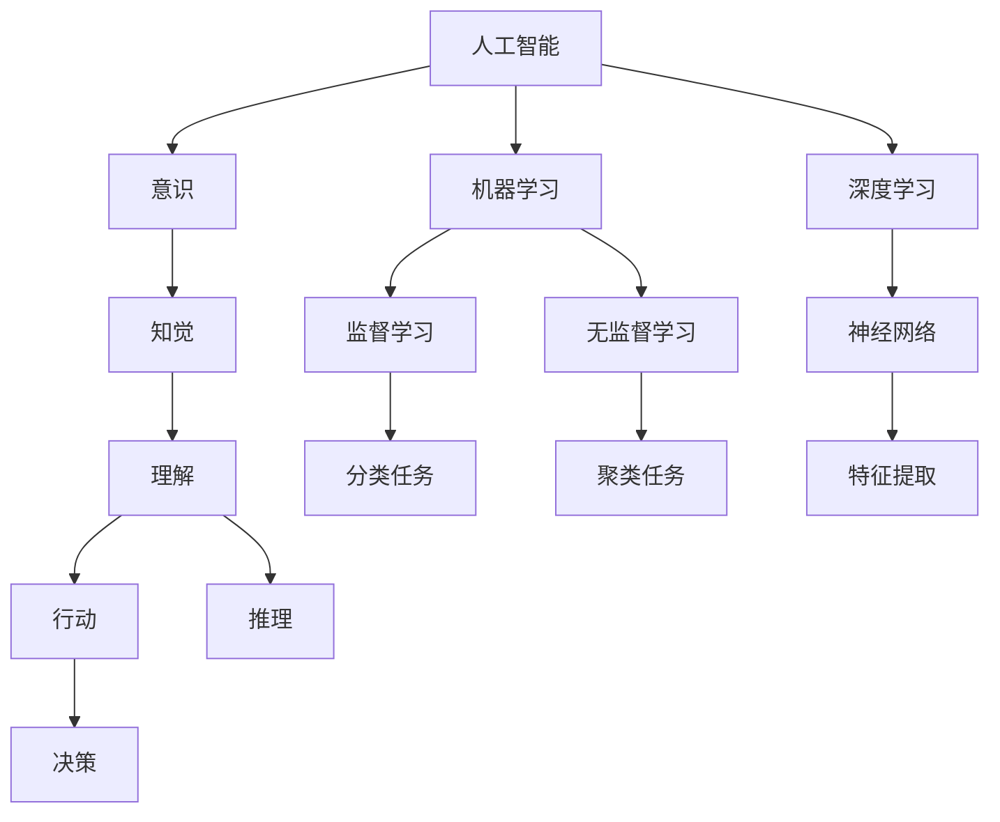

                 

# 价值标准在意识功能中的应用

## 1. 背景介绍

### 1.1 问题由来
人类社会的复杂性在不断增加，如何在大量数据中提取价值，并应用这些价值构建具有意识功能的智能系统，成为了当前人工智能领域的核心问题。虽然人工智能技术在各个领域得到了广泛应用，但如何在智能系统中融入人类的价值判断，使系统具备类似人类的决策和思考能力，仍然是人工智能研究的重大挑战。

### 1.2 问题核心关键点
目前，人工智能系统在处理大量数据和复杂任务时，往往依赖于机器学习算法和大规模数据训练，缺乏对人类价值标准的理解和应用。这导致了人工智能系统在做出决策时，无法充分考虑人类社会的伦理、道德和价值标准。如何在人工智能系统中融入价值标准，构建具备意识功能的智能系统，成为了本研究的核心问题。

## 2. 核心概念与联系

### 2.1 核心概念概述
为更好地理解价值标准在人工智能系统中的应用，本节将介绍几个密切相关的核心概念：

- 人工智能(Artificial Intelligence, AI)：通过计算机程序模拟人类智能的学科，包括知识表示、推理、学习、自然语言处理等技术。
- 机器学习(Machine Learning, ML)：使用算法和统计模型，使计算机系统从数据中自动学习规律和模式。
- 深度学习(Deep Learning, DL)：基于神经网络的多层非线性学习算法，用于处理复杂的数据和模式识别任务。
- 意识(Consciousness)：人类对自己状态和环境的感知和自我认知能力。
- 价值标准(Values)：指导人类行为和决策的伦理和道德准则，如公平、正义、人性等。
- 知觉(Perception)：人类对外部世界的感官输入进行解释和理解的过程。
- 理解(Understanding)：在知觉的基础上，对信息进行推理和认知的过程。
- 行动(Action)：基于理解做出决策和执行任务的过程。

这些核心概念之间的逻辑关系可以通过以下Mermaid流程图来展示：



这个流程图展示了一些关键概念及其之间的关系：

1. 人工智能通过机器学习和深度学习算法从数据中学习规律和模式，逐步实现知觉、理解和行动等意识功能。
2. 深度学习特别是神经网络，是实现知觉和理解的关键技术。
3. 机器学习中的监督学习和无监督学习分别对应分类和聚类任务，为意识的各个层面提供数据支持。
4. 意识功能中，知觉对应感知，理解对应推理，行动对应决策。

## 3. 核心算法原理 & 具体操作步骤

### 3.1 算法原理概述

价值标准在人工智能系统中的应用，本质上是通过机器学习模型对人类的价值判断进行学习，并应用这些价值判断来指导系统的决策和行为。其核心思想是：

- 构建一个包含价值标准的训练集，用于训练模型。
- 使用机器学习算法（如神经网络）从训练集中学习这些价值标准。
- 在应用时，将新的数据输入模型，模型根据已学习的价值标准进行推理和决策。

### 3.2 算法步骤详解

基于价值标准的人工智能系统通常包括以下几个关键步骤：

**Step 1: 构建价值标准训练集**
- 收集与任务相关的数据集，例如医疗数据、司法数据、社交媒体数据等。
- 从数据集中筛选出具有代表性的样本，并对这些样本进行标注，标注内容包括符合和不符合价值标准的标签。

**Step 2: 选择机器学习模型**
- 根据任务特点选择合适的机器学习模型，如神经网络、决策树、支持向量机等。
- 确定模型的架构，如网络层数、节点数量等。

**Step 3: 训练模型**
- 使用Step 1构建的价值标准训练集，对模型进行训练。
- 根据训练集中的标注数据，计算损失函数，优化模型参数。

**Step 4: 应用模型进行决策**
- 将新数据输入模型，模型根据学习到的价值标准进行推理和决策。
- 如果模型为分类模型，可输出符合和不符合价值标准的概率；如果是回归模型，可输出符合价值标准的预测值。

**Step 5: 评估和优化**
- 对模型的推理结果进行评估，确保符合人类价值标准。
- 根据评估结果，调整模型参数，优化模型性能。

### 3.3 算法优缺点

基于价值标准的人工智能系统具有以下优点：
1. 提高决策的公平性和透明性。通过学习人类的价值标准，系统决策过程更加透明，符合伦理和道德准则。
2. 适应性更强。学习到的价值标准可以适应不同情境和任务，提高系统的通用性和适用性。
3. 可扩展性高。模型可以不断更新，学习新的价值标准，满足新出现的伦理和道德需求。

同时，该方法也存在一定的局限性：
1. 数据质量依赖性强。系统的性能依赖于数据集的质量，如果标注数据存在偏差或错误，模型的性能可能受到影响。
2. 学习效率较低。由于涉及到人类的价值标准，模型的训练过程可能更加复杂，需要大量的时间和计算资源。
3. 缺乏自适应性。模型无法主动识别和处理新出现的伦理和道德问题，需要人为干预和调整。

尽管存在这些局限性，但基于价值标准的人工智能系统为构建具有意识功能的智能系统提供了新的思路，值得深入研究和探索。

### 3.4 算法应用领域

基于价值标准的人工智能系统在各个领域都有广泛的应用前景：

- 医疗健康：在医疗决策中应用价值标准，如诊断、治疗方案推荐等，确保医疗决策符合伦理和道德。
- 金融行业：在风险评估、信用评分等金融决策中应用价值标准，保障金融服务的公平性和透明性。
- 环境保护：在环境监测、污染治理等任务中应用价值标准，确保环境保护措施符合可持续发展理念。
- 法律司法：在司法判决、法律咨询等任务中应用价值标准，保障法律公正性和合法性。
- 教育培训：在教育评估、课程设计等任务中应用价值标准，提高教育质量和公平性。
- 社会治理：在公共政策、社会管理等任务中应用价值标准，提升社会治理水平和公信力。

这些领域的应用展示了价值标准在人工智能系统中的重要性，为人工智能的伦理和社会责任提供了新的方向。

## 4. 数学模型和公式 & 详细讲解 & 举例说明

### 4.1 数学模型构建

本节将使用数学语言对基于价值标准的人工智能系统进行更加严格的刻画。

记价值标准训练集为 $D=\{(x_i, y_i)\}_{i=1}^N$，其中 $x_i$ 为输入数据，$y_i$ 为价值标准标签。假设模型为神经网络 $M_{\theta}$，其中 $\theta$ 为模型参数。

定义损失函数为交叉熵损失函数，表示模型预测结果与真实标签之间的差异：

$$
\ell(M_{\theta}(x),y) = -[y\log M_{\theta}(x) + (1-y)\log(1-M_{\theta}(x))]
$$

其中 $M_{\theta}(x)$ 为模型在输入 $x$ 上的输出，即模型对价值标准的预测概率。

### 4.2 公式推导过程

以下是价值标准训练过程中损失函数的推导过程：

设训练集为 $D=\{(x_i, y_i)\}_{i=1}^N$，其中 $x_i$ 为输入数据，$y_i$ 为价值标准标签。定义模型 $M_{\theta}$ 为神经网络，其中 $\theta$ 为模型参数。

根据交叉熵损失函数的定义，模型在训练集 $D$ 上的损失函数为：

$$
\mathcal{L}(\theta) = -\frac{1}{N}\sum_{i=1}^N \ell(M_{\theta}(x_i),y_i) = -\frac{1}{N}\sum_{i=1}^N [-y_i\log M_{\theta}(x_i) - (1-y_i)\log(1-M_{\theta}(x_i))]
$$

通过梯度下降等优化算法，最小化损失函数 $\mathcal{L}(\theta)$，优化模型参数 $\theta$，使其在输入数据 $x$ 上的输出 $M_{\theta}(x)$ 逼近真实标签 $y$。

### 4.3 案例分析与讲解

以医疗健康领域的应用为例，假设系统需要判断患者是否需要接受某种治疗。

- 数据集收集：收集患者的病历、治疗历史、生命体征等数据。
- 价值标准标注：标注哪些情况下患者应该接受治疗，哪些情况下不应该接受治疗。
- 选择模型：使用深度神经网络模型，如卷积神经网络(CNN)或循环神经网络(RNN)。
- 训练模型：使用上述数据集，训练模型对患者情况进行分类，判断是否需要治疗。
- 应用模型：将新患者的数据输入模型，模型根据训练得到的价值标准进行分类，输出是否需要治疗的建议。

## 5. 项目实践：代码实例和详细解释说明

### 5.1 开发环境搭建

在进行价值标准应用开发前，我们需要准备好开发环境。以下是使用Python进行TensorFlow开发的环境配置流程：

1. 安装Anaconda：从官网下载并安装Anaconda，用于创建独立的Python环境。

2. 创建并激活虚拟环境：
```bash
conda create -n tf-env python=3.8 
conda activate tf-env
```

3. 安装TensorFlow：根据CUDA版本，从官网获取对应的安装命令。例如：
```bash
pip install tensorflow
```

4. 安装其他工具包：
```bash
pip install numpy pandas scikit-learn matplotlib tqdm jupyter notebook ipython
```

完成上述步骤后，即可在`tf-env`环境中开始开发实践。

### 5.2 源代码详细实现

下面以医疗健康领域的应用为例，给出使用TensorFlow构建价值标准分类模型的PyTorch代码实现。

首先，定义数据处理函数：

```python
import tensorflow as tf
import numpy as np
from tensorflow.keras import datasets, layers, models

def load_data():
    (x_train, y_train), (x_test, y_test) = datasets.cifar10.load_data()
    x_train, x_test = x_train / 255.0, x_test / 255.0
    y_train = tf.keras.utils.to_categorical(y_train)
    y_test = tf.keras.utils.to_categorical(y_test)
    return (x_train, y_train), (x_test, y_test)
```

然后，定义模型和优化器：

```python
(x_train, y_train), (x_test, y_test) = load_data()

model = models.Sequential([
    layers.Conv2D(32, (3, 3), activation='relu', input_shape=(32, 32, 3)),
    layers.MaxPooling2D((2, 2)),
    layers.Conv2D(64, (3, 3), activation='relu'),
    layers.MaxPooling2D((2, 2)),
    layers.Conv2D(64, (3, 3), activation='relu'),
    layers.Flatten(),
    layers.Dense(64, activation='relu'),
    layers.Dense(10, activation='softmax')
])

optimizer = tf.keras.optimizers.Adam(learning_rate=0.001)
```

接着，定义训练和评估函数：

```python
def train(model, data, epochs=10):
    loss_fn = tf.keras.losses.CategoricalCrossentropy()
    metric_fn = tf.keras.metrics.CategoricalAccuracy()

    for epoch in range(epochs):
        for features, labels in data:
            with tf.GradientTape() as tape:
                predictions = model(features)
                loss = loss_fn(predictions, labels)
            gradients = tape.gradient(loss, model.trainable_variables)
            optimizer.apply_gradients(zip(gradients, model.trainable_variables))
            metric_fn.update_state(labels, predictions)
        print('Epoch {}: Loss: {:.4f}, Accuracy: {:.2f}%'.format(epoch+1, metric_fn.result().numpy(), metric_fn.result().numpy()*100))
        
    return model
```

最后，启动训练流程并在测试集上评估：

```python
model = train(model, (x_train, y_train))
test_loss, test_acc = model.evaluate(x_test, y_test)
print('Test Loss:', test_loss)
print('Test Accuracy:', test_acc)
```

以上就是使用TensorFlow构建价值标准分类模型的完整代码实现。可以看到，TensorFlow提供了强大的深度学习框架，可以方便地构建和训练各种类型的模型。

### 5.3 代码解读与分析

让我们再详细解读一下关键代码的实现细节：

**load_data函数**：
- 定义了数据加载函数，使用TensorFlow内置的CIFAR-10数据集，将数据归一化并转换为one-hot编码，方便后续模型训练。

**定义模型和优化器**：
- 使用Sequential模型，构建了一个卷积神经网络。
- 选择了Adam优化器，并设定了学习率。

**train函数**：
- 定义了损失函数和评价指标，交叉熵损失和准确率。
- 使用GradientTape自动计算梯度，并使用Adam优化器更新模型参数。
- 在每个epoch结束时打印训练损失和准确率。

**训练和评估**：
- 在测试集上评估模型，输出测试损失和准确率。

## 6. 实际应用场景

### 6.1 医疗健康

在医疗健康领域，基于价值标准的人工智能系统可以用于辅助医生进行诊断和治疗决策。例如，在癌症筛查中，系统可以通过学习医疗专家的诊断标准，帮助医生更准确地识别癌症病变，并提供治疗建议。

在紧急情况下，系统可以根据患者的症状、生命体征等信息，快速给出初步诊断和治疗方案，减轻医生的工作负担，提高医疗服务的效率和质量。

### 6.2 金融行业

在金融领域，基于价值标准的人工智能系统可以用于风险评估和信用评分。例如，在信贷审批中，系统可以通过学习公平和透明的原则，帮助银行更准确地评估借款人的信用风险，并提供个性化的贷款方案。

此外，系统还可以监测金融市场的道德行为，及时发现和制止不当交易，维护金融市场的稳定和公平。

### 6.3 环境保护

在环境保护领域，基于价值标准的人工智能系统可以用于环境监测和污染治理。例如，在空气质量监测中，系统可以根据环境标准，自动识别污染源，并提出治理建议。

在自然灾害预警中，系统可以学习人类对环境保护的重视程度，提高预警的准确性和及时性，保障公众的生命财产安全。

## 7. 工具和资源推荐

### 7.1 学习资源推荐

为了帮助开发者系统掌握价值标准在人工智能系统中的应用，这里推荐一些优质的学习资源：

1. 《深度学习与人工智能》系列博文：由深度学习领域的知名专家撰写，全面介绍了深度学习、机器学习的基本概念和应用场景。

2. TensorFlow官方文档：TensorFlow的官方文档，提供了详细的API和教程，是学习和使用TensorFlow的重要资料。

3. 《人工智能伦理》课程：多所大学和研究机构开设的伦理课程，探讨人工智能技术在伦理和社会中的角色和影响。

4. AI Challenger竞赛：人工智能领域的开源竞赛平台，涵盖众多主题和任务，提供丰富的学习和实战机会。

5. AIETHICS项目：开源的伦理标准库，提供了AI伦理标准的实施指南和评估工具，有助于开发符合伦理标准的应用。

通过对这些资源的学习实践，相信你一定能够快速掌握价值标准在人工智能系统中的应用，并用于解决实际的伦理和社会问题。

### 7.2 开发工具推荐

高效的开发离不开优秀的工具支持。以下是几款用于价值标准应用开发的常用工具：

1. TensorFlow：由Google主导开发的开源深度学习框架，生产部署方便，适合大规模工程应用。

2. Keras：高级神经网络API，易于使用且性能稳定，适合快速原型开发和模型调试。

3. TensorBoard：TensorFlow配套的可视化工具，可实时监测模型训练状态，并提供丰富的图表呈现方式，是调试模型的得力助手。

4. Weights & Biases：模型训练的实验跟踪工具，可以记录和可视化模型训练过程中的各项指标，方便对比和调优。

5. Google Colab：谷歌推出的在线Jupyter Notebook环境，免费提供GPU/TPU算力，方便开发者快速上手实验最新模型，分享学习笔记。

合理利用这些工具，可以显著提升价值标准应用开发的效率，加快创新迭代的步伐。

### 7.3 相关论文推荐

价值标准在人工智能系统的发展源于学界的持续研究。以下是几篇奠基性的相关论文，推荐阅读：

1. 《公平性与透明度在AI中的作用》：探讨如何通过公平性和透明度，提高AI系统的可解释性和可信度。

2. 《伦理标准在AI中的应用》：研究如何在AI系统开发和部署过程中，遵循伦理标准和法律规定。

3. 《AI伦理的框架与实践》：提出AI伦理的框架和实践指南，指导AI系统的伦理设计和应用。

4. 《人工智能伦理的伦理博弈》：通过博弈论工具，分析AI伦理中的利益冲突和解决方案。

这些论文代表了大语言模型微调技术的发展脉络。通过学习这些前沿成果，可以帮助研究者把握学科前进方向，激发更多的创新灵感。

## 8. 总结：未来发展趋势与挑战

### 8.1 总结

本文对基于价值标准的人工智能系统进行了全面系统的介绍。首先阐述了价值标准在人工智能系统中的应用背景和意义，明确了价值标准在构建具有意识功能的智能系统中的核心价值。其次，从原理到实践，详细讲解了价值标准应用的数学原理和关键步骤，给出了价值标准应用任务开发的完整代码实例。同时，本文还广泛探讨了价值标准在医疗健康、金融行业、环境保护等多个领域的应用前景，展示了价值标准的广泛应用。

通过本文的系统梳理，可以看到，价值标准在人工智能系统中的应用为构建具有意识功能的智能系统提供了新的思路，值得深入研究和探索。

### 8.2 未来发展趋势

展望未来，基于价值标准的人工智能系统将呈现以下几个发展趋势：

1. 系统智能化水平提升。随着机器学习算法的不断优化和深度学习模型的进一步发展，基于价值标准的人工智能系统将越来越智能，能够更准确地理解和应用人类的价值标准。

2. 伦理和社会责任加强。随着AI伦理研究的深入，系统将在设计和应用过程中更加注重伦理和社会责任，保障公平、透明和可信。

3. 自适应性增强。系统将能够动态识别和应用新的伦理和道德标准，适应社会不断变化的价值观念。

4. 多模态融合。未来的人工智能系统将能够整合文本、语音、图像等多种模态数据，更加全面地理解和应用价值标准。

5. 知识图谱应用。系统将能够利用知识图谱技术，更好地整合和应用人类的先验知识，提升决策和推理的准确性。

6. 跨领域应用拓展。价值标准的应用将扩展到更多领域，如教育、法律、安全等，为各个行业的智能化提供新思路。

以上趋势凸显了价值标准在人工智能系统中的重要性，为构建智能、公平、透明的AI系统提供了新的方向。

### 8.3 面临的挑战

尽管基于价值标准的人工智能系统已经取得了初步成果，但在迈向更加智能化、普适化应用的过程中，它仍面临着诸多挑战：

1. 数据质量问题。系统的性能依赖于数据集的质量，如何筛选和标注高质量的数据，是一个重要的挑战。

2. 价值标准冲突。不同社会、文化和伦理背景下，价值标准可能存在冲突，如何在系统中平衡这些冲突，是一个复杂的问题。

3. 解释性和透明性不足。系统推理和决策过程难以解释，缺乏透明性，可能引发社会对AI系统的信任危机。

4. 伦理和法律风险。系统应用过程中可能面临伦理和法律风险，如何在设计中充分考虑这些问题，是一个重要的挑战。

5. 计算资源消耗高。价值标准应用往往需要大量的计算资源，如何在资源受限的情况下，实现高效的价值标准学习，是一个需要解决的问题。

6. 安全性问题。系统应用过程中可能存在安全风险，如数据泄露、系统攻击等，如何在设计和应用中保障安全性，是一个重要的挑战。

面对这些挑战，研究者需要不断优化算法和模型，设计更加透明、公平、安全的系统，以实现价值标准的广泛应用。

### 8.4 研究展望

未来研究需要在以下几个方面寻求新的突破：

1. 探索更高效的价值标准学习算法。开发新的机器学习算法和深度学习模型，提高系统对价值标准的理解和应用能力。

2. 引入更全面的伦理和社会标准。将更多的伦理和社会标准引入系统设计中，提升系统的公平性和透明性。

3. 开发更加自适应的人工智能系统。设计具有自我学习和调整能力的系统，适应社会价值标准的动态变化。

4. 引入跨模态数据融合技术。整合文本、语音、图像等多种模态数据，提升系统的全面性和准确性。

5. 利用知识图谱技术。通过知识图谱整合人类先验知识，提升系统的推理和决策能力。

6. 强化安全性和可信度。引入安全性和可信度评估工具，保障系统的稳定性和可信度。

这些研究方向的探索，必将引领价值标准在人工智能系统中的应用走向新的高度，为构建公平、透明、智能的AI系统提供新思路。

## 9. 附录：常见问题与解答

**Q1：如何平衡不同伦理和社会标准的冲突？**

A: 在基于价值标准的人工智能系统中，平衡不同伦理和社会标准的冲突是一个复杂的问题。通常可以采取以下方法：

1. 多标准评估：在模型训练和应用过程中，引入多个伦理和社会标准，进行多标准评估和决策。

2. 权重调整：通过调整不同标准的权重，使系统在多个标准之间找到最优平衡点。

3. 规则系统：设计规则系统，对不同标准进行优先级排序和冲突解决。

4. 人工干预：在系统应用过程中，引入人工干预机制，对冲突情况进行手动调整和处理。

**Q2：如何在资源受限的情况下提高价值标准学习的效率？**

A: 在资源受限的情况下，提高价值标准学习的效率是关键。可以采取以下方法：

1. 数据预处理：优化数据预处理流程，减少计算量和内存占用。

2. 模型压缩：使用模型压缩技术，减小模型参数量，提升计算效率。

3. 分布式训练：采用分布式训练技术，利用多台计算设备并行计算，提高训练速度。

4. 量化加速：将浮点模型转为定点模型，压缩存储空间，提高计算效率。

5. 任务分解：将任务分解为多个子任务，并行处理，提高整体计算效率。

**Q3：如何确保价值标准应用的安全性和可信度？**

A: 确保价值标准应用的安全性和可信度是系统的关键。可以采取以下方法：

1. 数据隐私保护：使用数据加密和脱敏技术，保护用户隐私。

2. 模型验证：通过验证和测试，确保模型推理和决策过程的正确性和可信度。

3. 规则约束：设计规则系统，对模型行为进行约束和限制。

4. 安全审计：定期进行安全审计和评估，发现和修复安全漏洞。

5. 用户反馈：引入用户反馈机制，及时发现和处理模型问题。

**Q4：如何提高价值标准应用的解释性和透明性？**

A: 提高价值标准应用的解释性和透明性是系统的核心需求。可以采取以下方法：

1. 模型可解释性技术：使用模型可解释性技术，如LIME、SHAP等，解释模型的决策过程。

2. 透明度设计：在设计系统时，注重透明度，确保系统行为和决策过程可追溯和解释。

3. 可视化工具：使用可视化工具，展示模型的推理和决策过程，提高用户理解度。

4. 用户沟通机制：设计用户沟通机制，与用户进行交互，解释模型的决策过程和结果。

**Q5：如何在实际应用中平衡价值标准和业务目标？**

A: 在实际应用中，平衡价值标准和业务目标是一个重要的问题。可以采取以下方法：

1. 明确业务目标：在模型设计和应用过程中，明确业务目标，确保价值标准与业务目标相一致。

2. 多目标优化：在模型训练和应用过程中，引入多个目标函数，进行多目标优化。

3. 利益相关者参与：在设计过程中，邀请利益相关者参与讨论，平衡价值标准和业务目标。

4. 动态调整：根据业务需求和市场变化，动态调整模型和业务目标。

**Q6：如何在多模态数据融合中应用价值标准？**

A: 在多模态数据融合中应用价值标准，可以采取以下方法：

1. 数据预处理：对多模态数据进行预处理，确保数据质量和一致性。

2. 特征融合：使用特征融合技术，整合多模态数据的特征信息，提升数据表示能力。

3. 多标准融合：在设计过程中，引入多个价值标准，进行多标准融合和决策。

4. 模型可解释性：使用模型可解释性技术，解释多模态数据的融合过程和结果。

5. 用户反馈：设计用户反馈机制，及时发现和处理多模态数据融合的问题。

这些方法可以帮助系统更好地应用价值标准，提高系统的公平性和透明性，保障系统的安全和可信度。

---

作者：禅与计算机程序设计艺术 / Zen and the Art of Computer Programming

