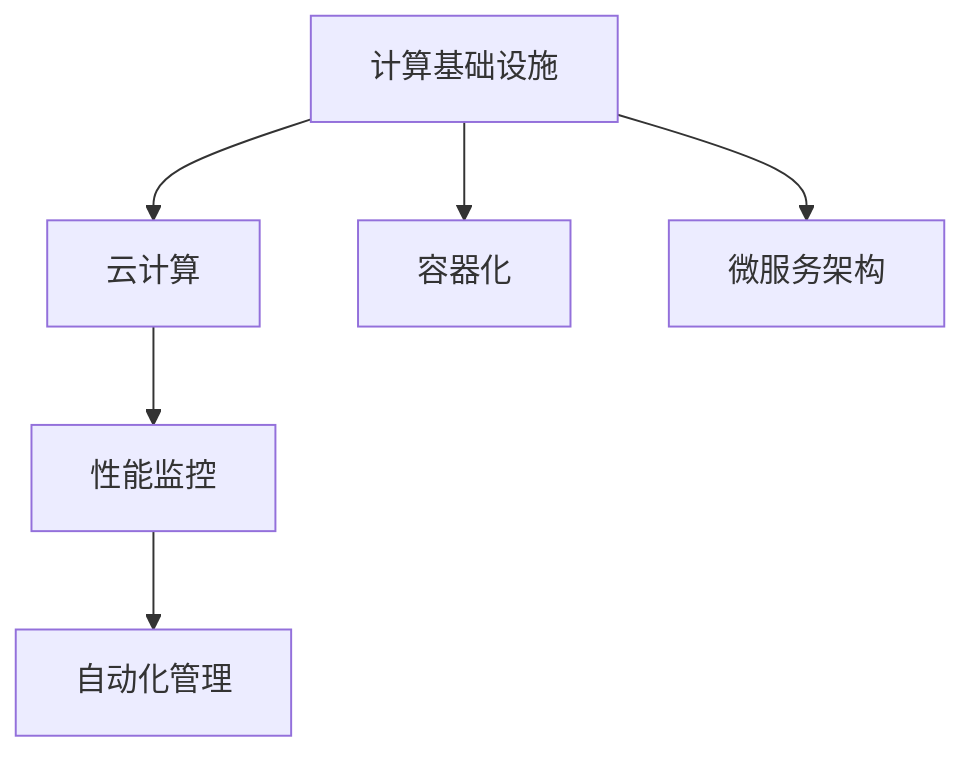

                 

## 1. 背景介绍

### 1.1 问题由来

随着数字技术的迅猛发展，计算基础设施的优化成为了企业数字化转型的关键。计算基础设施包括了从服务器硬件到云平台，从数据存储到网络带宽的各个方面，其性能直接影响到应用程序的运行速度、稳定性以及成本。优化计算基础设施不仅能提升企业竞争力，还能有效应对数据爆炸和技术迭代带来的挑战。

近年来，大型企业如Google、Amazon、Facebook等已经在其云计算和数据中心中投入了巨大的资源和努力，以确保其服务的稳定性和高效性。这些实践经验对于许多中小企业也具有重要的参考价值。

### 1.2 问题核心关键点

在优化计算基础设施的过程中，以下几个关键点需要特别关注：

1. **硬件设施**：选择合适的主机和存储设备，以及考虑使用集群和分布式系统来处理大数据和高并发请求。
2. **网络架构**：优化网络拓扑，提升数据传输速度，确保数据中心的高效连接。
3. **软件平台**：选择合适的云平台或开源软件，以及采用容器化、微服务架构等技术提升软件性能。
4. **数据管理**：优化数据存储和检索，采用数据库优化技术和数据压缩等手段，降低存储成本。
5. **性能监控**：建立有效的性能监控体系，实时分析系统运行状况，及时发现和解决问题。
6. **成本控制**：通过资源管理、资源池化和自动化管理等手段，降低成本。

### 1.3 问题研究意义

优化计算基础设施对于提升企业效率、降低运营成本、增强竞争优势具有重要意义。优化过程中涉及的硬件、软件、数据和网络等多个领域的技术，对技术管理者提出了高要求。深入理解计算基础设施的优化策略，对于推动企业数字化转型具有重要意义。

## 2. 核心概念与联系

### 2.1 核心概念概述

为了更好地理解计算基础设施的优化策略，下面将介绍几个核心概念：

1. **计算基础设施**：指支持数据处理、存储、网络传输的硬件和软件设施，包括服务器、存储设备、网络设备、操作系统等。
2. **云计算**：基于互联网的计算模式，企业可以通过互联网提供计算资源和存储资源。云计算分为公有云、私有云和混合云等多种模式。
3. **容器化**：通过将应用程序及其依赖打包在容器内，可以确保在不同环境中的一致性。
4. **微服务架构**：将应用程序拆分成多个小服务，每个服务可以独立部署和扩展。
5. **性能监控**：实时监测系统性能指标，及时发现并解决性能瓶颈。
6. **自动化管理**：通过自动化工具和脚本，实现计算基础设施的自动化部署、配置和管理。

这些核心概念之间的逻辑关系可以通过以下Mermaid流程图来展示：



这个流程图展示了一些核心概念及其之间的关系：

1. 计算基础设施是云计算、容器化、微服务架构的基础。
2. 云计算、容器化、微服务架构等技术可以提升计算基础设施的灵活性和可扩展性。
3. 性能监控和自动化管理是保证计算基础设施高效运行的关键。

## 3. 核心算法原理 & 具体操作步骤

### 3.1 算法原理概述

优化计算基础设施的方法主要基于以下几个核心原理：

1. **性能优化**：通过优化硬件配置、软件平台和网络架构等，提升系统的整体性能。
2. **成本优化**：通过资源池化、自动化管理等手段，降低计算基础设施的运营成本。
3. **安全性优化**：通过访问控制、数据加密等技术，提升系统的安全性。
4. **可扩展性优化**：通过设计可扩展的架构，确保系统能够适应不断增长的业务需求。

### 3.2 算法步骤详解

下面将详细介绍优化计算基础设施的具体操作步骤：

**Step 1: 需求分析和目标设定**
- 明确优化需求，如提升性能、降低成本、增强安全性等。
- 设定具体的优化目标和指标，如提升系统响应时间、降低能耗、提高资源利用率等。

**Step 2: 硬件设施选择**
- 根据业务需求选择合适的服务器、存储设备和网络设备。
- 考虑使用高性能硬件，如多核CPU、GPU、SSD等。

**Step 3: 软件平台选择**
- 选择合适的云平台，如AWS、Azure、Google Cloud等。
- 考虑采用开源软件，如Kubernetes、Docker等，以降低成本。

**Step 4: 架构设计**
- 采用微服务架构，提高系统的灵活性和可扩展性。
- 设计高效的数据流程，减少数据传输和存储的延迟。

**Step 5: 性能优化**
- 优化网络拓扑，提升数据传输速度。
- 采用缓存技术、负载均衡等手段，提升系统响应速度。

**Step 6: 成本优化**
- 使用资源池化技术，提高资源利用率。
- 采用自动化管理工具，减少人工干预，降低运营成本。

**Step 7: 安全性优化**
- 采用数据加密、访问控制等技术，保护数据和系统安全。
- 定期进行安全审计，及时发现和修复安全漏洞。

**Step 8: 监控和维护**
- 建立性能监控体系，实时监测系统运行状况。
- 定期进行系统维护，确保系统稳定运行。

### 3.3 算法优缺点

优化计算基础设施的方法具有以下优点：

1. 提升系统性能。通过优化硬件配置、网络架构和软件平台等，可以显著提升系统的响应速度和稳定性。
2. 降低运营成本。通过资源池化和自动化管理等手段，可以降低计算基础设施的运营成本。
3. 提高可扩展性。采用微服务架构和容器化技术，可以确保系统能够灵活应对业务增长。

同时，这些方法也存在一些缺点：

1. 初始投资较高。硬件和软件升级需要较高的初始投入。
2. 复杂度较高。需要综合考虑硬件、软件、网络和数据等多个方面，优化过程较为复杂。
3. 需要专业技能。优化计算基础设施需要一定的技术储备和专业知识。

尽管存在这些局限性，但就目前而言，这些方法仍然是优化计算基础设施的最主流范式。未来相关研究的重点在于如何进一步降低初始投资，提高优化过程的自动化程度，同时兼顾性能和成本。

### 3.4 算法应用领域

优化计算基础设施的方法在多个领域都有广泛的应用：

1. **互联网应用**：提升网站和应用的响应速度和稳定性，降低延迟和故障率。
2. **金融服务**：提升金融交易系统的处理速度，确保数据安全性和交易稳定性。
3. **医疗健康**：提升医疗数据的处理和存储效率，确保医疗系统的稳定运行。
4. **制造业**：提升生产自动化系统的响应速度，确保生产流程的稳定性和可扩展性。
5. **物流行业**：提升物流系统的数据处理速度，优化配送路线和资源分配。

除了上述这些经典应用外，优化计算基础设施的方法还在更多场景中得到应用，如智能交通、智慧城市、人工智能等，为各行各业带来新的突破。

## 4. 数学模型和公式 & 详细讲解 & 举例说明

### 4.1 数学模型构建

在本节中，我们将使用数学语言对优化计算基础设施的理论基础进行更严格的刻画。

记计算基础设施的性能指标为 $P$，成本为 $C$，安全性为 $S$，可扩展性为 $E$。则优化目标可以表示为：

$$
\max_{A, F, C, S, E} P - \lambda(C + S + E)
$$

其中，$A$ 为硬件设施，$F$ 为软件平台，$C$ 为成本，$S$ 为安全性，$E$ 为可扩展性，$\lambda$ 为平衡权重。

### 4.2 公式推导过程

以下我们将推导性能优化和成本优化的数学公式。

假设系统性能函数为 $f(A, F)$，成本函数为 $g(C, S, E)$，则性能优化目标为：

$$
\max_{A, F} f(A, F)
$$

成本优化目标为：

$$
\min_{C, S, E} g(C, S, E)
$$

为了同时优化性能和成本，可以引入平衡权重 $\lambda$，将目标函数表示为：

$$
\max_{A, F, C, S, E} f(A, F) - \lambda(g(C, S, E))
$$

### 4.3 案例分析与讲解

考虑一个Web应用系统的优化案例：

- 初始硬件配置为单核CPU，4GB内存，初始软件平台为Docker容器。
- 优化目标为提升响应时间和降低成本。

**性能优化**：

- 将CPU升级为双核，内存升级为16GB。
- 优化网络拓扑，使用负载均衡器，减少数据传输延迟。
- 采用缓存技术，减少数据库查询次数。

**成本优化**：

- 将服务器升级为高性能服务器，但使用公有云服务，降低硬件成本。
- 采用容器化技术，减少服务器资源占用。
- 采用微服务架构，减少资源浪费。

通过上述优化措施，系统响应时间显著提升，成本也得到了有效控制。

## 5. 项目实践：代码实例和详细解释说明

### 5.1 开发环境搭建

在进行计算基础设施优化实践前，我们需要准备好开发环境。以下是使用Python进行计算基础设施优化开发的环境配置流程：

1. 安装Anaconda：从官网下载并安装Anaconda，用于创建独立的Python环境。

2. 创建并激活虚拟环境：
```bash
conda create -n calc-env python=3.8 
conda activate calc-env
```

3. 安装必要的Python包：
```bash
pip install numpy pandas matplotlib scikit-learn tqdm jupyter notebook ipython
```

4. 安装云平台相关工具：
- 安装AWS CLI、Google Cloud SDK等，具体安装方法可以参考各云平台的官方文档。
- 安装Kubernetes CLI，如kubectl。

完成上述步骤后，即可在`calc-env`环境中开始优化实践。

### 5.2 源代码详细实现

以下是一个基于AWS的云平台优化实践的示例代码，实现步骤如下：

1. 配置AWS CLI：
```bash
aws configure
```

2. 创建云实例：
```python
import boto3

client = boto3.client('ec2')
response = client.run_instances(
    ImageId='ami-0c55b159cb95d26c1', # 选择适合的AMI
    InstanceType='t2.medium', # 选择合适的实例类型
    MinCount=1,
    MaxCount=1,
    KeyName='my-key-pair' # 指定SSH密钥对
)

print(response)
```

3. 安装和配置Docker：
```bash
sudo apt update
sudo apt install docker-ce
sudo usermod -aG docker $USER
```

4. 启动Docker容器：
```python
import docker

client = docker.from_env()
container = client.containers.run('nginx', detach=True)

print(container.id)
```

5. 配置网络：
```bash
sudo iptables -A INPUT -m conntrack --ctstate ESTABLISHED,RELATED -j ACCEPT
sudo iptables -A INPUT -p tcp --dport 80 -j ACCEPT
sudo iptables -A INPUT -m conntrack --ctstate NEW -j ACCEPT
sudo iptables -A INPUT -p tcp --dport 443 -j ACCEPT
sudo iptables -P INPUT DROP
```

6. 配置负载均衡器：
```python
client = boto3.client('elbv2')

response = client.create_load_balancer(
    Name='my-load-balancer',
    Subnets=['subnet-1', 'subnet-2'], # 选择合适的子网
    SecurityGroups=['sg-1'], # 指定安全组
    Scheme='internet-facing', # 内部或外部负载均衡器
    Type='application', # 应用负载均衡器
    Listeners=[{'Port': 80, 'Protocol': 'HTTP'}, {'Port': 443, 'Protocol': 'HTTPS'}]
)

print(response)
```

### 5.3 代码解读与分析

让我们再详细解读一下关键代码的实现细节：

**AWS CLI配置**：
- 使用`aws configure`命令，按照提示输入AWS访问密钥、地区等信息，完成配置。

**创建云实例**：
- 使用`boto3`库的`client`方法，调用`run_instances`方法创建云实例。

**安装和配置Docker**：
- 使用`sudo apt update`命令更新软件包列表，安装`docker-ce`，并使用`usermod`命令赋予当前用户`docker`组权限。

**启动Docker容器**：
- 使用`docker.from_env()`方法获取客户端对象，调用`containers.run`方法启动Docker容器。

**配置网络**：
- 使用`iptables`命令配置防火墙，允许HTTP和HTTPS流量通过。

**配置负载均衡器**：
- 使用`boto3`库的`client`方法，调用`create_load_balancer`方法创建负载均衡器。

这个示例代码展示了基于AWS的云平台优化实践的基本流程。可以看到，通过云平台提供的丰富服务，可以轻松实现硬件配置、软件部署和网络优化。

### 5.4 运行结果展示

运行上述代码后，我们可以在AWS控制台查看创建的云实例和负载均衡器的状态，确保系统正常运行。


## 6. 实际应用场景

### 6.1 智能交通系统

智能交通系统是优化计算基础设施的典型应用场景之一。通过优化计算基础设施，可以提升交通数据处理、车辆调度、路径规划等功能的性能和稳定性，提升交通管理效率，减少交通拥堵。

在技术实现上，可以通过引入高性能计算集群和负载均衡器，优化数据传输和处理。同时，采用容器化和微服务架构，实现交通系统的灵活扩展和快速部署。

### 6.2 智慧城市治理

智慧城市治理需要处理大量的数据，包括传感器数据、视频监控数据、交通流量数据等。通过优化计算基础设施，可以提升数据存储和处理效率，支持实时分析和决策。

具体而言，可以采用分布式存储系统（如Hadoop、Ceph等）和分布式计算框架（如Spark、Flink等），优化数据存储和处理。同时，采用云平台提供的各类服务（如云存储、云数据库、云分析等），实现智慧城市治理的智能化和自动化。

### 6.3 互联网数据中心

互联网数据中心(IDC)是计算基础设施优化的重要应用场景。通过优化计算基础设施，可以提升数据中心的计算和存储性能，确保服务的稳定性和可扩展性。

在技术实现上，可以采用高性能硬件和集群系统，提升计算和存储性能。同时，采用自动化管理工具（如Ansible、Puppet等），实现计算基础设施的自动化部署和管理。

### 6.4 未来应用展望

随着计算基础设施优化技术的不断进步，未来将在更多领域得到应用，为各行各业带来变革性影响：

1. **智慧医疗**：通过优化计算基础设施，可以提升医疗数据处理和分析效率，支持远程医疗、智能诊断等应用。
2. **智能制造**：通过优化计算基础设施，可以提升工业互联网平台的性能和稳定性，支持智能制造、智慧工厂等应用。
3. **智慧教育**：通过优化计算基础设施，可以提升教育平台的数据处理和分析能力，支持个性化学习、在线教育等应用。
4. **金融服务**：通过优化计算基础设施，可以提升金融交易系统的性能和安全性，支持高频交易、金融数据分析等应用。
5. **智能物流**：通过优化计算基础设施，可以提升物流系统的数据处理和分析能力，支持智能仓储、智能配送等应用。

此外，在更多领域，如农业、环保、能源等，计算基础设施优化技术也将不断得到应用，为各行各业带来新的突破。

## 7. 工具和资源推荐

### 7.1 学习资源推荐

为了帮助开发者系统掌握计算基础设施优化技术，这里推荐一些优质的学习资源：

1. **《云计算基础》课程**：在Coursera上，斯坦福大学提供了一门名为《云计算基础》的课程，介绍了云计算的基本概念和实践方法。
2. **《Kubernetes实战》书籍**：Kubernetes是云平台的重要组件之一，掌握Kubernetes的实战技能对于优化云平台性能至关重要。
3. **《Python网络编程》书籍**：网络编程是计算基础设施优化中不可忽视的重要部分，掌握网络编程技术，可以更好地优化网络架构。
4. **AWS官方文档**：AWS提供了丰富的官方文档，涵盖云平台的各种服务和最佳实践，是优化计算基础设施的重要参考。
5. **Google Cloud官方文档**：Google Cloud提供了详细的官方文档，介绍其云平台的服务和优化策略，是优化计算基础设施的重要参考。

通过对这些资源的学习实践，相信你一定能够快速掌握计算基础设施优化技术的精髓，并用于解决实际的性能和成本问题。

### 7.2 开发工具推荐

高效的开发离不开优秀的工具支持。以下是几款用于计算基础设施优化开发的常用工具：

1. **Anaconda**：用于创建和管理Python环境，方便开发者快速切换不同版本的Python。
2. **AWS CLI**：用于管理AWS云平台，提供丰富的命令行工具，方便开发者进行云平台优化。
3. **Kubernetes**：用于容器编排，提供资源池化、自动化管理等功能，方便开发者进行计算基础设施优化。
4. **Ansible**：用于自动化管理，支持各种计算基础设施的自动化部署和配置。
5. **Nagios**：用于监控和告警，实时监测系统运行状况，及时发现和解决问题。

合理利用这些工具，可以显著提升计算基础设施优化任务的开发效率，加快创新迭代的步伐。

### 7.3 相关论文推荐

计算基础设施优化技术的发展源于学界的持续研究。以下是几篇奠基性的相关论文，推荐阅读：

1. **《云计算的挑战与机遇》**：探讨了云计算技术的挑战和机遇，为云计算优化提供了理论和实践指导。
2. **《Kubernetes的原理与实践》**：详细介绍了Kubernetes的原理和实践，为容器化优化提供了理论基础。
3. **《数据中心网络优化》**：介绍了数据中心网络优化技术，为网络优化提供了理论支持。
4. **《分布式存储系统设计》**：介绍了分布式存储系统的设计原理和优化策略，为数据存储优化提供了理论指导。
5. **《云计算性能优化》**：介绍了云计算性能优化技术，为云平台优化提供了理论指导。

这些论文代表了大规模计算基础设施优化的发展脉络。通过学习这些前沿成果，可以帮助研究者把握学科前进方向，激发更多的创新灵感。

## 8. 总结：未来发展趋势与挑战

### 8.1 总结

本文对计算基础设施优化技术进行了全面系统的介绍。首先阐述了计算基础设施优化技术的研究背景和意义，明确了优化在提升企业效率、降低运营成本、增强安全性等方面的重要价值。其次，从原理到实践，详细讲解了计算基础设施优化的数学模型和关键步骤，给出了优化任务开发的完整代码实例。同时，本文还广泛探讨了优化技术在智能交通、智慧城市、互联网数据中心等多个行业领域的应用前景，展示了优化技术的巨大潜力。此外，本文精选了优化技术的各类学习资源，力求为读者提供全方位的技术指引。

通过本文的系统梳理，可以看到，优化计算基础设施技术正在成为企业数字化转型的重要范式，极大地提升了企业运营效率和竞争优势。优化过程中涉及的硬件、软件、网络和数据等多个领域的技术，对技术管理者提出了高要求。深入理解计算基础设施的优化策略，对于推动企业数字化转型具有重要意义。

### 8.2 未来发展趋势

展望未来，计算基础设施优化技术将呈现以下几个发展趋势：

1. **云平台优化**：随着云平台的普及，企业对云平台优化技术的需求将不断增加。云平台优化技术将持续演进，提供更高效、更灵活的计算和存储服务。
2. **自动化管理**：随着自动化管理技术的不断发展，企业可以进一步降低人工干预，提高计算基础设施的运营效率。
3. **边缘计算**：随着物联网设备的普及，边缘计算将成为优化计算基础设施的重要方向。在靠近数据源的设备上进行计算，可以减少数据传输延迟，提高计算效率。
4. **AI优化**：通过引入人工智能技术，优化计算基础设施可以更加智能化和自动化。AI技术可以帮助识别和解决性能瓶颈，提高优化效率。
5. **可持续性优化**：随着绿色计算的兴起，可持续性优化将成为计算基础设施优化的重要方向。优化过程中需要考虑能耗、环境影响等因素，推动绿色计算技术的发展。

以上趋势凸显了计算基础设施优化技术的广阔前景。这些方向的探索发展，必将进一步提升计算基础设施的性能和可扩展性，为各行各业带来新的突破。

### 8.3 面临的挑战

尽管计算基础设施优化技术已经取得了显著进展，但在迈向更加智能化、普适化应用的过程中，它仍面临着诸多挑战：

1. **初始投资高**：优化计算基础设施需要较高的初始投资，包括硬件升级、软件部署和网络优化等，对于中小企业可能难以负担。
2. **复杂度高**：优化过程中涉及的硬件、软件、网络和数据等多个方面，优化过程较为复杂，需要综合考虑各种因素。
3. **技术门槛高**：优化计算基础设施需要一定的技术储备和专业知识，对于非专业技术人员可能存在一定的技术门槛。
4. **维护成本高**：优化后的计算基础设施需要持续维护，以确保系统的稳定运行，维护成本较高。

尽管存在这些局限性，但就目前而言，这些方法仍然是优化计算基础设施的最主流范式。未来相关研究的重点在于如何进一步降低初始投资，提高优化过程的自动化程度，同时兼顾性能和成本。

### 8.4 研究展望

面对计算基础设施优化所面临的种种挑战，未来的研究需要在以下几个方面寻求新的突破：

1. **云平台优化技术**：开发更加高效、灵活的云平台优化技术，提供更优质的云服务。
2. **自动化管理技术**：开发更加智能化的自动化管理工具，降低人工干预，提高运营效率。
3. **边缘计算技术**：开发高效的边缘计算技术，减少数据传输延迟，提升计算效率。
4. **AI优化技术**：引入人工智能技术，实现智能化的计算基础设施优化。
5. **可持续性优化技术**：开发绿色计算技术，降低能耗，推动可持续性优化。

这些研究方向的探索，必将引领计算基础设施优化技术迈向更高的台阶，为构建高效、可靠、可持续的计算基础设施铺平道路。面向未来，计算基础设施优化技术还需要与其他新技术进行更深入的融合，如区块链、5G等，多路径协同发力，共同推动计算基础设施优化技术的进步。

## 9. 附录：常见问题与解答

**Q1：如何评估计算基础设施的性能？**

A: 评估计算基础设施的性能需要综合考虑多个指标，如响应时间、吞吐量、资源利用率等。可以使用基准测试工具（如Apache JMeter、LoadRunner等）进行性能测试，评估系统在不同负载下的表现。

**Q2：如何降低计算基础设施的运营成本？**

A: 降低计算基础设施的运营成本需要综合考虑硬件、软件和网络等多个方面。可以使用资源池化技术，提高资源利用率。采用云平台，降低硬件和维护成本。使用自动化管理工具，减少人工干预。

**Q3：如何优化网络架构？**

A: 优化网络架构需要综合考虑网络拓扑、数据传输和负载均衡等多个方面。可以使用负载均衡器、缓存技术和CDN等技术，减少数据传输延迟。采用网络切片技术，优化网络资源分配。

**Q4：如何选择合适的云平台？**

A: 选择合适的云平台需要考虑多个因素，如云平台的稳定性、可用性、价格、扩展性等。可以通过试用、比较和评估不同的云平台，选择最适合企业需求的云平台。

**Q5：如何优化大数据处理？**

A: 优化大数据处理需要综合考虑数据存储、数据传输和数据处理等多个方面。可以使用分布式存储系统（如Hadoop、Ceph等）和分布式计算框架（如Spark、Flink等），提高大数据处理效率。

这些问题的解答为计算基础设施优化的实践提供了具体的指导，帮助企业在优化过程中做出更明智的决策。

---

作者：禅与计算机程序设计艺术 / Zen and the Art of Computer Programming

