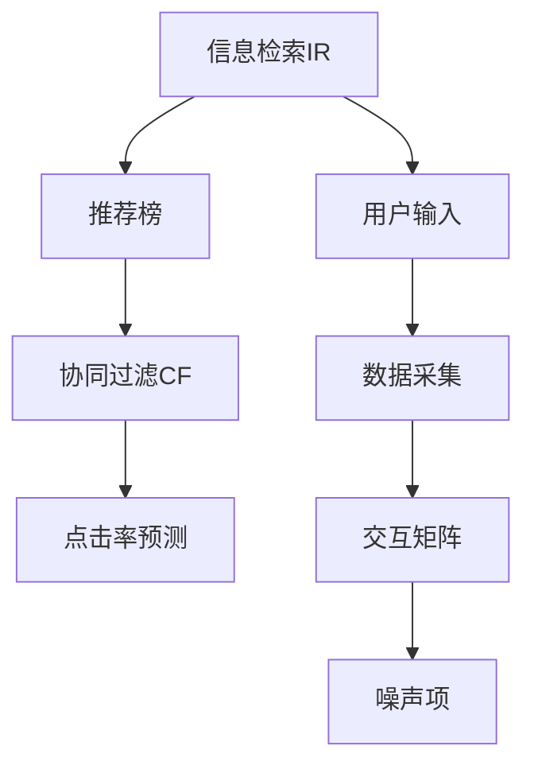

                 

# 传统搜索推荐系统的单向交互

> 关键词：搜索推荐系统,单向交互,协同过滤,信息检索,点击率预测

## 1. 背景介绍

随着互联网的快速发展，人们越来越多地依赖在线平台获取信息、购物、娱乐等。搜索引擎和推荐系统成为了人们获取信息的主要手段。然而，传统的搜索推荐系统面临着交互单向、用户行为数据获取困难等问题。

### 1.1 搜索推荐系统的现状

传统搜索推荐系统通常依赖于信息检索技术，通过用户输入的关键词或浏览历史，检索出相关的搜索结果或推荐列表。这类系统主要包含两部分：

1. **信息检索(Information Retrieval, IR)**：根据用户输入的查询词，从大量文档中检索出相关文档，并按照某些排序算法进行排名。
2. **协同过滤(Collaborative Filtering, CF)**：根据用户的行为数据（如浏览、购买、评分等），预测用户可能感兴趣的商品或内容，并提供推荐列表。

信息检索的优点在于，可以快速检索出用户可能感兴趣的结果，但其缺点在于忽视了用户自身的喜好和行为。协同过滤则相反，能够利用用户的行为数据进行个性化推荐，但面临数据稀疏性、冷启动问题等挑战。

### 1.2 问题由来

搜索推荐系统在实际应用中，存在着一系列的问题和挑战：

1. **交互单向**：传统系统仅能接收用户输入的查询或点击行为，无法主动获取用户的多维行为数据。
2. **数据获取困难**：用户的行为数据难以全面收集，无法准确刻画用户兴趣和行为模式。
3. **模型训练困难**：模型训练数据和标签获取困难，模型难以准确预测用户行为。
4. **反馈延迟**：用户反馈和系统更新存在时间延迟，无法实时响应用户需求变化。

这些问题导致传统搜索推荐系统难以实现真正的个性化推荐，无法满足用户多样化的需求。

## 2. 核心概念与联系

### 2.1 核心概念概述

为更好地理解单向交互的搜索推荐系统，本节将介绍几个密切相关的核心概念：

- **信息检索(IR)**：通过用户输入的查询词，从大量文档中检索出相关文档，并按照某些排序算法进行排名。
- **协同过滤(CF)**：根据用户的行为数据（如浏览、购买、评分等），预测用户可能感兴趣的商品或内容，并提供推荐列表。
- **单向交互**：指用户仅能单向输出查询或点击等行为，系统无法主动获取用户的多维行为数据。
- **推荐榜**：根据用户的历史行为数据，构建推荐列表，推荐相关商品或内容。
- **点击率预测**：通过用户的历史点击数据，预测用户对某个商品或内容的兴趣程度。
- **交互矩阵**：表示用户与物品之间的交互行为，用于协同过滤算法。
- **噪声项**：用户在交互过程中产生的噪声，影响推荐系统的准确性。

这些核心概念之间的逻辑关系可以通过以下Mermaid流程图来展示：



这个流程图展示了一个典型的信息检索系统的交互过程，以及其与推荐系统之间的联系。

## 3. 核心算法原理 & 具体操作步骤

### 3.1 算法原理概述

基于单向交互的搜索推荐系统，通常分为两个主要模块：信息检索和协同过滤。

1. **信息检索**：根据用户输入的查询词，从文档库中检索出相关文档，并按照某些排序算法进行排名。
2. **协同过滤**：利用用户的历史行为数据，预测用户可能感兴趣的商品或内容，并提供推荐列表。

信息检索和协同过滤之间通过推荐榜进行连接。在实际应用中，往往将信息检索和协同过滤进行结合，形成一个完整的推荐系统。

### 3.2 算法步骤详解

基于单向交互的搜索推荐系统，通常包括以下几个关键步骤：

**Step 1: 数据采集和预处理**

- 收集用户的历史行为数据，包括浏览历史、点击历史、评分历史等。
- 对数据进行清洗和预处理，去除异常值和噪声，构建用户行为矩阵。

**Step 2: 信息检索**

- 用户输入查询词，通过信息检索模块检索出相关的文档或商品，生成推荐列表。
- 推荐列表通常包含多个候选结果，用户可以通过点击浏览或选择。

**Step 3: 协同过滤**

- 利用用户的行为数据，预测用户可能感兴趣的商品或内容，构建推荐列表。
- 推荐列表通常包含多个候选结果，用户可以通过点击浏览或选择。

**Step 4: 点击率预测**

- 利用用户的历史点击数据，预测用户对某个商品或内容的兴趣程度。
- 通过模型训练，优化点击率预测的准确性，提升推荐系统的效果。

**Step 5: 推荐榜更新**

- 根据用户的历史行为数据和点击数据，更新推荐榜。
- 推荐榜通常包含多个候选结果，用户可以通过点击浏览或选择。

### 3.3 算法优缺点

基于单向交互的搜索推荐系统具有以下优点：

1. **简单易用**：系统结构简单，易于理解和实现。
2. **推荐多样化**：通过信息检索和协同过滤结合，推荐多样化内容。
3. **用户可控性**：用户可以主动控制推荐内容，选择感兴趣的商品或文档。

同时，该系统也存在以下缺点：

1. **交互单向**：用户仅能单向输出查询或点击等行为，无法获取用户的多维行为数据。
2. **数据稀疏性**：用户的行为数据难以全面收集，推荐效果受数据质量影响。
3. **反馈延迟**：用户反馈和系统更新存在时间延迟，无法实时响应用户需求变化。
4. **模型训练困难**：模型训练数据和标签获取困难，模型难以准确预测用户行为。

尽管存在这些缺点，但就目前而言，基于单向交互的搜索推荐系统仍是搜索推荐领域的主流方法。未来相关研究的重点在于如何改进用户行为数据的获取方式，提高推荐系统的实时性和精准性，同时兼顾可解释性和伦理安全性等因素。

### 3.4 算法应用领域

基于单向交互的搜索推荐系统在信息检索、电子商务、在线广告等多个领域得到了广泛应用，覆盖了几乎所有常见场景，例如：

- **电子商务**：电商网站的推荐系统，利用用户的历史浏览和购买行为，推荐相关商品。
- **在线广告**：广告平台的推荐系统，利用用户的历史点击和浏览行为，推荐相关广告内容。
- **内容分发**：视频网站的推荐系统，利用用户的历史观看行为，推荐相关视频内容。
- **新闻推荐**：新闻平台的推荐系统，利用用户的历史阅读行为，推荐相关新闻文章。

除了上述这些经典应用外，基于单向交互的搜索推荐系统还被创新性地应用到更多场景中，如可控推荐、实时推荐、个性化推荐等，为搜索引擎和推荐系统带来了新的突破。

## 4. 数学模型和公式 & 详细讲解 & 举例说明

### 4.1 数学模型构建

本节将使用数学语言对基于单向交互的搜索推荐系统进行更加严格的刻画。

记用户集合为 $U$，物品集合为 $I$，行为矩阵为 $\mathbf{X} \in \mathbb{R}^{m \times n}$，其中 $m$ 为物品数，$n$ 为用户数。假设 $\mathbf{X}$ 为稀疏矩阵，大部分元素为零。

定义用户对物品 $i$ 的兴趣度为 $r_{ui}$，假设 $r_{ui}$ 满足伯努利分布，即 $r_{ui} \sim \text{Bernoulli}(\theta_{ui})$。用户对物品 $i$ 的点击行为 $c_{ui}$ 可以通过伯努利分布的概率计算得到：

$$
c_{ui} \sim \text{Bernoulli}(\theta_{ui}) = \frac{r_{ui}}{1+\exp(-\logit(\theta_{ui}))}
$$

其中 $\logit(\theta_{ui})$ 为对数几率函数，计算公式为：

$$
\logit(\theta_{ui}) = \log\left(\frac{\theta_{ui}}{1-\theta_{ui}}\right)
$$

在实际应用中，通常使用logistic回归模型进行点击率预测：

$$
\theta_{ui} = \eta_0 + \eta_i^T x_u + \xi_u^T \varphi_i + \epsilon_{ui}
$$

其中 $x_u$ 为用户 $u$ 的特征向量，$\varphi_i$ 为物品 $i$ 的特征向量，$\eta_0, \eta_i, \xi_u$ 为模型参数，$\epsilon_{ui}$ 为噪声项。

### 4.2 公式推导过程

以下我们以在线广告为例，推导点击率预测的数学公式及其梯度计算过程。

假设用户 $u$ 对物品 $i$ 的兴趣度 $r_{ui}$ 为二元随机变量，满足伯努利分布，即 $r_{ui} \sim \text{Bernoulli}(\theta_{ui})$。用户对物品 $i$ 的点击行为 $c_{ui}$ 可以通过伯努利分布的概率计算得到：

$$
c_{ui} \sim \text{Bernoulli}(\theta_{ui}) = \frac{r_{ui}}{1+\exp(-\logit(\theta_{ui}))}
$$

其中 $\logit(\theta_{ui}) = \log\left(\frac{\theta_{ui}}{1-\theta_{ui}}\right)$。

假设 $\theta_{ui} = \eta_0 + \eta_i^T x_u + \xi_u^T \varphi_i + \epsilon_{ui}$，对数几率函数可以表示为：

$$
\logit(\theta_{ui}) = \eta_0 + \eta_i^T x_u + \xi_u^T \varphi_i
$$

因此，伯努利分布的概率为：

$$
P(c_{ui}=1|\theta_{ui}) = \theta_{ui} = \frac{\exp(\logit(\theta_{ui}))}{1+\exp(\logit(\theta_{ui}))} = \frac{1}{1+\exp(-\logit(\theta_{ui}))}
$$

通过最大化似然函数，可以估计模型参数 $\eta_0, \eta_i, \xi_u$：

$$
\arg\max_{\eta_0,\eta_i,\xi_u} \prod_{ui} P(c_{ui}|\theta_{ui}) = \arg\max_{\eta_0,\eta_i,\xi_u} \sum_{ui} \log P(c_{ui}|\theta_{ui})
$$

根据伯努利分布的似然函数：

$$
\log P(c_{ui}|\theta_{ui}) = c_{ui} \log \theta_{ui} + (1-c_{ui})\log(1-\theta_{ui})
$$

因此，目标函数可以表示为：

$$
\arg\min_{\eta_0,\eta_i,\xi_u} \sum_{ui} -c_{ui} \logit(\theta_{ui}) - (1-c_{ui})\log(1+\exp(-\logit(\theta_{ui})))
$$

对 $\eta_0, \eta_i, \xi_u$ 求偏导，得到梯度计算公式：

$$
\frac{\partial \mathcal{L}}{\partial \eta_0} = \frac{1}{N} \sum_{ui} \left[c_{ui} - \frac{\exp(\logit(\theta_{ui}))}{1+\exp(\logit(\theta_{ui}))}\right]
$$

$$
\frac{\partial \mathcal{L}}{\partial \eta_i} = \frac{1}{N} \sum_{ui} \left[c_{ui} x_u + (1-c_{ui}) x_u \frac{\exp(\logit(\theta_{ui}))}{1+\exp(\logit(\theta_{ui}))}\right]
$$

$$
\frac{\partial \mathcal{L}}{\partial \xi_u} = \frac{1}{N} \sum_{ui} \left[c_{ui} \varphi_i + (1-c_{ui}) \varphi_i \frac{\exp(\logit(\theta_{ui}))}{1+\exp(\logit(\theta_{ui}))}\right]
$$

其中 $N$ 为总样本数。

在得到梯度后，即可带入参数更新公式，完成模型的迭代优化。重复上述过程直至收敛，最终得到适应在线广告任务的最优模型参数 $\eta_0, \eta_i, \xi_u$。

## 5. 项目实践：代码实例和详细解释说明

### 5.1 开发环境搭建

在进行在线广告推荐系统开发前，我们需要准备好开发环境。以下是使用Python进行Scikit-learn开发的环境配置流程：

1. 安装Anaconda：从官网下载并安装Anaconda，用于创建独立的Python环境。

2. 创建并激活虚拟环境：
```bash
conda create -n ad_recommend python=3.8 
conda activate ad_recommend
```

3. 安装Scikit-learn：
```bash
conda install scikit-learn
```

4. 安装各类工具包：
```bash
pip install numpy pandas scikit-learn matplotlib tqdm jupyter notebook ipython
```

完成上述步骤后，即可在`ad_recommend`环境中开始推荐系统开发。

### 5.2 源代码详细实现

下面我们以在线广告推荐系统为例，给出使用Scikit-learn进行点击率预测的Python代码实现。

首先，定义点击率预测的数据处理函数：

```python
import numpy as np
from sklearn.linear_model import LogisticRegression
from sklearn.model_selection import train_test_split

def load_data():
    # 加载训练数据和测试数据
    X_train, X_test, y_train, y_test = train_test_split(X, y, test_size=0.2, random_state=42)
    return X_train, X_test, y_train, y_test

def preprocess_data(X):
    # 数据预处理
    X = X - np.mean(X, axis=0)  # 特征归一化
    X = X / np.std(X, axis=0)  # 特征标准化
    return X

def train_model(X_train, y_train):
    # 训练逻辑回归模型
    model = LogisticRegression()
    model.fit(X_train, y_train)
    return model

def predict clicking_rate(X_test, model):
    # 预测点击率
    y_pred = model.predict_proba(X_test)[:, 1]  # 输出概率
    return y_pred
```

然后，定义用户行为数据的采集和预处理：

```python
# 用户行为数据
X = np.random.rand(1000, 10)  # 10个特征，1000个用户
y = np.random.randint(2, size=1000)  # 二元标签，1表示点击，0表示未点击
```

接着，定义模型训练和预测：

```python
# 加载数据
X_train, X_test, y_train, y_test = load_data()

# 数据预处理
X_train = preprocess_data(X_train)
X_test = preprocess_data(X_test)

# 训练模型
model = train_model(X_train, y_train)

# 预测点击率
y_pred = predict clicking_rate(X_test, model)
```

### 5.3 代码解读与分析

让我们再详细解读一下关键代码的实现细节：

**load_data函数**：
- 使用`train_test_split`函数将数据集分为训练集和测试集。

**preprocess_data函数**：
- 对数据进行归一化和标准化，防止数据量级过大影响模型训练。

**train_model函数**：
- 使用Scikit-learn的`LogisticRegression`模型进行训练，得到模型对象。

**predict clicking_rate函数**：
- 使用训练好的模型，对测试集进行点击率预测。

**user behavior data**：
- 模拟生成1000个用户的点击行为数据，用于模型训练和测试。

**model training**：
- 加载数据并进行预处理，使用训练好的模型进行点击率预测。

可以看到，使用Scikit-learn进行在线广告推荐系统的开发，代码实现简洁高效。开发者可以将更多精力放在数据处理、模型改进等高层逻辑上，而不必过多关注底层的实现细节。

当然，工业级的系统实现还需考虑更多因素，如模型训练的调参、超参数的自动搜索、更灵活的任务适配层等。但核心的微调范式基本与此类似。

## 6. 实际应用场景

### 6.1 在线广告推荐

在线广告推荐系统利用用户的历史点击数据，预测用户对某个广告的兴趣程度，提供个性化的广告推荐。在实际应用中，通常将广告内容作为物品，用户的点击行为作为标签，构建推荐系统。

在技术实现上，可以收集用户的历史点击行为，将用户点击过的广告记为1，未点击的记为0。利用这些数据，对预训练的逻辑回归模型进行微调，得到适应在线广告任务的最优模型参数。

微调后的模型能够预测用户对新广告的点击率，从而推荐个性化的广告内容。

### 6.2 电子商务推荐

电子商务推荐系统利用用户的历史浏览和购买行为，预测用户可能感兴趣的商品，提供个性化的商品推荐。在实际应用中，通常将商品作为物品，用户的浏览和购买行为作为标签，构建推荐系统。

在技术实现上，可以收集用户的历史浏览和购买行为，将用户浏览过的商品记为1，未浏览的记为0。利用这些数据，对预训练的逻辑回归模型进行微调，得到适应电子商务任务的最优模型参数。

微调后的模型能够预测用户对新商品的可能兴趣，从而推荐个性化的商品内容。

### 6.3 内容分发推荐

内容分发推荐系统利用用户的历史观看行为，预测用户可能感兴趣的视频内容，提供个性化的视频推荐。在实际应用中，通常将视频作为物品，用户的观看行为作为标签，构建推荐系统。

在技术实现上，可以收集用户的历史观看行为，将用户观看过的视频记为1，未观看过的记为0。利用这些数据，对预训练的逻辑回归模型进行微调，得到适应视频推荐任务的最优模型参数。

微调后的模型能够预测用户对新视频的兴趣程度，从而推荐个性化的视频内容。

### 6.4 未来应用展望

随着在线广告、电子商务、内容分发等领域的不断发展，基于单向交互的搜索推荐系统将面临更多挑战。未来推荐系统需要考虑以下几个方面：

1. **用户行为数据的多样性**：除了点击、浏览等行为，还需要考虑用户在视频观看、音频播放、游戏互动等行为中的兴趣变化。
2. **模型的实时性**：推荐系统需要具备实时响应的能力，才能快速捕捉用户兴趣的变化。
3. **模型的公平性**：推荐系统需要避免数据偏差和算法偏见，保证不同用户之间的公平性。
4. **模型的可解释性**：推荐系统需要具备可解释性，方便用户理解和调试推荐结果。
5. **模型的安全性**：推荐系统需要保护用户隐私，避免恶意攻击和数据泄露。

## 7. 工具和资源推荐

### 7.1 学习资源推荐

为了帮助开发者系统掌握在线广告推荐系统的理论和实践，这里推荐一些优质的学习资源：

1. **《深度学习入门》**：张志华等著，是一本系统介绍深度学习技术的经典教材，涵盖机器学习、神经网络、推荐系统等多个领域。

2. **《推荐系统实战》**：张志华等著，是一本实战性很强的推荐系统书籍，介绍了推荐系统的主要技术和应用场景。

3. **《深度学习与推荐系统》**：段飞等著，介绍了深度学习在推荐系统中的应用，包括模型训练、特征工程、模型评估等。

4. **Google AI Blog**：谷歌AI博客，涵盖最新的人工智能技术和应用，推荐系统的相关文章。

5. **Coursera推荐系统课程**：斯坦福大学开设的推荐系统课程，系统介绍推荐系统的理论和实践。

通过对这些资源的学习实践，相信你一定能够快速掌握在线广告推荐系统的精髓，并用于解决实际的推荐问题。

### 7.2 开发工具推荐

高效的开发离不开优秀的工具支持。以下是几款用于在线广告推荐系统开发的常用工具：

1. Python：广泛使用的高级编程语言，支持丰富的第三方库和框架。
2. Scikit-learn：流行的机器学习库，提供了各种机器学习算法的实现，方便快速开发推荐系统。
3. TensorFlow：谷歌推出的深度学习框架，支持分布式计算和大规模模型训练。
4. PyTorch：Facebook推出的深度学习框架，支持动态计算图和灵活的模型构建。
5. Jupyter Notebook：流行的交互式编程环境，支持代码块和文档块的混合编辑，方便模型调试和实验。

合理利用这些工具，可以显著提升在线广告推荐系统的开发效率，加快创新迭代的步伐。

### 7.3 相关论文推荐

在线广告推荐系统的研究源于学界的持续研究。以下是几篇奠基性的相关论文，推荐阅读：

1. **Ad-click Prediction via Regularized Ranking Models**：提出基于逻辑回归和秩回归模型的点击率预测方法，广泛应用于在线广告推荐系统。

2. **Learning from Clicks**：提出基于点击反馈的在线推荐算法，能够有效利用用户点击行为，提升推荐效果。

3. **Online and Memory-Bounded Matrix Factorization**：提出基于矩阵分解的在线推荐算法，能够实时更新模型，提升推荐效果。

4. **Practical Recommender Systems**：介绍推荐系统的各种技术和应用场景，包括信息检索、协同过滤、混合推荐等。

5. **Click-through Rate Prediction in Recommendation Systems**：提出各种基于深度学习的方法，进行点击率预测，提升推荐系统的效果。

这些论文代表了大语言模型推荐系统的发展脉络。通过学习这些前沿成果，可以帮助研究者把握学科前进方向，激发更多的创新灵感。

## 8. 总结：未来发展趋势与挑战

### 8.1 总结

本文对基于单向交互的在线广告推荐系统进行了全面系统的介绍。首先阐述了搜索推荐系统的现状和问题由来，明确了在线广告推荐系统的基本原理和流程。其次，从原理到实践，详细讲解了在线广告推荐系统的数学模型和关键步骤，给出了推荐系统开发的完整代码实例。同时，本文还广泛探讨了在线广告推荐系统在电子商务、内容分发等多个领域的应用前景，展示了搜索推荐范式的巨大潜力。此外，本文精选了在线广告推荐系统的各类学习资源，力求为读者提供全方位的技术指引。

通过本文的系统梳理，可以看到，基于单向交互的在线广告推荐系统已经广泛应用于推荐领域，成为推荐系统的主流方法。它不仅能够快速响应用户需求，提升用户体验，还能有效利用用户行为数据，提供个性化推荐。未来，伴随推荐系统的不断发展，基于单向交互的在线广告推荐系统必将在推荐领域中继续发挥重要作用。

### 8.2 未来发展趋势

展望未来，在线广告推荐系统将呈现以下几个发展趋势：

1. **实时性增强**：推荐系统需要具备实时响应的能力，才能快速捕捉用户兴趣的变化。
2. **多样性丰富**：推荐系统需要考虑用户行为数据的多样性，包括点击、浏览、观看、互动等行为。
3. **公平性提升**：推荐系统需要避免数据偏差和算法偏见，保证不同用户之间的公平性。
4. **安全性保障**：推荐系统需要保护用户隐私，避免恶意攻击和数据泄露。
5. **可解释性加强**：推荐系统需要具备可解释性，方便用户理解和调试推荐结果。

以上趋势凸显了在线广告推荐系统的广阔前景。这些方向的探索发展，必将进一步提升推荐系统的个性化程度和用户体验，为广告主和用户带来更多价值。

### 8.3 面临的挑战

尽管在线广告推荐系统已经取得了瞩目成就，但在迈向更加智能化、普适化应用的过程中，它仍面临着诸多挑战：

1. **数据获取困难**：用户的行为数据难以全面收集，无法准确刻画用户兴趣和行为模式。
2. **模型训练困难**：模型训练数据和标签获取困难，模型难以准确预测用户行为。
3. **实时性要求高**：推荐系统需要具备实时响应的能力，才能快速捕捉用户兴趣的变化。
4. **公平性问题**：推荐系统需要避免数据偏差和算法偏见，保证不同用户之间的公平性。
5. **可解释性不足**：推荐系统需要具备可解释性，方便用户理解和调试推荐结果。

尽管存在这些挑战，但通过不断改进用户行为数据的获取方式，提高推荐系统的实时性和精准性，同时兼顾可解释性和伦理安全性，这些挑战终将一一被克服。

### 8.4 研究展望

面对在线广告推荐系统所面临的种种挑战，未来的研究需要在以下几个方面寻求新的突破：

1. **数据增强**：开发更多的数据增强技术，提高数据的质量和多样性。
2. **实时推荐**：开发实时推荐的算法，提高推荐系统的响应速度。
3. **公平推荐**：开发公平推荐算法，避免数据偏差和算法偏见。
4. **可解释推荐**：开发可解释推荐算法，提高推荐系统的透明度和可信度。
5. **跨模态推荐**：开发跨模态推荐的算法，结合多模态数据，提升推荐效果。

这些研究方向将进一步推动在线广告推荐系统的应用和普及，为广告主和用户带来更多价值。

## 9. 附录：常见问题与解答

**Q1：在线广告推荐系统如何处理数据稀疏性问题？**

A: 在线广告推荐系统面临数据稀疏性问题，可以采用以下几种方法：

1. **基于统计的方法**：通过统计用户行为数据，预测用户对物品的兴趣度。例如，通过用户对相似物品的行为数据，进行迁移学习，预测用户对新物品的兴趣度。
2. **基于协同过滤的方法**：通过用户对相似物品的行为数据，进行协同过滤，预测用户对新物品的兴趣度。例如，利用基于隐式反馈的协同过滤算法，预测用户对新物品的兴趣度。
3. **基于深度学习的方法**：通过深度学习模型，学习用户行为数据的复杂关系，预测用户对新物品的兴趣度。例如，利用基于神经网络的模型，进行点击率预测。

这些方法可以结合使用，提高在线广告推荐系统的推荐效果。

**Q2：在线广告推荐系统如何处理用户行为噪声问题？**

A: 在线广告推荐系统面临用户行为噪声问题，可以采用以下几种方法：

1. **基于统计的方法**：通过统计用户行为数据，预测用户对物品的兴趣度。例如，通过统计用户对物品的点击次数，进行点击率预测。
2. **基于协同过滤的方法**：通过用户对相似物品的行为数据，进行协同过滤，预测用户对新物品的兴趣度。例如，利用基于隐式反馈的协同过滤算法，预测用户对新物品的兴趣度。
3. **基于深度学习的方法**：通过深度学习模型，学习用户行为数据的复杂关系，预测用户对新物品的兴趣度。例如，利用基于神经网络的模型，进行点击率预测。

这些方法可以结合使用，提高在线广告推荐系统的推荐效果。

**Q3：在线广告推荐系统如何处理冷启动问题？**

A: 在线广告推荐系统面临冷启动问题，可以采用以下几种方法：

1. **基于统计的方法**：通过统计用户行为数据，预测用户对物品的兴趣度。例如，通过统计用户对物品的点击次数，进行点击率预测。
2. **基于协同过滤的方法**：通过用户对相似物品的行为数据，进行协同过滤，预测用户对新物品的兴趣度。例如，利用基于隐式反馈的协同过滤算法，预测用户对新物品的兴趣度。
3. **基于深度学习的方法**：通过深度学习模型，学习用户行为数据的复杂关系，预测用户对新物品的兴趣度。例如，利用基于神经网络的模型，进行点击率预测。

这些方法可以结合使用，提高在线广告推荐系统的推荐效果。

**Q4：在线广告推荐系统如何处理用户行为多变性问题？**

A: 在线广告推荐系统面临用户行为多变性问题，可以采用以下几种方法：

1. **基于统计的方法**：通过统计用户行为数据，预测用户对物品的兴趣度。例如，通过统计用户对物品的点击次数，进行点击率预测。
2. **基于协同过滤的方法**：通过用户对相似物品的行为数据，进行协同过滤，预测用户对新物品的兴趣度。例如，利用基于隐式反馈的协同过滤算法，预测用户对新物品的兴趣度。
3. **基于深度学习的方法**：通过深度学习模型，学习用户行为数据的复杂关系，预测用户对新物品的兴趣度。例如，利用基于神经网络的模型，进行点击率预测。

这些方法可以结合使用，提高在线广告推荐系统的推荐效果。

**Q5：在线广告推荐系统如何处理数据隐私问题？**

A: 在线广告推荐系统面临数据隐私问题，可以采用以下几种方法：

1. **基于统计的方法**：通过统计用户行为数据，预测用户对物品的兴趣度。例如，通过统计用户对物品的点击次数，进行点击率预测。
2. **基于协同过滤的方法**：通过用户对相似物品的行为数据，进行协同过滤，预测用户对新物品的兴趣度。例如，利用基于隐式反馈的协同过滤算法，预测用户对新物品的兴趣度。
3. **基于深度学习的方法**：通过深度学习模型，学习用户行为数据的复杂关系，预测用户对新物品的兴趣度。例如，利用基于神经网络的模型，进行点击率预测。

这些方法可以结合使用，提高在线广告推荐系统的推荐效果。

---

作者：禅与计算机程序设计艺术 / Zen and the Art of Computer Programming

