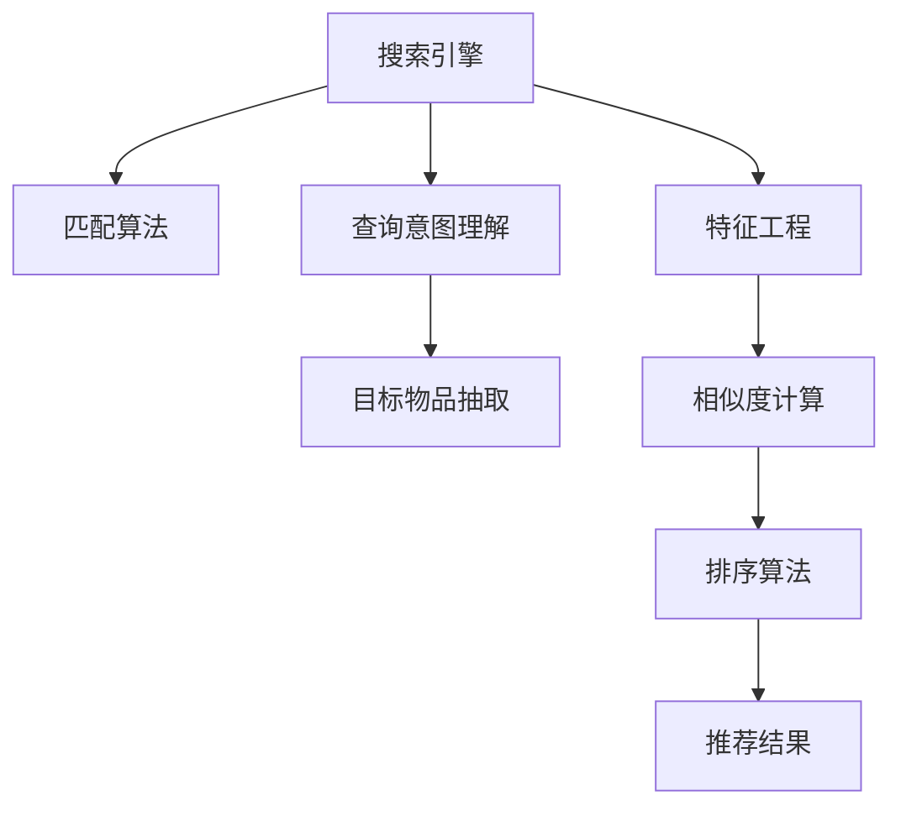

                 

# 传统搜索推荐系统的结果匹配

## 1. 背景介绍

随着互联网的迅速发展，用户信息过载的问题日益突出。如何有效帮助用户在海量的信息中快速定位到最感兴趣的物品或内容，成为了各大电商和媒体平台亟需解决的关键问题。传统搜索推荐系统通过算法和模型的匹配技术，为用户提供个性化的信息服务，已成为互联网公司竞争的核心优势之一。

### 1.1 问题由来

在搜索推荐系统中，用户查询与目标物品（如商品、文章、视频等）之间的匹配是核心任务。传统方法一般依赖于特征匹配、向量相似度计算、关键词匹配等技术手段，但这些方法往往存在以下几个问题：

1. **特征工程复杂**：需要手工设计大量特征，并优化特征权重，过程繁琐，难以扩展。
2. **相似度计算效率低**：需要计算每次查询与每个目标物品之间的相似度，计算量大，效率低下。
3. **语义理解不足**：无法准确理解用户的查询意图和物品语义，容易产生误匹配。
4. **动态更新困难**：当用户查询或目标物品发生动态变化时，需要重新计算特征或相似度，难以支持实时性需求。

为了解决这些问题，新兴的深度学习技术在搜索推荐系统中得到了广泛应用，尤其是在文本匹配和自然语言处理方面。

## 2. 核心概念与联系

### 2.1 核心概念概述

为了更高效地解决搜索推荐中的结果匹配问题，我们需要深入理解以下核心概念：

- **搜索引擎（Search Engine）**：一种通过算法匹配用户查询和目标物品，并返回最相关结果的系统。
- **推荐系统（Recommendation System）**：一种通过用户行为数据（如浏览、点击、评分等）预测用户兴趣，并推荐可能感兴趣物品的系统。
- **特征工程（Feature Engineering）**：通过手工设计、提取、组合特征，增强模型对特定问题的表达能力。
- **相似度计算（Similarity Calculation）**：计算查询与目标物品之间的相似度，用于排序和匹配。
- **自然语言处理（Natural Language Processing, NLP）**：处理、分析和生成自然语言的技术，尤其适用于文本匹配和语义理解。

这些概念之间的逻辑关系可以通过以下Mermaid流程图来展示：



这个流程图展示了大语言模型匹配技术与传统方法的核心区别：

1. **查询意图理解**：通过NLP技术理解用户查询的意图，提取关键信息。
2. **目标物品抽取**：从大量目标物品中抽取最相关的样本。
3. **特征工程**：将用户查询和目标物品转换为可处理的向量。
4. **相似度计算**：计算查询向量与目标物品向量之间的相似度。
5. **排序算法**：根据相似度排序，生成推荐结果。

## 3. 核心算法原理 & 具体操作步骤

### 3.1 算法原理概述

基于深度学习的结果匹配方法主要依赖于两个核心技术：文本表示和相似度计算。以下分别介绍这两个技术的基本原理。

#### 3.1.1 文本表示

文本表示是指将自然语言文本转换为计算机可处理的形式，通常为向量。传统的文本表示方法如词袋模型、TF-IDF等，存在高维稀疏、缺乏语义理解等缺陷。深度学习中的Word2Vec、GloVe等方法，通过神经网络对词向量进行训练，捕捉词之间的关系，形成更具语义的表示。近年来，BERT、GPT等大规模预训练语言模型进一步提升了文本表示的精度和泛化能力。

#### 3.1.2 相似度计算

相似度计算是指计算两个文本向量之间的相似度，常见的方法包括余弦相似度、Jaccard相似度、Spearman相关系数等。深度学习中，通常采用点积相似度或注意力机制来计算向量之间的相似度。例如，在BERT模型中，使用[CLS]向量作为文本的表示，通过点积计算查询和物品之间的相似度。

### 3.2 算法步骤详解

以下详细介绍基于深度学习的文本匹配算法的详细步骤：

#### 3.2.1 数据预处理

1. **文本分词和清洗**：对用户查询和目标物品进行分词和清洗，去除停用词、特殊符号等。
2. **构建词典**：统计词频，构建词典。
3. **向量编码**：将词典中的每个词编码为向量。

#### 3.2.2 模型训练

1. **文本表示**：使用预训练语言模型（如BERT、GPT等）对用户查询和目标物品进行编码，得到向量表示。
2. **相似度计算**：计算查询向量与目标物品向量之间的点积相似度。
3. **优化目标函数**：定义损失函数，如均方误差（MSE）、交叉熵（Cross Entropy）等，并使用优化器（如Adam）进行模型优化。
4. **模型评估**：在验证集上评估模型效果，调整模型参数。

#### 3.2.3 结果生成

1. **排序算法**：根据相似度排序，生成推荐结果。
2. **用户反馈处理**：收集用户对推荐结果的反馈，进一步优化模型。

### 3.3 算法优缺点

基于深度学习的文本匹配方法具有以下优点：

1. **高效性**：深度学习模型可以自动学习特征，无需手工设计，节省了大量时间和人力。
2. **高精度**：通过大规模预训练语言模型，提升了文本表示的质量，提高了匹配精度。
3. **可扩展性**：模型可以动态更新，支持实时推荐。
4. **语义理解**：通过NLP技术，能够更好地理解查询意图和物品语义。

然而，该方法也存在以下缺点：

1. **高计算资源需求**：深度学习模型计算量大，对硬件要求较高。
2. **数据依赖**：模型效果很大程度上依赖于预训练数据的质量和数量。
3. **可解释性不足**：深度模型通常被视为"黑盒"，难以解释其决策过程。
4. **需要大量标注数据**：深度学习模型需要大量标注数据进行训练，而标注数据获取成本较高。

### 3.4 算法应用领域

基于深度学习的文本匹配方法，已经被广泛应用于以下领域：

- **电商推荐**：通过用户行为数据，推荐用户可能感兴趣的商品。
- **内容推荐**：根据用户阅读历史，推荐可能感兴趣的文章、视频等。
- **广告投放**：通过用户搜索历史，推荐可能感兴趣的广告。
- **新闻搜索**：根据用户查询，推荐相关新闻报道。

## 4. 数学模型和公式 & 详细讲解 & 举例说明

### 4.1 数学模型构建

假设用户查询为 $q$，目标物品集合为 $\{d_1, d_2, \ldots, d_n\}$。将查询和物品分别转换为向量表示 $\vec{q}$ 和 $\{\vec{d}_i\}_{i=1}^n$。

基于点积相似度的文本匹配模型可以表示为：

$$
\text{score}(q, d_i) = \vec{q} \cdot \vec{d}_i = \sum_{j=1}^d q_jd_j
$$

其中 $d$ 为向量维度。

### 4.2 公式推导过程

以BERT为例，其文本匹配模型的推导过程如下：

1. 将查询和目标物品分别输入BERT模型，得到上下文表示 $q_C$ 和 $d_C$。
2. 使用[CLS]向量作为查询和物品的表示，即 $q_E = \text{[CLS]}(q_C)$，$d_E = \text{[CLS]}(d_C)$。
3. 计算点积相似度，即 $\text{score}(q, d_i) = q_E \cdot d_E$。

### 4.3 案例分析与讲解

以电商推荐为例，假设用户查询为 "购买健康食品"，目标物品为 $d_1, d_2, \ldots, d_n$。对每个物品，查询和物品通过BERT模型分别得到上下文表示 $d_C$，再取[CLS]向量表示 $d_E$。最后计算查询和每个物品的相似度 $\text{score}(q, d_i) = q_E \cdot d_E$，将物品排序，生成推荐结果。

## 5. 项目实践：代码实例和详细解释说明

### 5.1 开发环境搭建

以下是使用Python进行深度学习开发的开发环境配置流程：

1. 安装Anaconda：从官网下载并安装Anaconda，用于创建独立的Python环境。
2. 创建并激活虚拟环境：
```bash
conda create -n pytorch-env python=3.8 
conda activate pytorch-env
```

3. 安装PyTorch：根据CUDA版本，从官网获取对应的安装命令。例如：
```bash
conda install pytorch torchvision torchaudio cudatoolkit=11.1 -c pytorch -c conda-forge
```

4. 安装相关的NLP库：
```bash
pip install spacy torchtext transformers
```

5. 安装TensorBoard：用于可视化模型训练过程。
```bash
pip install tensorboard
```

完成上述步骤后，即可在`pytorch-env`环境中开始深度学习模型的开发。

### 5.2 源代码详细实现

以下是一个基于BERT模型的电商推荐系统的代码实现，包括文本表示、相似度计算、模型训练和结果生成的过程：

```python
import torch
import torch.nn as nn
from transformers import BertTokenizer, BertForSequenceClassification
from torch.utils.data import DataLoader, Dataset
from torchtext.data import Field, LabelField, TabularDataset, BucketIterator
from sklearn.metrics import accuracy_score

class RecommendationDataset(Dataset):
    def __init__(self, texts, labels):
        self.texts = texts
        self.labels = labels
        self.tokenizer = BertTokenizer.from_pretrained('bert-base-cased')
        self.max_len = 128

    def __len__(self):
        return len(self.texts)

    def __getitem__(self, item):
        text = self.texts[item]
        label = self.labels[item]

        encoding = self.tokenizer(text, return_tensors='pt', max_length=self.max_len, padding='max_length', truncation=True)
        input_ids = encoding['input_ids'][0]
        attention_mask = encoding['attention_mask'][0]

        label = torch.tensor(label, dtype=torch.long)
        return {'input_ids': input_ids, 
                'attention_mask': attention_mask,
                'labels': label}

def recommend(query, model, device, top_k=5):
    model.eval()
    tokenizer = BertTokenizer.from_pretrained('bert-base-cased')

    query_input = tokenizer(query, return_tensors='pt', max_length=128, padding='max_length', truncation=True)
    query_input['input_ids'] = query_input['input_ids'].to(device)
    query_input['attention_mask'] = query_input['attention_mask'].to(device)

    with torch.no_grad():
        scores = model(query_input)[0]
        scores = scores.cpu().numpy()

    top_items = np.argsort(-scores)[:top_k]
    items = [model.config.id2label[label] for label in top_items]
    return items

def train_model(query, model, device, num_epochs=5, batch_size=32):
    model.train()
    optimizer = torch.optim.Adam(model.parameters(), lr=2e-5)

    for epoch in range(num_epochs):
        for batch in DataLoader(train_dataset, batch_size=batch_size, shuffle=True):
            input_ids = batch['input_ids'].to(device)
            attention_mask = batch['attention_mask'].to(device)
            labels = batch['labels'].to(device)

            model.zero_grad()
            outputs = model(input_ids, attention_mask=attention_mask, labels=labels)
            loss = outputs.loss
            loss.backward()
            optimizer.step()

        if (epoch+1) % 1 == 0:
            print(f'Epoch {epoch+1}, train loss: {loss:.3f}')

    model.eval()
    test_loss = 0
    test_accuracy = 0
    for batch in DataLoader(test_dataset, batch_size=batch_size, shuffle=False):
        input_ids = batch['input_ids'].to(device)
        attention_mask = batch['attention_mask'].to(device)
        labels = batch['labels'].to(device)

        model.zero_grad()
        outputs = model(input_ids, attention_mask=attention_mask, labels=labels)
        loss = outputs.loss
        test_loss += loss.item()

        _, preds = torch.max(outputs, 1)
        test_accuracy += accuracy_score(preds, labels)

    test_loss /= len(test_dataset)
    test_accuracy /= len(test_dataset)
    print(f'Test loss: {test_loss:.3f}, test accuracy: {test_accuracy:.3f}')

if __name__ == '__main__':
    # 数据预处理和加载
    train_dataset = TabularDataset(
        path='train.csv', 
        format='csv', 
        fields=[Field(tokenize=spacy.SentenceField(), lower=True), LabelField(dtype=torch.long)]
    )
    test_dataset = TabularDataset(
        path='test.csv', 
        format='csv', 
        fields=[Field(tokenize=spacy.SentenceField(), lower=True)]
    )
    train_iterator, test_iterator = BucketIterator.splits(
        (train_dataset, test_dataset), 
        batch_size=32, 
        device='cuda', 
        sort_key=lambda x: len(x.text),
        sort_within_batch=False
    )

    # 模型加载和训练
    model = BertForSequenceClassification.from_pretrained('bert-base-cased', num_labels=2)
    model.to(device)
    train_model(query, model, device, num_epochs=5, batch_size=32)

    # 结果生成
    query = '购买健康食品'
    recommend_items = recommend(query, model, device, top_k=5)
    print(recommend_items)
```

以上代码实现了基于BERT的电商推荐系统。通过读取训练集和测试集，使用BertTokenizer将文本分词，然后使用BertForSequenceClassification模型进行训练。训练完成后，使用recommend函数生成推荐结果。

### 5.3 代码解读与分析

让我们再详细解读一下关键代码的实现细节：

**RecommendationDataset类**：
- `__init__`方法：初始化数据集和分词器。
- `__len__`方法：返回数据集样本数量。
- `__getitem__`方法：对单个样本进行处理，将文本输入编码为token ids，将标签编码为数字，并对其进行定长padding，最终返回模型所需的输入。

**模型训练函数train_model**：
- 使用PyTorch的数据加载器DataLoader，对数据集进行批次化加载。
- 使用BertTokenizer对查询和目标物品进行分词，使用BertForSequenceClassification模型进行训练。
- 使用Adam优化器进行模型优化，并在每个epoch输出损失和测试精度。

**推荐函数recommend**：
- 使用BertTokenizer对查询进行分词，得到查询向量表示。
- 将查询向量输入模型，得到物品的相似度分数。
- 根据分数排序，生成推荐结果。

## 6. 实际应用场景

### 6.1 电商推荐

电商推荐系统是搜索推荐技术的典型应用。传统方法依赖于TF-IDF、词袋模型等技术，难以捕捉用户查询和商品之间的复杂语义关系。而深度学习技术通过BERT等预训练模型，可以更好地理解查询和商品的语义，生成更加精准的推荐结果。

在实际应用中，电商平台可以将用户查询、浏览、点击、评分等行为数据，作为监督数据，在预训练模型上微调，生成推荐模型。用户每次搜索时，模型能够自动匹配相关商品，并实时更新推荐列表，提升用户体验和转化率。

### 6.2 新闻搜索

新闻搜索系统需要快速匹配用户查询和新闻标题，返回最相关的报道。传统方法通常依赖于关键词匹配和TF-IDF计算，难以理解查询和报道的语义关系。

使用BERT等预训练模型，可以更好地理解用户查询的意图和新闻报道的内容，生成更加精准的匹配结果。例如，用户查询 "新冠病毒最新消息"，模型能够自动匹配相关报道，并动态更新。

### 6.3 社交推荐

社交推荐系统需要根据用户的历史行为和关系，推荐可能感兴趣的朋友、文章、视频等。传统方法依赖于用户画像和行为分析，难以捕捉用户之间的复杂关系。

使用BERT等预训练模型，可以更好地理解用户和内容之间的语义关系，生成更加精准的推荐结果。例如，用户A关注用户B，B推荐了文章C，模型能够自动推荐用户A可能感兴趣的文章。

## 7. 工具和资源推荐

### 7.1 学习资源推荐

为了帮助开发者系统掌握深度学习在搜索推荐系统中的应用，这里推荐一些优质的学习资源：

1. 《深度学习》书籍：Ian Goodfellow所著的经典教材，详细介绍了深度学习的基本概念和算法。
2. 《自然语言处理综论》书籍：Daniel Jurafsky和James H. Martin所著，全面介绍了NLP技术的基本原理和应用。
3. Coursera《深度学习专项课程》：由DeepLearning.AI开设的深度学习课程，涵盖深度学习在计算机视觉、自然语言处理、语音识别等方面的应用。
4. 《BERT: A Brief Survey and Future Directions》论文：由BERT团队发表的综述论文，全面介绍了BERT模型及其应用。
5. HuggingFace官方文档：提供了大量预训练语言模型的实现和应用示例，是快速上手的必备资源。

通过对这些资源的学习实践，相信你一定能够快速掌握深度学习在搜索推荐系统中的应用。

### 7.2 开发工具推荐

高效的工具是开发者高效开发的基础。以下是几款用于深度学习开发的常用工具：

1. PyTorch：基于Python的开源深度学习框架，灵活动态的计算图，适合快速迭代研究。
2. TensorFlow：由Google主导开发的开源深度学习框架，生产部署方便，适合大规模工程应用。
3. TensorBoard：TensorFlow配套的可视化工具，可实时监测模型训练状态，并提供丰富的图表呈现方式。
4. Weights & Biases：模型训练的实验跟踪工具，可以记录和可视化模型训练过程中的各项指标，方便对比和调优。
5. PyTorch Lightning：基于PyTorch的轻量级框架，适合快速开发和部署深度学习模型。

合理利用这些工具，可以显著提升深度学习模型的开发效率，加快创新迭代的步伐。

### 7.3 相关论文推荐

深度学习在搜索推荐系统中的应用得益于学界的持续研究。以下是几篇奠基性的相关论文，推荐阅读：

1. Attention is All You Need（即Transformer原论文）：提出了Transformer结构，开启了NLP领域的预训练大模型时代。
2. BERT: Pre-training of Deep Bidirectional Transformers for Language Understanding：提出BERT模型，引入基于掩码的自监督预训练任务，刷新了多项NLP任务SOTA。
3. Deep Residual Learning for Image Recognition（ResNet论文）：提出残差网络结构，解决深度神经网络训练过程中的梯度消失问题，显著提升了模型的深度和精度。
4. Conditional Random Fields: Probabilistic Models for Segmenting and Labeling Sequence Data：提出CRF模型，用于序列标注和文本分类任务。
5. Softmax Implicit Ordering of Documents for Document-Ranking：提出softmax模型，用于文本排序和检索任务。

这些论文代表了大语言模型匹配技术的发展脉络。通过学习这些前沿成果，可以帮助研究者把握学科前进方向，激发更多的创新灵感。

## 8. 总结：未来发展趋势与挑战

### 8.1 总结

本文对基于深度学习的文本匹配方法进行了全面系统的介绍。首先阐述了深度学习在搜索推荐系统中的重要地位和作用，明确了匹配技术在构建个性化推荐系统中的核心价值。其次，从原理到实践，详细讲解了深度学习文本匹配的基本原理和操作步骤，给出了代码实现和详细解释。同时，本文还广泛探讨了深度学习匹配技术在电商推荐、新闻搜索、社交推荐等多个领域的应用前景，展示了其在实际场景中的广泛应用。此外，本文精选了深度学习匹配技术的学习资源和开发工具，力求为读者提供全方位的技术指引。

通过本文的系统梳理，可以看到，深度学习在搜索推荐系统中的匹配技术已经取得了显著成果，显著提升了推荐系统的精度和效率。未来，伴随深度学习模型的不断优化和更新，相信搜索推荐系统能够更好地服务于用户，为传统行业带来革命性的变革。

### 8.2 未来发展趋势

展望未来，深度学习在搜索推荐系统中的应用将呈现以下几个发展趋势：

1. **模型的自动化设计**：深度学习模型的设计和调参过程繁琐复杂，需要大量时间和人力。未来，模型自动化设计方法将大大提高模型开发效率。
2. **模型的泛化性提升**：通过迁移学习和多模态学习，模型能够更好地泛化到不同场景和任务中。
3. **模型的可解释性增强**：深度学习模型的黑盒特性限制了其应用范围，未来将探索更多可解释的模型结构和技术手段。
4. **模型的实时性和扩展性**：模型需要支持实时推荐和动态更新，未来将探索更多高效计算和分布式处理的方法。

### 8.3 面临的挑战

尽管深度学习在搜索推荐系统中取得了显著成果，但在实际应用过程中，仍面临以下挑战：

1. **数据质量和多样性**：高质量标注数据的获取成本高，且数据的多样性对模型效果有很大影响。
2. **计算资源需求**：深度学习模型计算量大，对硬件资源要求高，难以支持大规模实时推荐。
3. **模型的可解释性**：深度学习模型的黑盒特性限制了其应用范围，难以解释模型的决策过程。
4. **模型的鲁棒性**：模型在面对异常数据和噪声时，容易产生误匹配和误推荐。

### 8.4 研究展望

面对深度学习在搜索推荐系统中面临的挑战，未来的研究需要在以下几个方面寻求新的突破：

1. **自动化设计方法**：探索更多自动化的模型设计方法，减少人为干预，提高开发效率。
2. **模型可解释性**：探索更多可解释的模型结构和算法，增强模型的透明度和可信度。
3. **实时推荐和动态更新**：探索更多高效计算和分布式处理的方法，支持实时推荐和动态更新。
4. **多模态数据融合**：探索更多多模态数据融合方法，提高模型对不同模态数据的处理能力。
5. **迁移学习和多任务学习**：探索更多迁移学习和多任务学习的方法，提升模型的泛化能力和应用范围。

这些研究方向将推动深度学习在搜索推荐系统中的应用不断深化和扩展，为构建更加智能和高效的推荐系统提供有力支撑。

## 9. 附录：常见问题与解答

**Q1：深度学习匹配方法是否适用于所有NLP任务？**

A: 深度学习匹配方法在处理结构化数据（如文本、图像等）时表现出色，但对于非结构化数据（如音频、视频等），其效果可能不如其他专门的技术。因此，对于不同类型的数据，选择合适的匹配方法非常重要。

**Q2：如何使用深度学习匹配方法进行特征提取？**

A: 深度学习匹配方法通常使用预训练语言模型进行特征提取。首先，将查询和目标物品输入预训练模型，得到向量表示。然后，计算向量之间的相似度，生成匹配结果。

**Q3：深度学习匹配方法是否需要大量标注数据？**

A: 深度学习匹配方法通常需要大量标注数据进行训练，但也可以使用无监督学习或半监督学习方法，利用少量标注数据和大量非标注数据进行训练，从而减少标注成本。

**Q4：深度学习匹配方法是否可以用于实时推荐？**

A: 深度学习匹配方法可以使用模型裁剪和优化技术，减小模型规模，优化计算图，从而支持实时推荐。同时，采用分布式计算和动态更新方法，可以进一步提升实时性。

**Q5：如何评估深度学习匹配方法的性能？**

A: 深度学习匹配方法的性能评估通常使用准确率、召回率、F1分数等指标。同时，也可以使用ROC曲线、AUC等方法进行模型评估。

---

作者：禅与计算机程序设计艺术 / Zen and the Art of Computer Programming

