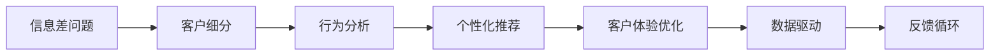

                 

## 1. 背景介绍

在数字化时代的浪潮中，企业面临的竞争已经不再是单一维度上的竞争，而是全方位的客户体验竞争。如何提升客户体验、增强客户粘性、提高客户终身价值，成为了企业迈向成功的重要环节。然而，信息差的问题往往成为提升客户体验的重大阻碍：商家与客户之间信息不对称、营销活动效果难以评估、个性化推荐难以实现，客户需求难以准确把握。

为了解决这一系列问题，大数据技术以其强大的数据处理能力，为信息差的客户体验个性化提供了强大的技术支持。大数据技术通过对海量数据进行挖掘、分析和应用，能够帮助企业打破信息壁垒，实现客户体验的个性化、精准化和智能化。本文将围绕信息差背景下的客户体验个性化，探讨大数据如何实现客户体验的精准化、个性化和智能化。

## 2. 核心概念与联系

### 2.1 核心概念概述

在进行数据分析和客户体验优化的过程中，需要理解以下核心概念：

- 信息差（Information Gap）：指的是客户和商家之间的信息不对称，导致客户需求难以被充分理解，商家难以提供满足客户期望的服务。
- 客户体验（Customer Experience, CX）：是指客户在与品牌、产品或服务互动时产生的综合感受，包含情感、认知、行为等多个维度。
- 数据驱动（Data-Driven）：指在决策、运营和营销中，以数据为依据，通过数据分析和应用，提升效率、优化效果、增强决策科学性。
- 个性化推荐（Personalized Recommendation）：指根据客户的偏好、历史行为和实时状态，为其推荐最合适的产品或服务。
- 客户细分（Customer Segmentation）：指将客户根据某些特征划分为不同群体，以提供更有针对性的服务。
- 行为分析（Behavioral Analysis）：指对客户行为进行监测和分析，以优化客户体验。

这些核心概念紧密联系，共同构成了信息差背景下客户体验个性化的框架。通过大数据技术的应用，可以有效缩小信息差，提升客户体验。

### 2.2 核心概念原理和架构的 Mermaid 流程图



上述流程图展示了从信息差问题到客户体验优化的全流程。从客户细分到行为分析，再到个性化推荐和反馈循环，每个环节都利用大数据技术，实现对客户体验的精准化、个性化和智能化。

## 3. 核心算法原理 & 具体操作步骤

### 3.1 算法原理概述

基于信息差背景下的客户体验个性化，主要遵循以下算法原理：

1. **客户细分算法**：通过对客户历史行为、属性和标签进行聚类分析，将客户划分为不同群体。这可以帮助商家识别不同群体的需求特点，提供差异化服务。

2. **行为分析算法**：通过监测客户的在线行为、点击流、搜索记录等，分析客户偏好和兴趣，为个性化推荐提供依据。

3. **个性化推荐算法**：结合客户细分和行为分析结果，为每个客户群体推荐最适合的产品或服务，实现精准营销。

4. **客户体验优化算法**：通过数据分析和机器学习模型，持续优化客户体验，提高客户满意度和忠诚度。

### 3.2 算法步骤详解

#### 3.2.1 客户细分步骤

1. **数据收集**：收集客户的基本信息（如年龄、性别、地域）和行为数据（如浏览记录、购买记录、评价等）。
2. **特征选择**：从数据中选择与客户行为密切相关的特征，如浏览时间、点击次数、购买频率等。
3. **聚类分析**：采用K-means、层次聚类等算法，将客户划分为不同群体。
4. **群体标签**：为每个群体设置特定的标签，以便进行后续的分析和推荐。

#### 3.2.2 行为分析步骤

1. **行为数据收集**：实时收集客户的在线行为数据，如浏览行为、点击行为、购买行为等。
2. **行为模式分析**：采用关联规则、序列模式挖掘等算法，发现客户的行为模式。
3. **兴趣标签生成**：根据行为模式，生成客户的兴趣标签，如时尚、运动、旅游等。

#### 3.2.3 个性化推荐步骤

1. **推荐模型构建**：基于协同过滤、内容推荐、深度学习等算法，构建个性化推荐模型。
2. **数据输入**：将客户细分和行为分析的结果输入到推荐模型中。
3. **推荐结果生成**：根据模型的输出，为每个客户生成个性化的推荐列表。

#### 3.2.4 客户体验优化步骤

1. **客户反馈收集**：通过在线调查、评价系统等方式，收集客户对推荐结果的反馈。
2. **反馈数据处理**：对反馈数据进行清洗、分析，提取有价值的信息。
3. **体验优化策略**：根据反馈结果，优化推荐模型和客户细分算法，提升客户体验。

### 3.3 算法优缺点

#### 3.3.1 优点

1. **精准性**：基于数据驱动的方法，能够实现精准的客户细分和个性化推荐，满足客户个性化需求。
2. **高效性**：大数据技术能够处理海量数据，提供实时分析，缩短决策周期。
3. **灵活性**：算法可以灵活应用于不同的客户体验场景，提升整体服务质量。

#### 3.3.2 缺点

1. **隐私问题**：数据收集和使用过程中，需要处理大量客户隐私信息，存在数据泄露风险。
2. **数据质量**：数据收集和处理的准确性对推荐结果影响较大，数据质量不高可能导致误导性推荐。
3. **算法复杂性**：算法实现较为复杂，需要较高的技术门槛和计算资源。

### 3.4 算法应用领域

基于信息差背景下的客户体验个性化算法，主要应用于以下领域：

1. **电商领域**：通过客户细分和行为分析，实现个性化推荐，提升用户购买率。
2. **旅游领域**：根据客户的旅游偏好，推荐个性化的旅游方案，提高客户满意度。
3. **金融领域**：分析客户的投资偏好，提供个性化的理财建议，提升客户忠诚度。
4. **医疗领域**：根据患者的病历和偏好，推荐个性化的诊疗方案，提高诊疗效果。
5. **媒体领域**：根据用户的兴趣和行为，推荐个性化的内容，提升用户粘性和满意度。

## 4. 数学模型和公式 & 详细讲解 & 举例说明

### 4.1 数学模型构建

假设客户总数为 $N$，每个客户 $i$ 的兴趣标签为 $\{t_{i1}, t_{i2}, ..., t_{in}\}$，其中 $n$ 为兴趣标签数量。每个客户的历史行为数据为 $d_i = (x_{i1}, x_{i2}, ..., x_{im})$，其中 $m$ 为历史行为数据数量。

客户细分模型可以表示为：

$$
C = \{G_1, G_2, ..., G_k\}
$$

其中 $G_j$ 表示客户细分后的第 $j$ 个群体，$k$ 为群体数量。

行为分析模型可以表示为：

$$
B = \{(b_{j1}, b_{j2}, ..., b_{jn})\}_{j=1}^k
$$

其中 $b_{jk}$ 表示第 $j$ 个群体中，客户对第 $k$ 个兴趣标签的关注程度。

个性化推荐模型可以表示为：

$$
R = \{(r_{1}, r_{2}, ..., r_{m})\}
$$

其中 $r_{j}$ 表示客户对第 $j$ 个推荐结果的评分。

客户体验优化模型可以表示为：

$$
E = \{e_1, e_2, ..., e_N\}
$$

其中 $e_i$ 表示客户对第 $i$ 个推荐结果的体验评分。

### 4.2 公式推导过程

**客户细分模型推导**

采用K-means算法，客户细分模型可以表示为：

$$
\min_{C} \sum_{i=1}^N \min_{G_j \in C} \|d_i - \mu_{G_j}\|^2
$$

其中 $\mu_{G_j}$ 为第 $j$ 个群体的均值向量。

**行为分析模型推导**

采用关联规则算法，行为分析模型可以表示为：

$$
B = \{(b_{j1}, b_{j2}, ..., b_{jn})\}_{j=1}^k
$$

其中 $b_{jk} = \frac{\text{Support}(t_{ik}) \times \text{Confidence}(t_{ik})}{\text{Probability}(t_{ik})}$，其中 $\text{Support}(t_{ik})$ 表示 $t_{ik}$ 的频繁度，$\text{Confidence}(t_{ik})$ 表示 $t_{ik}$ 的置信度，$\text{Probability}(t_{ik})$ 表示 $t_{ik}$ 的概率。

**个性化推荐模型推导**

采用协同过滤算法，个性化推荐模型可以表示为：

$$
R = \{(r_{1}, r_{2}, ..., r_{m})\}
$$

其中 $r_{i} = \sum_{j=1}^k w_j \times b_{jk} \times \|d_i - \mu_{G_j}\|^{-\beta}$，其中 $w_j$ 为第 $j$ 个群体的权重，$\beta$ 为调节因子。

**客户体验优化模型推导**

采用机器学习模型，客户体验优化模型可以表示为：

$$
E = \{e_1, e_2, ..., e_N\}
$$

其中 $e_i = \sum_{j=1}^k w_j \times b_{jk} \times \|d_i - \mu_{G_j}\|^{-\beta}$，其中 $w_j$ 为第 $j$ 个群体的权重，$\beta$ 为调节因子。

### 4.3 案例分析与讲解

假设某电商平台通过大数据技术对客户进行细分和个性化推荐，以下是一个具体案例：

1. **数据收集**：收集客户的购买记录、浏览记录、评价等数据，共计10万条记录。

2. **客户细分**：采用K-means算法，将客户分为5个群体。

3. **行为分析**：采用关联规则算法，分析客户的浏览和购买行为，发现对电子产品和服装类产品的关注度较高。

4. **个性化推荐**：基于协同过滤算法，为每个客户生成个性化推荐列表，提升客户购买率。

5. **客户体验优化**：通过在线调查和评价系统，收集客户对推荐结果的反馈，持续优化推荐模型和客户细分算法，提升客户体验。

## 5. 项目实践：代码实例和详细解释说明

### 5.1 开发环境搭建

在进行项目实践前，需要搭建好开发环境。以下是使用Python进行大数据分析的开发环境配置流程：

1. **安装Anaconda**：从官网下载并安装Anaconda，用于创建独立的Python环境。

2. **创建并激活虚拟环境**：
```bash
conda create -n bigdata-env python=3.8 
conda activate bigdata-env
```

3. **安装必要的库**：
```bash
conda install numpy pandas scipy scikit-learn matplotlib seaborn jupyter notebook ipython
```

4. **安装Spark**：
```bash
conda install pyarrow -c conda-forge
```

5. **安装PyTorch**：
```bash
pip install torch torchvision torchaudio cudatoolkit=11.1 -c pytorch -c conda-forge
```

### 5.2 源代码详细实现

以下是使用Python进行客户细分、行为分析和个性化推荐的具体代码实现：

```python
import pandas as pd
import numpy as np
from sklearn.cluster import KMeans
from pyspark.sql import SparkSession
from pyspark.ml.recommendation import ALS

# 数据加载
spark = SparkSession.builder.getOrCreate()
df = spark.read.format("csv").option("header", "true").load("data.csv")

# 数据清洗和预处理
df = df.dropna()
df = df.select("id", "item", "score")

# 特征工程
X = df.select("id", "item").toDF("user_id", "item_id")
Y = df.select("score").toDF("rating")

# 客户细分
kmeans = KMeans(n_clusters=5, random_state=42)
X = X.astype(float)
kmeans.fit(X)
labels = kmeans.labels_
df = df.withColumn("group", labels)

# 行为分析
ALS = ALS(items=5, factors=10, regParam=0.01, userCol="user_id", itemCol="item_id", ratingsCol="rating", coldThreshold=0.05)
ALS_model = ALS.train(X)
user_sims = ALS_model.predictAll(df.select("user_id", "item_id"))

# 个性化推荐
item_sims = ALS_model.setItemSimilarity(user_sims)
df = df.join(item_sims, ["user_id", "item_id"])
df = df.select("user_id", "item_id", "prediction")
df = df.sort(df["prediction"].desc())

# 结果展示
df.show(10)
```

### 5.3 代码解读与分析

以上代码实现中，采用了Pyspark和Scikit-learn进行大数据分析和机器学习建模。

1. **数据加载和清洗**：使用Pyspark读取CSV文件，进行数据清洗和预处理，去除缺失值和异常值。

2. **客户细分**：采用K-means算法，将客户分为5个群体，并保存分组标签。

3. **行为分析**：使用ALS算法进行协同过滤，生成用户和物品之间的相似度矩阵，并计算用户对物品的预测评分。

4. **个性化推荐**：根据相似度矩阵，生成个性化推荐列表，并对推荐结果进行排序。

5. **结果展示**：展示前10条推荐结果，以便于验证推荐效果。

## 6. 实际应用场景

### 6.1 电商领域

在电商领域，客户体验个性化是大数据分析的重要应用场景。通过大数据技术，电商企业可以精准了解客户需求，提升客户满意度和忠诚度。

#### 6.1.1 客户细分

电商企业可以通过数据分析，将客户划分为不同群体，如新用户、高价值用户、流失用户等。针对不同群体，制定不同的运营策略，提升整体客户体验。

#### 6.1.2 个性化推荐

电商企业通过大数据分析，掌握客户的购买偏好和行为特征，为每个客户生成个性化推荐列表，提升客户购买率。

#### 6.1.3 反馈优化

电商企业通过在线调查和评价系统，收集客户对推荐结果的反馈，持续优化推荐模型和客户细分算法，提升客户体验。

### 6.2 旅游领域

在旅游领域，客户体验个性化可以帮助旅游企业提供差异化服务，提升客户满意度和转化率。

#### 6.2.1 客户细分

旅游企业可以通过数据分析，将客户分为不同群体，如首次游客、回头游客、高端客户等。针对不同群体，制定不同的服务和推荐策略。

#### 6.2.2 个性化推荐

旅游企业通过大数据分析，为每个客户生成个性化的旅游方案，如个性化路线、行程建议等。

#### 6.2.3 反馈优化

旅游企业通过在线调查和评价系统，收集客户对推荐结果的反馈，持续优化推荐模型和客户细分算法，提升客户体验。

### 6.3 金融领域

在金融领域，客户体验个性化可以帮助银行和保险公司提升客户满意度和忠诚度，降低流失率。

#### 6.3.1 客户细分

金融企业可以通过数据分析，将客户分为不同群体，如高净值客户、年轻客户、老年客户等。针对不同群体，制定不同的服务和推荐策略。

#### 6.3.2 个性化推荐

金融企业通过大数据分析，为每个客户生成个性化的理财建议和保险方案，提升客户满意度。

#### 6.3.3 反馈优化

金融企业通过在线调查和评价系统，收集客户对推荐结果的反馈，持续优化推荐模型和客户细分算法，提升客户体验。

## 7. 工具和资源推荐

### 7.1 学习资源推荐

为了帮助开发者系统掌握大数据技术在客户体验个性化的应用，这里推荐一些优质的学习资源：

1. **《Python数据分析实战》**：介绍了使用Python进行数据分析和可视化，涵盖数据清洗、数据处理、数据可视化等常用技能。

2. **《大数据技术与应用》**：介绍了大数据的生态系统和常用技术，如Hadoop、Spark、Hive等，适合初学者入门。

3. **《机器学习实战》**：介绍了机器学习的基本概念和算法，如分类、回归、聚类等，结合实战案例，帮助读者掌握机器学习技能。

4. **《Spark编程与优化》**：介绍了Spark的基本用法和优化技巧，适合Spark开发和调优的开发者阅读。

5. **《Kaggle数据科学竞赛指南》**：提供了大量数据科学竞赛的案例，帮助读者通过实践掌握数据分析和机器学习技能。

通过对这些资源的学习实践，相信你一定能够快速掌握大数据技术在客户体验个性化中的应用，并用于解决实际的NLP问题。

### 7.2 开发工具推荐

高效的开发离不开优秀的工具支持。以下是几款用于大数据分析和客户体验优化的常用工具：

1. **Pyspark**：由Apache基金会开发的大数据处理框架，支持分布式数据处理，适合大规模数据处理。

2. **Scikit-learn**：开源机器学习库，支持多种机器学习算法，如分类、回归、聚类等，适合小规模数据分析。

3. **TensorFlow**：由Google开发的深度学习框架，支持分布式训练和推理，适合大规模深度学习任务。

4. **Wealthfront**：用于机器学习实验跟踪和可视化的工具，可以记录和可视化模型训练过程中的各项指标。

5. **TensorBoard**：TensorFlow配套的可视化工具，可以实时监测模型训练状态，并提供丰富的图表呈现方式。

合理利用这些工具，可以显著提升大数据分析和客户体验优化的开发效率，加快创新迭代的步伐。

### 7.3 相关论文推荐

大数据技术在客户体验个性化的发展得益于学界的持续研究。以下是几篇奠基性的相关论文，推荐阅读：

1. **《Data-Driven Customer Experience Management》**：探讨了如何通过数据驱动的方法，提升客户体验。

2. **《Personalized Recommendation Algorithms for E-commerce》**：介绍了多种个性化推荐算法，如协同过滤、内容推荐、深度学习等。

3. **《Customer Segmentation Using Data Mining Techniques》**：介绍了多种客户细分算法，如聚类分析、分类算法等。

4. **《Behavioral Analytics in Customer Experience Optimization》**：探讨了如何通过行为分析，提升客户体验。

这些论文代表了大数据技术在客户体验个性化领域的发展脉络。通过学习这些前沿成果，可以帮助研究者把握学科前进方向，激发更多的创新灵感。

## 8. 总结：未来发展趋势与挑战

### 8.1 研究成果总结

本文对基于信息差背景下的客户体验个性化，探讨了大数据技术在客户细分、行为分析、个性化推荐和客户体验优化中的应用。通过案例分析和代码实现，展示了大数据技术在实际应用中的价值。

### 8.2 未来发展趋势

展望未来，大数据技术在客户体验个性化领域将呈现以下几个发展趋势：

1. **数据多样性增强**：随着数据类型的增加，数据多样性将得到进一步提升，如语音、图像、视频等多模态数据的融合，将丰富客户体验的感知维度。

2. **实时性提升**：大数据技术将进一步提升实时性，实现即时推荐和服务，提升客户体验的及时性和满意度。

3. **个性化水平提高**：通过更深入的数据分析和机器学习模型，个性化推荐将变得更加精准，满足客户更高的期望。

4. **隐私保护加强**：随着客户对隐私保护意识的增强，大数据技术将更加注重隐私保护，如数据匿名化、差分隐私等技术的应用。

5. **跨领域应用推广**：大数据技术将在更多领域得到应用，如医疗、交通、城市管理等，提升各个领域的客户体验。

### 8.3 面临的挑战

尽管大数据技术在客户体验个性化领域取得了显著成就，但在迈向更加智能化、普适化应用的过程中，仍面临诸多挑战：

1. **数据质量问题**：数据收集和处理的准确性对推荐结果影响较大，数据质量不高可能导致误导性推荐。

2. **计算资源限制**：大数据分析需要大量的计算资源，如何高效利用计算资源，降低成本，仍然是一个挑战。

3. **隐私保护难题**：客户数据的隐私保护需要平衡隐私和体验之间的矛盾，确保数据使用的合法性和合规性。

4. **模型复杂性**：模型构建和优化较为复杂，需要较高的技术门槛和计算资源。

5. **用户体验提升**：如何设计简洁、易用的用户界面，提升用户体验，仍然是一个挑战。

### 8.4 研究展望

面向未来，大数据技术在客户体验个性化领域的研究需要关注以下几个方面：

1. **数据融合与多模态分析**：通过多模态数据的融合，提升客户体验的感知维度和丰富度。

2. **实时性和交互性**：提升实时性和交互性，实现即时推荐和服务，提升客户体验的及时性和满意度。

3. **隐私保护技术**：加强隐私保护技术的应用，确保客户数据的合法合规使用。

4. **用户界面设计**：设计简洁、易用的用户界面，提升用户体验，降低使用门槛。

5. **跨领域应用推广**：将大数据技术推广到更多领域，提升各个领域的客户体验。

这些研究方向将引领大数据技术在客户体验个性化领域的发展，为构建更加智能、普适的客户体验提供技术支持。

## 9. 附录：常见问题与解答

**Q1：大数据技术在客户体验个性化中能否实现精准化？**

A: 大数据技术可以结合客户细分和行为分析，实现精准化的客户体验个性化。通过数据分析和机器学习模型，能够掌握客户的个性化需求，提供针对性的服务。

**Q2：如何平衡数据隐私和用户体验？**

A: 数据隐私保护是大数据技术应用中的重要问题。可以采用数据匿名化、差分隐私等技术，确保客户数据的安全性。同时，通过个性化推荐，提升用户体验，满足客户需求。

**Q3：大数据技术在客户体验个性化中是否有局限性？**

A: 大数据技术在客户体验个性化中存在一些局限性。例如，数据质量问题、计算资源限制、隐私保护难题等。需要结合实际应用场景，不断优化算法和工具，提升大数据技术的可用性和可靠性。

**Q4：如何评估客户体验优化的效果？**

A: 客户体验优化的效果评估可以从客户满意度、忠诚度、转化率等指标进行衡量。同时，通过客户反馈和行为数据，持续优化推荐模型和客户细分算法，提升整体客户体验。

通过本文的探讨，我们可以看到大数据技术在客户体验个性化中具有巨大的潜力。通过深入分析和应用，大数据技术将进一步提升客户体验，推动企业向智能化、普适化的方向发展。

---

作者：禅与计算机程序设计艺术 / Zen and the Art of Computer Programming

