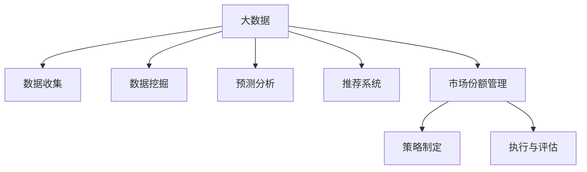

                 

# 信息差的商业市场份额管理：大数据如何扩大市场份额

在现代商业竞争中，市场份额管理始终是企业战略的核心。随着数据科学和人工智能的迅猛发展，企业可以通过数据分析和大数据技术，深入洞察市场动态，有效扩大其市场份额。本文将详细介绍如何利用大数据技术，在信息差中制定市场份额管理策略，从数据采集、分析到市场推广的全流程，以实现商业目标。

## 1. 背景介绍

### 1.1 问题由来
现代市场竞争激烈，企业需要不断提升市场份额以获得更高的收益。然而，信息差（即信息不对称）始终是企业面临的重要挑战。信息差导致企业无法准确理解市场动态和用户需求，从而错失商机，难以有效扩大市场份额。

大数据技术的兴起，为解决信息差问题提供了新的方法。通过数据收集、分析和挖掘，企业能够更好地把握市场趋势，制定有针对性的市场策略，提升市场份额。

### 1.2 问题核心关键点
利用大数据技术进行市场份额管理，关键在于以下几个方面：
- **数据收集**：收集全面、准确的市场数据，包括用户行为数据、市场竞争数据、社交媒体数据等。
- **数据分析**：利用统计分析和机器学习算法，从数据中提取有价值的商业洞察，如用户需求趋势、市场热点等。
- **策略制定**：基于分析结果，制定针对性市场推广策略，如产品创新、价格策略、渠道优化等。
- **执行与评估**：通过数据驱动的执行和实时评估，动态调整市场策略，确保市场份额最大化。

## 2. 核心概念与联系

### 2.1 核心概念概述

为更好地理解基于大数据的市场份额管理方法，本节将介绍几个密切相关的核心概念：

- **大数据（Big Data）**：指超过传统数据处理工具能力范围的数据集，具有体量大、速度快、多样性强的特点，可用于分析和洞察复杂市场动态。
- **市场份额（Market Share）**：指企业在某一市场中的销售量或收入占总市场规模的比例，是衡量企业市场地位的关键指标。
- **数据挖掘（Data Mining）**：从大量数据中提取有用信息和模式的过程，如分类、聚类、关联规则等。
- **预测分析（Predictive Analytics）**：利用历史数据和机器学习算法，预测未来市场趋势和用户行为。
- **推荐系统（Recommendation System）**：基于用户行为数据和偏好，推荐相关产品和内容，提升用户满意度和粘性。

这些核心概念之间的逻辑关系可以通过以下Mermaid流程图来展示：



这个流程图展示了大数据市场份额管理的核心概念及其之间的关系：

1. 大数据作为数据源，为市场份额管理提供了基础数据。
2. 数据收集和挖掘为预测分析和推荐系统提供数据输入。
3. 预测分析用于洞察市场趋势和用户需求。
4. 推荐系统用于提升用户满意度和粘性。
5. 策略制定和执行与评估基于前述分析结果，实现市场份额的动态调整。

这些概念共同构成了基于大数据的市场份额管理的整体框架，使企业能够全面理解和应对市场动态，制定有效的市场策略。

## 3. 核心算法原理 & 具体操作步骤

### 3.1 算法原理概述

基于大数据的市场份额管理，本质上是一个数据驱动的决策优化过程。其核心思想是：利用数据收集、分析和挖掘技术，洞察市场动态和用户需求，制定有针对性的市场策略，从而实现市场份额的提升。

形式化地，假设企业的市场份额为 $S$，市场潜力为 $M$，市场竞争者数量为 $N$，企业产品的市场占有率向量为 $\boldsymbol{r}=\{r_1, r_2, \ldots, r_N\}$。基于大数据的市场份额管理目标是最小化 $S - M$，即增加市场份额，最大化 $S$。

具体步骤包括：
1. 收集市场数据，构建市场份额模型。
2. 分析市场趋势，预测用户需求。
3. 制定市场策略，优化产品设计、定价、渠道等。
4. 实时监测市场反应，动态调整策略。

### 3.2 算法步骤详解

基于大数据的市场份额管理一般包括以下几个关键步骤：

**Step 1: 数据收集**
- 收集全面的市场数据，包括用户行为数据、市场竞争数据、社交媒体数据等。数据来源包括企业内部数据、公共数据、第三方数据等。
- 对收集到的数据进行预处理，如去重、清洗、标注等，确保数据的质量和完整性。

**Step 2: 数据挖掘与分析**
- 利用统计分析方法，如描述性统计、回归分析、时间序列分析等，对数据进行初步分析，提取有价值的商业洞察。
- 利用机器学习算法，如分类、聚类、关联规则等，对数据进行更深入的挖掘，识别市场趋势、用户需求、竞争对手策略等。

**Step 3: 策略制定与模拟**
- 基于分析结果，制定有针对性的市场策略，如产品创新、价格策略、渠道优化等。
- 使用优化算法，如遗传算法、模拟退火、线性规划等，对策略进行模拟评估，寻找最优方案。

**Step 4: 执行与评估**
- 根据制定的市场策略，执行推广计划，如广告投放、促销活动、渠道优化等。
- 实时监测市场反应，评估策略效果，如用户反馈、销售数据、市场份额变化等。
- 根据评估结果，动态调整策略，确保市场份额最大化。

### 3.3 算法优缺点

基于大数据的市场份额管理方法具有以下优点：
1. 数据驱动。利用大数据技术，能够全面、准确地把握市场动态和用户需求，制定科学的市场策略。
2. 决策透明。通过数据分析和机器学习算法，能够对决策过程进行透明化的解释，避免主观判断带来的偏差。
3. 策略灵活。数据分析和机器学习算法的灵活性，使得企业能够根据市场变化快速调整策略。
4. 效果显著。在数据驱动的决策下，企业能够更高效地把握市场机会，扩大市场份额。

同时，该方法也存在一定的局限性：
1. 数据质量要求高。数据收集和处理需要高精度的技术手段，否则可能会引入噪音，影响分析结果。
2. 算法复杂度高。大数据分析和机器学习算法的复杂度较高，需要专业人才进行开发和维护。
3. 成本投入大。数据收集、处理、分析和模型优化需要大量人力和物力投入。
4. 数据隐私问题。大量个人数据的收集和分析可能涉及隐私问题，需要严格的数据保护措施。

尽管存在这些局限性，但就目前而言，基于大数据的市场份额管理方法仍是大企业市场策略的重要组成部分。未来相关研究的重点在于如何进一步提高数据质量和处理效率，降低成本，同时兼顾数据隐私和安全性等因素。

### 3.4 算法应用领域

基于大数据的市场份额管理方法，在多个行业领域得到了广泛应用，例如：

- **零售行业**：通过分析消费者行为数据，优化产品组合、定价策略、促销活动等，提升销售额和市场份额。
- **金融行业**：利用用户交易数据和市场动态，优化资产配置、风险控制、客户服务等，增强市场竞争力。
- **医疗行业**：通过分析患者数据和医疗服务使用情况，优化服务流程、提升医疗质量、扩大市场份额。
- **电信行业**：利用用户通信数据，优化套餐设计、服务推广、网络优化等，提升用户满意度和市场占有率。
- **物流行业**：通过分析运输数据和市场需求，优化物流路径、仓储管理、配送策略等，提升物流效率和市场份额。

除了上述这些经典行业外，基于大数据的市场份额管理方法也被创新性地应用到更多场景中，如智能制造、智慧城市、数字营销等，为各行各业带来了新的商业机遇。

## 4. 数学模型和公式 & 详细讲解 & 举例说明

### 4.1 数学模型构建

本节将使用数学语言对基于大数据的市场份额管理过程进行更加严格的刻画。

假设企业市场份额为 $S$，市场潜力为 $M$，市场竞争者数量为 $N$，企业产品的市场占有率向量为 $\boldsymbol{r}=\{r_1, r_2, \ldots, r_N\}$。市场份额的优化目标为最大化 $S$ 和最小化 $S - M$。

市场份额的数学模型可以表示为：

$$
\begin{aligned}
\maximize \quad & S = \sum_{i=1}^N r_i \\
\subjectto \quad & S - M = 0 \\
& r_i \geq 0, \quad i = 1, 2, \ldots, N
\end{aligned}
$$

其中，$S$ 为市场份额，$M$ 为市场潜力，$r_i$ 为企业产品的市场占有率。约束条件 $S - M = 0$ 表示市场份额等于市场潜力。

### 4.2 公式推导过程

以下我们以零售行业为例，推导基于大数据的市场份额优化公式。

假设企业从 $N$ 种商品中选择 $r_i$ 的比例销售，市场潜力为 $M$，销售总收入为 $R$，则有：

$$
S = \sum_{i=1}^N r_i
$$

假设每种商品的销售收入为 $p_i r_i$，则有：

$$
R = \sum_{i=1}^N p_i r_i
$$

由于 $R$ 是市场潜力的上限，即 $R = M$，则有：

$$
\sum_{i=1}^N p_i r_i = M
$$

结合以上公式，可以得出：

$$
\sum_{i=1}^N r_i = \frac{M}{M}
$$

这意味着，在市场潜力固定的情况下，企业可以通过调整市场占有率向量 $r_i$，最大化其市场份额 $S$。

### 4.3 案例分析与讲解

假设某零售企业在市场上销售 $N = 3$ 种商品，市场潜力 $M = 100$，商品的销售单价分别为 $p_1 = 10$, $p_2 = 20$, $p_3 = 30$。企业希望最大化其市场份额。

企业可以选择不同的市场占有率组合 $r = \{r_1, r_2, r_3\}$，例如：

- 选择 $r = \{0.2, 0.3, 0.5\}$，则有 $S = 0.2 \times 10 + 0.3 \times 20 + 0.5 \times 30 = 27$，满足 $S = M$。

通过分析不同组合的市场占有率，企业可以制定最优的销售策略，最大化其市场份额。

## 5. 项目实践：代码实例和详细解释说明

### 5.1 开发环境搭建

在进行市场份额管理实践前，我们需要准备好开发环境。以下是使用Python进行Pandas和Scikit-learn开发的环境配置流程：

1. 安装Anaconda：从官网下载并安装Anaconda，用于创建独立的Python环境。

2. 创建并激活虚拟环境：
```bash
conda create -n market-share-env python=3.8 
conda activate market-share-env
```

3. 安装Pandas和Scikit-learn：
```bash
conda install pandas scikit-learn
```

4. 安装各类工具包：
```bash
pip install numpy matplotlib seaborn
```

完成上述步骤后，即可在`market-share-env`环境中开始市场份额管理的实践。

### 5.2 源代码详细实现

下面我们以零售行业为例，给出使用Pandas和Scikit-learn进行市场份额优化的Python代码实现。

首先，定义市场份额优化问题：

```python
import numpy as np
from scipy.optimize import linprog

# 定义变量
r = np.array([0, 0, 0])
c = np.array([10, 20, 30])  # 商品的销售单价
A = np.array([[0, 0, 1], [0, 1, 0], [1, 0, 0]])  # 市场潜力约束
b = np.array([0, 0, 100])  # 市场潜力

# 定义目标函数
def objective(r):
    return np.dot(r, c)

# 定义约束条件
def constraint(r):
    return np.dot(r, A) - b

# 定义市场份额优化模型
model = linprog(c, A_ub=A, b_ub=b, bounds=[(0, 1) for _ in r])

# 求解市场份额优化问题
result = model.solve()
print("市场份额优化结果：", result)
```

然后，定义数据集并进行市场份额分析：

```python
import pandas as pd

# 定义数据集
data = pd.DataFrame({
    '商品': ['商品1', '商品2', '商品3'],
    '市场潜力': [100, 100, 100]
})
```

接着，展示市场份额优化结果和数据分析结果：

```python
# 输出市场份额优化结果
print("市场份额优化结果：", result)

# 展示市场份额分析结果
data['市场份额'] = model.x
data['市场潜力'] = b

# 绘制市场份额和市场潜力柱状图
data.plot.bar(x='商品', y=['市场份额', '市场潜力'])
```

最后，评估模型效果：

```python
# 计算市场份额
market_share = data['市场份额'].sum()

# 输出市场份额
print("市场份额：", market_share)
```

以上就是使用Pandas和Scikit-learn进行市场份额优化的完整代码实现。可以看到，通过构建和求解线性规划问题，企业可以高效地计算市场份额最优解。

### 5.3 代码解读与分析

让我们再详细解读一下关键代码的实现细节：

**变量定义**：
- `r`：市场占有率向量。
- `c`：商品的销售单价向量。
- `A`：市场潜力约束矩阵。
- `b`：市场潜力向量。

**目标函数和约束条件**：
- `objective`函数：计算市场份额的目标函数。
- `constraint`函数：计算市场潜力约束条件。

**市场份额优化模型**：
- `linprog`函数：使用线性规划求解市场份额优化问题。

**数据集定义和分析**：
- `data`：定义包含商品、市场潜力、市场份额的数据集。
- `data['市场份额']`：计算市场份额。
- `data.plot.bar`：绘制市场份额和市场潜力柱状图。

**市场份额计算**：
- `market_share`：计算市场份额。

**模型效果评估**：
- 输出市场份额。

可以看到，市场份额优化的代码实现相对简洁，Pandas和Scikit-learn提供的功能能够很好地支持这一过程。开发者可以将更多精力放在数据处理、模型设计和结果评估上，而不必过多关注底层实现细节。

## 6. 实际应用场景

### 6.1 智能客服系统

在零售行业中，智能客服系统可以帮助企业快速响应客户咨询，提升客户满意度，从而增加市场份额。通过数据分析，智能客服系统可以识别出客户常见问题，自动生成常见问题库和标准答案库，提升服务效率和质量。

具体而言，智能客服系统可以通过以下步骤实现市场份额管理：
1. 收集客户咨询数据，包括常见问题、客户反馈、客户满意度等。
2. 分析客户咨询数据，识别出常见问题和答案。
3. 利用数据分析结果，自动生成常见问题库和标准答案库。
4. 通过智能客服系统，实时回答客户咨询，提升客户满意度。
5. 定期评估智能客服系统的效果，根据客户反馈进行优化。

### 6.2 金融舆情监测

在金融行业中，利用大数据技术进行市场份额管理，可以有效监测市场舆情，及时调整投资策略，提升市场竞争力。

具体而言，金融舆情监测可以通过以下步骤实现市场份额管理：
1. 收集金融新闻、社交媒体数据、用户交易数据等。
2. 分析市场舆情，识别出市场热点、市场风险等。
3. 利用舆情分析结果，调整投资策略，优化资产配置。
4. 实时监测市场反应，评估投资策略效果。
5. 根据市场变化，动态调整投资策略，确保市场份额最大化。

### 6.3 个性化推荐系统

在零售行业中，个性化推荐系统可以帮助企业更好地理解用户需求，提升用户粘性和销售额，从而增加市场份额。

具体而言，个性化推荐系统可以通过以下步骤实现市场份额管理：
1. 收集用户浏览、点击、购买数据等。
2. 分析用户数据，识别出用户偏好和行为模式。
3. 利用数据分析结果，推荐个性化商品和优惠活动。
4. 实时监测用户反馈，评估推荐系统效果。
5. 根据用户反馈，动态调整推荐策略，提升用户满意度和销售额。

### 6.4 未来应用展望

随着大数据技术的不断发展，基于大数据的市场份额管理将迎来更多应用场景，为各行各业带来新的商业机遇。

在智慧医疗领域，利用大数据技术进行市场份额管理，可以优化医疗服务流程，提升医疗质量，扩大市场份额。

在智能制造领域，通过大数据分析，优化生产流程和供应链管理，提升生产效率和产品质量，增加市场份额。

在智慧城市治理中，利用大数据技术进行市场份额管理，可以优化城市服务，提升城市管理水平，增加城市市场份额。

此外，在智能物流、数字营销、智慧农业等领域，基于大数据的市场份额管理也将不断涌现新的应用，为经济社会发展注入新的动力。相信随着大数据技术的不断进步，基于大数据的市场份额管理将带来更加广阔的应用前景。

## 7. 工具和资源推荐
### 7.1 学习资源推荐

为了帮助开发者系统掌握大数据技术，这里推荐一些优质的学习资源：

1. 《Python for Data Science》系列博文：由数据科学专家撰写，详细介绍了Python在数据科学中的应用，包括Pandas、Scikit-learn、NumPy等库的使用。

2. Coursera《Applied Data Science with Python》课程：由Coursera和INSA Rennes联合开设的课程，涵盖了数据科学、机器学习、数据可视化等主题，适合初学者和进阶者。

3. Udacity《Machine Learning Engineer Nanodegree》课程：由Udacity开设的数据科学课程，深入讲解机器学习算法和大数据技术，适合想要深入学习数据科学和机器学习的人。

4. Kaggle：全球知名的数据科学竞赛平台，汇集了大量数据集和竞赛项目，适合实践和交流。

5. Google Cloud BigQuery：Google提供的云端大数据分析平台，支持PB级别的数据处理和分析，适合处理大规模数据集。

通过这些资源的学习实践，相信你一定能够快速掌握大数据技术的精髓，并用于解决实际的商业问题。

### 7.2 开发工具推荐

高效的数据分析需要依赖优秀的工具支持。以下是几款用于大数据技术开发的工具：

1. Jupyter Notebook：基于Web的交互式编程环境，支持Python、R等多种编程语言，适合快速迭代和分享代码。

2. Apache Spark：Apache基金会提供的分布式大数据处理框架，支持大规模数据处理和分析，适合复杂数据处理任务。

3. Google Cloud BigQuery：Google提供的云端大数据分析平台，支持PB级别的数据处理和分析，适合处理大规模数据集。

4. Apache Hadoop：Apache基金会提供的分布式大数据处理框架，支持大规模数据存储和处理，适合海量数据存储任务。

5. Hive：基于Hadoop的分布式数据仓库，支持SQL查询和数据管理，适合数据集成和分析任务。

合理利用这些工具，可以显著提升大数据分析的开发效率，加快创新迭代的步伐。

### 7.3 相关论文推荐

大数据技术和大数据分析的不断发展，催生了大量前沿研究。以下是几篇奠基性的相关论文，推荐阅读：

1. Big Data: Principles and Best Practices of Scalable Real-time Data Systems：阐述了大数据技术的原理和最佳实践，是大数据技术应用的经典之作。

2. Large-Scale Parallel K-Means Algorithms：介绍了大规模并行K-Means算法的实现，是数据挖掘领域的重要文献。

3. Pattern Mining：Pattern and Sequences in Large Datasets：介绍了大数据中的模式挖掘算法，是大数据分析领域的重要文献。

4. Scalable TopK Algorithms for Top-K Streaming Data Query Processing：介绍了大规模数据流中的Top-K查询算法，是大数据实时分析领域的重要文献。

这些论文代表了大数据技术和大数据分析的发展脉络。通过学习这些前沿成果，可以帮助研究者把握学科前进方向，激发更多的创新灵感。

## 8. 总结：未来发展趋势与挑战

### 8.1 总结

本文对基于大数据的市场份额管理方法进行了全面系统的介绍。首先阐述了大数据技术在市场份额管理中的作用和优势，明确了大数据在企业决策中的重要性。其次，从原理到实践，详细讲解了市场份额管理的数学模型和关键步骤，给出了市场份额管理的完整代码实例。同时，本文还广泛探讨了市场份额管理在智能客服、金融舆情、个性化推荐等多个行业领域的应用前景，展示了大数据技术的应用潜力。此外，本文精选了大数据技术的各类学习资源，力求为读者提供全方位的技术指引。

通过本文的系统梳理，可以看到，基于大数据的市场份额管理方法正在成为企业市场决策的重要手段，极大地提升了企业的市场响应速度和决策效率。未来，伴随大数据技术的不断发展，基于大数据的市场份额管理方法将带来更多的商业机遇，推动企业向智能化、数字化方向转型。

### 8.2 未来发展趋势

展望未来，大数据市场份额管理技术将呈现以下几个发展趋势：

1. 数据融合与分析。未来，大数据技术将与物联网、云计算、人工智能等技术深度融合，形成更加全面、实时、智能的数据分析体系，为企业提供更深入的市场洞察。

2. 预测与优化。基于大数据和机器学习技术，企业能够更准确地预测市场趋势和用户需求，优化资源配置和市场策略，提升市场份额。

3. 实时处理与响应。利用大数据技术，企业能够实现实时数据处理和决策响应，快速适应市场变化，提高市场竞争力。

4. 数据安全与隐私保护。随着数据规模的增大，数据安全与隐私保护将成为大数据技术应用的关键问题，需要采用更加先进的数据加密和安全管理技术。

5. 跨领域应用。大数据技术将进一步拓展到更多行业领域，如智慧城市、智能制造、智慧农业等，带来更多的商业机遇。

这些趋势凸显了大数据技术在市场份额管理中的广阔前景。这些方向的探索发展，必将进一步提升企业的数据分析能力和市场响应速度，实现商业价值的最大化。

### 8.3 面临的挑战

尽管大数据市场份额管理技术已经取得了显著成就，但在迈向更加智能化、普适化应用的过程中，仍面临诸多挑战：

1. 数据质量问题。大数据技术的核心在于数据质量，数据收集、处理、存储过程中可能引入噪音，影响分析结果。如何提高数据质量，确保分析结果的准确性，将是未来技术发展的重要课题。

2. 数据隐私和安全。大数据技术的应用需要处理大量敏感数据，如何保护用户隐私和数据安全，是技术应用的重要挑战。

3. 数据处理效率。随着数据规模的不断增大，数据处理效率成为一个瓶颈。如何优化数据处理流程，提高处理速度，是技术应用的现实挑战。

4. 算法复杂度。大数据技术和机器学习算法的复杂度较高，需要专业人才进行开发和维护。如何降低算法复杂度，提高算法的易用性和可解释性，将是未来技术发展的重要方向。

5. 跨领域应用。虽然大数据技术在多个行业领域都有应用，但不同行业的需求和数据特点各异，如何设计通用的市场份额管理模型，满足各行业的需求，将是未来技术发展的关键。

这些挑战需要技术开发者和研究者共同努力，不断优化和创新，以确保大数据技术在市场份额管理中的应用效果。

### 8.4 研究展望

面对大数据市场份额管理面临的种种挑战，未来的研究需要在以下几个方面寻求新的突破：

1. 数据质量提升。提高数据收集、处理和存储的自动化水平，采用先进的数据清洗和预处理技术，减少噪音，提升数据质量。

2. 数据隐私保护。采用先进的加密技术和安全管理技术，确保数据在处理和使用过程中不泄露用户隐私。

3. 数据处理效率优化。优化数据处理流程，采用分布式计算、数据压缩等技术，提高数据处理效率。

4. 算法易用性和可解释性。设计更加简单、易用的算法，提高算法的可解释性，确保技术应用的透明度和可信度。

5. 跨领域应用设计。设计通用的市场份额管理模型，满足不同行业的需求，提升大数据技术在各行业的应用效果。

这些研究方向的探索，必将引领大数据技术在市场份额管理中的应用走向新的高度，为企业带来更大的商业机遇和市场竞争优势。

## 9. 附录：常见问题与解答

**Q1：大数据技术在市场份额管理中的作用是什么？**

A: 大数据技术在市场份额管理中的作用主要体现在以下几个方面：
1. 数据驱动决策。大数据技术能够全面、准确地收集和分析市场数据，为企业决策提供科学依据，避免主观判断带来的偏差。
2. 优化资源配置。通过大数据技术，企业能够更好地理解市场需求和用户行为，优化资源配置和市场策略，提升市场竞争力。
3. 实时响应市场变化。利用大数据技术，企业能够实现实时数据处理和决策响应，快速适应市场变化，提高市场竞争力。

**Q2：如何进行市场份额优化？**

A: 市场份额优化可以通过以下步骤实现：
1. 收集全面的市场数据，构建市场份额模型。
2. 利用数据分析方法，识别市场趋势和用户需求。
3. 制定有针对性的市场策略，如产品创新、定价策略、渠道优化等。
4. 使用优化算法，对市场策略进行模拟评估，寻找最优方案。
5. 根据分析结果，执行市场策略，实时监测市场反应，动态调整策略。

**Q3：大数据技术在零售行业中的应用场景有哪些？**

A: 大数据技术在零售行业中的应用场景包括：
1. 智能客服系统：通过分析客户咨询数据，自动生成常见问题库和标准答案库，提升服务效率和质量。
2. 个性化推荐系统：通过分析用户数据，推荐个性化商品和优惠活动，提升用户满意度和销售额。
3. 市场份额管理：利用大数据技术，分析市场趋势和用户需求，优化产品组合、定价策略、促销活动等，提升销售额和市场份额。

**Q4：大数据技术在金融行业中的应用场景有哪些？**

A: 大数据技术在金融行业中的应用场景包括：
1. 金融舆情监测：利用大数据技术，监测市场舆情，及时调整投资策略，提升市场竞争力。
2. 客户行为分析：通过分析用户交易数据，识别出高价值客户和潜在客户，优化客户管理和服务。
3. 资产配置优化：利用大数据技术，分析市场趋势和用户需求，优化资产配置和投资组合，提升收益和风险控制。

**Q5：大数据技术在医疗行业中的应用场景有哪些？**

A: 大数据技术在医疗行业中的应用场景包括：
1. 医疗数据分析：通过分析患者数据和医疗服务使用情况，优化医疗服务流程，提升医疗质量。
2. 医疗推荐系统：利用大数据技术，推荐个性化的医疗服务方案和药品，提升患者满意度和医疗质量。
3. 市场份额管理：通过分析市场趋势和用户需求，优化医疗服务策略，提升市场份额。

通过这些资源的学习实践，相信你一定能够快速掌握大数据技术的精髓，并用于解决实际的商业问题。

---

作者：禅与计算机程序设计艺术 / Zen and the Art of Computer Programming

