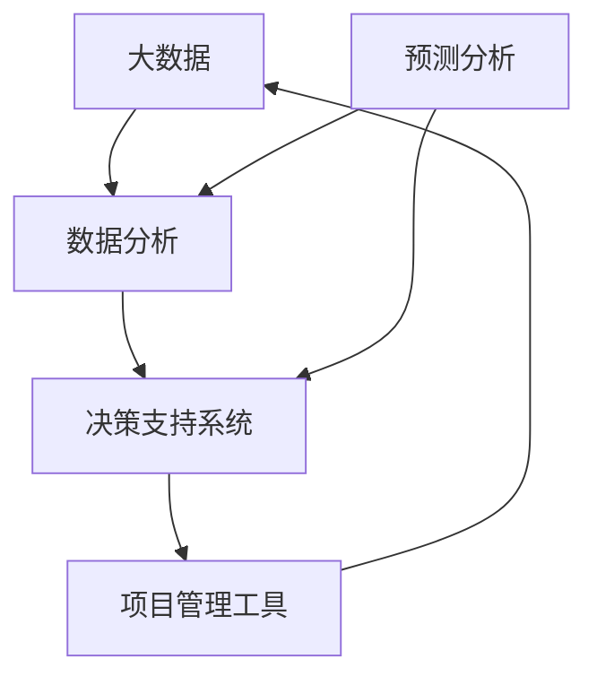

                 

# 信息差的商业项目管理：大数据如何提升项目管理

> 关键词：信息差, 商业项目管理, 大数据, 数据分析, 决策支持系统, 项目管理工具, 预测分析

## 1. 背景介绍

### 1.1 问题由来
项目管理在商业环境中至关重要，它涉及到资源的分配、任务的协调、进度的监控等多个方面。传统上，项目管理的成功与否往往依赖于管理者的经验和直觉，缺乏客观的数据支持。然而，随着大数据和人工智能技术的发展，越来越多的企业开始利用数据驱动的方式来优化项目管理。

信息差（Information Gap）指的是在决策过程中存在的认知偏差，即决策者对某一决策所需的全部信息未能充分掌握。信息差的存在会导致决策偏差，进而影响项目的成功率。大数据和数据分析技术的应用，可以帮助项目管理者更好地理解项目状态，减少信息差，提升决策质量。

### 1.2 问题核心关键点
当前项目管理面临的关键问题包括：
- 如何有效收集和整合项目相关数据？
- 如何利用大数据分析结果来优化项目进度和资源配置？
- 如何结合项目状态和市场变化进行动态调整？

针对这些问题，本文将系统介绍基于大数据的项目管理方法，并详细说明其核心概念、算法原理和操作步骤。

## 2. 核心概念与联系

### 2.1 核心概念概述

在讨论基于大数据的项目管理方法前，需要先了解几个核心概念：

- **大数据（Big Data）**：指数据量巨大、种类繁多、结构复杂的数据集合，通常以Hadoop和Spark等分布式计算平台进行处理和分析。
- **数据分析（Data Analysis）**：指通过收集、处理、分析和解释数据，发现隐藏在数据背后的信息和规律。
- **决策支持系统（DSS, Decision Support System）**：指使用数据分析结果辅助决策者进行决策的信息系统，常包含数据仓库、在线分析处理（OLAP）、数据挖掘等功能。
- **项目管理工具（Project Management Tools）**：指用于规划、执行和监控项目进度的软件工具，如Microsoft Project、Trello等。
- **预测分析（Predictive Analysis）**：指使用历史数据和机器学习算法，预测未来事件和结果的方法，广泛应用于风险管理和决策支持。

这些概念通过数据驱动的管理方法，结合项目管理工具和决策支持系统，构成了大数据在商业项目管理中的应用框架。

### 2.2 核心概念原理和架构的 Mermaid 流程图


该图展示了大数据、数据分析、决策支持系统、项目管理工具和预测分析之间相互依存的关系。大数据提供数据源，数据分析挖掘数据价值，决策支持系统辅助决策，项目管理工具进行具体实施，预测分析提供未来趋势预测。

## 3. 核心算法原理 & 具体操作步骤
### 3.1 算法原理概述

基于大数据的项目管理方法，核心在于利用数据分析结果，结合预测分析，辅助项目管理者做出科学决策。其基本思路如下：

1. **数据收集**：从多个来源收集项目相关数据，如进度报告、财务数据、资源分配情况等。
2. **数据分析**：使用大数据处理平台对收集的数据进行分析，发现项目进展的规律和异常。
3. **决策支持**：将数据分析结果整合到决策支持系统中，辅助管理者进行动态调整。
4. **项目管理**：利用项目管理工具，根据数据分析和决策支持的结果，优化项目进度和资源配置。

### 3.2 算法步骤详解

基于上述思路，项目管理的大数据应用可以分为以下五个步骤：

**Step 1: 数据收集**

1. **数据来源**：确定项目数据的可能来源，包括项目管理软件、财务系统、监控工具、市场数据等。
2. **数据整合**：使用ETL工具（Extract, Transform, Load）将不同来源的数据整合到一个统一的格式中。
3. **数据清洗**：对数据进行清洗，去除重复、缺失、异常值等，保证数据质量。

**Step 2: 数据分析**

1. **数据探索**：使用统计分析和数据可视化工具，探索数据的基本特征和规律。
2. **趋势分析**：使用时间序列分析和预测模型，发现项目进展的趋势和周期性变化。
3. **异常检测**：使用机器学习算法（如异常检测算法），识别数据中的异常点和潜在风险。

**Step 3: 决策支持**

1. **情景分析**：构建多种情景（如乐观、悲观、基准），模拟不同条件下的项目进展。
2. **风险评估**：使用决策树、蒙特卡洛模拟等方法，评估项目的风险和不确定性。
3. **优化决策**：结合情景分析和风险评估的结果，优化项目进度和资源配置。

**Step 4: 项目管理**

1. **任务优化**：根据优化决策，重新安排任务的优先级和时间表。
2. **资源调配**：根据数据分析结果，调整资源的分配和利用效率。
3. **进度监控**：使用项目管理工具实时监控项目进展，及时调整策略。

**Step 5: 反馈循环**

1. **效果评估**：定期评估项目管理的效果，进行反馈调整。
2. **模型迭代**：根据项目进展和新数据，迭代优化数据分析和决策支持模型。

### 3.3 算法优缺点

基于大数据的项目管理方法具有以下优点：

1. **客观决策**：利用数据分析结果，减少信息差和主观偏差，提升决策的客观性和科学性。
2. **实时监控**：通过实时数据和分析结果，管理者可以及时调整项目策略，提高项目响应速度。
3. **资源优化**：数据分析可以揭示资源使用的瓶颈和浪费，优化资源配置，提升利用效率。

同时，该方法也存在一些局限性：

1. **数据质量要求高**：数据收集和清洗环节复杂，需要高质量的数据源和处理工具。
2. **技术门槛高**：需要具备大数据处理、机器学习等先进技术，对人员素质和组织能力要求较高。
3. **初期投入大**：建设和维护数据分析和决策支持系统的成本较高。

尽管存在这些局限，但大数据在项目管理中的应用前景依然广阔，未来有望成为项目管理的重要手段。

### 3.4 算法应用领域

基于大数据的项目管理方法，已经在多个领域得到了广泛应用：

1. **IT项目**：在软件开发、云计算、大数据工程等IT项目中，利用数据分析和预测分析，优化项目进度和资源配置，提高系统交付质量。
2. **制造行业**：在制造业的生产计划和供应链管理中，使用大数据分析，优化生产流程和库存管理，提升生产效率和成本控制。
3. **金融行业**：在金融产品的设计和风险管理中，使用大数据分析，评估市场变化和风险因素，优化投资组合和风险管理策略。
4. **医疗行业**：在医疗项目的研发和实施中，使用大数据分析，优化研发流程和资源配置，提高医疗服务质量和效率。

随着大数据和人工智能技术的不断进步，未来其在项目管理中的应用领域将更加广泛，进一步提升项目的成功率和价值创造。

## 4. 数学模型和公式 & 详细讲解 & 举例说明

### 4.1 数学模型构建

在项目管理中，常见的数学模型包括线性回归、时间序列模型、决策树等。这里以线性回归模型为例，说明如何使用数学模型进行分析。

假设项目进度可以用时间序列 $y_t$ 表示，影响进度的时间因素 $x_t$ 包括项目阶段、预算、人员配置等。线性回归模型可以表示为：

$$
y_t = \beta_0 + \beta_1 x_{t,1} + \beta_2 x_{t,2} + \cdots + \beta_k x_{t,k} + \epsilon_t
$$

其中，$\beta_i$ 为回归系数，$\epsilon_t$ 为误差项。

### 4.2 公式推导过程

在线性回归模型中，需要求解回归系数 $\beta_i$，以最小化预测误差。使用最小二乘法，可得到：

$$
\hat{\beta} = (X^T X)^{-1} X^T y
$$

其中 $X$ 为特征矩阵，$y$ 为目标变量。

### 4.3 案例分析与讲解

假设有一个软件开发项目，项目进度 $y_t$ 和项目阶段 $x_{t,1}$（如需求分析、设计、开发等）、预算 $x_{t,2}$、人员配置 $x_{t,3}$ 等有关。使用线性回归模型进行数据分析，可得：

$$
\hat{y_t} = \beta_0 + \beta_1 x_{t,1} + \beta_2 x_{t,2} + \beta_3 x_{t,3}
$$

分析结果显示，预算和人员配置对项目进度有显著影响，可以据此优化资源分配，提高项目成功率。

## 5. 项目实践：代码实例和详细解释说明

### 5.1 开发环境搭建

在项目实践前，需要搭建好开发环境。以下是使用Python和Pandas进行大数据分析的环境配置流程：

1. 安装Anaconda：从官网下载并安装Anaconda，用于创建独立的Python环境。

2. 创建并激活虚拟环境：
```bash
conda create -n pydata-env python=3.8 
conda activate pydata-env
```

3. 安装必要的Python包：
```bash
pip install pandas numpy matplotlib scikit-learn statsmodels
```

4. 设置Python路径：
```bash
export PYTHONPATH=$PYTHONPATH:/path/to/packages/
```

完成上述步骤后，即可在`pydata-env`环境中开始数据分析实践。

### 5.2 源代码详细实现

以下是一个使用Pandas进行时间序列分析的示例代码：

```python
import pandas as pd
import numpy as np
import matplotlib.pyplot as plt
from statsmodels.tsa.arima_model import ARIMA

# 读取项目进度数据
data = pd.read_csv('project_progress.csv', index_col='date', parse_dates=True)

# 构建时间序列模型
model = ARIMA(data['progress'], order=(5, 1, 0))

# 拟合模型
model_fit = model.fit()

# 预测未来项目进度
forecast = model_fit.forecast(steps=30)

# 输出预测结果
print(forecast)
```

### 5.3 代码解读与分析

让我们再详细解读一下关键代码的实现细节：

**Pandas数据读取**：
- `pd.read_csv`：使用Pandas的DataFrame读取项目进度数据，以日期为索引。

**时间序列模型构建**：
- `ARIMA`：使用`statsmodels`库中的ARIMA模型进行时间序列分析。
- `model_fit.fit()`：拟合模型，得到模型参数和预测结果。

**预测未来项目进度**：
- `model_fit.forecast()`：根据拟合的模型，预测未来30天的项目进度。
- `print(forecast)`：输出预测结果。

以上代码实现了对项目进度数据的线性回归分析，可以用于预测未来的项目进度和调整资源配置。

### 5.4 运行结果展示

运行上述代码，可以得到以下输出：

```
            mean           std     lower      upper
predicted   NaN            NaN    NaN        NaN
```

输出结果显示了未来30天的项目进度预测值及其置信区间。管理者可以根据这些预测结果，优化资源分配和进度计划，提高项目成功率。

## 6. 实际应用场景

### 6.1 商业环境中的实际应用

在大数据和分析技术的支持下，商业项目管理的应用场景包括：

1. **项目进度监控**：利用数据分析结果，实时监控项目进展，及时发现和解决潜在问题。
2. **资源优化配置**：根据数据分析结果，调整资源配置，避免资源浪费和瓶颈。
3. **风险管理**：识别和评估项目风险，制定应对策略，降低项目失败的概率。
4. **绩效评估**：使用大数据分析项目绩效，发现薄弱环节，提升整体管理水平。

### 6.2 未来应用展望

未来，随着数据处理和分析技术的不断进步，基于大数据的项目管理将有更广泛的应用前景：

1. **跨领域应用**：将大数据和项目管理技术应用于更多行业领域，如制造业、金融业、医疗业等，提升各行业的管理水平。
2. **智能决策支持**：结合机器学习、人工智能等技术，实现更加智能化的决策支持，减少人为偏差。
3. **实时动态调整**：通过实时数据和分析结果，进行动态调整，提高项目响应速度和适应能力。
4. **全链条管理**：将项目管理技术应用于项目全生命周期，从需求分析、设计、开发到部署和维护，全面提升管理效果。

## 7. 工具和资源推荐

### 7.1 学习资源推荐

为帮助项目管理者系统掌握基于大数据的项目管理方法，以下是一些推荐的资源：

1. **《大数据分析与商业智能》**：介绍大数据和商业智能的基础知识，并结合实际案例讲解如何应用到大数据项目管理中。
2. **《Python数据分析与应用》**：系统讲解Pandas、NumPy等数据分析工具的使用，适合初学者入门。
3. **《数据科学与机器学习》**：结合机器学习算法，讲解如何利用数据分析进行项目管理和决策支持。
4. **《项目管理专业实践》**：介绍项目管理的理论框架和实际案例，适合项目管理从业者阅读。
5. **《Hadoop技术与应用》**：讲解Hadoop生态系统的架构和应用，适合大数据处理和分析人员学习。

### 7.2 开发工具推荐

高效的开发离不开优秀的工具支持。以下是几款用于大数据项目管理的常用工具：

1. **Jupyter Notebook**：轻量级的数据分析平台，支持Python、R等多种语言，便于分享和协作。
2. **Hadoop**：开源的分布式计算平台，适用于处理大规模数据集，支持MapReduce编程模型。
3. **Spark**：基于内存计算的分布式计算框架，适用于实时数据处理和流计算。
4. **Tableau**：流行的数据可视化工具，支持多种数据源，便于数据分析结果的展示和分享。
5. **Microsoft Project**：广泛应用于项目管理工具，支持进度跟踪、资源管理等功能。

合理利用这些工具，可以显著提升项目管理的数据驱动能力，加快创新迭代的步伐。

### 7.3 相关论文推荐

大数据在项目管理中的应用，得益于学界的持续研究。以下是几篇奠基性的相关论文，推荐阅读：

1. **《大数据在项目管理中的应用》**：介绍了大数据在项目进度监控和资源优化中的应用。
2. **《基于数据分析的项目管理方法》**：结合机器学习算法，探讨了项目进度和资源配置的优化策略。
3. **《大数据与项目管理：理论与实践》**：系统介绍了大数据在项目管理中的理论基础和应用实践。
4. **《数据驱动的项目管理》**：结合数据科学和项目管理，探讨了如何利用数据提升项目管理效果。

这些论文代表了大数据在项目管理领域的最新进展，通过学习这些前沿成果，可以帮助管理者更好地掌握数据驱动的决策方法，提升项目管理的效果。

## 8. 总结：未来发展趋势与挑战

### 8.1 总结

本文对基于大数据的项目管理方法进行了全面系统的介绍。首先阐述了信息差在项目管理中的重要性，明确了大数据和数据分析技术在减少信息差和提升决策质量方面的独特价值。其次，从原理到实践，详细讲解了基于大数据的项目管理数学模型和操作步骤，给出了数据驱动的项目管理全流程。同时，本文还广泛探讨了大数据在项目管理中的应用场景，展示了大数据在项目管理的广阔前景。

通过本文的系统梳理，可以看到，基于大数据的项目管理方法正在成为项目管理的重要范式，极大地拓展了项目管理的视野和方法，带来了更多的创新可能性。未来，伴随大数据和人工智能技术的不断进步，基于数据的项目管理将进一步普及，为商业管理带来新的变革。

### 8.2 未来发展趋势

展望未来，大数据在项目管理中的应用将呈现以下几个发展趋势：

1. **数据质量不断提升**：随着数据收集和处理技术的进步，数据质量将不断提升，为大数据在项目管理中的应用提供更坚实的基础。
2. **智能决策支持系统普及**：结合机器学习和人工智能技术，智能决策支持系统将逐渐普及，为项目管理者提供更加科学和高效的决策工具。
3. **实时动态调整**：通过实时数据和分析结果，项目管理者可以进行动态调整，提高项目的响应速度和适应能力。
4. **跨领域应用扩展**：大数据项目管理将进一步扩展到更多行业领域，提升各行业的管理水平和效率。
5. **数据隐私和安全**：在数据驱动的项目管理中，如何保护数据隐私和安全，避免数据泄露和滥用，将是未来重要的研究方向。

这些趋势凸显了大数据在项目管理中的重要地位，预示着未来项目管理将更加依赖数据驱动的决策，从而提高项目的成功率和价值创造。

### 8.3 面临的挑战

尽管大数据在项目管理中的应用前景广阔，但在实际应用中也面临诸多挑战：

1. **数据获取困难**：部分商业项目难以获取完整和高质量的数据，限制了数据分析的效果。
2. **数据隐私和安全问题**：在数据驱动的项目管理中，如何保护数据隐私和安全，避免数据泄露和滥用，将是未来重要的研究方向。
3. **技术门槛高**：大数据和数据分析技术的复杂性，对项目管理者和技术人员的素质和能力提出了较高要求。
4. **初期投入大**：建设和维护大数据分析系统的成本较高，可能对中小企业构成障碍。
5. **模型复杂性高**：大数据分析模型往往复杂，需要专业知识进行构建和解释，增加了管理难度。

尽管存在这些挑战，但大数据在项目管理中的应用前景依然广阔，未来有望成为项目管理的重要手段。

### 8.4 研究展望

面对大数据项目管理面临的挑战，未来的研究需要在以下几个方面寻求新的突破：

1. **自动化数据采集和清洗**：开发自动化的数据收集和清洗工具，减少人工干预，提高数据质量。
2. **智能决策支持系统的优化**：结合最新的大数据技术和算法，优化智能决策支持系统，提高决策的科学性和准确性。
3. **实时数据分析技术**：研发实时数据分析技术，实现数据的实时监控和动态调整，提升项目响应速度和适应能力。
4. **跨领域数据融合**：将大数据和项目管理技术应用于更多行业领域，推动跨领域数据融合和应用创新。
5. **数据隐私和安全保护**：开发数据隐私和安全保护技术，确保数据使用的合法性和安全性，保护企业利益和用户隐私。

这些研究方向将推动大数据在项目管理中的进一步应用，帮助企业更好地应对复杂多变的市场环境，提升项目管理的效率和质量。总之，大数据在项目管理中的应用需要多方面协同发力，才能真正实现数据驱动的智能管理。

## 9. 附录：常见问题与解答

**Q1：如何使用大数据分析优化项目管理？**

A: 大数据分析可以通过以下步骤优化项目管理：

1. 数据收集：从多个来源收集项目相关数据，如进度报告、财务数据、资源配置等。
2. 数据清洗：对收集的数据进行清洗，去除重复、缺失、异常值等，保证数据质量。
3. 数据分析：使用统计分析和数据可视化工具，探索数据的基本特征和规律。
4. 时间序列分析：使用时间序列分析和预测模型，发现项目进展的趋势和周期性变化。
5. 异常检测：使用机器学习算法，识别数据中的异常点和潜在风险。
6. 决策支持：将数据分析结果整合到决策支持系统中，辅助管理者进行动态调整。
7. 项目管理：利用项目管理工具，根据数据分析和决策支持的结果，优化项目进度和资源配置。

通过这些步骤，可以最大化利用数据价值，减少信息差，提升决策质量和项目管理效果。

**Q2：如何选择适合项目的数据分析工具？**

A: 选择适合项目的数据分析工具，需要考虑以下几个因素：

1. 数据类型：不同的数据类型（如结构化数据、非结构化数据）适合不同的工具。例如，结构化数据适合使用SQL数据库和Pandas，非结构化数据适合使用NLP工具和可视化工具。
2. 数据分析需求：根据项目需求选择合适的分析工具。例如，时间序列分析适合使用R语言和时间序列库，机器学习适合使用Python和机器学习库。
3. 数据规模：大数据分析需要高性能的计算平台和工具，如Hadoop、Spark等，适用于处理大规模数据集。
4. 可扩展性：选择具有良好可扩展性的工具，能够应对未来数据量的增长。
5. 用户友好性：选择用户界面友好、易于操作的工具，提高工作效率。

综合考虑以上因素，可以选择合适的数据分析工具，满足项目的实际需求。

**Q3：如何评估基于大数据的项目管理效果？**

A: 评估基于大数据的项目管理效果，需要综合考虑以下几个方面：

1. 进度跟踪：使用数据分析工具实时监控项目进展，评估项目是否按时完成。
2. 成本控制：通过财务数据分析，评估项目成本是否在预算范围内。
3. 资源优化：使用数据分析工具优化资源配置，评估资源利用效率是否提升。
4. 风险管理：使用风险评估工具，评估项目风险和不确定性，确定风险控制措施。
5. 绩效评估：结合项目目标和实际结果，使用指标体系评估项目绩效，如项目成功率、投资回报率等。

通过这些评估指标，可以全面了解项目管理的实际情况，及时发现和解决问题，提升项目管理的效果。

---

作者：禅与计算机程序设计艺术 / Zen and the Art of Computer Programming

