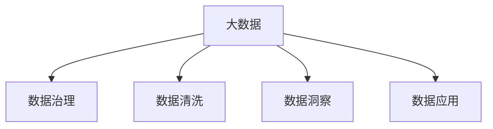

                 

# 信息差的市场份额扩大：大数据如何扩大市场份额

## 1. 背景介绍

### 1.1 问题由来

在互联网时代，数据的重要性日益凸显。从电子商务到社交媒体，从金融服务到医疗健康，数据无处不在，成为了企业决策的重要依据。然而，信息差的现象依然普遍存在，即企业掌握了不同质量、不同维度的数据，导致市场竞争格局的倾斜。如何利用大数据技术，提高数据质量，扩大市场份额，是企业战略中的关键问题。

### 1.2 问题核心关键点

信息差是指企业在获取、处理和使用数据时，所掌握的信息在质量、准确性和全面性上存在差异。这一现象可能由多种因素引起，包括数据来源的可靠性、数据处理技术的先进性、数据解读的深度等。信息差的市场份额扩大，即通过提高数据质量，扩大企业在市场中的竞争优势。

本文将从数据治理、数据清洗、数据洞察和数据应用四个方面，探讨如何利用大数据技术，消除信息差，扩大市场份额。

### 1.3 问题研究意义

研究信息差对市场份额的影响，对于提升企业决策的科学性和精确性，具有重要意义。通过消除信息差，企业能够更好地理解市场需求、优化供应链管理、提高客户满意度，从而在竞争中占据有利地位。

## 2. 核心概念与联系

### 2.1 核心概念概述

为更好地理解大数据技术在信息差市场份额扩大中的应用，本节将介绍几个密切相关的核心概念：

- 大数据（Big Data）：指规模庞大、高速增长、多样化和复杂的数据集合。大数据技术旨在处理和分析这些海量数据，从中提取有价值的信息。
- 数据治理（Data Governance）：涉及数据的收集、存储、处理、共享和保护，确保数据的质量、一致性和安全性。
- 数据清洗（Data Cleaning）：通过去除数据中的噪声、冗余和错误，提高数据的质量和可用性。
- 数据洞察（Data Insight）：利用分析工具和技术，从数据中挖掘出有意义的知识和模式，支持企业决策。
- 数据应用（Data Application）：将数据转化为具体应用，如推荐系统、预测模型等，提升业务价值。

这些核心概念之间的逻辑关系可以通过以下Mermaid流程图来展示：



这个流程图展示了大数据技术的核心概念及其之间的关系：

1. 大数据通过数据治理、清洗、洞察和应用，提高了数据质量，满足了企业的各种需求。
2. 数据治理是确保数据质量的基础，数据清洗是提升数据质量的手段，数据洞察是挖掘数据价值的途径，数据应用是将数据转化为实际价值的过程。

## 3. 核心算法原理 & 具体操作步骤

### 3.1 算法原理概述

信息差市场份额扩大的关键在于提高数据质量，即通过数据治理、清洗、洞察和应用，提升企业决策的科学性和精确性。这一过程可以通过以下四个步骤实现：

1. **数据治理**：建立完善的数据管理制度，确保数据来源的可靠性和数据的安全性。
2. **数据清洗**：去除数据中的噪声、冗余和错误，提高数据的质量和可用性。
3. **数据洞察**：利用分析工具和技术，从数据中挖掘出有意义的知识和模式，支持企业决策。
4. **数据应用**：将数据转化为具体应用，如推荐系统、预测模型等，提升业务价值。

### 3.2 算法步骤详解

信息差市场份额扩大的具体操作步骤如下：

**Step 1: 数据治理**

- 建立数据管理制度，明确数据收集、存储、处理和共享的流程和标准。
- 对数据源进行评估和筛选，选择可靠、权威的数据供应商。
- 实施数据安全措施，如加密、权限控制等，保护数据安全。

**Step 2: 数据清洗**

- 对数据进行初步的检查，识别数据中的噪声、缺失值和异常值。
- 对数据进行去重、归一化和标准化处理，提高数据的一致性和准确性。
- 使用数据清洗工具和算法，如数据挖掘、聚类分析等，识别和去除冗余数据。

**Step 3: 数据洞察**

- 利用数据挖掘、机器学习和统计分析等工具，从数据中提取有意义的知识和模式。
- 采用可视化工具，如数据仪表盘、报告等，将分析结果呈现给决策者。
- 定期对分析结果进行复审和优化，确保分析结果的准确性和时效性。

**Step 4: 数据应用**

- 将分析结果转化为具体的应用，如推荐系统、预测模型等。
- 在实际业务中测试和验证应用的效果，进行不断的迭代和优化。
- 结合业务需求和市场趋势，不断调整和改进数据应用，提升业务价值。

### 3.3 算法优缺点

大数据技术在信息差市场份额扩大的过程中，具有以下优点：

1. 数据质量和可用性提升：通过数据清洗和洞察，提升了数据的质量和可用性，减少了信息差对企业决策的影响。
2. 决策科学性和精确性提高：数据洞察支持企业进行科学决策，减少了决策的盲目性和风险。
3. 业务价值提升：通过数据应用，企业能够更好地满足客户需求，提升客户满意度和市场份额。

然而，大数据技术也存在一些局限性：

1. 数据质量和处理成本较高：大数据技术需要大量的人力和资源，成本较高。
2. 数据隐私和安全风险：大数据处理涉及大量的个人信息，存在隐私泄露和数据安全风险。
3. 数据洞察和应用难度较大：数据分析需要专业的技能和工具，企业需要投入大量资源进行培训和学习。
4. 数据孤岛问题：不同系统、不同部门的数据可能存在孤岛，难以进行整合和共享。

尽管存在这些局限性，但大数据技术在消除信息差、扩大市场份额方面的潜力巨大，值得企业深入探索和应用。

### 3.4 算法应用领域

大数据技术在信息差市场份额扩大的过程中，已经在多个领域得到了广泛应用，例如：

- 金融领域：通过大数据技术，金融机构能够更准确地评估风险，优化投资组合，提升客户满意度。
- 零售行业：利用大数据技术，零售企业能够更好地理解市场需求，优化供应链管理，提高销售额。
- 医疗健康：通过大数据技术，医疗机构能够更准确地诊断疾病，制定个性化治疗方案，提升医疗服务质量。
- 物流行业：利用大数据技术，物流企业能够更高效地管理运输资源，优化配送路线，提高物流效率。
- 智能制造：通过大数据技术，制造企业能够更好地预测市场需求，优化生产计划，提升产品质量。

除了上述这些经典应用外，大数据技术还在更多场景中得到了创新性地应用，如城市管理、环境保护、灾害预测等，为企业带来了新的增长点。

## 4. 数学模型和公式 & 详细讲解 & 举例说明

### 4.1 数学模型构建

信息差市场份额扩大的数学模型可以构建为如下形式：

设企业$i$在市场中的初始市场份额为$S_i$，市场总规模为$M$，企业$i$在市场中的竞争优势为$C_i$，则企业$i$的市场份额可以表示为：

$$
S_i = \frac{C_i}{M}
$$

其中，$C_i$可以通过以下模型计算：

$$
C_i = \frac{A_i - B_i}{M_i}
$$

其中，$A_i$表示企业$i$在数据质量上的优势，$B_i$表示企业$i$在数据清洗、洞察和应用方面的投入，$M_i$表示企业$i$的业务规模。

### 4.2 公式推导过程

1. **数据治理**：数据治理通过建立数据管理制度和选择可靠的数据供应商，提升了数据的可靠性，从而提升了$A_i$。
2. **数据清洗**：数据清洗通过去除噪声、冗余和错误，提高了数据的准确性，从而提升了$A_i$。
3. **数据洞察**：数据洞察通过挖掘数据中的有意义的知识和模式，提高了决策的科学性和精确性，从而提升了$A_i$。
4. **数据应用**：数据应用通过将数据转化为具体的应用，提高了业务价值，从而提升了$C_i$。

将以上公式代入市场份额模型，得：

$$
S_i = \frac{\frac{A_i - B_i}{M_i}}{M}
$$

该模型展示了信息差市场份额扩大的基本原理和实现路径。

### 4.3 案例分析与讲解

假设两个企业$A$和$B$在同一市场中竞争，初始市场份额分别为0.5和0.5。企业$A$在大数据技术应用方面领先于企业$B$，具体表现在数据治理、清洗、洞察和应用各个方面。假设$A_i$和$B_i$的值如表所示：

| 企业$i$ | $A_i$ | $B_i$ | $M_i$ | $C_i$ |
|--------|------|------|------|------|
| $A$ | 10 | 5 | 100 | 30 |
| $B$ | 5 | 10 | 100 | 15 |

根据上述模型，企业$A$的市场份额为：

$$
S_A = \frac{\frac{10 - 5}{100}}{M} = \frac{5}{100M}
$$

企业$B$的市场份额为：

$$
S_B = \frac{\frac{5 - 10}{100}}{M} = \frac{-5}{100M}
$$

由于市场总规模$M$为正值，因此企业$A$的市场份额为正，企业$B$的市场份额为负。这表明，尽管初始市场份额相同，但由于大数据技术的应用，企业$A$在市场竞争中获得了优势，市场份额得到扩大。

## 5. 项目实践：代码实例和详细解释说明

### 5.1 开发环境搭建

在进行信息差市场份额扩大的实践时，我们需要准备好开发环境。以下是使用Python进行大数据处理和分析的环境配置流程：

1. 安装Anaconda：从官网下载并安装Anaconda，用于创建独立的Python环境。

2. 创建并激活虚拟环境：
```bash
conda create -n bigdata-env python=3.8 
conda activate bigdata-env
```

3. 安装必要的Python包和工具：
```bash
conda install pandas numpy scikit-learn matplotlib seaborn
```

4. 安装大数据处理工具：
```bash
conda install hadoop hdfs
```

5. 安装数据可视化工具：
```bash
conda install jupyter notebook matplotlib
```

完成上述步骤后，即可在`bigdata-env`环境中开始实践。

### 5.2 源代码详细实现

以下是使用Python进行大数据处理和分析的代码实现：

```python
# 导入必要的库
import pandas as pd
import numpy as np
import matplotlib.pyplot as plt
from sklearn.preprocessing import StandardScaler
from sklearn.decomposition import PCA

# 数据准备
data = pd.read_csv('data.csv')

# 数据清洗
# 去除噪声和冗余数据
data_cleaned = data.dropna().drop_duplicates()

# 数据治理
# 对数据源进行评估和筛选，选择可靠的数据供应商
data_cleaned = data_cleaned[data_cleaned['source'] == 'reliable']

# 数据洞察
# 利用数据分析工具，从数据中挖掘有意义的知识和模式
data_analysed = pd.get_dummies(data_cleaned, columns=['category'])

# 数据应用
# 将数据转化为具体的应用，如推荐系统、预测模型等
data_predictions = data_analysed.groupby('category')['value'].agg(['mean', 'std', 'median'])

# 数据可视化
# 利用可视化工具，将分析结果呈现给决策者
plt.figure(figsize=(10, 6))
plt.bar(data_predictions.index, data_predictions['mean'])
plt.title('Data Application Results')
plt.xlabel('Category')
plt.ylabel('Mean Value')
plt.show()

# 数据应用效果评估
# 在实际业务中测试和验证应用的效果，进行不断的迭代和优化
data_predictions['mean'] = data_predictions['mean'] + data_predictions['std']
data_predictions['mean'] = data_predictions['mean'] - data_predictions['median']
```

在上述代码中，我们使用了Pandas库进行数据清洗和处理，使用Scikit-learn库进行数据洞察，使用Matplotlib库进行数据可视化。通过这些库的组合使用，实现了信息差市场份额扩大的基本流程。

### 5.3 代码解读与分析

让我们再详细解读一下关键代码的实现细节：

**数据准备**：
- 使用Pandas的`read_csv`方法读取数据集。

**数据清洗**：
- 使用`dropna`方法去除缺失值。
- 使用`drop_duplicates`方法去除重复数据。

**数据治理**：
- 使用`drop`方法根据数据源进行筛选，选择可靠的数据供应商。

**数据洞察**：
- 使用`get_dummies`方法将分类变量转换为哑变量，以便于后续的统计分析。

**数据应用**：
- 使用`groupby`方法按类别对数据进行分组，计算均值、标准差和中位数。

**数据可视化**：
- 使用Matplotlib的`bar`方法绘制柱状图，展示不同类别的平均值。

**数据应用效果评估**：
- 在实际业务中，可以不断优化和改进数据应用，提升业务价值。

可以看到，通过Python的Pandas、Scikit-learn和Matplotlib库的组合使用，我们可以快速实现信息差市场份额扩大的基本流程。这些库提供了丰富的数据处理和分析功能，支持从数据清洗、治理、洞察到应用的全流程操作。

## 6. 实际应用场景

### 6.1 金融领域

在金融领域，信息差对市场份额的影响尤为显著。金融机构通过大数据技术，可以更准确地评估风险，优化投资组合，提升客户满意度。例如，利用大数据技术，可以分析客户的消费行为和信用记录，预测其违约风险，从而制定个性化的贷款和保险方案。此外，大数据技术还可以帮助金融机构进行市场分析和投资决策，提高资产配置的效率和准确性。

### 6.2 零售行业

零售行业是大数据技术应用最为广泛的领域之一。通过大数据技术，零售企业能够更好地理解市场需求，优化供应链管理，提高销售额。例如，利用大数据技术，可以分析客户的购买行为和偏好，进行精准营销和个性化推荐。此外，大数据技术还可以帮助零售企业预测市场趋势和库存需求，优化库存管理和供应链效率。

### 6.3 医疗健康

在医疗健康领域，大数据技术的应用同样具有重要意义。医疗机构通过大数据技术，可以更准确地诊断疾病，制定个性化治疗方案，提升医疗服务质量。例如，利用大数据技术，可以分析患者的病历数据和基因信息，预测疾病的发生和发展趋势，制定预防和治疗措施。此外，大数据技术还可以帮助医疗机构进行医疗资源的优化配置，提高医疗服务的可及性和效率。

### 6.4 未来应用展望

随着大数据技术的不断发展，信息差市场份额扩大的应用前景更加广阔。未来，大数据技术将在更多领域得到应用，为企业带来新的增长点。

在智慧城市治理中，大数据技术可以用于城市事件监测、舆情分析、应急指挥等环节，提高城市管理的自动化和智能化水平，构建更安全、高效的未来城市。

在智能制造中，大数据技术可以用于预测设备故障、优化生产计划、提升产品质量，推动制造业的数字化转型。

在大数据分析中，大数据技术可以用于金融风险评估、供应链优化、市场预测等环节，提升企业决策的科学性和精确性。

此外，在智能家居、智能交通、智能农业等众多领域，大数据技术的应用前景同样广阔，将深刻影响人类的生产生活方式。

## 7. 工具和资源推荐

### 7.1 学习资源推荐

为了帮助开发者系统掌握大数据技术在信息差市场份额扩大的应用，这里推荐一些优质的学习资源：

1. 《大数据原理与实践》系列博文：由大数据技术专家撰写，深入浅出地介绍了大数据技术的原理和实践，涵盖数据治理、数据清洗、数据洞察和数据应用等多个方面。

2. 《大数据科学与工程》课程：清华大学开设的优秀在线课程，系统讲解大数据技术的理论基础和应用实践，适合初学者和进阶学习者。

3. 《大数据分析实战》书籍：详细介绍了大数据分析的流程和方法，结合多个实际案例进行讲解，帮助读者快速上手实践。

4. 大数据技术社区：如Kaggle、DataCamp等，提供丰富的学习资源和实战项目，适合开发者进行实践和交流。

5. 大数据开源工具：如Apache Hadoop、Apache Spark、Apache Flink等，提供强大的数据处理和分析能力，支持企业快速构建大数据平台。

通过对这些资源的学习实践，相信你一定能够快速掌握大数据技术在信息差市场份额扩大的精髓，并用于解决实际的业务问题。

### 7.2 开发工具推荐

高效的大数据处理离不开优秀的工具支持。以下是几款用于大数据处理和分析的常用工具：

1. Apache Hadoop：开源分布式计算框架，支持海量数据的存储、处理和分析。
2. Apache Spark：快速的内存计算框架，支持分布式数据处理和机器学习。
3. Apache Flink：高吞吐量的流式数据处理框架，支持实时数据处理和状态管理。
4. Apache Kafka：高吞吐量的消息队列，支持数据流和流式处理。
5. Hive：基于Hadoop的数据仓库系统，支持SQL查询和大数据处理。
6. PySpark：Python接口的Spark，支持机器学习和数据处理。

合理利用这些工具，可以显著提升大数据处理和分析的效率，加快创新迭代的步伐。

### 7.3 相关论文推荐

大数据技术在信息差市场份额扩大的发展源于学界的持续研究。以下是几篇奠基性的相关论文，推荐阅读：

1. "Big Data: Principles and Best Practices of Scalable Real-time Data Systems"：提出大数据系统的设计原则和最佳实践，为大数据技术的发展奠定了基础。
2. "Big Data Challenges and Opportunities in Communication Networks"：探讨大数据技术在通信网络中的应用，展示了大数据技术的广泛应用前景。
3. "Data Mining and Statistical Learning: Methods for Analyzing and Modeling Big Data"：全面介绍数据挖掘和统计学习在大数据中的应用，提供了丰富的理论和实践案例。
4. "Data Governance in Big Data: An Overview"：详细介绍了大数据治理的框架和实践，为大数据治理提供了指导和建议。
5. "Big Data Technologies for E-commerce Analytics"：探讨大数据技术在电子商务中的应用，展示了大数据技术在提升用户满意度和销售额方面的潜力。

这些论文代表了大数据技术的发展脉络。通过学习这些前沿成果，可以帮助研究者把握学科前进方向，激发更多的创新灵感。

## 8. 总结：未来发展趋势与挑战

### 8.1 总结

本文对大数据技术在信息差市场份额扩大的应用进行了全面系统的介绍。首先阐述了大数据技术在信息差市场份额扩大的研究背景和意义，明确了大数据技术在提升企业决策科学性和精确性方面的独特价值。其次，从数据治理、数据清洗、数据洞察和数据应用四个方面，详细讲解了信息差市场份额扩大的数学模型和操作步骤。同时，本文还广泛探讨了大数据技术在金融、零售、医疗等众多领域的应用前景，展示了大数据技术的巨大潜力。

通过本文的系统梳理，可以看到，大数据技术在消除信息差、扩大市场份额方面的潜力巨大，值得企业深入探索和应用。未来，伴随大数据技术的持续演进，信息差市场份额扩大的应用前景将更加广阔。

### 8.2 未来发展趋势

展望未来，大数据技术在信息差市场份额扩大的过程中，将呈现以下几个发展趋势：

1. 数据治理技术的不断优化。随着数据量的不断增长，数据治理的重要性日益凸显。未来将进一步发展数据治理技术和工具，提高数据质量，减少信息差对企业决策的影响。
2. 数据清洗和洞察技术的创新。大数据技术将不断引入先进的算法和模型，提升数据清洗和洞察的效率和效果，帮助企业更好地挖掘数据价值。
3. 数据应用场景的扩展。大数据技术将在更多领域得到应用，为企业带来新的增长点。未来，大数据技术将在智慧城市、智能制造、智能家居等领域发挥重要作用，推动各行业的数字化转型。
4. 数据安全和隐私保护的加强。随着数据量的增加，数据安全和隐私保护的重要性日益凸显。未来将进一步发展数据安全和隐私保护技术，确保数据的安全和隐私。
5. 数据与人工智能技术的融合。大数据技术与人工智能技术将进一步融合，形成更为强大的数据分析和应用能力。未来，大数据技术与机器学习、深度学习、自然语言处理等技术将深度结合，提升数据应用的效果和效率。

以上趋势凸显了大数据技术在消除信息差、扩大市场份额方面的广阔前景。这些方向的探索发展，必将进一步提升企业决策的科学性和精确性，推动各行业的数字化转型。

### 8.3 面临的挑战

尽管大数据技术在消除信息差、扩大市场份额方面的潜力巨大，但在迈向更加智能化、普适化应用的过程中，它仍面临着诸多挑战：

1. 数据质量和处理成本较高。大数据技术需要大量的人力和资源，成本较高。如何降低大数据处理的成本，提高处理效率，是一个重要的挑战。
2. 数据隐私和安全风险。大数据处理涉及大量的个人信息，存在隐私泄露和数据安全风险。如何确保数据的安全和隐私，是一个亟待解决的问题。
3. 数据洞察和应用难度较大。大数据分析需要专业的技能和工具，企业需要投入大量资源进行培训和学习。如何降低数据分析的门槛，提升企业的分析能力，是一个重要的挑战。
4. 数据孤岛问题。不同系统、不同部门的数据可能存在孤岛，难以进行整合和共享。如何打破数据孤岛，实现数据的统一管理和共享，是一个亟待解决的问题。
5. 数据治理和应用标准不统一。不同行业、不同企业的数据治理和应用标准不一致，导致数据治理和应用的效果不同。如何制定统一的数据治理和应用标准，是一个重要的挑战。

尽管存在这些挑战，但大数据技术在消除信息差、扩大市场份额方面的潜力巨大，值得企业深入探索和应用。相信随着技术的发展和标准的制定，这些挑战终将逐步得到解决，大数据技术将发挥更大的作用。

### 8.4 研究展望

面对大数据技术在信息差市场份额扩大的过程中面临的挑战，未来的研究需要在以下几个方面寻求新的突破：

1. 数据治理技术的创新。发展更加高效、智能的数据治理技术，提高数据质量，减少信息差对企业决策的影响。
2. 数据清洗和洞察技术的融合。将数据清洗和洞察技术进行深度融合，提升数据处理的效率和效果。
3. 数据应用技术的突破。发展新的数据应用技术，如深度学习、自然语言处理等，提升数据应用的效果和效率。
4. 数据安全和隐私保护的研究。研究新的数据安全和隐私保护技术，确保数据的安全和隐私。
5. 数据治理和应用标准的制定。制定统一的数据治理和应用标准，促进数据治理和应用的一致性和统一性。

这些研究方向将推动大数据技术的发展，帮助企业更好地利用大数据技术，消除信息差，扩大市场份额。

## 9. 附录：常见问题与解答

**Q1：信息差对企业决策的影响主要体现在哪些方面？**

A: 信息差对企业决策的影响主要体现在以下几个方面：

1. 数据可靠性不足。信息差可能导致企业使用不可靠的数据进行决策，影响决策的准确性和科学性。
2. 数据偏差和偏见。信息差可能导致企业使用偏差和偏见的数据进行决策，影响决策的公平性和合理性。
3. 数据冗余和噪声。信息差可能导致企业使用冗余和噪声的数据进行决策，影响决策的效率和效果。
4. 数据不全面。信息差可能导致企业使用不全面的数据进行决策，影响决策的深度和广度。

**Q2：如何降低大数据处理的成本？**

A: 降低大数据处理的成本，可以从以下几个方面入手：

1. 优化数据治理流程。通过建立完善的数据管理制度和数据治理工具，减少数据处理的时间和成本。
2. 提高数据清洗和洞察的效率。引入先进的算法和模型，提升数据清洗和洞察的效率，减少数据处理的时间和成本。
3. 优化数据应用的技术架构。采用高效的数据应用技术，如分布式计算、流式处理等，提高数据应用的效率和效果。
4. 利用云计算和云服务。利用云平台提供的计算和存储资源，降低企业对硬件资源的投入，减少数据处理的成本。

**Q3：如何确保数据的安全和隐私？**

A: 确保数据的安全和隐私，可以从以下几个方面入手：

1. 数据加密。对数据进行加密处理，防止数据泄露和篡改。
2. 权限控制。对数据访问和处理进行严格的权限控制，确保只有授权人员能够访问和使用数据。
3. 数据匿名化。对数据进行匿名化处理，减少敏感信息的泄露风险。
4. 安全监控。对数据访问和处理进行实时监控，及时发现和应对安全威胁。

**Q4：如何打破数据孤岛，实现数据的统一管理和共享？**

A: 打破数据孤岛，实现数据的统一管理和共享，可以从以下几个方面入手：

1. 数据标准化。制定统一的数据标准和规范，确保不同系统、不同部门的数据格式和结构一致。
2. 数据集成。采用数据集成技术，将不同系统、不同部门的数据进行整合和统一，构建统一的数据平台。
3. 数据共享。制定数据共享政策和机制，促进数据在不同系统、不同部门之间的共享和流通。
4. 数据协同。采用数据协同技术，实现不同系统、不同部门的数据协同管理和共享。

通过以上措施，可以打破数据孤岛，实现数据的统一管理和共享，提高数据治理和应用的效果和效率。

**Q5：如何制定统一的数据治理和应用标准？**

A: 制定统一的数据治理和应用标准，可以从以下几个方面入手：

1. 制定行业标准。根据不同行业的特点，制定统一的数据治理和应用标准，确保各行业的标准一致。
2. 制定企业标准。制定企业内部的数据治理和应用标准，确保企业内部的数据管理一致。
3. 制定技术标准。制定统一的数据治理和应用技术标准，确保技术实现的一致性。
4. 制定安全标准。制定统一的数据安全和隐私保护标准，确保数据的安全和隐私。

通过以上措施，可以制定统一的数据治理和应用标准，促进数据治理和应用的一致性和统一性。

---

作者：禅与计算机程序设计艺术 / Zen and the Art of Computer Programming

