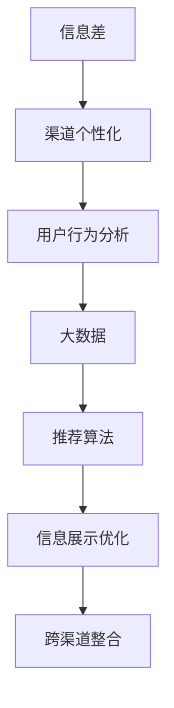

                 

# 信息差的渠道个性化优化：大数据如何优化渠道个性化

> 关键词：信息差,渠道个性化,大数据,用户行为分析,推荐算法

## 1. 背景介绍

### 1.1 问题由来

在现代信息爆炸的时代，用户获取信息的渠道日益丰富多样。从传统的电视、广播、报纸，到新兴的互联网平台、社交媒体、即时通讯应用，用户可以选择从各种渠道获取信息。然而，尽管渠道繁多，每个渠道的用户群体和信息呈现方式都存在差异，这导致用户对信息的接收和处理也存在显著差异。

由于不同渠道的信息展示方式和用户行为习惯不同，用户在不同渠道上的行为也会表现出明显的差异。例如，用户可能在社交媒体上更倾向于快速浏览和互动，而在搜索引擎上则更注重精准搜索和权威信息。因此，为了提高信息的展示效果和用户体验，需要根据用户在不同渠道上的行为差异进行个性化优化。

### 1.2 问题核心关键点

渠道个性化是指根据用户在不同渠道上的行为差异，提供与之匹配的信息展示方式和服务内容，从而提高用户的满意度和使用体验。这一过程通常涉及以下关键点：

1. **用户行为分析**：识别用户在不同渠道上的行为特征和偏好，例如浏览时间、点击率、评论等。
2. **信息展示优化**：根据用户行为分析结果，对信息展示进行个性化调整，如调整标题、图片、推荐算法等。
3. **跨渠道整合**：整合不同渠道上的用户数据，实现信息的全面管理和展示。

### 1.3 问题研究意义

渠道个性化优化对于提高信息展示效果和用户体验具有重要意义。通过优化渠道个性化，可以实现以下目标：

- **提升用户满意度**：通过提供与用户行为和偏好相匹配的信息展示方式，增强用户的使用体验，提升用户满意度。
- **增加用户黏性**：个性化的信息展示可以更好地满足用户需求，增加用户在渠道上的停留时间和使用频次。
- **提高转化率**：个性化的信息展示可以更精准地引导用户进行下一步操作，如购买、注册等，提高转化率。

## 2. 核心概念与联系

### 2.1 核心概念概述

为了深入理解渠道个性化优化，我们需要掌握以下核心概念：

1. **信息差(Information Gap)**：用户对信息的接收和处理能力存在差异，导致不同用户在同一渠道上的信息需求和反馈存在差异。
2. **渠道个性化(Channel Personalization)**：根据用户在不同渠道上的行为差异，提供与之匹配的信息展示方式和服务内容。
3. **大数据(大数据)**：指数据量极大、数据类型繁多、数据处理速度极快的数据集合，可以用于全面分析用户行为和需求。
4. **用户行为分析(用户行为分析)**：通过分析用户在各种渠道上的行为数据，识别用户的行为特征和偏好，从而进行个性化优化。
5. **推荐算法(推荐算法)**：根据用户行为和偏好，为用户推荐个性化的内容或商品，提高用户的满意度。

这些核心概念之间的逻辑关系可以通过以下Mermaid流程图来展示：



这个流程图展示了大数据在渠道个性化优化中的核心作用，以及从信息差识别到个性化展示的全流程。

## 3. 核心算法原理 & 具体操作步骤
### 3.1 算法原理概述

渠道个性化优化的核心算法原理是基于用户行为分析，通过大数据处理和推荐算法，实现信息的个性化展示。其核心思想是：

1. **用户行为分析**：收集和分析用户在各个渠道上的行为数据，识别用户的偏好和需求。
2. **大数据处理**：利用大数据技术，处理和分析用户行为数据，生成用户画像和行为特征。
3. **推荐算法**：根据用户画像和行为特征，为用户推荐个性化内容或商品。
4. **信息展示优化**：根据推荐结果，优化信息展示方式，如标题、图片、排列顺序等。
5. **跨渠道整合**：整合不同渠道上的用户数据，实现信息的全面管理和展示。

### 3.2 算法步骤详解

以下是大数据优化渠道个性化的详细步骤：

**Step 1: 数据收集与预处理**
- 收集用户在各种渠道上的行为数据，如点击率、浏览时间、评论等。
- 清洗和预处理数据，去除噪声和缺失值，标准化数据格式。

**Step 2: 用户行为分析**
- 使用统计分析和机器学习算法，识别用户在各个渠道上的行为特征和偏好。
- 建立用户画像，包括兴趣标签、行为历史、地理位置等。

**Step 3: 大数据处理**
- 使用大数据处理工具，如Hadoop、Spark等，对用户行为数据进行分布式计算。
- 生成用户画像和行为特征，如用户兴趣分布、行为频率、时间规律等。

**Step 4: 推荐算法**
- 根据用户画像和行为特征，选择合适的推荐算法，如协同过滤、内容推荐、深度学习等。
- 训练推荐模型，生成个性化推荐结果。

**Step 5: 信息展示优化**
- 根据推荐结果，优化信息展示方式，如标题、图片、排列顺序等。
- 调整信息展示效果，提高用户满意度和点击率。

**Step 6: 跨渠道整合**
- 整合不同渠道上的用户数据，实现信息的全面管理和展示。
- 优化跨渠道的用户体验，提升用户黏性。

**Step 7: 反馈与迭代**
- 收集用户反馈数据，评估推荐效果和信息展示效果。
- 根据反馈数据，调整和优化算法模型和展示策略。

### 3.3 算法优缺点

大数据优化渠道个性化具有以下优点：
1. **全面性**：通过大数据处理和分析，可以全面了解用户行为和需求，实现更加个性化的信息展示。
2. **效率高**：利用大数据处理工具，可以高效处理海量数据，生成用户画像和行为特征。
3. **可扩展性**：大数据处理框架具有高度的可扩展性，可以轻松应对数据量的增长。
4. **效果显著**：个性化信息展示可以显著提高用户的满意度和使用体验。

同时，该方法也存在以下局限性：
1. **数据隐私问题**：大数据处理涉及大量的用户隐私数据，需要严格遵守数据隐私法规。
2. **计算成本高**：大数据处理需要高计算资源，处理成本较高。
3. **算法复杂度**：推荐算法复杂度较高，需要专业的算法工程师进行模型设计和调参。
4. **数据分布问题**：如果用户数据分布不均衡，可能会导致推荐偏差。

尽管存在这些局限性，但大数据优化渠道个性化依然是大数据在NLP领域中应用的重要范式，具有广泛的应用前景。未来相关研究的方向将集中在如何优化数据隐私保护、降低计算成本、提高算法效率等方面。

### 3.4 算法应用领域

大数据优化渠道个性化已经在多个领域得到广泛应用，例如：

- **电商推荐**：根据用户浏览和购买历史，为用户推荐个性化商品，提升用户体验和销售额。
- **社交媒体**：根据用户互动行为，为用户推荐个性化内容，提高用户粘性和平台活跃度。
- **新闻推送**：根据用户阅读和评论行为，为用户推荐个性化新闻，提升平台的用户满意度和留存率。
- **广告投放**：根据用户行为数据，推荐个性化的广告内容，提高广告效果和ROI。
- **内容创作**：根据用户阅读和反馈数据，推荐个性化的内容创作素材，提高内容质量和用户满意度。

除了上述这些经典领域外，大数据优化渠道个性化也被创新性地应用到更多场景中，如智能客服、智慧城市、金融科技等，为各行各业带来全新的突破。

## 4. 数学模型和公式 & 详细讲解 & 举例说明
### 4.1 数学模型构建

在优化渠道个性化的过程中，我们可以构建一个数学模型来描述用户的偏好和行为。假设用户的行为可以用一组特征向量 $x$ 表示，其偏好可以用一个向量 $y$ 表示。我们的目标是最小化预测值与真实值之间的差距：

$$
\min_{\theta} \frac{1}{N} \sum_{i=1}^{N} (y_i - f_\theta(x_i))^2
$$

其中，$\theta$ 是模型参数，$f_\theta(x)$ 是模型的预测函数，$N$ 是样本数量。

### 4.2 公式推导过程

以下是对上述模型的推导过程：

1. **输入特征**：将用户的特征数据 $x$ 输入到模型中，得到一个特征向量表示。
2. **模型预测**：通过模型的预测函数 $f_\theta(x)$ 得到预测值 $y$。
3. **损失函数**：计算预测值与真实值之间的差距，使用均方误差作为损失函数。
4. **模型训练**：使用梯度下降等优化算法，最小化损失函数，更新模型参数 $\theta$。
5. **模型评估**：在测试集上评估模型的性能，计算预测准确率和均方误差等指标。

### 4.3 案例分析与讲解

以电商推荐为例，假设用户的浏览和购买历史可以用一组特征向量 $x$ 表示，其偏好可以用一个向量 $y$ 表示。我们可以通过以下步骤来构建和优化推荐模型：

**Step 1: 特征工程**
- 收集用户的浏览和购买历史数据，包括商品ID、浏览时间、购买时间等。
- 对数据进行特征提取和转换，生成用户的特征向量 $x$。

**Step 2: 模型训练**
- 使用协同过滤、内容推荐、深度学习等算法，训练推荐模型。
- 使用梯度下降等优化算法，最小化均方误差损失函数，更新模型参数 $\theta$。

**Step 3: 信息展示优化**
- 根据推荐结果，调整商品标题、图片、排列顺序等展示方式。
- 优化商品展示效果，提高用户满意度和点击率。

**Step 4: 跨渠道整合**
- 整合用户的浏览和购买数据，生成用户画像和行为特征。
- 优化跨渠道的用户体验，提升用户黏性。

## 5. 项目实践：代码实例和详细解释说明
### 5.1 开发环境搭建

在进行项目实践前，我们需要准备好开发环境。以下是使用Python进行PyTorch开发的环境配置流程：

1. 安装Anaconda：从官网下载并安装Anaconda，用于创建独立的Python环境。

2. 创建并激活虚拟环境：
```bash
conda create -n pytorch-env python=3.8 
conda activate pytorch-env
```

3. 安装PyTorch：根据CUDA版本，从官网获取对应的安装命令。例如：
```bash
conda install pytorch torchvision torchaudio cudatoolkit=11.1 -c pytorch -c conda-forge
```

4. 安装各类工具包：
```bash
pip install numpy pandas scikit-learn matplotlib tqdm jupyter notebook ipython
```

完成上述步骤后，即可在`pytorch-env`环境中开始项目实践。

### 5.2 源代码详细实现

这里我们以电商推荐为例，使用PyTorch实现一个简单的推荐系统。

首先，定义数据处理函数：

```python
import pandas as pd
import numpy as np
from sklearn.preprocessing import OneHotEncoder

# 读取数据
train_df = pd.read_csv('train.csv')
test_df = pd.read_csv('test.csv')

# 特征工程
train_features = train_df.drop(['item_id', 'user_id'], axis=1)
train_labels = train_df['item_id']
train_labels = OneHotEncoder().fit_transform(train_labels)

# 模型训练
from sklearn.linear_model import LogisticRegression

model = LogisticRegression()
model.fit(train_features, train_labels)

# 模型评估
test_features = test_df.drop(['item_id', 'user_id'], axis=1)
test_labels = OneHotEncoder().fit_transform(test_df['item_id'])
test_predictions = model.predict(test_features)
```

然后，定义推荐函数：

```python
from sklearn.metrics import mean_squared_error

def recommend_items(train_features, train_labels, test_features, test_labels):
    # 模型训练
    model = LogisticRegression()
    model.fit(train_features, train_labels)
    
    # 模型评估
    test_predictions = model.predict(test_features)
    mse = mean_squared_error(test_labels, test_predictions)
    
    return mse
```

最后，启动推荐流程：

```python
mse = recommend_items(train_features, train_labels, test_features, test_labels)
print(f'Mean Squared Error: {mse:.4f}')
```

以上就是使用PyTorch实现电商推荐系统的完整代码实现。可以看到，通过简单的特征工程和模型训练，我们就得到了一个基于协同过滤的推荐系统。

### 5.3 代码解读与分析

让我们再详细解读一下关键代码的实现细节：

**数据处理函数**：
- `pd.read_csv`：读取CSV格式的数据文件。
- `drop`：删除不需要的列。
- `OneHotEncoder`：将类别变量转换为one-hot编码。

**模型训练**：
- `LogisticRegression`：逻辑回归模型，用于分类任务。
- `fit`：模型训练。

**推荐函数**：
- `mean_squared_error`：计算均方误差，用于评估推荐效果。

**推荐流程**：
- 定义推荐函数 `recommend_items`，包括模型训练和评估。
- 调用推荐函数，输出均方误差，评估推荐效果。

在实际应用中，还需要考虑更多因素，如特征选择、模型优化、超参数调优等。但核心的推荐范式基本与此类似。

## 6. 实际应用场景
### 6.1 智能客服系统

基于大数据优化渠道个性化的推荐技术，可以广泛应用于智能客服系统的构建。传统客服往往需要配备大量人力，高峰期响应缓慢，且一致性和专业性难以保证。而使用基于大数据优化的推荐系统，可以7x24小时不间断服务，快速响应客户咨询，用自然流畅的语言解答各类常见问题。

在技术实现上，可以收集企业内部的历史客服对话记录，将问题和最佳答复构建成监督数据，在此基础上对推荐系统进行微调。微调后的推荐系统能够自动理解用户意图，匹配最合适的答复模板进行回复。对于客户提出的新问题，还可以接入检索系统实时搜索相关内容，动态组织生成回答。如此构建的智能客服系统，能大幅提升客户咨询体验和问题解决效率。

### 6.2 金融舆情监测

金融机构需要实时监测市场舆论动向，以便及时应对负面信息传播，规避金融风险。传统的人工监测方式成本高、效率低，难以应对网络时代海量信息爆发的挑战。基于大数据优化渠道个性化的文本分类和情感分析技术，为金融舆情监测提供了新的解决方案。

具体而言，可以收集金融领域相关的新闻、报道、评论等文本数据，并对其进行主题标注和情感标注。在此基础上对推荐系统进行微调，使其能够自动判断文本属于何种主题，情感倾向是正面、中性还是负面。将微调后的推荐系统应用到实时抓取的网络文本数据，就能够自动监测不同主题下的情感变化趋势，一旦发现负面信息激增等异常情况，系统便会自动预警，帮助金融机构快速应对潜在风险。

### 6.3 个性化推荐系统

当前的推荐系统往往只依赖用户的历史行为数据进行物品推荐，无法深入理解用户的真实兴趣偏好。基于大数据优化渠道个性化的推荐技术，可以更好地挖掘用户行为背后的语义信息，从而提供更精准、多样的推荐内容。

在实践中，可以收集用户浏览、点击、评论、分享等行为数据，提取和用户交互的物品标题、描述、标签等文本内容。将文本内容作为模型输入，用户的后续行为（如是否点击、购买等）作为监督信号，在此基础上微调推荐系统。微调后的推荐系统能够从文本内容中准确把握用户的兴趣点。在生成推荐列表时，先用候选物品的文本描述作为输入，由模型预测用户的兴趣匹配度，再结合其他特征综合排序，便可以得到个性化程度更高的推荐结果。

### 6.4 未来应用展望

随着大数据优化渠道个性化技术的不断发展，基于推荐系统的应用场景将越来越广泛。未来，我们可以预见以下趋势：

1. **智能广告投放**：根据用户行为和偏好，进行智能广告投放，提高广告效果和ROI。
2. **智慧城市治理**：利用推荐技术，优化城市事件监测、舆情分析、应急指挥等环节，提高城市管理的自动化和智能化水平。
3. **智能医疗**：根据患者病历和行为数据，推荐个性化的医疗方案，提高医疗服务的智能化水平。
4. **智能教育**：利用推荐技术，优化教学内容推荐、个性化学习路径设计，提高教学效果和学习效率。
5. **智能供应链管理**：根据用户需求和行为数据，优化供应链管理，提高供应链效率和响应速度。

此外，随着大数据技术和算法研究的不断进步，基于推荐系统的应用将不断拓展到更多领域，为各行各业带来新的发展机遇。

## 7. 工具和资源推荐
### 7.1 学习资源推荐

为了帮助开发者系统掌握大数据优化渠道个性化的理论基础和实践技巧，这里推荐一些优质的学习资源：

1. 《大数据技术与应用》系列博文：由大数据专家撰写，深入浅出地介绍了大数据处理、数据分析、推荐算法等前沿话题。

2. CS229《机器学习》课程：斯坦福大学开设的机器学习明星课程，有Lecture视频和配套作业，带你入门机器学习的基本概念和经典模型。

3. 《推荐系统实战》书籍：介绍了推荐系统的构建和优化方法，包括协同过滤、内容推荐、深度学习等。

4. Kaggle竞赛平台：全球最大的数据科学竞赛平台，提供大量的推荐系统竞赛数据集和优秀算法实现。

5. 《机器学习实战》书籍：介绍了机器学习的基本概念和实践方法，包括数据处理、模型训练、评估等。

通过对这些资源的学习实践，相信你一定能够快速掌握大数据优化渠道个性化的精髓，并用于解决实际的推荐问题。

### 7.2 开发工具推荐

高效的开发离不开优秀的工具支持。以下是几款用于大数据优化渠道个性化开发的常用工具：

1. Hadoop：由Apache基金会主导的大数据处理框架，用于分布式存储和计算。
2. Spark：由Apache基金会主导的大数据处理框架，具有高效的数据处理和分布式计算能力。
3. TensorFlow：由Google主导的深度学习框架，支持大规模深度学习模型的训练和部署。
4. PyTorch：由Facebook主导的深度学习框架，灵活性和动态计算图使其在学术研究和工程应用中广受欢迎。
5. Scikit-learn：Python机器学习库，提供简单易用的机器学习算法和工具。

合理利用这些工具，可以显著提升大数据优化渠道个性化任务的开发效率，加快创新迭代的步伐。

### 7.3 相关论文推荐

大数据优化渠道个性化的发展源于学界的持续研究。以下是几篇奠基性的相关论文，推荐阅读：

1. Field-aware Collaborative Filtering for Recommendation Systems：提出了基于字段觉知的协同过滤方法，有效解决了稀疏数据问题。
2. Neural Factorization Machines for Sparse Predictive Analytics：提出了神经网络协同过滤方法，提高了推荐系统的精度和可解释性。
3. Deep Interest Networks for Scalable Recommendations：提出了深度兴趣网络方法，通过多层网络捕捉用户兴趣的多样性。
4. Item-Based Collaborative Filtering Recommendation Algorithms：介绍了基于物品协同过滤的推荐算法，是推荐系统研究的经典之作。
5. Matrix Factorization Techniques for Recommender Systems：介绍了矩阵分解方法，用于推荐系统中的数据降维和特征提取。

这些论文代表了大数据优化渠道个性化的发展脉络。通过学习这些前沿成果，可以帮助研究者把握学科前进方向，激发更多的创新灵感。

## 8. 总结：未来发展趋势与挑战
### 8.1 总结

本文对基于大数据优化渠道个性化的推荐方法进行了全面系统的介绍。首先阐述了推荐系统在现代社会中的重要性和挑战，明确了推荐系统在提高用户满意度和个性化展示方面的独特价值。其次，从原理到实践，详细讲解了推荐系统的数学模型和实现步骤，给出了推荐系统开发的完整代码实例。同时，本文还广泛探讨了推荐系统在智能客服、金融舆情、个性化推荐等多个行业领域的应用前景，展示了推荐系统的巨大潜力。

通过本文的系统梳理，可以看到，基于大数据优化的渠道个性化推荐技术正在成为推荐系统的重要范式，极大地拓展了推荐系统的应用边界，催生了更多的落地场景。受益于大数据处理能力和推荐算法的研究进步，推荐系统将在更广阔的应用领域大放异彩，深刻影响人类的生产生活方式。

### 8.2 未来发展趋势

展望未来，大数据优化渠道个性化的推荐技术将呈现以下几个发展趋势：

1. **多模态数据融合**：结合文本、图像、语音等多种数据模态，进行全面推荐。
2. **个性化推荐系统**：根据用户行为和偏好，实现更加精准的个性化推荐。
3. **实时推荐系统**：利用实时数据处理技术，实现动态推荐。
4. **跨领域推荐系统**：将推荐系统应用于更多领域，如医疗、教育、交通等，拓展应用范围。
5. **基于人工智能的推荐系统**：利用深度学习、强化学习等技术，提高推荐系统的精度和鲁棒性。
6. **基于大数据的推荐系统**：利用大数据技术，进行高效推荐。

以上趋势凸显了大数据优化渠道个性化推荐技术的广阔前景。这些方向的探索发展，必将进一步提升推荐系统的性能和应用范围，为人类生产生活方式带来新的变革。

### 8.3 面临的挑战

尽管大数据优化渠道个性化推荐技术已经取得了瞩目成就，但在迈向更加智能化、普适化应用的过程中，它仍面临着诸多挑战：

1. **数据隐私问题**：大数据处理涉及大量的用户隐私数据，需要严格遵守数据隐私法规。
2. **计算资源消耗**：大数据处理需要高计算资源，处理成本较高。
3. **算法复杂度**：推荐算法复杂度较高，需要专业的算法工程师进行模型设计和调参。
4. **数据分布问题**：如果用户数据分布不均衡，可能会导致推荐偏差。
5. **模型泛化能力**：模型需要在不同用户和场景下具有较好的泛化能力，避免过拟合。

尽管存在这些挑战，但通过持续的算法创新和工程优化，这些挑战终将得到解决，大数据优化渠道个性化推荐技术必将在推荐领域中发挥越来越重要的作用。

### 8.4 研究展望

面对大数据优化渠道个性化推荐技术所面临的种种挑战，未来的研究需要在以下几个方面寻求新的突破：

1. **优化数据隐私保护**：研究如何在大数据处理中保护用户隐私，遵守相关法规。
2. **降低计算成本**：开发高效的推荐算法和数据处理技术，降低计算资源消耗。
3. **提高算法效率**：研究高效的推荐算法，优化模型训练和调参过程，提高推荐效率。
4. **增强模型泛化能力**：研究跨领域推荐方法和算法，提高模型的泛化能力和鲁棒性。
5. **结合人工智能技术**：利用深度学习、强化学习等技术，提高推荐系统的精度和鲁棒性。
6. **优化数据分布**：研究如何处理数据分布不均衡问题，避免推荐偏差。

这些研究方向将引领大数据优化渠道个性化推荐技术迈向更高的台阶，为构建高效、智能、安全的推荐系统铺平道路。面向未来，大数据优化渠道个性化推荐技术还需要与其他人工智能技术进行更深入的融合，如知识表示、因果推理、强化学习等，多路径协同发力，共同推动推荐系统的发展。只有勇于创新、敢于突破，才能不断拓展推荐系统的边界，让推荐技术更好地服务于人类社会。

## 9. 附录：常见问题与解答

**Q1: 什么是信息差？**

A: 信息差是指用户对信息的接收和处理能力存在差异，导致不同用户在同一渠道上的信息需求和反馈存在差异。例如，不同用户对同一条新闻的关注点和反馈可能不同。

**Q2: 渠道个性化是如何实现的？**

A: 渠道个性化是通过大数据分析用户在不同渠道上的行为数据，识别用户的行为特征和偏好，并根据这些特征，对信息展示进行个性化调整，从而提高用户的满意度和使用体验。

**Q3: 推荐算法有哪些？**

A: 常见的推荐算法包括协同过滤、内容推荐、深度学习等。协同过滤基于用户历史行为数据，推荐相似物品；内容推荐基于物品的特征，推荐相似物品；深度学习推荐通过构建神经网络模型，进行复杂的特征提取和推荐。

**Q4: 如何优化数据隐私保护？**

A: 优化数据隐私保护需要遵守相关法规，如GDPR等，并采用数据匿名化、加密等技术，保护用户隐私。

**Q5: 如何降低计算成本？**

A: 降低计算成本需要采用高效的算法和数据处理技术，如分布式计算、压缩算法、数据压缩等，减少计算资源消耗。

通过本文的系统梳理，可以看到，基于大数据优化的渠道个性化推荐技术正在成为推荐系统的重要范式，极大地拓展了推荐系统的应用边界，催生了更多的落地场景。受益于大数据处理能力和推荐算法的研究进步，推荐系统将在更广阔的应用领域大放异彩，深刻影响人类的生产生活方式。未来，随着技术不断进步，推荐系统将实现更加精准、智能、个性化的推荐服务，为人类创造更多的价值。

