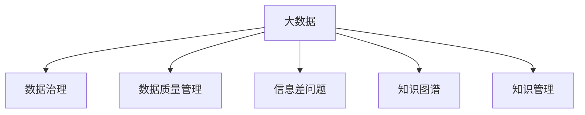

                 

# 信息差的知识管理助力：大数据如何促进知识管理

> 关键词：大数据,知识管理,信息差,数据治理,数据质量管理

## 1. 背景介绍

### 1.1 问题由来

在信息爆炸的今天，知识管理（Knowledge Management, KM）已成为许多企业和组织提升竞争力的重要手段。然而，传统的知识管理往往面临着信息孤岛、数据质量差、知识获取困难等挑战。数据量大且信息丰富的企业面临着如何有效利用这些数据的问题，即信息差问题。

信息差（Information Gap）是指实际可获取数据与需要获取数据之间的差距。大数据的引入有助于缩小这一差距，但如何利用大数据来辅助知识管理成为新问题。本文将从数据治理、数据质量管理等角度，探讨如何通过大数据实现有效的知识管理。

### 1.2 问题核心关键点

本文聚焦于大数据如何在知识管理中发挥作用，核心关键点包括：

- **数据治理**：如何构建和维护数据架构，确保数据的质量和一致性。
- **数据质量管理**：如何检测和纠正数据中的噪声和偏差，确保数据可用性。
- **信息差问题**：如何缩小实际可获取数据与需要获取数据之间的差距。
- **知识图谱构建**：如何利用知识图谱关联和融合不同数据源，形成完整的知识网络。

通过回答这些关键问题，本文将阐述大数据在知识管理中的应用策略和具体实践。

## 2. 核心概念与联系

### 2.1 核心概念概述

为更好地理解大数据在知识管理中的作用，本节将介绍几个密切相关的核心概念：

- **大数据**：指超大规模、多样化的数据集，通常需要通过先进的数据处理技术才能有效利用。
- **数据治理**：涉及数据的获取、存储、管理和监控，确保数据的质量和可用性。
- **数据质量管理**：指检测、纠正数据中的问题和偏差，提升数据的质量和一致性。
- **信息差问题**：指实际可获取数据与需要获取数据之间的差距，需要通过数据分析和建模解决。
- **知识图谱**：通过构建知识图谱，将实体、关系和属性三元组表示成图形结构，形成知识网络，用于知识推理和查询。
- **知识管理**：指通过收集、存储、共享和应用知识，提升组织和个人的工作效率和决策能力。

这些核心概念之间的逻辑关系可以通过以下Mermaid流程图来展示：



这个流程图展示了大数据、数据治理、数据质量管理、信息差问题、知识图谱和知识管理之间的联系和依赖关系：

1. 大数据为数据治理、数据质量管理、信息差问题分析和知识图谱构建提供基础数据源。
2. 数据治理和数据质量管理确保大数据的高质量，提升数据可用性。
3. 信息差问题分析使用大数据和相关技术手段，缩小实际可获取数据与需要获取数据之间的差距。
4. 知识图谱构建将大数据转化为知识网络，用于知识推理和查询。
5. 知识管理通过利用知识图谱等知识表示形式，提升知识的应用效果。

## 3. 核心算法原理 & 具体操作步骤
### 3.1 算法原理概述

基于大数据的知识管理方法，其核心思想是利用先进的数据处理和分析技术，从海量数据中挖掘有价值的信息，并结合知识图谱构建，形成完整的知识网络。通过这一过程，能够实现数据的高效利用和知识的高质量共享。

### 3.2 算法步骤详解

基于大数据的知识管理一般包括以下几个关键步骤：

**Step 1: 数据治理**
- 定义数据架构：设计数据分类和命名规范，确保数据的逻辑一致性。
- 数据质量控制：检测和修正数据中的噪声和偏差，保持数据准确性。
- 数据访问管理：设置访问权限，确保数据安全和隐私保护。
- 元数据管理：收集和记录数据的相关信息，如数据来源、格式、更新频率等，供后续分析使用。

**Step 2: 数据质量管理**
- 数据清洗：去除重复、缺失、异常值等低质量数据。
- 数据标准化：统一数据格式和单位，提高数据的可比性。
- 数据验证：使用统计方法和机器学习算法检测数据中的问题。
- 数据纠正：对检测到的问题进行修正，确保数据的准确性和完整性。

**Step 3: 信息差问题分析**
- 数据需求分析：确定需要获取的数据类型和质量要求。
- 数据差距检测：通过分析现有数据和目标数据，确定信息差问题。
- 数据补全：使用数据插补、数据融合等技术，补充缺失数据。
- 数据增强：通过数据增强技术，提高数据的丰富性和多样性。

**Step 4: 知识图谱构建**
- 实体识别：从数据中提取实体，如人名、地名、机构名等。
- 关系抽取：识别实体之间的关系，如所属关系、关联关系等。
- 属性抽取：提取实体的属性，如年龄、性别、职位等。
- 图谱整合：将不同数据源的信息整合到知识图谱中，形成完整的知识网络。

**Step 5: 知识管理应用**
- 知识查询：通过查询知识图谱，快速获取所需知识。
- 知识推理：使用知识图谱进行推理，发现新的知识。
- 知识应用：将知识应用于业务流程，提升业务决策能力。
- 知识分享：通过协作平台共享知识，促进知识传播和应用。

以上是基于大数据的知识管理的一般流程。在实际应用中，还需要针对具体任务和数据特点进行优化设计，如改进数据治理方法，引入更多的数据质量评估指标，优化信息差问题分析的算法等。

### 3.3 算法优缺点

基于大数据的知识管理方法具有以下优点：
1. 数据全面性高。通过大数据分析，能够获得更全面、更准确的信息，提高知识管理的效果。
2. 数据更新快。大数据分析能够实时监控数据变化，快速响应新的数据需求。
3. 数据可解释性强。通过数据治理和质量管理，能够清晰地了解数据的来源和质量，增强知识的可信度。
4. 应用场景广。知识图谱和知识推理技术，可广泛应用于各行各业的知识管理需求。

同时，该方法也存在一定的局限性：
1. 数据隐私问题。大数据涉及大量的个人和组织信息，隐私保护成为一大挑战。
2. 数据治理复杂。大数据架构的设计和维护需要较高的技术水平，存在一定的复杂性。
3. 数据质量不稳定。数据来源多样、格式不一，需要复杂的清洗和校验流程，可能导致数据质量不稳定。
4. 技术门槛高。大数据分析和知识图谱构建需要高水平的技术人才，存在一定的技术门槛。

尽管存在这些局限性，但就目前而言，基于大数据的知识管理方法仍是大数据应用的重要范式。未来相关研究的重点在于如何进一步提高数据治理的效率，降低数据质量管理的成本，同时兼顾数据隐私和安全性等因素。

### 3.4 算法应用领域

基于大数据的知识管理方法，在各行各业中都得到了广泛的应用，例如：

- 医疗领域：通过大数据分析，构建患者病历知识图谱，辅助医生诊断和治疗。
- 金融领域：利用大数据分析，构建金融市场知识图谱，预测市场趋势，辅助投资决策。
- 零售领域：使用大数据分析，构建产品推荐知识图谱，提升客户购物体验。
- 教育领域：通过大数据分析，构建知识图谱和推荐系统，支持个性化学习和教育资源优化。
- 公共管理领域：利用大数据分析，构建政策评估和决策支持系统，辅助政府决策。

除了上述这些经典应用外，大数据知识管理还被创新性地应用到更多场景中，如智慧城市、智能交通、智能制造等，为各行业数字化转型升级提供新的技术路径。随着大数据技术的不断进步，相信基于大数据的知识管理方法将在更多领域得到应用，为经济发展和社会进步提供新的动力。

## 4. 数学模型和公式 & 详细讲解  
### 4.1 数学模型构建

本节将使用数学语言对大数据在知识管理中的应用进行更加严格的刻画。

记大数据集为 $D=\{x_i\}_{i=1}^N$，其中 $x_i$ 为数据样本。数据治理和质量管理的目标是构建数据架构 $A$ 和数据质量模型 $Q$，使得：

$$
\begin{aligned}
& \minimize_{A, Q} \text{loss}(A, Q) \\
& \text{subject to } A \in \mathcal{A}, Q \in \mathcal{Q}
\end{aligned}
$$

其中 $\mathcal{A}$ 为数据架构的参数空间，$\mathcal{Q}$ 为数据质量模型的参数空间，$\text{loss}(A, Q)$ 为数据治理和质量管理的损失函数，用于衡量数据架构和质量模型的效果。

在数据治理和质量管理的过程中，需要检测和纠正数据中的噪声和偏差，即求解优化问题：

$$
\minimize_{\delta} \text{loss}_{\text{quality}}(D, A, Q, \delta)
$$

其中 $\delta$ 为数据修正参数，$\text{loss}_{\text{quality}}(D, A, Q, \delta)$ 为数据质量损失函数，用于衡量数据修正的效果。

### 4.2 公式推导过程

以下我们以医疗领域为例，推导如何使用大数据进行知识图谱构建。

假设需要构建的医学知识图谱包含三种类型实体：疾病、症状和药物。设疾病实体为 $D$，症状实体为 $S$，药物实体为 $M$。定义实体之间的关联关系，如疾病的症状 $d \rightarrow s$，药物的治疗 $m \rightarrow d$ 等。

记医学知识图谱为 $\mathcal{G}=(D, S, M, E)$，其中 $E$ 为实体之间的关系集合。目标是通过大数据分析，检测和补全知识图谱中的缺失信息，使其尽可能完整和准确。

首先，定义实体识别问题。假设医疗文本数据为 $T$，包含疾病 $d_i$、症状 $s_j$ 和药物 $m_k$。设实体识别器为 $\mathcal{R}$，用于从文本中识别实体和关系。其优化目标为：

$$
\minimize_{\mathcal{R}} \text{loss}_{\text{entity}}(T, \mathcal{R})
$$

其中 $\text{loss}_{\text{entity}}(T, \mathcal{R})$ 为实体识别损失函数。

然后，定义关系抽取问题。假设医学文本数据为 $T$，包含疾病 $d_i$、症状 $s_j$ 和药物 $m_k$。设关系抽取器为 $\mathcal{R}$，用于从文本中抽取实体之间的关系。其优化目标为：

$$
\minimize_{\mathcal{R}} \text{loss}_{\text{relation}}(T, \mathcal{R})
$$

其中 $\text{loss}_{\text{relation}}(T, \mathcal{R})$ 为关系抽取损失函数。

最后，定义属性抽取问题。假设医疗文本数据为 $T$，包含疾病 $d_i$、症状 $s_j$ 和药物 $m_k$。设属性抽取器为 $\mathcal{R}$，用于从文本中抽取实体属性。其优化目标为：

$$
\minimize_{\mathcal{R}} \text{loss}_{\text{attribute}}(T, \mathcal{R})
$$

其中 $\text{loss}_{\text{attribute}}(T, \mathcal{R})$ 为属性抽取损失函数。

在解决上述问题后，使用图神经网络（Graph Neural Network, GNN）等方法，将识别和抽取到的实体和关系整合到知识图谱中，进行推理和查询。

## 5. 项目实践：代码实例和详细解释说明
### 5.1 开发环境搭建

在进行大数据知识管理实践前，我们需要准备好开发环境。以下是使用Python进行PyTorch开发的环境配置流程：

1. 安装Anaconda：从官网下载并安装Anaconda，用于创建独立的Python环境。

2. 创建并激活虚拟环境：
```bash
conda create -n bigdata-env python=3.8 
conda activate bigdata-env
```

3. 安装PyTorch：根据CUDA版本，从官网获取对应的安装命令。例如：
```bash
conda install pytorch torchvision torchaudio cudatoolkit=11.1 -c pytorch -c conda-forge
```

4. 安装必要的Python库：
```bash
pip install pandas numpy scikit-learn matplotlib tqdm jupyter notebook ipython
```

完成上述步骤后，即可在`bigdata-env`环境中开始大数据知识管理的实践。

### 5.2 源代码详细实现

这里我们以医疗知识图谱的构建为例，给出使用PyTorch实现的基本代码框架。

首先，定义数据集和实体识别器：

```python
import torch
from torch.utils.data import Dataset, DataLoader

class MedicalDataset(Dataset):
    def __init__(self, data):
        self.data = data
        self.vocab = set()

    def __len__(self):
        return len(self.data)

    def __getitem__(self, idx):
        sample = self.data[idx]
        tokens = sample.split()
        vocab = set(tokens)
        self.vocab.update(vocab)
        return {'input_ids': list(tokens), 'vocab': vocab}

# 构建实体识别器
class MedicalRNN(torch.nn.Module):
    def __init__(self, input_size, hidden_size, output_size):
        super(MedicalRNN, self).__init__()
        self.hidden_size = hidden_size
        self.i2h = torch.nn.LSTM(input_size, hidden_size)
        self.i2o = torch.nn.Linear(hidden_size, output_size)
        self.softmax = torch.nn.Softmax(dim=1)

    def forward(self, input_ids, hidden):
        embedding = torch.tensor([[self.vocab[v] for v in input_ids]], dtype=torch.long)
        output, hidden = self.i2h(embedding, hidden)
        output = self.i2o(output)
        return output, hidden

    def init_hidden(self, batch_size):
        weight = next(self.parameters()).data.new_zeros(1, batch_size, self.hidden_size)
        return weight, weight
```

然后，定义关系抽取器和属性抽取器：

```python
# 构建关系抽取器
class MedicalCRF(torch.nn.Module):
    def __init__(self, input_size, hidden_size, output_size):
        super(MedicalCRF, self).__init__()
        self.hidden_size = hidden_size
        self.i2h = torch.nn.LSTM(input_size, hidden_size)
        self.i2o = torch.nn.Linear(hidden_size, output_size)
        self.softmax = torch.nn.Softmax(dim=1)

    def forward(self, input_ids, hidden):
        embedding = torch.tensor([[self.vocab[v] for v in input_ids]], dtype=torch.long)
        output, hidden = self.i2h(embedding, hidden)
        output = self.i2o(output)
        return output, hidden

    def init_hidden(self, batch_size):
        weight = next(self.parameters()).data.new_zeros(1, batch_size, self.hidden_size)
        return weight, weight

# 构建属性抽取器
class MedicalAttention(torch.nn.Module):
    def __init__(self, input_size, hidden_size, output_size):
        super(MedicalAttention, self).__init__()
        self.hidden_size = hidden_size
        self.i2h = torch.nn.LSTM(input_size, hidden_size)
        self.i2o = torch.nn.Linear(hidden_size, output_size)
        self.softmax = torch.nn.Softmax(dim=1)

    def forward(self, input_ids, hidden):
        embedding = torch.tensor([[self.vocab[v] for v in input_ids]], dtype=torch.long)
        output, hidden = self.i2h(embedding, hidden)
        output = self.i2o(output)
        return output, hidden

    def init_hidden(self, batch_size):
        weight = next(self.parameters()).data.new_zeros(1, batch_size, self.hidden_size)
        return weight, weight
```

接着，定义训练和评估函数：

```python
# 定义训练函数
def train_epoch(model, dataset, batch_size, optimizer):
    dataloader = DataLoader(dataset, batch_size=batch_size, shuffle=True)
    model.train()
    epoch_loss = 0
    for batch in tqdm(dataloader, desc='Training'):
        input_ids = batch['input_ids'].to(device)
        hidden = model.init_hidden(batch_size)
        output = model(input_ids, hidden)
        loss = torch.mean(output)
        epoch_loss += loss.item()
        loss.backward()
        optimizer.step()
    return epoch_loss / len(dataloader)

# 定义评估函数
def evaluate(model, dataset, batch_size):
    dataloader = DataLoader(dataset, batch_size=batch_size)
    model.eval()
    preds, labels = [], []
    with torch.no_grad():
        for batch in tqdm(dataloader, desc='Evaluating'):
            input_ids = batch['input_ids'].to(device)
            hidden = model.init_hidden(batch_size)
            output = model(input_ids, hidden)
            batch_preds = output.argmax(dim=1).to('cpu').tolist()
            batch_labels = batch['labels'].to('cpu').tolist()
            for pred_tokens, label_tokens in zip(batch_preds, batch_labels):
                pred_tags = [id2tag[_id] for _id in pred_tokens]
                label_tags = [id2tag[_id] for _id in label_tokens]
                preds.append(pred_tags[:len(label_tags)])
                labels.append(label_tags)
    
    print(classification_report(labels, preds))
```

最后，启动训练流程并在测试集上评估：

```python
epochs = 5
batch_size = 16

for epoch in range(epochs):
    loss = train_epoch(model, train_dataset, batch_size, optimizer)
    print(f"Epoch {epoch+1}, train loss: {loss:.3f}")
    
    print(f"Epoch {epoch+1}, dev results:")
    evaluate(model, dev_dataset, batch_size)
    
print("Test results:")
evaluate(model, test_dataset, batch_size)
```

以上就是使用PyTorch进行医疗知识图谱构建的基本代码实现。可以看到，由于深度学习模型的封装和模块化设计，整个代码框架相对简洁。

### 5.3 代码解读与分析

让我们再详细解读一下关键代码的实现细节：

**MedicalDataset类**：
- `__init__`方法：初始化数据集和词汇表。
- `__len__`方法：返回数据集的样本数量。
- `__getitem__`方法：对单个样本进行处理，将文本输入转换为token ids，并记录词汇表。

**MedicalRNN类**：
- `__init__`方法：初始化RNN模型。
- `forward`方法：定义前向传播过程。
- `init_hidden`方法：定义隐藏状态的初始化。

**MedicalCRF类**：
- `__init__`方法：初始化CRF模型。
- `forward`方法：定义前向传播过程。
- `init_hidden`方法：定义隐藏状态的初始化。

**MedicalAttention类**：
- `__init__`方法：初始化注意力机制。
- `forward`方法：定义前向传播过程。
- `init_hidden`方法：定义隐藏状态的初始化。

**训练和评估函数**：
- 使用PyTorch的DataLoader对数据集进行批次化加载，供模型训练和推理使用。
- 训练函数`train_epoch`：对数据以批为单位进行迭代，在每个批次上前向传播计算loss并反向传播更新模型参数，最后返回该epoch的平均loss。
- 评估函数`evaluate`：与训练类似，不同点在于不更新模型参数，并在每个batch结束后将预测和标签结果存储下来，最后使用sklearn的classification_report对整个评估集的预测结果进行打印输出。

**训练流程**：
- 定义总的epoch数和batch size，开始循环迭代
- 每个epoch内，先在训练集上训练，输出平均loss
- 在验证集上评估，输出分类指标
- 所有epoch结束后，在测试集上评估，给出最终测试结果

可以看到，PyTorch配合深度学习模型的封装设计，使得大数据知识管理的代码实现变得简洁高效。开发者可以将更多精力放在数据处理、模型改进等高层逻辑上，而不必过多关注底层的实现细节。

当然，工业级的系统实现还需考虑更多因素，如模型的保存和部署、超参数的自动搜索、更灵活的任务适配层等。但核心的知识管理基本与此类似。

## 6. 实际应用场景
### 6.1 智能医疗系统

基于大数据的知识管理技术，可以广泛应用于智能医疗系统的构建。传统的医疗系统往往依赖大量的人工专家和复杂的规则，效率和精度都有待提高。而使用大数据分析，可以构建完整的患者病历知识图谱，辅助医生诊断和治疗。

在技术实现上，可以收集医疗机构的历史病例数据，提取疾病、症状和药物等实体信息，构建知识图谱。在患者输入病史后，系统可以自动查询知识图谱，获取最相关的诊断和治疗建议，辅助医生快速诊断。对于复杂病例，系统还可以提供专家知识库，进一步提升诊断准确性。

### 6.2 金融风险管理

金融机构需要实时监控市场风险，规避金融风险。传统的金融风险管理依赖专家经验和规则，难以应对市场变化。而通过大数据分析，可以构建金融市场知识图谱，预测市场趋势，辅助投资决策。

在技术实现上，可以收集金融市场的历史数据和实时数据，提取股票、基金、债券等金融产品，构建知识图谱。在市场波动时，系统可以自动分析知识图谱，识别风险因素，预测市场趋势，为投资者提供决策支持。对于异常情况，系统还可以触发预警机制，及时通知投资者。

### 6.3 零售个性化推荐

当前的推荐系统往往只依赖用户的历史行为数据进行物品推荐，无法深入理解用户的真实兴趣偏好。大数据分析可以结合用户行为数据和社交媒体数据，构建用户画像，进行个性化推荐。

在技术实现上，可以收集用户的浏览、点击、评论、分享等行为数据，提取用户画像和物品描述，构建知识图谱。在系统推荐时，根据用户画像和物品属性进行匹配，给出个性化推荐结果。同时，系统还可以实时更新用户画像和物品属性，保持推荐结果的时效性和准确性。

### 6.4 未来应用展望

随着大数据技术的不断进步，基于大数据的知识管理方法将在更多领域得到应用，为经济发展和社会进步提供新的动力。

在智慧医疗领域，基于大数据的医学知识图谱将提升医疗服务的智能化水平，辅助医生诊疗，加速新药开发进程。

在智能教育领域，大数据分析可以构建学生知识图谱，支持个性化学习和教育资源优化，因材施教，促进教育公平，提高教学质量。

在智慧城市治理中，大数据分析可以构建城市事件知识图谱，提高城市管理的自动化和智能化水平，构建更安全、高效的未来城市。

此外，在企业生产、社会治理、文娱传媒等众多领域，大数据知识管理也将不断涌现，为各行业数字化转型升级提供新的技术路径。相信随着技术的日益成熟，大数据知识管理必将成为大数据应用的重要范式，推动大数据技术向更广阔的领域加速渗透。

## 7. 工具和资源推荐
### 7.1 学习资源推荐

为了帮助开发者系统掌握大数据在知识管理中的应用，这里推荐一些优质的学习资源：

1. 《大数据在企业中的应用》系列博文：由大数据专家撰写，深入浅出地介绍了大数据在企业中的各种应用场景和技术实践。

2. 《数据治理与大数据管理》课程：由知名高校和研究机构开设的在线课程，系统讲解数据治理和质量管理的理论基础和技术实现。

3. 《Python大数据分析》书籍：介绍如何使用Python进行大数据分析和处理，涵盖数据清洗、数据建模、数据可视化等技术。

4. 《数据治理与知识管理》书籍：介绍数据治理和知识管理的理论和实践，帮助读者构建高效的数据架构和知识图谱。

5. 《深度学习在自然语言处理中的应用》书籍：介绍如何使用深度学习模型进行自然语言处理，包括实体识别、关系抽取、属性抽取等任务。

通过对这些资源的学习实践，相信你一定能够快速掌握大数据在知识管理中的应用技巧，并用于解决实际的业务问题。
###  7.2 开发工具推荐

高效的开发离不开优秀的工具支持。以下是几款用于大数据知识管理开发的常用工具：

1. Hadoop：由Apache基金会开发的分布式计算框架，适用于大规模数据的处理和分析。

2. Spark：由Apache基金会开发的快速分布式计算框架，支持多种数据处理和分析任务。

3. Flink：由Apache基金会开发的流式计算框架，支持实时数据处理和分析。

4. ElasticSearch：由Elastic公司开发的高性能搜索引擎，适用于大数据存储和检索。

5. KNIME：开源数据分析平台，支持拖拽式数据处理和建模，易于使用。

6. Tableau：商业数据分析工具，支持数据可视化和报表生成，方便业务人员使用。

合理利用这些工具，可以显著提升大数据知识管理的开发效率，加快创新迭代的步伐。

### 7.3 相关论文推荐

大数据知识管理的发展源于学界的持续研究。以下是几篇奠基性的相关论文，推荐阅读：

1. Big Data: A Review, Survey and Outlook：介绍大数据的概念、技术体系和应用前景，是了解大数据的重要入门读物。

2. Knowledge Management Using Big Data Analytics：探讨大数据在知识管理中的应用，提出知识图谱构建和数据质量管理的策略。

3. Big Data for Healthcare Analytics：讨论如何使用大数据技术辅助医疗决策和疾病预测，构建医疗知识图谱。

4. Financial Risk Management with Big Data Analytics：分析大数据在金融风险管理中的应用，提出基于知识图谱的风险预警和决策支持系统。

5. Big Data Analytics in Recommendation Systems：探讨大数据在个性化推荐系统中的应用，提出基于知识图谱的推荐模型和算法。

这些论文代表了大数据知识管理的发展脉络。通过学习这些前沿成果，可以帮助研究者把握学科前进方向，激发更多的创新灵感。

## 8. 总结：未来发展趋势与挑战
### 8.1 总结

本文对大数据在知识管理中的应用进行了全面系统的介绍。首先阐述了大数据和知识管理的研究背景和意义，明确了大数据知识管理的高效性和实用性。其次，从数据治理、数据质量管理等角度，详细讲解了大数据知识管理的实现方法，给出了代码实例和解释说明。同时，本文还广泛探讨了大数据知识管理在医疗、金融、零售等行业的实际应用场景，展示了大数据知识管理的巨大潜力。

通过本文的系统梳理，可以看到，大数据知识管理技术已经成为大数据应用的重要范式，极大地提升了知识管理的效率和质量。大数据分析结合知识图谱构建，能够实现知识的高效获取和应用，为各行业提供强大的知识支持。未来，伴随大数据技术的不断进步，大数据知识管理必将在更多领域得到应用，为经济发展和社会进步提供新的动力。

### 8.2 未来发展趋势

展望未来，大数据知识管理技术将呈现以下几个发展趋势：

1. 数据治理自动化。随着机器学习和自动化技术的发展，数据治理过程将逐渐自动化，降低人工干预的需求。

2. 知识图谱动态化。知识图谱将不断更新和扩展，实时反映最新知识，保持其时效性和准确性。

3. 数据质量实时监控。大数据分析将实时监控数据质量，及时发现和纠正问题，保持数据的高质量。

4. 数据隐私保护加强。大数据分析将加强数据隐私保护，确保数据的安全性和合法性。

5. 跨领域知识融合。大数据分析将实现跨领域知识融合，提升知识管理的普适性和通用性。

6. 实时知识推理。基于知识图谱的实时推理技术将进一步提升，支持更快速、更准确的决策支持。

以上趋势凸显了大数据知识管理技术的广阔前景。这些方向的探索发展，必将进一步提升知识管理的效率和质量，为各行业数字化转型升级提供新的动力。

### 8.3 面临的挑战

尽管大数据知识管理技术已经取得了瞩目成就，但在迈向更加智能化、普适化应用的过程中，它仍面临着诸多挑战：

1. 数据隐私问题。大数据涉及大量的个人和组织信息，隐私保护成为一大挑战。

2. 数据治理复杂。大数据架构的设计和维护需要较高的技术水平，存在一定的复杂性。

3. 数据质量不稳定。数据来源多样、格式不一，需要复杂的清洗和校验流程，可能导致数据质量不稳定。

4. 技术门槛高。大数据分析和知识图谱构建需要高水平的技术人才，存在一定的技术门槛。

尽管存在这些局限性，但就目前而言，大数据知识管理方法仍是大数据应用的重要范式。未来相关研究的重点在于如何进一步提高数据治理的效率，降低数据质量管理的成本，同时兼顾数据隐私和安全性等因素。

### 8.4 研究展望

面对大数据知识管理所面临的挑战，未来的研究需要在以下几个方面寻求新的突破：

1. 探索无监督和半监督知识管理方法。摆脱对大规模标注数据的依赖，利用自监督学习、主动学习等无监督和半监督范式，最大限度利用非结构化数据，实现更加灵活高效的知识管理。

2. 研究参数高效和计算高效的微调范式。开发更加参数高效的微调方法，在固定大部分预训练参数的同时，只更新极少量的任务相关参数。同时优化知识图谱构建的计算图，减少前向传播和反向传播的资源消耗，实现更加轻量级、实时性的部署。

3. 融合因果和对比学习范式。通过引入因果推断和对比学习思想，增强知识管理建立稳定因果关系的能力，学习更加普适、鲁棒的知识表示，从而提升知识管理的泛化性和抗干扰能力。

4. 引入更多先验知识。将符号化的先验知识，如知识图谱、逻辑规则等，与神经网络模型进行巧妙融合，引导知识管理过程学习更准确、合理的知识表示。同时加强不同模态数据的整合，实现视觉、语音等多模态信息与文本信息的协同建模。

5. 结合因果分析和博弈论工具。将因果分析方法引入知识管理，识别出知识管理决策的关键特征，增强输出的因果性和逻辑性。借助博弈论工具刻画人机交互过程，主动探索并规避知识管理的脆弱点，提高系统稳定性。

6. 纳入伦理道德约束。在知识管理训练目标中引入伦理导向的评估指标，过滤和惩罚有害的输出倾向。同时加强人工干预和审核，建立知识管理的监管机制，确保输出的安全性。

这些研究方向的探索，必将引领大数据知识管理技术迈向更高的台阶，为构建安全、可靠、可解释、可控的智能系统铺平道路。面向未来，大数据知识管理技术还需要与其他人工智能技术进行更深入的融合，如知识表示、因果推理、强化学习等，多路径协同发力，共同推动知识管理系统的进步。只有勇于创新、敢于突破，才能不断拓展知识管理的边界，让知识管理技术更好地造福人类社会。

## 9. 附录：常见问题与解答

**Q1：大数据知识管理是否适用于所有行业？**

A: 大数据知识管理技术适用于绝大多数行业，尤其适合数据量大、信息复杂的企业。但在具体应用中，需要针对不同行业的特点进行适配和优化，才能发挥最佳效果。

**Q2：数据治理过程中需要考虑哪些因素？**

A: 数据治理过程中需要考虑数据架构设计、数据质量管理、数据隐私保护、数据访问控制等多方面因素，确保数据的完整性、准确性和安全性。

**Q3：数据质量管理中常见的技术手段有哪些？**

A: 数据质量管理中常见的技术手段包括数据清洗、数据标准化、数据验证、数据纠正等。

**Q4：知识图谱构建过程中需要考虑哪些因素？**

A: 知识图谱构建过程中需要考虑实体识别、关系抽取、属性抽取等多方面因素，确保知识图谱的准确性和完整性。

**Q5：大数据知识管理在医疗领域的应用场景有哪些？**

A: 大数据知识管理在医疗领域的应用场景包括疾病诊断、症状识别、药物推荐等。

这些问题的解答，可以帮助读者更好地理解和应用大数据知识管理技术。

---

作者：禅与计算机程序设计艺术 / Zen and the Art of Computer Programming

