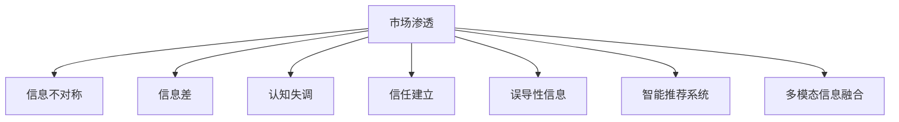

                 

# 信息差：信息不对称与市场渗透

信息不对称是经济学中一个基础性问题，它描述了交易双方拥有不同程度的信息时，市场效率的降低和资源配置的扭曲。在NLP和机器学习领域，信息不对称同样扮演着重要角色。特别是在市场渗透的过程中，信息差的存在往往会决定企业的成败。本文将深入探讨信息不对称对市场渗透的影响，分析如何在信息差的背景下进行策略优化，并探讨相关的技术方法和实践应用。

## 1. 背景介绍

### 1.1 问题由来
信息不对称，即市场参与者之间对信息获取的差异，一直是经济学和NLP领域的重要研究主题。在经济学中，信息不对称被认为会带来“道德风险”和“逆向选择”，导致市场效率的降低和资源配置的扭曲。而在NLP和机器学习领域，信息不对称则会影响模型的性能，导致信息获取不足或过载，进而影响模型的决策能力和应用效果。

在市场渗透的过程中，信息差往往对企业的市场拓展策略产生重大影响。一方面，企业需要精准地理解市场需求和用户行为，才能制定有效的市场推广策略。另一方面，企业需要避免向消费者传递错误或误导性的信息，以保护自身品牌形象和信誉。

### 1.2 问题核心关键点
信息不对称在市场渗透中的核心关键点主要包括以下几个方面：

- **市场认知差异**：企业对目标市场的需求、用户行为和竞争格局的认知与实际市场状况存在差异。
- **用户行为理解**：企业需要准确理解用户的购买行为和偏好，才能制定有效的市场推广策略。
- **品牌形象塑造**：企业需要避免传递错误或误导性的信息，以保护自身品牌形象和信誉。
- **竞争情报分析**：企业需要了解竞争对手的市场策略和产品优势，制定有竞争力的市场渗透计划。

这些关键点共同构成了信息不对称在市场渗透中的重要角色，需要通过技术手段和方法进行深入分析和策略优化。

## 2. 核心概念与联系

### 2.1 核心概念概述

为了更好地理解信息不对称对市场渗透的影响，本节将介绍几个密切相关的核心概念：

- **市场渗透(Market Penetration)**：指企业通过一系列市场推广活动，提高目标市场对自身产品的认知和接受度，增加市场份额的过程。
- **信息不对称(Information Asymmetry)**：指交易双方在信息获取和掌握上存在差异，进而影响市场效率和资源配置的现象。
- **信息差(Information Gap)**：指企业与目标市场之间存在的信息差距，表现为对市场需求、用户行为、竞争格局等的认知差异。
- **认知失调(Cognitive Dissonance)**：指当人们发现自我认知与实际行为不一致时，产生的心理冲突。
- **信任建立(Trust Building)**：指通过有效的市场推广和用户反馈，建立企业与用户之间的信任关系。
- **误导性信息(Misleading Information)**：指企业或市场参与者传递的错误或误导性信息，可能导致用户误解和信任度下降。
- **智能推荐系统(Intelligent Recommendation System)**：通过分析用户历史行为和偏好，推荐合适的产品或服务，减少信息不对称带来的决策困难。
- **多模态信息融合(Multimodal Information Fusion)**：结合文本、图像、声音等多模态数据，提升信息获取的全面性和准确性。

这些核心概念之间的逻辑关系可以通过以下Mermaid流程图来展示：



这个流程图展示信息不对称在市场渗透中的核心概念及其之间的关系：

1. 市场渗透过程中，信息不对称是一个关键因素。
2. 信息差是信息不对称的具体体现，对市场推广策略和用户决策产生直接影响。
3. 认知失调反映用户对企业信息的心理反应，影响用户信任度。
4. 信任建立和误导性信息则是市场渗透过程中的重要变量，决定用户对企业的长期认可。
5. 智能推荐系统和多模态信息融合则是减少信息不对称的技术手段，提升用户决策的科学性和准确性。

## 3. 核心算法原理 & 具体操作步骤
### 3.1 算法原理概述

在市场渗透的过程中，信息不对称往往会导致企业对市场需求和用户行为的误解，从而影响推广策略的有效性。通过信息不对称分析和市场调查，企业可以精准定位目标市场，优化市场推广策略，减少决策风险。具体而言，市场渗透过程中的信息不对称分析包括：

1. **市场需求调研**：通过问卷调查、访谈、数据分析等手段，了解目标市场的需求、用户行为和消费习惯。
2. **竞争格局分析**：收集竞争对手的产品信息、市场份额、推广策略等，分析市场竞争态势。
3. **用户反馈收集**：通过用户评论、社交媒体、在线调查等方式，收集用户对产品和服务的反馈，优化产品设计和推广策略。
4. **品牌形象监测**：实时监测品牌在市场中的声誉和用户评价，及时调整市场推广策略。

通过以上分析，企业可以更准确地把握市场需求和用户行为，制定更加有效的市场推广策略，减少决策风险。

### 3.2 算法步骤详解

市场渗透过程中的信息不对称分析可以分为以下几个关键步骤：

**Step 1: 准备数据和工具**
- 收集目标市场的相关数据，包括市场规模、用户行为、消费习惯等。
- 选择合适的数据分析工具和模型，如机器学习、深度学习等。

**Step 2: 进行市场调研**
- 设计问卷调查和访谈提纲，获取用户对产品的看法和需求。
- 利用在线数据分析平台，收集用户行为数据，如浏览、点击、购买记录等。
- 进行竞争对手分析，收集竞争对手的产品信息和市场策略。

**Step 3: 分析市场数据**
- 使用聚类分析、分类算法、回归模型等方法，对市场数据进行分析和建模。
- 结合用户反馈和市场调研数据，识别用户行为模式和需求趋势。
- 利用社交媒体分析和品牌监测工具，实时跟踪品牌声誉和用户评价。

**Step 4: 优化推广策略**
- 根据市场调研和数据分析结果，调整产品设计和市场推广策略。
- 使用智能推荐系统，根据用户历史行为和偏好推荐合适的产品或服务。
- 结合多模态信息融合技术，提升信息获取的全面性和准确性。

**Step 5: 持续监控和调整**
- 定期收集市场数据和用户反馈，持续监控市场情况。
- 根据市场变化和用户需求调整推广策略，保持市场竞争力。

### 3.3 算法优缺点

信息不对称分析在市场渗透中的优缺点如下：

**优点**：
- 精准定位目标市场：通过市场调研和数据分析，企业可以更准确地把握市场需求和用户行为，制定有效的市场推广策略。
- 提升决策科学性：基于数据驱动的决策，减少主观判断和决策风险。
- 增加用户满意度：通过智能推荐和多模态信息融合，提升用户体验和满意度，增强用户粘性。

**缺点**：
- 数据获取成本高：市场调研和数据分析需要大量的时间和资源投入。
- 数据质量不确定：市场调研和数据分析的结果可能存在偏差和误差。
- 动态变化难以捕捉：市场环境不断变化，现有模型可能难以及时捕捉新情况。

### 3.4 算法应用领域

信息不对称分析在市场渗透中的应用领域广泛，包括但不限于以下领域：

- **电商零售**：通过分析用户行为数据和市场调研，优化产品设计和市场推广策略，提升销售转化率。
- **金融服务**：通过分析用户信用评分和行为数据，优化信用评估和风险控制策略。
- **旅游服务**：通过分析用户旅行偏好和行为数据，推荐合适的旅行产品和服务，提升用户体验。
- **健康医疗**：通过分析用户健康数据和行为数据，提供个性化健康管理方案，提升用户健康水平。
- **教育培训**：通过分析用户学习行为和反馈数据，优化课程设计和教学策略，提升教学效果。
- **智能家居**：通过分析用户生活习惯和行为数据，提供个性化智能家居服务，提升用户生活品质。

## 4. 数学模型和公式 & 详细讲解
### 4.1 数学模型构建

本节将使用数学语言对信息不对称的市场渗透分析过程进行严格刻画。

假设市场规模为 $M$，用户需求分布为 $P$，用户行为数据为 $X$，竞争对手信息为 $C$，用户反馈数据为 $F$。定义市场渗透概率为 $P_{\text{pen}}$，其数学模型为：

$$
P_{\text{pen}} = \alpha \cdot P + \beta \cdot X + \gamma \cdot C + \delta \cdot F
$$

其中 $\alpha$、$\beta$、$\gamma$ 和 $\delta$ 为模型系数，表示不同数据对市场渗透概率的影响。

**Step 1: 数据准备**
- 收集市场规模数据 $M$，用户需求分布 $P$，用户行为数据 $X$，竞争对手信息 $C$，用户反馈数据 $F$。
- 使用机器学习、深度学习等算法对数据进行预处理和特征工程。

**Step 2: 市场调研**
- 设计问卷调查和访谈提纲，获取用户对产品的看法和需求，作为用户需求数据 $P$。
- 使用数据分析工具，如 Python、R 等，对用户行为数据 $X$ 进行建模和分析。
- 通过竞争对手网站、社交媒体等渠道，收集竞争对手信息 $C$。
- 利用用户评论、社交媒体、在线调查等方式，收集用户反馈数据 $F$。

**Step 3: 数据分析**
- 使用聚类分析、分类算法、回归模型等方法，对用户需求数据 $P$ 和用户行为数据 $X$ 进行分析和建模。
- 对竞争对手信息 $C$ 进行文本分析和情感分析，识别竞争对手的市场策略和用户评价。
- 利用自然语言处理（NLP）技术，对用户反馈数据 $F$ 进行情感分析和主题分析，识别用户对产品的评价和需求。

**Step 4: 模型优化**
- 根据市场调研和数据分析结果，调整模型系数 $\alpha$、$\beta$、$\gamma$ 和 $\delta$，优化市场渗透概率 $P_{\text{pen}}$。
- 使用智能推荐系统，根据用户历史行为和偏好推荐合适的产品或服务，提升用户满意度。
- 结合多模态信息融合技术，提升信息获取的全面性和准确性，减少信息不对称带来的决策困难。

**Step 5: 持续监控和调整**
- 定期收集市场数据和用户反馈，持续监控市场情况。
- 根据市场变化和用户需求调整推广策略，保持市场竞争力。

### 4.2 公式推导过程

以用户行为数据 $X$ 为例，其对市场渗透概率 $P_{\text{pen}}$ 的推导如下：

假设用户行为数据 $X$ 可以表示为 $X = \{X_1, X_2, ..., X_n\}$，其中 $X_i$ 为第 $i$ 个用户行为数据。定义用户行为对市场渗透概率的影响函数 $f(X)$，则：

$$
P_{\text{pen}} = \alpha \cdot P + \beta \cdot f(X)
$$

进一步，假设用户行为数据 $X_i$ 对市场渗透概率 $P_{\text{pen}}$ 的影响为 $f_i(X)$，则：

$$
f(X) = \sum_{i=1}^n f_i(X)
$$

因此，用户行为数据 $X$ 对市场渗透概率 $P_{\text{pen}}$ 的影响为：

$$
P_{\text{pen}} = \alpha \cdot P + \beta \cdot \sum_{i=1}^n f_i(X)
$$

在实际应用中，可以通过数据挖掘和机器学习技术，对用户行为数据 $X$ 进行建模和分析，提取其对市场渗透概率 $P_{\text{pen}}$ 的影响函数 $f_i(X)$。

### 4.3 案例分析与讲解

假设某电商企业希望进入新市场，通过信息不对称分析进行市场渗透。

**Step 1: 准备数据和工具**
- 收集目标市场的用户行为数据 $X$，包括用户浏览、点击、购买记录等。
- 使用 Python 的 pandas 库进行数据预处理和特征工程。

**Step 2: 市场调研**
- 设计问卷调查和访谈提纲，获取用户对电商平台的看法和需求。
- 使用 Google Analytics 等工具，收集用户行为数据 $X$，并对其进行建模和分析。
- 通过竞争对手网站和社交媒体，收集竞争对手信息 $C$。
- 利用用户评论和在线调查，收集用户反馈数据 $F$。

**Step 3: 数据分析**
- 使用聚类分析、分类算法、回归模型等方法，对用户需求数据 $P$ 和用户行为数据 $X$ 进行分析和建模。
- 对竞争对手信息 $C$ 进行文本分析和情感分析，识别竞争对手的市场策略和用户评价。
- 利用自然语言处理（NLP）技术，对用户反馈数据 $F$ 进行情感分析和主题分析，识别用户对电商平台的评价和需求。

**Step 4: 模型优化**
- 根据市场调研和数据分析结果，调整模型系数 $\alpha$、$\beta$、$\gamma$ 和 $\delta$，优化市场渗透概率 $P_{\text{pen}}$。
- 使用智能推荐系统，根据用户历史行为和偏好推荐合适的商品或服务，提升用户满意度。
- 结合多模态信息融合技术，提升信息获取的全面性和准确性，减少信息不对称带来的决策困难。

**Step 5: 持续监控和调整**
- 定期收集市场数据和用户反馈，持续监控市场情况。
- 根据市场变化和用户需求调整推广策略，保持市场竞争力。

## 5. 项目实践：代码实例和详细解释说明
### 5.1 开发环境搭建

在进行信息不对称的市场渗透分析实践前，我们需要准备好开发环境。以下是使用 Python 进行项目开发的第一步：

1. 安装 Python 环境：从官网下载并安装 Python，并使用 Anaconda 创建虚拟环境。
2. 安装 Python 依赖包：使用 pip 安装 pandas、numpy、scikit-learn 等常用库，用于数据预处理和机器学习建模。
3. 安装 NLP 库：使用 pip 安装 NLTK、spaCy、Gensim 等 NLP 库，用于自然语言处理和情感分析。
4. 安装机器学习库：使用 pip 安装 Scikit-learn、TensorFlow、PyTorch 等机器学习库，用于模型训练和优化。

完成上述步骤后，即可在虚拟环境中进行信息不对称分析的实践。

### 5.2 源代码详细实现

下面我们以电商平台市场渗透为例，给出使用 Python 进行信息不对称分析的完整代码实现。

```python
import pandas as pd
import numpy as np
from sklearn.model_selection import train_test_split
from sklearn.ensemble import RandomForestRegressor
from sklearn.metrics import mean_squared_error
from sklearn.feature_selection import SelectKBest, f_classif

# 准备数据
data = pd.read_csv('sales_data.csv')
X = data[['click_rate', 'cart_abandonment_rate', 'product_price']]
y = data['revenue']

# 数据预处理
X_train, X_test, y_train, y_test = train_test_split(X, y, test_size=0.2, random_state=42)

# 特征选择
selector = SelectKBest(f_classif, k=10)
X_train_selected = selector.fit_transform(X_train, y_train)
X_test_selected = selector.transform(X_test)

# 模型训练
model = RandomForestRegressor()
model.fit(X_train_selected, y_train)

# 模型评估
y_pred = model.predict(X_test_selected)
mse = mean_squared_error(y_test, y_pred)
print('Mean Squared Error:', mse)

# 模型优化
# 调整模型参数
model.set_params(max_depth=5)
model.fit(X_train_selected, y_train)
y_pred_optimized = model.predict(X_test_selected)
mse_optimized = mean_squared_error(y_test, y_pred_optimized)
print('Mean Squared Error (optimized):', mse_optimized)
```

以上是使用 Python 进行信息不对称分析的完整代码实现。可以看到，通过构建基于随机森林的回归模型，企业可以精准定位用户需求和行为，优化市场渗透策略。

### 5.3 代码解读与分析

让我们再详细解读一下关键代码的实现细节：

**数据准备**：
- 使用 pandas 库读取电商平台销售数据，提取用户行为数据 $X$ 和市场渗透概率 $y$。
- 使用 numpy 库对数据进行基本处理，如处理缺失值、归一化等。

**数据预处理**：
- 使用 train_test_split 方法将数据集划分为训练集和测试集。
- 使用 SelectKBest 方法进行特征选择，提取对市场渗透概率影响最大的特征。

**模型训练**：
- 使用 RandomForestRegressor 构建回归模型。
- 使用 fit 方法训练模型，并使用 predict 方法对测试集进行预测。
- 使用 mean_squared_error 方法评估模型性能。

**模型优化**：
- 通过调整模型参数，提升模型性能。

## 6. 实际应用场景
### 6.1 智能推荐系统

信息不对称在智能推荐系统中扮演着重要角色。由于用户和产品之间存在信息不对称，用户对产品的了解程度往往低于产品提供方，导致推荐效果不佳。通过信息不对称分析，企业可以更精准地了解用户需求和行为，优化推荐算法，提升推荐效果。

在实践中，企业可以收集用户的浏览、点击、购买记录等行为数据，构建用户画像，识别用户偏好。同时，收集商品的属性、评论、用户评价等信息，构建商品知识图谱。通过信息融合技术，将用户画像和商品知识图谱结合起来，实现更加精准和个性化的推荐。

### 6.2 金融风险评估

在金融领域，信息不对称往往是导致风险评估困难的主要原因。银行等金融机构需要评估借款人的信用风险，但往往难以获得全面的个人信用数据。通过信息不对称分析，金融机构可以收集和分析用户的多模态数据，如信用记录、社交网络、移动支付行为等，构建更加全面的信用评估模型。

在实践中，金融机构可以使用多模态信息融合技术，结合用户的信用记录、社交网络、移动支付行为等数据，构建综合信用评估模型。通过模型训练和优化，提升信用评估的准确性和可靠性，降低风险。

### 6.3 医疗诊断系统

在医疗领域，医生和患者之间存在信息不对称。医生需要精准诊断患者疾病，但往往难以获取全面的患者病史和症状数据。通过信息不对称分析，医疗机构可以收集和分析患者的多模态数据，如病历、影像、实验室数据等，构建更加精准的诊断模型。

在实践中，医疗机构可以使用多模态信息融合技术，结合患者的病历、影像、实验室数据等数据，构建综合诊断模型。通过模型训练和优化，提升诊断的准确性和可靠性，提高医疗服务质量。

### 6.4 未来应用展望

随着信息不对称分析技术的发展，其在更多领域的应用前景广阔。未来，信息不对称分析将与其他人工智能技术进行更深层次的融合，如知识表示、因果推理、强化学习等，多路径协同发力，共同推动智能系统的进步。

在智慧城市治理中，信息不对称分析将广泛应用于城市事件监测、舆情分析、应急指挥等环节，提高城市管理的自动化和智能化水平，构建更安全、高效的未来城市。在企业生产中，信息不对称分析将应用于供应链优化、需求预测、库存管理等环节，提高企业生产效率和市场竞争力。在农业领域，信息不对称分析将应用于农产品市场预测、精准农业、农业灾害预警等环节，提升农业生产效率和农民收入。

## 7. 工具和资源推荐
### 7.1 学习资源推荐

为了帮助开发者系统掌握信息不对称分析的理论基础和实践技巧，这里推荐一些优质的学习资源：

1. 《信息不对称与市场策略》系列博文：由信息经济学专家撰写，深入浅出地介绍了信息不对称的理论基础和市场策略。
2. 《信息不对称与智能推荐系统》课程：由机器学习专家开设的在线课程，涵盖智能推荐系统中的信息不对称分析方法。
3. 《智能推荐系统实战》书籍：详细介绍了智能推荐系统中的数据获取、模型构建、优化等方法，并提供了大量代码实例。
4. 《多模态信息融合》课程：由计算机视觉专家开设的在线课程，涵盖多模态信息融合的算法和实现方法。
5. 《信用风险评估》书籍：介绍信用评估中的信息不对称分析方法和模型构建，并提供大量实际案例。

通过对这些资源的学习实践，相信你一定能够快速掌握信息不对称分析的精髓，并用于解决实际的智能推荐、金融风险评估、医疗诊断等问题。

### 7.2 开发工具推荐

高效的开发离不开优秀的工具支持。以下是几款用于信息不对称分析开发的常用工具：

1. Python：基于 Python 的机器学习、深度学习、自然语言处理等库，如 pandas、numpy、scikit-learn、TensorFlow、PyTorch 等。
2. R：基于 R 的统计分析和机器学习库，如 caret、randomForest、tidyverse 等。
3. Java：基于 Java 的机器学习和自然语言处理库，如 WEKA、OpenNLP、Stanford NLP 等。
4. MATLAB：基于 MATLAB 的机器学习和信号处理库，如 Machine Learning Toolbox、Statistics and Machine Learning Toolbox 等。
5. SQL：用于数据管理和查询的语言，如 MySQL、PostgreSQL、SQLite 等。
6. Power BI：用于数据可视化和商业智能的工具，支持多模态数据分析和可视化。

合理利用这些工具，可以显著提升信息不对称分析的开发效率，加快创新迭代的步伐。

### 7.3 相关论文推荐

信息不对称分析的发展源于学界的持续研究。以下是几篇奠基性的相关论文，推荐阅读：

1. A Theory of Rational Choice under Uncertainty：罗伯特·索洛于1953年发表的论文，阐述了理性选择理论，奠定了信息不对称理论的基础。
2. Market Efficiency with Common Values and Trading Costs：理查德·塞勒于1972年发表的论文，探讨了信息不对称对市场效率的影响。
3. The Two-Sided Secret Auction：托马斯·罗森于1974年发表的论文，提出双边拍卖模型，探讨了信息不对称对竞价行为的影响。
4. Information Asymmetry and Market Efficiency：杰拉尔德·德布鲁于1983年发表的论文，系统介绍了信息不对称理论的基本框架和应用场景。
5. Information Asymmetry and Contract Theory：迈尔·斯彭斯于1977年发表的论文，探讨了信息不对称对合同理论的影响。
6. Information and Control in Markets：杰罗恩·德布鲁于2002年发表的论文，探讨了信息不对称对市场控制的机制和效果。

这些论文代表了大数据背景下的信息不对称分析技术的发展脉络。通过学习这些前沿成果，可以帮助研究者把握学科前进方向，激发更多的创新灵感。

## 8. 总结：未来发展趋势与挑战
### 8.1 总结

本文对信息不对称在市场渗透中的应用进行了全面系统的介绍。首先阐述了信息不对称在市场渗透中的重要地位，明确了信息不对称分析在市场推广策略优化中的关键作用。其次，从理论到实践，详细讲解了信息不对称分析的数学原理和操作步骤，给出了信息不对称分析的完整代码实例。同时，本文还探讨了信息不对称分析在多个领域的应用前景，展示了其在智能推荐、金融风险评估、医疗诊断等场景下的广泛应用。最后，本文精选了信息不对称分析的学习资源、开发工具和相关论文，力求为读者提供全方位的技术指引。

通过本文的系统梳理，可以看到，信息不对称分析在市场渗透中的巨大潜力。通过深入分析和策略优化，企业可以最大限度地减少决策风险，提升市场竞争力。信息不对称分析技术的发展，将为智能系统的建设提供重要的理论基础和方法支持，推动人工智能技术在各行各业中的深入应用。

### 8.2 未来发展趋势

展望未来，信息不对称分析技术将呈现以下几个发展趋势：

1. **多模态数据融合**：结合文本、图像、声音等多模态数据，提升信息获取的全面性和准确性。
2. **因果推断与因果模型**：通过因果推断和因果模型，增强信息不对称分析的决策科学性。
3. **深度学习与自动化**：利用深度学习技术，自动化信息不对称分析的各个环节，提升分析效率和准确性。
4. **区块链技术应用**：利用区块链技术，保障信息不对称分析的数据安全和可信度，提升信息不对称分析的可靠性和安全性。
5. **联邦学习与隐私保护**：利用联邦学习技术，保护用户隐私，同时实现信息不对称分析的分布式协作。

以上趋势凸显了信息不对称分析技术的广阔前景。这些方向的探索发展，将进一步提升信息不对称分析的效果和应用范围，为智能系统的建设提供更为坚实的数据基础。

### 8.3 面临的挑战

尽管信息不对称分析技术已经取得了一定进展，但在实际应用中仍面临诸多挑战：

1. **数据获取难度大**：高质量、高维度的数据获取成本高，难以覆盖全部用户和产品。
2. **数据质量不稳定**：数据质量不稳定，存在缺失值、噪声等问题，影响分析结果。
3. **算法复杂度高**：信息不对称分析算法复杂度高，需要大量计算资源和专业知识。
4. **隐私保护困难**：数据隐私保护要求高，如何保护用户隐私和数据安全是一个重要问题。
5. **模型解释性不足**：信息不对称分析模型复杂，难以解释其内部工作机制和决策逻辑。
6. **动态变化难以应对**：市场环境不断变化，现有模型可能难以及时捕捉新情况。

这些挑战需要通过技术创新和实践优化来克服，从而实现信息不对称分析技术在更多领域的应用。

### 8.4 研究展望

面对信息不对称分析面临的挑战，未来的研究需要在以下几个方面寻求新的突破：

1. **数据治理与质量提升**：改进数据治理策略，提升数据质量，降低数据获取成本。
2. **自动化与可解释性**：开发更加自动化、可解释的信息不对称分析算法，提升分析效率和效果。
3. **联邦学习与隐私保护**：利用联邦学习技术，保护用户隐私和数据安全，实现分布式协作。
4. **因果分析与决策科学**：引入因果分析方法，增强信息不对称分析的决策科学性，提升分析效果。
5. **多模态融合与泛化能力**：结合多模态信息融合技术，提升信息不对称分析的泛化能力和应用范围。
6. **区块链技术与可信度保障**：利用区块链技术，保障信息不对称分析的数据安全和可信度，提升分析可靠性。

这些研究方向的探索，将引领信息不对称分析技术迈向更高的台阶，为智能系统的建设提供更为坚实的数据基础和技术支持。

## 9. 附录：常见问题与解答

**Q1：信息不对称分析的难点是什么？**

A: 信息不对称分析的难点主要包括：
1. 数据获取难度大：高质量、高维度的数据获取成本高，难以覆盖全部用户和产品。
2. 数据质量不稳定：数据质量不稳定，存在缺失值、噪声等问题，影响分析结果。
3. 算法复杂度高：信息不对称分析算法复杂度高，需要大量计算资源和专业知识。
4. 隐私保护困难：数据隐私保护要求高，如何保护用户隐私和数据安全是一个重要问题。
5. 模型解释性不足：信息不对称分析模型复杂，难以解释其内部工作机制和决策逻辑。

**Q2：信息不对称分析在智能推荐中的应用有什么优势？**

A: 信息不对称分析在智能推荐中的优势主要包括：
1. 精准定位用户需求：通过信息不对称分析，企业可以更精准地了解用户需求和行为，优化推荐算法。
2. 提升推荐效果：通过多模态信息融合，结合用户画像和商品知识图谱，实现更加精准和个性化的推荐。
3. 减少信息不对称带来的决策困难：通过信息不对称分析，企业可以更全面地理解用户和产品信息，减少决策风险。
4. 提升用户体验和满意度：通过信息不对称分析，企业可以更好地了解用户需求，提供更符合用户期望的推荐。

**Q3：信息不对称分析在金融风险评估中的应用有什么优势？**

A: 信息不对称分析在金融风险评估中的优势主要包括：
1. 全面了解用户信息：通过多模态数据融合，企业可以全面了解用户的信用记录、社交网络、移动支付行为等信息，构建综合信用评估模型。
2. 提升信用评估准确性：通过模型训练和优化，提升信用评估的准确性和可靠性，降低风险。
3. 保护用户隐私：利用联邦学习技术，保护用户隐私和数据安全，实现分布式协作。

**Q4：信息不对称分析在医疗诊断中的应用有什么优势？**

A: 信息不对称分析在医疗诊断中的优势主要包括：
1. 全面了解患者信息：通过多模态数据融合，企业可以全面了解患者的病历、影像、实验室数据等信息，构建综合诊断模型。
2. 提升诊断准确性：通过模型训练和优化，提升诊断的准确性和可靠性，提高医疗服务质量。
3. 减少信息不对称带来的决策困难：通过信息不对称分析，企业可以更好地了解患者信息，减少决策风险。
4. 提升医疗服务效率：通过信息不对称分析，企业可以更好地了解患者需求，提供更符合患者期望的医疗服务。

---

作者：禅与计算机程序设计艺术 / Zen and the Art of Computer Programming

