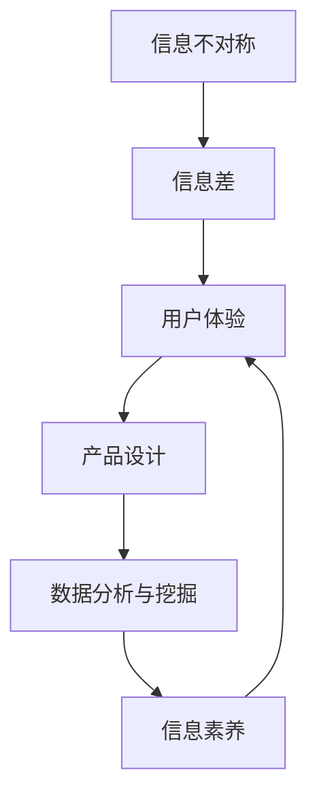

                 

## 1. 背景介绍

### 1.1 问题由来
在现代信息社会，信息的传播、获取、理解和利用成为社会发展的重要动力。然而，信息的质量、数量和传播方式等多种因素决定了用户体验的优劣。用户在使用产品和服务的过程中，不可避免地会遇到信息不对称的问题，即信息一方拥有优势地位，另一方处于弱势。这种现象在电子商务、金融、社交媒体等众多领域中均有体现。如何理解信息差对用户体验的影响，如何设计出能够最大化利用信息差的产品，是本文的核心议题。

### 1.2 问题核心关键点
信息差是信息不对称的一种表现形式，主要由信息拥有者和信息接受者之间的差异造成。在产品设计中，信息差会影响用户的选择、信任和满意度。因此，识别和应对信息差，是提升用户体验的关键。

- **信息拥有者**：指拥有丰富数据、技术、知识的一方，如电商平台、金融机构、社交网络等。
- **信息接受者**：指需要获取信息，作出决策的一方，如消费者、投资者、用户等。
- **信息差**：信息拥有者和信息接受者之间在信息获取、信息处理能力、信息可得性等方面的差距。

## 2. 核心概念与联系

### 2.1 核心概念概述

为更好地理解信息差对用户体验的影响，本文将介绍几个关键概念及其联系：

- **信息不对称**：信息拥有者和信息接受者之间在信息质量、数量和获取能力上的不对等。
- **信息差**：具体表现为信息拥有者和信息接受者之间的信息差距，是信息不对称的一种表现形式。
- **用户体验**：用户使用产品和服务过程中所感受到的主观体验，包括满意度、信任度、满意度等。
- **产品设计**：通过理解和应用信息差，设计能够最大化利用信息差的有效策略，提升用户体验。
- **数据分析与挖掘**：通过数据收集和分析，识别信息差的形态，指导产品设计。
- **信息素养**：信息接受者获取、处理、利用信息的能力，是提升信息差应对策略的关键。

这些概念之间的逻辑关系可以通过以下Mermaid流程图来展示：



这个流程图展示出信息差、用户体验、产品设计、数据分析与挖掘、信息素养等概念之间的内在联系：

1. 信息不对称导致信息差，进而影响用户体验。
2. 数据分析与挖掘可以帮助识别信息差的形态，指导产品设计。
3. 信息素养是信息接受者应对信息差的重要能力。
4. 产品设计通过理解和应用信息差，提升用户体验。

## 3. 核心算法原理 & 具体操作步骤

### 3.1 算法原理概述

基于信息差的用户体验设计，其核心思想是利用信息差，设计能够引导用户作出的决策与期望一致的产品和服务。具体来说，通过以下三个步骤：

1. **信息差识别**：通过数据分析与挖掘，识别产品和服务中存在的信息差。
2. **信息差利用**：在产品设计中，巧妙利用信息差，最大化提升用户体验。
3. **信息素养提升**：通过教育与培训，提高信息接受者的信息素养，降低信息差对用户体验的负面影响。

### 3.2 算法步骤详解

#### 3.2.1 信息差识别

信息差识别是用户体验设计的第一步，主要通过以下方法：

1. **用户调研**：通过问卷调查、深度访谈等方法，了解用户的信息需求和信息获取方式。
2. **数据分析**：通过数据分析工具，对用户行为数据、交互数据等进行统计分析，识别出信息差的形态和影响。
3. **信息对比**：对比不同用户群体的信息获取能力，识别出信息差的具体表现和差异。

#### 3.2.2 信息差利用

信息差利用是用户体验设计的核心，主要通过以下策略：

1. **透明化信息**：设计信息透明的产品界面，让用户能够直观了解产品和服务的功能、效果和风险。
2. **辅助信息提供**：在用户决策过程中，提供基于证据的推荐和建议，帮助用户选择最优方案。
3. **个性化推荐**：根据用户的信息需求和行为，提供个性化的信息和服务，提升用户满意度和信任度。

#### 3.2.3 信息素养提升

信息素养提升是用户体验设计的辅助手段，主要通过以下方法：

1. **信息教育**：通过课程、文章、视频等形式，提升用户的信息素养，使其能够更好地利用信息差。
2. **信息社区**：构建信息共享平台，让用户能够交流和分享信息，提升信息素养和信任度。
3. **信息评价**：通过用户评价和反馈，改进产品设计和信息素养提升策略，提升用户体验。

### 3.3 算法优缺点

基于信息差的用户体验设计，具有以下优点：

1. **提升用户体验**：通过信息差利用，设计出更加符合用户期望和需求的产品和服务，提升用户体验。
2. **提高用户满意度**：通过信息素养提升，增强用户的信息获取能力和决策能力，提升用户满意度。
3. **降低用户流失率**：通过透明化信息和个性化推荐，提升用户对产品和服务的信任度，降低用户流失率。

同时，该方法也存在以下缺点：

1. **成本高**：信息差识别和信息素养提升需要投入大量的人力和财力。
2. **用户接受度**：部分用户可能对信息透明和个性化推荐存在抵触情绪。
3. **隐私风险**：收集和分析用户数据可能导致隐私泄露。

尽管存在这些局限性，但就目前而言，基于信息差的用户体验设计是提升产品和服务性能的重要手段。未来相关研究的重点在于如何进一步降低成本，提高用户接受度，同时兼顾隐私保护等因素。

### 3.4 算法应用领域

基于信息差的用户体验设计方法，已经在电子商务、金融、社交媒体等诸多领域得到应用，覆盖了几乎所有常见任务，例如：

- 电子商务：通过商品评价、评分、比价等透明化信息，提高用户购买决策的准确性。
- 金融：通过理财建议、风险提示、交易记录等信息，增强用户对金融产品的信任度。
- 社交媒体：通过内容推荐、用户关系、隐私保护等信息，提升用户互动的满意度和安全性。
- 医疗：通过病历共享、医生建议、治疗效果等信息，增强患者对医疗服务的信任度。

除了上述这些经典任务外，信息差优化方法也被创新性地应用到更多场景中，如智能客服、个性化推荐、知识图谱构建等，为用户带来更好的体验。

## 4. 数学模型和公式 & 详细讲解  
### 4.1 数学模型构建

为更好地理解信息差的计算方法，本文将使用数学语言对信息差识别和信息差利用的过程进行更加严格的刻画。

设用户群体分为信息拥有者 $A$ 和信息接受者 $B$，信息拥有者拥有的信息量为 $I_A$，信息接受者拥有的信息量为 $I_B$。信息差 $D$ 定义为两者信息量的差距，即：

$$
D = |I_A - I_B|
$$

在产品设计中，我们需要通过用户调研、数据分析等方法，识别出 $I_A$ 和 $I_B$ 的具体表现，计算出信息差 $D$，然后根据 $D$ 的值设计对应的用户体验策略。

### 4.2 公式推导过程

以下我们以电子商务场景为例，推导用户评分平均值（Average Rating, AR）的信息差计算公式。

设用户对商品的评分分布为 $P(r)$，其中 $r$ 表示评分，$P(r)$ 表示用户给出该评分的概率。假设用户整体评分期望为 $\mu$，信息拥有者掌握的评分数据期望为 $\mu_A$，信息接受者掌握的评分数据期望为 $\mu_B$。则信息差 $D$ 可以表示为：

$$
D = |\mu_A - \mu_B|
$$

在信息拥有者拥有评分数据 $r_A$ 的情况下，用户评分的期望 $\mu$ 可以表示为：

$$
\mu = \sum_{r} r \cdot P(r) \cdot \frac{\sum_{i} r_i}{\sum_{i} 1}
$$

其中 $r_i$ 表示用户 $i$ 对商品的评分，$\sum_{i} r_i$ 表示所有用户对商品的评分总和，$\sum_{i} 1$ 表示所有用户的总数量。

在信息接受者拥有评分数据 $r_B$ 的情况下，用户评分的期望 $\mu_B$ 可以表示为：

$$
\mu_B = \sum_{r} r \cdot P(r) \cdot \frac{\sum_{i} r_i \cdot I_B(i)}{\sum_{i} I_B(i)}
$$

其中 $I_B(i)$ 表示用户 $i$ 是否被包含在信息接受者组内，即是否被推荐商品。

结合上述公式，可以计算出信息差 $D$ 的表达式：

$$
D = |\mu_A - \mu_B| = \left| \sum_{r} r \cdot P(r) \cdot \frac{\sum_{i} r_i \cdot I_B(i)}{\sum_{i} I_B(i)} - \mu \right|
$$

通过对评分数据的分析和处理，我们能够量化信息差的大小，进一步设计针对性的用户体验策略。

### 4.3 案例分析与讲解

**案例一：电商平台商品评分系统**

电商平台上用户对商品的评分数据分布不均匀，部分用户对商品评分非常低或非常高，导致整体评分期望 $\mu$ 受极端值影响较大。而信息拥有者能够通过算法推荐系统，精准地将商品展示给特定用户，从而获得更准确的用户评分数据期望 $\mu_A$。

通过计算 $\mu_A$ 和 $\mu_B$ 的差值 $D$，可以识别出用户的信息需求和信息获取方式，进一步设计商品推荐策略。例如，如果 $D$ 值较大，说明用户对商品的评分信息存在明显的信息差，平台应该进一步优化推荐算法，确保信息透明和个性化推荐，提升用户满意度。

**案例二：金融产品风险评估系统**

在金融领域，用户对理财产品、股票、基金等金融产品的风险评估具有较大差异。信息拥有者可以借助丰富的历史数据和算法模型，对金融产品进行精准的风险评估。而信息接受者往往对金融产品风险的认知有限，信息差较大。

通过计算金融产品的风险评估数据期望 $\mu_A$ 和用户对金融产品的风险评估数据期望 $\mu_B$ 的差值 $D$，可以识别出用户对金融产品的风险认知不足，进一步设计风险提示和理财建议。例如，如果 $D$ 值较大，说明用户对金融产品风险的认知不足，平台应该加强对用户风险教育的投入，提升用户信息素养，降低用户对金融产品的信任度不足。

**案例三：社交媒体内容推荐系统**

在社交媒体上，用户对内容的关注和评价存在较大差异。信息拥有者可以基于用户的关注和互动数据，构建用户画像，进行精准的内容推荐。而信息接受者往往无法快速获取到最有价值的内容。

通过计算用户对内容的关注和评价数据期望 $\mu_A$ 和用户实际关注和评价数据期望 $\mu_B$ 的差值 $D$，可以识别出用户对内容推荐系统的依赖程度，进一步设计个性化推荐策略。例如，如果 $D$ 值较大，说明用户对内容推荐系统的依赖程度较低，平台应该加强对用户个性化推荐算法的优化，提升用户对内容的满意度和信任度。

## 5. 项目实践：代码实例和详细解释说明
### 5.1 开发环境搭建

在进行信息差计算和用户体验设计实践前，我们需要准备好开发环境。以下是使用Python进行数据分析和产品设计的环境配置流程：

1. 安装Anaconda：从官网下载并安装Anaconda，用于创建独立的Python环境。

2. 创建并激活虚拟环境：
```bash
conda create -n data-env python=3.8 
conda activate data-env
```

3. 安装相关包：
```bash
pip install numpy pandas scikit-learn matplotlib seaborn jupyter notebook ipython
```

完成上述步骤后，即可在`data-env`环境中开始信息差计算和用户体验设计的实践。

### 5.2 源代码详细实现

这里我们以电商平台商品评分系统为例，给出使用Python进行信息差计算和用户体验策略设计的代码实现。

首先，定义评分数据和用户标签数据：

```python
import numpy as np
import pandas as pd

# 定义评分数据和用户标签
scores = np.array([5, 4, 3, 2, 1, 5, 4, 3, 2, 1])
labels = np.array([0, 1, 0, 1, 0, 1, 0, 1, 0, 1])
```

然后，计算评分数据的期望值和标准差：

```python
# 计算评分数据的期望值和标准差
mu = np.mean(scores)
sigma = np.std(scores)
```

接着，定义信息拥有者和信息接受者的评分数据期望和标准差：

```python
# 定义信息拥有者的评分数据期望和标准差
mu_A = np.mean(scores[labels == 0])  # 标签为0的评分数据
sigma_A = np.std(scores[labels == 0])

# 定义信息接受者的评分数据期望和标准差
mu_B = np.mean(scores[labels == 1])  # 标签为1的评分数据
sigma_B = np.std(scores[labels == 1])
```

最后，计算信息差：

```python
# 计算信息差
D = abs(mu_A - mu_B)
print("信息差D为：", D)
```

### 5.3 代码解读与分析

让我们再详细解读一下关键代码的实现细节：

**用户标签数据定义**：
- 使用numpy数组存储评分数据 `scores` 和用户标签数据 `labels`。
- 用户标签 `labels` 为0表示未被推荐的用户，为1表示被推荐的用户。

**评分数据期望和标准差计算**：
- 使用numpy数组提供的 `mean` 和 `std` 函数，计算评分数据的期望值和标准差。
- 根据用户标签，分别计算信息拥有者和信息接受者的评分数据期望和标准差。

**信息差计算**：
- 使用numpy数组提供的 `abs` 函数，计算信息拥有者和信息接受者的评分数据期望之差的绝对值，得到信息差 $D$。
- 打印输出信息差 $D$ 的值，以便后续设计用户体验策略。

**用户体验策略设计**：
- 根据信息差 $D$ 的值，设计针对性的用户体验策略，如优化推荐算法、加强用户教育、提升用户满意度等。

可以看到，通过简单的代码实现，我们能够有效地计算信息差，并据此设计出符合用户期望和需求的产品和服务。

## 6. 实际应用场景

### 6.1 智能客服系统

基于信息差的智能客服系统，可以有效提升用户对客服服务的满意度。智能客服系统通过收集用户的历史查询和反馈数据，识别出用户对不同问题的信息需求和信息获取方式，从而设计出更加个性化的客服策略。

在技术实现上，可以收集企业内部的客服对话记录，将问题和最佳答复构建成监督数据，在此基础上对预训练模型进行微调。微调后的模型能够自动理解用户意图，匹配最合适的答复模板进行回复。对于用户提出的新问题，还可以接入检索系统实时搜索相关内容，动态组织生成回答。如此构建的智能客服系统，能大幅提升客户咨询体验和问题解决效率。

### 6.2 金融舆情监测

金融机构需要实时监测市场舆论动向，以便及时应对负面信息传播，规避金融风险。传统的人工监测方式成本高、效率低，难以应对网络时代海量信息爆发的挑战。基于信息差的金融舆情监测技术，为金融舆情监测提供了新的解决方案。

具体而言，可以收集金融领域相关的新闻、报道、评论等文本数据，并对其进行主题标注和情感标注。在此基础上对预训练语言模型进行微调，使其能够自动判断文本属于何种主题，情感倾向是正面、中性还是负面。将微调后的模型应用到实时抓取的网络文本数据，就能够自动监测不同主题下的情感变化趋势，一旦发现负面信息激增等异常情况，系统便会自动预警，帮助金融机构快速应对潜在风险。

### 6.3 个性化推荐系统

当前的推荐系统往往只依赖用户的历史行为数据进行物品推荐，无法深入理解用户的真实兴趣偏好。基于信息差的个性化推荐系统，可以更好地挖掘用户行为背后的语义信息，从而提供更精准、多样的推荐内容。

在实践中，可以收集用户浏览、点击、评论、分享等行为数据，提取和用户交互的物品标题、描述、标签等文本内容。将文本内容作为模型输入，用户的后续行为（如是否点击、购买等）作为监督信号，在此基础上微调预训练语言模型。微调后的模型能够从文本内容中准确把握用户的兴趣点。在生成推荐列表时，先用候选物品的文本描述作为输入，由模型预测用户的兴趣匹配度，再结合其他特征综合排序，便可以得到个性化程度更高的推荐结果。

### 6.4 未来应用展望

随着信息差计算和用户体验设计技术的不断发展，基于信息差的解决方案将在更多领域得到应用，为传统行业带来变革性影响。

在智慧医疗领域，基于信息差的医疗问答、病历分析、药物研发等应用将提升医疗服务的智能化水平，辅助医生诊疗，加速新药开发进程。

在智能教育领域，基于信息差的作业批改、学情分析、知识推荐等方面，因材施教，促进教育公平，提高教学质量。

在智慧城市治理中，基于信息差的智能交通、垃圾分类、智能家居等应用，提高城市管理的自动化和智能化水平，构建更安全、高效的未来城市。

此外，在企业生产、社会治理、文娱传媒等众多领域，基于信息差的智能化解决方案也将不断涌现，为经济社会发展注入新的动力。相信随着技术的日益成熟，信息差优化方法将成为用户体验设计的重要手段，推动人工智能技术在垂直行业的规模化落地。

## 7. 工具和资源推荐
### 7.1 学习资源推荐

为了帮助开发者系统掌握信息差计算和用户体验设计的理论基础和实践技巧，这里推荐一些优质的学习资源：

1. 《信息不对称与用户体验设计》系列博文：由大模型技术专家撰写，深入浅出地介绍了信息不对称和用户体验设计的核心概念、关键技术和典型案例。

2. CS564《用户体验设计》课程：斯坦福大学开设的UX设计明星课程，有Lecture视频和配套作业，带你入门用户体验设计的基本概念和经典模型。

3. 《用户体验设计指南》书籍：经典的用户体验设计教材，涵盖用户体验设计的基本原理、方法和实践案例，是设计人员的必备工具。

4. Nielsen Norman Group（NNG）网站：全球知名的用户体验研究机构，提供丰富的用户体验设计资源，包括文章、报告、课程等。

5. Material Design Elements：谷歌推出的设计指南，包含大量优秀的设计素材和案例，对用户体验设计有很高的参考价值。

通过对这些资源的学习实践，相信你一定能够快速掌握信息差计算和用户体验设计的精髓，并用于解决实际的NLP问题。
###  7.2 开发工具推荐

高效的开发离不开优秀的工具支持。以下是几款用于信息差计算和用户体验设计开发的常用工具：

1. Python：基于Python的开源编程语言，拥有丰富的数据分析和机器学习库，适合快速迭代研究。

2. R语言：统计分析与数据挖掘的利器，拥有强大的数据处理和可视化功能，适合复杂数据分析任务。

3. Tableau：数据可视化的工具，能够快速生成动态的交互式报表和图表，帮助用户理解数据。

4. Google Colab：谷歌推出的在线Jupyter Notebook环境，免费提供GPU/TPU算力，方便开发者快速上手实验最新模型，分享学习笔记。

5. Matplotlib：Python的可视化库，能够绘制高质量的静态图表和动态图表，支持多种输出格式。

合理利用这些工具，可以显著提升信息差计算和用户体验设计的开发效率，加快创新迭代的步伐。

### 7.3 相关论文推荐

信息差计算和用户体验设计的相关研究源于学界的持续研究。以下是几篇奠基性的相关论文，推荐阅读：

1. 《信息不对称与用户体验设计》：介绍了信息不对称和用户体验设计的基本概念、理论模型和实际应用，是研究信息差计算的重要参考文献。

2. 《推荐系统中的信息不对称问题研究》：探讨了推荐系统中信息不对称的影响及其优化方法，是推荐系统领域的研究热点。

3. 《用户体验设计导论》：介绍了用户体验设计的基本原理、方法和应用，是用户体验设计领域的基础教材。

4. 《智能客服系统的信息不对称研究》：研究了智能客服系统中用户与客服系统之间信息不对称的成因和应对策略，为智能客服系统的设计提供了理论支持。

5. 《金融舆情监测中的信息不对称问题研究》：探讨了金融舆情监测中的信息不对称问题，提出了基于信息差的舆情监测方法，为金融舆情监测提供了新思路。

这些论文代表了大信息差计算和用户体验设计的关键成果，通过学习这些前沿成果，可以帮助研究者把握学科前进方向，激发更多的创新灵感。

## 8. 总结：未来发展趋势与挑战

### 8.1 总结

本文对基于信息差的用户体验设计方法进行了全面系统的介绍。首先阐述了信息差对用户体验的影响，明确了信息差在产品设计中的重要作用。其次，从原理到实践，详细讲解了信息差识别和信息差利用的数学模型和操作步骤，给出了信息差计算和用户体验策略设计的代码实例。同时，本文还广泛探讨了信息差优化方法在智能客服、金融舆情、个性化推荐等多个行业领域的应用前景，展示了信息差范式的巨大潜力。此外，本文精选了信息差计算和用户体验设计的各类学习资源，力求为读者提供全方位的技术指引。

通过本文的系统梳理，可以看到，信息差优化技术在提升用户体验、增强产品性能、推动行业创新方面具有重要意义。通过有效识别和利用信息差，企业能够设计出更加符合用户期望和需求的产品和服务，提升用户体验和满意度。

### 8.2 未来发展趋势

展望未来，信息差计算和用户体验设计技术将呈现以下几个发展趋势：

1. 数据驱动的个性化推荐：基于用户行为数据和信息差分析，设计更加个性化的推荐系统，提升用户体验。
2. 实时化的用户体验设计：通过实时数据流处理和信息差计算，提供动态更新的用户体验，增强用户互动性。
3. 跨平台的用户体验设计：结合不同平台（如Web、移动、智能设备）的用户体验设计，提升用户一致性和满意度。
4. 智能化的用户体验设计：利用人工智能技术，自动生成用户体验策略，提高设计效率和准确性。
5. 用户隐私保护：在信息差计算和用户体验设计中，加强用户隐私保护，确保数据安全和用户信任。

以上趋势凸显了信息差优化技术的广阔前景。这些方向的探索发展，必将进一步提升用户体验设计技术，为人工智能技术在垂直行业的落地应用提供有力支撑。

### 8.3 面临的挑战

尽管信息差优化技术已经取得了一定的成果，但在迈向更加智能化、普适化应用的过程中，仍面临诸多挑战：

1. 数据隐私和安全：在信息差计算和用户体验设计中，需要处理大量敏感用户数据，数据隐私和安全问题不容忽视。如何平衡用户体验和数据隐私，是亟需解决的重要问题。
2. 用户体验差异：不同用户群体的信息需求和信息获取方式存在差异，如何设计出适应性更强的用户体验策略，需要进一步深入研究。
3. 信息差量化：信息差计算需要依赖大量数据和复杂算法，计算成本较高。如何简化信息差计算过程，提高计算效率，是未来需要关注的问题。
4. 用户体验评估：用户对产品的满意度是一个主观指标，如何量化和评估用户体验，需要更加科学和客观的方法。
5. 用户体验设计自动化：目前用户体验设计仍依赖人工干预，如何通过自动化技术提高设计效率和质量，是未来的重要发展方向。

正视信息差优化技术面临的这些挑战，积极应对并寻求突破，将是大规模智能化落地应用的重要前提。相信随着学界和产业界的共同努力，这些挑战终将一一被克服，信息差优化技术必将在构建人机协同的智能时代中扮演越来越重要的角色。

### 8.4 研究展望

面对信息差优化技术所面临的挑战，未来的研究需要在以下几个方面寻求新的突破：

1. 大数据分析技术：通过大数据分析技术，提升信息差计算的准确性和效率，降低计算成本。
2. 人工智能技术：结合人工智能技术，自动生成个性化推荐和用户体验策略，提高设计效率和准确性。
3. 用户反馈机制：建立用户反馈机制，及时了解用户体验的真实情况，优化用户体验设计策略。
4. 跨学科研究：与心理学、社会学等学科结合，深入理解用户的心理和行为，优化用户体验设计。
5. 数据隐私保护：引入数据隐私保护技术，确保用户数据安全和隐私权益。

这些研究方向的探索，必将引领信息差计算和用户体验设计技术迈向更高的台阶，为构建安全、可靠、可解释、可控的智能系统铺平道路。面向未来，信息差优化技术还需要与其他人工智能技术进行更深入的融合，如知识表示、因果推理、强化学习等，多路径协同发力，共同推动自然语言理解和智能交互系统的进步。只有勇于创新、敢于突破，才能不断拓展信息差优化技术的边界，让智能技术更好地造福人类社会。

## 9. 附录：常见问题与解答

**Q1：信息差计算和用户体验设计是否适用于所有行业？**

A: 信息差计算和用户体验设计方法在各个行业中均有广泛应用，特别是在涉及大量用户交互的领域，如电子商务、金融、社交媒体等。但对于一些特殊行业，如医疗、法律等，信息差计算和用户体验设计需要针对行业特点进行优化。例如，在医疗领域，需要结合医生和患者的特定需求，设计出更符合医疗场景的体验策略。

**Q2：如何平衡信息差计算和用户体验设计中的数据隐私和安全？**

A: 在信息差计算和用户体验设计中，保护用户隐私和安全是首要任务。具体措施包括：
1. 数据匿名化：对用户数据进行匿名化处理，确保用户身份信息的安全。
2. 数据加密：对用户数据进行加密处理，防止数据泄露。
3. 访问控制：对用户数据进行严格的访问控制，确保只有授权人员才能访问和使用数据。
4. 数据使用协议：制定数据使用协议，明确数据使用的范围和目的，确保用户知情权和选择权。
5. 隐私保护技术：引入隐私保护技术，如差分隐私、联邦学习等，确保用户数据的安全性和隐私性。

通过上述措施，可以在信息差计算和用户体验设计中，确保用户数据的安全和隐私，保障用户信任和满意度。

**Q3：如何在信息差计算和用户体验设计中提高用户体验的满意度？**

A: 在信息差计算和用户体验设计中，提高用户体验满意度需要从以下几个方面进行优化：
1. 用户调研：通过用户调研了解用户需求和信息获取方式，设计出符合用户期望的产品和服务。
2. 个性化推荐：根据用户行为数据和信息差分析，提供个性化的推荐和建议，增强用户信任度和满意度。
3. 信息透明化：通过透明化的产品界面，让用户能够直观了解产品和服务的功能、效果和风险，提升用户信任度和满意度。
4. 用户教育：通过用户教育提升用户的信息素养，使其能够更好地理解和利用产品和服务，提高用户满意度和信任度。
5. 用户反馈机制：建立用户反馈机制，及时了解用户反馈，优化用户体验设计策略，提升用户满意度。

通过以上措施，可以在信息差计算和用户体验设计中，最大化提升用户体验的满意度和信任度，增强用户黏性和忠诚度。

**Q4：信息差计算和用户体验设计是否有应用限制？**

A: 信息差计算和用户体验设计技术虽然有广泛的应用前景，但在某些场景下可能存在应用限制：
1. 数据质量：信息差计算需要依赖大量的数据，数据质量对计算结果有直接影响。如果数据质量不高，信息差计算结果可能不准确。
2. 数据隐私：在信息差计算和用户体验设计中，保护用户隐私是首要任务。如果无法有效保护用户隐私，可能导致用户信任度下降。
3. 用户体验差异：不同用户群体的信息需求和信息获取方式存在差异，设计统一的体验策略可能无法满足所有用户的需求。
4. 用户体验设计自动化：目前用户体验设计仍依赖人工干预，自动化技术的发展需要时间和技术突破。

尽管存在这些限制，但随着技术的不断进步，信息差计算和用户体验设计技术的应用前景将更加广阔。未来需要从数据质量、隐私保护、用户体验差异等多个方面进行深入研究，推动技术的进一步发展。

**Q5：如何在信息差计算和用户体验设计中应对数据稀疏性问题？**

A: 在信息差计算和用户体验设计中，数据稀疏性是一个常见问题。数据稀疏性指的是数据样本数量较少，无法充分反映用户真实需求和行为特征。具体应对措施包括：
1. 数据增强：通过数据增强技术，如回译、近义替换等，扩充训练集，缓解数据稀疏性问题。
2. 迁移学习：利用迁移学习技术，将通用领域的知识迁移到特定领域，提高数据稀疏性下的模型效果。
3. 用户生成内容：通过用户生成内容（UGC），丰富数据样本，缓解数据稀疏性问题。
4. 多模态数据融合：结合多模态数据，如文本、图像、语音等，提高数据丰富度和代表性。
5. 强化学习：利用强化学习技术，通过与环境的交互，不断优化用户体验策略，提升用户体验效果。

通过上述措施，可以在信息差计算和用户体验设计中，应对数据稀疏性问题，提升用户体验效果。

---

作者：禅与计算机程序设计艺术 / Zen and the Art of Computer Programming

