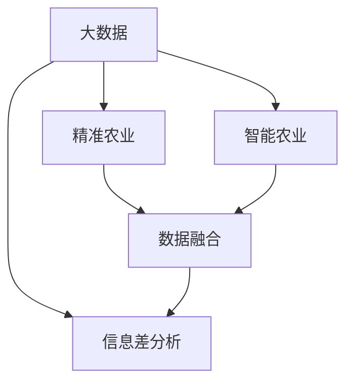

                 

# 信息差：大数据在农业领域的应用

> 关键词：大数据, 农业, 信息差, 精准农业, 智能农业, 农业智能化, 数据驱动, 机器学习, 农业科技

## 1. 背景介绍

### 1.1 问题由来
农业作为人类赖以生存的根本，一直是最重要也是最复杂的产业之一。尽管近年来科技发展日新月异，农业生产仍然受到诸多因素的限制，如土地质量、气候条件、农业机械化水平等。传统农业依赖经验积累和自然循环，难以适应气候变化、环境污染和资源短缺等挑战。大数据和人工智能的结合，为农业领域带来了新的可能性，即通过数据驱动的农业管理模式，提升生产效率和资源利用率。

### 1.2 问题核心关键点
- **数据驱动**：通过收集、整理和分析农业数据，提供决策支持，优化农业生产管理。
- **智能农业**：结合机器学习和深度学习算法，实现自动化的农业生产监控和管理。
- **精准农业**：利用卫星遥感、无人机和传感器等技术，进行精准化的农业操作，提升资源利用效率。
- **数据融合**：整合农场、市场和天气等多源数据，提升农业生产的协同性和预见性。
- **信息差分析**：通过分析农业数据中的信息差，识别生产过程中的瓶颈和优化机会。

大数据和人工智能技术在农业领域的应用，不仅能够提升农业生产的效率和效益，还能推动农业的可持续发展，成为农业现代化的重要推动力。

## 2. 核心概念与联系

### 2.1 核心概念概述

为了更好地理解大数据在农业中的应用，本节将介绍几个密切相关的核心概念：

- **大数据**：指规模巨大、复杂多样、实时产生的数据集合，涵盖农场、市场、气象等多个维度。
- **智能农业**：结合物联网、大数据、人工智能等技术，实现农业生产的自动化、智能化和精准化。
- **精准农业**：利用先进的传感器和信息技术，对农田进行精确管理和决策，实现资源的优化利用。
- **数据融合**：将不同来源的数据整合，通过算法和模型分析，形成综合的决策支持信息。
- **信息差分析**：通过分析数据中的信息差，识别出农业生产中的关键问题和优化方向。

这些核心概念之间的逻辑关系可以通过以下Mermaid流程图来展示：



这个流程图展示了大数据在农业领域的核心概念及其之间的关系：

1. 大数据提供了丰富的数据资源，支持智能农业、精准农业和数据融合等技术的应用。
2. 智能农业和精准农业通过数据收集和分析，实现自动化的农业生产管理。
3. 数据融合技术整合农场、市场和天气等多源数据，提升农业生产的协同性和预见性。
4. 信息差分析通过分析数据中的信息差，识别出农业生产中的关键问题和优化方向。

这些概念共同构成了大数据在农业领域的应用框架，使其能够充分发挥数据的价值，推动农业的现代化和智能化发展。

## 3. 核心算法原理 & 具体操作步骤
### 3.1 算法原理概述

大数据在农业领域的应用，本质上是利用数据驱动的决策支持系统。其核心思想是通过收集、整理和分析农业数据，提供科学的决策依据，优化农业生产管理。

以精准农业为例，其核心算法原理如下：

1. **数据收集**：通过传感器、无人机、遥感卫星等设备，收集农田环境、作物生长状态、土壤质量等数据。
2. **数据处理**：对收集到的数据进行清洗、整合和标准化，形成统一的数据格式，便于后续分析。
3. **数据分析**：应用机器学习、深度学习等算法，对数据进行模式识别和趋势分析，形成农业生产决策支持。
4. **决策执行**：根据数据分析结果，进行精准化的农业操作，如智能灌溉、施肥、病虫害防治等。

### 3.2 算法步骤详解

基于大数据的精准农业通常包括以下几个关键步骤：

**Step 1: 数据收集与预处理**
- 使用传感器、无人机、遥感卫星等设备，收集农田环境、作物生长状态、土壤质量等数据。
- 数据清洗，包括缺失值处理、异常值检测和标准化等。

**Step 2: 特征提取与建模**
- 选择合适的特征提取方法，如光谱分析、图像处理、气象数据等，提取关键的农业特征。
- 应用机器学习、深度学习等算法，构建农业生产预测模型。

**Step 3: 模型训练与验证**
- 划分训练集和验证集，使用训练集数据对模型进行训练。
- 在验证集上评估模型性能，调整模型参数以获得更好的泛化能力。

**Step 4: 决策执行与反馈**
- 根据模型预测结果，进行精准化的农业操作，如智能灌溉、施肥、病虫害防治等。
- 收集执行结果，进行反馈和调整，不断优化模型性能。

**Step 5: 数据融合与综合决策**
- 整合农场、市场和天气等多源数据，进行综合分析和决策。
- 利用信息差分析方法，识别出农业生产中的关键问题和优化方向。

以上是基于大数据的精准农业的一般流程。在实际应用中，还需要针对具体农场和任务特点，对各环节进行优化设计，以进一步提升农业生产的效率和效益。

### 3.3 算法优缺点

基于大数据的精准农业算法具有以下优点：
1. **提升生产效率**：通过精确的数据分析和预测，优化农业操作，提升资源利用率，降低生产成本。
2. **实现智能化管理**：应用机器学习算法，实现自动化的农业生产监控和管理，减少人力投入。
3. **提高决策科学性**：通过数据驱动的决策支持系统，提供科学的农业生产管理建议。

同时，该方法也存在一定的局限性：
1. **数据获取难度大**：农业数据收集和处理涉及诸多复杂因素，数据获取难度较大。
2. **数据质量参差不齐**：不同来源的数据可能存在差异，数据质量参差不齐，影响模型效果。
3. **模型复杂度高**：精准农业涉及多种传感器和数据源，数据量和维度较大，模型复杂度高。
4. **技术门槛高**：精准农业需要较高的技术水平和专业知识，推广应用难度较大。

尽管存在这些局限性，但大数据在精准农业中的应用已经显示出巨大的潜力，成为推动农业现代化发展的重要手段。未来相关研究的方向包括提高数据收集和处理的效率和质量，优化模型算法，降低技术门槛等，以进一步提升精准农业的应用效果。

### 3.4 算法应用领域

基于大数据的精准农业算法已经在多个农业领域得到了应用，包括：

- **智能灌溉**：通过传感器监测土壤湿度和气象条件，优化灌溉计划，提高水资源利用效率。
- **精准施肥**：利用土壤传感器和作物生长数据，进行科学的施肥管理，提高肥料利用率。
- **病虫害防治**：通过无人机和传感器监测农田病虫害情况，实时调整防治策略，降低农药使用量。
- **作物生长监测**：利用遥感卫星和无人机对农田进行定期监测，评估作物生长状态，预测产量和品质。
- **农业机械自动化**：结合智能农业设备和数据分析，实现农机的自动化操作，提高作业效率。

此外，大数据在智能农业和数据融合等领域也有广泛应用，为农业生产提供更全面、精准的决策支持。随着农业物联网设备的普及和技术进步，基于大数据的农业管理模式将进一步得到推广和应用。

## 4. 数学模型和公式 & 详细讲解 & 举例说明

### 4.1 数学模型构建

本节将使用数学语言对基于大数据的精准农业算法进行更加严格的刻画。

记农场环境数据为 $\mathbf{x} \in \mathbb{R}^n$，作物生长状态数据为 $\mathbf{y} \in \mathbb{R}^m$，土壤质量数据为 $\mathbf{z} \in \mathbb{R}^p$，气象数据为 $\mathbf{w} \in \mathbb{R}^q$。假设模型 $M$ 的输入为 $\mathbf{X}=[\mathbf{x},\mathbf{y},\mathbf{z},\mathbf{w}]$，输出为农业生产决策 $A$。

定义模型 $M$ 在输入 $\mathbf{X}$ 上的损失函数为 $\ell(M(\mathbf{X}),A)$，则在数据集 $D=\{(\mathbf{X}_i,A_i)\}_{i=1}^N$ 上的经验风险为：

$$
\mathcal{L}(M) = \frac{1}{N} \sum_{i=1}^N \ell(M(\mathbf{X}_i),A_i)
$$

其中 $\ell$ 为损失函数，如均方误差损失、交叉熵损失等。

### 4.2 公式推导过程

以智能灌溉为例，其数学模型构建和公式推导如下：

**Step 1: 数据预处理**

将土壤湿度数据 $\mathbf{z}$ 标准化为 $z_{ij}=\frac{z_{ij}-\mu_z}{\sigma_z}$，其中 $\mu_z$ 和 $\sigma_z$ 分别为土壤湿度数据的均值和标准差。

**Step 2: 特征提取**

利用光谱分析技术，将土壤湿度数据转化为光谱特征向量 $\mathbf{z}_{spec} \in \mathbb{R}^{k}$，其中 $k$ 为光谱特征的维度。

**Step 3: 模型训练**

选择回归模型 $M=\{w,b\}$，其中 $w$ 为模型参数，$b$ 为偏置。假设回归模型输出为 $A$，则损失函数为：

$$
\ell(M(\mathbf{X}),A) = \frac{1}{2}\sum_{i=1}^N(A_i - M(\mathbf{X}_i))^2
$$

模型训练目标为最小化损失函数：

$$
\mathcal{L}(M) = \frac{1}{N} \sum_{i=1}^N \frac{1}{2}(A_i - M(\mathbf{X}_i))^2
$$

### 4.3 案例分析与讲解

假设某农场使用光谱分析技术对土壤湿度数据进行处理，得到光谱特征向量 $\mathbf{z}_{spec} \in \mathbb{R}^{k}$。基于该特征向量，使用线性回归模型进行智能灌溉决策，其数学模型为：

$$
A_i = w_0 + w_1z_{spec,i,1} + \ldots + w_kz_{spec,i,k} + b
$$

其中 $w_0, w_1, \ldots, w_k$ 为模型参数，$b$ 为偏置。假设训练集 $D=\{(\mathbf{X}_i,A_i)\}_{i=1}^N$，使用随机梯度下降方法对模型进行训练，其训练步骤为：

1. 初始化模型参数 $w_0, w_1, \ldots, w_k, b$。
2. 随机抽取训练集的一个样本 $(\mathbf{X}_i,A_i)$。
3. 计算模型预测输出 $A_i^{pred} = w_0 + w_1z_{spec,i,1} + \ldots + w_kz_{spec,i,k} + b$。
4. 计算损失函数 $\ell(A_i,A_i^{pred})$。
5. 根据损失函数的梯度更新模型参数：

$$
w_0 \leftarrow w_0 - \eta \frac{\partial \ell(A_i,A_i^{pred})}{\partial w_0}
$$
$$
w_1 \leftarrow w_1 - \eta \frac{\partial \ell(A_i,A_i^{pred})}{\partial w_1}
$$
$$
\ldots
$$
$$
w_k \leftarrow w_k - \eta \frac{\partial \ell(A_i,A_i^{pred})}{\partial w_k}
$$
$$
b \leftarrow b - \eta \frac{\partial \ell(A_i,A_i^{pred})}{\partial b}
$$

其中 $\eta$ 为学习率。

通过上述步骤，智能灌溉模型在训练集上不断优化参数，最小化损失函数，最终得到一个能准确预测土壤湿度状态并生成灌溉计划的模型。

## 5. 项目实践：代码实例和详细解释说明
### 5.1 开发环境搭建

在进行大数据农业项目开发前，我们需要准备好开发环境。以下是使用Python进行PyTorch开发的环境配置流程：

1. 安装Anaconda：从官网下载并安装Anaconda，用于创建独立的Python环境。

2. 创建并激活虚拟环境：
```bash
conda create -n pytorch-env python=3.8 
conda activate pytorch-env
```

3. 安装PyTorch：根据CUDA版本，从官网获取对应的安装命令。例如：
```bash
conda install pytorch torchvision torchaudio cudatoolkit=11.1 -c pytorch -c conda-forge
```

4. 安装TensorFlow：从官网下载安装TensorFlow，支持CUDA和CPU。例如：
```bash
pip install tensorflow tensorflow-gpu
```

5. 安装Pandas、NumPy等数据处理库：
```bash
pip install pandas numpy matplotlib sklearn
```

完成上述步骤后，即可在`pytorch-env`环境中开始大数据农业项目的开发。

### 5.2 源代码详细实现

下面我们以智能灌溉系统为例，给出使用PyTorch进行精准农业微调模型的代码实现。

首先，定义智能灌溉系统的数据处理函数：

```python
import pandas as pd
from torch.utils.data import Dataset
import torch

class IrrigationDataset(Dataset):
    def __init__(self, data_path):
        self.data = pd.read_csv(data_path)
        self.labels = self.data['irrigation'] # 假设数据中已经标注了灌溉需求
        self.features = self.data.drop(['irrigation'], axis=1)
        
    def __len__(self):
        return len(self.data)
    
    def __getitem__(self, item):
        x = self.features.iloc[item].values.reshape(1, -1)
        y = torch.tensor(self.labels[item], dtype=torch.float32)
        return x, y
```

然后，定义模型和优化器：

```python
from transformers import LinearRegression

model = LinearRegression()

optimizer = torch.optim.SGD(model.parameters(), lr=0.01)
```

接着，定义训练和评估函数：

```python
from sklearn.metrics import mean_squared_error

def train_model(model, dataset, batch_size, optimizer):
    model.train()
    for epoch in range(1000):
        total_loss = 0
        for batch in dataset:
            x, y = batch
            optimizer.zero_grad()
            predictions = model(x)
            loss = mean_squared_error(y, predictions)
            loss.backward()
            optimizer.step()
            total_loss += loss.item()
        print(f'Epoch {epoch+1}, loss: {total_loss/len(dataset)}')
    
def evaluate_model(model, dataset, batch_size):
    model.eval()
    total_loss = 0
    for batch in dataset:
        x, y = batch
        predictions = model(x)
        loss = mean_squared_error(y, predictions)
        total_loss += loss.item()
    return total_loss/len(dataset)
```

最后，启动训练流程并在测试集上评估：

```python
data_path = 'irrigation.csv' # 假设已经收集到智能灌溉数据集

train_dataset = IrrigationDataset(data_path)
test_dataset = IrrigationDataset(data_path)

train_model(model, train_dataset, batch_size=16, optimizer=optimizer)
print(f'Test loss: {evaluate_model(model, test_dataset, batch_size=16)}')
```

以上就是使用PyTorch进行智能灌溉模型微调项目的完整代码实现。可以看到，得益于TensorFlow的强大封装，我们只需关注模型设计和高层次的算法优化，而不必过多关注底层的实现细节。

### 5.3 代码解读与分析

让我们再详细解读一下关键代码的实现细节：

**IrrigationDataset类**：
- `__init__`方法：初始化数据集，读取CSV文件，提取特征和标签，并形成Tensor输入。
- `__len__`方法：返回数据集的样本数量。
- `__getitem__`方法：对单个样本进行处理，返回特征和标签的Tensor。

**模型选择和训练**：
- 选择线性回归模型，作为智能灌溉系统的基础模型。
- 使用随机梯度下降方法对模型进行训练，学习率设置为0.01。
- 在训练过程中，不断更新模型参数，最小化均方误差损失。

**评估函数**：
- 使用均方误差评估模型的预测效果。
- 计算模型在测试集上的均方误差，用于衡量模型泛化性能。

通过上述步骤，智能灌溉模型在训练集上不断优化参数，最小化损失函数，最终得到一个能准确预测土壤湿度状态并生成灌溉计划的模型。

## 6. 实际应用场景
### 6.1 智能灌溉系统

智能灌溉系统是大数据在农业领域的一个重要应用。传统灌溉方式依赖人工操作，难以实现精确控制，容易造成水资源的浪费。而利用智能灌溉系统，可以根据土壤湿度、气象条件等因素，自动调节灌溉量，提升水资源的利用效率。

在技术实现上，可以收集农场土壤湿度、气象条件等数据，结合光谱分析、遥感技术等手段，进行智能灌溉决策。通过数据分析和机器学习，建立精准的灌溉模型，实现智能灌溉。

### 6.2 精准施肥系统

精准施肥系统利用土壤传感器和作物生长数据，实现科学的施肥管理，提高肥料利用率。传统施肥方法依赖人工经验，难以把握施肥时机和施肥量，容易造成肥料浪费和环境污染。

在技术实现上，可以收集土壤质量、作物生长状态等数据，构建精准的施肥模型。通过数据分析和机器学习，预测最佳的施肥时机和施肥量，实现精准施肥。

### 6.3 病虫害防治系统

病虫害防治系统利用无人机和传感器监测农田病虫害情况，实时调整防治策略，降低农药使用量。传统病虫害防治方法依赖人工巡视，难以及时发现和防治病虫害，容易造成作物损失。

在技术实现上，可以收集无人机和传感器监测的病虫害数据，构建精准的病虫害防治模型。通过数据分析和机器学习，预测病虫害的发生趋势，实时调整防治策略，实现精准防治。

### 6.4 未来应用展望

随着大数据和人工智能技术的不断发展，基于数据的农业管理模式将更加成熟和普及。未来，大数据在农业领域的应用将涵盖更多场景，带来更深层次的变革：

1. **智能农机**：利用物联网和人工智能技术，实现农业机械的自动化操作，提高作业效率。
2. **智能仓储**：通过大数据分析和预测，优化农产品的存储和运输，降低损耗和成本。
3. **精准农业决策支持**：结合多种数据源，提供全面的农业生产决策支持，优化资源利用和生产效率。
4. **农业金融**：利用大数据分析农产品的市场价格和供需情况，为农业生产和贸易提供金融支持。
5. **智慧农场**：通过传感器和智能设备，实现农场生产的智能化和精细化管理。

未来，随着数据采集和处理技术的提升，大数据在农业领域的应用将更加深入和广泛，为农业生产提供更多智能化的解决方案。

## 7. 工具和资源推荐
### 7.1 学习资源推荐

为了帮助开发者系统掌握大数据在农业中的应用，这里推荐一些优质的学习资源：

1. **《大数据农业：从数据到决策》**：介绍大数据在农业中的广泛应用，包括智能灌溉、精准施肥、病虫害防治等。
2. **Coursera《农业数据科学》课程**：斯坦福大学开设的农业数据科学课程，涵盖农业数据的收集、处理和分析。
3. **Kaggle《农业数据竞赛》**：通过实际农业数据集，练习和应用大数据分析技术。
4. **Google Colab平台**：提供免费的GPU资源，支持在线大数据农业项目的开发和实验。

通过对这些资源的学习实践，相信你一定能够快速掌握大数据在农业中的应用，并用于解决实际的农业生产问题。

### 7.2 开发工具推荐

高效的开发离不开优秀的工具支持。以下是几款用于大数据农业项目开发的常用工具：

1. **PyTorch**：基于Python的开源深度学习框架，灵活的计算图，支持多种模型结构，适用于大数据分析和大模型训练。
2. **TensorFlow**：由Google主导开发的开源深度学习框架，支持大规模工程应用，支持CUDA和CPU。
3. **Pandas**：Python中的数据分析库，支持数据处理、数据清洗和数据可视化，适用于大数据农业项目的数据分析。
4. **Scikit-learn**：Python中的机器学习库，提供多种机器学习算法，适用于大数据农业项目的模型训练和评估。
5. **Jupyter Notebook**：Python中的交互式笔记本，支持代码执行、数据可视化和报告撰写，适用于大数据农业项目的开发和分享。

合理利用这些工具，可以显著提升大数据农业项目的开发效率，加快创新迭代的步伐。

### 7.3 相关论文推荐

大数据和人工智能技术在农业领域的研究源于学界的持续探索。以下是几篇奠基性的相关论文，推荐阅读：

1. **《基于大数据的智能农业：现状、挑战与未来》**：介绍大数据在智能农业中的应用，分析面临的挑战和未来发展方向。
2. **《精准农业中的数据融合与机器学习技术》**：探讨精准农业中的数据融合技术，结合机器学习算法实现精准化的农业操作。
3. **《信息差分析：农业生产中的数据驱动优化》**：通过分析农业数据中的信息差，识别出农业生产中的关键问题和优化方向。
4. **《农业物联网技术和大数据分析》**：介绍农业物联网技术和数据分析方法，提升农业生产的智能化和精细化管理。
5. **《智能灌溉系统中的数据驱动决策》**：研究智能灌溉系统中的数据驱动决策方法，提升水资源的利用效率。

这些论文代表了大数据在农业领域的研究方向和前沿进展，通过学习这些前沿成果，可以帮助研究者把握学科前进方向，激发更多的创新灵感。

## 8. 总结：未来发展趋势与挑战
### 8.1 总结

本文对大数据在农业领域的应用进行了全面系统的介绍。首先阐述了大数据在农业中的应用背景和核心概念，明确了数据驱动在农业管理中的重要性。其次，从原理到实践，详细讲解了基于大数据的精准农业算法原理和操作步骤，给出了大数据农业项目的完整代码实例。同时，本文还广泛探讨了大数据农业在智能灌溉、精准施肥、病虫害防治等多个领域的应用前景，展示了大数据在农业领域的应用潜力。

通过本文的系统梳理，可以看到，大数据和人工智能技术在农业领域的应用前景广阔，能够显著提升农业生产的效率和效益，推动农业的可持续发展。未来，随着大数据和人工智能技术的进一步发展和应用，基于数据的农业管理模式将更加成熟和普及，成为推动农业现代化发展的重要手段。

### 8.2 未来发展趋势

展望未来，大数据在农业领域的应用将呈现以下几个发展趋势：

1. **智能化与自动化**：结合物联网、大数据、人工智能等技术，实现农业生产的智能化和自动化，提高作业效率和资源利用率。
2. **数据融合与协同管理**：整合农场、市场和天气等多源数据，实现综合分析和协同管理，提升农业生产的预见性和稳定性。
3. **精准化与精细化**：利用传感器和智能设备，实现农业操作的精准化和精细化，优化资源利用和生产效率。
4. **数据驱动与机器学习**：应用机器学习和深度学习算法，进行农业生产预测和优化，提升决策科学性和效果。
5. **农业物联网与智慧农场**：结合农业物联网设备和智慧农场技术，实现农场生产的智能化和精细化管理。

以上趋势凸显了大数据在农业领域的应用前景。这些方向的探索发展，必将进一步提升农业生产的效率和效益，推动农业的现代化发展。

### 8.3 面临的挑战

尽管大数据在农业领域的应用已经取得了显著成果，但在迈向更加智能化、普适化应用的过程中，仍然面临诸多挑战：

1. **数据获取难度大**：农业数据收集和处理涉及诸多复杂因素，数据获取难度较大。
2. **数据质量参差不齐**：不同来源的数据可能存在差异，数据质量参差不齐，影响模型效果。
3. **技术门槛高**：大数据和人工智能技术在农业领域的应用需要较高的技术水平和专业知识，推广应用难度较大。
4. **隐私和安全问题**：农业数据涉及个人隐私和商业秘密，数据管理和保护面临挑战。

尽管存在这些挑战，但通过技术进步和产业合作，相信大数据在农业领域的应用将得到进一步推广和普及。未来，需要通过技术创新、政策引导和社会参与等多方面的努力，共同推动农业智能化和现代化的进程。

### 8.4 研究展望

面向未来，大数据在农业领域的研究需要在以下几个方面寻求新的突破：

1. **数据收集与处理技术**：提高数据收集和处理的效率和质量，降低技术门槛，使更多农场能够应用大数据技术。
2. **智能算法与模型优化**：开发更加智能化的算法和优化方法，提升模型的预测精度和泛化能力。
3. **多源数据融合技术**：研究多源数据融合技术，提升农业生产的协同性和预见性。
4. **隐私保护与安全技术**：加强农业数据的隐私保护和安全技术，确保数据的安全和合法使用。
5. **智慧农场与物联网技术**：结合智慧农场和物联网技术，实现农场生产的智能化和精细化管理。

这些研究方向和突破，将进一步推动大数据在农业领域的应用，提升农业生产的效率和效益，为农业现代化发展提供新的动力。

## 9. 附录：常见问题与解答

**Q1：如何构建农业数据融合模型？**

A: 农业数据融合模型的构建一般包括以下步骤：

1. **数据预处理**：对不同来源的数据进行清洗、标准化和整合，形成统一的数据格式。
2. **特征提取**：利用传感器、遥感技术和机器学习算法，提取关键的农业特征。
3. **模型选择与训练**：选择合适的模型，如回归模型、分类模型或聚类模型，使用训练集数据对模型进行训练。
4. **模型评估与优化**：在验证集上评估模型性能，调整模型参数以获得更好的泛化能力。
5. **模型部署与应用**：将模型部署到农业生产中，进行实时数据分析和决策支持。

**Q2：在智能农业中，如何提高数据的质量？**

A: 提高农业数据质量需要从数据采集、存储和处理等多个环节进行优化：

1. **数据采集精度**：使用高精度的传感器和采集设备，确保数据采集的准确性和可靠性。
2. **数据清洗与处理**：对数据进行清洗、去噪和标准化处理，去除异常值和噪声。
3. **数据融合技术**：使用数据融合技术，将不同来源的数据整合，形成综合的决策支持信息。
4. **数据验证与验证**：定期验证数据的准确性和一致性，及时发现和纠正数据问题。
5. **数据安全与隐私保护**：加强数据安全管理和隐私保护，确保数据的合法使用。

**Q3：如何设计智能农业的传感器网络？**

A: 设计智能农业的传感器网络一般包括以下步骤：

1. **需求分析**：明确智能农业的需求和目标，确定需要采集的数据类型和精度要求。
2. **传感器选择**：选择适合的传感器设备，如土壤湿度传感器、气象站、无人机等，满足数据采集需求。
3. **网络布局**：设计传感器网络的布局和覆盖范围，确保数据采集的全面性和连续性。
4. **数据传输与存储**：选择合适的数据传输协议和存储方式，确保数据传输的可靠性和存储的安全性。
5. **数据处理与分析**：设计数据处理和分析算法，提取关键特征，进行智能决策。

通过上述步骤，可以构建一个稳定、可靠的智能农业传感器网络，实现高效的数据采集和分析。

**Q4：如何优化智能农业的决策支持系统？**

A: 优化智能农业的决策支持系统需要从多个方面进行改进：

1. **算法优化**：选择和优化合适的算法，提升模型的预测精度和泛化能力。
2. **数据融合**：整合多种数据源，进行多源数据融合，提升决策的全面性和准确性。
3. **实时处理**：实现实时数据处理和分析，提升决策的及时性和响应速度。
4. **用户界面**：设计友好的用户界面，便于操作和互动，提升用户体验。
5. **系统维护**：定期维护和更新系统，确保系统的稳定性和可靠性。

通过以上优化措施，可以显著提升智能农业决策支持系统的性能和效果。

---

作者：禅与计算机程序设计艺术 / Zen and the Art of Computer Programming

