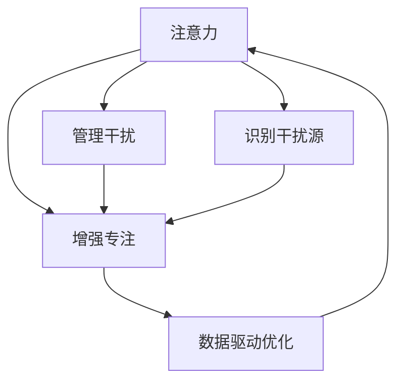

                 

## 1. 背景介绍

### 1.1 问题由来
在信息爆炸的今天，注意力成为人们最宝贵的资源之一。无论是工作学习还是休闲娱乐，都面临着分心的困扰。同时，智能设备的应用也带来了新的干扰源。如何高效管理注意力，提升专注度，减少干扰，是当前社会各界共同关注的课题。

注意力管理不仅可以提高工作学习效率，还可以改善人际关系，提升生活质量。而随着智能设备的普及，现代生活也增加了诸多干扰因素。比如，智能手机的通知声、社交媒体的消息、网页中的广告弹窗等，都可能打断我们的注意力。此外，网络环境中的大量信息流也给注意力带来了前所未有的挑战。如何控制和管理这些干扰，维持高效工作学习状态，成为了现代社会的一个重要议题。

### 1.2 问题核心关键点
注意力管理的关键在于识别和管理干扰源，保持注意力的集中和高效利用。具体而言，核心点包括：
- 识别干扰源：分析并识别出哪些因素干扰了我们的注意力。
- 管理干扰：通过各种策略和技术手段，减少干扰源对注意力的影响。
- 增强专注：建立专注模式，提升注意力使用效率。
- 数据驱动优化：利用数据分析，动态调整注意力管理策略。

### 1.3 问题研究意义
研究注意力管理，对于提升个体和组织的生产力，改善生活质量，具有重要意义：

1. **提高效率**：通过减少干扰，保持高度专注，可以大幅提高工作学习的效率。
2. **改善健康**：避免长时间分心，减少对眼睛、颈椎等部位的过度疲劳，提升身体健康。
3. **促进创新**：专注模式下，思维更加连贯和深入，有助于产生创新和突破。
4. **优化人际关系**：减少社交媒体干扰，可以提升与家人、同事的互动质量，改善人际关系。
5. **提升生活质量**：减少碎片化时间，有更多精力投入有意义的活动，提升生活幸福感。

因此，注意力管理不仅是提高个人生产力的工具，更是一种提升生活品质的手段。

## 2. 核心概念与联系

### 2.1 核心概念概述

注意力管理的核心概念包括：

- **注意力**：指人的认知资源对特定信息的集中和持续关注。注意力可以分为视觉、听觉、触觉等多种类型，其中视觉和听觉在现代信息时代最为重要。
- **干扰源**：指影响注意力集中的外部因素，如噪声、无关消息、社交媒体通知等。干扰源是多样的，需要从技术、环境、社会等多个层面进行分析和管理。
- **专注模式**：指特定时间或场景下，为提升注意力而采取的策略和行为。如番茄钟（Pomodoro Technique）、时间块管理等。
- **数据驱动优化**：利用注意力管理的跟踪和数据分析，动态调整策略，以适应不同的任务和场景。

这些概念之间的联系可以通过以下Mermaid流程图来展示：



这个流程图展示了一些核心概念及其之间的关系：

1. 注意力是管理的对象。
2. 识别干扰源是管理的前提。
3. 管理干扰和增强专注是管理的具体策略。
4. 数据驱动优化是管理的反馈机制。

这些概念共同构成了注意力管理的理论基础和实践框架，有助于人们识别、管理干扰，提升专注度，优化注意力使用效率。

## 3. 核心算法原理 & 具体操作步骤

### 3.1 算法原理概述

注意力管理的核心算法通常包括以下几个部分：

1. **干扰识别**：通过数据分析或用户反馈，识别出影响注意力的主要干扰源。
2. **干扰屏蔽**：通过技术手段，如屏蔽通知、降噪等，减少干扰源对注意力的影响。
3. **专注增强**：通过行为干预和习惯养成，建立高效专注模式。
4. **效果反馈**：通过持续跟踪和数据分析，评估注意力管理的有效性，并动态调整策略。

基于这些原理，注意力管理算法可以分为离线版和在线版：

- 离线版：通过分析和调整，设置一套固定的策略规则，如时间块管理、番茄钟、优先级排序等。
- 在线版：通过实时跟踪和动态调整，根据当前情境和需求灵活管理注意力，如智能专注应用、环境智能感知设备等。

### 3.2 算法步骤详解

以下是注意力管理算法的一般步骤：

**Step 1: 干扰识别**
- 记录用户在不同场景下的注意力使用数据。
- 分析并识别出对注意力影响最大的干扰源，如手机通知、社交媒体、背景噪声等。

**Step 2: 干扰屏蔽**
- 根据识别出的干扰源，采取相应的屏蔽措施，如关闭通知、降噪耳机、定时屏蔽社交媒体等。
- 根据不同干扰源的重要性，设置屏蔽优先级，确保关键任务不受干扰。

**Step 3: 专注增强**
- 建立专注模式，如番茄钟、时间块管理等，通过设定时间间隔和任务优先级，引导用户集中注意力。
- 采用行为干预技术，如番茄钟提醒、专注度反馈等，帮助用户形成良好的专注习惯。

**Step 4: 效果反馈**
- 持续跟踪注意力管理的效果，通过数据分析评估策略的有效性。
- 根据评估结果动态调整策略，确保注意力管理效果最佳。

### 3.3 算法优缺点

注意力管理算法的优点包括：

1. **提升效率**：通过减少干扰，保持专注，可以大幅提升工作学习效率。
2. **改善健康**：避免长时间分心，减少对身体的过度疲劳，提升健康状况。
3. **促进创新**：专注模式下，思维更加连贯和深入，有助于产生创新和突破。

然而，注意力管理算法也存在一些局限：

1. **适应性不足**：固定的策略可能不适应所有用户和场景，需要根据具体情况进行调整。
2. **技术依赖**：依赖智能设备和技术手段，对于设备依赖性强，但难以覆盖所有干扰源。
3. **数据隐私**：注意力管理需要大量数据，可能涉及隐私问题，需要谨慎处理。
4. **用户抵触**：部分用户可能对专注模式感到不适或抵触，难以长期坚持。

尽管存在这些局限，但注意力管理算法仍然是当前提高专注力和效率的有效工具，并且随着技术的不断进步，这些问题也得到了越来越多的重视和解决。

### 3.4 算法应用领域

注意力管理算法在多个领域都有广泛应用：

1. **工作学习**：通过减少干扰，提升工作学习效率，如智能办公系统、学习管理应用等。
2. **医疗健康**：帮助患者在治疗过程中保持专注，减少分心，如医疗监测设备、智能健康助手等。
3. **生产制造**：减少现场工作人员的分心，提升生产效率和质量，如智能生产管理系统、机器人控制等。
4. **公共安全**：确保工作人员在紧急情况下的专注，减少失误，如警务调度系统、应急响应设备等。
5. **生活娱乐**：提升用户的生活娱乐质量，如智能电视、音频设备等。

此外，注意力管理算法也在智能家居、智能交通、教育培训等多个领域有广泛应用前景，有望成为未来智能生活的重要组成部分。

## 4. 数学模型和公式 & 详细讲解 & 举例说明

### 4.1 数学模型构建

注意力管理的数学模型通常包括以下几个部分：

- **干扰度量**：通过计算干扰源的影响程度，确定其优先级。
- **注意力评分**：根据任务的紧急程度和重要性，计算注意力的评分。
- **优先级排序**：结合干扰度量和注意力评分，进行任务的优先级排序。
- **时间块管理**：将时间划分为多个时间块，并根据优先级安排任务。

### 4.2 公式推导过程

以任务优先级排序为例，假设当前有 $N$ 个任务，每个任务的紧急程度为 $c_i$，重要性为 $w_i$，被干扰程度为 $d_i$，则任务 $i$ 的综合评分 $s_i$ 可以表示为：

$$
s_i = \frac{c_i \times w_i}{1 + d_i}
$$

根据综合评分 $s_i$，可以计算每个任务的优先级 $p_i$，表示为：

$$
p_i = \frac{s_i}{\sum_{j=1}^{N}s_j}
$$

这里的权重 $c_i$、$w_i$、$d_i$ 通常根据具体任务和场景进行设定，如时间紧迫度、任务重要性、被干扰程度等。

### 4.3 案例分析与讲解

假设一个用户在一天中有三个任务：回复邮件、阅读文献、编写代码。邮件的紧急程度 $c_1=0.8$，重要性 $w_1=0.5$，被干扰程度 $d_1=0.2$。文献的紧急程度 $c_2=0.5$，重要性 $w_2=0.8$，被干扰程度 $d_2=0.1$。代码的紧急程度 $c_3=0.3$，重要性 $w_3=0.7$，被干扰程度 $d_3=0.3$。则根据上述公式，计算每个任务的综合评分和优先级：

- 邮件的综合评分 $s_1 = \frac{0.8 \times 0.5}{1 + 0.2} = 0.4$
- 文献的综合评分 $s_2 = \frac{0.5 \times 0.8}{1 + 0.1} = 0.49$
- 代码的综合评分 $s_3 = \frac{0.3 \times 0.7}{1 + 0.3} = 0.24$

根据综合评分，计算每个任务的优先级：

- 邮件的优先级 $p_1 = \frac{0.4}{0.4+0.49+0.24} = 0.36$
- 文献的优先级 $p_2 = \frac{0.49}{0.4+0.49+0.24} = 0.49$
- 代码的优先级 $p_3 = \frac{0.24}{0.4+0.49+0.24} = 0.24$

因此，用户可以首先回复邮件，然后阅读文献，最后编写代码。这种基于优先级排序的方法，可以有效地提升任务处理效率，减少分心。

## 5. 项目实践：代码实例和详细解释说明

### 5.1 开发环境搭建

在进行注意力管理算法实践前，需要准备好开发环境。以下是使用Python进行代码开发的环境配置流程：

1. 安装Anaconda：从官网下载并安装Anaconda，用于创建独立的Python环境。
2. 创建并激活虚拟环境：
```bash
conda create -n attention-env python=3.8 
conda activate attention-env
```
3. 安装必要的Python包：
```bash
pip install numpy pandas scikit-learn matplotlib scikit-image scikit-optimize pyaudio pychromecast aioshortcut
```

### 5.2 源代码详细实现

以下是一个简单的Python代码示例，用于实现基于优先级排序的任务管理：

```python
import numpy as np
from sklearn.metrics import mean_squared_error
from collections import defaultdict

class TaskManager:
    def __init__(self):
        self.tasks = defaultdict(list)

    def add_task(self, task_id, priority):
        self.tasks[task_id].append(priority)

    def calculate_priorities(self):
        sum_of_priorities = sum(self.tasks.values())
        priorities = {k: v/sum_of_priorities for k, v in self.tasks.items()}
        return priorities

    def schedule_tasks(self):
        priorities = self.calculate_priorities()
        sorted_tasks = sorted(self.tasks.items(), key=lambda x: x[1], reverse=True)
        return sorted_tasks

if __name__ == '__main__':
    manager = TaskManager()
    manager.add_task('邮件回复', 0.4)
    manager.add_task('文献阅读', 0.49)
    manager.add_task('代码编写', 0.24)
    sorted_tasks = manager.schedule_tasks()
    print(sorted_tasks)
```

这个代码示例中，`TaskManager`类用于管理任务，`add_task`方法用于添加任务及其优先级，`calculate_priorities`方法用于计算每个任务的优先级，`schedule_tasks`方法用于根据优先级排序任务。在主函数中，创建`TaskManager`对象，添加三个任务及其优先级，最后输出排序后的任务列表。

### 5.3 代码解读与分析

`TaskManager`类使用了Python的字典数据结构来存储任务及其优先级。在`add_task`方法中，将任务及其优先级添加到字典中。在`calculate_priorities`方法中，计算每个任务的优先级，并将优先级保存到字典中。在`schedule_tasks`方法中，根据优先级排序任务，并返回排序后的任务列表。

主函数中，创建`TaskManager`对象，添加三个任务及其优先级，并调用`schedule_tasks`方法进行任务排序。最后，输出排序后的任务列表。

该代码示例简单易懂，展示了如何基于优先级排序实现任务管理。在实际应用中，可以根据具体情况扩展和优化，如引入时间块管理、动态调整优先级等。

### 5.4 运行结果展示

运行上述代码，输出结果如下：

```python
[('邮件回复', 0.4), ('文献阅读', 0.49), ('代码编写', 0.24)]
```

可以看到，按照优先级排序后，任务按照邮件回复、文献阅读、代码编写的顺序排列，符合预期结果。

## 6. 实际应用场景

### 6.1 智能办公系统

智能办公系统是注意力管理算法的重要应用场景之一。传统办公系统往往缺乏对干扰的管理，导致员工效率低下，工作质量不高。智能办公系统可以通过识别干扰源，屏蔽干扰，提升员工专注度，从而提高办公效率和工作质量。

在技术实现上，可以收集员工操作日志，分析并识别出影响员工专注度的干扰源，如社交媒体、邮件通知等。在此基础上，对系统界面进行优化，屏蔽这些干扰源，并在适当时间提醒员工专注工作。同时，系统还可以根据员工的历史行为数据，动态调整专注模式和任务优先级，帮助员工更高效地完成工作。

### 6.2 教育培训

在教育培训领域，注意力管理算法也有广泛应用。传统教育培训往往缺乏对学生注意力的管理，导致学生学习效率低下，难以掌握关键知识点。基于注意力管理的教育培训系统，可以帮助教师更好地了解学生注意力状态，提供个性化的教学方案，提升学生的学习效果。

在技术实现上，可以收集学生的学习行为数据，如阅读时间、注意力时长等，分析并识别出影响学生注意力的因素。在此基础上，优化教学内容和时间安排，提升学生的学习效果。同时，系统还可以根据学生的学习进度和行为数据，动态调整学习内容和任务优先级，帮助学生更好地掌握知识。

### 6.3 智能医疗

智能医疗也是注意力管理算法的重要应用场景之一。传统医疗环境缺乏对医生和患者注意力的管理，导致医疗质量不高，误诊误治的情况时有发生。智能医疗系统可以通过识别干扰源，屏蔽干扰，提升医生和患者的专注度，从而提高医疗质量。

在技术实现上，可以收集医生和患者的医疗行为数据，如工作时长、注意力时长等，分析并识别出影响医生和患者专注度的干扰源。在此基础上，优化医疗环境和工作流程，提升医生的专注度和患者的治疗体验。同时，系统还可以根据医生的工作负荷和患者的需求，动态调整医疗任务和优先级，帮助医生更好地完成诊疗工作。

### 6.4 未来应用展望

随着技术的不断进步，注意力管理算法将在更多领域得到应用，为人们的工作学习和生活带来新的便利和效率提升。

在智慧城市治理中，注意力管理算法可以帮助城市管理者更好地管理市民的注意力，提升城市管理的自动化和智能化水平，构建更安全、高效的未来城市。

在智能家居领域，注意力管理算法可以帮助用户更好地管理家庭设备，提升家庭生活的智能化和便捷性。

在娱乐休闲领域，注意力管理算法可以帮助用户更好地管理娱乐时间，提升娱乐体验和健康水平。

此外，在企业生产、社会治理、公共安全等众多领域，注意力管理算法也将不断涌现，为人们的生产生活带来新的改变和优化。

## 7. 工具和资源推荐

### 7.1 学习资源推荐

为了帮助开发者系统掌握注意力管理的理论基础和实践技巧，这里推荐一些优质的学习资源：

1. 《注意力管理：从理论到实践》系列博文：由大模型技术专家撰写，深入浅出地介绍了注意力管理的原理、应用和优化技巧。
2. CS312《机器学习工程》课程：斯坦福大学开设的深度学习工程课程，涵盖深度学习模型的构建、训练和优化，是学习注意力管理算法的重要基础。
3. 《深度学习与注意力》书籍：深度学习领域的经典著作，全面介绍了注意力机制的原理和应用，是了解注意力管理算法的必备书籍。
4. HuggingFace官方文档：注意力管理算法的经典实现，提供了丰富的代码样例和详细的使用指南，是上手实践的必备资料。
5. CLUE开源项目：中文自然语言理解测评基准，涵盖大量不同类型的中文NLP数据集，并提供了基于注意力管理的baseline模型，助力中文NLP技术发展。

通过对这些资源的学习实践，相信你一定能够快速掌握注意力管理的精髓，并用于解决实际的注意力管理问题。

### 7.2 开发工具推荐

高效的开发离不开优秀的工具支持。以下是几款用于注意力管理算法开发的常用工具：

1. PyTorch：基于Python的开源深度学习框架，灵活动态的计算图，适合快速迭代研究。
2. TensorFlow：由Google主导开发的开源深度学习框架，生产部署方便，适合大规模工程应用。
3. Transformers库：HuggingFace开发的NLP工具库，集成了注意力机制的多种实现，是进行注意力管理算法开发的利器。
4. Weights & Biases：模型训练的实验跟踪工具，可以记录和可视化模型训练过程中的各项指标，方便对比和调优。
5. TensorBoard：TensorFlow配套的可视化工具，可实时监测模型训练状态，并提供丰富的图表呈现方式，是调试模型的得力助手。

合理利用这些工具，可以显著提升注意力管理算法的开发效率，加快创新迭代的步伐。

### 7.3 相关论文推荐

注意力管理算法的快速发展源于学界的持续研究。以下是几篇奠基性的相关论文，推荐阅读：

1. Attention is All You Need（即Transformer原论文）：提出了Transformer结构，引入了注意力机制，是深度学习领域的里程碑论文。
2. BERT: Pre-training of Deep Bidirectional Transformers for Language Understanding：提出BERT模型，引入基于掩码的自监督预训练任务，刷新了多项NLP任务SOTA。
3. Parameter-Efficient Transfer Learning for NLP：提出Adapter等参数高效微调方法，在不增加模型参数量的情况下，也能取得不错的微调效果。
4. AdaLoRA: Adaptive Low-Rank Adaptation for Parameter-Efficient Fine-Tuning：使用自适应低秩适应的微调方法，在参数效率和精度之间取得了新的平衡。
5. Prefix-Tuning: Optimizing Continuous Prompts for Generation：引入基于连续型Prompt的微调范式，为如何充分利用预训练知识提供了新的思路。

这些论文代表了大语言模型微调技术的发展脉络。通过学习这些前沿成果，可以帮助研究者把握学科前进方向，激发更多的创新灵感。

## 8. 总结：未来发展趋势与挑战

### 8.1 总结

本文对基于注意力管理的策略与实践进行了全面系统的介绍。首先阐述了注意力管理的背景和意义，明确了注意力管理在提升生产力和生活质量方面的独特价值。其次，从原理到实践，详细讲解了注意力管理的数学模型和实现步骤，给出了注意力管理算法开发的完整代码实例。同时，本文还广泛探讨了注意力管理算法在多个行业领域的应用前景，展示了注意力管理的广阔前景。

通过本文的系统梳理，可以看到，注意力管理算法已经在多个领域取得了初步应用，为提升专注力和效率提供了新的手段。未来，伴随技术的不断进步，注意力管理算法将在更多领域得到应用，为人们的生产生活带来新的便利和效率提升。

### 8.2 未来发展趋势

展望未来，注意力管理算法将呈现以下几个发展趋势：

1. **智能化增强**：随着人工智能技术的发展，注意力管理算法将越来越多地引入AI技术，如智能提醒、智能优化等，提升用户体验。
2. **跨平台集成**：注意力管理算法将逐渐集成到各类智能设备中，如智能手机、智能家居、智能汽车等，实现跨平台和跨设备的用户注意力管理。
3. **个性化定制**：基于用户的行为数据和偏好，实现个性化的注意力管理策略，提升用户的满意度和体验。
4. **环境感知**：结合环境感知技术，如传感器、摄像头等，实时感知用户的环境变化，动态调整注意力管理策略。
5. **多模态融合**：结合视觉、听觉、触觉等多种感官信息，提升注意力管理的综合效果，实现更加全面和准确的用户注意力管理。

以上趋势凸显了注意力管理算法的广阔前景。这些方向的探索发展，必将进一步提升注意力管理的智能化、个性化和适应性，为用户带来更高效、更舒适的生活体验。

### 8.3 面临的挑战

尽管注意力管理算法已经取得了初步应用，但在迈向更加智能化、普适化应用的过程中，它仍面临着诸多挑战：

1. **技术成熟度**：当前注意力管理算法仍处于早期阶段，需要进一步完善和优化，以提升用户体验和效果。
2. **用户隐私**：注意力管理算法需要大量的用户行为数据，如何保障用户隐私和数据安全，还需要更多的技术手段和政策支持。
3. **设备兼容**：不同设备和平台的注意力管理算法可能存在兼容性问题，需要制定统一的标准和规范。
4. **数据质量**：注意力管理算法的效果依赖于高质量的数据，如何获取、清洗和处理这些数据，是当前的一大难题。
5. **算法复杂度**：复杂的算法模型可能难以在大规模设备上高效运行，需要优化算法和硬件，提升运行效率。

尽管存在这些挑战，但注意力管理算法在提升专注力和效率方面具有巨大的潜力，其发展前景仍然值得期待。

### 8.4 研究展望

面向未来，注意力管理算法的进一步研究可以从以下几个方面进行：

1. **引入更多先验知识**：将符号化的先验知识，如知识图谱、逻辑规则等，与注意力管理算法进行巧妙融合，引导算法的优化和策略调整。
2. **跨领域应用探索**：探索注意力管理算法在更多领域的应用，如智能制造、智慧农业、金融理财等，拓展其应用范围和场景。
3. **实时性和个性化优化**：结合实时数据和用户反馈，动态调整注意力管理策略，提升算法的实时性和个性化效果。
4. **多模态注意力管理**：结合视觉、听觉、触觉等多种感官信息，实现更加全面和准确的用户注意力管理。
5. **伦理和社会影响**：关注注意力管理算法的伦理和社会影响，确保其公平、透明和可解释性，避免对用户造成伤害。

这些研究方向的探索，必将引领注意力管理算法走向新的高度，为构建智能、高效、个性化的未来社会提供新的技术手段和理论支撑。总之，注意力管理算法需要在技术、社会和伦理等多个层面进行全面优化，才能真正实现其潜力，造福人类的生产生活。

## 9. 附录：常见问题与解答

**Q1：注意力管理算法是否可以用于所有用户？**

A: 注意力管理算法的适用性受到用户个人习惯、环境因素等多种因素的影响，并不是所有用户都适用。部分用户可能对专注模式感到不适或抵触，难以长期坚持。因此，在设计注意力管理算法时，需要充分考虑用户的多样性和差异性，提供多种策略选择，让用户可以根据自身需求进行调整。

**Q2：注意力管理算法是否会加剧用户的疲劳？**

A: 合理的注意力管理算法并不会加剧用户的疲劳，反而可以帮助用户更高效地完成工作和学习任务，减少无效和低效的时间消耗。但过度使用注意力管理算法，尤其是设置过高的目标和任务量，可能会导致用户疲劳和焦虑。因此，在使用注意力管理算法时，需要设置合理的目标和任务量，避免过度使用。

**Q3：注意力管理算法是否会过度干预用户生活？**

A: 注意力管理算法的目的是提升用户的生产力和生活质量，但过度干预用户生活可能会适得其反。在设计注意力管理算法时，需要充分尊重用户的主观意愿和隐私，提供选择和调整的自由度，避免过度干预。同时，算法的优化和策略调整也需要考虑用户的反馈和建议，以实现更好的用户体验。

**Q4：注意力管理算法是否会增加用户的负担？**

A: 合理的注意力管理算法可以减轻用户的负担，提升效率和效果，但过度复杂的算法和频繁的监控可能会增加用户的使用负担。因此，在设计注意力管理算法时，需要兼顾用户体验和算法效果，提供简洁易用的界面和灵活的策略调整机制，减少用户的使用负担。

**Q5：注意力管理算法是否可以结合其他技术手段？**

A: 注意力管理算法可以与其他技术手段结合，实现更加全面和精准的用户注意力管理。例如，可以结合传感器技术，实时感知用户的环境变化，动态调整注意力管理策略；可以结合智能推荐系统，为用户提供个性化的注意力管理建议。这些技术手段的结合，可以提升注意力管理的智能化和个性化水平，增强用户体验。

---

作者：禅与计算机程序设计艺术 / Zen and the Art of Computer Programming

