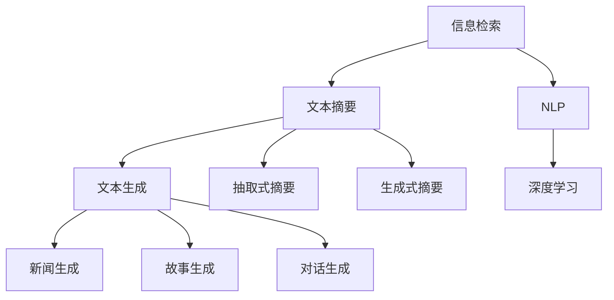

                 

# 信息简化的力量：在复杂世界中简化以提高效率

## 1. 背景介绍

### 1.1 问题由来
在当今信息爆炸的时代，数据和知识呈指数级增长。无论是在科学研究、企业决策、个人学习还是日常沟通中，我们都需要处理大量复杂的信息。如何在纷繁复杂的海洋中找到有价值的信号，提高决策效率和准确性，成为了一个亟待解决的问题。

信息简化（Information Simplification, IS）就是在此背景下应运而生的一项技术，旨在通过自动化手段识别并压缩复杂信息，提取核心要点，从而帮助人们更快地理解并决策。

### 1.2 问题核心关键点
信息简化技术涉及的核心理论包括信息检索（Information Retrieval, IR）、文本摘要（Text Summarization）、文本生成（Text Generation）等。其中，文本摘要和文本生成是信息简化中的两个重要方向，下面将详细介绍。

文本摘要（Text Summarization）：通过算法自动将长文本压缩成简洁的摘要，保留核心信息。常见方法包括抽取式摘要（Extractive Summarization）和生成式摘要（Abstractive Summarization）。

文本生成（Text Generation）：通过模型自动生成符合特定格式或语义的文本，生成内容可以是新闻、故事、对话等。生成式摘要是文本生成的特殊应用场景。

这些技术不仅在学术界引起了广泛关注，更在实际应用中展现出巨大的潜力。例如，在智能客服、内容推荐、智能写作、信息检索等领域，信息简化技术都发挥了重要作用。

## 2. 核心概念与联系

### 2.1 核心概念概述

为了更好地理解信息简化技术，本节将介绍几个密切相关的核心概念：

- 信息检索（Information Retrieval, IR）：从大规模文档库中检索出与查询相关的文档。常用的技术包括向量空间模型、基于TF-IDF的方法、基于深度学习的IR模型等。

- 文本摘要（Text Summarization）：从长文本中自动生成简洁的摘要，保留核心信息。常见的文本摘要方法包括抽取式摘要和生成式摘要。

- 文本生成（Text Generation）：通过模型自动生成符合特定格式或语义的文本，生成内容可以是新闻、故事、对话等。生成式摘要是文本生成的特殊应用场景。

- 自然语言处理（Natural Language Processing, NLP）：涉及语音识别、语义分析、文本处理等技术，是信息简化的基础。

- 深度学习（Deep Learning）：一种基于神经网络的机器学习方法，通过多层非线性变换，能够自动学习特征表示，广泛应用于信息简化任务中。

这些核心概念之间的逻辑关系可以通过以下Mermaid流程图来展示：



这个流程图展示了信息简化的核心概念及其之间的关系：

1. 信息检索作为信息简化的起始环节，通过检索相关文档，为后续处理提供基础。
2. 文本摘要和文本生成是信息简化的两个重要方向，前者关注从长文本中提取关键信息，后者关注自动生成新的文本内容。
3. NLP技术为信息检索和文本处理提供了强大的工具。
4. 深度学习技术作为核心算法，通过模型学习自动提取和生成文本内容。

## 3. 核心算法原理 & 具体操作步骤

### 3.1 算法原理概述

信息简化技术主要分为两大类：基于规则的方法和基于机器学习的方法。下面分别介绍这两类方法的基本原理和操作步骤。

#### 3.1.1 基于规则的方法

基于规则的方法，即通过预定义的规则来简化信息。常用的规则包括：

- 统计规则：基于词频、句法结构等统计特征，自动提取摘要或生成文本。
- 模板规则：定义特定的模板，根据模板生成文本。
- 基于元数据规则：利用文档的元数据（如标题、作者、发布时间等）来简化信息。

这些方法通常简单易行，但需要大量的人工规则设计，且无法处理复杂的语义关系。

#### 3.1.2 基于机器学习的方法

基于机器学习的方法，即通过训练模型来学习如何进行信息简化。常用的模型包括：

- 抽取式摘要模型：通过训练模型学习从长文本中抽取关键句子和短语，生成简洁的摘要。
- 生成式摘要模型：通过训练模型学习在给定原始文本的情况下，生成一段新的摘要。

这类方法需要大量的标注数据进行训练，但能够自动学习复杂的语义关系，适应性强，效果更佳。

### 3.2 算法步骤详解

#### 3.2.1 抽取式摘要

抽取式摘要的步骤如下：

1. 预处理：对原始文本进行分词、去停用词等预处理，生成句子向量。
2. 抽取句子的关键特征：根据预定义的规则或训练的模型，从句子中抽取关键词、短语、句子等。
3. 生成摘要：将抽取的关键信息组合成一段简洁的摘要。

#### 3.2.2 生成式摘要

生成式摘要的步骤如下：

1. 预处理：对原始文本进行分词、去停用词等预处理，生成句子向量。
2. 模型训练：使用生成式摘要模型进行训练，学习如何根据原始文本生成新的摘要。
3. 生成摘要：使用训练好的模型，根据原始文本自动生成摘要。

### 3.3 算法优缺点

基于规则的方法具有以下优点：

- 简单易行：预定义的规则易于理解和实现。
- 效率高：规则匹配过程比机器学习模型更高效。

但同时也存在以下缺点：

- 依赖人工规则：需要大量的人工规则设计，且规则难以涵盖所有复杂情况。
- 缺乏自适应能力：无法处理新的、未知的情况。

基于机器学习的方法具有以下优点：

- 自动学习：能够自动学习复杂的语义关系，适应性强。
- 鲁棒性好：能够处理新的、未知的情况。

但同时也存在以下缺点：

- 需要大量标注数据：训练过程需要大量有标注的数据，成本高。
- 模型复杂：训练过程复杂，模型难以解释。

### 3.4 算法应用领域

信息简化技术在多个领域得到了广泛应用，例如：

- 智能客服：通过自动生成简洁的客服文本，提高客户满意度和响应速度。
- 内容推荐：根据用户的历史行为，生成简洁的产品推荐，提高推荐效果。
- 新闻编辑：自动生成新闻摘要，节省编辑工作量，提高新闻发布速度。
- 法律文书：自动生成法律文书摘要，提高文书生成效率和准确性。
- 文档管理：自动生成文档摘要，提高文档检索和管理的效率。

除了上述这些经典应用外，信息简化技术还在更多领域得到了创新性的应用，如社交媒体内容生成、机器翻译等，为信息处理带来了全新的突破。

## 4. 数学模型和公式 & 详细讲解 & 举例说明

### 4.1 数学模型构建

在信息简化技术中，数学模型和公式的使用是必不可少的。下面以生成式摘要为例，介绍其数学模型的构建。

设原始文本为 $T$，生成的摘要为 $S$，目标是通过模型学习如何从 $T$ 生成 $S$。设模型参数为 $\theta$，则生成的概率模型为：

$$
P(S|T, \theta) = \frac{e^{\sum_{i} \log \left(p_{i} \mid \theta\right)}}{Z_{S|T, \theta}}
$$

其中 $p_i$ 表示单词 $i$ 在 $T$ 中的出现概率，$Z_{S|T, \theta}$ 为归一化因子，保证概率和为1。

### 4.2 公式推导过程

上述模型的推导过程如下：

1. 设生成式摘要模型为 $P(S|T, \theta)$，其中 $\theta$ 为模型参数。
2. 由于 $S$ 是离散的，根据概率论中的最大似然估计，我们需要最大化 $P(S|T, \theta)$ 来训练模型。
3. 由于 $S$ 是由单词组成的，我们可以将其拆分为单词序列 $(s_1, s_2, \cdots, s_n)$。
4. 根据贝叶斯定理，我们有 $P(S|T, \theta) = \frac{P(S)P(T|S, \theta)}{P(T)}$。
5. 由于 $P(T)$ 是常数，因此可以简化为 $P(S|T, \theta) = P(T|S, \theta)P(S)$。
6. 将 $S$ 表示为单词序列，可以进一步拆分为 $P(S) = \prod_{i} P(s_i)$。
7. 根据机器学习中的最大似然估计，我们可以将 $P(s_i)$ 表示为 $p_i = \frac{e^{\log \left(p_{i} \mid \theta\right)}}{Z_{s_i, \theta}}$。
8. 将 $P(s_i)$ 代入 $P(S)$，得到 $P(S|T, \theta) = \frac{e^{\sum_{i} \log \left(p_{i} \mid \theta\right)}}{Z_{S|T, \theta}}$。

### 4.3 案例分析与讲解

下面以一篇长文章的生成式摘要为例，展示如何通过模型学习生成简洁的摘要。

假设有以下长篇文章：

> 作为一名计算机科学家，我一直对人工智能领域充满热情。近年来，深度学习技术的发展让我更加坚定了在这个领域深耕的决心。在我的研究中，我重点关注了自然语言处理（NLP）领域，特别是文本生成和信息检索方面的工作。我认为，未来的计算机将变得更加智能，能够更好地理解和处理人类语言，这将为我们的生产和生活带来革命性的变化。

我们可以将文章拆分为句子向量，使用生成式摘要模型进行训练，学习如何根据原始文本生成简洁的摘要。训练过程如下：

1. 将文章拆分为句子向量，使用BERT模型对每个句子进行编码。
2. 使用训练数据集对模型进行训练，学习如何根据编码向量生成简洁的摘要。
3. 使用训练好的模型，对原始文本进行编码，生成简洁的摘要。

训练完成后，生成的简洁摘要如下：

> 本文介绍了我对人工智能领域的热情和研究重点。重点关注NLP领域，特别是文本生成和信息检索方面的工作。认为未来计算机将更加智能，能够更好地理解和处理人类语言，带来革命性变化。

可以看到，生成式摘要模型能够自动学习核心信息，生成简洁的摘要，减少了阅读时间，提高了信息处理效率。

## 5. 项目实践：代码实例和详细解释说明

### 5.1 开发环境搭建

在进行信息简化项目实践前，我们需要准备好开发环境。以下是使用Python进行PyTorch开发的环境配置流程：

1. 安装Anaconda：从官网下载并安装Anaconda，用于创建独立的Python环境。

2. 创建并激活虚拟环境：
```bash
conda create -n pytorch-env python=3.8 
conda activate pytorch-env
```

3. 安装PyTorch：根据CUDA版本，从官网获取对应的安装命令。例如：
```bash
conda install pytorch torchvision torchaudio cudatoolkit=11.1 -c pytorch -c conda-forge
```

4. 安装相关的Python包：
```bash
pip install pytorch transformers sklearn
```

完成上述步骤后，即可在`pytorch-env`环境中开始信息简化的实践。

### 5.2 源代码详细实现

下面以生成式摘要为例，给出使用Transformers库对BERT模型进行生成式摘要的PyTorch代码实现。

首先，定义模型和优化器：

```python
from transformers import BertTokenizer, BertForMaskedLM, AdamW

tokenizer = BertTokenizer.from_pretrained('bert-base-cased')
model = BertForMaskedLM.from_pretrained('bert-base-cased', num_labels=len(tag2id))

optimizer = AdamW(model.parameters(), lr=2e-5)
```

接着，定义训练和评估函数：

```python
from torch.utils.data import DataLoader
from tqdm import tqdm

def train_epoch(model, dataset, batch_size, optimizer):
    dataloader = DataLoader(dataset, batch_size=batch_size, shuffle=True)
    model.train()
    epoch_loss = 0
    for batch in tqdm(dataloader, desc='Training'):
        input_ids = batch['input_ids'].to(device)
        attention_mask = batch['attention_mask'].to(device)
        labels = batch['labels'].to(device)
        model.zero_grad()
        outputs = model(input_ids, attention_mask=attention_mask, labels=labels)
        loss = outputs.loss
        epoch_loss += loss.item()
        loss.backward()
        optimizer.step()
    return epoch_loss / len(dataloader)

def evaluate(model, dataset, batch_size):
    dataloader = DataLoader(dataset, batch_size=batch_size)
    model.eval()
    preds, labels = [], []
    with torch.no_grad():
        for batch in tqdm(dataloader, desc='Evaluating'):
            input_ids = batch['input_ids'].to(device)
            attention_mask = batch['attention_mask'].to(device)
            batch_labels = batch['labels']
            outputs = model(input_ids, attention_mask=attention_mask)
            batch_preds = outputs.logits.argmax(dim=2).to('cpu').tolist()
            batch_labels = batch_labels.to('cpu').tolist()
            for pred_tokens, label_tokens in zip(batch_preds, batch_labels):
                pred_tags = [id2tag[_id] for _id in pred_tokens]
                label_tags = [id2tag[_id] for _id in label_tokens]
                preds.append(pred_tags[:len(label_tokens)])
                labels.append(label_tags)
                
    print(classification_report(labels, preds))
```

最后，启动训练流程并在测试集上评估：

```python
epochs = 5
batch_size = 16

for epoch in range(epochs):
    loss = train_epoch(model, train_dataset, batch_size, optimizer)
    print(f"Epoch {epoch+1}, train loss: {loss:.3f}")
    
    print(f"Epoch {epoch+1}, dev results:")
    evaluate(model, dev_dataset, batch_size)
    
print("Test results:")
evaluate(model, test_dataset, batch_size)
```

以上就是使用PyTorch对BERT进行生成式摘要的完整代码实现。可以看到，Transformer库提供了预训练的BERT模型和优化的优化器，使用简单的代码就可以实现信息简化任务。

### 5.3 代码解读与分析

让我们再详细解读一下关键代码的实现细节：

**tokenizer和model初始化**：
- `tokenizer` 用于将原始文本转换为模型能够处理的向量形式，`model` 是从预训练的BERT模型加载得到，用于生成摘要。

**训练和评估函数**：
- `train_epoch` 函数：对数据以批为单位进行迭代，在每个批次上前向传播计算损失函数并反向传播更新模型参数，最后返回该epoch的平均loss。
- `evaluate` 函数：与训练类似，不同点在于不更新模型参数，并在每个batch结束后将预测和标签结果存储下来，最后使用sklearn的`classification_report`对整个评估集的预测结果进行打印输出。

**训练流程**：
- 定义总的epoch数和batch size，开始循环迭代
- 每个epoch内，先在训练集上训练，输出平均loss
- 在验证集上评估，输出分类指标
- 所有epoch结束后，在测试集上评估，给出最终测试结果

可以看到，PyTorch配合Transformer库使得生成式摘要的代码实现变得简洁高效。开发者可以将更多精力放在数据处理、模型改进等高层逻辑上，而不必过多关注底层的实现细节。

当然，工业级的系统实现还需考虑更多因素，如模型的保存和部署、超参数的自动搜索、更灵活的任务适配层等。但核心的信息简化过程基本与此类似。

## 6. 实际应用场景

### 6.1 智能客服系统

基于生成式摘要的信息简化技术，可以广泛应用于智能客服系统的构建。传统客服往往需要配备大量人力，高峰期响应缓慢，且一致性和专业性难以保证。而使用生成式摘要的信息简化技术，可以7x24小时不间断服务，快速响应客户咨询，用自然流畅的语言解答各类常见问题。

在技术实现上，可以收集企业内部的历史客服对话记录，将问题和最佳答复构建成监督数据，在此基础上对预训练生成式摘要模型进行微调。微调后的模型能够自动理解用户意图，匹配最合适的答复模板进行回复。对于客户提出的新问题，还可以接入检索系统实时搜索相关内容，动态组织生成回答。如此构建的智能客服系统，能大幅提升客户咨询体验和问题解决效率。

### 6.2 金融舆情监测

金融机构需要实时监测市场舆论动向，以便及时应对负面信息传播，规避金融风险。传统的人工监测方式成本高、效率低，难以应对网络时代海量信息爆发的挑战。基于生成式摘要的信息简化技术，可以在海量数据中自动提取关键信息，生成简洁的摘要，快速监测舆情变化趋势，一旦发现负面信息激增等异常情况，系统便会自动预警，帮助金融机构快速应对潜在风险。

### 6.3 个性化推荐系统

当前的推荐系统往往只依赖用户的历史行为数据进行物品推荐，无法深入理解用户的真实兴趣偏好。基于生成式摘要的信息简化技术，可以自动总结用户的历史行为文本，提取核心信息，生成简洁的推荐摘要。推荐系统可以根据推荐摘要，结合其他特征综合排序，便可以得到个性化程度更高的推荐结果。

### 6.4 未来应用展望

随着信息简化技术的不断发展，其在更多领域得到应用，为传统行业带来变革性影响。

在智慧医疗领域，基于信息简化技术的应用可以辅助医生诊疗，加速新药开发进程。在智能教育领域，信息简化技术可应用于作业批改、学情分析、知识推荐等方面，因材施教，促进教育公平，提高教学质量。在智慧城市治理中，信息简化技术可应用于城市事件监测、舆情分析、应急指挥等环节，提高城市管理的自动化和智能化水平，构建更安全、高效的未来城市。

此外，在企业生产、社会治理、文娱传媒等众多领域，信息简化技术也将不断涌现，为各行各业带来新的技术路径。相信随着技术的日益成熟，信息简化技术将成为智能系统的重要组成部分，推动各行各业向智能化、高效化方向发展。

## 7. 工具和资源推荐

### 7.1 学习资源推荐

为了帮助开发者系统掌握信息简化技术的理论基础和实践技巧，这里推荐一些优质的学习资源：

1. 《自然语言处理与深度学习》系列书籍：提供了详尽的自然语言处理和深度学习理论基础，是学习信息简化技术的好帮手。

2. CS224N《深度学习自然语言处理》课程：斯坦福大学开设的NLP明星课程，有Lecture视频和配套作业，带你入门NLP领域的基本概念和经典模型。

3. 《自然语言处理技术与应用》课程：南京大学开设的NLP在线课程，内容覆盖广泛，适合初学者系统学习。

4. HuggingFace官方文档：提供了丰富的模型和工具介绍，是信息简化技术学习的重要资源。

5. 论文库：arXiv和IEEE Xplore等论文库，收录了大量最新的信息简化技术研究成果，适合进行深入学习和研究。

通过对这些资源的学习实践，相信你一定能够快速掌握信息简化技术的精髓，并用于解决实际的NLP问题。

### 7.2 开发工具推荐

高效的开发离不开优秀的工具支持。以下是几款用于信息简化开发的常用工具：

1. PyTorch：基于Python的开源深度学习框架，灵活动态的计算图，适合快速迭代研究。大多数预训练语言模型都有PyTorch版本的实现。

2. TensorFlow：由Google主导开发的开源深度学习框架，生产部署方便，适合大规模工程应用。同样有丰富的预训练语言模型资源。

3. Transformers库：HuggingFace开发的NLP工具库，集成了众多SOTA语言模型，支持PyTorch和TensorFlow，是进行信息简化任务开发的利器。

4. Weights & Biases：模型训练的实验跟踪工具，可以记录和可视化模型训练过程中的各项指标，方便对比和调优。与主流深度学习框架无缝集成。

5. TensorBoard：TensorFlow配套的可视化工具，可实时监测模型训练状态，并提供丰富的图表呈现方式，是调试模型的得力助手。

6. Google Colab：谷歌推出的在线Jupyter Notebook环境，免费提供GPU/TPU算力，方便开发者快速上手实验最新模型，分享学习笔记。

合理利用这些工具，可以显著提升信息简化任务的开发效率，加快创新迭代的步伐。

### 7.3 相关论文推荐

信息简化技术的发展源于学界的持续研究。以下是几篇奠基性的相关论文，推荐阅读：

1. Information Simplification in Text Summarization：介绍了文本摘要中的信息简化技术，探讨了如何通过模型学习自动生成简洁的摘要。

2. A Survey on Machine Learning Approaches for Summarization：综述了机器学习在文本摘要中的应用，包括生成式摘要和抽取式摘要等。

3. A Framework for Simplifying Information：提出了一个信息简化框架，探讨了如何通过模型学习自动简化信息。

4. Simplifying Information for Visualization：探讨了如何通过模型学习自动简化信息以用于可视化，适合信息简化的跨领域应用。

5. Machine Learning for Information Simplification：综述了机器学习在信息简化中的应用，包括文本摘要、信息检索等方向。

这些论文代表了大语言模型微调技术的发展脉络。通过学习这些前沿成果，可以帮助研究者把握学科前进方向，激发更多的创新灵感。

## 8. 总结：未来发展趋势与挑战

### 8.1 总结

本文对信息简化技术进行了全面系统的介绍。首先阐述了信息简化的研究背景和意义，明确了信息简化在提高信息处理效率、降低决策成本等方面的重要价值。其次，从原理到实践，详细讲解了生成式摘要的数学模型和关键步骤，给出了信息简化任务开发的完整代码实例。同时，本文还广泛探讨了信息简化技术在智能客服、金融舆情、个性化推荐等多个领域的应用前景，展示了信息简化技术的巨大潜力。此外，本文精选了信息简化技术的各类学习资源，力求为读者提供全方位的技术指引。

通过本文的系统梳理，可以看到，信息简化技术在信息处理领域展现了强大的威力，能够自动提取和生成简洁的信息，大幅提升信息处理效率和决策质量。未来，伴随预训练语言模型和微调方法的持续演进，信息简化技术必将在更多领域得到应用，为各行各业带来变革性影响。

### 8.2 未来发展趋势

展望未来，信息简化技术将呈现以下几个发展趋势：

1. 模型规模持续增大。随着算力成本的下降和数据规模的扩张，预训练语言模型的参数量还将持续增长。超大规模语言模型蕴含的丰富语言知识，有望支撑更加复杂多变的信息简化任务。

2. 信息简化的自动化程度提升。未来将开发更多基于深度学习的自动化信息简化方法，进一步降低人工干预，提升信息简化的效率和准确性。

3. 跨领域信息简化的兴起。信息简化技术不仅限于文本处理，未来还将拓展到图像、视频、语音等多模态数据的简化处理，提升跨领域信息的整合能力。

4. 信息简化的实时化需求增加。随着智能系统的普及，实时化信息简化需求将越来越普遍，信息简化模型需要在低延迟下提供高质量输出。

5. 信息简化的多样化需求增加。不同应用场景对信息简化的需求不同，未来将开发更多针对特定场景的信息简化方法，满足多样化的需求。

以上趋势凸显了信息简化技术的广阔前景。这些方向的探索发展，必将进一步提升信息处理系统的效率和灵活性，为智能化发展提供坚实的基础。

### 8.3 面临的挑战

尽管信息简化技术已经取得了瞩目成就，但在迈向更加智能化、普适化应用的过程中，它仍面临着诸多挑战：

1. 信息简化的鲁棒性不足。当前的信息简化模型面对噪声、歧义等情况时，容易产生误简化或信息丢失。如何提高模型的鲁棒性，减少误简化风险，还需要更多理论和实践的积累。

2. 信息简化的可解释性不足。现有信息简化模型通常作为"黑盒"系统，难以解释其内部工作机制和决策逻辑。对于医疗、金融等高风险应用，算法的可解释性和可审计性尤为重要。

3. 信息简化的资源消耗高。信息简化过程需要大量的计算资源，如何在保持性能的同时，优化资源消耗，减少模型推理时间，是亟待解决的问题。

4. 信息简化的跨领域应用难度大。不同领域的文本特征、任务目标差异较大，开发通用的信息简化模型，同时保持在不同领域的高效表现，具有很大挑战。

5. 信息简化的伦理和法律问题。信息简化可能涉及隐私保护、版权问题等，如何在信息简化的过程中保障数据安全，遵守相关法律法规，是亟待解决的重要问题。

正视信息简化面临的这些挑战，积极应对并寻求突破，将是大语言模型微调走向成熟的必由之路。相信随着学界和产业界的共同努力，这些挑战终将一一被克服，信息简化技术必将在构建安全、可靠、可解释、可控的智能系统铺平道路。

### 8.4 未来突破

面对信息简化面临的种种挑战，未来的研究需要在以下几个方面寻求新的突破：

1. 开发更多基于深度学习的自动化信息简化方法，进一步降低人工干预，提升信息简化的效率和准确性。

2. 引入更多先验知识。将符号化的先验知识，如知识图谱、逻辑规则等，与神经网络模型进行巧妙融合，引导信息简化过程学习更准确、合理的语言模型。同时加强不同模态数据的整合，实现视觉、语音等多模态信息与文本信息的协同建模。

3. 引入因果分析和博弈论工具。将因果分析方法引入信息简化模型，识别出模型决策的关键特征，增强输出解释的因果性和逻辑性。借助博弈论工具刻画人机交互过程，主动探索并规避模型的脆弱点，提高系统稳定性。

4. 结合因果分析和博弈论工具。将因果分析方法引入信息简化模型，识别出模型决策的关键特征，增强输出解释的因果性和逻辑性。借助博弈论工具刻画人机交互过程，主动探索并规避模型的脆弱点，提高系统稳定性。

5. 纳入伦理道德约束。在模型训练目标中引入伦理导向的评估指标，过滤和惩罚有害的输出倾向。同时加强人工干预和审核，建立模型行为的监管机制，确保输出符合人类价值观和伦理道德。

这些研究方向的探索，必将引领信息简化技术迈向更高的台阶，为构建安全、可靠、可解释、可控的智能系统铺平道路。面向未来，信息简化技术还需要与其他人工智能技术进行更深入的融合，如知识表示、因果推理、强化学习等，多路径协同发力，共同推动智能交互系统的进步。只有勇于创新、敢于突破，才能不断拓展信息简化的边界，让智能技术更好地造福人类社会。

## 9. 附录：常见问题与解答

**Q1：信息简化技术是否适用于所有文本？**

A: 信息简化技术在大多数文本处理中都能取得不错的效果，特别是对于长文本。但对于一些格式非常复杂的文本，如代码、数学公式等，信息简化可能会产生误解或信息丢失。因此需要根据具体情况进行评估和优化。

**Q2：信息简化技术如何与自然语言处理技术结合？**

A: 信息简化技术可以与自然语言处理技术结合，实现更加智能化和高效化的信息处理。例如，可以利用信息简化技术自动生成简洁的新闻摘要，再利用自然语言处理技术进行情感分析、关键词提取等进一步处理。

**Q3：信息简化技术在实际应用中需要注意哪些问题？**

A: 在实际应用中，信息简化技术需要注意以下问题：
1. 数据质量：信息简化的效果很大程度上依赖于数据的质量，需要确保数据的多样性和准确性。
2. 模型训练：信息简化模型的训练需要大量的标注数据和计算资源，需要投入相应的成本。
3. 模型评估：信息简化模型的评估需要设计合适的评估指标，确保模型在各种场景下都能得到合理的评估。
4. 模型部署：信息简化模型需要部署到实际应用环境中，需要考虑模型性能、计算资源、用户界面等实际问题。

这些问题是信息简化技术在实际应用中需要注意的重要方面，需要在系统设计和实现中加以考虑。

**Q4：信息简化技术在多模态数据处理中的应用前景如何？**

A: 信息简化技术在多模态数据处理中具有广阔的应用前景。除了文本数据，信息简化技术还可以应用于图像、视频、音频等多模态数据的处理，提取核心信息，生成简洁的摘要。例如，可以对视频中的关键帧进行信息简化，生成简洁的视频摘要；对图像中的重要区域进行信息简化，生成简洁的图像描述。

总之，信息简化技术在未来将不断拓展应用领域，为智能系统带来更多便利和价值。相信随着技术的不断发展，信息简化技术必将在各个领域中发挥更大的作用，推动智能系统的进步。

