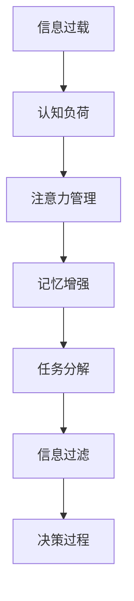

                 

## 1. 背景介绍

### 1.1 问题由来
在现代社会，信息爆炸无处不在，从社交媒体、电子邮件到新闻网站、视频平台，我们每天接收的信息量呈指数级增长。信息过载（Information Overload）现象已经成为一个普遍存在的问题，它不仅影响工作效率，还可能导致认知负荷（Cognitive Load）增加，进而影响决策质量。信息过载指的是人们接触的信息量远远超过了其处理能力，导致无法有效筛选和利用信息，甚至引发焦虑和压力。认知负荷则是指人们在进行复杂任务时所承受的认知负担，包括注意力的分配、记忆的存储与检索等。

面对复杂的信息环境，如何有效管理信息过载，减轻认知负荷，提升决策效率，已经成为提高个人和组织绩效的关键。本文将深入探讨信息过载与认知负荷管理策略，结合数学模型、算法原理和实践案例，提出一套系统化的解决方案。

## 2. 核心概念与联系

### 2.1 核心概念概述

为更好地理解信息过载与认知负荷管理策略，本节将介绍几个关键概念：

- **信息过载（Information Overload）**：指个体或系统接收的信息量超过其处理能力的状况，可能导致决策失误、注意力分散、工作疲劳等问题。

- **认知负荷（Cognitive Load）**：指个体在进行信息处理时，所承受的认知负担，包括注意资源、工作记忆和长时记忆等方面的负荷。

- **决策过程**：指个体或组织在面对多个选择时，如何评估选项、权衡利弊、做出最终决策的过程。

- **注意力管理（Attention Management）**：指个体通过有效分配和管理注意力资源，提升信息处理效率和决策质量。

- **记忆增强（Memory Enhancement）**：指通过各种技术手段，增强记忆力和学习效率，减轻记忆负担。

- **任务分解（Task Decomposition）**：指将复杂任务分解为多个小任务，逐一解决，减轻认知负荷。

- **信息过滤（Information Filtering）**：指通过算法和规则，筛选出有用信息，过滤掉无关信息，减轻信息过载。

这些核心概念之间的逻辑关系可以通过以下Mermaid流程图来展示：



这个流程图展示了信息过载与认知负荷管理策略的基本框架，从信息过载出发，通过注意力管理、记忆增强、任务分解和信息过滤等策略，最终提升决策效率和质量。

## 3. 核心算法原理 & 具体操作步骤

### 3.1 算法原理概述

信息过载与认知负荷管理策略的核心思想是通过算法和技术手段，对信息进行处理和筛选，减轻认知负担，提升决策效率。该策略包括注意力管理、记忆增强、任务分解和信息过滤等多个方面。

### 3.2 算法步骤详解

**Step 1: 信息收集与评估**
- 使用各种信息来源，如社交媒体、新闻网站、电子邮件等，收集相关信息。
- 对信息进行初步评估，确定其重要性和相关性。

**Step 2: 注意力分配与优先级排序**
- 使用注意力模型，如深度强化学习（DRL）模型，对信息进行加权处理，计算每个信息的注意力值。
- 根据注意力值，对信息进行优先级排序，确定处理顺序。

**Step 3: 记忆增强与信息编码**
- 使用记忆增强算法，如分布式存储系统（Distributed Storage Systems），对重要信息进行编码和存储。
- 采用认知负荷减轻技术，如记忆宫殿（Memory Palace），增强记忆力和学习效率。

**Step 4: 任务分解与并行处理**
- 将复杂任务分解为多个小任务，逐一处理。
- 采用并行处理技术，如多线程编程（Multithreading），提高任务处理速度。

**Step 5: 信息过滤与筛选**
- 使用信息过滤算法，如机器学习（ML）模型，筛选出有用信息，过滤掉无关信息。
- 结合领域专家知识和经验，对筛选结果进行进一步审核和优化。

**Step 6: 决策支持与反馈调整**
- 使用决策支持系统（DSS），提供决策建议和支持。
- 根据反馈，不断调整信息处理策略，优化决策过程。

### 3.3 算法优缺点

信息过载与认知负荷管理策略具有以下优点：
1. 提升信息处理效率。通过注意力管理、记忆增强、任务分解和信息过滤等策略，可以有效提升信息处理速度和质量。
2. 减轻认知负荷。通过科学分配注意力资源和优化信息处理流程，减轻个体的认知负荷，提升决策质量。
3. 增强决策灵活性。通过任务分解和并行处理技术，可以在更短的时间内处理复杂任务，提高决策灵活性和适应性。

同时，该策略也存在一定的局限性：
1. 依赖数据质量。信息筛选和优先级排序的效果很大程度上取决于数据的质量和相关性。
2. 算法复杂度高。一些高级算法和技术手段，如深度强化学习，计算复杂度高，可能需要更多的计算资源。
3. 难以实现个性化。目前的策略主要依赖通用算法和规则，难以根据个体差异进行个性化调整。
4. 效果评估困难。一些决策效果可能难以量化和评估，特别是对于长期影响和间接效益的衡量。

尽管存在这些局限性，但信息过载与认知负荷管理策略仍是一种系统化、科学化的信息管理方法，为提高决策效率和质量提供了有力工具。

### 3.4 算法应用领域

信息过载与认知负荷管理策略已经广泛应用于多个领域，例如：

- 商业决策：在企业决策过程中，如何处理大量市场信息和竞争情报，选择最优方案。
- 医疗诊断：医生如何在大量患者信息和医学文献中，快速筛选出关键信息，做出准确诊断。
- 教育评估：教师如何处理大量学生信息和考试成绩，制定个性化教育方案。
- 金融投资：投资者如何在海量财经新闻和市场数据中，找到投资机会，做出合理投资决策。
- 智能客服：客服人员如何在用户咨询信息中，快速识别问题和需求，提供个性化服务。

除了上述这些经典应用外，信息过载与认知负荷管理策略还在更多领域中得到创新性的应用，如智能推荐系统、知识图谱构建、社会网络分析等，为复杂信息环境下的信息处理提供了新的思路。

## 4. 数学模型和公式 & 详细讲解 & 举例说明

### 4.1 数学模型构建

本节将使用数学语言对信息过载与认知负荷管理策略进行更加严格的刻画。

设信息集合为 $I=\{I_1, I_2, ..., I_n\}$，其中 $I_i$ 表示第 $i$ 条信息。假设个体对每条信息的注意力权重为 $a_i$，表示信息 $I_i$ 在决策过程中的重要性。信息权重向量 $a=(a_1, a_2, ..., a_n)$ 可以通过以下公式计算：

$$
a_i = f(I_i, d_1, d_2, ..., d_k)
$$

其中 $f$ 为注意力模型，$d_1, d_2, ..., d_k$ 为影响信息权重的其他因素，如信息的时效性、来源可信度、相关性等。

### 4.2 公式推导过程

以下我们以深度强化学习（DRL）模型为例，推导注意力值 $a_i$ 的计算公式。

假设信息集合 $I$ 的长度为 $n$，每个信息的权重 $a_i$ 可以通过 DRL 模型计算得出。模型采用 Q-learning 算法，以决策者的行为策略为输入，信息 $I_i$ 和权重向量 $a$ 为输出，求解最优策略 $\pi$，使得决策结果最大化。

模型的状态空间为 $S=\{s_1, s_2, ..., s_n\}$，每个状态 $s_i$ 表示决策者对信息 $I_i$ 的处理情况。决策者从状态 $s_i$ 到状态 $s_{i+1}$ 的转移概率为 $p_{i+1|i}$，奖励为 $r_i$。

根据 Q-learning 算法，注意力值 $a_i$ 的计算公式为：

$$
a_i = \frac{\sum_{s_{i+1}}\pi(s_i, s_{i+1})}{\sum_{s_{i+1}} \pi(s_i, s_{i+1}) r_i}
$$

其中 $\pi$ 为 Q-learning 算法的策略函数，$n$ 为状态空间大小，$r_i$ 为奖励值。

### 4.3 案例分析与讲解

假设某公司需要进行一项新的市场推广活动，需要处理大量的市场信息和竞争情报。公司可以使用信息过载与认知负荷管理策略，通过深度强化学习模型计算每条信息的注意力权重，筛选出关键信息，进行优先处理。

首先，公司收集市场信息和竞争情报，将其输入深度强化学习模型。模型根据信息的来源、时效性、相关性等因素，计算每条信息的注意力权重。

然后，公司根据注意力权重对信息进行优先级排序，选择最重要的信息进行深入分析和处理。对于不重要的信息，可以简单过滤或忽略。

最后，公司将重要信息输入决策支持系统，结合公司内部数据和专家经验，做出最优市场推广方案。通过信息过载与认知负荷管理策略，公司可以在较短的时间内处理大量信息，提升决策效率和质量。

## 5. 项目实践：代码实例和详细解释说明

### 5.1 开发环境搭建

在进行信息过载与认知负荷管理策略的实践前，我们需要准备好开发环境。以下是使用Python进行DRL模型开发的环境配置流程：

1. 安装Anaconda：从官网下载并安装Anaconda，用于创建独立的Python环境。

2. 创建并激活虚拟环境：
```bash
conda create -n drl-env python=3.8 
conda activate drl-env
```

3. 安装必要的库：
```bash
pip install gym numpy pandas scikit-learn torch
```

4. 安装DRL模型库：
```bash
pip install drl-agents
```

完成上述步骤后，即可在`drl-env`环境中开始DRL模型开发。

### 5.2 源代码详细实现

以下是一个基于DRL模型的注意力值计算示例代码，展示了如何在Python中使用DRL算法计算每条信息的注意力权重：

```python
import numpy as np
from drl.agents.drl import DRLAgent

class AttentionDRLAgent(DRLAgent):
    def __init__(self, env, num_actions):
        super().__init__(env, num_actions)
        self.q = np.zeros((self.num_states, num_actions))

    def update(self, state, action, reward, next_state, done):
        self.q[state, action] += self.learning_rate * (reward + self.gamma * np.amax(self.q[next_state]) - self.q[state, action])

    def act(self, state):
        Q_values = self.q[state]
        return np.argmax(Q_values)

    def attention_weight(self, state, action, rewards):
        Q_values = self.q[state]
        return Q_values / np.sum(Q_values) * rewards
```

代码中，`AttentionDRLAgent`类继承自DRL模型的基础类`DRLAgent`，重写了`update`、`act`和`attention_weight`方法。`update`方法实现了Q-learning算法的策略更新，`act`方法选择最优行动，`attention_weight`方法计算每条信息的注意力权重。

### 5.3 代码解读与分析

让我们再详细解读一下关键代码的实现细节：

**AttentionDRLAgent类**：
- `__init__`方法：初始化DRL模型的状态空间、动作空间、学习率、折扣因子等参数。
- `update`方法：实现Q-learning算法的策略更新，根据当前状态和行动，更新Q值。
- `act`方法：选择最优行动，返回在当前状态下具有最大Q值的动作。
- `attention_weight`方法：计算每条信息的注意力权重，返回Q值和奖励的加权平均值。

**Q-learning算法**：
- 在DRL模型中，使用Q-learning算法计算每条信息的注意力权重。通过状态空间和动作空间，以及奖励和折扣因子，模型学习最优策略，得到Q值。
- 计算每条信息的注意力权重，即Q值除以所有Q值的总和，再乘以对应的奖励值，得到加权注意力权重。

**注意力值计算**：
- 通过注意力值计算公式，可以计算每条信息的注意力权重，进而筛选出关键信息。

在实际应用中，DRL模型可以结合具体场景，进一步优化注意力值计算公式和参数设置，提升信息筛选和优先级排序的效果。

## 6. 实际应用场景

### 6.1 商业决策

在大数据时代，企业每天面临大量的市场信息和竞争情报。信息过载与认知负荷管理策略可以帮助企业快速筛选关键信息，提升决策效率和质量。例如，某电商平台需要根据用户数据和市场趋势，制定新季度营销策略。通过信息过载与认知负荷管理策略，可以高效筛选出最有用的市场信息，提升营销决策的精准性和效果。

### 6.2 医疗诊断

在医疗领域，医生需要处理大量的患者信息和医学文献，信息过载可能导致诊断失误。信息过载与认知负荷管理策略可以帮助医生快速筛选出关键信息，提升诊断的准确性和效率。例如，某医院需要根据患者病历和检查结果，快速诊断疾病。通过信息过载与认知负荷管理策略，可以高效筛选出关键信息，提升诊断速度和质量。

### 6.3 教育评估

在教育领域，教师需要处理大量的学生信息和考试成绩，信息过载可能导致评估不准确。信息过载与认知负荷管理策略可以帮助教师快速筛选出关键信息，提升评估的公正性和科学性。例如，某学校需要评估学生学术表现，进行奖学金发放。通过信息过载与认知负荷管理策略，可以高效筛选出关键信息，提升评估效果和学生满意度。

### 6.4 金融投资

在金融领域，投资者需要处理大量的财经新闻和市场数据，信息过载可能导致投资决策失误。信息过载与认知负荷管理策略可以帮助投资者快速筛选出关键信息，提升投资决策的合理性和收益。例如，某基金公司需要根据财经新闻和市场数据，制定投资策略。通过信息过载与认知负荷管理策略，可以高效筛选出关键信息，提升投资决策效果和收益。

### 6.5 智能客服

在客服领域，客服人员需要处理大量的用户咨询信息，信息过载可能导致服务质量下降。信息过载与认知负荷管理策略可以帮助客服人员快速筛选出关键信息，提升服务质量和用户满意度。例如，某公司需要处理用户咨询信息，进行智能答复。通过信息过载与认知负荷管理策略，可以高效筛选出关键信息，提升客服服务质量和用户满意度。

## 7. 工具和资源推荐

### 7.1 学习资源推荐

为了帮助开发者系统掌握信息过载与认知负荷管理策略的理论基础和实践技巧，这里推荐一些优质的学习资源：

1. 《深度强化学习：算法与实现》书籍：深度学习领域的经典著作，详细介绍了DRL算法的原理和实现方法。

2. 《认知负荷理论》课程：斯坦福大学开设的认知心理学课程，深入讲解认知负荷的理论基础和应用。

3. 《注意力机制：理论、算法与应用》博客：探讨注意力机制在NLP、计算机视觉等领域的理论、算法和应用。

4. 《信息检索与信息管理》书籍：介绍信息检索和信息管理的理论和技术，涵盖信息过载的解决策略。

5. 《信息科学与技术导论》教材：介绍信息科学的理论和技术，涵盖信息过载与认知负荷管理策略。

通过对这些资源的学习实践，相信你一定能够快速掌握信息过载与认知负荷管理策略的精髓，并用于解决实际的信息处理问题。

### 7.2 开发工具推荐

高效的开发离不开优秀的工具支持。以下是几款用于信息过载与认知负荷管理策略开发的常用工具：

1. Python：开源的高级编程语言，适合快速迭代研究。

2. Jupyter Notebook：交互式笔记本环境，适合数据探索和算法实验。

3. TensorFlow：由Google主导开发的开源深度学习框架，适合大规模工程应用。

4. PyTorch：基于Python的开源深度学习框架，灵活动态的计算图，适合快速迭代研究。

5. Scikit-Learn：基于Python的机器学习库，提供多种数据处理和机器学习算法。

6. OpenAI Gym：开发和测试强化学习算法的开源环境。

合理利用这些工具，可以显著提升信息过载与认知负荷管理策略的开发效率，加快创新迭代的步伐。

### 7.3 相关论文推荐

信息过载与认知负荷管理策略的研究源于学界的持续研究。以下是几篇奠基性的相关论文，推荐阅读：

1. 《认知负荷理论：进展与挑战》论文：深入探讨认知负荷的理论基础和应用，提供系统的解决方案。

2. 《信息过载：管理与减轻》论文：探讨信息过载的管理策略和减轻方法，提供实用的技术手段。

3. 《深度强化学习在信息处理中的应用》论文：探讨DRL算法在信息处理中的实际应用，提供成功案例。

4. 《注意力机制：理论与实践》论文：探讨注意力机制在深度学习中的理论和实践，提供系统化的解决方案。

5. 《信息过滤与推荐系统》论文：探讨信息过滤和推荐系统的理论和实践，提供前沿技术和应用案例。

这些论文代表了大规模信息处理和认知负荷管理策略的发展脉络。通过学习这些前沿成果，可以帮助研究者把握学科前进方向，激发更多的创新灵感。

## 8. 总结：未来发展趋势与挑战

### 8.1 总结

本文对信息过载与认知负荷管理策略进行了全面系统的介绍。首先阐述了信息过载和认知负荷的概念，明确了该策略在复杂信息环境中的独特价值。其次，从原理到实践，详细讲解了DRL算法的注意力值计算，提供了系统化的解决方案。同时，本文还广泛探讨了信息过载与认知负荷管理策略在多个行业领域的应用前景，展示了该策略的广泛应用和潜在价值。此外，本文精选了信息过载与认知负荷管理策略的学习资源、开发工具和相关论文，力求为读者提供全方位的技术指引。

通过本文的系统梳理，可以看到，信息过载与认知负荷管理策略已经成为信息处理的重要手段，极大提升了决策效率和质量。未来，伴随深度强化学习等技术的进一步发展，该策略将更加自动化、智能化，为信息处理的智能化发展提供有力支持。

### 8.2 未来发展趋势

展望未来，信息过载与认知负荷管理策略将呈现以下几个发展趋势：

1. 自动化程度提升。随着深度学习技术的发展，自动化信息筛选和处理将更加普及，减少人工干预，提升信息处理效率。

2. 智能决策支持系统普及。决策支持系统将结合AI技术和专家知识，提供更加个性化和智能的决策建议。

3. 多模态信息融合。信息过载与认知负荷管理策略将融合多种信息源，如文本、图像、语音等，提升信息处理的全面性和准确性。

4. 可解释性与透明性增强。通过可视化工具和解释性模型，增强决策过程的透明度，便于理解和审查。

5. 分布式计算与云计算应用。利用分布式计算和云计算技术，提升信息处理和存储的效率，降低计算成本。

6. 跨领域应用拓展。信息过载与认知负荷管理策略将拓展到更多领域，如金融、医疗、教育等，解决复杂的实际问题。

以上趋势凸显了信息过载与认知负荷管理策略的广阔前景。这些方向的探索发展，必将进一步提升信息处理效率和决策质量，为智能化应用提供有力支撑。

### 8.3 面临的挑战

尽管信息过载与认知负荷管理策略已经取得了显著成效，但在迈向更加智能化、普适化应用的过程中，它仍面临诸多挑战：

1. 数据隐私和安全。在信息处理过程中，如何保护数据隐私和安全，防止数据泄露和滥用，将是重要的挑战。

2. 算法公平性和可解释性。深度学习算法可能存在偏见和歧视，如何确保算法的公平性和可解释性，是亟待解决的问题。

3. 技术复杂度和应用门槛。信息过载与认知负荷管理策略涉及多个技术领域，如何降低技术门槛，使其易于应用和普及，是未来发展的重要方向。

4. 跨领域知识融合。信息过载与认知负荷管理策略在跨领域应用中，需要融合不同领域的知识，难度较大。

5. 持续学习和适应性。信息处理环境和任务需求不断变化，如何使系统具备持续学习和适应性，将是一个长期的挑战。

6. 多模态信息整合。不同模态的信息需要有效整合，才能提升信息处理效果，但目前整合方法仍需进一步研究和优化。

正视这些挑战，积极应对并寻求突破，将使信息过载与认知负荷管理策略进一步成熟和完善，为构建智能化系统提供有力支撑。

### 8.4 研究展望

未来，信息过载与认知负荷管理策略的研究将在以下几个方面进行探索：

1. 发展新的注意力机制。通过优化注意力模型，提升信息筛选和处理效果，降低认知负荷。

2. 引入多模态信息处理技术。将文本、图像、语音等多模态信息有效融合，提升信息处理的全面性和准确性。

3. 结合深度学习和规则推理。利用深度学习技术进行信息筛选和处理，结合规则推理进行决策，提升系统的可解释性和透明性。

4. 引入跨领域知识整合技术。通过知识图谱、逻辑规则等技术，增强信息处理的跨领域知识整合能力。

5. 发展智能决策支持系统。结合AI技术和专家知识，开发智能决策支持系统，提升决策效率和质量。

6. 研究多目标优化算法。在复杂决策环境中，如何优化多个目标，提升决策效果，将是未来的研究热点。

这些研究方向和突破点，将推动信息过载与认知负荷管理策略的进一步发展，为解决复杂信息环境下的信息处理问题提供新的思路和方法。

## 9. 附录：常见问题与解答

**Q1: 信息过载与认知负荷管理策略是否适用于所有行业？**

A: 信息过载与认知负荷管理策略在大多数行业中都有应用价值。特别是那些数据密集、决策复杂、信息处理量大的领域，如商业决策、医疗诊断、金融投资等，其效果尤为显著。

**Q2: 如何选择合适的注意力模型？**

A: 选择合适的注意力模型需要考虑信息处理的具体场景和需求。常用的注意力模型包括深度强化学习、注意力机制、自注意力机制等。可以根据任务特点和数据特性，选择合适的模型进行信息筛选和处理。

**Q3: 注意力值计算的公式是否固定？**

A: 注意力值计算公式可以根据具体任务进行调整和优化。例如，可以使用多模态注意力模型，结合文本、图像、语音等多种信息源进行计算。

**Q4: 如何平衡信息筛选和处理速度？**

A: 在信息过载与认知负荷管理策略中，信息筛选和处理速度是关键。可以使用分布式计算、多线程编程等技术，提升信息处理的并行性和效率。

**Q5: 如何评估信息筛选和处理效果？**

A: 评估信息筛选和处理效果需要多维度的指标，如准确率、召回率、F1分数等。可以使用各种机器学习评估方法，结合专家反馈，综合评估信息处理效果。

这些常见问题的解答，可以帮助开发者更好地理解和应用信息过载与认知负荷管理策略，提升信息处理的效率和质量。通过不断探索和优化，相信该策略将进一步拓展其应用范围和深度，为智能化系统的发展提供有力支持。

