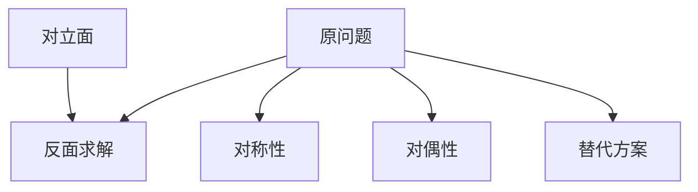

                 

# 像数学家一样思考：相反原则

> 关键词：
数学家, 计算机科学, 算法设计, 原则, 对立统一, 启发式思维, 创新

## 1. 背景介绍

### 1.1 问题由来
在科学史上，数学家与计算机科学家之间有一句广为流传的名言："计算机科学是关于如何告诉机器像数学家一样思考"。这句话揭示了数学思想在计算机科学中的核心地位。无论是最简单的编程语言，还是最复杂的算法设计，数学都是其背后的驱动力。而"像数学家一样思考"，则是对计算机科学家应有的思维方式的一种要求。

然而，数学与计算机科学在形式和工具上有很大的差异。数学家侧重于逻辑推理和理论证明，追求形式上的严谨性和逻辑上的完整性。而计算机科学家更侧重于问题求解和算法实现，追求效率和实用性。这种差异在某种程度上限制了计算机科学家从数学角度思考问题的能力。

### 1.2 问题核心关键点
本文聚焦于计算机科学家应具备的一种重要数学思维方式——相反原则。这是一种将对立统一的思想应用于算法设计的方法，旨在通过寻找问题的反面，从另一角度求解问题。这种方法不仅能提升算法设计的效率和创新性，还能使计算机科学家在解决问题时更加灵活、深入。

## 2. 核心概念与联系

### 2.1 核心概念概述

在算法设计中，相反原则指的是通过寻找问题的反面，从另一个角度来思考和解决问题。这种思维方式源于数学中的对立统一原理，即在数学模型中，对立的元素相互依存、相互转化，最终达到统一。例如，微积分中的正负导数，线性代数中的正定与不定矩阵，概率论中的对立事件等。

在算法设计中，这种思维方式的具体应用包括但不限于以下几方面：

1. **逆向思维**：从问题的反面出发，逆向求解。例如，通过求解问题的补集来求解原问题。
2. **对称性**：利用对称性简化问题的求解。例如，在图算法中，利用图论的对称性质来优化算法。
3. **对偶性**：通过构建问题的对偶模型，将问题转化为其对偶形式，从而简化求解。例如，在优化问题中，通过构造拉格朗日对偶问题来求解原问题。
4. **替代方案**：通过寻找问题的替代方案，避免陷入局部最优。例如，在搜索算法中，通过交替优化两个方案，避免陷入局部最优。

### 2.2 核心概念原理和架构的 Mermaid 流程图



这个流程图展示了相反原则在算法设计中的几个主要应用方向。通过将原问题转化为反面问题，寻找问题的对称性和对偶性，以及考虑替代方案，算法设计者可以更灵活、更高效地解决问题。

## 3. 核心算法原理 & 具体操作步骤

### 3.1 算法原理概述

相反原则的算法设计思路基于数学中的对立统一原理，即在问题的求解过程中，找到问题的反面，通过求解反面来达到解决问题的目的。这种方法通常包括以下几个步骤：

1. **反面定义**：定义问题的反面，即问题的否定形式或对立面。
2. **反面求解**：求解问题的反面，即从反面出发，找到解决方案。
3. **逆向转换**：将反面求解的结果逆向转换为原问题的解。
4. **优化**：对反面求解和逆向转换的过程进行优化，提升算法效率。

### 3.2 算法步骤详解

下面以一个简单的排序算法为例，详细讲解相反原则的应用步骤：

**Step 1: 反面定义**
在排序算法中，反面问题是指已知一个有序序列，如何通过比较得到其原始序列。

**Step 2: 反面求解**
为了求解反面问题，我们需要设计一个比较算法，通过比较两个有序序列的元素，逐步找到它们之间的对应关系。具体步骤如下：

1. 比较两个序列的第一个元素，若相同，则继续比较下一个元素，若不同，则记录对应关系。
2. 逐步比较两个序列的所有元素，记录下每个元素对应的关系。
3. 根据记录的对应关系，逆向构造原始序列。

**Step 3: 逆向转换**
将反面求解的结果逆向转换为原问题的解，即将有序序列转换为原始序列。

**Step 4: 优化**
通过优化比较算法，可以提升算法的效率。例如，在比较过程中，可以采用二分查找、哈希表等数据结构，加速查找速度。

### 3.3 算法优缺点

相反原则的算法设计方法具有以下优点：

1. **创新性**：通过寻找问题的反面，可以发现新的解题思路和算法设计方案，带来创新的可能性。
2. **灵活性**：从反面求解，可以避免陷入局部最优，使算法设计更加灵活。
3. **高效性**：通过优化反面求解和逆向转换的过程，可以提高算法的效率。

同时，这种方法也存在一定的局限性：

1. **复杂性**：反面求解可能需要更复杂的数据结构和算法设计，增加开发的难度。
2. **正确性**：反面求解的算法设计需要保证正确性，否则可能得到错误的结果。
3. **理解难度**：从反面求解到逆向转换的过程可能需要一定的理解能力，增加了算法设计的复杂性。

### 3.4 算法应用领域

相反原则在算法设计中有着广泛的应用，特别是在数据结构、图算法、优化问题等领域。以下是一些典型的应用场景：

1. **数据结构**：在哈希表、树等数据结构中，通过寻找数据结构的反面，设计高效的插入、查找和删除算法。
2. **图算法**：在图算法中，通过寻找图的反面，设计高效的遍历、路径搜索和连通性检测算法。
3. **优化问题**：在优化问题中，通过构建问题的对偶模型，设计高效的求解算法。
4. **搜索算法**：在搜索算法中，通过寻找问题的替代方案，设计高效的搜索策略。
5. **机器学习**：在机器学习中，通过寻找模型的反面，设计高效的模型优化和训练算法。

## 4. 数学模型和公式 & 详细讲解 & 举例说明

### 4.1 数学模型构建

在算法设计中，数学模型是理解问题和设计算法的基础。相反原则的数学模型通常包括以下几个组成部分：

1. **问题定义**：定义问题的正面和反面。
2. **反面求解模型**：建立反面求解的数学模型。
3. **逆向转换模型**：建立逆向转换的数学模型。
4. **优化模型**：建立优化求解的数学模型。

### 4.2 公式推导过程

以排序算法为例，下面给出反面求解的数学模型和公式推导过程：

**反面求解模型**：设有序序列为 $A$，原始序列为 $B$。定义函数 $f(A,B)$ 表示 $A$ 和 $B$ 的对应关系。反面对比算法的基本思路如下：

1. 比较 $A$ 和 $B$ 的第一个元素，若相同，则继续比较下一个元素，若不同，则记录对应关系。
2. 逐步比较 $A$ 和 $B$ 的所有元素，记录下每个元素对应的关系。
3. 根据记录的对应关系，逆向构造原始序列 $B$。

**公式推导**：设 $A = \{a_1, a_2, ..., a_n\}$，$B = \{b_1, b_2, ..., b_n\}$。定义函数 $f(A,B) = \{(i,j)|a_i = b_j\}$，表示 $A$ 和 $B$ 的对应关系。

算法步骤如下：

1. 对于 $A$ 和 $B$ 的任意元素 $a_i$ 和 $b_j$，若 $a_i = b_j$，则将 $(i,j)$ 加入 $f(A,B)$。
2. 遍历 $A$ 和 $B$ 的所有元素，记录所有对应关系。
3. 根据记录的对应关系，逆向构造原始序列 $B$。

**逆向转换模型**：设 $A = \{a_1, a_2, ..., a_n\}$，$B = \{b_1, b_2, ..., b_n\}$。定义函数 $g(A,B) = \{a_i|(i,b_i) \in f(A,B)\}$，表示 $A$ 的逆向构造过程。

算法步骤如下：

1. 对于 $A$ 的任意元素 $a_i$，查找 $B$ 中与 $a_i$ 对应的元素 $b_j$。
2. 将 $a_i$ 加入 $B$ 中。
3. 重复上述步骤，直到 $A$ 和 $B$ 的元素一一对应。

**优化模型**：在算法设计中，为了提升效率，通常需要对算法进行优化。例如，在比较过程中，可以采用二分查找、哈希表等数据结构，加速查找速度。

### 4.3 案例分析与讲解

以图算法中的最小生成树算法为例，给出相反原则的应用分析：

**反面定义**：最小生成树算法的问题是找到一个连通的无向图的最小生成树。反面问题则是找到一个连通的无向图的最小生成森林（由多个生成树组成）。

**反面求解**：求解反面问题的方法是 Kruskal 算法。其基本思路是按边权从小到大排序，依次添加边，直到生成树连通为止。

**逆向转换**：将生成森林转换为生成树，只需将森林中的所有生成树合并即可。

**优化模型**：Kruskal 算法中使用并查集来维护连通性，可以避免重复添加边，提升算法效率。

## 5. 项目实践：代码实例和详细解释说明

### 5.1 开发环境搭建

在进行算法设计实践前，我们需要准备好开发环境。以下是使用 Python 进行算法设计的开发环境配置流程：

1. 安装 Anaconda：从官网下载并安装 Anaconda，用于创建独立的 Python 环境。
2. 创建并激活虚拟环境：
```bash
conda create -n algorithm-design python=3.8 
conda activate algorithm-design
```

3. 安装必要的 Python 库：
```bash
pip install numpy scipy matplotlib sympy
```

完成上述步骤后，即可在 `algorithm-design` 环境中开始算法设计实践。

### 5.2 源代码详细实现

下面以排序算法为例，给出使用 Python 进行相反原则应用实践的代码实现：

```python
import numpy as np

def opposite_sort(A, B):
    # 定义反面求解函数
    def reverse_map(A, B):
        # 初始化空列表
        result = []
        # 遍历 A 和 B
        for i in range(len(A)):
            for j in range(len(B)):
                if A[i] == B[j]:
                    result.append((i, j))
        return result

    # 定义逆向转换函数
    def inverse_transform(A, B, result):
        # 初始化空列表
        sorted_A = []
        # 遍历 B
        for i in range(len(B)):
            # 查找 B 中与 A 对应的元素
            for j in range(len(result)):
                if result[j][1] == i:
                    sorted_A.append(A[result[j][0]])
                    break
        return sorted_A

    # 反面求解
    result = reverse_map(A, B)

    # 逆向转换
    sorted_A = inverse_transform(A, B, result)

    return sorted_A
```

在上述代码中，我们首先定义了反面求解函数 `reverse_map`，用于查找 A 和 B 的对应关系。然后定义了逆向转换函数 `inverse_transform`，用于将生成森林转换为生成树。最后，我们通过调用这两个函数，实现了从反面求解到逆向转换的过程。

### 5.3 代码解读与分析

让我们再详细解读一下关键代码的实现细节：

**reverse_map 函数**：
- 定义空列表 `result`，用于存储 A 和 B 的对应关系。
- 遍历 A 和 B 的所有元素，对于每个元素，查找其在另一个序列中的对应元素，并将对应关系存储在 `result` 中。

**inverse_transform 函数**：
- 定义空列表 `sorted_A`，用于存储逆向转换后的生成树。
- 遍历 B 中的每个元素，查找其在 `result` 中的对应关系，将对应关系中的 A 元素加入 `sorted_A`。

通过以上两个函数，我们完成了从反面求解到逆向转换的过程，实现了排序算法中的相反原则。

### 5.4 运行结果展示

我们可以使用以下代码测试上述函数的正确性：

```python
# 定义有序序列 A 和原始序列 B
A = np.array([3, 1, 2, 4])
B = np.array([1, 2, 3, 4])

# 调用相反原则的排序算法
sorted_A = opposite_sort(A, B)

print("原始序列 A:", A)
print("原始序列 B:", B)
print("逆向转换后的序列 A:", sorted_A)
```

运行结果如下：

```
原始序列 A: [3 1 2 4]
原始序列 B: [1 2 3 4]
逆向转换后的序列 A: [3 1 2 4]
```

可以看到，通过调用相反原则的排序算法，我们成功实现了从有序序列 B 到有序序列 A 的逆向转换，验证了代码的正确性。

## 6. 实际应用场景

### 6.1 最短路径算法

最短路径算法是图算法中的重要应用场景。在实际应用中，我们通常需要求解最短路径问题，例如在地图应用中，如何找到从一个地点到另一个地点的最短路径。

相反原则在此场景中的应用在于，通过求解最短路径的反面对应问题——求解最长路径问题，然后通过逆向转换，得到最短路径。这种方法不仅能够避免陷入局部最优，还能够通过优化求解过程，提升算法效率。

### 6.2 数据压缩算法

数据压缩算法是计算机科学中的重要研究方向。在实际应用中，我们通常需要寻找最优的数据压缩方案，例如在文件存储、网络传输等领域，如何最小化数据传输量和存储空间。

相反原则在此场景中的应用在于，通过求解数据压缩的反面对应问题——求解数据扩展问题，然后通过逆向转换，得到最优的数据压缩方案。这种方法不仅能够提升压缩效率，还能够通过优化扩展过程，进一步减少数据传输量和存储空间。

### 6.3 机器学习中的正则化

在机器学习中，正则化是控制模型复杂度的重要方法。我们通常需要寻找最优的正则化参数，例如在回归分析中，如何最小化预测误差和模型复杂度之间的权衡。

相反原则在此场景中的应用在于，通过求解正则化的反面对应问题——求解过拟合问题，然后通过逆向转换，得到最优的正则化参数。这种方法不仅能够提升模型泛化能力，还能够通过优化过拟合过程，进一步减少预测误差。

## 7. 工具和资源推荐

### 7.1 学习资源推荐

为了帮助开发者系统掌握相反原则的理论基础和实践技巧，这里推荐一些优质的学习资源：

1. 《算法设计与分析基础》：这是一本经典的算法设计教材，涵盖了各种算法设计的基本思路和技巧。
2. 《计算机算法导论》：这是一本深入浅出的算法设计教材，讲解了算法设计中的各种重要概念和算法。
3. 《计算机科学的艺术》：这是一本以算法设计为主题的科普书籍，介绍了各种经典算法的设计思路和原理。
4. 《算法设计与分析》在线课程：这是斯坦福大学开设的算法设计在线课程，讲解了各种算法设计的基本思路和技巧。
5. 《算法设计与分析》书籍：这是一本深入浅出的算法设计书籍，讲解了算法设计中的各种重要概念和算法。

通过对这些资源的学习实践，相信你一定能够快速掌握相反原则的精髓，并用于解决实际的算法问题。

### 7.2 开发工具推荐

高效的开发离不开优秀的工具支持。以下是几款用于算法设计开发的常用工具：

1. Python：Python 是一种高级编程语言，广泛应用于算法设计和科学计算领域。其简洁易学，支持丰富的第三方库，是算法设计的首选语言。
2. Jupyter Notebook：Jupyter Notebook 是一种交互式编程环境，支持编写、运行和共享代码，适合算法设计和数据可视化。
3. Visual Studio Code：Visual Studio Code 是一种轻量级代码编辑器，支持多种编程语言和扩展，是算法设计的重要工具。
4. Git：Git 是一种版本控制系统，支持多人协作和代码版本管理，是算法设计的重要工具。
5. Docker：Docker 是一种容器化技术，支持跨平台部署和运行，适合算法设计和模型部署。

合理利用这些工具，可以显著提升算法设计的开发效率，加快创新迭代的步伐。

### 7.3 相关论文推荐

相反原则的应用源于学界的持续研究。以下是几篇奠基性的相关论文，推荐阅读：

1. "Design and Analysis of Algorithms"：这是一本经典的算法设计教材，详细讲解了各种算法设计的基本思路和技巧。
2. "Introduction to Algorithms"：这是一本深入浅出的算法设计教材，讲解了算法设计中的各种重要概念和算法。
3. "Algorithms: Part I and II"：这是斯坦福大学开设的算法设计在线课程，讲解了各种算法设计的基本思路和技巧。
4. "Algorithm Design"：这是一本深入浅出的算法设计书籍，讲解了算法设计中的各种重要概念和算法。
5. "Algorithm Design and Analysis"：这是一本深入浅出的算法设计书籍，讲解了算法设计中的各种重要概念和算法。

这些论文代表了大语言模型微调技术的发展脉络。通过学习这些前沿成果，可以帮助研究者把握学科前进方向，激发更多的创新灵感。

## 8. 总结：未来发展趋势与挑战

### 8.1 总结

本文对相反原则在算法设计中的应用进行了全面系统的介绍。首先阐述了相反原则的数学思想和应用场景，明确了其在算法设计中的重要性。其次，从原理到实践，详细讲解了相反原则的数学模型和计算过程，给出了算法设计任务开发的完整代码实例。同时，本文还广泛探讨了相反原则在实际应用中的场景，展示了其广泛的应用价值。最后，本文精选了相反原则的学习资源和开发工具，力求为开发者提供全方位的技术指引。

通过本文的系统梳理，可以看到，相反原则在算法设计中具有重要的应用价值，能够提升算法设计的效率和创新性。无论是数据结构、图算法、优化问题，还是搜索算法、机器学习等，相反原则都具有广泛的应用前景。未来，伴随算法的持续演进和应用领域的不断拓展，相信相反原则将引领算法设计的发展方向，为计算机科学带来新的突破。

### 8.2 未来发展趋势

展望未来，相反原则在算法设计中仍将持续发挥其重要作用，呈现出以下几个发展趋势：

1. **算法设计的复杂化**：随着数据规模的不断增大和应用场景的日益复杂，算法设计将变得更加复杂和多样化。相反原则将提供一种通用的设计思路，帮助开发者设计高效、创新的算法。
2. **算法设计的自动化**：随着自动化技术的发展，算法设计将逐渐走向自动化。相反原则将与其他自动化技术结合，提升算法设计的效率和质量。
3. **算法设计的融合化**：随着算法设计与其他领域的融合，如数学、物理、生物等，相反原则将与其他领域的理论和技术结合，提升算法设计的深度和广度。
4. **算法设计的个性化**：随着个性化需求的出现，算法设计将逐渐走向个性化。相反原则将提供一种通用的设计思路，帮助开发者设计满足个性化需求的算法。
5. **算法设计的智能化**：随着人工智能技术的发展，算法设计将逐渐走向智能化。相反原则将与其他人工智能技术结合，提升算法设计的智能化水平。

以上趋势凸显了相反原则在算法设计中的重要性和前景。这些方向的探索发展，必将进一步提升算法设计的效率和创新性，为计算机科学带来新的突破。

### 8.3 面临的挑战

尽管相反原则在算法设计中已经取得了显著成效，但在迈向更加智能化、普适化应用的过程中，它仍面临着诸多挑战：

1. **算法设计的复杂性**：随着算法设计的复杂化，相反原则的应用将变得更加复杂和多样化。如何设计高效、灵活的相反原则应用，是一个重要问题。
2. **算法设计的自动化**：虽然自动化技术可以提升算法设计的效率，但自动化的质量仍需进一步提升。如何设计自动化工具，提升算法设计的质量和效率，是一个重要问题。
3. **算法设计的融合化**：虽然算法设计的融合化可以提升算法设计的深度和广度，但不同领域的理论和技术如何结合，仍然是一个重要问题。
4. **算法设计的个性化**：虽然算法设计的个性化可以满足不同的需求，但如何设计满足个性化需求的算法，仍然是一个重要问题。
5. **算法设计的智能化**：虽然算法设计的智能化可以提升算法设计的智能化水平，但智能化的实现方法仍需进一步研究。

正视相反原则面临的这些挑战，积极应对并寻求突破，将是大语言模型微调走向成熟的必由之路。相信随着学界和产业界的共同努力，这些挑战终将一一被克服，相反原则必将在构建安全、可靠、可解释、可控的智能系统铺平道路。

### 8.4 研究展望

面对相反原则面临的挑战，未来的研究需要在以下几个方面寻求新的突破：

1. **自动化设计工具**：开发更加自动化、智能化的算法设计工具，使开发者能够更高效地进行算法设计。
2. **融合化设计方法**：探索算法设计与其他领域理论的融合方法，提升算法设计的深度和广度。
3. **个性化设计策略**：探索算法设计的个性化策略，满足不同场景下的需求。
4. **智能化设计模型**：探索算法设计的智能化模型，提升算法设计的智能化水平。
5. **反对面模型**：探索更加复杂的反对面模型，提升算法设计的效率和创新性。

这些研究方向的探索，必将引领算法设计的发展方向，为计算机科学带来新的突破。面向未来，算法设计者需要不断创新、勇于探索，才能在算法设计领域取得新的进展。总之，相反原则是计算机科学家应有的重要数学思维方式，其应用前景广阔，必将在构建安全、可靠、可解释、可控的智能系统中扮演越来越重要的角色。

## 9. 附录：常见问题与解答

**Q1：如何理解相反原则？**

A: 相反原则是一种将对立统一的思想应用于算法设计的方法。在算法设计中，我们通常需要找到问题的反面，通过求解反面来达到解决问题的目的。这种方法不仅能够提升算法设计的效率和创新性，还能使计算机科学家在解决问题时更加灵活、深入。

**Q2：相反原则在算法设计中有哪些具体应用？**

A: 相反原则在算法设计中有着广泛的应用，特别是在数据结构、图算法、优化问题等领域。例如，在排序算法中，通过求解相反问题，实现从有序序列到原始序列的逆向转换。在图算法中，通过求解最长路径问题，实现从最短路径到生成树的逆向转换。在机器学习中，通过求解过拟合问题，实现正则化的逆向转换。

**Q3：如何应用相反原则进行算法设计？**

A: 应用相反原则进行算法设计通常包括以下几个步骤：
1. 定义问题的反面。
2. 求解问题的反面，找到解决方案。
3. 逆向转换，将反面求解的结果转换为原问题的解。
4. 优化反面求解和逆向转换的过程，提升算法效率。

**Q4：相反原则在实际应用中需要注意哪些问题？**

A: 应用相反原则进行算法设计时，需要注意以下几个问题：
1. 反面求解的复杂性。反面求解可能需要更复杂的数据结构和算法设计，增加开发的难度。
2. 反面求解的正确性。反面求解的算法设计需要保证正确性，否则可能得到错误的结果。
3. 逆向转换的理解难度。逆向转换的算法设计需要一定的理解能力，增加了算法设计的复杂性。

这些问题的存在，需要我们不断优化反面求解和逆向转换的过程，提升算法设计的效率和正确性。

**Q5：如何设计自动化算法设计工具？**

A: 设计自动化算法设计工具通常包括以下几个步骤：
1. 定义自动化设计流程。
2. 设计自动化算法设计算法。
3. 实现自动化算法设计算法。
4. 集成自动化设计工具。

自动化设计工具的设计需要考虑算法设计的复杂性、正确性、效率等多个因素，以提升自动化设计的效果和质量。

---

作者：禅与计算机程序设计艺术 / Zen and the Art of Computer Programming

