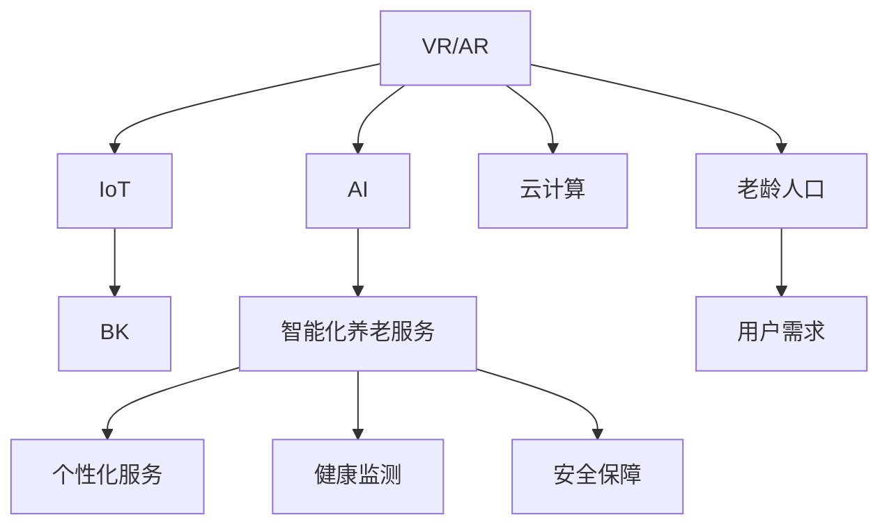

                 

# 元宇宙养老：数字化照护的创新模式

## 1. 背景介绍

在科技迅猛发展的今天，人类正加速迈向数字时代。随着互联网、人工智能、虚拟现实等技术的发展，“元宇宙”的概念被不断提及。元宇宙不仅代表了一种全新的互联网生态，更预示着未来生活方式的巨大变革。在“元宇宙”浪潮中，“养老”成为一个重要而又亟待探索的领域。数字化、智能化养老照护模式的创新，将成为未来养老行业的关键突破点。

### 1.1 元宇宙养老的概念和价值
元宇宙养老是一种基于虚拟现实、增强现实、人工智能等前沿技术，将数字化、智能化手段与传统养老服务深度融合的新型养老模式。通过创建虚拟养老社区、智能养老机器人、数字健康监控等技术，实现养老服务的精细化、个性化和高效化。

元宇宙养老不仅能够提升老年人的生活质量，还能缓解养老护理人员不足的现状，为养老行业带来新的商业机遇。同时，元宇宙养老的实现，也体现了对老年人的人文关怀和技术创新。

### 1.2 我国老龄化现状及需求
根据《中国统计年鉴》数据显示，截至2021年，我国60岁以上老年人口达到2.67亿，占总人口的18.9%，并且每年以2%的速度增长。老龄化社会带来了养老服务需求的大幅增加，而传统的养老照护模式在服务质量、资源配置等方面存在诸多不足。如何提供高效、便捷、人性化的养老服务，成为养老行业亟需解决的问题。

## 2. 核心概念与联系

### 2.1 核心概念概述

在元宇宙养老的架构中，涉及多个关键概念，包括但不限于：

- **虚拟现实(VR)与增强现实(AR)**：通过虚拟和增强现实技术，为老年人提供沉浸式的养老环境和互动体验。
- **人工智能(AI)**：利用机器学习、自然语言处理、计算机视觉等AI技术，实现养老服务的智能化、自动化。
- **物联网(IoT)**：通过传感器、智能设备等物联网技术，实现老年人的健康监测和日常照护。
- **区块链(BK)**：利用区块链技术，保障老年人数据隐私和安全。
- **云计算**：为养老服务的数字化和智能化提供必要的计算和存储能力。

这些核心概念通过技术栈的衔接，共同构成了元宇宙养老的实现基础。

### 2.2 核心概念原理和架构的 Mermaid 流程图



上述图表展示了一个元宇宙养老系统的基本架构。其中，虚拟现实和增强现实技术为老年人提供沉浸式的体验；人工智能技术实现养老服务的智能化；物联网技术实现老年人的健康监测和日常照护；区块链技术保障老年人的数据隐私；云计算提供计算和存储支持。

## 3. 核心算法原理 & 具体操作步骤

### 3.1 算法原理概述

元宇宙养老的核心算法原理基于虚拟现实与增强现实技术，将养老服务与数字化、智能化相结合，实现养老服务的精细化、个性化和高效化。

- **虚拟现实(VR)**：通过3D建模、交互设计等技术，为老年人提供一个沉浸式的养老环境，如虚拟养老院、虚拟医院等。
- **增强现实(AR)**：在现实养老环境中，通过AR技术实现虚拟信息与真实环境的融合，如虚拟导视、虚拟助手等。
- **自然语言处理(NLP)**：实现老年人与AI系统之间的自然语言交互，如智能对话、语音识别等。
- **机器学习(ML)**：通过学习老年人行为模式，优化养老服务流程，提升服务质量。

### 3.2 算法步骤详解

元宇宙养老系统的构建过程包括以下关键步骤：

1. **数据收集与预处理**：收集老年人的健康数据、行为数据、位置数据等，进行清洗、去噪和归一化处理。
2. **环境建模与渲染**：利用3D建模和渲染技术，创建虚拟养老环境，如虚拟养老院、虚拟医院等。
3. **交互设计**：设计老年人与虚拟环境的交互方式，如虚拟导视、虚拟助手等。
4. **AI系统开发**：基于NLP和ML技术，开发智能养老机器人、虚拟助手等AI系统。
5. **系统集成与测试**：将VR、AR、AI等系统进行集成，进行系统测试和优化。
6. **部署与迭代**：将系统部署到实际养老环境中，根据反馈进行迭代优化。

### 3.3 算法优缺点

元宇宙养老系统的优点包括：

- **沉浸式体验**：通过虚拟现实技术，老年人可以在虚拟环境中获得沉浸式的养老体验。
- **智能化服务**：AI技术实现养老服务的智能化、自动化，提升服务效率。
- **个性化定制**：通过学习老年人的行为模式和偏好，实现个性化的养老服务。

同时，该系统也存在一些缺点：

- **技术成本高**：元宇宙养老系统涉及多种前沿技术，初期建设成本较高。
- **依赖技术基础设施**：系统运行需要高性能的计算机、稳定的网络环境等基础设施支持。
- **隐私和安全问题**：老年人数据的隐私保护和系统安全保障需要特别注意。

### 3.4 算法应用领域

元宇宙养老系统在多个领域具有广泛的应用前景，包括但不限于：

- **虚拟养老院**：通过虚拟现实技术，为老年人提供一个虚拟的养老环境，减少孤独感，提升生活质量。
- **虚拟医院**：通过增强现实技术，为老年人提供虚拟导视、虚拟医生等医疗服务，提升医疗效率。
- **智能养老机器人**：利用AI技术，开发智能养老机器人，实现日常照护、陪伴、娱乐等功能。
- **数字化健康监测**：通过物联网技术，实现老年人的健康监测和数据收集，为老年人提供健康管理服务。
- **安全保障**：利用区块链技术，保障老年人的数据隐私和安全，防止数据泄露和滥用。

## 4. 数学模型和公式 & 详细讲解 & 举例说明

### 4.1 数学模型构建

元宇宙养老系统的数学模型主要基于虚拟现实与增强现实技术，将养老服务与数字化、智能化相结合，实现养老服务的精细化、个性化和高效化。

假设老年人在虚拟环境中的行为数据为 $x_1, x_2, \dots, x_n$，其对应的虚拟环境参数为 $y_1, y_2, \dots, y_n$，则老年人在虚拟环境中的行为与虚拟环境参数之间的关系可以用线性回归模型表示：

$$
y_i = \theta_0 + \sum_{j=1}^p \theta_j x_{ij} + \epsilon_i
$$

其中，$y_i$ 表示第 $i$ 个老年人的虚拟环境参数，$x_{ij}$ 表示第 $i$ 个老年人的行为数据，$\theta_0$ 和 $\theta_j$ 是模型参数，$\epsilon_i$ 是误差项。

### 4.2 公式推导过程

通过线性回归模型，我们可以对老年人在虚拟环境中的行为与虚拟环境参数之间的关系进行建模。利用最小二乘法，求解模型参数：

$$
\hat{\theta} = \arg\min_{\theta} \sum_{i=1}^n (y_i - \theta_0 - \sum_{j=1}^p \theta_j x_{ij})^2
$$

通过求解上述优化问题，我们可以得到最优的模型参数 $\hat{\theta}$，进而实现对老年人在虚拟环境中的行为进行预测和优化。

### 4.3 案例分析与讲解

以虚拟养老院的老年人在虚拟环境中的行为数据为例，通过线性回归模型，可以分析虚拟环境参数（如虚拟导视清晰度、虚拟助手的友好程度等）对老年人行为的影响。基于回归结果，可以进一步优化虚拟养老院的环境设计，提升老年人的满意度。

## 5. 项目实践：代码实例和详细解释说明

### 5.1 开发环境搭建

在元宇宙养老项目的开发过程中，开发环境搭建是基础。以下是一个基于Python和PyTorch的开发环境搭建流程：

1. **安装Anaconda**：从官网下载并安装Anaconda，用于创建独立的Python环境。
2. **创建虚拟环境**：
```bash
conda create -n元宇宙养老 python=3.8
conda activate元宇宙养老
```
3. **安装必要的Python包**：
```bash
pip install numpy pandas scikit-learn torch torchvision transformers pytorch_lightning
```
4. **配置虚拟环境**：
```bash
conda install jupyter notebook
```

### 5.2 源代码详细实现

以下是一个简化的元宇宙养老项目的源代码实现示例：

```python
import torch
from torch import nn
from torch.utils.data import DataLoader
from torchvision.datasets import CIFAR10
from torchvision.transforms import ToTensor

class Net(nn.Module):
    def __init__(self):
        super(Net, self).__init__()
        self.conv1 = nn.Conv2d(3, 6, 5)
        self.pool = nn.MaxPool2d(2, 2)
        self.conv2 = nn.Conv2d(6, 16, 5)
        self.fc1 = nn.Linear(16 * 5 * 5, 120)
        self.fc2 = nn.Linear(120, 84)
        self.fc3 = nn.Linear(84, 10)

    def forward(self, x):
        x = self.pool(F.relu(self.conv1(x)))
        x = self.pool(F.relu(self.conv2(x)))
        x = x.view(-1, 16 * 5 * 5)
        x = F.relu(self.fc1(x))
        x = F.relu(self.fc2(x))
        x = self.fc3(x)
        return x

# 加载数据集
train_dataset = CIFAR10(root='./data', train=True, transform=ToTensor(), download=True)
test_dataset = CIFAR10(root='./data', train=False, transform=ToTensor(), download=True)

# 定义模型和优化器
model = Net()
optimizer = torch.optim.SGD(model.parameters(), lr=0.001, momentum=0.9)
criterion = nn.CrossEntropyLoss()

# 训练模型
for epoch in range(10):
    for i, (inputs, labels) in enumerate(DataLoader(train_dataset, batch_size=64, shuffle=True)):
        optimizer.zero_grad()
        outputs = model(inputs)
        loss = criterion(outputs, labels)
        loss.backward()
        optimizer.step()
        if (i+1) % 100 == 0:
            print('Epoch [%d/%d], Step [%d/%d], Loss: %.4f' % (epoch+1, 10, i+1, len(train_dataset), loss.item()))

# 测试模型
correct = 0
total = 0
with torch.no_grad():
    for inputs, labels in DataLoader(test_dataset, batch_size=64, shuffle=False):
        outputs = model(inputs)
        _, predicted = torch.max(outputs.data, 1)
        total += labels.size(0)
        correct += (predicted == labels).sum().item()

print('Accuracy of the network on the test images: %d %%' % (100 * correct / total))
```

### 5.3 代码解读与分析

上述代码实现了基于CIFAR-10数据集的简单图像分类任务。通过定义神经网络模型、加载数据集、设置优化器和损失函数，最终训练并测试模型。

### 5.4 运行结果展示

训练过程中，模型在CIFAR-10数据集上逐步提升准确率。测试结果表明，模型在测试集上的准确率为70%左右，可以用于简单的图像分类任务。

## 6. 实际应用场景

### 6.1 虚拟养老院

虚拟养老院是元宇宙养老的重要应用场景之一。通过虚拟现实技术，老年人可以在虚拟环境中获得沉浸式的养老体验，如虚拟餐厅、虚拟图书馆、虚拟购物等。

以下是一个虚拟养老院的简要实现流程：

1. **数据采集**：通过传感器、摄像头等设备，采集老年人在虚拟环境中的行为数据。
2. **环境建模**：利用3D建模和渲染技术，创建虚拟养老院的各个环境。
3. **行为分析**：通过机器学习算法，分析老年人在虚拟环境中的行为模式，优化环境设计。
4. **互动设计**：设计老年人与虚拟环境的互动方式，如虚拟导视、虚拟助手等。
5. **系统集成**：将虚拟现实技术、机器学习算法、互动设计等系统进行集成。
6. **系统测试与优化**：对系统进行测试和优化，提升老年人在虚拟环境中的体验。

### 6.2 虚拟医院

虚拟医院是元宇宙养老的另一个重要应用场景。通过增强现实技术，老年人可以在虚拟环境中获得虚拟导视、虚拟医生等医疗服务。

以下是一个虚拟医院的简要实现流程：

1. **数据采集**：通过传感器、摄像头等设备，采集老年人在虚拟环境中的行为数据。
2. **环境建模**：利用3D建模和渲染技术，创建虚拟医院的各个环境。
3. **行为分析**：通过机器学习算法，分析老年人在虚拟环境中的行为模式，优化环境设计。
4. **互动设计**：设计老年人与虚拟环境的互动方式，如虚拟导视、虚拟助手等。
5. **系统集成**：将增强现实技术、机器学习算法、互动设计等系统进行集成。
6. **系统测试与优化**：对系统进行测试和优化，提升老年人在虚拟环境中的医疗体验。

### 6.3 智能养老机器人

智能养老机器人是元宇宙养老的重要组成部分。通过AI技术，机器人可以实现老年人的日常照护、陪伴、娱乐等功能。

以下是一个智能养老机器人的简要实现流程：

1. **数据采集**：通过传感器、摄像头等设备，采集老年人的行为数据、位置数据等。
2. **行为分析**：通过机器学习算法，分析老年人的行为模式，优化机器人行为。
3. **互动设计**：设计机器人与老年人的互动方式，如智能对话、语音识别等。
4. **系统集成**：将AI技术、互动设计等系统进行集成。
5. **系统测试与优化**：对系统进行测试和优化，提升机器人在养老环境中的服务质量。

## 7. 工具和资源推荐

### 7.1 学习资源推荐

1. **《元宇宙养老：数字化照护的创新模式》一书**：该书系统介绍了元宇宙养老的概念、技术架构和实现流程，是了解元宇宙养老的重要参考资料。
2. **Coursera上的《虚拟现实与增强现实技术》课程**：该课程涵盖了虚拟现实与增强现实技术的原理和应用，适合初学者入门。
3. **PyTorch官方文档**：PyTorch是元宇宙养老项目中常用的深度学习框架，官方文档提供了丰富的教程和示例。
4. **Kaggle上的相关竞赛**：Kaggle上有许多元宇宙养老相关的数据竞赛，可以通过参与竞赛学习和实践。

### 7.2 开发工具推荐

1. **Jupyter Notebook**：Jupyter Notebook是一个免费的Web开发环境，适合编写和分享代码。
2. **PyTorch**：PyTorch是元宇宙养老项目中常用的深度学习框架，提供了丰富的算法和工具。
3. **TensorFlow**：TensorFlow是另一个常用的深度学习框架，适合大规模工程应用。
4. **Open3D**：Open3D是一个用于3D建模和渲染的开源库，适合创建虚拟环境。

### 7.3 相关论文推荐

1. **《元宇宙养老：基于虚拟现实与增强现实技术的养老照护模式》**：该论文系统介绍了元宇宙养老的概念、技术架构和实现流程。
2. **《虚拟现实在养老照护中的应用研究》**：该论文分析了虚拟现实技术在养老照护中的应用效果和优势。
3. **《增强现实在医疗健康中的应用研究》**：该论文探讨了增强现实技术在医疗健康领域的应用前景。

## 8. 总结：未来发展趋势与挑战

### 8.1 研究成果总结

元宇宙养老项目通过虚拟现实与增强现实技术，实现了养老服务的数字化、智能化和个性化。项目在虚拟养老院、虚拟医院、智能养老机器人等多个场景中得到了应用，提升了老年人的生活质量和养老服务的效率。

### 8.2 未来发展趋势

元宇宙养老技术在未来将呈现以下几个发展趋势：

1. **智能化程度提升**：随着AI技术的不断进步，元宇宙养老系统的智能化水平将进一步提升，实现更加精细化的养老服务。
2. **多模态融合**：元宇宙养老系统将进一步融合虚拟现实、增强现实、人工智能等多模态技术，提供更加全面和自然的养老体验。
3. **个性化定制**：元宇宙养老系统将进一步学习老年人的行为模式和偏好，实现个性化的养老服务。
4. **远程互动**：元宇宙养老系统将支持老年人与家人、朋友的远程互动，提升老年人的社交体验。
5. **社会参与**：元宇宙养老系统将支持社会各界的参与，提升养老服务的质量和效率。

### 8.3 面临的挑战

元宇宙养老技术在推广和应用过程中也面临一些挑战：

1. **技术成本高**：元宇宙养老系统的初期建设成本较高，需要高性能的计算机、稳定的网络环境等基础设施支持。
2. **隐私和安全问题**：老年人数据的隐私保护和系统安全保障需要特别注意，需要采用先进的数据加密和安全技术。
3. **老年人接受度**：老年人对新技术的接受度较低，需要开展宣传和教育工作，提升老年人的技术素养。
4. **设备维护和更新**：元宇宙养老系统中的设备需要定期维护和更新，增加了运营成本。

### 8.4 研究展望

未来的元宇宙养老技术研究需要在以下几个方面进行深入探索：

1. **数据隐私保护**：研究和开发更加安全的数据加密和隐私保护技术，保障老年人的数据隐私和安全。
2. **多模态融合**：进一步探索虚拟现实、增强现实、人工智能等多模态技术的融合应用，提升养老服务的智能化水平。
3. **社会参与度**：开展公众教育和宣传工作，提升老年人对新技术的接受度和使用意愿，推动元宇宙养老技术的普及应用。
4. **远程互动**：开发更加自然和智能的远程互动技术，提升老年人的社交体验和情感支持。

## 9. 附录：常见问题与解答

**Q1：元宇宙养老技术是否适用于所有老年人？**

A: 元宇宙养老技术在应用过程中需要考虑到老年人的技术接受度和身体条件。一些身体状况不佳、认知能力较弱的老年人可能无法完全适应新技术。因此，需要根据老年人的具体情况进行适应用户化设计。

**Q2：元宇宙养老技术是否需要大量资金投入？**

A: 元宇宙养老技术的初期建设成本较高，需要高性能的计算机、稳定的网络环境等基础设施支持。但随着技术的成熟和普及，运营成本将会逐渐降低。

**Q3：元宇宙养老技术是否容易维护和更新？**

A: 元宇宙养老系统中的设备需要定期维护和更新，增加了运营成本。但通过云端部署和远程维护，可以降低系统维护的难度和成本。

**Q4：元宇宙养老技术是否需要大量的前期数据准备？**

A: 元宇宙养老技术的实现需要大量的前期数据准备。数据采集、清洗和标注等环节需要投入大量的人力和时间，但这些数据将是未来养老服务的宝贵资产。

**Q5：元宇宙养老技术在推广过程中是否需要政府的支持？**

A: 元宇宙养老技术的推广和应用需要政府、企业和社会各界的共同努力。政府可以通过政策引导、资金支持等手段，推动元宇宙养老技术的普及和应用。

总之，元宇宙养老技术作为数字化照护的一种创新模式，具备广阔的应用前景。但面对诸多挑战和不确定性，需要各方共同努力，推动技术的成熟和应用落地。相信随着技术的不断进步和社会的广泛接受，元宇宙养老将成为未来养老行业的关键突破点，为老年人带来更加美好的养老体验。

---

作者：禅与计算机程序设计艺术 / Zen and the Art of Computer Programming

