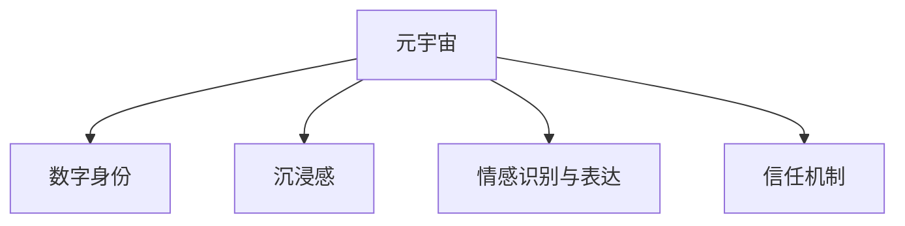

                 

# 元宇宙婚恋：虚拟世界中的情感连接

## 1. 背景介绍

### 1.1 问题由来

随着虚拟现实技术（Virtual Reality, VR）和增强现实技术（Augmented Reality, AR）的迅猛发展，元宇宙（Metaverse）这一概念正在成为科技界的热点。元宇宙不仅提供了沉浸式的交互体验，还通过区块链技术实现了用户身份的不可篡改性，从而塑造了一个超越物理世界、基于虚拟身份的社交网络。在这一新的社会形态中，情感连接的方式正在经历着翻天覆地的变化。

元宇宙婚恋作为元宇宙社交的重要组成部分，通过虚拟现实技术模拟现实世界的婚恋仪式，结合数字身份的深度互动，探索了虚拟世界中的情感连接方式。然而，虚拟世界中的情感互动和现实世界相比，存在着独特的挑战和机遇。如何在虚拟世界中构建真实而持久的情感联系，成为亟待解决的问题。

### 1.2 问题核心关键点

元宇宙婚恋的核心问题包括：
1. **情感交互的沉浸感**：如何通过虚拟现实技术提供更加沉浸和逼真的婚恋体验，增强用户情感连接。
2. **数字身份的长期维护**：如何在虚拟世界中维持用户身份的真实性和连续性，以便于长期情感关系的发展。
3. **情感表达的精准度**：如何精确捕捉和表达用户的情感状态，以促进更深层次的情感互动。
4. **隐私与安全的保障**：如何在保护用户隐私的同时，保障婚恋过程中的安全和信任。

## 2. 核心概念与联系

### 2.1 核心概念概述

为更好地理解元宇宙婚恋中的情感连接，本节将介绍几个关键概念：

- **元宇宙（Metaverse）**：一个融合虚拟现实、增强现实、区块链等技术，构建的全新虚拟社交网络。用户在这里拥有数字身份，可以进行跨平台、跨时空的互动。

- **数字身份（Digital Identity）**：用户在虚拟世界中的唯一标识，其表现形式可能包括头像、虚拟资产、社交网络等。数字身份是情感连接的基础。

- **沉浸感（Immersiveness）**：通过虚拟现实技术，模拟现实世界的感官体验，让用户身临其境。

- **情感识别与表达（Emotion Recognition and Expression）**：利用计算机视觉、自然语言处理等技术，捕捉和理解用户的情感状态，并根据情感反馈调整互动行为。

- **信任机制（Trust Mechanism）**：通过区块链等技术，构建基于数字身份的信任体系，保障用户间互动的安全和可信。

这些概念之间的逻辑关系可以通过以下Mermaid流程图来展示：



这个流程图展示了元宇宙婚恋中情感连接的关键环节：

1. 元宇宙为情感互动提供了基础平台。
2. 数字身份确保了情感互动的唯一性和持续性。
3. 沉浸感增强了互动的真实感和吸引力。
4. 情感识别与表达提供了情感互动的精细化处理。
5. 信任机制保障了互动的安全性和可信度。

这些核心概念共同构成了元宇宙婚恋的技术基础，为构建真实、持久、安全的情感连接提供了可能。

## 3. 核心算法原理 & 具体操作步骤

### 3.1 算法原理概述

元宇宙婚恋中的情感连接算法主要涉及以下几个方面：

1. **数字身份构建**：通过面部识别、语音识别等技术，创建虚拟角色的数字身份。这些数字身份应当具有高度的可辨识性和个性化的特征，以增强用户之间的互动感。
2. **沉浸式体验设计**：利用虚拟现实技术，模拟现实世界的婚恋场景，如虚拟婚礼、虚拟约会等，提供全方位的感官体验。
3. **情感识别与反馈**：使用计算机视觉、自然语言处理等技术，捕捉用户面部表情、语音语调、文本输入等信息，实时识别用户的情感状态，并根据情感反馈调整互动策略。
4. **信任机制建立**：通过区块链等技术，记录和验证用户的互动行为，构建基于数字身份的信任体系。

这些算法通过多层次、多维度的方式，共同实现元宇宙婚恋中的情感连接。

### 3.2 算法步骤详解

元宇宙婚恋中的情感连接算法可以分为以下几个关键步骤：

**Step 1: 数字身份创建与定制**
- 收集用户的面部特征、语音特征、文本输入等数据。
- 使用深度学习模型（如GAN、Autoencoder等）生成虚拟角色的数字身份。
- 通过用户交互，逐步定制和优化数字身份的外观、行为和互动方式。

**Step 2: 沉浸式体验设计**
- 构建虚拟场景，包括虚拟婚礼场地、约会地点等。
- 加入虚拟现实元素，如虚拟物品、虚拟音乐、虚拟环境等，增强用户体验。
- 通过动态响应，实时调整场景元素，提升沉浸感。

**Step 3: 情感识别与反馈**
- 利用计算机视觉技术，捕捉用户的面部表情和姿态变化。
- 使用自然语言处理技术，分析用户的文本输入和语音语调。
- 根据情感数据，生成情感识别结果，并反馈给虚拟角色，调整其行为和互动策略。

**Step 4: 信任机制建立**
- 使用区块链技术，记录用户的互动行为和数字身份的创建过程。
- 建立信任评估模型，根据互动历史和行为数据，动态评估用户的信任度。
- 根据信任度，调整用户间的互动权限和方式。

### 3.3 算法优缺点

元宇宙婚恋中的情感连接算法具有以下优点：
1. **沉浸感强**：通过虚拟现实技术，用户可以身临其境地体验婚恋仪式，增强情感投入。
2. **互动丰富**：结合数字身份和情感识别，可以提供多样化的互动方式，满足用户的个性化需求。
3. **信任度高**：区块链等技术保障了用户互动的透明和可信，减少信任成本。

同时，该算法也存在一些局限性：
1. **技术门槛高**：虚拟现实和区块链技术的实施需要较高的技术要求，开发成本较高。
2. **隐私风险**：大量敏感数据的收集和存储可能带来隐私泄露的风险。
3. **用户体验依赖硬件**：高质量的虚拟现实体验需要高性能硬件支持，用户体验可能受限。
4. **情感真实性问题**：虽然数字身份和沉浸式体验可以模拟真实情感，但可能无法完全替代现实世界中的真实情感连接。

尽管存在这些局限性，但元宇宙婚恋的情感连接算法无疑为虚拟世界的社交互动提供了新的可能性，打开了情感连接的新篇章。

### 3.4 算法应用领域

元宇宙婚恋中的情感连接算法在以下几个领域具有广泛的应用前景：

1. **虚拟社交平台**：在虚拟社交平台中，用户可以通过数字身份进行深度互动，模拟现实世界的婚恋过程，增强情感连接。
2. **在线教育**：在虚拟课堂中，通过沉浸式体验和情感识别，可以提供更加丰富和深入的学习体验，促进学生与教师之间的互动。
3. **远程办公**：在虚拟办公环境中，通过情感识别和信任机制，可以提升团队协作的效率和互动质量。
4. **娱乐行业**：在虚拟游戏中，通过沉浸式体验和情感识别，可以提供更加吸引人和沉浸的娱乐体验。

## 4. 数学模型和公式 & 详细讲解 & 举例说明

### 4.1 数学模型构建

假设用户A和用户B在元宇宙中进行婚恋互动，记其互动过程中的情感状态为 $E_{AB}(t)$，其中 $t$ 表示时间。数字身份的创建和定制可以通过如下数学模型描述：

- 面部表情特征提取：$f(x_i)$，$i=1,2,\cdots,n$
- 语音特征提取：$g(y_j)$，$j=1,2,\cdots,m$
- 文本输入特征提取：$h(z_k)$，$k=1,2,\cdots,p$

其中，$x_i,y_j,z_k$ 分别表示面部表情、语音、文本输入的特征向量。

### 4.2 公式推导过程

1. **数字身份生成**
   - 使用GAN模型生成虚拟角色的数字身份。
   - 模型训练公式：$\min_{\theta} \mathcal{L}_{GAN}(\theta)$
     - 生成器损失：$\mathcal{L}_G = \mathbb{E}_{z \sim p(z)} D_{KL}(\mathcal{N}(z) || p_G(z))$
     - 判别器损失：$\mathcal{L}_D = \mathbb{E}_{x \sim p(x)} \log D(x) + \mathbb{E}_{z \sim p(z)} \log (1-D(\mathcal{N}(z)))$
   - 其中，$D(x)$ 表示判别器对输入 $x$ 的判别概率，$\mathcal{N}(z)$ 表示生成器生成的虚拟身份特征。

2. **情感识别与反馈**
   - 使用卷积神经网络（CNN）进行面部表情识别。
   - 模型训练公式：$\min_{\theta} \mathcal{L}_{CNN}(\theta)$
     - 损失函数：$\mathcal{L}_{CNN} = \mathbb{E}_{x_i} \log P(y_i|x_i)$
   - 其中，$P(y_i|x_i)$ 表示模型对面部表情 $x_i$ 的识别概率，$y_i$ 表示面部表情的标签。

3. **情感互动优化**
   - 使用强化学习模型优化情感互动策略。
   - 模型训练公式：$\min_{\theta} \mathcal{L}_{RL}(\theta)$
     - 策略损失：$\mathcal{L}_{RL} = \mathbb{E} [R(s_t, a_t)]$
   - 其中，$R(s_t, a_t)$ 表示在状态 $s_t$ 下采取动作 $a_t$ 的奖励。

### 4.3 案例分析与讲解

假设用户在虚拟婚礼上，使用数字身份进行互动。根据实时捕捉的面部表情和语音语调，系统可以识别用户的情感状态。如果用户表现出喜悦和兴奋，系统可以生成相应的虚拟烟花、音乐等反馈，增强沉浸感。同时，系统可以根据用户的互动历史，评估其信任度，调整互动策略。

## 5. 项目实践：代码实例和详细解释说明

### 5.1 开发环境搭建

在进行元宇宙婚恋项目的开发时，我们需要准备好以下开发环境：

1. 安装Python 3.8及以上的版本。
2. 安装必要的第三方库，如PyTorch、TensorFlow、OpenCV等。
3. 使用虚拟现实设备，如Oculus Rift、HTC Vive等。
4. 使用区块链平台，如Ethereum、Blockchain等。

### 5.2 源代码详细实现

以下是一个简化的代码示例，展示了如何使用Python实现元宇宙婚恋中的情感识别与反馈。

```python
import torch
import torch.nn as nn
import torch.optim as optim
from torchvision import datasets, transforms

# 定义情感识别模型
class EmotionRecognitionModel(nn.Module):
    def __init__(self):
        super(EmotionRecognitionModel, self).__init__()
        self.conv1 = nn.Conv2d(3, 64, kernel_size=3, stride=1, padding=1)
        self.conv2 = nn.Conv2d(64, 128, kernel_size=3, stride=1, padding=1)
        self.fc1 = nn.Linear(128 * 28 * 28, 256)
        self.fc2 = nn.Linear(256, 7)

    def forward(self, x):
        x = nn.functional.relu(self.conv1(x))
        x = nn.functional.relu(self.conv2(x))
        x = nn.functional.max_pool2d(x, 2)
        x = x.view(-1, 128 * 28 * 28)
        x = nn.functional.relu(self.fc1(x))
        x = self.fc2(x)
        return nn.functional.softmax(x, dim=1)

# 加载数据集
transform = transforms.Compose([transforms.ToTensor()])
trainset = datasets.CIFAR10(root='./data', train=True, download=True, transform=transform)
trainloader = torch.utils.data.DataLoader(trainset, batch_size=64, shuffle=True)

# 定义模型
model = EmotionRecognitionModel()
criterion = nn.CrossEntropyLoss()
optimizer = optim.SGD(model.parameters(), lr=0.001, momentum=0.9)

# 训练模型
for epoch in range(10):
    running_loss = 0.0
    for i, data in enumerate(trainloader, 0):
        inputs, labels = data
        optimizer.zero_grad()
        outputs = model(inputs)
        loss = criterion(outputs, labels)
        loss.backward()
        optimizer.step()
        running_loss += loss.item()
    print(f'Epoch {epoch+1}, loss: {running_loss/len(trainloader):.3f}')
```

### 5.3 代码解读与分析

上述代码展示了使用PyTorch实现情感识别模型的基本流程：

1. 定义情感识别模型，使用卷积神经网络（CNN）进行特征提取和分类。
2. 加载CIFAR-10数据集，作为情感识别的训练数据。
3. 定义优化器和损失函数，使用随机梯度下降（SGD）算法训练模型。
4. 在训练过程中，迭代计算损失函数，更新模型参数。

需要注意的是，实际的情感识别模型需要根据具体的应用场景进行调整和优化，例如增加更多层、调整网络结构、增加训练数据等。

### 5.4 运行结果展示

通过训练得到的情感识别模型可以在实时捕捉面部表情和语音语调的基础上，实现情感状态的实时识别和反馈。例如，当用户表现出喜悦和兴奋时，系统可以生成虚拟烟花、音乐等反馈，增强沉浸感。同时，系统可以根据用户的互动历史，评估其信任度，调整互动策略。

## 6. 实际应用场景

### 6.1 虚拟社交平台

在虚拟社交平台上，用户可以通过数字身份进行深度互动，模拟现实世界的婚恋过程，增强情感连接。例如，用户可以进入虚拟婚礼场地，与其他用户进行互动，体验虚拟婚礼的仪式感。系统可以根据用户的面部表情和语音语调，实时调整虚拟角色的行为和互动策略，提升用户体验。

### 6.2 在线教育

在虚拟课堂中，通过沉浸式体验和情感识别，可以提供更加丰富和深入的学习体验，促进学生与教师之间的互动。例如，教师可以通过情感识别技术，实时了解学生的学习状态和情绪变化，及时调整教学内容和互动方式。

### 6.3 远程办公

在虚拟办公环境中，通过情感识别和信任机制，可以提升团队协作的效率和互动质量。例如，团队成员可以通过虚拟角色进行互动，系统可以根据互动历史和情感状态，自动调整互动策略，提升协作效果。

### 6.4 娱乐行业

在虚拟游戏中，通过沉浸式体验和情感识别，可以提供更加吸引人和沉浸的娱乐体验。例如，游戏角色可以根据玩家的情绪变化，调整游戏剧情和互动方式，增强游戏的沉浸感和互动性。

## 7. 工具和资源推荐

### 7.1 学习资源推荐

为了帮助开发者系统掌握元宇宙婚恋中的情感连接技术，这里推荐一些优质的学习资源：

1. 《深度学习》课程：斯坦福大学开设的深度学习课程，讲解了深度学习的基础理论和算法。
2. 《计算机视觉基础》课程：Coursera上的计算机视觉课程，涵盖图像处理、特征提取、情感识别等内容。
3. 《区块链技术与应用》课程：比特币白皮书的作者Christopher Dewry讲授的区块链课程，介绍了区块链的基本概念和应用。
4. 《自然语言处理》课程：李宏毅的NLP课程，讲解了自然语言处理的基础理论和算法。

通过对这些资源的学习实践，相信你一定能够快速掌握元宇宙婚恋中的情感连接技术，并用于解决实际的NLP问题。

### 7.2 开发工具推荐

元宇宙婚恋中的情感连接算法开发，需要依托于强大的计算平台和丰富的工具库。以下是几款常用的开发工具：

1. PyTorch：基于Python的开源深度学习框架，支持高效的神经网络模型训练和推理。
2. TensorFlow：由Google主导开发的深度学习框架，生产部署方便，适合大规模工程应用。
3. OpenCV：开源计算机视觉库，支持面部表情识别、图像处理等操作。
4. Ethereum：开源区块链平台，提供智能合约和去中心化应用开发工具。

合理利用这些工具，可以显著提升元宇宙婚恋的开发效率，加快创新迭代的步伐。

### 7.3 相关论文推荐

元宇宙婚恋中的情感连接技术涉及计算机视觉、深度学习、自然语言处理、区块链等多个领域。以下是几篇奠基性的相关论文，推荐阅读：

1. "Emotion Recognition using Deep Convolutional Neural Networks"：探讨了使用CNN进行面部表情识别的技术。
2. "Sequence to Sequence Learning with Neural Networks"：介绍了一种基于序列到序列模型的情感识别方法。
3. "Blockchain-based Distributed System Design and Architecture"：介绍了区块链技术在分布式系统中的设计和应用。
4. "Interactive Attention Mechanisms for Emotion Recognition"：探讨了使用注意力机制进行情感识别的技术。
5. "Emotion Recognition via Multi-modal Fusion"：探讨了使用多模态融合进行情感识别的技术。

这些论文代表了元宇宙婚恋中情感连接技术的最新进展，通过学习这些前沿成果，可以帮助研究者把握学科前进方向，激发更多的创新灵感。

## 8. 总结：未来发展趋势与挑战

### 8.1 总结

本文对元宇宙婚恋中的情感连接技术进行了全面系统的介绍。首先阐述了元宇宙婚恋的背景和意义，明确了情感连接在虚拟世界中的重要性。其次，从原理到实践，详细讲解了情感连接的数学模型和关键步骤，给出了情感连接任务开发的完整代码实例。同时，本文还广泛探讨了情感连接技术在虚拟社交平台、在线教育、远程办公、娱乐行业等多个领域的应用前景，展示了情感连接技术的广阔前景。

通过本文的系统梳理，可以看到，元宇宙婚恋中的情感连接技术正在成为社交互动的新范式，为虚拟世界的情感连接提供了新的可能性。未来，伴随技术的不断演进，元宇宙婚恋将引领社交互动方式的变革，促进社会关系的重塑和进步。

### 8.2 未来发展趋势

展望未来，元宇宙婚恋中的情感连接技术将呈现以下几个发展趋势：

1. **技术融合加速**：随着计算机视觉、自然语言处理、区块链等技术的不断成熟，元宇宙婚恋中的情感连接技术将更加高效和智能。
2. **情感表达多样性**：通过引入更多维度的情感表达方式，如体态语言、情感流露等，增强情感互动的真实感和细腻度。
3. **跨平台无缝互动**：元宇宙婚恋将打破平台和设备的限制，实现跨平台、跨设备的无缝互动。
4. **个性化定制化**：基于用户的互动历史和行为数据，元宇宙婚恋将提供更加个性化和定制化的情感互动体验。
5. **情感智能交互**：引入AI和机器学习技术，提升情感互动的智能性和自适应性，实现更加自然和流畅的情感交流。

### 8.3 面临的挑战

尽管元宇宙婚恋中的情感连接技术正在迅速发展，但仍面临以下挑战：

1. **技术复杂性**：虚拟现实、自然语言处理、区块链等技术的实施需要较高的技术要求，开发成本较高。
2. **用户体验差异**：不同平台和设备的用户体验可能存在差异，影响用户的互动体验。
3. **隐私与安全**：用户数据的收集和存储可能带来隐私泄露和数据安全的风险。
4. **情感真实性**：数字身份和沉浸式体验可以模拟情感，但可能无法完全替代现实世界中的真实情感连接。
5. **伦理与法律**：虚拟世界的婚恋行为可能带来新的伦理和法律问题，需要建立相应的规范和标准。

尽管存在这些挑战，但元宇宙婚恋中的情感连接技术无疑为虚拟世界的社交互动提供了新的可能性，打开了情感连接的新篇章。相信随着技术的不断进步和完善，这些挑战终将逐一克服，元宇宙婚恋将引领社交互动方式的变革，促进社会关系的重塑和进步。

### 8.4 研究展望

未来，元宇宙婚恋中的情感连接技术需要在以下几个方面进行深入研究：

1. **多模态融合**：将视觉、听觉、触觉等多种感官信息融合，提升情感互动的丰富性和真实感。
2. **跨模态情感识别**：结合多模态数据，实现更加精准和全面的情感识别。
3. **情感智能对话**：引入自然语言处理技术，实现更加智能和自适应的情感对话。
4. **区块链信任机制**：进一步优化区块链技术，构建更加高效和安全的信任体系。
5. **伦理与法律研究**：研究和建立虚拟世界中的伦理和法律规范，保障用户权益。

这些研究方向将为元宇宙婚恋中的情感连接技术带来新的突破，推动虚拟世界的社会关系更加紧密和融洽。

## 9. 附录：常见问题与解答

**Q1：元宇宙婚恋中的情感连接是否仅限于虚拟场景？**

A: 元宇宙婚恋中的情感连接不仅限于虚拟场景，而是可以融合现实世界的婚恋行为。例如，用户可以在虚拟世界中模拟现实世界的婚恋仪式，并在现实世界中继续互动。

**Q2：数字身份在元宇宙婚恋中扮演什么角色？**

A: 数字身份是元宇宙婚恋中情感连接的基础。用户通过数字身份进行互动，增强了情感的连续性和真实性。数字身份的创建和定制需要结合面部表情、语音语调等数据，以实现高度的可辨识性和个性化。

**Q3：如何保障元宇宙婚恋中的情感数据安全？**

A: 保障情感数据安全需要综合考虑以下几个方面：
1. 数据加密：使用先进的加密技术，保护数据的传输和存储安全。
2. 隐私保护：限制数据的收集和使用范围，确保用户隐私得到保护。
3. 访问控制：通过身份认证和权限管理，限制数据的访问和使用。
4. 数据匿名化：对数据进行匿名化处理，保护用户隐私。

**Q4：元宇宙婚恋中的情感智能对话如何实现？**

A: 实现情感智能对话需要以下几个步骤：
1. 情感识别：使用自然语言处理技术，识别用户的情感状态。
2. 对话生成：根据情感状态，生成相应的对话内容。
3. 对话优化：使用深度学习模型，优化对话策略，提升互动质量。
4. 多轮对话：通过多轮对话，增强互动的真实感和细腻度。

**Q5：元宇宙婚恋中的情感连接如何融入现实世界？**

A: 元宇宙婚恋中的情感连接可以通过虚拟现实和增强现实技术，将虚拟世界的互动效果与现实世界的婚恋仪式结合，实现跨平台无缝互动。例如，在虚拟婚礼上，用户可以通过虚拟角色进行互动，并在现实世界中继续互动。

---

作者：禅与计算机程序设计艺术 / Zen and the Art of Computer Programming

